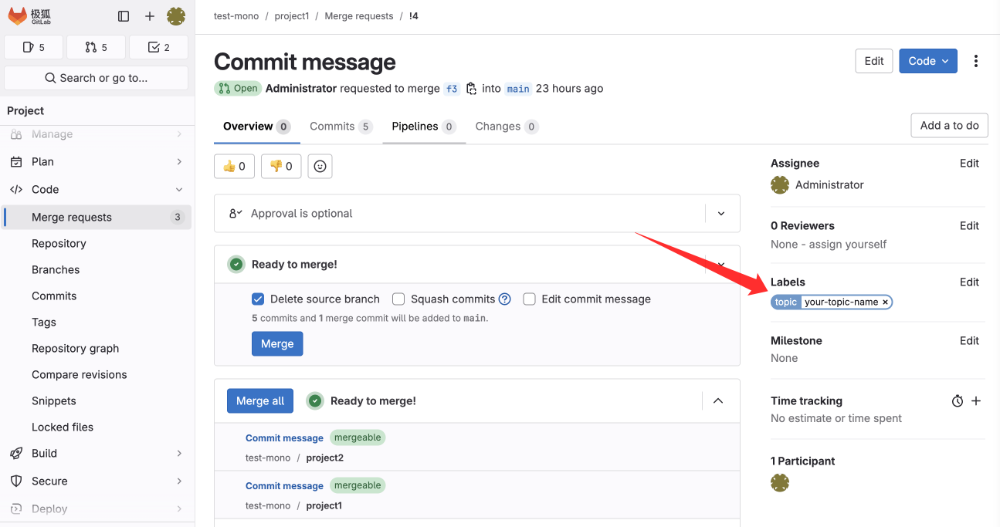
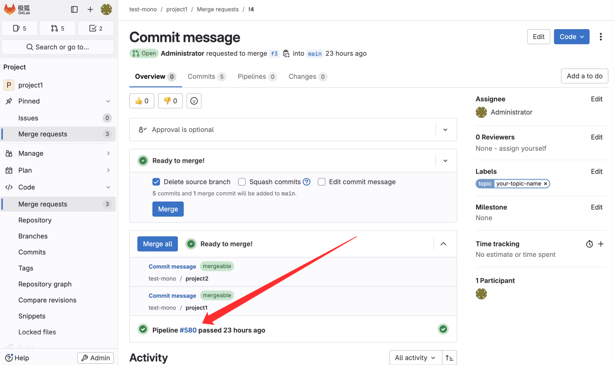



- Tier: 专业版，旗舰版
- Offering: 私有化部署



> - [引入](https://jihulab.com/gitlab-cn/gitlab/-/issues/2861)于极狐GitLab 16.4。[功能标志](../../user/feature_flags.md)为 `ff_monorepo`，默认禁用。
> - 多仓库 MR 只触发一条统一的主流水线[引入](https://jihulab.com/gitlab-cn/gitlab/-/issues/2861)于极狐GitLab 16.5。

在开发包含多个代码仓库的项目时，极狐GitLab 可以为开发人员提供终端工具 Mono 以集中化管理同一顶级群组下的多个仓库的代码提交，并进行统一的代码评审和合并等操作。
Mono 可以管理的多个代码仓库是指在同一个顶级群组下的仓库，包括父群组和子群组下的所有代码仓库。

极狐GitLab 和 Mono 客户端工具的版本对应如下：

| 极狐GitLab     | Mono          | 描述 |
|---------------|---------------|--------------------------------------------------------------|
| ≤ 16.3        | -             | 不支持 Mono 客户端 |
| 16.4          | <= 3.4        | 使用 mono upload 推送时，会自动创建带有 `monorepo` 标记的 MR。通过 `monorepo` 和源分支来关联 MR |
| 16.5 ~ 17.6   | 3.5 ～ 3.6    | 使用 mono upload 推送时，会自动创建带有 `monorepo` 标记的 MR，**并触发主流水线**。通过 `monorepo` 和源分支来关联 MR |
| 17.7 ~ 18.4   | 3.7           | 使用 mono upload 推送时，如果传递 `-o` 参数，会自动创建带有 Topic 标记的 MR，并触发主流水线。只通过 Topic 标记关联 MR，不再使用 `monorepo` 标记和源分支关联 |
| ≥ 18.5        | ≥ 3.8         | 在 MR 中编辑 Topic Label 将会触发主流水线；使用 mono upload 推送时，会将 `MANIFEST_FILE` 变量写入主流水线；Manifest 支持更多参数 `<push-options>`、`<mr-title-suffix>`、`mono-upload-create-mr-for-business-projects`、`mono-upload-create-mr-for-central-ci-project`、`central-ci-pipeline-must-success`|

## 使用 Mono 提交 MR

使用 Mono 提交多仓库 MR：

1. 参考[如何安装 Mono 与基本工作流程](getting-started.md)中的描述正确安装并初始化完成 Mono。
2. 打开终端并输入 `mono sync`，将 manifest 文件中配置的多个项目中的代码下载到本地。
3. 下载成功后，您可以使用 `mono info` 命令查看本地项目的信息。
4. 在仓库中创建分支。
   - 在本地的当前仓库中创建分支：`mono start FEATURE_BRANCH_NAME .`
   - 在指定的仓库中创建分支：`mono start FEATURE_BRANCH_NAME PROJECT_NAME`
   - 在本地的所有仓库中创建分支：`mono start FEATURE_BRANCH_NAME --all`
5. 在本地进行代码变更。
6. 输入 `mono sync` 检查是否存在代码冲突。更多有关命令行选项的内容，请参阅[命令行选项](command-line-options.md)。
7. 输入 `mono upload` 将本地代码变更推送到远端仓库。推送成功后，系统会自动在对应的仓库中创建 MR。您可以在推送代码时使用 `-o` 参数为 MR 创建 [范围标记](https://gitlab.cn/docs/jh/user/project/labels.html#%E8%8C%83%E5%9B%B4%E6%A0%87%E8%AE%B0-premium-all)：`mono upload -o topic=your-topic-name`；您也可以在 MR 页面上手动添加/更换范围标记。

NOTE:
在极狐GitLab 17.6 及之前的版本中，MR 的关联条件是：相同源分支且拥有 `monorepo` 标记。
在极狐GitLab 17.7 及之后的版本中，MR 的关联条件是：拥有相同范围标记（Scoped Label）且标记的 Key 为 `topic`。



## 合并 MR

对于通过 Mono 创建的多仓库 MR，可以使用 **全部合并** 按钮一次性合并关联的所有 MR。

必须满足以下条件，**全部合并** 按钮才会在页面上显示为可用。

- 您必须具有通过 Mono 管理的所有项目的合并权限。
- MR 都标有 `可以合并` 的标签。`可以合并` 标签取决于流水线是否成功和 MR 是否符合用户设置的合并规则等条件。
- 当前没有其他 MR 列表正在合并。

NOTE:
如果在点击 **全部合并** 之后，某个 MR 因发生问题而中断，其他 MR 不会受其影响，可以正常合并。之后您需要手动修复那些合并失败的 MR，将其恢复到正常状态后，再次点击 **全部合并**。

## 多仓库 MR 触发一条统一的主流水线

如果用户希望在提交多仓库 MR 时触发一次统一的流水线，用来集中测试或实现其他用途，用户可以配置主流水线。

详细步骤如下：

1. 参考[如何安装 Mono 与基本工作流程](getting-started.md)中的描述正确安装并初始化完成 Mono。
2. 在顶级群组下，新建一个专门用于运行主流水线的项目，项目名称必须为 `monorepo-ci-project` 并且该项目仓库中必须有 `main` 分支。
3. 在[安装准备](getting-started.md#installation-preparation)部分中包含的 manifest 文件中配置 `gitlab-url` 的地址，如 `gitlab-url=http://127.0.0.1:3000`，并添加 `enable-central-ci-pipeline="true"` 字段。示例如下：

   ```xml
   <?xml version="1.0" encoding="UTF-8"?>
   <manifest>
     <remote  name="origin"  fetch=".." />
     <default revision="main"
              remote="origin"
              sync-j="4"
              gitlab-url="http://127.0.0.1:3000"
              enable-central-ci-pipeline="true" />
     <project path="PROJECTA" name="root-group-for-testing-mono/PROJECTA" />
     <project path="sub-group/PROJECTB" name="root-group-for-testing-mono/sub-group/PROJECTB" />
     <project path="sub-group/PROJECTC" name="root-group-for-testing-mono/sub-group/PROJECTC" />
   </manifest>
   ```

4. 在终端中，输入 `mono init` 将配置文件下载到本地。
5. 输入 `mono sync` 同步 manifest 文件中配置的远端代码库。
6. 下载成功后，您可以使用 `mono info` 命令查看本地项目的信息。
7. 在仓库中创建分支。
   - 在本地的当前仓库中创建分支：`mono start FEATURE_BRANCH_NAME .`
   - 在指定的仓库中创建分支：`mono start FEATURE_BRANCH_NAME PROJECT_NAME`
   - 在本地的所有仓库中创建分支：`mono start FEATURE_BRANCH_NAME --all`
8. 在本地进行代码变更。
9. 输入 `mono sync` 检查是否存在代码冲突。更多有关命令行选项的内容，请参阅[命令行选项](command-line-options.md)。
10. 输入 `mono upload -o topic=<your-topic-name>` 将本地代码变更推送到远端仓库。推送成功后，系统会自动在对应的仓库中创建 MR。此时终端会显示以下内容：

    ```bash
    Personal Access Token is required for central ci project operations.
    Documentation: https://docs.gitlab.cn/jh/user/profile/personal_access_tokens.html
    Please enter your Token (Press Enter to skip):
    ```

11. Mono 需要调用极狐GitLab API 触发流水线，所以您需要输入您的极狐GitLab 的个人访问令牌。获取个人访问令牌：
    - 选择左上角的个人头像。
    - 选择 **偏好设置**。
    - 在左侧边栏中，选择 **访问令牌**。
    - 选择 **添加新令牌**。
    - 输入您的令牌名称并选择到期时间。在 **选择范围** 下，勾选 **api**。
    - 选择 **创建个人访问令牌**。
12. 复制您的个人访问令牌，并将其粘贴到终端的 `Please enter your Token (Press Enter to skip):` 后面。如果主流水线创建成功，终端会显示以下内容（假设 URL 地址为 `http://127.0.0.1:3000`，顶级群组的名称为 `top-level-group-name`，成功创建的主流水线的 ID 为 `678`）：

    ```bash
    Triggered pipeline: http://127.0.0.1:3000/top-level-group-name/monorepo-ci-project/-/pipelines/678 (topic::your-topic-name)
    ```


点击进入多仓库 MR 页面，您可以看到 MR 列表下成功触发了一条主流水线。主流水线中会设置以下环境变量：

- `MONOREPO_TOPIC_LABEL`：对应多仓库 MR 的范围标记（Scoped Label），例如 `topic::your-topic-name`。
- `MANIFEST_FILE`：触发本次主流水线所使用的 manifest 文件名（例如 `default.xml`）。Mono 会从工作目录下的 `.repo/manifest.xml` 文件中的 `<include>` 标签中解析得到原始 manifest 文件名。
- 通过 `<push-options>` 和 `<central-ci-project>` 中的 `ci.variable='KEY=value'` 配置解析得到的各类自定义变量。
- 如果在 `<default>` 中配置了 `central-ci-pipeline-must-success="true"`，还会注入 `CENTRAL_CI_PIPELINE_MUST_SUCCESS=true`，便于在 `.gitlab-ci.yml` 中基于该变量编写更严格的合并策略。

Mono 会在本地保存您输入的个人访问令牌。当您后续继续提交多仓库 MR 触发流水线时，您无需再次输入个人访问令牌。



在上述基础上，您还可以通过 Manifest 进一步控制主流水线和 MR 的行为。

### 使用 `<push-options>` 传递 CI 变量和 MR 选项

在 Manifest 中可以使用 `<push-options>` 元素，为主流水线项目（`monorepo-ci-project`）以及业务项目统一配置 Git Push Options：

```xml
<manifest>
  <remote  name="origin"  fetch=".." />
  <default revision="main"
           remote="origin"
           sync-j="4"
           gitlab-url="http://127.0.0.1:3000"
           enable-central-ci-pipeline="true" />

  <push-options>
    <central-ci-project>
      <!-- 为主流水线注入 CI 变量 -->
      <option>ci.variable="BUILD_ENV=production"</option>
      <option>ci.variable="MAX_RETRIES=10"</option>

      <!-- 当自动创建主流水线项目 MR 时使用的 MR 选项 -->
      <option>merge_request.assign=root</option>
      <option>merge_request.title=[CI] Auto MR</option>
      <option>merge_request.description=Auto MR for central ci project</option>
      <option>merge_request.label=ci</option>
      <option>merge_request.squash</option>
    </central-ci-project>

    <business-projects>
      <!-- 对所有业务项目的 mono upload 推送统一追加 Push Options -->
      <option>merge_request.squash</option>
      <option>merge_request.label=backend</option>
    </business-projects>
  </push-options>
</manifest>
```

- `<central-ci-project>` 下的 `<option>` 会在触发主流水线时解析：
  - 形如 `ci.variable='KEY=value'` 或 `ci.variable="KEY=value"` 的配置会被解析为 CI 变量，并与 `MONOREPO_TOPIC_LABEL`、`MANIFEST_FILE` 一起传入主流水线。
  - 形如 `merge_request.*=...` 的配置会在自动为主流水线项目创建 MR 时生效，用于控制 MR 的指派人、标题、描述、标记以及是否开启 squash 等。
- `<business-projects>` 下的 `<option>` 会在执行 `mono upload` 时，统一以 `git push -o <option>` 的形式追加到所有业务项目的推送中。典型用途包括：
  - 强制业务项目 MR 使用 squash 合并：`merge_request.squash`
  - 为所有业务项目 MR 添加统一标记：`merge_request.label=backend`

### 使用 `<mr-title-suffix>` 统一 MR 标题后缀

在 Manifest 中配置 `<mr-title-suffix>` 可以为自动创建的 MR 标题追加统一后缀，便于在列表中快速识别自动创建的 MR：

```xml
<manifest>
  ...
  <mr-title-suffix>
    <central-ci-project>[CI-AUTO]</central-ci-project>
    <business-projects>[AUTO]</business-projects>
  </mr-title-suffix>
</manifest>
```

- `central-ci-project`：用于主流水线项目中由 Mono 自动创建的 MR，最终标题形如：`This is MR Title [CI-AUTO]`。
- `business-projects`：用于业务项目中由 `mono upload` 自动创建的 MR。Mono 会取该项目第一个提交的提交说明作为 MR 标题，并在末尾追加此后缀，例如：`Fix login bug [AUTO]`。

### 控制业务项目与主流水线项目的 MR 自动创建行为

在 `<default>` 元素中提供以下属性，用于控制 `mono upload` 过程中的 MR 自动创建行为：

```xml
<default revision="main"
         remote="origin"
         sync-j="4"
         gitlab-url="http://127.0.0.1:3000"
         enable-central-ci-pipeline="true"
         mono-upload-create-mr-for-business-projects="true"
         mono-upload-create-mr-for-central-ci-project="false"
         central-ci-pipeline-must-success="false" />
```

- `mono-upload-create-mr-for-business-projects`（默认值：`true`）：
  - 当为 `true` 时，执行 `mono upload` 会为所有有改动的业务项目自动创建 MR，并根据 `<mr-title-suffix>` 和 `<push-options>` 中的配置设置 MR 标题、标签等属性。
  - 当为 `false` 时，`mono upload` 只会推送代码分支，不再为业务项目自动创建 MR，您需要手动创建 MR。
- `mono-upload-create-mr-for-central-ci-project`（默认值：`false`）：
  - 当为 `true` 且项目已启用主流水线（`enable-central-ci-pipeline="true"`）时，Mono 会在 `monorepo-ci-project` 中为每个 Topic 自动创建一个临时分支和 MR，MR 创建成功后会立即自动关闭。
  - 这些 MR 不包含实际代码改动，主要用于在主流水线项目中启用与 Topic 相关的 **全部合并** 场景，避免影响其他项目的正常合并。
- `central-ci-pipeline-must-success`（默认值：`false`）：
  - 当为 `true` 时，Mono 触发主流水线时会额外注入 `CENTRAL_CI_PIPELINE_MUST_SUCCESS=true`。
  - 推荐在主流水线项目的 `.gitlab-ci.yml` 中基于此变量编写规则，例如只有当主流水线全部成功时，才允许后续使用 **全部合并** 功能。

您可以在 `monorepo-ci-project` 的 `.gitlab-ci.yml` 中结合上述变量实现更精细的测试矩阵和合并策略控制。
