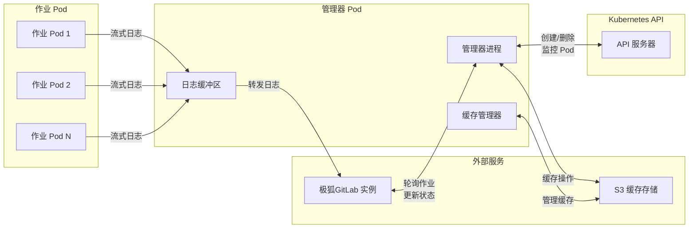
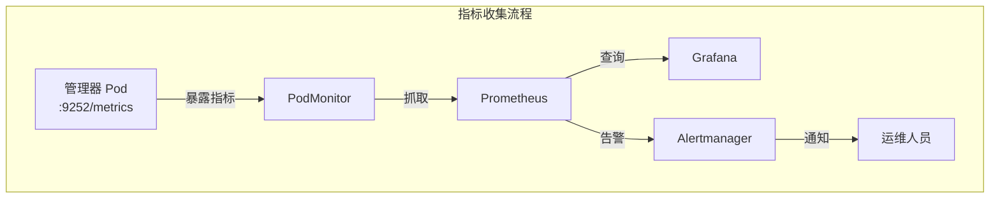
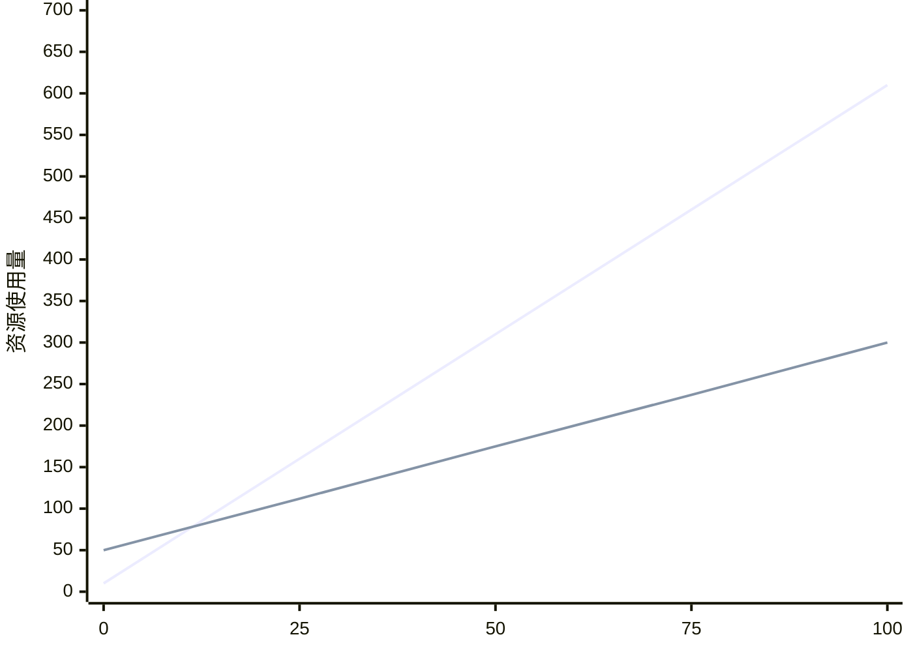
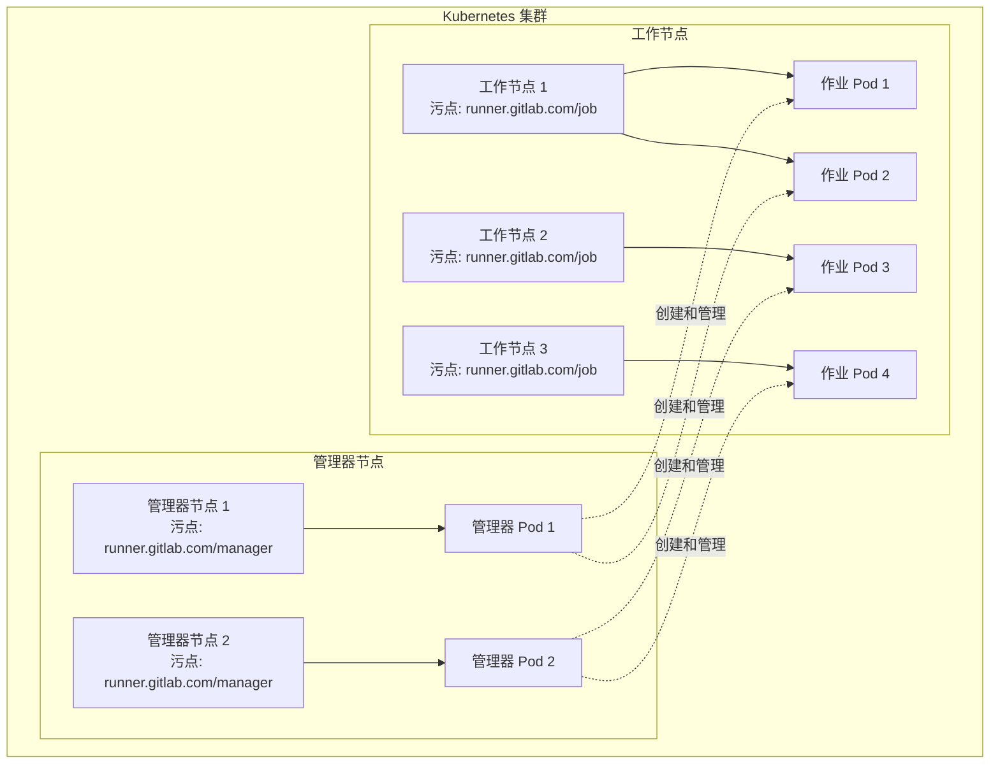



- Tier: 基础版，专业版，旗舰版
- Offering: JihuLab.com，私有化部署



为了在 Kubernetes 环境中监控和优化极狐GitLab Runner 管理器 Pod 性能，极狐GitLab 推荐以下最佳实践。应用它们以识别性能瓶颈并实施解决方案，实现最优 CI/CD 流水线执行。

<a id="prerequisites"></a>

## 先决条件

在实施这些建议之前：

- 使用 [Kubernetes 执行器](https://gitlab.cn/docs/runner/executors/kubernetes/) 在 Kubernetes 中部署极狐GitLab Runner
- 拥有对 Kubernetes 集群的管理员访问权限
- 为极狐GitLab Runner 配置 [Prometheus 监控](../../administration/monitoring/_index.md)
- 对 Kubernetes 资源管理有基本了解

<a id="gitlab-runner-manager-pod-responsibilities"></a>

## 极狐GitLab Runner 管理器 Pod 职责

极狐GitLab Runner 管理器 Pod 协调 Kubernetes 中所有 CI/CD 作业的执行。其性能直接影响您的流水线效率。

它处理：

- **日志处理**：从作业 Pod 收集作业日志并将其转发到极狐GitLab
- **缓存管理**：协调本地和基于云的缓存操作
- **Kubernetes API 请求**：创建、监控和删除作业 Pod
- **极狐GitLab API 通信**：轮询作业并报告状态更新
- **Pod 生命周期管理**：管理工作 Pod 的供应和清理



每个职责对性能的影响不同：

- **CPU 密集型**：Kubernetes API 操作、日志处理
- **内存密集型**：日志缓冲、作业队列管理
- **网络密集型**：极狐GitLab API 通信、日志流传输

<a id="deploy-gitlab-runner-in-kubernetes"></a>

## 在 Kubernetes 中部署极狐GitLab Runner

通过 [极狐GitLab Runner Operator](https://jihulab.com/gitlab-cn/gl-openshift/gitlab-runner-operator) 安装极狐GitLab Runner。该 Operator 会持续接收新功能和改进。
极狐GitLab Runner 团队通过 [实验性 GRIT 框架](https://jihulab.com/gitlab-cn/ci-cd/runner-tools/grit/-/tree/main/scenarios/google/gke/operator?ref_type=heads) 安装该 Operator。
在 Kubernetes 中安装极狐GitLab Runner 的最简单方法是应用[最新发布的 `operator.k8s.yaml` 清单](https://jihulab.com/gitlab-cn/gl-openshift/gitlab-runner-operator/-/releases)，然后遵循 [Operator 安装文档](https://gitlab.cn/docs/runner/install/operator/#install-on-kubernetes) 中的说明。

<a id="configure-monitoring"></a>

## 配置监控

可观测性对于 Kubernetes 中的极狐GitLab Runner 管理至关重要，因为 Pod 是短暂的，而指标提供了主要的运维可见性。
对于监控，请安装 [`kube-prometheus-stack`](https://github.com/prometheus-community/helm-charts/blob/main/charts/kube-prometheus-stack/README.md)。
要为 Operator 配置监控，请参阅 [监控极狐GitLab Runner Operator](https://gitlab.cn/docs/runner/monitoring#monitor-gitlab-runner-operator)。

<a id="performance-monitoring"></a>

## 性能监控

有效的监控对于保持管理器 Pod 的最佳性能至关重要。



<a id="key-performance-metrics"></a>

### 关键性能指标

监控以下基本指标：

| 指标                                               | 描述                        | 性能指标            |
|----------------------------------------------------|----------------------------|--------------------|
| `gitlab_runner_jobs`                               | 当前运行的作业数              | 作业队列饱和度       |
| `gitlab_runner_limit`                              | 配置的作业并发限制            | 容量利用率          |
| `gitlab_runner_request_concurrency_exceeded_total` | 超过并发限制的请求数          | API 节流            |
| `gitlab_runner_errors_total`                       | 捕获的错误总数                | 系统稳定性          |
| `container_cpu_usage_seconds_total`                | 容器 CPU 使用量              | 资源消耗            |
| `container_memory_working_set_bytes`               | 容器内存使用量                | 内存压力            |

<a id="prometheus-queries"></a>

### Prometheus 查询

使用以下查询跟踪管理器 Pod 性能：

```prometheus
# 管理器 Pod 内存使用量（MB）
container_memory_working_set_bytes{pod=~"gitlab-runner.*"} / 1024 / 1024

# 管理器 Pod CPU 使用率（毫核）
rate(container_cpu_usage_seconds_total{pod=~"gitlab-runner.*"}[5m]) * 1000

# 作业队列饱和度
gitlab_runner_jobs / gitlab_runner_limit

# 每个 Runner 的作业数
gitlab_runner_jobs

# API 请求速率
sum(rate(apiserver_request_total[5m]))
```

<a id="example-dashboard"></a>

### 示例仪表盘

以下仪表盘展示了使用前面描述的 Prometheus 查询的所有 Pod 中管理器 Pod 的利用率：


此仪表盘可帮助您可视化：

- 各管理器 Pod 的内存使用趋势
- 作业执行期间的 CPU 使用模式
- 作业队列饱和度水平
- 单个 Pod 的资源消耗

<a id="identify-overloaded-manager-pods"></a>

## 识别过载的管理器 Pod

在性能下降影响您的流水线之前识别出来。

<a id="resource-utilization-indicators"></a>

### 资源利用率指标

默认情况下，极狐GitLab Runner Operator 不会对管理器 Pod 应用 CPU 或内存限制。
要设置资源限制，请运行：

```shell
kubectl patch deployment gitlab-runner -p '{"spec":{"template":{"spec":{"containers":[{"name":"gitlab-runner","resources":{"requests":{"cpu":"500m","memory":"256Mi"},"limits":{"cpu":"1000m","memory":"512Mi"}}}]}}}}'
```

> [!note]
> 允许从 Operator 配置进行部署修补的功能正在开发中。
> 更多信息，请参见合并请求 197。

**高 CPU 使用模式：**

- 标准操作期间 CPU 持续高于 70%
- 作业创建期间 CPU 峰值超过 90%
- 持续高 CPU 但无相应作业活动

**内存消耗趋势：**

- 内存使用量超过分配限制的 80%
- 内存持续增长而工作负载无增加
- 管理器 Pod 日志中出现 OOM（内存不足）事件

<a id="performance-degradation-signs"></a>

### 性能下降迹象

留意以下运行症状：

- 作业比通常更长时间保持挂起状态
- Pod 创建时间超过 30 秒
- 极狐GitLab 作业界面中日志输出延迟
- 日志中出现 `etcdserver: request timed out` 错误

<a id="diagnostic-commands"></a>

### 诊断命令

```shell
# 当前资源使用情况
kubectl top pods --containers

> POD                                                 NAME              CPU(cores)   MEMORY(bytes)
> gitlab-runner-runner-86cd68d899-m6qqm               runner            7m           32Mi

# 检查性能错误
kubectl logs gitlab-runner-runner-86cd68d899-m6qqm --since=2h | grep -E "(error|timeout|failed)"
```

<a id="resource-configuration"></a>

## 资源配置

合适的资源配置对于实现最佳性能至关重要。

<a id="performance-testing-methodology"></a>

### 性能测试方法

极狐GitLab Runner 管理器 Pod 性能是使用一个最大化日志输出的作业进行测试的：

<details>
<summary>性能测试作业定义</summary>

```yaml
performance_test:
  stage: build
  timeout: 30m
  tags:
    - kubernetes_runner
  image: alpine:latest
  parallel: 100
  variables:
    FILE_SIZE_MB: 4
    CHUNK_SIZE_BYTES: 1024
    FILE_NAME: "test_file_${CI_JOB_ID}_${FILE_SIZE_MB}MB.dat"
    KUBERNETES_CPU_REQUEST: "200m"
    KUBERNETES_CPU_LIMIT: "200m"
    KUBERNETES_MEMORY_REQUEST: "200Mi"
    KUBERNETES_MEMORY_LIMIT: "200Mi"
  script:
    - echo "开始性能测试作业 ${CI_PARALLEL_ID}/${CI_PARALLEL_TOTAL}，文件大小 ${FILE_SIZE_MB}MB，块大小 ${CHUNK_SIZE_BYTES} 字节"
    - dd if=/dev/urandom of="${FILE_NAME}" bs=1M count=${FILE_SIZE_MB}
    - echo "文件生成成功。大小："
    - ls -lh "${FILE_NAME}"
    - echo "以 ${CHUNK_SIZE_BYTES} 字节块读取文件"
    - |
      TOTAL_SIZE=$(stat -c%s "${FILE_NAME}")
      BLOCKS=$((TOTAL_SIZE / CHUNK_SIZE_BYTES))
      echo "处理 $BLOCKS 个块，每个块 $CHUNK_SIZE_BYTES 字节"
      for i in $(seq 0 99 $BLOCKS); do
        echo "处理块 $i 到 $((i+99))"
        dd if="${FILE_NAME}" bs=${CHUNK_SIZE_BYTES} skip=$i count=100 2>/dev/null | xxd -l $((CHUNK_SIZE_BYTES * 100)) -c 16
        sleep 0.5
      done
```

</details>

该测试每个作业生成 4 MB 日志输出，达到默认的 [`output_limit`](https://gitlab.cn/docs/runner/configuration/advanced-configuration/#the-runners-section)，从而对管理器 Pod 的日志处理能力进行压力测试。

**测试结果：**

| 并行作业数 | 峰值 CPU 使用量 | 峰值内存使用量 |
|------------|-----------------|-----------------|
| 50         | 308m            | 261 MB          |
| 100        | 657m            | 369 MB          |



**关键发现：**

- CPU 使用量随并发作业近似线性增长
- 内存使用量随作业数增长但非线性
- 所有作业并发运行，无排队

<a id="cpu-requirements"></a>

### CPU 要求

基于极狐GitLab 性能测试，计算管理器 Pod CPU 需求：

管理器 Pod CPU = 基础 CPU + (并发作业数 × 每个作业 CPU 因子)

其中：

- 基础 CPU：10m（基线开销）
- 每个作业 CPU 因子：每个并发作业约 6m（基于测试）

**基于测试结果的示例：**

对于 50 个并发作业：

```yaml
resources:
  requests:
    cpu: "310m" # 10m + (50 × 6m) = 310m
  limits:
    cpu: "465m" # 50% 的突发流量余量
```

对于 100 个并发作业：

```yaml
resources:
  requests:
    cpu: "610m" # 10m + (100 × 6m) = 610m
  limits:
    cpu: "915m" # 50% 余量
```

<a id="memory-requirements"></a>

### 内存要求

基于极狐GitLab 测试，计算内存需求：

管理器 Pod 内存 = 基础内存 + (并发作业数 × 每个作业内存)

其中：

- 基础内存：50 MB（基线开销）
- 每个作业内存：每个并发作业约 2.5 MB（基于 4MB 日志输出）

**基于测试结果的示例：**

对于 50 个并发作业：

```yaml
resources:
  requests:
    memory: "175Mi" # 50 + (50 × 2.5) = 175 MB
  limits:
    memory: "350Mi" # 100% 余量
```

对于 100 个并发作业：

```yaml
resources:
  requests:
    memory: "300Mi" # 50 + (100 × 2.5) = 300 MB
  limits:
    memory: "600Mi" # 100% 余量
```

> [!note]
> 内存使用量因日志量而异。生成超过 4 MB 日志的作业需要按比例增加内存。

<a id="configuration-examples"></a>

### 配置示例

**小规模（1-20 个并发作业）：**

```yaml
resources:
  limits:
    cpu: 300m
    memory: 256Mi
  requests:
    cpu: 150m
    memory: 128Mi

runners:
  config: |
    concurrent = 20

    [[runners]]
      limit = 20
      request_concurrency = 5
```

**大规模（75+ 个并发作业）：**

```yaml
resources:
  limits:
    cpu: 1000m
    memory: 1Gi
  requests:
    cpu: 600m
    memory: 600Mi

runners:
  config: |
    concurrent = 150

    [[runners]]
      limit = 150
      request_concurrency = 20
```

<a id="horizontal-pod-autoscaler"></a>

### 水平 Pod 自动扩缩器

配置自动扩缩：

```yaml
apiVersion: autoscaling/v2
kind: HorizontalPodAutoscaler
metadata:
  name: gitlab-runner-hpa
spec:
  scaleTargetRef:
    apiVersion: apps/v1
    kind: Deployment
    name: gitlab-runner
  minReplicas: 2
  maxReplicas: 5
  metrics:
    - type: Resource
      resource:
        name: cpu
        target:
          type: Utilization
          averageUtilization: 70
    - type: Resource
      resource:
        name: memory
        target:
          type: Utilization
          averageUtilization: 80
```

<a id="troubleshoot-performance-issues"></a>

## 排查性能问题

使用以下解决方案解决常见的管理器 Pod 性能问题。

<a id="api-rate-limiting"></a>

### API 速率限制

**问题：** 管理器 Pod 超出 Kubernetes API 速率限制。

**解决方案：** 优化 API 轮询：

```toml
[[runners]]
  [runners.kubernetes]
    poll_interval = "5s"  # 从默认的 3s 增加
    poll_timeout = "180s"
```

<a id="performance-optimization"></a>

## 性能优化

在具有挑战性的场景中应用这些性能优化策略。

<a id="cache-optimization"></a>

### 缓存优化

配置分布式缓存以减少管理器 Pod 负载。此操作通过共享缓存文件减少了作业 Pod 所需的计算量：

```toml
[runners.cache]
  Type = "s3"
  Shared = true

  [runners.cache.s3]
    ServerAddress = "cache.example.com"
    BucketName = "gitlab-runner-cache"
    PreSignedURLDisabled = false
```

<a id="node-segregation"></a>

## 节点隔离

通过使用专用节点将管理器 Pod 与作业 Pod 隔离，以确保稳定的性能并防止资源争用。这种隔离可防止作业 Pod 干扰关键的管理器 Pod 操作。



<a id="configure-node-taints"></a>

### 配置节点污点

**对于管理器节点：**

```shell
# 为专用于管理器 Pod 的节点打污点
kubectl taint nodes <manager-node-name> runner.gitlab.com/manager=:NoExecute

# 为节点打标签以便选择
kubectl label nodes <manager-node-name> runner.gitlab.com/workload-type=manager
```

**对于工作节点：**

```shell
# 为专用于作业 Pod 的节点打污点
kubectl taint nodes <worker-node-name> runner.gitlab.com/job=:NoExecute

# 为节点打标签以便作业调度
kubectl label nodes <worker-node-name> runner.gitlab.com/workload-type=job
```

<a id="configure-manager-pod-scheduling"></a>

### 配置管理器 Pod 调度

更新极狐GitLab Runner Operator 配置，使管理器 Pod 仅在专用节点上调度：

```yaml
apiVersion: apps.gitlab.com/v1beta2
kind: Runner
metadata:
  name: gitlab-runner
spec:
  gitlabUrl: https://gitlab.example.com
  token: gitlab-runner-secret
  buildImage: alpine
  podSpec:
    name: "manager-node-affinity"
    patch: |
      {
        "spec": {
          "nodeSelector": {
            "runner.gitlab.com/workload-type": "manager"
          },
          "tolerations": [
            {
              "key": "runner.gitlab.com/manager",
              "operator": "Exists",
              "effect": "NoExecute"
            }
          ]
        }
      }
    patchType: "strategic"
```

<a id="configure-job-pod-scheduling"></a>

### 配置作业 Pod 调度

通过更新 `config.toml` 确保作业 Pod 仅在工作节点上运行。

```toml
[runners.kubernetes.node_selector]
"runner.gitlab.com/workload-type" = "job"

[runners.kubernetes.node_tolerations]
"runner.gitlab.com/job=" = "NoExecute"
```

**节点隔离的好处：**

- 为管理器 Pod 提供不被打扰的专用资源
- 没有资源争用的可预测性能
- 使用专用节点时可以选择不设置资源限制
- 通过基于节点的扩缩简化容量规划

<a id="emergency-procedures"></a>

### 应急程序

**优雅重启：**

```shell
# 缩小规模以停止接受新作业
kubectl scale deployment gitlab-runner --replicas=0

# 等待活动作业完成（最多 10 分钟）
timeout 600 bash -c 'while kubectl get pods -l job-type=user-job | grep Running; do sleep 10; done'

# 恢复规模
kubectl scale deployment gitlab-runner --replicas=1
```

<a id="capacity-planning"></a>

## 容量规划

这些计算基于每个作业 4 MB 日志输出的测试。您的资源需求可能因以下因素而异：

- 每个作业的日志量
- 作业执行模式
- 缓存使用情况
- 到极狐GitLab 的网络延迟

使用以下 Python 函数计算最佳资源：

```python
def calculate_manager_resources(concurrent_jobs, avg_log_mb_per_job=4):
    """计算基于性能测试的管理器 Pod 资源。"""
    # CPU：每个并发作业约 6m + 10m 基础值
    base_cpu = 0.01  # 10m
    cpu_per_job = 0.006  # 每个作业 6m
    total_cpu = base_cpu + (concurrent_jobs * cpu_per_job)

    # 内存：每个作业约 2.5MB + 50MB 基础值（适用于 4MB 日志输出）
    base_memory = 50
    memory_per_job = 2.5 * (avg_log_mb_per_job / 4)  # 根据日志大小缩放
    total_memory = base_memory + (concurrent_jobs * memory_per_job)

    return {
        'cpu_request': f"{int(total_cpu * 1000)}m",
        'cpu_limit': f"{int(total_cpu * 1.5 * 1000)}m",  # 50% 余量
        'memory_request': f"{int(total_memory)}Mi",
        'memory_limit': f"{int(total_memory * 2.0)}Mi"  # 100% 余量
    }
```

<a id="performance-thresholds"></a>

## 性能阈值

建立主动干预的阈值：

| 指标 | 警告 | 严重 | 所需操作 |
|------|------|------|----------|
| CPU 使用量 | 持续 70% | 持续 85% | 扩容或优化 |
| 内存使用量 | 限制的 80% | 限制的 90% | 增加限制 |
| API 错误率 | 请求的 2% | 请求的 5% | 调查瓶颈 |
| 作业队列时间 | 30 秒 | 2 分钟 | 检查容量 |

<a id="related-topics"></a>

## 相关主题

- [极狐GitLab Runner 集群配置和最佳实践](gitlab_runner_fleet_config_and_best_practices.md) - 作业 Pod 性能优化
- [极狐GitLab Runner 执行器](https://gitlab.cn/docs/runner/executors/) - 执行环境性能特征
- [极狐GitLab Runner 监控](../../administration/monitoring/_index.md) - 通用监控设置
- [规划和运维 Runner 集群](https://gitlab.cn/docs/runner/fleet_scaling/) - 战略性集群部署

<a id="summary"></a>

## 总结

优化极狐GitLab Runner 管理器 Pod 性能需要系统监控、适当的资源分配和主动故障排查。

关键策略包括：

- 使用 Prometheus 指标和 Grafana 仪表盘进行**主动监控**
- 基于并发作业容量和日志量的**资源规划**
- 用于容错和负载分发的**多管理器架构**
- 用于快速解决问题的**应急程序**

实施这些策略，以确保可靠的 CI/CD 流水线执行，同时保持最佳资源利用率。