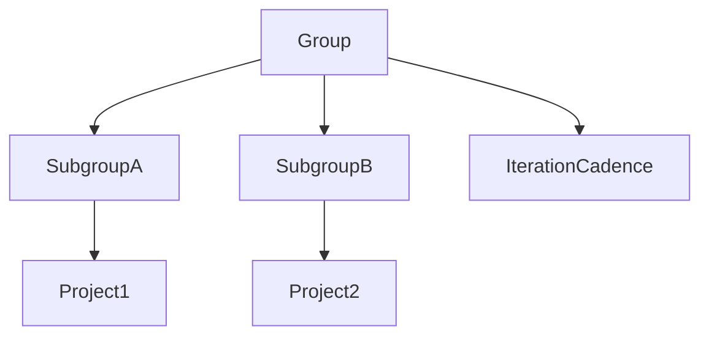

<!-- vale gitlab_base.FutureTense = NO -->

为了在极狐GitLab 中运行敏捷开发迭代，你需要使用多个协同工作的极狐GitLab 功能。

要从极狐GitLab 运行敏捷迭代，请执行以下操作：

1. 创建群组。
1. 创建项目。
1. 设置迭代节奏。
1. 创建限定范围标签。
1. 创建史诗和议题。
1. 创建议题板。

创建这些核心组件后，你就可以开始运行迭代了。

## 创建群组

迭代节奏在群组级别创建，因此如果你还没有群组，请先[创建一个](../../user/group/_index.md#create-a-group)。

你可以使用群组同时管理一个或多个相关项目。你将用户作为成员添加到群组中，并为他们分配一个角色。角色决定了每个用户对群组内项目的[权限级别](../../user/permissions.md)。成员资格会自动向下传递到所有子群组和项目。

## 创建项目

现在，在你的群组中[创建一个或多个项目](../../user/project/_index.md)。有几种不同的方法可以创建项目。项目包含你的代码和流水线，还包含用于规划即将进行的代码变更的议题。

## 设置迭代节奏

在开始创建史诗或议题之前，请先创建[迭代节奏](../../user/group/iterations/_index.md#iteration-cadences)。迭代节奏包含用于规划和报告议题的独立、顺序的迭代时间框。

创建迭代节奏时，你可以决定是自动管理迭代，还是禁用自动调度以[手动管理迭代](../../user/group/iterations/_index.md#create-an-iteration-manually)。

与成员资格类似，迭代会向下级联到群组、子群组和项目层次结构。如果你的团队有多个群组和项目，请在顶层共享群组中创建迭代节奏：

## 创建限定范围标签

你还应该在你创建迭代节奏的同一群组中[创建限定范围标签](../../user/project/labels.md)。标签帮助你组织史诗、议题和合并请求，并帮助你可视化议题在面板中的流程。例如，你可以使用限定范围标签，如 `workflow::planning`、`workflow::ready for development`、`workflow::in development` 和 `workflow::complete` 来表示议题的状态。你还可以利用限定范围标签来表示议题或史诗的类型，如 `type::feature`、`type::defect` 和 `type::maintenance`。

## 创建史诗和议题

现在你可以开始规划迭代了。首先在你创建迭代节奏的群组中创建[史诗](../../user/group/epics/_index.md)，然后在一个或多个项目中创建子[议题](../../user/project/issues/_index.md)。根据需要为每个添加标签。

## 创建议题板

[议题板](../../user/project/issue_board.md) 帮助你规划即将进行的迭代，或可视化当前进行中迭代的工作流程。列表列可以根据标签、指派人、迭代或里程碑创建。你还可以根据多个属性过滤议题板，并按史诗对议题进行分组。

在你创建迭代节奏和标签的群组中，[创建一个议题板](../../user/project/issue_board.md#create-an-issue-board)，并将其命名为"迭代规划"。然后，为每个迭代创建列表。然后，你可以将议题从"开放"列表拖到迭代列表中，以便为即将进行的迭代安排它们。

为了可视化当前迭代中议题的工作流程，创建另一个名为"当前迭代"的议题板。在创建该议题板时：

1. 点击 **配置面板**（）。
1. 在 **迭代** 旁边，点击 **编辑**。
1. 从下拉列表中选择 **当前迭代**。
1. 点击 **保存更改**。

现在，你的议题板将只显示当前迭代中的议题。你可以开始为之前创建的每个 `workflow::...` 标签添加列表。

现在你已经准备好开始开发了。