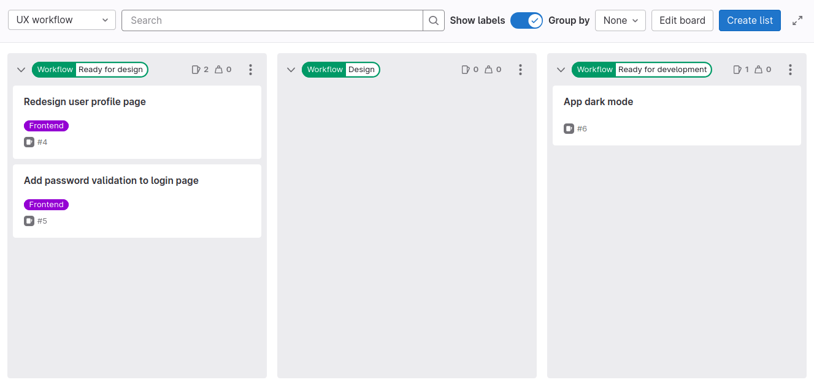
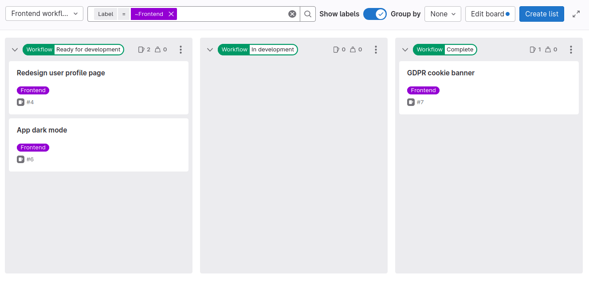
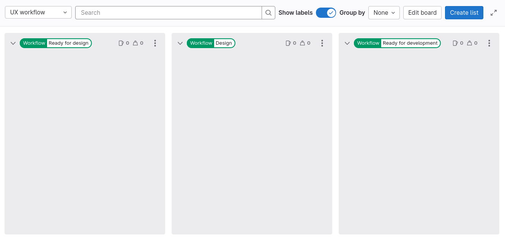
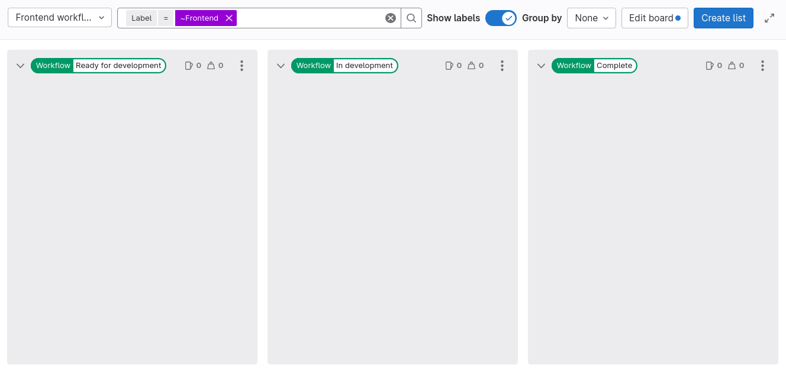



- Tier: 专业版，旗舰版
- Offering: JihuLab.com，私有化部署



<!-- vale gitlab_base.FutureTense = NO -->

本教程将向你展示如何为两个依次处理议题的团队设置[议题看板](../../user/project/issue_board.md)和[范围标签](../../user/project/labels.md#scoped-labels)。

在本示例中，你将分别为 UX 和前端团队创建两个议题看板。
按照以下步骤，你还可以为更多子团队（如后端或质量保证团队）创建议题看板和工作流。

为多个团队设置议题看板：

1. [创建群组](#创建群组)
1. [创建项目](#创建项目)
1. [创建标签](#创建标签)
1. [创建团队议题看板](#创建团队议题看板)
1. [为功能创建议题](#为功能创建议题)

## 开始之前

- 如果你在本教程中使用现有群组，请确保你具有该群组的计划者、报告者、开发者、维护者或所有者角色。
- 如果你在本教程中使用现有项目，请确保你具有该项目的计划者、报告者、开发者、维护者或所有者角色。

## 目标工作流

完成所有设置后，两个团队将能够将议题从一个看板移交到另一个看板，例如像这样：

1. 项目负责人将 `Workflow::Ready for design` 和 `Frontend` 标签添加到名为 **Redesign user profile page** 的功能议题。
1. UX 团队的一位产品设计师：
   1. 检查 **UX workflow** 看板上的 `Workflow::Ready for design` 列表，并决定处理个人资料页面的重新设计。

      

   1. 将自己指派给 **Redesign user profile page** 议题。
   1. 将议题卡片拖拽到 `Workflow::Design` 列表。之前的工作流标签将被自动移除。
   1. 创建 ✨新的设计方案✨。
   1. [将设计添加到议题中](../../user/project/issues/design_management.md)。
   1. 将议题卡片拖拽到 `Workflow::Ready for development` 列表，这将添加此标签并移除其他任何 `Workflow::` 标签。
   1. 取消该议题对自己的指派。
1. 前端团队的一位开发者：
   1. 检查 **Frontend workflow** 看板上的 `Workflow::Ready for development` 列表，并选择一个要处理的议题。

      

   1. 将自己指派给 **Redesign user profile page** 议题。
   1. 将议题卡片拖拽到 `Workflow::In development` 列表。之前的工作流标签将被自动移除。
   1. 在[合并请求](../../user/project/merge_requests/_index.md)中添加前端代码。
   1. 添加 `Workflow::Complete` 标签。

## 创建群组

为了在项目扩展时做好准备，请从创建一个群组开始。
你可以使用群组同时管理一个或多个相关项目。
你可以将用户添加为群组成员，并为他们分配角色。

要创建群组：

1. 在右上角，选择 **新建** () 和 **新建群组**。
1. 选择 **创建群组**。
1. 填写字段。将你的群组命名为 `Paperclip Software Factory`。
1. 选择 **创建群组**。

你已创建了一个空群组。接下来，你将创建一个用来存储议题和代码的项目。

## 创建项目

主要的代码开发工作发生在项目及其代码仓中。
项目不仅包含你的代码和流水线，还包含用于规划即将进行的代码变更的议题。

要创建一个空白项目：

1. 在你的群组中，在右上角选择 **新建** ()，然后选择
   **此群组中** > **新建项目/代码仓**。
1. 选择 **创建空白项目**。
1. 输入项目详细信息：
   - 在 **项目名称** 字段中，将项目命名为 `Paperclip Assistant`。
1. 选择 **创建项目**。

## 创建标签

你需要一个团队标签和一组工作流标签，以显示议题在开发周期中的位置。

你可以在 `Paperclip Assistant` 项目中创建这些标签，但更好的做法是在 `Paperclip Software Factory` 群组中创建它们。这样，这些标签也将在你日后创建的所有其他项目中可用。

要创建每个标签：

1. 在顶部栏中，选择 **搜索或跳转到** 并找到你的 **Paperclip Software Factory** 群组。
1. 选择 **管理** > **标签**。
1. 选择 **新建标签**。
1. 在 **标题** 字段中，输入标签的名称。从 `Frontend` 开始。
1. 可选。通过从可用颜色中选择一种颜色来设置颜色，或者在 **背景颜色** 字段中输入特定颜色的十六进制颜色值。
1. 选择 **创建标签**。

重复这些步骤以创建你所需的所有标签：

- `Frontend`
- `Workflow::Ready for design`
- `Workflow::Design`
- `Workflow::Ready for development`
- `Workflow::In development`
- `Workflow::Complete`

## 创建团队议题看板

与标签一样，你可以在 **Paperclip Assistant** 项目中创建议题看板，
但更好的是在 **Paperclip Software Factory** 群组中拥有它们。这样，你将能够管理来自日后可能在此群组中创建的所有项目的议题。

要创建新的群组议题看板：

1. 在顶部栏中，选择 **搜索或跳转到** 并找到你的 **Paperclip Software Factory** 群组。
1. 选择 **计划** > **议题看板**。
1. 创建 UX 工作流和前端工作流看板。

要创建 **UX workflow** 议题看板：

1. 在议题看板页面的左上角，选择带有当前看板名称的下拉列表。
1. 选择 **创建新看板**。
1. 在 **标题** 字段中，输入 `UX workflow`。
1. 清除 **显示开放列表** 和 **显示已关闭列表** 复选框。
1. 选择 **创建看板**。你应该会看到一个空看板。
1. 为 `Workflow::Ready for design` 标签创建列表：
   1. 在议题看板页面的右上角，选择 **创建列表**。
   1. 在出现的列中，从 **值** 下拉列表中选择 `Workflow::Ready for design` 标签。
   1. 选择 **添加到看板**。
1. 对 `Workflow::Design` 和 `Workflow::Ready for development` 标签重复上一步。

要创建 **Frontend workflow** 看板：

1. 在议题看板页面的左上角，选择带有当前看板名称的下拉列表。
1. 选择 **创建新看板**。
1. 在 **标题** 字段中，输入 `Frontend workflow`。
1. 清除 **显示开放列表** 和 **显示已关闭列表** 复选框。
1. 展开 **范围**。
1. 在 **标签** 旁边，选择 **编辑** 并选择 `Frontend` 标签。
1. 选择 **创建看板**。
1. 为 `Workflow::Ready for development` 标签创建列表：
   1. 在议题看板页面的右上角，选择 **创建列表**。
   1. 在出现的列中，从 **值** 下拉列表中选择 `Workflow::Ready for development` 标签。
   1. 选择 **添加到看板**。
1. 对 `Workflow::In development` 和 `Workflow::Complete` 标签重复上一步。

目前，两个看板中的列表都应该是空的。接下来，你将用一些议题填充它们。

## 为功能创建议题

要跟踪即将推出的功能、增强功能和错误，你必须创建一些议题。
议题属于项目，但你也可以直接从议题看板创建它们。

要从你的看板创建议题：

1. 在议题看板页面的左上角，选择带有当前看板名称的下拉列表。
1. 选择 **UX workflow**。
1. 在 `Workflow::Ready for development` 列表上，选择 **创建新议题** ()。
1. 填写字段：
   1. 在 **标题** 下，输入 `Redesign user profile page`。
   1. 在 **项目** 下，选择 **Paperclip Software Factory / Paperclip Assistant**。
1. 选择 **创建议题**。由于你在标签列表中创建了新议题，因此它将带有此标签。
1. 添加 `Frontend` 标签，因为只有带此标签的议题才会显示在前端团队的看板上：
   1. 选择议题卡片（而非其标题），右侧会出现一个侧边栏。
   1. 在侧边栏的 **标签** 部分，选择 **编辑**。
   1. 从 **指派标签** 下拉列表中，选择 `Workflow::Ready for design` 和
      `Frontend` 标签。选中的标签上会显示有对号标记。
   1. 要应用标签更改，请选择 **指派标签** 旁边的 **X** 或选择标签部分以外的任何区域。

重复这些步骤，使用相同的标签再创建一些议题。

现在，你应该至少在其中看到一个议题，准备好让你的产品设计师开始工作了！

恭喜！现在你的团队可以开始在卓越的软件上进行协作。
下一步，你可以亲自尝试[目标工作流](#目标工作流)，使用这些看板模拟两个团队的交互。

## 进一步了解极狐GitLab 中的项目管理

在[教程页面](../plan_and_track.md)上查找关于项目管理的其他教程。