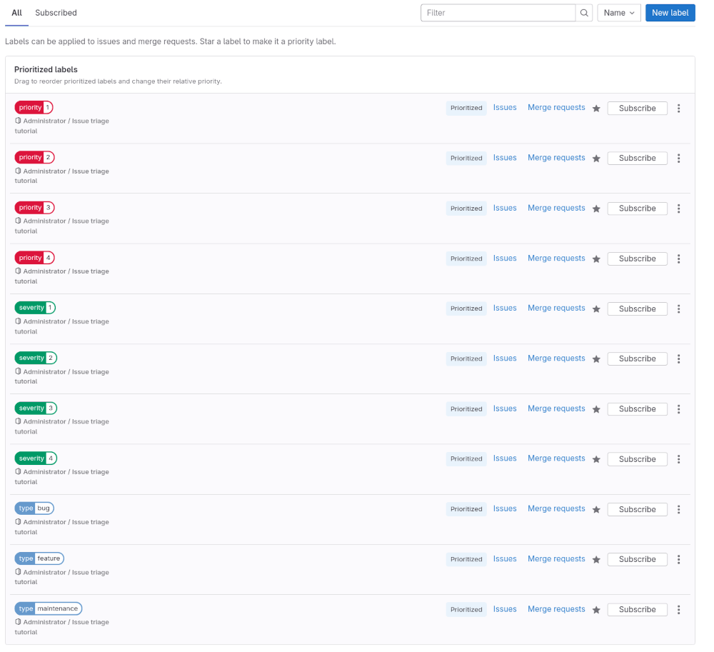
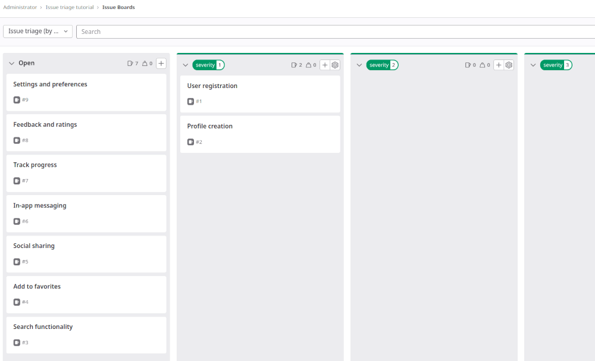
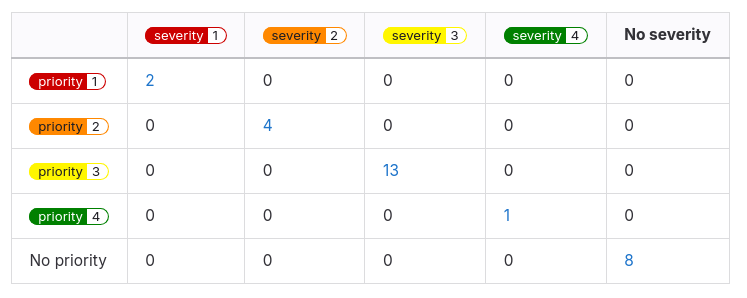



- Tier: 基础版，专业版，旗舰版
- Offering: JihuLab.com，私有化部署



<!-- vale gitlab_base.FutureTense = NO -->

议题分类是根据类型和严重程度进行归类的过程。
随着项目增长和人们创建更多议题，建立如何处理传入议题的工作流变得很有价值。

在本教程中，你将学习如何为这个目的设置一个极狐GitLab 项目。

要为项目设置极狐GitLab 以进行议题分类：

1. [创建项目](#create-a-project)
1. [确定类型、严重性和优先级的判定标准](#decide-on-the-criteria-for-types-severity-and-priority)
1. [记录你的判定标准](#document-your-criteria)
1. [创建范围标签](#create-scoped-labels)
1. [设置新标签的优先级](#prioritize-the-new-labels)
1. [创建议题分类看板](#create-an-issue-triage-board)
1. [为功能创建议题](#create-issues-for-features)

## 准备工作

- 如果你在本教程中使用现有项目，请确保你在项目中具有报告者、开发者、维护者或所有者角色。
- 如果你按照以下步骤操作，并在之后决定为项目创建父群组，为了充分利用标签，你需要将项目标签升级为群组标签。
  考虑先创建一个群组。

## 创建项目

项目包含了用于规划即将到来的代码变更的议题。

如果你已在某个项目中工作，请直接进入[确定类型、严重性和优先级的判定标准](#decide-on-the-criteria-for-types-severity-and-priority)。

要创建一个空白项目：

1. 在右上角，选择 **新建** () 和 **新建项目/仓库**。
1. 选择 **创建空白项目**。
1. 输入项目详情。
   - 对于 **项目名称**，输入 `Issue triage tutorial`。
1. 选择 **创建项目**。

## 确定类型、严重性和优先级的判定标准

接下来，你需要确定：

- 你想要识别的议题**类型**。如果你需要更细粒度的方法，也可以为每种类型创建子类型。类型有助于对工作进行分类，以了解请求团队完成的各类工作。
- **优先级**和**严重性**的等级，以定义传入工作对最终用户的影响，并协助排定优先级。

在本教程中，假设你已确定以下内容：

- 类型：`Bug`、`Feature` 和 `Maintenance`
- 优先级：`1`、`2`、`3`、`4`
- 严重性：`1`、`2`、`3`、`4`

有关灵感来源，请参见极狐GitLab 是如何定义这些内容的：

- [类型和子类型](https://handbook.gitlab.com/handbook/engineering/metrics/#work-type-classification)
- [优先级](https://handbook.gitlab.com/handbook/product-development/how-we-work/issue-triage/#priority)
- [严重性](https://handbook.gitlab.com/handbook/product-development/how-we-work/issue-triage/#severity)

## 记录你的判定标准

在就所有标准达成一致后，将所有内容记录在你团队始终可以访问的地方。

例如，将其添加到项目中的 [Wiki](../../user/project/wiki/_index.md) 中，或者添加到使用[极狐GitLab Pages](../../user/project/pages/_index.md) 发布的公司手册中。

<!-- Idea for expanding this tutorial:
     Add steps for [creating a wiki page](../../user/project/wiki/_index.md#create-a-new-wiki-page). -->

## 创建范围标签



- Tier: 专业版，旗舰版
- Offering: JihuLab.com，私有化部署



接下来，你将创建标签，用于添加到议题中以对它们进行分类。

最好的工具是[范围标签](../../user/project/labels.md#scoped-labels)，你可以使用它们来设置互斥的属性。

对照你[之前](#decide-on-the-criteria-for-types-severity-and-priority)整理的类型、严重性和优先级列表，你需要创建匹配的范围标签。

范围标签名称中的双冒号 (`::`) 可防止同一范围的两个标签被同时使用。
例如，如果你将 `type::feature` 标签添加到一个已有 `type::bug` 标签的议题，前一个标签会被删除。

> [!note]
> 范围标签在专业版和旗舰版中可用。
> 如果你使用的是基础版，可以改用常规标签。
> 但是，它们并不互斥。

要创建每个标签：

1. 在顶栏中，选择 **搜索或跳转到** 并找到你的项目。
1. 在左侧边栏中，选择 **管理** > **标签**。
1. 选择 **新建标签**。
1. 在 **标题** 字段中，输入标签的名称。从 `type::bug` 开始。
1. 可选。通过从可用颜色中选择一种颜色，或在 **背景颜色** 字段中输入特定颜色的十六进制颜色值来选择一种颜色。
1. 选择 **创建标签**。

重复这些步骤以创建你需要的所有标签：

- `type::bug`
- `type::feature`
- `type::maintenance`
- `priority::1`
- `priority::2`
- `priority::3`
- `priority::4`
- `severity::1`
- `severity::2`
- `severity::3`
- `severity::4`

## 设置新标签的优先级

现在，将新标签设置为优先标签，这可以确保在你按优先级或标签优先级排序时，最重要的议题显示在议题列表的顶部。

要了解按优先级或标签优先级排序时会发生什么，请参见[排序和排列议题列表](../../user/project/issues/sorting_issue_lists.md)。

要设置标签的优先级：

1. 在标签页面上，在你想设置优先级的标签旁边，选择星形图标 ()。
   该标签现在会出现在标签列表顶部的 **优先标签** 下。
1. 要更改这些标签的相对优先级，请在列表中上下拖动它们。
   在列表中位置越高的标签，优先级越高。
1. 为你之前创建的所有标签设置优先级。
   确保优先级和严重性较高的标签在列表中的位置高于较低的值。

## 创建议题分类看板

为了应对即将到来的议题积压，创建一个按标签组织议题的[议题板](../../user/project/issue_board.md)。
你将使用它来快速创建议题，并通过将卡片拖到各个列表中来为其添加标签。

要设置议题板：

1. 决定看板的范围。例如，创建一个你将用于为议题分配严重性的看板。
1. 在顶栏中，选择 **搜索或跳转到** 并找到你的 **Issue triage tutorial** 项目。
1. 选择 **计划** > **议题板**。
1. 在议题板页面的左上角，选择带有当前看板名称的下拉列表。
1. 选择 **创建新看板**。
1. 在 **标题** 字段中，输入 `Issue triage (by severity)`。
1. 保持 **显示进行中列表** 复选框选中，并取消选中 **显示已关闭列表** 复选框。
1. 选择 **创建看板**。你应该会看到一个空的看板。
1. 为 `severity::1` 标签创建一个列表：
   1. 在议题板页面的右上角，选择 **创建列表**。
   1. 在出现的列中，从 **值** 下拉列表中选择 `severity::1` 标签。
   1. 选择 **添加到看板**。
1. 为 `severity::2`、`severity::3` 和 `severity::4` 标签重复上一步。

目前，看板中的列表应该是空的。接下来，你将用一些议题填充它们。

## 为功能创建议题

要跟踪即将到来的功能和错误，你必须创建一些议题。
议题属于项目，但你也可以直接从议题板创建它们。

首先为计划的功能创建一些议题。
你可以在发现错误时创建议题（希望不会太多！）。

要从 **Issue triage (by severity)** 看板创建议题：

1. 在 **进行中** 列表上，选择 **创建新议题** ()。
   **进行中** 列表显示不适合任何其他看板列表的议题。

   如果你已知道议题应具有哪个严重性标签，可以直接从该标签列表创建它。
   从标签列表创建的每个议题都会自动获得该标签。
1. 填写字段：
   - 在 **标题** 下，输入 `User registration`。
1. 选择 **创建议题**。
1. 重复这些步骤以创建更多议题。

   例如，如果你正在构建一个应用，请创建以下议题：

   - `User registration`
   - `Profile creation`
   - `Search functionality`
   - `Add to favorites`
   - `Push notifications`
   - `Social sharing`
   - `In-app messaging`
   - `Track progress`
   - `Feedback and ratings`
   - `Settings and preferences`

你的第一个议题分类看板已准备就绪！
尝试将一些议题从 **进行中** 列表拖到某个标签列表，以为其添加一个严重性标签。

## 后续步骤

接下来，你可以：

- 调整你使用议题板的方式。一些选项包括：
  - 编辑当前议题板，使其也包含优先级和类型标签的列表。
    这样，你会使看板更宽，可能需要一些水平滚动。
  - 创建名为 `Issue triage (by priority)` 和 `Issue triage (by type)` 的单独议题板。
    这样，你可以将不同类型的分类工作分开，但需要在看板之间切换。
  - [为团队交接设置议题板](../boards_for_teams/_index.md)。
- 在议题列表中按优先级或严重性浏览议题，
  [按每个标签进行筛选](../../user/project/issues/managing_issues.md#filter-the-list-of-issues)。
  如果你可以使用
  [“是其中之一”筛选运算符](../../user/project/issues/managing_issues.md#filter-the-list-of-issues)，请利用它。
- 将议题分解为[任务](../../user/tasks.md)。
- 使用 [`gitlab-triage` gem](https://gitlab.com/gitlab-org/ruby/gems/gitlab-triage) 创建有助于自动化项目议题分类的策略。
  生成带有如下热图的摘要报告：

  

要了解极狐GitLab 中议题分类的更多信息，请参见[议题分类](https://handbook.gitlab.com/handbook/product-development/how-we-work/issue-triage/)
和[分类操作](https://handbook.gitlab.com/handbook/engineering/infrastructure-platforms/developer-experience/triage-operations/)。