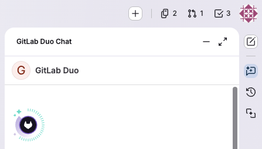
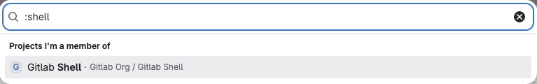
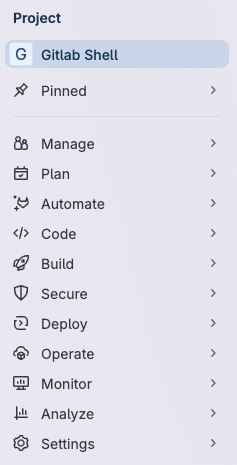
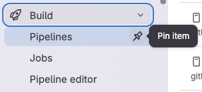
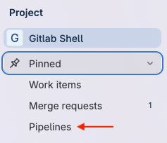
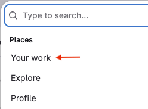
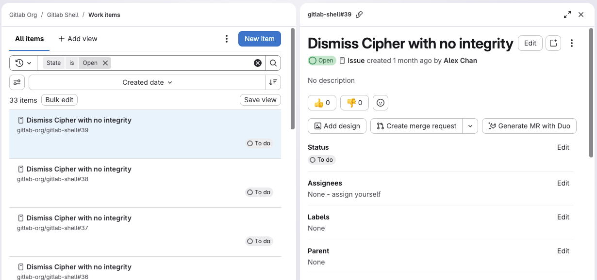
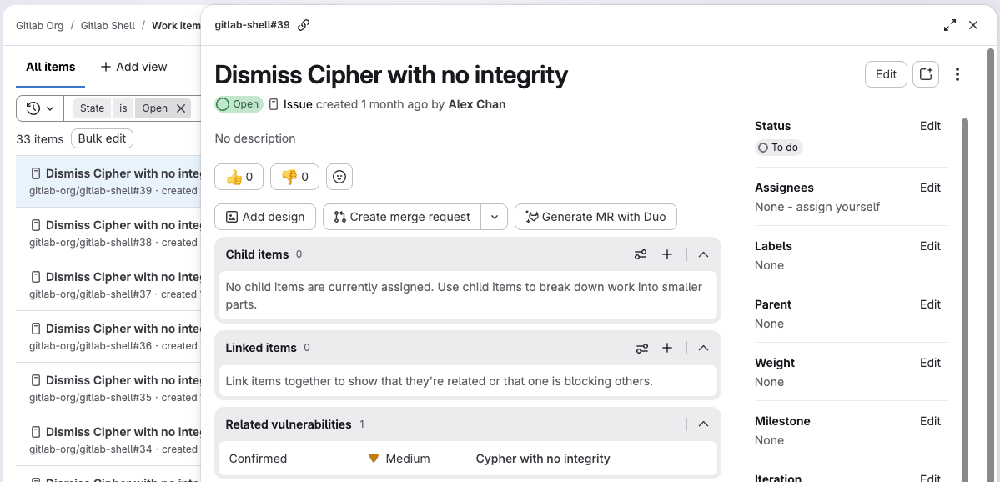
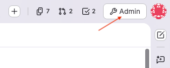



- Tier: 基础版，专业版，旗舰版
- Offering: JihuLab.com，私有化部署





- 在极狐GitLab 16.0 中引入。
- 在 16.0 到 16.5 版本中，你可以通过选择头像并关闭 **新导航** 切换按钮来关闭侧边栏。
- 在极狐GitLab 18.6 中，界面更新为基于面板的布局。



<!-- vale gitlab_base.FutureTense = NO -->

跟随本教程学习如何使用不同的界面元素来导航极狐GitLab。

## 界面布局

在右上角，有几个快捷方式。使用这些快捷方式可以创建新项目，并查看你的个人资料、议题列表、合并请求和待办事项。

左侧边栏会根据你正在查看的信息而变化。例如，你可能正在查看一个项目、探索项目或群组，或查看个人资料。要切换到左侧边栏的其他区域，请使用顶部栏中的 **搜索或跳转到**。

左侧边栏的其余部分会根据你选择的选项填充。例如，如果你在一个项目中，边栏是特定于项目的。

在右侧，极狐GitLab Duo 侧边栏有按钮可以访问极狐GitLab Duo Chat 和相关会话。

## 查找你的项目

现在让我们来看看你会使用左侧边栏执行的一些常见任务。

首先，我们将找到要处理的项目。

1. 要浏览所有可用的项目，在顶部栏中，选择 **搜索或跳转到**。
1. 从经常访问的项目列表中选择，或输入冒号 `:` 后跟项目名称：

   

左侧边栏现在显示特定于项目的选项。

## 固定常用项目

如果你经常使用某些菜单项，可以将其固定。

1. 展开各个部分，直到看到要固定的项目。
1. 悬停并选择图钉图标 ()。

   

该项目显示在 **已固定** 部分：

> [!note]
> 在查看项目时固定的项目与在查看群组时固定的项目不同。

## 使用更专注的视图

在左侧边栏中，你还可以选择更专注的视图来查看你有权访问的区域。选择 **搜索或跳转到**，然后选择 **你的工作**。

然后，左侧边栏中会显示 **你的工作**。

## 在详情面板中打开工作项

当你选择一个工作项（如议题）时，它会在详情面板中打开。

要在全页视图中打开项目，可以：

- 在 **工作项** 页面上，右键单击项目并在新标签页中打开。
- 选择项目，然后在详情面板中选择其 ID（例如 `myproject#123456`）。

如果有足够的屏幕空间，详情面板会打开在你打开它的列表或看板旁边。在较小的屏幕上，详情面板会覆盖列表或看板面板。

### 设置在工作项面板中打开的偏好

默认情况下，像议题或史诗这样的工作项会在详情面板中打开。如果你想关闭它：

1. 在顶部栏中，选择 **搜索或跳转到** 并找到你的项目或群组。
1. 在左侧边栏中，选择 **计划** > **工作项**。
1. 在过滤栏右侧，选择 **显示选项** () 并关闭 **在侧边面板中打开项目** 切换按钮。

你的偏好会被保存并在极狐GitLab 中全局应用。

## 转到管理区域

**管理** 区域位于右上角：

## 访问新增功能

**新增功能** 功能向用户展示最近 10 个极狐GitLab 版本中新功能的一些亮点。

要访问未读的 **新增功能** 项目，在左侧边栏底部，选择 **新增功能**。

要访问之前已读的 **新增功能** 项目：

1. 在左侧边栏底部，选择 **帮助** ()。
1. 从菜单中选择 **新增功能**。