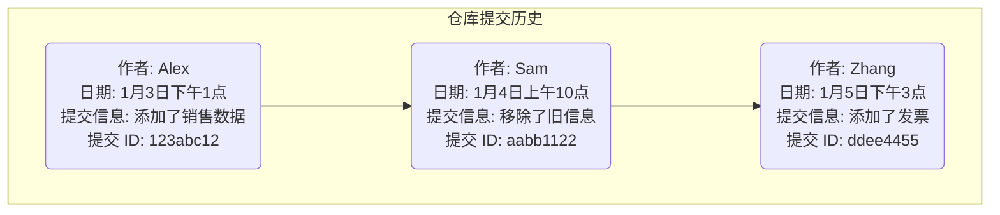
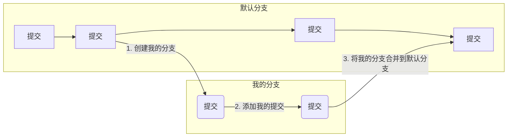
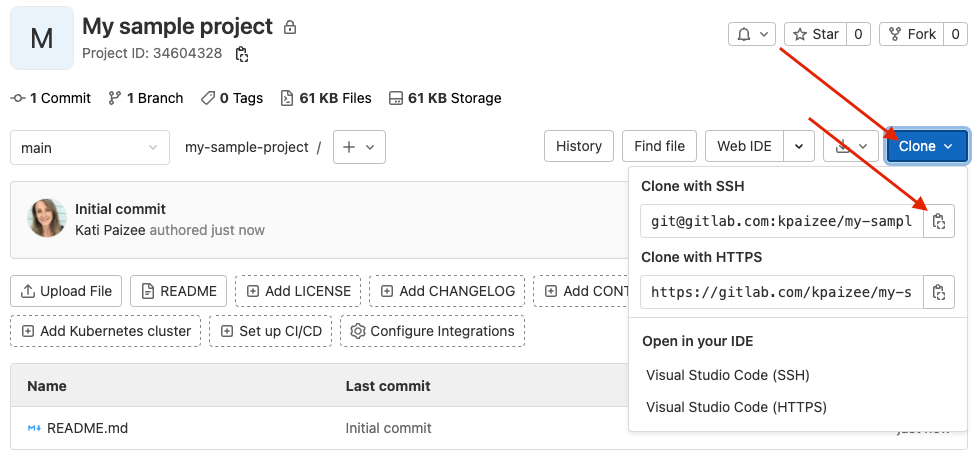
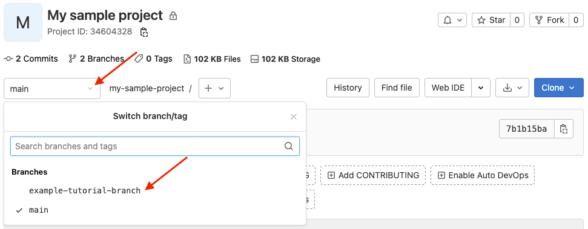
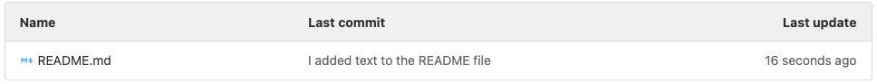

<!-- vale gitlab_base.FutureTense = NO -->

本教程将带你简单了解 Git 的工作原理。它会逐步指导你完成创建自己的项目、编辑文件以及通过命令行将更改提交到 Git 仓库的过程。

完成之后，你将拥有一个可以用来练习使用 Git 的项目。

## 开始之前

- [在你的本地机器上安装 Git](../../topics/git/how_to_install_git/_index.md)。
- 确保你可以登录极狐GitLab 实例。如果你的组织没有极狐GitLab，请在 JihuLab.com 上创建一个账户。
- [创建 SSH 密钥并将其添加到极狐GitLab](../../user/ssh.md)。SSH 密钥是你计算机与极狐GitLab 之间安全通信的方式。

## 什么是 Git？

在我们进入实际操作步骤之前，让我们先了解一些基本的 Git 概念。

Git 是一个版本控制系统。它被用来跟踪文件的更改。

你可以将代码或文档等文件存储在一个 Git *仓库*中。当你想编辑这些文件时，你需要将仓库*克隆*到你的计算机上，进行更改，然后将你的更改*推送*回仓库。在极狐GitLab 中，一个 Git 仓库位于一个*项目*中。

每次你推送更改时，Git 都会将其记录为一个唯一的*提交*。这些提交构成了文件何时、如何更改以及由谁更改的历史记录。



当你在一个 Git 仓库中工作时，你是在*分支*上工作的。默认情况下，仓库的内容在一个默认分支上。要进行更改，你需要：

1. 创建你自己的分支，该分支是你创建时默认分支的一个快照。
1. 进行更改并将其推送到你的分支。每次推送都会创建一个提交。
1. 当你准备好时，将你的分支*合并*到默认分支中。



如果这些内容让你感觉有点不知所措，请坚持下去。你马上就会看到这些概念的实际应用。

## 步骤

以下是我们要做的事情概览：

1. [创建一个示例项目](#create-a-sample-project)。
1. [克隆仓库](#clone-the-repository)。
1. [创建一个分支并进行更改](#create-a-branch-and-make-changes)。
1. [提交并推送你的更改](#commit-and-push-your-changes)。
1. [合并你的更改](#merge-your-changes)。
1. [在极狐GitLab 中查看你的更改](#view-your-changes-in-gitlab)。

<a id="create-a-sample-project"></a>

### 创建一个示例项目

首先，在极狐GitLab 中创建一个示例项目。

1. 在极狐GitLab 中，在右上角，选择 **新建** () 和 **新项目/仓库**。
1. 在 **项目名称** 中，输入 `My sample project`。项目路径会自动为你生成。
   此路径是项目创建后你可以用来访问项目的 URL。
1. 确保选中 **使用自述文件初始化仓库**。
   你如何填写其他字段取决于你自己。
1. 选择 **创建项目**。

<a id="clone-the-repository"></a>

### 克隆仓库

现在你可以克隆你项目中的仓库了。*克隆*一个仓库意味着你正在你的计算机上或任何你想存储和处理文件的地方创建一个副本。

1. 在你项目的概览页面，在右上角，选择 **代码**，然后复制 **使用 SSH 克隆** 的 URL。

   
1. 在你的计算机上打开一个终端，并进入你想要克隆文件的目录。
1. 输入 `git clone` 并粘贴 URL：

   ```shell
   git clone git@gitlab.com:gitlab-example/my-sample-project.git
   ```

1. 进入该目录：

   ```shell
   cd my-sample-project
   ```

1. 默认情况下，你已经克隆了仓库的默认分支。通常这个分支是 `main`。为了确认，获取默认分支的名称：

   ```shell
   git branch
   ```

   你当前所在的分支会用星号标记。
   按下键盘上的 `Q` 键返回主终端窗口。

<a id="create-a-branch-and-make-changes"></a>

### 创建一个分支并进行更改

现在你已经有了仓库的副本，创建你自己的分支，以便你可以独立地进行更改。

1. 创建一个名为 `example-tutorial-branch` 的新分支。

   ```shell
   git checkout -b example-tutorial-branch
   ```

1. 在文本编辑器（如 Visual Studio Code、Sublime、`vi` 或任何其他编辑器）中，打开 README.md 文件并添加以下文本：

   ```plaintext
   你好，世界！我正在使用 Git！
   ```

1. 保存文件。
1. Git 会跟踪已更改的文件。要确认哪些文件已更改，请获取状态。

   ```shell
   git status
   ```

   你应该会得到类似下面的输出：

   ```shell
   位于分支 example-tutorial-branch
   尚未暂存以备提交的变更：
     （使用 "git add <文件>..." 更新要提交的内容）
     （使用 "git restore <文件>..." 丢弃工作区的改动）
      修改：     README.md

   修改尚未加入提交（使用 "git add" 和/或 "git commit -a"）
   ```

### 提交并推送你的更改

你已经对仓库中的一个文件进行了更改。现在是时候通过进行你的首次提交来记录这些更改了。

1. 将 `README.md` 文件添加到*暂存*区。暂存区是你在提交文件之前存放文件的地方。

   ```shell
   git add README.md
   ```

1. 确认文件已暂存：

   ```shell
   git status
   ```

   你应该会得到类似下面的输出，并且文件名应该是绿色的。

   ```shell
   位于分支 example-tutorial-branch
   要提交的变更：
     （使用 "git restore --staged <文件>..." 以取消暂存）
      修改：     README.md
   ```

1. 现在提交暂存的文件，并包含一条描述你所做更改的信息。确保将信息用双引号（"）括起来。

   ```shell
   git commit -m "我向 README 文件添加了文本"
   ```

1. 此更改已提交到你的分支，但你的分支及其提交仍然只在你的计算机上可用。还没有其他人可以访问它们。将你的分支推送到极狐GitLab：

   ```shell
   git push origin example-tutorial-branch
   ```

你的分支现在在极狐GitLab 上可用，并且项目中的其他用户可以看到它。



<a id="merge-your-changes"></a>

### 合并你的更改

现在你可以准备将你的 `example-tutorial-branch` 分支的更改合并到默认分支 (`main`) 了。

1. 检出你仓库的默认分支。

   ```shell
   git checkout main
   ```

1. 将你的分支合并到默认分支中。

   ```shell
   git merge example-tutorial-branch
   ```

1. 推送更改。

   ```shell
   git push
   ```

> [!note]
> 对于本教程，你直接将你的分支合并到仓库的默认分支中。在极狐GitLab 中，你通常会使用[合并请求](../../user/project/merge_requests/_index.md)来合并你的分支。

<a id="view-your-changes-in-gitlab"></a>

### 在极狐GitLab 中查看你的更改

你做到了！你更新了分支中的 `README.md` 文件，并将这些更改合并到了 `main` 分支中。

让我们在 UI 中看看并确认你的更改。前往你的项目。

- 向下滚动并查看 `README.md` 文件的内容。
  你的更改应该可见。
- 在 `README.md` 文件上方，查看 **最后提交** 列中的文本。
  你的提交信息会显示在此列中：

  

现在你可以返回命令行并切换回你的个人分支 (`git checkout example-tutorial-branch`)。你可以继续更新文件或创建新文件。输入 `git status` 来查看你更改的状态并尽情提交。

别担心把事情搞砸。Git 中的所有内容都可以被还原，如果你发现无法恢复，你总是可以创建一个新分支然后重新开始。

做得很好。

## 查找更多 Git 学习资源

- 通过面向初学者的课程 (1小时33分钟) 获取对 Git 的完整介绍。
- 在[教程页面](../_index.md)上查找关于 Git 和极狐GitLab 的其他教程。
- PDF 下载: [极狐GitLab Git 速查表](https://about.gitlab.com/images/press/git-cheat-sheet.pdf)。
- 博客文章: [Git 提示与技巧](https://about.gitlab.com/blog/git-tips-and-tricks/)。
- 官方 [Git 文档](https://git-scm.com)，包括
  [Git 服务器 - GitLab](https://git-scm.com/book/en/v2/Git-on-the-Server-GitLab)。