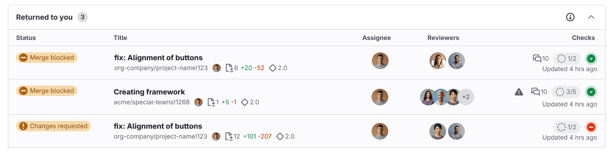
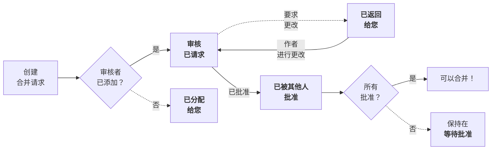



- Tier: 基础版，专业版，旗舰版
- Offering: JihuLab.com，私有化部署





- 在极狐GitLab 17.9 中引入，[带有功能标志](../../administration/feature_flags/_index.md)，名为 `merge_request_dashboard`。默认禁用。
- 功能标志 `merge_request_dashboard` 在 JihuLab.com 上于极狐GitLab 17.9 启用。
- 功能标志 `mr_dashboard_list_type_toggle` 在 JihuLab.com 上于极狐GitLab 18.1 启用。
- 功能标志 `merge_request_dashboard` 在极狐GitLab 18.2 中默认启用。



> [!flag]
> 此功能的可用性由功能标志控制。
> 有关更多信息，请参见历史记录。

本教程向您介绍用于管理合并请求的新用户界面。

无论您是等待审核的作者，还是提供反馈的审核者，此页面都能帮助您跟踪工作。它将您的工作分类为清晰的类别，以帮助您：

- 减少跟踪需要您关注的合并请求的时间。
- 优先专注于最紧急的工作。
- 查看您所贡献内容的状态。
- 防止进行中的工作被遗忘。
- 提高代码审核速度。

## 查看实际效果

要查看您在 JihuLab.com 上的合并请求主页，可以：

- 使用 <kbd>Shift</kbd>+<kbd>m</kbd> [键盘快捷键](../../user/shortcuts.md)。
- 在左侧边栏中，选择 **合并请求**。

它分为三个选项卡，可帮助您专注于当前需要关注的内容，同时仍可访问其他近期工作：

- **活跃**: 这些合并请求需要您或您团队成员的关注。
- **已合并**: 这些合并请求在过去 14 天内合并，且您是指派人或审核者。
- **搜索**: 搜索所有合并请求，并根据需要进行筛选。

极狐GitLab 在所有页面的右上角显示 **活跃** 合并请求的总数。例如，此用户有：

- 8 个开放议题 ()
- 3 个活跃合并请求 ()
- 6 个待办事项 ()

每个表格行将有关合并请求的相关信息分组到列中：

- **状态** - 合并请求的当前状态。
- **标题** - 关于该议题的重要元数据，包括：
  - 合并请求标题。
  - 指派人的头像。
  - 添加和删除的文件及行数（`+` / `-`）。
  - 里程碑。
- **作者** - 作者的头像。
- **审核者** - 审核者的头像。带有绿色对勾的审核者已批准该合并请求。
- **检查项** - 对可合并性的紧凑评估。
  - 打开的讨论串数，例如 `0 of 3`。
  - 当前所需的[审批状态](../../user/project/merge_requests/approvals/_index.md#in-the-list-of-merge-requests)。
  - 最近流水线的状态。
  - 上次更新日期。

## 设置您的显示偏好

在右上角，选择 **显示偏好** () 将合并请求按以下方式排序：

- **工作流**。此视图按状态对合并请求进行分组。无论您是作者还是审核者，需要您关注的合并请求都会首先显示。
- **角色**。此视图根据您是审核者还是作者对合并请求进行分组。





在 **工作流** 视图中，**活跃** 选项卡按以下顺序对合并请求进行排序：

- **已返回给您**
- **审核已请求**
- **您的合并请求**

处于以下状态的合并请求不计入 **活跃** 计数：

- **等待指派人**
- **等待批准**
- **您已批准**
- **其他人已批准**





在 **角色** 视图中，**活跃** 选项卡按以下顺序对合并请求进行排序：

- **审核者（活跃）**
- **审核者（非活跃）**
- **您的合并请求（活跃）**
- **您的合并请求（非活跃）**





## 了解角色视图

**角色** 视图将您是作为指派人或审核者的合并请求进行分组：

- **审核者（活跃）**：等待您的审核。
- **审核者（非活跃）**：您已完成审核。
- **您的合并请求（活跃）**
- **您的合并请求（非活跃）**

**活跃** 列表中的合并请求计入左侧边栏显示的总数。

## 了解工作流视图

**工作流** 视图根据合并请求在[审核流程](../../user/project/merge_requests/reviews/_index.md)中的位置进行分组。此视图帮助您了解接下来要采取的操作：

此审核流程假设：

1. **指派人** 是合并请求的作者。
1. **审核者** 是审核合并请求中工作的用户。
1. 审核者使用 [**开始审核**](../../user/project/merge_requests/reviews/_index.md#start-a-review) 和 [**提交审核**](../../user/project/merge_requests/reviews/_index.md#submit-a-review) 功能。

处于 **活跃** 状态之一的合并请求计入左侧边栏显示的总数：

- 活跃状态：**已返回给您**、**审核已请求**、**您的合并请求**
- 非活跃状态：**等待指派人**、**等待批准**、**您已批准**、**其他人已批准**

## 工作流视图：活跃状态

这些合并请求需要您或您团队成员的关注。

### 已返回给您

审核者已提供反馈或要求更改。

- 下一步：处理审核者评论，并实施建议的更改。
- 状态：
  - **已请求更改**：审核者已要求更改。
  - **审核者已评论**：审核者留下了评论，但未要求更改。

### 审核已请求

您是此合并请求的审核者。

- 下一步：审核合并请求。提供批准和反馈。在需要时请求更改。
- 状态：
  - **已请求**：您尚未开始审核。
  - **审核已开始**：您已开始审核，但尚未完成。

### 您的合并请求

您是合并请求的作者或指派人。您尚未添加审核者。

- 下一步：添加审核者以开始审核流程。
- 状态：
  - **草稿**：合并请求被标记为草稿。
  - **需要审核者**：合并请求不是草稿，但没有审核者。

## 工作流视图：非活跃状态

**活跃** 选项卡显示所有进行中的合并请求，并按状态排序。这些合并请求不计入活跃计数，因为当前无需您采取操作：

### 等待指派人

您被分配等待批准的合并请求，以及您已请求更改的审核。

- 下一步：等待审核和批准。
- 状态：
  - **您已请求更改**：您已完成审核并请求更改。
  - **您已评论**：您留下了评论，但尚未完成审核。

### 等待批准

您被分配等待批准的合并请求，以及您已请求更改的审核。

- 下一步：等待所有批准要求得到满足。
- 状态：
  - **需要批准** - 剩余所需批准的数量。
  - **已批准** - 您已批准或所有必要批准均已满足。
  - **等待批准**。

### 您已批准

您已审核并批准的合并请求。

- 下一步：等待其他批准和其他合并要求得到满足。
- 状态：
  - **已批准** - 您已批准，且所需批准均已满足。
  - **需要批准** - 您已批准，但并非所有必要批准都已满足。

### 其他人已批准

已收到其他团队成员批准的合并请求。

- 下一步：如果满足所有要求，可能已准备好合并。
- 状态：
  - **已批准** - 您的合并请求已获得必要的批准。