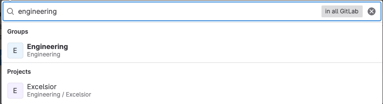
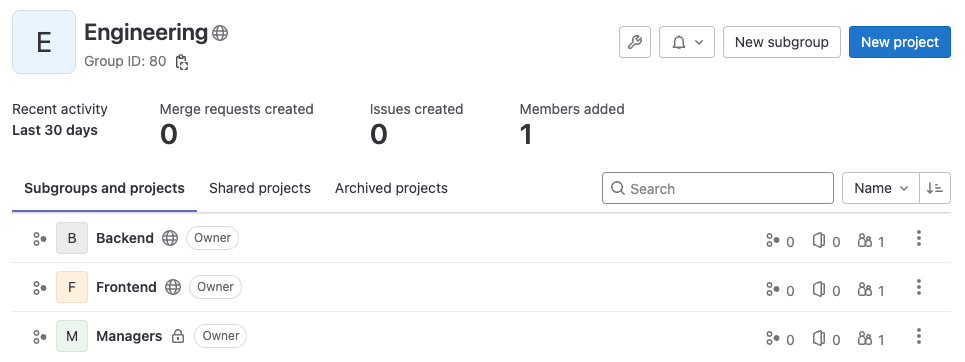
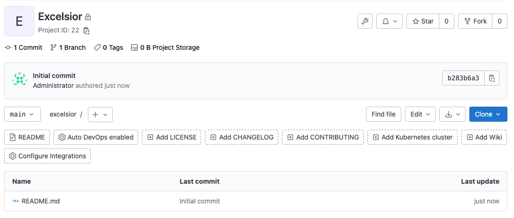
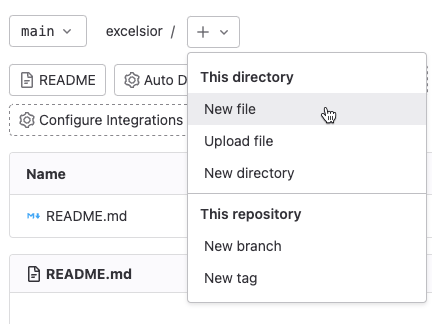
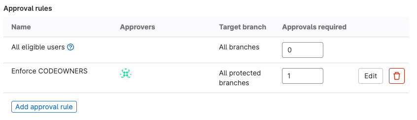
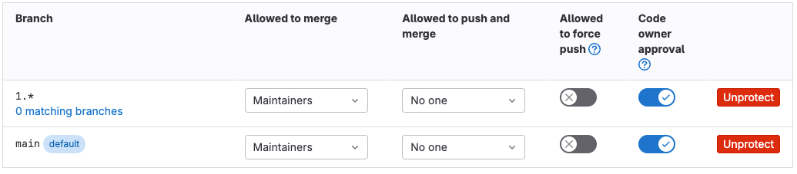
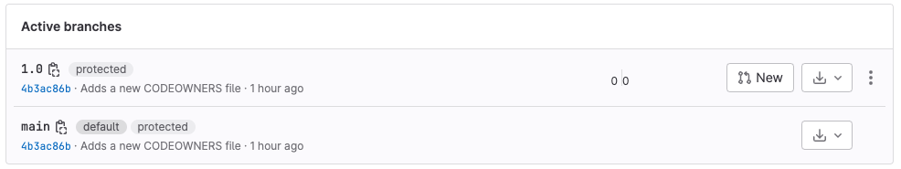
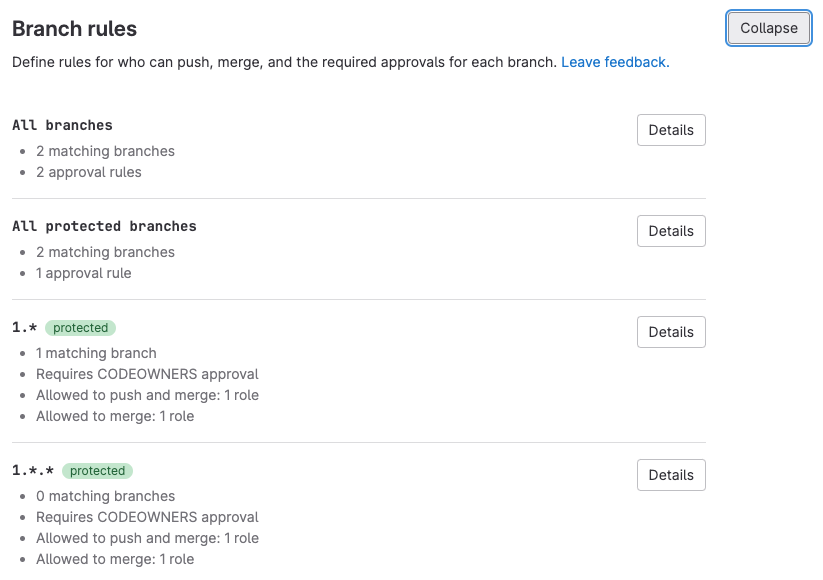

<!-- vale gitlab_base.FutureTense = NO -->



- Tier: 基础版，专业版，旗舰版
- Offering: JihuLab.com，私有化部署



当你的团队开始一个新项目时，他们需要一个平衡效率与适当审查的工作流。在极狐GitLab 中，你可以创建用户群组，将这些群组与分支保护结合起来，然后通过批准规则强制执行这些保护。

本教程为一个名为 “Excelsior” 的示例项目的 `1.x` 和 `1.x.x` 发布分支设置保护，并为其创建了一个最小的批准工作流：

1. [创建 `engineering` 群组](#create-the-engineering-group)
1. [在 `engineering` 中创建子群组](#create-subgroups-in-engineering)
1. [将用户添加到子群组](#add-users-to-the-subgroups)
1. [创建 Excelsior 项目](#create-the-excelsior-project)
1. [添加基本的 CODEOWNERS 文件](#add-a-basic-codeowners-file)
1. [配置批准规则](#configure-approval-rules)
1. [在分支上强制执行 CODEOWNER 批准](#enforce-codeowner-approval-on-branches)
1. [创建发布分支](#create-the-release-branches)

## 在开始之前

- 你必须拥有维护者或所有者角色。
- 你需要一份经理及其电子邮件地址的列表。
- 你需要一份后端和前端工程师及其电子邮件地址的列表。
- 你需要了解分支名称的[语义化版本](https://semver.org/)。

## 创建 `engineering` 群组

在设置 Excelsior 项目之前，你应该创建一个群组来拥有该项目。这里，你将设置 Engineering 群组：

1. 在右上角，选择 **创建新...** () 和 **新群组**。
1. 选择 **创建群组**。
1. 对于 **群组名称**，输入 `Engineering`。
1. 对于 **群组 URL**，输入 `engineering`。
1. 将 **可见性级别** 设置为 **私有**。
1. 个性化你的体验，以便极狐GitLab 向你显示最有用的信息：
   - 对于 **角色**，选择 **系统管理员**。
   - 对于 **谁将使用此群组？** 选择 **我的公司或团队**。
   - 对于 **你将使用此群组做什么？** 选择 **我想存储我的代码**。
1. 跳过邀请成员加入群组。你将在本教程的后面部分添加用户。
1. 选择 **创建群组**。

接下来，你将向此 `engineering` 群组添加子群组，以实现更细粒度的控制。

## 在 `engineering` 中创建子群组

`engineering` 群组是一个好的开始，但 Excelsior 项目的后端工程师、前端工程师和经理有着不同的任务和不同的专业领域。

在这里，你将在 Engineering 群组中创建三个更细粒度的子群组，以按工作类型对用户进行分段：`managers`、`frontend` 和 `backend`。然后，你将把这些新群组作为 `engineering` 群组的成员添加进去。

首先，创建新的子群组：

1. 在顶部栏中，选择 **搜索或跳转到** 并搜索 `engineering`。
1. 选择名为 `Engineering` 的群组：

   
1. 在 `engineering` 群组的概览页面上，在右上角，选择 **创建子群组**。
1. 对于 **子群组名称**，输入 `Managers`。
1. 将 **可见性级别** 设置为 **私有**。
1. 选择 **创建子群组**。

接下来，将子群组添加为 `engineering` 群组的成员：

1. 在顶部栏中，选择 **搜索或跳转到** 并搜索 `engineering`。
1. 选择名为 `Engineering` 的群组。
1. 选择 **管理** > **成员**。
1. 在右上角，选择 **邀请群组**。
1. 对于 **选择要邀请的群组**，选择 `Engineering / Managers`。
1. 添加子群组时选择角色 **维护者**。
   这将配置子群组成员在访问 `engineering` 群组及其项目时可以继承的最高角色。
1. 可选。选择一个到期日期。
1. 选择 **邀请**。

重复此过程以创建 `backend` 和 `frontend` 子群组。完成后，再次搜索 `engineering` 群组。其概览页面应显示三个子群组，如下所示：



## 将用户添加到子群组

在上一步中，当你将子群组添加到父群组 (`engineering`) 时，你将子群组的成员限制为维护者角色。这是他们可以为 `engineering` 拥有的项目继承的最高角色。因此：

- 用户 1 以访客角色添加到 `manager` 子群组，并在 `engineering` 项目上获得访客角色。
- 用户 2 以所有者角色添加到 `manager` 群组。此角色高于你设置的最高角色（维护者），因此用户 2 将获得维护者角色，而不是所有者。

要将用户添加到 `frontend` 子群组：

1. 在顶部栏中，选择 **搜索或跳转到** 并搜索 `frontend`。
1. 选择 `Frontend` 群组。
1. 选择 **管理** > **成员**。
1. 选择 **邀请成员**。
1. 填写字段。默认选择 **开发者** 角色，如果此用户审核他人的工作，可将其提升为 **维护者**。
1. 选择 **邀请**。
1. 重复这些步骤，直到将所有前端工程师添加到 `frontend` 子群组中。

现在对 `backend` 和 `managers` 群组执行相同操作。同一用户可以是多个子群组的成员。

## 创建 Excelsior 项目

现在你的群组结构已就位，创建 `excelsior` 项目以供团队工作。由于涉及前端和后端工程师，`excelsior` 应属于 `engineering`，而不是你刚才创建的任何较小的子群组。

要创建新的 `excelsior` 项目：

1. 在顶部栏中，选择 **搜索或跳转到** 并搜索 `engineering`。
1. 选择名为 `Engineering` 的群组。
1. 在 `engineering` 群组的概览页面上，在右上角，选择 **创建新...** () 和 **在此群组中** > **新项目/仓库**。
1. 选择 **创建空白项目**。
1. 输入项目详细信息：
   - 在 **项目名称** 字段中，输入 `Excelsior`。**项目路径** 应自动填充为 `excelsior`。
   - 对于 **可见性级别**，选择 **公开**。
   - 选择 **使用 README 初始化仓库** 以向仓库添加初始文件。
1. 选择 **创建项目**。

极狐GitLab 为你创建了 `excelsior` 项目，并将你重定向到其主页。它应该看起来像这样：



你将在下一步中使用此页面上的一个功能。

## 添加基本的 CODEOWNERS 文件

将一个 CODEOWNERS 文件添加到项目的根目录，以将审查路由到正确的子群组。此示例设置了四条规则：

- 所有更改都应由 `engineering` 群组中的人员审查。
- 经理应审查对 CODEOWNERS 文件本身的任何更改。
- 前端工程师应审查对前端文件的更改。
- 后端工程师应审查对后端文件的更改。

> [!note]
> 极狐GitLab 基础版仅支持可选审查。若需要强制审查，你需要 极狐GitLab 专业版或旗舰版。

要将 CODEOWNERS 文件添加到你的 `excelsior` 项目：

1. 在顶部栏中，选择 **搜索或跳转到** 并搜索 `Excelsior`。
1. 选择名为 `Excelsior` 的项目。
1. 在分支名称旁边，选择加号图标 ()，然后选择 **新建文件**：
   
1. 对于 **文件名**，输入 `CODEOWNERS`。这将在项目的根目录中创建一个名为 `CODEOWNERS` 的文件。
1. 将此示例粘贴到编辑区域中，如果你的群组结构不匹配，请更改 `@engineering/`：

   ```plaintext
   # 所有更改都应由 engineering 群组中的人员审查
   * @engineering

   # 经理应审查对此文件的任何更改
   CODEOWNERS @engineering/managers

   # 前端文件应由 FE 工程师审查
   [Frontend] @engineering/frontend
   *.scss
   *.js

   # 后端文件应由 BE 工程师审查
   [Backend] @engineering/backend
   *.rb
   ```

1. 对于 **提交消息**，粘贴：

   ```plaintext
   添加新的 CODEOWNERS 文件

   创建一个小型的 CODEOWNERS 文件以：
   - 将后端和前端更改路由到正确的团队
   - 将 CODEOWNERS 文件更改路由给经理
   - 要求所有更改都经过审查
   ```

1. 选择 **提交更改**。

现在，CODEOWNERS 文件已位于项目的 `main` 分支中，并可用于此项目中创建的所有将来分支。

## 配置批准规则

CODEOWNERS 文件描述了目录和文件类型的适当审查者。批准规则将合并请求定向到这些审查者。在这里，你将设置一个使用新 CODEOWNERS 文件中信息的批准规则，并为发布分支添加保护：

1. 在顶部栏中，选择 **搜索或跳转到** 并搜索 `Excelsior`。
1. 选择名为 `Excelsior` 的项目。
1. 选择 **设置** > **合并请求**。
1. 在 **合并请求批准** 部分，滚动到 **批准规则**。
1. 选择 **添加批准规则**。
1. 创建一个名为 `Enforce CODEOWNERS` 的规则。
1. 选择 **所有受保护的分支**。
1. 要在极狐GitLab 专业版和旗舰版中强制此规则，将 **所需批准** 设置为 `1`。
1. 将 `managers` 群组添加为批准者。
1. 选择 **添加批准规则**。
1. 滚动到 **批准设置** 并确保已选择 **防止在合并请求中编辑批准规则**。
1. 选择 **保存更改**。

添加后，`Enforce CODEOWNERS` 规则如下所示：



## 在分支上强制执行 CODEOWNER 批准

你已经为项目配置了多项保护，现在准备将这些保护组合起来，以保护你的项目的重要分支：

- 你的用户被分类到逻辑群组和子群组中。
- 你的 CODEOWNERS 文件描述了文件类型和目录的主题专家。
- 你的批准规则鼓励（在极狐GitLab 基础版中）或要求（在极狐GitLab 专业版和旗舰版中）主题专家审查更改。

你的 `excelsior` 项目使用[语义化版本](https://semver.org/)作为发布分支名称，因此你知道发布分支遵循 `1.x` 和 `1.x.x` 模式。你希望添加到这些分支的所有代码都由主题专家审查，并由经理最终决定将哪些工作合并到发布分支中。

与其一次为一个分支创建保护，不如配置通配符分支规则来保护多个分支：

1. 在顶部栏中，选择 **搜索或跳转到** 并搜索 `Excelsior`。
1. 选择名为 `Excelsior` 的项目。
1. 选择 **设置** > **代码仓**。
1. 展开 **分支规则**。
1. 选择 **添加分支规则** > **分支名称或模式**。
1. 从下拉列表中，输入 `1.*`，然后选择 **创建通配符 `1.*`**。
1. 为了要求每个人提交合并请求，而不是直接推送提交：
   1. 在 **允许合并** 部分，选择 **编辑**，设置为 **维护者**，然后选择 **保存更改**。
   1. 在 **允许推送和合并** 部分，选择 **编辑**，设置为 **没有人**，然后选择 **保存更改**。
   1. 保持 **允许强制推送** 禁用。
1. 在极狐GitLab 专业版和旗舰版中，为了要求代码所有者审查他们所处理的文件的更改，切换 **要求代码所有者的批准**。
1. 在分支表中，找到标记为 `Default` 的规则。（根据你的极狐GitLab 版本，此分支可能命名为 `main` 或 `master`。）将此分支的值设置为与 `1.*` 规则中使用的设置一致。

现在，你的规则已到位，即使还没有 `1.*` 分支：



## 创建发布分支

现在所有分支保护已到位，你已准备好创建你的 1.0.0 发布分支：

1. 在顶部栏中，选择 **搜索或跳转到** 并搜索 `Excelsior`。
1. 选择名为 `Excelsior` 的项目。
1. 在左侧边栏中，选择 **代码** > **分支**。
1. 在右上角，选择 **新分支**。将其命名为 `1.0.0`。
1. 选择 **创建分支**。

分支保护现在在 UI 中可见：

- 在左侧边栏中，选择 **代码** > **分支**。在分支列表中，`1.0.0` 分支应显示其受保护：

  
- 在左侧边栏中，选择 **设置** > **代码仓**，然后展开 **分支规则** 以查看所有受保护分支的详细信息：

  

恭喜！你的工程师可以在各自的分支中独立工作，并且所有提交到 1.0.0 发布分支以供考虑的代码都将由主题专家进行审查。