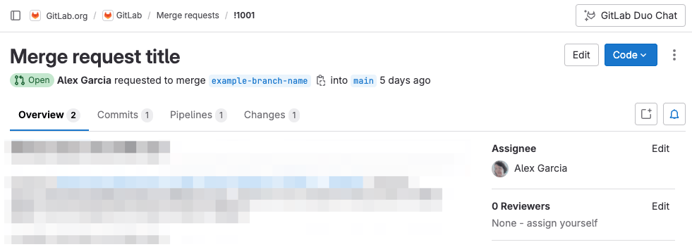
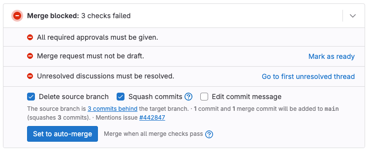
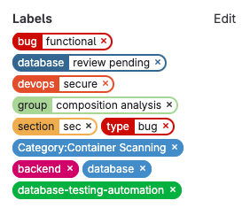
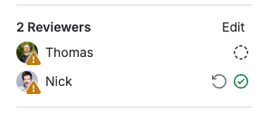
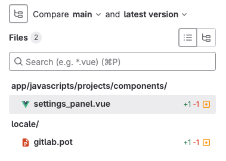
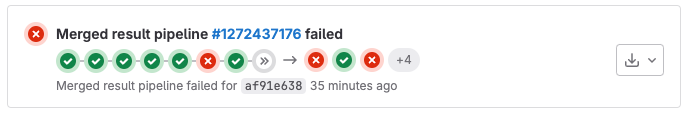
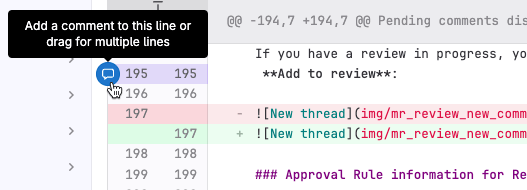

合并请求审查有助于确保只有高质量的代码才会进入你的代码库。
本教程向你展示了如何在极狐GitLab 中审查合并请求。它将引导你
了解合并请求本身的结构，然后是提供有建设性、有帮助的反馈的过程。在本教程结束时，你已经准备好
批准合并请求或请求更多更改。

要审查合并请求：

1. [前往合并请求](#go-to-the-merge-request)
1. [理解合并请求的结构](#understand-the-structure-of-merge-requests)
1. [获取高层次视图](#get-a-high-level-view-of-the-merge-request)
   1. [检查相关议题](#check-related-issues)
   1. [检查侧边栏](#check-the-sidebar)
   1. [检查评论](#check-the-comments)
1. [阅读代码变更](#read-the-code-changes)
   1. [略读变更概览](#skim-changes-for-an-overview)
   1. [深入检查每个文件](#examine-each-file-in-depth)
   1. [测试代码](#test-the-code)
   1. [检查流水线](#check-the-pipelines)
   1. [重新审查的考量](#re-review-considerations)
   1. [考虑全局](#think-about-the-big-picture)
1. [完成你的审查](#finish-your-review)
   1. [撰写审查评论](#write-your-review-comments)
   1. [总结你的审查](#summarize-your-review)
1. [执行收尾工作](#perform-cleanup-tasks)

## 前往合并请求

1. 在顶部栏，选择 **搜索或跳转到** 并找到你的项目。
1. 任选其一：
   - 按 <kbd>Shift</kbd>+<kbd>r</kbd> 前往你的 **合并请求** 页面。
   - 在右上角，选择 **合并请求** ()。

## 理解合并请求的结构

合并请求有一个包含四个选项的二级菜单。在审查过程中的不同时间点，你会用到合并请求的这些区域：

- **概览**：合并请求的描述、其当前可合并性报告、带有评论的 **动态** 区域以及包含更多信息的侧边栏。
- **提交**：此合并请求中的提交列表，最新的提交排在前面。
- **流水线**：针对此合并请求内容运行的 CI/CD 流水线列表。
- **变更**：此合并请求中提议的变更的差异，显示了删除、添加和更改的行。

**概览** 选项卡中的侧边栏包含有关合并请求本身的重要元数据：指派人、审查者、标签、里程碑和时间跟踪。

## 获取合并请求的高层次视图

在深入审查代码之前，你应该在高层次上评估合并请求。理解合并请求的背景和目的：它试图做什么，以及为什么。将这些需求与你的技能组合进行比较，同时问自己这些问题：

1. 合并请求背后的故事是什么？我是否有足够的这方面背景知识来进行深思熟虑的审查？
1. 请求了什么类型、多深度的审查？例如，一个范围狭窄的错误修复和一个深入的架构审查，审查期望可能非常不同。
1. 你是审查这项工作的合适人选吗？它需要的审查类型是否与你的技能和能力匹配？

从查看合并请求的描述开始。它应该是对某个议题中问题或功能请求的解决方案。

- 作者是谁？你熟悉这个人的工作吗？如果你熟悉这个人，他们通常处理代码库的哪个部分？之后，你对作者的了解有助于你判断如何审视他们的变更。
- 目标是什么？阅读描述以理解作者的意图。
- 它是草稿吗？草稿通常是不完整或理论性的解决方案。一个草稿合并请求可能需要与完全完成的合并请求不同程度的审视。
- 你如何重现问题？描述是否解释了如何重现问题、测试更改或试用新功能？它是否包含屏幕截图来指导你？

在描述下方，检查合并请求小部件以了解这项工作的当前状态。此示例显示了一个合并小部件，该合并请求缺少审批、仍处于草稿模式并且有开放的讨论线程：

- 它是否交叉链接到一个议题？检查描述和合并小部件中是否存在指向其他议题的链接。有些合并请求很直接，但有些需要你阅读相应的议题才能理解这个合并请求的来龙去脉。更复杂的合并请求应指回包含完整信息的议题。
- 流水线状态如何？流水线是绿色的吗？红色的流水线指向问题。如果你看到未完成或已取消的流水线，你尚无法评估工作的完整可合并性。

### 检查相关议题

如果存在相关议题，并且合并请求感觉足够复杂以至于你需要更多信息，请浏览议题描述。

- 问题和解决方案是分开的吗？议题应描述和调查问题，而合并请求应侧重于解决方案。
- 合并请求作者是否参与了该议题？在整个审查过程中，考虑谁帮助定义了问题（或功能）。理想情况下，这些人也参与了合并请求。

### 检查侧边栏

- 它有什么标签？标签可以提供有关合并请求内容的线索。根据你团队的工作流程，不完整或缺失的标签可能无害，或者可能表明此合并请求缺少完整信息。
  - 如果标签与你的专业领域匹配，你很可能是一个合适的候选人来审查此合并请求。
  - 如果标签匹配你不具备的专业领域，你可能需要将合并请求重新分配给其他审查者。
  - 添加你的工作流程所期望的任何标签。

  在这个例子中，即使具体的标签你不熟悉，你也可以确定这个合并请求是关于一个数据库错误：

  
- 谁是审查者？扫描审查者列表中的名字。根据描述和（可选）标签，他们是否与你期望的工作类型匹配？同时考虑谁在场，谁缺席。这些名字告诉你此合并请求处于其审查周期的哪个阶段？你需要添加或移除任何人吗？
- 是否有审查者已经批准？如果你认识那些审查者及其专业领域，你可以大致了解提议的变更的哪些方面需要你的关注。

  在此示例中，Thomas 和 Nick 都是审查者。Thomas 尚未审查 () 此合并请求。Nick 已经审查并批准 ()：

  

### 检查评论

在 **概览** 页面上，阅读作者和其他人留下的评论。
在你阅读代码变更时，请记住这些讨论。

你在评论中是否看到先前审查的证据？大量的评论可能会影响你想要审查这项工作的深度。

## 阅读代码变更

现在你已经准备好阅读提议的变更。对于大型合并请求，
在深入之前先浏览变更。在你开始逐行阅读变更之前，先建立对预期内容的了解。

> [!note]
> **变更** 选项卡中显示的差异信息密集。要了解
> 如何充分利用此页面，请参阅
> [合并请求中的变更](../../user/project/merge_requests/changes.md)。

### 略读变更概览

当你第一次打开 **变更** 页面时，首先要关注更广泛的细节：

- **哪些文件发生了变更**？展开文件浏览器 () 以查看
  已变更文件的列表。你熟悉这些文件吗？这些文件位于代码库的哪个部分？

  
- 文件列表是否符合你的预期？你已经阅读了合并请求的描述。
  对于这种类型的工作，这些是你预期会看到变更的文件吗？对意外文件的变更要格外注意，或者如果你期望看到的变更缺失了。
- 是添加、删除还是更改了行？这些数字告诉你
  在深入阅读时期待看到哪种类型的工作：新功能、移除的功能还是行为变更？
- 是否有任何测试被更改？是否有任何文件是你测试套件的一部分？
  如果没有，你可能需要促使作者更新测试。
- 是否使用了功能标志？如果你看到功能标志，记下来以便在深入阅读时检查其使用情况。

当你完成变更略读后，就可以逐行阅读变更了！

### 深入检查每个文件

现在你对这个合并请求中包含的变更有了一个大致的了解。是时候深入
并完整阅读变更了。始终注意你的知识强项在哪里，
弱项在哪里。你对这个项目了解吗？这些变更是否用
你擅长的语言编写？

- 变更是否清晰易懂？
- 是否使用了功能标志？变更是否测试了功能标志的存在或缺失？确保功能标志控制的变更在标志禁用时不会意外泄露。
- 性能如何？你是否能自己测试性能，还是应该添加一位具有更深入性能知识的审查者？
- 它可以简化吗？
- 它考虑了边缘情况吗？
- 它有正确的注释和文档吗？好的代码是可由他人维护的，而不仅仅是作者。作者是否提供了足够的解释以使这项工作可维护？
- 它遵循你团队的风格期望吗？
- 它是否向后兼容？这项工作是破坏性变更吗？它会导致数据丢失吗？
- 安全问题是否得到解决？这些变更是否在你项目中具有特殊安全问题的区域？它们是否恰当地处理了敏感数据？它们是否接受用户输入，并且输入已经过净化？你是否应该添加一位具备更多安全知识的审查者？
- 是否留下了任何调试语句？

不同类型的变更对你的代码库有不同的影响。泛泛地考虑：

- 添加的行：新代码不应修改现有行为。
  新行为是否经过测试？测试是否足够细致？
- 删除的行：删除是否干净且彻底？删除的代码和
  测试在范围上是否相互匹配？确保没有在这两处留下部分存根。
- 修改的行：如果添加的行和删除的行大致相等，
  这是对现有代码的重构吗？对于重构，你是否理解
  之前的代码做了什么，以及新代码如何以不同方式实现的？行为上的
  变更是否与作者在描述中陈述的意图相符？测试仍然正常工作吗？

### 测试代码

不幸的是，我们在这里无法给你太多指导。每个项目都不同！
在不直接了解你的应用程序的情况下，我们无法告诉你如何测试
变更，但我们可以提供一些需要考虑的问题：

- 它能正常工作吗？这是一个看似简单的问题，但牢记在心很重要。代码可能丑陋、复杂且没有文档，但仍能正常工作。
- 审查过程进展到哪一步了？是审查过程的早期还是晚期？你是专家吗？

  - 过程早期的审查者应验证代码是否按照作者所说的方式工作。这可以防止更多人花时间在不能或不应合并的代码上。
  - 过程后期的审查者可能不参与确保功能按宣传的那样工作，而是可能更多地关注风格和可维护性。
  - 专业审查者可能只审查合并请求的某些部分，而不处理整个合并请求是否按预期工作的问题。

在你测试代码的同时，你还应该检查流水线状态。虽然你还没有写任何审查评论，但你差不多准备好了。

### 检查流水线

转到合并请求的 **流水线** 选项卡，并验证流水线状态。
仅在流水线成功时才批准合并请求。
在此示例中，多个作业失败了：

- 所有预期的测试都运行了吗？确保流水线不仅绿了，而且是完整的。
- 是否有任何测试失败？展开 **失败的作业** 以查看哪些测试（如果有的话）失败了。
- 每个失败的作业中发生了什么？选择每个失败的作业。滚动浏览
  输出，扫描提及失败、错误以及标红的行。当你
  撰写审查评论时，你希望帮助作者理解需要修复什么，
  以及如何修复。
- 失败是否与变更相关？如果失败感觉无关，
  考虑重新运行该作业或流水线。

### 重新审查的考量

有时合并请求审查并非一帆风顺，需要指派人 和审查者之间反复沟通。如果你正在重新审查工作，请转到
此合并请求的 **提交** 页面，并阅读你在上次审查后添加的提交的内容。

这些提交是否解决了你初始审查中提出的问题？

### 考虑全局

你现在已经为进行一次深思熟虑、有帮助的审查做好了准备工作。当你第一次略读
合并请求时，你并不完全了解代码行级别的变更。
现在你了解了！在你开始写作之前，从逐行查看合并请求的视角退后一步，
再次广泛地思考它。你现在知道合并请求
试图做什么，以及它是如何做的。

- 合并请求中的变更是否符合预期的范围？如果不符合，
  问问自己这项工作是否应该简化，或者分解成多个合并请求。诚实地对待你自己的知识范围和你自己的局限性。
- 你察觉到 [代码坏味](https://martinfowler.com/bliki/CodeSmell.html) 了吗？
  如果你看到的不是错误，但它指向未来的质量、可维护性
  或安全性问题，请留意。如果对某些变更感觉不对劲、模糊不清或做得不好，请相信你的直觉。代码在技术上可能是正确的，
  但包含可能导致未来出现问题的弱点。

最好且最有帮助的代码审查不仅关注逐行的修复。
它们还考虑长期问题，如可维护性和技术债务。

## 完成你的审查

是时候提供反馈了！

当你刚开始审查合并请求时，你可能会惊讶于你在写下第一条评论之前花费了多少时间思考。随着你对代码库更加熟悉，你将更快地理解新的合并请求。然而——你可能也会开始承担更复杂的审查。

### 撰写审查评论

**开始审查** 功能使你可以将你的想法写在
待处理的评论中。这些评论在你提交审查之前对其他人不可见。这避免了你的收件人消息过载，并让你有机会在发布前重新检查（和更改）你的言辞。

记住要保持建设性和友善。[常规评论](https://conventionalcomments.org/)的结构可以帮助你撰写出既深思熟虑又有建设性的评论。

首先，写下你想要附加到特定行或文件的评论：

1. 选择 **变更** 选项卡。
1. 当你找到想要提问或提供反馈的行时，
   在行号旁选择 **对此行添加评论** ()。这将展开
   差异行并显示一个评论框。
1. 你也可以
   [选择多行](../../user/project/merge_requests/reviews/suggestions.md#multi-line-suggestions)，
   或选择整个文件进行评论：

   
1. 在文本区域，写下你的第一条评论。要将你的评论保密直到
   你的审查结束，在你的评论下方选择 **开始审查**。
1. 当修复对你来说很容易草拟，或者如果你想向作者展示更好的方法时，
   [提供建议](../../user/project/merge_requests/reviews/suggestions.md)。
   如果代码变更太大或太复杂，不适用于建议格式，请留下请求更改的评论。
1. 继续对文件和单独的代码行发表评论。在每条评论后，
   选择 **添加到审查**。

在你工作时，你可以在你的审查评论中使用 [快速操作](../../user/project/quick_actions.md)，例如
`/label` 或 `/assign_reviewer`。你待处理的评论会显示你请求的操作，但这些操作在你提交审查之前不会执行。（之后，你也可以使用 `/submit_review` 快速操作提交你的审查！）

### 总结你的审查

你已经添加了针对文件和行的反馈，现在你准备好总结你的审查了。是时候最后一次广泛地思考了。

1. 返回到合并请求的 **概览** 页面。
1. 浏览你待处理的评论。它们应该是有帮助的、深思熟虑的、友善的，并且——最重要的是——可操作的。你是否给作者指出了一个明确的下一步来修复你发现的任何问题？
1. 考虑你的语气。你是在教导、辩论还是讨论？你的评论是否达到了你的目标？如果你是作者，你会知道下一步该怎么做吗？强化好的行为，并将作者从不好的行为中引导出来。
1. 你的评论仍然合理吗？在大型合并请求中，你可能会发现一些评论不再有用，或者你之前的一些问题在此期间已经得到了解答。
1. 为概括性的反馈开启讨论串。确保不相关的条目不要混杂在同一个评论中，这样当讨论串解决时，未处理的反馈就不会被隐藏。一些可能的主题：
   - 将大函数分解成更小的、单一用途的函数。
   - 使用有意义的变量名。
   - 添加更多注释来解释复杂代码。
   - 检查边缘情况和错误。
1. 为你的总结评论开启一个新讨论串。确保你提到了作者的
   用户名，以防他们根据待办事项工作。清楚地说明：
   - 你的总体发现是什么？
   - 你审查完了吗，还是你想在更多工作完成后再次查看这个合并请求？
1. 在右上角，选择 **你的审查** 以显示关于你审查的详细信息：

   
1. 检查你待处理的评论。根据需要编辑它们。
1. 选择你审查的结论。

   - **批准**：留下反馈并批准更改。
   - **评论**：留下一般性反馈，不做明确的批准或请求更改。
   - **请求更改**：阻止合并请求合并，直到作者处理完你的反馈。

1. 可选。撰写一份审查摘要。极狐GitLab 专业版和旗舰版用户可以选择
   **添加摘要** () 来为你创建摘要。包括任何
   你想要执行的快速操作。

你也可以在非审查评论的文本中使用 [`/submit_review` 快速操作](../../user/project/quick_actions.md#submit_review)。

如果你 [批准一个合并请求](../../user/project/merge_requests/approvals/_index.md#approve-a-merge-request)
并显示在审查者列表中，你的名字旁边会显示一个绿色的勾号 。

## 执行收尾工作

在你提供反馈后，整理一下。

- 确保所有待处理的评论都已提交。
- 更新标签和里程碑。
- 检查审批要求。
  - 合并请求中的每种工作类型（后端、前端、文档）是否都有合适的人审查过？
  - 如果需要更多审查，提及下一位审查者的用户名，并将他们添加为审查者。
- 检查合并小部件。
  - 处理你能解决的阻碍，并分配用户来帮助你处理你不能解决的阻碍。
  - 添加任何需要审查的代码所有者。
- 这个合并请求准备好合并了吗？如果合并请求已经完全审查并批准，请将其分配给维护者进行合并！