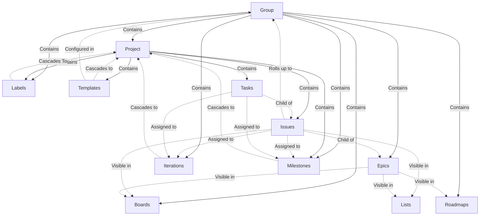
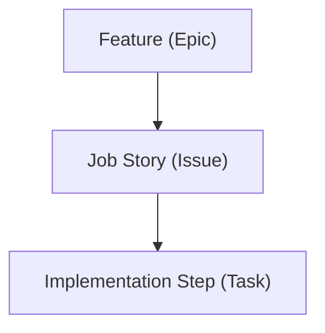
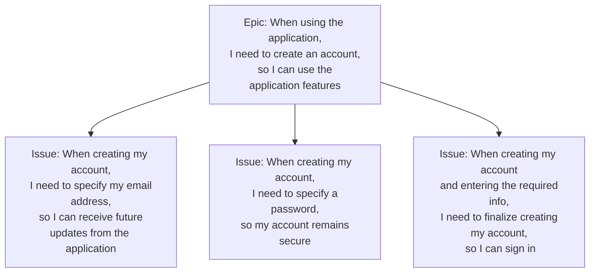
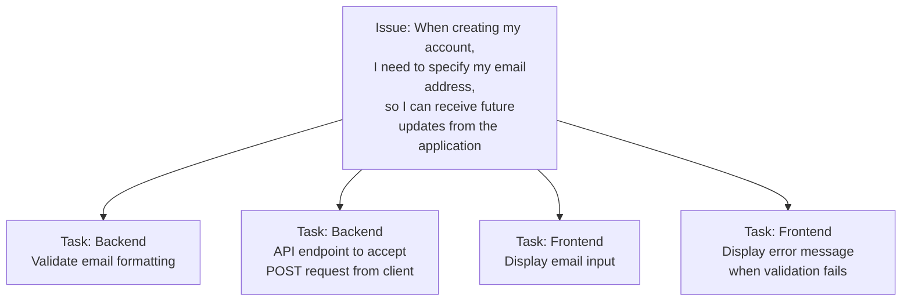



- Tier: 专业版，旗舰版
- Offering: JihuLab.com，私有化部署



<!-- vale gitlab_base.FutureTense = NO -->

本教程提供了关于使用极狐GitLab 中的敏捷规划和跟踪功能来促进核心 Scrum 仪式和工作流程的分步指导。通过有意识地设置群组、项目、看板和其他功能，团队可以实现更高的透明度、协作和交付节奏。

根据 Martin Fowler 的 [Agile Fluency Model](https://martinfowler.com/articles/agileFluency.html)，实践 [Scrum](https://scrumguides.org/scrum-guide.html) 的团队：

> ...从他们的赞助商、客户和用户将从他们的软件中看到的利益角度来思考和规划。

他们通过每月展示他们的进展来实现这一点；定期反思改善他们的流程和工作习惯，以提供更多的业务和客户价值。

本教程涵盖以下主题：

- [设置你的群组和项目](#setting-up-your-groups-and-projects)
- [管理你的功能待办列表](#managing-your-feature-backlog)
- [管理你的故事待办列表](#managing-your-story-backlog)
- [跟踪冲刺进度](#tracking-sprint-progress)

<a id="setting-up-your-groups-and-projects"></a>

## 设置你的群组和项目

为了在极狐GitLab 中促进 Scrum 实践，你首先需要设置群组和项目的基础结构。你将使用群组创建看板和标签，这些可以被嵌套在该群组下的项目继承。项目将包含构成每个冲刺实际工作项的议题和任务。

<a id="understanding-the-inheritance-model-in-gitlab"></a>

### 了解极狐GitLab 的继承模型

极狐GitLab 有一个分层结构，其中群组包含项目。在群组级别应用的设置和配置会向下级联到子项目，因此你可以跨多个项目标准化标签、看板和迭代：



- 群组包含一个或多个项目、史诗、看板、标签和迭代。群组中的用户成员资格会级联到群组的项目。
- 你可以在群组或项目中创建看板和标签。对于本教程，你应该在群组中创建它们，以促进单个群组中跨多个项目的标准化规划工作流程和报告。
- 任何向下级联到项目的对象都可以与该项目的议题相关联，例如：你可以将群组中的标签应用到议题上。

<a id="create-your-group"></a>

### 创建你的群组

为你的 Scrum 活动创建一个专用群组。这将是项目和配置（如看板和标签）的父容器，你希望这些内容跨项目标准化。

该群组将是典型 Scrum 节奏期间不同活动的主要场所。它将包含你的看板、功能（史诗）、故事（议题）汇总和标签。

要创建群组：

1. 在右上角，选择 **新建**（）并选择 **新建群组**。
1. 选择 **创建群组**。
1. 在 **群组名称** 文本框中，输入群组的名称。有关不能用作群组名称的词汇列表，请参阅[保留名称](../../user/reserved_names.md)。
1. 在 **群组 URL** 文本框中，输入用于[命名空间](../../user/namespace/_index.md)的群组路径。
1. 选择群组的[**可见性级别**](../../user/public_access.md)。
1. 可选。要个性化你的极狐GitLab 体验：
   - 从 **角色** 下拉列表中，选择你的角色。
   - 对于 **谁将使用这个群组？**，选择一个选项。
   - 从 **你将使用此群组做什么？** 下拉列表中，选择一个选项。
1. 可选。要邀请成员加入群组，在 **电子邮件 1** 文本框中输入你要邀请的用户的电子邮件地址。要邀请更多用户，选择 **邀请其他成员** 并输入用户的电子邮件地址。
1. 选择 **创建群组**。

<a id="create-your-projects"></a>

### 创建你的项目

在你创建的群组中，创建一个或多个项目。你的项目将包含汇总到父群组的故事。

要创建空白项目：

1. 在右上角，选择 **新建**（）并选择 **新建项目/代码仓**。
1. 选择 **创建空白项目**。
1. 输入项目详情：
   - 在 **项目名称** 字段中，输入你的项目名称。请参阅[项目名称的限制](../../user/reserved_names.md)。
   - 在 **项目标识符** 字段中，输入你的项目路径。极狐GitLab 实例使用该标识符作为项目的 URL 路径。要更改标识符，请先输入项目名称，然后更改标识符。
   - 要修改用户对项目的[查看和访问权限](../../user/public_access.md)，请更改 **可见性级别**。
   - 要创建 README 文件以便初始化 Git 仓库、拥有默认分支并可克隆，请勾选 **通过自述文件初始化仓库**。
1. 选择 **创建项目**。

<a id="create-scoped-labels-to-support-different-phases-of-the-scrum-lifecycle"></a>

### 创建范围标签以支持 Scrum 生命周期的不同阶段

接下来，在你创建的群组中，你将创建标签以添加到议题上进行分类。

最佳工具是[范围标签](../../user/project/labels.md#scoped-labels)，你可以使用它来设置互斥的属性。

范围标签名称中的双冒号 (`::`) 可以防止同一个范围内的两个标签同时使用。例如，如果你将 `status::in progress` 标签添加到一个已有 `status::ready` 标签的议题，前一个标签将被移除。

要创建每个标签：

1. 在顶栏中，选择 **搜索或跳转到** 并找到你的群组。
1. 在左侧边栏中，选择 **管理** > **标签**。
1. 选择 **新建标签**。
1. 在 **标题** 字段中，输入标签的名称。以 `priority::now` 开头。
1. 可选。通过从可用颜色中选择或在 **背景颜色** 字段中输入特定的十六进制颜色值来选择颜色。
1. 选择 **创建标签**。

重复这些步骤来创建你需要的所有标签：

- **优先级**：你将在史诗看板上使用这些标签来促进功能级别的发布优先级排序。
  - `priority::now`
  - `priority::next`
  - `priority::later`
- **状态**：你将在议题看板上使用这些标签来了解故事在整个开发生命周期中的当前步骤。
  - `status::triage`
  - `status::refine`
  - `status::ready`
  - `status::in progress`
  - `status::in review`
  - `status::acceptance`
  - `status::done`
- **类型**：你将使用这些标签来表示通常被拉入单个迭代的不同类型的工作：
  - `type::story`
  - `type::bug`
  - `type::maintenance`

<a id="create-an-iteration-cadence"></a>

### 创建迭代节奏

在极狐GitLab 中，冲刺被称为迭代。迭代节奏包含用于规划和报告议题的单个、顺序的迭代时间盒。与标签类似，迭代会级联到你的群组、子群组和项目层次结构中。这就是为什么你要在你创建的群组中创建迭代节奏。

先决条件：

- 你必须对群组具有报告者、开发者、维护者或所有者角色。

要创建迭代节奏：

1. 在顶栏中，选择 **搜索或跳转到** 并找到你的群组。
1. 在左侧边栏中，选择 **计划** > **迭代**。
1. 选择 **新建迭代节奏**。
1. 输入迭代节奏的标题和描述。
1. 确保勾选了 **启用自动调度** 复选框。
1. 完成使用自动调度所需的字段。
   - 选择迭代节奏的自动化开始日期。迭代计划在与开始日期相同的工作日开始。
   - 从 **持续时间** 下拉列表中，选择 **2**。
   - 从 **即将到来的迭代** 下拉列表中，选择 **4**。
   - 勾选 **启用滚动** 复选框。
1. 选择 **创建节奏**。节奏列表页面将打开。

通过这样的迭代节奏配置：

- 每个冲刺为两周长。
- 极狐GitLab 会自动创建未来的四个冲刺。
- 当冲刺关闭时，未完成的议题会自动重新分配到下一个冲刺。

你还可以禁用 **自动调度** 并[手动创建和管理迭代](../../user/group/iterations/_index.md#create-an-iteration-manually)。

<a id="managing-your-feature-backlog"></a>

## 管理你的功能待办列表

功能待办列表以史诗的形式捕获想法和所需的功能。当你优化此待办列表时，史诗将被优先排序以流入即将到来的冲刺中。本节涵盖创建史诗看板以促进待办列表管理以及撰写你的第一个功能史诗。

<a id="decide-on-a-way-to-structure-your-work"></a>

### 决定一种组织工作的方法

极狐GitLab 可扩展以支持不同风格的待办列表管理。对于本教程，我们将按以下方式组织我们的交付成果：



- 一个史诗代表一个团队可以在单个迭代中交付的功能。
- 每个史诗将包含许多[工作故事](https://medium.com/@umang.soni/moving-from-user-role-based-approach-to-problem-statement-based-approach-for-product-development-18b2d2395e5)。
  - 一个故事应提供有形的客户价值，包含明确的验收标准，并且小到个人可以在一两天内完成。
  - 你应该能够在每个冲刺中作为一个团队完成四到十个故事。
- 虽然有许多拆分功能的策略，但一个很好的策略是[垂直切片](https://www.agilerant.info/vertical-slicing-to-boost-software-value/)故事，将其分解为用户完成目标必须采取的离散、独立的故事。

  虽然你可能无法将单个故事交付给客户，但你的团队应该能够通过在生产环境或暂存环境中使用功能标志来测试每个故事并与之交互。这不仅有助于让利益相关者了解故事的进展，也是一种将更复杂的功能分解为可实现开发目标的机制。
- 根据故事的复杂性，你可以使用任务将故事分解为开发人员完成故事所需的具体实施步骤。

在时间范围方面，请瞄准以下指导方针来确定工作项的规模和范围：

- 一个 **功能** 可以在单个迭代中完成。
- 一个 **故事** 可以在几天内完成。
- 一个 **任务** 可以在几小时到一天内完成。

<a id="example-vertically-slicing-a-feature"></a>

#### 示例：垂直切片一个功能

以下是一个根据最终用户旅程将功能分解为垂直切片工作故事的示例：



你已将一个应用程序的未修改账户创建功能分解为三个独立的故事：

1. 输入电子邮件地址。
1. 输入密码。
1. 选择一个按钮来执行账户创建。

在你将功能分解为故事后，你可以进一步将故事分解为具体的实施步骤：



<a id="set-up-a-release-planning-board"></a>

### 设置发布规划看板

你已经定义了你的交付结构。下一步是创建一个史诗看板，你将使用它来构建和维护你的功能待办列表。

要创建新的史诗看板：

1. 在顶栏中，选择 **搜索或跳转到** 并找到你的群组。
1. 在左侧边栏中，选择 **计划** > **史诗看板**。
1. 在左上角，选择带有当前看板名称的下拉列表。
1. 选择 **创建新看板**。
1. 输入新看板的标题：`发布规划`。
1. 选择 **创建看板**。

接下来，[创建列表](../../user/group/epics/epic_boards.md#create-a-new-list) 用于 `priority::later`、`priority::next` 和 `priority::now` 标签。

要创建新列表：

1. 在看板的右上角，选择 **创建列表**。
1. 在 **新建列表** 列中，展开 **选择一个标签** 下拉列表，然后选择要用作列表范围的标签。
1. 选择 **添加到看板**。

你将使用这些列表来促进功能从左到右在看板上移动。

使用发布规划看板中的每个列表来表示以下时间范围：

- **打开**: 尚未准备好进行优先级排序的功能。
- **以后**: 将被优先安排到以后发布的功能。
- **下一个**: 暂定计划用于下一个发布的功能。
- **现在**: 当前发布优先考虑的功能。
- **已关闭**: 已完成或已取消的功能。

<a id="create-your-first-epic"></a>

### 创建你的第一个史诗

接下来，在 `priority::now` 列表中创建一个新的史诗：

1. 在 **`priority::now`** 列表的顶部，选择 **新建史诗** () 图标。
1. 输入新史诗的标题：

   ```plaintext
   当使用该应用程序时，我需要创建一个账户，以便可以使用该应用程序的功能。
   ```

1. 选择 **创建史诗**。

完成此步骤后，你的看板应该类似于：


你现在可以使用 **发布规划** 看板来快速构建你的待办列表。

填充许多功能并按 **现在**、**下一个**、**以后** 列表进行优先级排序。接下来，花一些时间将每个故事进一步分解为故事和任务。

要对列表内或跨列表的功能史诗重新排序，请拖拽史诗卡片。你还可以[将卡片移动到列表的顶部或底部](../../user/group/epics/epic_boards.md#move-an-epic-to-the-start-of-the-list)。

<a id="managing-your-story-backlog"></a>

## 管理你的故事待办列表

当你将功能定义为史诗后，下一步是将这些功能分解为细粒度的垂直切片作为议题。然后，你将在专用的待办列表看板上跨迭代对这些问题进行优化和排序。

<a id="break-down-features-into-stories"></a>

### 将功能分解为故事

提前将功能分解为垂直切片的故事，以便进行高效的冲刺规划会议。在上一步中，你创建了你的第一个功能。让我们把它分解为故事。

要创建你的第一个故事：

1. 在顶栏中，选择 **搜索或跳转到** 并找到你的群组。
1. 在左侧边栏中，选择 **计划** > **史诗看板**。
1. 在左上角，确保带有当前看板名称的下拉列表显示 **发布规划**。如果不是，请从下拉列表中选择该看板。
1. 通过单击史诗卡片的标题打开一个史诗。
1. 在 **子议题和史诗** 部分中，选择 **添加** > **添加新议题**。
1. 输入以下议题标题：

   ```plaintext
   当创建我的账户时，我需要指定我的电子邮件地址，以便我可以从应用程序接收以后的更新。
   ```

1. 从 **项目** 下拉列表中，选择你要在其中创建议题的项目。
1. 选择 **创建议题**。
1. 为另外两个垂直切片重复此过程：

   ```plaintext
   当创建我的账户时，我需要指定一个密码，以便我的账户保持安全。
   ```

   ```plaintext
   当创建我的账户并输入所需信息时，我需要完成创建我的账户，以便我可以登录。
   ```

<a id="refine-your-story-backlog"></a>

### 优化你的故事待办列表

在上一步中，你已将功能分解为完成功能所必需的用户故事。接下来，设置一个议题看板，作为你管理和优化故事待办列表的规范位置。

在你的群组中，创建一个名为 **待办列表** 的新议题看板。你将使用此看板来排序和安排你的故事到即将到来的冲刺（迭代）中：

1. 在顶栏中，选择 **搜索或跳转到** 并找到你的群组。
1. 在左侧边栏中，选择 **计划** > **议题看板**。
1. 在左上角，选择带有当前看板名称的下拉列表。
1. 选择 **创建新看板**。
1. 输入新看板的标题：`待办列表`。
1. 选择 **创建看板**。

创建看板后，为每个即将到来的迭代创建一个新列表：

1. 在议题看板页面的右上角，选择 **创建列表**。
1. 在出现的列中，在 **范围** 下，选择 **迭代**。
1. 从 **值** 下拉列表中，选择其中一个迭代。
1. 选择 **添加到看板**。
1. 为其他即将到来的迭代重复上一步。

然后，当一个迭代结束时，你应该[删除已完成的迭代列表](../../user/project/issue_board.md#remove-a-list) 并为根据你的节奏设置自动创建的新未来迭代添加一个新列表。

此时，故事尚未被估算或细化为任务。标记它们以进行优化：

1. 在看板中[选择每个议题的卡片](../../user/project/issue_board.md#edit-an-issue)并应用 `status::refine` 标签：
   1. 在侧边栏的 **标签** 部分中，选择 **编辑**。
   1. 从 **选择标签** 列表中，选择 `status::refine` 标签。
   1. 选择标签部分之外的任何区域。
1. 将三个故事拖拽到所需的即将到来的冲刺中，以将故事分配给相应的冲刺时间盒。

在教程的这一点上，你的 **待办列表** 看板应该类似于：


在实践中，你将使用此看板将许多故事排序到即将到来的迭代中。当你的待办列表增长，并且你有数十个故事跨越多个功能时，启用[**按史诗分组**](../../user/project/issue_board.md#group-issues-in-swimlanes)会很有帮助，这样你就可以查看与相应功能史诗相关的故事。当故事被分组时，更容易将它们排序到即将到来的冲刺中。

<a id="sprint-planning-ceremony"></a>

### 冲刺规划仪式

准备好待办列表后，是时候规划即将到来的冲刺了。你可以使用同步和异步的方式在极狐GitLab 中促进冲刺规划会议。

<a id="synchronous-planning"></a>

#### 同步规划

当你的冲刺规划仪式开始时，与团队一起打开 **待办列表** 看板并处理每个故事。你应该在当前冲刺的最后一天开始规划你的下一个冲刺。在讨论每个议题时：

- 审查和协作验收标准。你可以使用清单或列表项将此捕获在议题的描述中。
- 对于每个实施步骤，进一步[将故事分解为任务](../../user/tasks.md#create-a-task)。
- 估算议题的故事点工作量或复杂性，并在议题的 **权重** 字段中设置此值。
- 在团队对议题的范围感到满意并就故事点值达成一致后，对议题应用 `status::ready` 标签：

  1. 在侧边栏的 **标签** 部分中，选择 **编辑**。
  1. 从 **选择标签** 列表中，选择 `status::ready` 标签。
  1. 选择标签部分之外的任何区域。

在你完成即将到来的迭代中的所有议题后，冲刺规划就完成了！

记住要将团队的速度纳入你的冲刺承诺中。你可以在每个迭代列表的顶部找到分配给每个冲刺的故事点（权重）总数。同样值得确保考虑到可能从前一个冲刺滚动过来的故事点。

<a id="asynchronous-planning"></a>

#### 异步规划

与其举行同步会议，不如使用一个议题来运行你的冲刺规划。

鉴于异步冲刺规划的性质，你应当在当前冲刺结束前几天开始。为所有团队成员提供适当的时间来贡献和协作。

1. 打开 **待办列表** 议题看板：
   1. 在顶栏中，选择 **搜索或跳转到** 并找到你的群组。
   1. 选择 **计划** > **议题看板**。
   1. 在左上角，选择带有当前看板名称的下拉列表。
   1. 选择 **待办列表**。
1. 在即将到来的冲刺列表中，选择 **新建议题**（）。
1. 输入议题的标题：`发布规划`。
1. 选择 **创建议题**。
1. 打开议题并为分配给即将到来的冲刺的每个故事创建一个讨论线程。

   在议题 URL 后附加 `+` 以自动展开标题。
   在议题 URL 后附加 `+s` 以自动展开标题、里程碑和指派人。
   你可以为这些线程使用以下模板来创建复选框：

   ```markdown
   ## https://gitlab.example.com/my-group/application-b/-/issues/5+

   - [ ] 验收标准已定义
   - [ ] 权重已设置
   - [ ] 实施步骤（任务）已创建
   ```

   例如：

   
1. 在每一个故事都有一个线程后，编辑议题描述并[提及每个团队成员](../../user/discussions/_index.md#mentions)。提及团队成员会在他们各自的[待办事项列表](../../user/todos.md)中自动为他们创建一个待办事项。
1. 然后，在即将到来的冲刺开始之前，团队成员应该异步地：

   - 讨论每个议题，提出问题，并协作以就每个计划议题的验收标准达成一致。
   - 使用反应表情符号，如 `:one:`、`:two:` 和 `:three:`，对他们认为的故事点（权重）应该是什么进行投票。如果团队成员设置了不同的故事点值，这是一个进一步讨论直到达成共识的绝佳机会。你也可以对所有各种反应取平均值以确定故事点值。
   - 将垂直切片（议题）分解为实施步骤（任务）。

1. 在每个故事讨论结束时，使用验收标准的任何更改更新议题，并在 **权重** 字段中设置故事点值。
1. 故事更新后，将 `status::ready` 标签添加到每个议题。
1. 然后，为了表示该垂直切片的规划已完成，[解决规划议题中的每个讨论线程](../../user/discussions/_index.md#resolve-a-thread)。

<a id="tracking-sprint-progress"></a>

## 跟踪冲刺进度
<a id="visualize-and-manage-the-work-during-a-sprint"></a>

为了可视化和管理工作冲刺期间的工作，团队可以创建一个专门的议题板来代表当前冲刺的范围。
这个看板可以透明地展示团队的进度和任何潜在的阻碍。
团队还可以使用迭代分析，通过燃尽图获取额外的可见性。

<a id="create-a-board-for-your-current-sprint"></a>

### 为当前冲刺创建看板

在您的群组中，新建一个标题为 **当前冲刺** 的议题板：

1. 在顶部栏中，选择 **搜索或跳转到** 并查找您的群组。
1. 在左侧边栏中，选择 **计划** > **议题板**。
1. 在左上角，选择带有当前看板名称的下拉列表。
1. 选择 **新建看板**。
1. 输入新看板的标题：`当前冲刺`。
1. 在 **范围** 旁边，选择 **展开**。
1. 在 **迭代** 旁边，选择 **编辑**。
1. 在您的迭代节奏下方，选择 **当前**。
1. 选择 **创建看板**。

现在看板已过滤，仅显示分配给当前迭代的议题。用它来可视化团队在当前冲刺中的进度。

接下来，为所有状态创建标签列表：

1. 在议题板页面的右上角，选择 **新建列表**。
1. 在出现的列中，在 **范围** 下，选择 **标签**。
1. 从 **值** 下拉列表中，选择以下标签之一：

   - `status::refine`：该议题在开发前需要进一步完善。
   - `status::ready`：该议题已准备好进行开发。
   - `status::in progress`：该议题正在开发中。
   - `status::review`：该议题对应的合并请求正在进行代码审查。
   - `status::acceptance`：该议题已准备好进行干系人验收和 QA 测试。
   - `status::done`：该议题的验收标准已满足。

1. 选择 **添加到看板**。
1. 对其他标签重复上述步骤。

然后，随着冲刺的进行，将议题拖放到不同的列表中以更改它们的 `status::` 标签。

<a id="view-burndown-and-burnup-charts-for-your-sprint"></a>

### 查看迭代的燃尽图和燃起图

在冲刺过程中查看迭代报告会很有帮助。迭代报告提供了进度指标以及燃尽图和燃起图。

要查看您的迭代报告：

1. 在顶部栏中，选择 **搜索或跳转到** 并查找您的群组。
1. 在左侧边栏中，选择 **计划** > **迭代** 并选择一个迭代节奏。
1. 选择一个迭代。