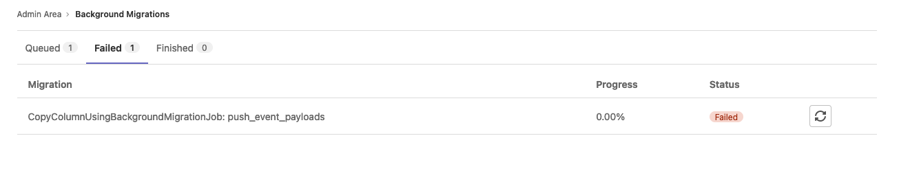



- Tier: 基础版，专业版，旗舰版
- Offering: 私有化部署



<a id="manage-background-migrations-with-rake-tasks"></a>

## 使用 Rake 任务管理后台迁移



- 在极狐GitLab 18.5 引入。
- 在极狐GitLab 18.7 增强。
- 在极狐GitLab 18.9 增强。



极狐GitLab 提供了一套 Rake 任务，用于从命令行管理后台迁移。
这些任务特别适合私有化部署管理员在管理员 UI 不可用时管理后台迁移，例如在进行停机升级或维护窗口期间。

所有 Rake 任务适用于所有数据库（main 和 ci），并使用统一的迁移 ID 格式：`{database}_{id}`。
例如，`main_85` 表示 main 数据库中 ID 为 85 的迁移，`ci_10` 表示 ci 数据库中 ID 为 10 的迁移。

对于活动迁移，`progress` 列会包含可用时的预计剩余时间（例如 `42.50% (预计剩余时间：5 分钟)`）。

<a id="list-all-background-migrations"></a>

### 列出所有后台迁移

要查看所有数据库中的所有批处理后台迁移：





```shell
sudo gitlab-rake gitlab:background_migrations:list
```

示例输出：

```plaintext
id      | table_name                       | job_class_name                                | status    | progress
--------|----------------------------------|-----------------------------------------------|-----------|----------------------------------------------------------
main_1  | namespace_settings               | UpdateRequireDpopForManageApiEndpointsToFalse | finished  | 100.00%
main_2  | resource_iteration_events        | BackfillResourceIterationEventsNamespaceId    | finalized | 100.00%
main_3  | identities                       | DeleteTwitterIdentities                       | finalized | 100.00%
main_4  | software_license_policies        | BackfillLicensesOutsideSpdxCatalogue          | finalized | 100.00%
main_5  | security_policies                | BackfillPipelineExecutionPoliciesMetadata     | active    | 42.50% (预计剩余时间：5 分钟)
ci_1    | ci_runners                       | MarkAdminBotRunnersAsHosted                   | finalized | 100.00%
ci_2    | p_ci_build_trace_metadata        | BackfillUpsertedCiBuildTraceMetadataProjectId | finalized | 100.00%
ci_3    | ci_runners                       | BackfillOrganizationIdOnCiRunners             | active    | 78.30% (预计剩余时间：约 1 小时)
```





```shell
sudo gitlab-rake gitlab:background_migrations:status
```





<a id="show-migration-details"></a>

### 显示迁移详情

要查看特定迁移的详细信息：

```shell
sudo gitlab-rake gitlab:background_migrations:show[<migration_id>]
```

例如：

```shell
sudo gitlab-rake gitlab:background_migrations:show[ci_1]
```

示例输出：

```plaintext
id                       | ci_1
created_at               | 2025-05-06 22:40:08 UTC
updated_at               | 2025-08-20 22:29:07 UTC
min_value                | 1
max_value                | 30
batch_size               | 1000
sub_batch_size           | 100
interval                 | 120
status                   | finalized
job_class_name           | MarkAdminBotRunnersAsHosted
batch_class_name         | PrimaryKeyBatchingStrategy
table_name               | ci_runners
column_name              | id
job_arguments            | []
total_tuple_count        |
pause_ms                 | 100
max_batch_size           |
started_at               | 2025-05-06 22:40:08 UTC
on_hold_until            |
gitlab_schema            | gitlab_ci
finished_at              | 2025-05-06 22:40:13 UTC
queued_migration_version | 20250505095336
min_cursor               |
max_cursor               |
```

<a id="pause-a-migration"></a>

### 暂停迁移

要暂停一个活动的后台迁移：

```shell
sudo gitlab-rake gitlab:background_migrations:pause[<migration_id>]
```

例如：

```shell
sudo gitlab-rake gitlab:background_migrations:pause[main_85]
```

> [!note]
> 您只能暂停状态为 `active` 的迁移。尝试暂停任何其他状态的迁移会导致错误。

<a id="resume-a-migration"></a>

### 恢复迁移

要恢复已暂停的后台迁移：

```shell
sudo gitlab-rake gitlab:background_migrations:resume[<migration_id>]
```

例如：

```shell
sudo gitlab-rake gitlab:background_migrations:resume[main_85]
```

> [!note]
> 您只能恢复状态为 `paused` 的迁移。尝试恢复任何其他状态的迁移会导致错误。

<a id="execute-a-migration"></a>

### 执行迁移



- 在极狐GitLab 18.7 引入。



> [!warning]
> 此任务会在前台同步执行迁移。迁移会一直运行直到完成或失败。对于大型迁移，这可能需要大量时间，并可能影响数据库性能。请尽可能在维护窗口中使用此任务。

要立即执行特定的后台迁移：

```shell
sudo gitlab-rake gitlab:background_migrations:execute[<migration_id>]
```

例如：

```shell
sudo gitlab-rake gitlab:background_migrations:execute[ci_10]
```

示例输出：

```plaintext
您确定要执行此迁移吗？是
正在执行后台迁移 `ci_10`...
完成。
```

任务在执行前会提示确认。如果迁移未能完成，请使用 `gitlab:background_migrations:show[<migration_id>]` 检查迁移状态以获取更多详细信息。

<a id="execute-all-migrations"></a>

### 执行所有迁移



- 在极狐GitLab 18.7 引入。



> [!warning]
> 此任务会在前台同步执行所有未完成的后台迁移。这可能需要非常长的时间，并对数据库性能产生显著影响。请仅在计划好的维护窗口中使用此任务。即使个别迁移失败，任务也会继续执行，但在输出中会报告失败信息。

要执行所有数据库中所有未完成的后台迁移：

```shell
sudo gitlab-rake gitlab:background_migrations:execute_all
```

示例输出：

<!--
The following codeblock uses extra spaces to avoid the Vale ReferenceLinks test.
Do not remove the two-space nesting.
-->

  ```plaintext
  您确定要执行所有未完成的迁移吗？是
  [main] 正在执行 6 个后台迁移...
  [main_85]: 开始。
  [main_85]: 完成。
  [main_86]: 开始。
  [main_86]: 完成。
  [main_87]: 开始。
  [main_87]: 完成。
  [main_88]: 开始。
  [main_88]: 完成。
  [main_89]: 开始。
  [main_89]: 完成。
  [main_90]: 开始。
  [main_90]: 完成。
  [ci] 正在执行 3 个后台迁移...
  [ci_8]: 开始。
  [ci_8]: 完成。
  [ci_9]: 开始。
  [ci_9]: 完成。
  [ci_10]: 开始。
  [ci_10]: 完成。
  ```

此任务：

- 在执行前提示确认。
- 按 ID 顺序处理迁移。
- 在每项迁移完成时报告其状态。
- 即使某些迁移失败，也会继续处理剩余的迁移。

<a id="check-for-pending-database-background-migrations"></a>

## 检查待处理的后台数据库迁移



- 功能[标志](../administration/feature_flags/_index.md) `execute_batched_migrations_on_schedule` 在极狐GitLab 13.12 [默认启用]。
- 对于私有化部署，管理员可以选择禁用它。



为了批量更新数据库表，极狐GitLab 可以使用批处理后台迁移。这些迁移由极狐GitLab 开发者创建，并在升级时自动运行。但是，此类迁移的范围有限，主要用于将一些 `integer` 数据库列迁移到 `bigint`，这是防止某些表发生整数溢出所必需的。

批处理后台迁移由 Sidekiq 处理并隔离运行，因此实例可以在处理迁移时保持运行。然而，在运行批处理后台迁移期间，如果大型实例被大量使用，性能可能会下降。您应该[主动监控 Sidekiq 状态](../administration/admin_area.md#background-jobs)，直到所有迁移完成。

要缩短完成这些迁移所需的时间，可以增加能够处理 `background_migration` 队列中作业的 [Sidekiq 工作进程](../administration/sidekiq/extra_sidekiq_processes.md) 数量。

<a id="check-the-status-of-batched-background-migrations"></a>

### 检查批处理后台迁移的状态

您可以在极狐GitLab UI 中或通过直接查询数据库来检查批处理后台迁移的状态。在升级极狐GitLab 之前，所有迁移必须处于 `Finished` 状态。

如果迁移未完成且您尝试升级极狐GitLab，您可能会看到此错误：

```plaintext
预期给定配置的批处理后台迁移标记为“已完成”，但实际为“活动中”：
```

如果您收到此错误，请[查看选项](background_migrations_troubleshooting.md#database-migrations-failing-because-of-batched-background-migration-not-finished) 以了解如何完成极狐GitLab 升级所需的批处理后台迁移。

<a id="from-the-gitlab-ui"></a>

#### 从极狐GitLab UI 中

先决条件：

- 您必须拥有实例的管理员访问权限。

要检查批处理后台迁移的状态：

1. 在右上角，选择 **管理员**。
1. 在左侧边栏中，选择 **监控** > **后台迁移**。
1. 选择 **排队中** 或 **终结中** 以查看未完成的迁移，选择 **失败** 以查看失败的迁移。

<a id="from-the-database"></a>

#### 从数据库中

先决条件：

- 您必须拥有实例的管理员访问权限。

要直接查询数据库获取批处理后台迁移的状态：

1. 根据您实例的安装方法登录到 `psql` 提示符。例如，对于 Linux 软件包安装，使用 `sudo gitlab-psql`。
1. 要查看未完成的批处理后台迁移的详细信息，请在 `psql` 会话中运行此查询：

   ```sql
   SELECT
     job_class_name,
     table_name,
     column_name,
     job_arguments
   FROM batched_background_migrations
   WHERE status NOT IN(3, 6);
   ```

或者，您可以使用 `gitlab-psql -c "<QUERY>"` 包装查询来检查批处理后台迁移的状态：

```shell
gitlab-psql -c "SELECT job_class_name, table_name, column_name, job_arguments FROM batched_background_migrations WHERE status NOT IN(3, 6);"
```

如果查询返回零行，则表示所有批处理后台迁移均已完成。

<a id="enable-or-disable-advanced-features"></a>

### 启用或禁用高级功能

批处理后台迁移提供了功能标志，允许您自定义迁移或完全暂停它们。这些功能标志只能由了解相关风险的高级用户禁用。

<a id="pause-batched-background-migrations"></a>

#### 暂停批处理后台迁移

> [!warning]
> 禁用已发布功能可能存在[风险](../administration/feature_flags/_index.md#risks-when-disabling-released-features)。
> 有关更多详细信息，请参阅每个功能的历史记录。

要暂停正在进行的批处理后台迁移，请禁用批处理后台迁移功能。
禁用该功能会完成当前批次的迁移，然后等待下一批次开始，直到重新启用该功能。

先决条件：

- 您必须拥有实例的管理员访问权限。

使用以下数据库查询查看当前批处理后台迁移的状态：

1. 获取正在运行的迁移的 ID：

   ```sql
   SELECT
    id,
    job_class_name,
    table_name,
    column_name,
    job_arguments
   FROM batched_background_migrations
   WHERE status NOT IN(3, 6);
   ```

1. 运行此查询，将 `XX` 替换为您在上一步中获取的 ID，以查看迁移状态：

   ```sql
   SELECT
    started_at,
    finished_at,
    finished_at - started_at AS duration,
    min_value,
    max_value,
    batch_size,
    sub_batch_size
   FROM batched_background_migration_jobs
   WHERE batched_background_migration_id = XX
   ORDER BY id DESC
   limit 10;
   ```

1. 在几分钟内多次运行查询，以确保没有新行添加。
   如果没有新行添加，则迁移已暂停。
1. 确认迁移已暂停后，重启迁移（使用之前提到的 `enable` 命令）以便在准备好时继续批处理。在大型实例上，后台迁移完成每个批次可能最长需要 48 小时。

<a id="automatic-batch-size-optimization"></a>

#### 自动批处理大小优化



- 在极狐GitLab 13.2 [引入](https://gitlab.com/gitlab-org/gitlab/-/merge_requests/60133)并[带有功能标志](../administration/feature_flags/_index.md) `optimize_batched_migrations`。默认启用。
- 在极狐GitLab 18.4 [GA](https://gitlab.com/gitlab-org/gitlab/-/merge_requests/204173)。功能标志 `optimize_batched_migrations` 已移除。



> [!warning]
> 禁用已发布功能可能存在[风险](../administration/feature_flags/_index.md#risks-when-disabling-released-features)。
> 有关更多详细信息，请参阅此功能的历史记录。

为了最大限度地提高批处理后台迁移的吞吐量（以每单位时间更新的元组数量衡量），批处理大小会根据前一批次完成所花费的时间自动调整。

<a id="parallel-execution"></a>

#### 并行执行



- 在极狐GitLab 15.7 [引入](https://gitlab.com/gitlab-org/gitlab/-/merge_requests/104027)并[带有功能标志](../administration/feature_flags/_index.md) `batched_migrations_parallel_execution`。默认禁用。
- [在 JihuLab.com 上启用](https://gitlab.com/gitlab-org/gitlab/-/issues/372316) 于极狐GitLab 15.11。
- 在极狐GitLab 16.1 [GA](https://gitlab.com/gitlab-org/gitlab/-/merge_requests/120808)。功能标志 `batched_migrations_parallel_execution` 已移除。



> [!warning]
> 禁用已发布功能可能存在[风险](../administration/feature_flags/_index.md#risks-when-disabling-released-features)。
> 有关更多详细信息，请参阅此功能的历史记录。

为了加快批处理后台迁移的执行速度，将同时执行两个迁移。

[拥有极狐GitLab Rails 控制台访问权限的极狐GitLab 管理员](../administration/feature_flags/_index.md) 可以更改并行执行的批处理后台迁移数量：

```ruby
ApplicationSetting.update_all(database_max_running_batched_background_migrations: 4)
```

<a id="resolve-failed-batched-background-migrations"></a>

### 解决失败的批处理后台迁移

如果批处理后台迁移失败，请[修复并重试迁移](#fix-and-retry-the-migration)。
如果迁移持续失败并出现错误，可以：

- [手动完成失败的迁移](#finish-a-failed-migration-manually)
- [将失败的迁移标记为已完成](#mark-a-failed-migration-finished)

<a id="fix-and-retry-the-migration"></a>

#### 修复并重试迁移

所有失败的批处理后台迁移都必须解决，才能升级到较新版本的极狐GitLab。如果您[检查批处理后台迁移的状态](#check-the-status-of-batched-background-migrations)，某些迁移可能会在 **失败** 标签页中显示为 **失败** 状态：



要确定批处理后台迁移失败的原因，请查看失败错误日志或在 UI 中查看错误信息。

先决条件：

- 您必须拥有实例的管理员访问权限。

1. 在右上角，选择 **管理员**。
1. 在左侧边栏中，选择 **监控** > **后台迁移**。
1. 选择 **失败** 标签页。这将显示失败的批处理后台迁移列表。
1. 选择失败的 **迁移** 以查看迁移参数和失败的作业。
1. 在 **失败作业** 下，选择每个 **ID** 以查看作业失败的原因。

如果您是极狐GitLab 客户，请考虑打开 [支持请求](https://support.gitlab.com/hc/en-us/requests/new) 来调试批处理后台迁移失败的原因。

要纠正问题，您可以重试失败的迁移。

先决条件：

- 您必须拥有实例的管理员访问权限。

1. 在右上角，选择 **管理员**。
1. 在左侧边栏中，选择 **监控** > **后台迁移**。
1. 选择 **失败** 标签页。这将显示失败的批处理后台迁移列表。
1. 通过单击重试按钮 () 选择要重试的失败批处理后台迁移。

要监控重试的批处理后台迁移，您可以[定期检查批处理后台迁移的状态](#check-the-status-of-batched-background-migrations)。

<a id="finish-a-failed-migration-manually"></a>

#### 手动完成失败的迁移

要手动完成因错误而失败的批处理后台迁移，请使用失败错误日志或数据库中的信息：





1. 查看失败错误日志，并查找 `An error has occurred, all later migrations canceled` 错误消息，如下所示：

   ```plaintext
   StandardError: 发生错误，所有后续迁移已取消：

   预期给定配置的批处理后台迁移标记为“已完成”，但实际为“活动中”：
     {:job_class_name=>"CopyColumnUsingBackgroundMigrationJob",
      :table_name=>"push_event_payloads",
      :column_name=>"event_id",
      :job_arguments=>[["event_id"],
      ["event_id_convert_to_bigint"]]
     }
   ```

1. 运行以下命令，将尖括号中的值替换为正确的参数：

   ```shell
   sudo gitlab-rake gitlab:background_migrations:finalize[<job_class_name>,<table_name>,<column_name>,'<job_arguments>']
   ```

   在处理多个参数时，例如 `[["id"],["id_convert_to_bigint"]]`，请在每个参数之间的逗号前使用反斜杠 ` \ ` 进行转义，以防止出现无效字符错误。
   例如，要完成上一步中的迁移：

   ```shell
   sudo gitlab-rake gitlab:background_migrations:finalize[CopyColumnUsingBackgroundMigrationJob,push_event_payloads,event_id,'[["event_id"]\, ["event_id_convert_to_bigint"]]']
   ```





1. [检查数据库中迁移的状态](#check-the-status-of-batched-background-migrations)。
1. 使用查询结果构造迁移命令，将尖括号中的值替换为正确的参数：

   ```shell
   sudo gitlab-rake gitlab:background_migrations:finalize[<job_class_name>,<table_name>,<column_name>,'<job_arguments>']
   ```

   例如，如果查询返回以下数据：

   - `job_class_name`: `CopyColumnUsingBackgroundMigrationJob`
   - `table_name`: `events`
   - `column_name`: `id`
   - `job_arguments`: `[["id"], ["id_convert_to_bigint"]]`

   在处理多个参数时，例如 `[["id"],["id_convert_to_bigint"]]`，请在每个参数之间的逗号前使用反斜杠 ` \ ` 进行转义，以防止出现无效字符错误。
   `job_arguments` 参数值中的每个逗号都必须使用反斜杠进行转义。

   例如：

   ```shell
   sudo gitlab-rake gitlab:background_migrations:finalize[CopyColumnUsingBackgroundMigrationJob,ci_builds,id,'[["id"\, "stage_id"]\,["id_convert_to_bigint"\,"stage_id_convert_to_bigint"]]']
   ```





<a id="mark-a-failed-migration-finished"></a>

#### 将失败的迁移标记为已完成

> [!warning]
> 在使用这些说明之前，请[联系极狐GitLab 支持](https://gitlab.cn/support/#contact-support)。
> 此操作可能导致数据丢失，并使您的实例以难以恢复的方式失败。

在某些情况下，后台迁移可能会失败：例如跳过了太多版本升级，或者数据库架构发生了向后不兼容的更改。（有关示例，请参阅 [issue 393216](https://gitlab.com/gitlab-org/gitlab/-/issues/393216)）。
失败的后台迁移会阻止进一步的应用程序升级。

当确定后台迁移可以“安全”跳过时，可以手动将迁移标记为已完成：

> [!warning]
> 请确保在继续之前创建备份。

```ruby
# 启动 Rails 控制台

connection = ApplicationRecord.connection # 或者 Ci::ApplicationRecord.connection，取决于迁移计划在哪个数据库上

Gitlab::Database::SharedModel.using_connection(connection) do
  migration = Gitlab::Database::BackgroundMigration::BatchedMigration.find_for_configuration(
    Gitlab::Database.gitlab_schemas_for_connection(connection),
    'BackfillUserDetailsFields',
    :users,
    :id,
    []
  )

  # 将所有作业标记为已完成
  migration.batched_jobs.update_all(status: Gitlab::Database::BackgroundMigration::BatchedJob.state_machine.states['succeeded'].value)
  migration.update_attribute(:status, Gitlab::Database::BackgroundMigration::BatchedMigration.state_machine.states[:finished].value)
end
```

<a id="run-all-background-migrations-synchronously"></a>

### 同步运行所有后台迁移

在某些情况下，您可能希望在维护窗口期间强制后台迁移在前台运行。

此脚本可能会在所有迁移完成之前超时/退出。您可以再次运行它，直到所有迁移完成。

```ruby
# 启动 Rails 控制台

databases = ActiveRecord::Tasks::DatabaseTasks.setup_initial_database_yaml

Gitlab::Database.database_base_models.each do |database_name, model|
  Gitlab::Database::SharedModel.using_connection(model.connection) do
    Gitlab::Database::BackgroundMigration::BatchedMigration.with_status([:paused, :active]).find_each(batch_size: 100) do |migration|
      puts "#{database_name}: 正在完成迁移 #{migration.job_class_name} (ID: #{migration.id})... "
      Gitlab::Database::BackgroundMigration::BatchedMigrationRunner.finalize(
        migration.job_class_name,
        migration.table_name,
        migration.column_name,
        Gitlab::Json.parse(migration.job_arguments),
        connection: model.connection
      )
      puts("完成！\n")
    end
  end
end
```

<a id="view-batched-background-migration-logs"></a>

## 查看批处理后台迁移日志

在排查批处理后台迁移问题时，您可以在多个位置查看详细的执行日志。

<a id="sidekiq-logs"></a>

### Sidekiq 日志

[Sidekiq 日志](../administration/logs/_index.md#sidekiq-logs) 显示了 `Database::BatchedBackgroundMigrationWorker` 作业的执行时间。这些日志显示作业执行情况，但不会标识具体运行的是哪个迁移。

<a id="application-logs"></a>

### 应用日志

要确定正在运行哪个批处理后台迁移，请检查 [应用日志](../administration/logs/_index.md#application_jsonlog)。应用日志包含详细信息，包括：

- 特定批处理后台迁移的类名 (`job_class_name`)
- 状态转换（待处理、运行中、成功或失败）

<a id="trace-a-migration-execution"></a>

### 跟踪迁移执行

要跟踪特定的批处理后台迁移：

1. 在 `Database::BatchedBackgroundMigrationWorker` 的 Sidekiq 日志条目中找到 `correlation_id`。
2. 使用该 `correlation_id` 搜索应用日志，以查看详细的状态转换。

示例应用日志条目：

```json
{
  "severity": "INFO",
  "time": "2025-08-27T22:52:07.806Z",
  "meta.caller_id": "Database::BatchedBackgroundMigration::MainExecutionWorker",
  "correlation_id": "74d0295cbe4bb6147230a7d481fb0f8a",
  "message": "BatchedJob transition",
  "batched_job_id": 725,
  "previous_state": "pending",
  "new_state": "running",
  "batched_migration_id": 638,
  "job_class_name": "BackfillSentNotificationsAfterPartition",
  "job_arguments": []
},
{
  "severity": "INFO",
  "time": "2025-08-27T22:52:14.293Z",
  "meta.caller_id": "Database::BatchedBackgroundMigration::MainExecutionWorker",
  "correlation_id": "74d0295cbe4bb6147230a7d481fb0f8a",
  "message": "BatchedJob transition",
  "batched_job_id": 725,
  "previous_state": "running",
  "new_state": "succeeded",
  "batched_migration_id": 638,
  "job_class_name": "BackfillSentNotificationsAfterPartition",
  "job_arguments": []
}
```

<a id="check-for-pending-advanced-search-migrations"></a>

## 检查待处理的高级搜索迁移



- Tier: 专业版，旗舰版
- Offering: 私有化部署



此部分仅适用于您已启用 [Elasticsearch 集成](../integration/advanced_search/elasticsearch.md) 的情况。
主要版本要求在升级到主版本之前，所有来自当前版本最新次要版本的 [高级搜索迁移](../integration/advanced_search/elasticsearch.md#advanced-search-migrations) 都必须完成。您可以通过运行以下命令来查找待处理的迁移。




```shell
sudo gitlab-rake gitlab:elastic:list_pending_migrations
```





```shell
cd /home/git/gitlab
sudo -u git -H bundle exec rake gitlab:elastic:list_pending_migrations
```





如果您处于漫长的升级路径中，且有许多待处理的迁移，您可能需要配置 **重新排队索引工作器** 和 **非代码索引的分片数** 以加速索引。另一种选择是忽略待处理的迁移，并在将极狐GitLab 升级到目标版本后[重建实例索引](../integration/advanced_search/elasticsearch.md#index-the-instance)。您还可以在此过程中使用 [**使用高级搜索进行搜索**](../integration/advanced_search/elasticsearch.md#advanced-search-configuration) 设置禁用高级搜索。

> [!warning]
> 索引大型实例会带来风险。
> 有关更多信息，请参阅[高效索引大型实例](../integration/advanced_search/elasticsearch.md#index-large-instances-efficiently)。