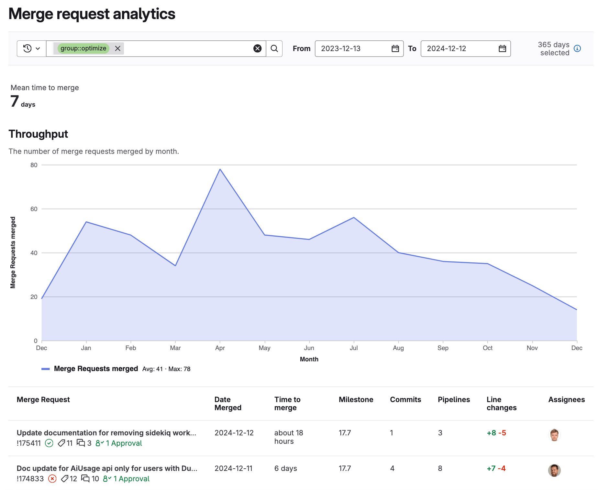



- Tier: 专业版，旗舰版
- Offering: JihuLab.com，私有化部署



合并请求分析为 DevOps 管理者提供了有关团队代码审查和合并工作流的宝贵洞察。
基于与合并请求相关的详细指标和趋势，组织可以监控并优化其开发流程。

使用合并请求分析查看：

- 组织每月合并的合并请求数量。
- 合并请求从创建到合并的平均时间。
- 每个已合并合并请求的信息（如里程碑、提交、行变更和指派人）。

您可以使用合并请求分析来识别：

- 生产力较低或较高的月份。
- 合并请求和代码审查流程的效率和生产力。

这些洞察可以帮助您做出数据驱动的决策，例如：

- 资源分配：通过重新分配资源或调整时间表来解决生产力低下的时期。
- 绩效基准：突出高绩效团队并分享最佳实践。
- 里程碑规划：根据历史合并趋势调整时间表。
- 流程优化：识别并解决代码审查和合并工作流中的瓶颈。

## 查看合并请求分析

先决条件：

- 您必须具有报告者、开发者、维护者或所有者角色。

要查看合并请求分析：

1. 在顶部栏中，选择 **搜索或跳转到** 并找到您的项目。
1. 在左侧边栏中，选择 **分析** > **分析仪表板**。
1. 选择 **合并请求分析**。

## 查看日期范围内的合并请求数量

要查看特定日期范围内合并的合并请求数量：

1. 在顶部栏中，选择 **搜索或跳转到** 并找到您的项目。
1. 在左侧边栏中，选择 **分析** > **分析仪表板**。
1. 选择 **合并请求分析**。
1. 可选。筛选结果：
   1. 选择筛选栏。
   1. 选择参数。
   1. 选择值或输入文本以细化结果。
   1. 要调整日期范围，请从下拉列表中选择一个选项。默认为 **最近 365 天**。

**吞吐量** 图表显示一段时间内已关闭的议题或已合并（而非关闭）的合并请求。

该表格每页最多显示 20 个合并请求，并包含每个合并请求的以下信息：

- 合并请求名称
- 合并日期
- 合并用时
- 里程碑
- 提交
- 流水线
- 行变更
- 指派人

## 查看合并请求从创建到合并的平均时间

**平均合并时间** 中的数字显示合并请求从创建到合并的平均时间。已关闭和尚未合并的合并请求不包括在内。

要查看 **平均合并时间**：

1. 在顶部栏中，选择 **搜索或跳转到** 并找到您的项目。
1. 在左侧边栏中，选择 **分析** > **分析仪表板**。
1. 选择 **合并请求分析**。**平均合并时间** 数字将显示在仪表板上。