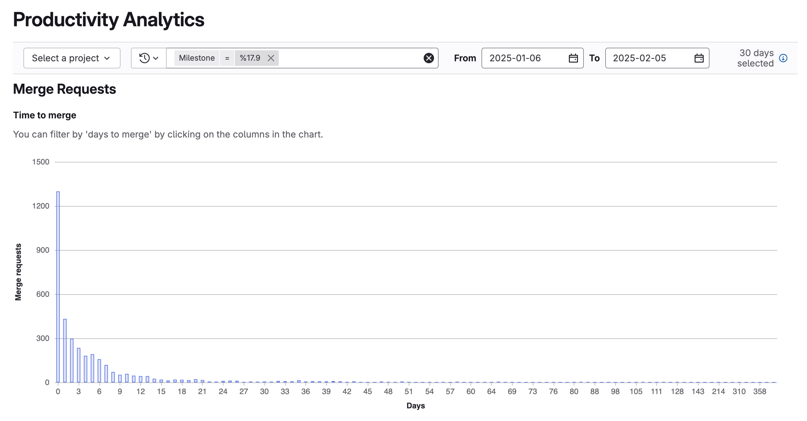



- Tier: 专业版，旗舰版
- Offering: JihuLab.com，私有化部署



生产力分析显示群组的合并请求信息。

使用生产力分析可以识别：

- 基于合并请求合并所需时间的开发速度。
- 合并请求合并时间过长的潜在原因。
- 合并时间最长或包含最多更改的作者、标签或里程碑。

要查看项目的合并请求数据，请使用[合并请求分析](merge_request_analytics.md)。

## 图表

生产力分析显示以下图表：

- 柱状图，展示：
  - 按合并天数统计的合并请求数量。
  - 提交、评论和合并日期之间的时间间隔。
  - 提交数、代码行数和文件更改数。
- 散点图，展示每天（合并日期）的合并请求指标数量（例如每个合并请求的提交数）。
- 表格，列出合并请求标题、合并时间以及提交、评论和合并日期之间的持续时间。

## 查看生产力分析

先决条件：

- 您必须具有群组的报告者、开发者、维护者或所有者角色。

1. 在顶部栏中，选择**搜索或跳转到**并找到您的群组。
1. 在左侧边栏中，选择**分析** > **生产力分析**。
1. 可选。筛选结果：

- 要查看特定项目的分析，从**项目**下拉列表中选择一个项目。
- 要按作者、里程碑或标签筛选结果，选择**筛选结果**并输入值。
- 要调整日期范围：
  - 在**开始**字段中，选择开始日期。
  - 在**结束**字段中，选择结束日期。