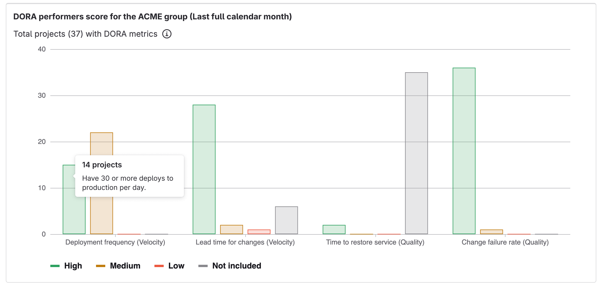
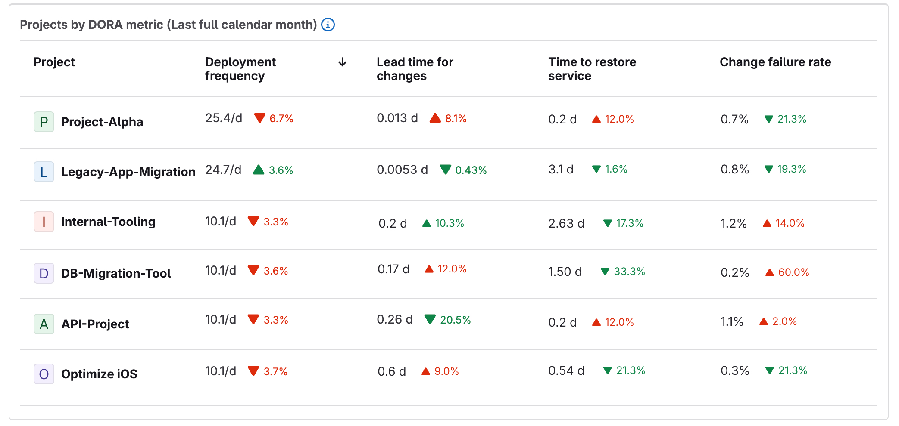



- Tier: 专业版，旗舰版
- Offering: JihuLab.com，私有化部署





- 在极狐GitLab 15.8 中作为封闭 [beta](../../policy/development_stages_support.md#beta) 功能引入，通过名为 `group_analytics_dashboards_page` 的功能标志，默认禁用。
- 在极狐GitLab 15.11 中作为开放 [beta](../../policy/development_stages_support.md#beta) 功能发布，启用功能标志，默认启用。
- 在极狐GitLab 16.0 中 [GA](https://gitlab.com/gitlab-org/gitlab/-/issues/392734)。功能标志 `group_analytics_dashboards_page` 已移除。
- 在 18.2 中从极狐GitLab 旗舰版移至专业版。



价值流仪表板是一个可自定义的仪表板，你可以使用它来识别趋势、模式和数字转型改进的机会。
价值流仪表板中统一的 UI 充当单一真实来源（SSOT），所有利益相关者都可以在其中访问和查看与组织相关的同一组指标。
价值流仪表板包含可视化以下指标的面板：

- [DORA 指标](dora_metrics.md)
- [价值流分析（VSA）- 流指标](../group/value_stream_analytics/_index.md)
- [漏洞](../application_security/vulnerability_report/_index.md)
- 极狐GitLab Duo 代码建议

通过价值流仪表板，你可以：

- 跟踪和比较之前列出的指标在一段时间内的表现。
- 尽早发现下降趋势。
- 了解安全暴露情况。
- 深入到单个项目或指标，采取改进措施。
- 了解将 AI 添加到软件开发生命周期（SDLC）中的影响，并展示对极狐GitLab Duo 投资的 投资回报率（ROI）。

如需点击演示，请参阅 [价值流管理产品导览](https://gitlab.navattic.com/vsm)。

要查看群组的分析仪表板形式的价值流仪表板：

1. 在顶部栏中，选择 **搜索或跳转到** 并找到你的群组。
1. 在左侧边栏中，选择 **分析** > **分析仪表板**。
1. 从可用仪表板列表中选择 **价值流仪表板**。

> [!note]
> 价值流仪表板上显示的数据在后端持续收集。
> 如果你升级到旗舰版，你将获得历史数据访问权限，并可以查看关于过去极狐GitLab 使用情况和性能的指标。

<a id="panels"></a>

## 面板

价值流仪表板的面板具有默认配置，但你也可以自定义仪表板面板。

<a id="overview"></a>

### 概览



- 在极狐GitLab 16.7 中 [引入](https://gitlab.com/gitlab-org/gitlab/-/issues/439699)，通过名为 `group_analytics_dashboard_dynamic_vsd` 的功能标志，默认禁用。
- 在极狐GitLab 17.0 中 [GA](https://gitlab.com/gitlab-org/gitlab/-/issues/432185)。
- 功能标志 `group_analytics_dashboard_dynamic_vsd` 在极狐GitLab 17.0 中 [已移除](https://gitlab.com/gitlab-org/gitlab/-/issues/441206)。



概览面板通过可视化关键 DevOps 指标，提供顶级命名空间活动的整体视图。
面板显示以下指标：

- 子群组
- 项目
- 用户
- 议题
- 合并请求
- 流水线

概览面板中显示的数据通过批处理收集。极狐GitLab 在数据库中存储每个子群组的记录计数，然后汇总记录计数以提供顶级群组的指标。
数据按月聚合，通常在月底，根据极狐GitLab 系统的负载情况尽力完成。

更多信息，请参阅 [史诗 10417](https://gitlab.com/groups/gitlab-org/-/epics/10417#iterations-path)。

<a id="devsecops-metrics-comparison"></a>

### DevSecOps 指标对比



- 群组级别的贡献者计数指标在极狐GitLab 16.9 中 [引入](https://gitlab.com/gitlab-org/gitlab/-/issues/433353) 到 JihuLab.com。
- 项目级别的贡献者计数指标在极狐GitLab 18.0 中 [引入](https://gitlab.com/gitlab-org/gitlab/-/issues/474119) 到 JihuLab.com。
- DevSecOps 指标对比表在极狐GitLab 18.5 中 [迁移](https://gitlab.com/gitlab-org/gitlab/-/issues/541489) 到 `ai_impact_table` 可视化。



DevSecOps 指标对比面板显示过去六个月内群组或项目的指标。
这些可视化帮助你了解关键的 DevSecOps 指标是否逐月改善。价值流仪表板显示三个 DevSecOps 指标对比面板：

- 生命周期指标
- DORA 指标（仅旗舰版）
- 安全指标（仅旗舰版，至少需要 **开发者** 角色）

在每个对比面板中，你可以：

- 一目了然地比较群组、项目和团队之间的表现。
- 识别出最大价值贡献者、表现优异或表现不佳的团队和项目。
- 深入分析指标以进行进一步分析。

当你将鼠标悬停在指标上时，工具提示会显示该指标的解释以及相关文档页面的链接。

**变化百分比** 列还指示与六个月前相比，指标值从上个月开始的百分比增加或减少。

**趋势** 列显示迷你图，帮助你识别指标趋势中的模式（例如季节性变化），随时间推移。
迷你图颜色从蓝色到绿色，其中绿色表示积极趋势，蓝色表示消极趋势。

<a id="dora-performers-score"></a>

### DORA 表现者得分



- Tier: 旗舰版





- 在极狐GitLab 16.3 中 [引入](https://gitlab.com/gitlab-org/gitlab/-/issues/386843)，通过名为 `dora_performers_score_panel` 的功能标志，默认禁用。
- 在极狐GitLab 16.9 中 [在 JihuLab.com 上启用](https://gitlab.com/gitlab-org/gitlab/-/issues/439737)。
- 在极狐GitLab 16.11 中 [GA](https://gitlab.com/gitlab-org/gitlab/-/issues/440694)。功能标志 `dora_performers_score_panel` 已移除。



DORA 表现者得分面板是一个群组级别的条形图，可视化了过去一个完整自然月内组织在不同项目中的 DevOps 表现水平状态。



该图表是对项目 DORA 得分的细分，[分类](https://cloud.google.com/blog/products/devops-sre/dora-2022-accelerate-state-of-devops-report-now-out) 为高、中或低。
该图表汇聚了群组中的所有子项目。

图表条形图显示每个得分类别下的项目总数，每月计算一次。
要从图表中排除数据（例如 **未包含**），在图例中选择要排除的系列。
将鼠标悬停在每个条形上会弹出一个对话框，解释该得分的定义。

例如，如果一个项目的部署频率（速度）得分高，这意味着该项目每天有至少一次生产部署。

| 指标                  | 高 | 中  | 低  | 描述 |
|-------------------------|------|---------|------|-------------|
| 部署频率    | ≥30  | 1-29    | <1  | 每天生产部署的次数 |
| 变更前置时间   | ≤7   | 8-29    | ≥30  | 从代码提交到代码成功在生产环境运行所需的天数 |
| 服务恢复时间 | ≤1   | 2-6     | ≥7   | 当发生影响用户的服务事件或缺陷时，恢复服务所需的天数 |
| 变更失败率     | ≤15% | 16%-44% | ≥45% | 导致服务降级的生产变更百分比 |

要了解更多，请参阅博客文章 [深入解析极狐GitLab 价值流仪表板中的 DORA 表现者得分](https://gitlab.cn/blog/inside-dora-performers-score-in-gitlab-value-streams-dashboard/)。

<a id="filter-the-panel-by-project-topic"></a>

#### 按项目主题过滤面板

当你使用 YAML 配置自定义仪表板时，
你可以按分配的主题过滤显示的项目。

```yaml
panels:
  - title: '我的 DORA 表现者得分'
    visualization: dora_performers_score
    queryOverrides:
      namespace: group/my-custom-group
      filters:
        projectTopics:
          - JavaScript
          - Vue.js
```

如果提供了多个主题，则所有主题都必须匹配，项目才会被包含在结果中。

<a id="projects-by-dora-metric"></a>

### 按 DORA 指标查看项目



- Tier: 旗舰版





- 在极狐GitLab 17.7 中 [引入](https://gitlab.com/gitlab-org/gitlab/-/issues/408516)。



**按 DORA 指标查看项目** 面板是一个群组级别的表格，列出了组织在不同项目中的 DevOps 表现水平状态。

该表格列出了所有项目及其 DORA 指标，汇聚了来自群组和子群组中所有子项目的数据。
指标汇总为过去一个完整自然月的数据。

你可以按指标值对项目进行排序，帮助你识别高、中和低表现项目。
如需进一步调查，你可以选择项目名称，深入到该项目的页面。



<a id="enable-or-disable-overview-background-aggregation"></a>

## 启用或禁用概览后台聚合



- Tier: 旗舰版
- Offering: 私有化部署





- 在极狐GitLab 16.1 中 [引入](https://gitlab.com/gitlab-org/gitlab/-/merge_requests/120610)，通过名为 `value_stream_dashboard_on_off_setting` 的功能标志，默认禁用。
- 在极狐GitLab 16.4 中 [在私有化部署上启用](https://gitlab.com/gitlab-org/gitlab/-/merge_requests/130704)。
- 在极狐GitLab 16.6 中 [功能标志 `value_stream_dashboard_on_off_setting` 已移除](https://gitlab.com/gitlab-org/gitlab/-/merge_requests/134619)。



要启用或禁用价值流仪表板的概览计数聚合：

1. 在顶部栏中，选择 **搜索或跳转到** 并找到你的群组。
   该群组必须是顶级群组。
1. 在左侧边栏中，选择 **设置** > **分析**。
1. 在 **价值流仪表板** 中，选中或清除 **启用价值流仪表板概览后台聚合** 复选框。

要检索群组中汇总的使用计数，请使用 [GraphQL API](../../api/graphql/reference/_index.md#groupvaluestreamdashboardusageoverview)。

<a id="view-the-value-streams-dashboard"></a>

## 查看价值流仪表板

先决条件：

- 你必须对群组或项目具有报告者、开发者、维护者或所有者角色。
- 必须启用概览后台聚合。
- 要在对比面板中查看贡献者计数指标，你必须 [设置 ClickHouse](../../integration/clickhouse.md)。
- 要跟踪生产部署，群组或项目必须在 [生产部署层级](../../ci/environments/_index.md#deployment-tier-of-environments) 中有一个环境。
- 要测量周期时间，[议题必须从提交信息中交叉链接](../project/issues/crosslinking_issues.md#from-commit-messages)。

<a id="for-groups"></a>

### 针对群组

要查看群组的价值流仪表板：

- 从分析仪表板：
  1. 在顶部栏中，选择 **搜索或跳转到** 并找到你的群组。
  1. 选择 **分析** > **分析仪表板**。
- 从价值流分析：
  1. 在顶部栏中，选择 **搜索或跳转到** 并找到你的项目或群组。
  1. 选择 **分析** > **价值流分析**。
  1. 在 **过滤结果** 文本框下方，在 **生命周期指标** 行中，选择 **价值流仪表板 / DORA**。
  1. 可选。要打开新页面，将路径 `/analytics/dashboards/value_streams_dashboard` 附加到群组 URL 后（例如 `https://jihulab.com/groups/gitlab-org/-/analytics/dashboards/value_streams_dashboard`）。

<a id="for-projects"></a>

### 针对项目



- 在极狐GitLab 16.7 中 [引入](https://gitlab.com/gitlab-org/gitlab/-/merge_requests/137483)，通过名为 `project_analytics_dashboard_dynamic_vsd` 的功能标志，默认禁用。
- 功能标志 `project_analytics_dashboard_dynamic_vsd` 在极狐GitLab 17.5 中 [已移除](https://gitlab.com/gitlab-org/gitlab/-/issues/441207)。



要查看项目的分析仪表板形式的价值流仪表板：

1. 在顶部栏中，选择 **搜索或跳转到** 并找到你的项目。
1. 在左侧边栏中，选择 **分析** > **分析仪表板**。
1. 从可用仪表板列表中选择 **价值流仪表板**。

<a id="schedule-reports"></a>

## 安排报告

你可以使用 CI/CD 组件
[价值流仪表板定期报告工具](https://jihulab.com/components/vsd-reports-generator) 来安排报告。
该工具通过消除手动搜索正确仪表板和相关数据的需求来节省时间和精力，使你能够专注于分析见解。
通过安排报告，你可以确保组织中的决策者能够主动、及时地收到相关信息。

定期报告工具通过公共极狐GitLab GraphQL API 从项目或群组收集指标，
然后使用极狐GitLab Flavored Markdown 构建报告，
并在指定的项目中创建一个议题。
该议题包含一个 Markdown 格式的对比指标表。

查看 [示例定期报告](https://jihulab.com/components/vsd-reports-generator#example-for-monthly-executive-value-streams-report)。
要了解更多，请参阅博客文章 [新的定期报告生成工具简化了价值流管理](https://about.gitlab.com/blog/new-scheduled-reports-generation-tool-simplifies-value-stream-management/)。

<a id="customize-dashboard-panels"></a>

## 自定义仪表板面板

你可以自定义价值流仪表板，并配置页面中包含哪些子群组和项目。

要自定义页面的默认内容，你需要在你选择的项目中创建一个 YAML 配置文件。
在这个文件中，你可以定义各种设置和参数，例如标题、描述和面板数量。
该文件由架构驱动，并使用像 Git 这样的版本控制系统进行管理。
这可以跟踪和维护配置更改的历史记录，必要时回滚到以前的版本，并与团队成员有效协作。
仍然可以使用查询参数覆盖 YAML 配置。

在自定义仪表板面板之前，你必须选择一个项目来存储你的 YAML 配置文件。

先决条件：

- 你必须对群组具有维护者或所有者角色。

1. 在顶部栏中，选择 **搜索或跳转到** 并找到你的群组。
1. 在左侧边栏中，选择 **设置** > **分析**。
1. 选择你希望存储 YAML 配置文件的项目。
1. 选择 **保存更改**。

设置好项目后，设置配置文件：

1. 在顶部栏中，选择 **搜索或跳转到** 并找到你在上一步中选择的项目。
1. 在默认分支中，创建配置文件：`.gitlab/analytics/dashboards/value_streams/value_streams.yaml`。
1. 在 `value_streams.yaml` 配置文件中，填写配置选项：

| 字段                                      | 描述 |
|--------------------------------------------|-------------|
| `title`                                    | 面板的自定义名称 |
| `queryOverrides`（以前称为 `data`）         | 覆盖特定于每个可视化的数据查询参数。 |
| `namespace`（`queryOverrides` 的子字段） | 用于面板的群组或项目路径 |
| `filters`（`queryOverrides` 的子字段）   | 为每种支持的可视化类型过滤查询。 |
| `visualization`                            | 要渲染的可视化类型。支持的选项：`ai_impact_table`、`dora_performers_score` 和 `usage_overview`。 |
| `gridAttributes`                           | 面板的大小和位置 |
| `xPos`（`gridAttributes` 的子字段）      | 面板的水平位置 |
| `yPos`（`gridAttributes` 的子字段）      | 面板的垂直位置 |
| `width`（`gridAttributes` 的子字段）     | 面板的宽度（最大 12） |
| `height`（`gridAttributes` 的子字段）    | 面板的高度 |

```yaml
# version - 分析仪表板架构的最新版本
version: '2'

# title - 更改价值流仪表板的标题。
title: '自定义仪表板标题'

# description - 更改价值流仪表板的描述。[可选]
description: '自定义描述'

# panels - 包含面板设置的面板列表。
#   title - 更改面板的标题。
#   visualization - 要渲染的可视化类型
#   gridAttributes - 面板的大小和位置
#   queryOverrides.namespace - 用于图表面板的群组或项目路径
#   queryOverrides.filters.includeMetrics - 在表盘中按指标 ID 显示行。
panels:
  - title: '群组使用概览'
    visualization: usage_overview
    queryOverrides:
      namespace: group
      filters:
        include:
          - groups
          - projects
    gridAttributes:
      yPos: 1
      xPos: 1
      height: 1
      width: 12
  - title: '群组 DORA 和议题指标'
    visualization: ai_impact_table
    queryOverrides:
      namespace: group
      filters:
        includeMetrics:
          - deployment_frequency
          - deploys
    gridAttributes:
      yPos: 2
      xPos: 1
      height: 12
      width: 12
  - title: '我的 DORA 表现者得分'
    visualization: dora_performers_score
    queryOverrides:
      namespace: group/my-project
      filters:
        projectTopics:
          - ruby
          - javascript
    gridAttributes:
      yPos: 26
      xPos: 1
      height: 12
      width: 12
```

<a id="supported-visualization-filters"></a>

### 支持的可视化过滤器

`queryOverrides` 字段上的 `filters` 子字段可用于自定义面板中显示的数据。

<a id="devsecops-metrics-comparison-panel-filters"></a>

#### DevSecOps 指标对比面板过滤器

`ai_impact_table` 可视化的过滤器。

| 过滤器           | 描述                                                                               | 支持的值                          |
|------------------|-----------------------------------------------------------------------------------|-------------------------------------------|
| `includeMetrics` | 在表盘中按指标 ID 显示行。优先于 `excludeMetrics`。 | 来自 [可用指标](#dashboard-metrics-and-drill-down-reports) 的任何 `ID`。 |
| `excludeMetrics` | 从表盘中按指标 ID 隐藏行。                                     | 来自 [可用指标](#dashboard-metrics-and-drill-down-reports) 的任何 `ID`。 |

<a id="dora-performers-score-panel-filters"></a>

#### DORA 表现者得分面板过滤器

`dora_performers_score` 可视化的过滤器。

| 过滤器          | 描述                                                                               | 支持的值 |
|-----------------|-------------------------------------------------------------------------------------------|------------------|
| `projectTopics` | 根据分配的主题过滤显示的项目 | 任何可用的群组主题 |

<a id="usage-overview-panel-filters"></a>

#### 使用概览面板过滤器

`usage_overview` 可视化的过滤器。

<a id="group-and-subgroup-namespaces"></a>

##### 群组和子群组命名空间

| 过滤器    | 描述                                                    | 支持的值 |
|-----------|----------------------------------------------------------------|------------------|
| `include` | 限制返回的指标，默认显示所有可用指标 | `groups`、`projects`、`issues`、`merge_requests`、`pipelines`、`users` |

<a id="project-namespaces"></a>

##### 项目命名空间

| 过滤器    | 描述                                                    | 支持的值 |
|-----------|----------------------------------------------------------------|------------------|
| `include` | 限制返回的指标，默认显示所有可用指标 | `issues`、`merge_requests`、`pipelines` |

<a id="additional-panel-filters-deprecated"></a>

#### 其他面板过滤器（已弃用）

> [!warning]
> `dora_chart` 可视化在极狐GitLab 18.5 中 [已弃用](https://gitlab.com/gitlab-org/gitlab/-/merge_requests/206417)。

`dora_chart` 可视化的过滤器。

| 过滤器   | 描述                                  | 支持的值 |
|----------|----------------------------------------------|------------------|
| `labels` | 按标签过滤数据                       | 任何可用的群组标签。标签过滤受以下指标支持：`lead_time`、`cycle_time`、`issues`、`issues_completed`、`merge_request_throughput`、`median_time_to_merge`。 |

<a id="dashboard-metrics-and-drill-down-reports"></a>

## 仪表板指标和深入分析报告



- 代码建议、非 Agentic 聊天和根因分析使用指标在极狐GitLab 18.10 中 [更新](https://gitlab.com/gitlab-org/gitlab/-/issues/589605) 为显示绝对用户数而非百分比。



下表概述了价值流仪表板中可用的指标，以及它们的描述和显示它们的深入分析报告名称。
| 指标                              | 描述                                                                                                                     | 下钻报告 | ID |
|-----------------------------------|------------------------------------------------------------------------------------------------------------------------| ------- | -- |
| 部署频率                          | 每天部署到生产环境的平均次数。该指标衡量价值交付给最终用户的频率。                                                      | **部署频率** 标签页 | `deployment_frequency` |
| 变更前置时间                      | 将一次提交成功交付到生产环境所用的时间。该指标反映 CI/CD 流水线的效率。                                                | **前置时间** 标签页 | `lead_time_for_changes` |
| 服务恢复时间                      | 组织在生产环境中从故障中恢复所需的时间。                                                                                | **服务恢复时间** 标签页 | `time_to_restore_service` |
| 变更失败率                        | 导致生产环境中发生事件的部署百分比。                                                                                    | **变更失败率** 标签页 | `change_failure_rate` |
| 前置时间                          | 从议题创建到议题关闭的中位时间。                                                                                        | 价值流分析 | `lead_time` |
| 周期时间                          | 从关联议题的合并请求的最早提交到该议题关闭的中位时间。                                                                  | 价值流分析中的 **生命周期指标** 部分 | `cycle_time` |
| 议题创建数                        | 新创建的议题数量。                                                                                                      | 议题分析 | `issues` |
| 议题关闭数                        | 按月关闭的议题数量。                                                                                                    | 议题分析 | `issues_completed` |
| 部署次数                          | 部署到生产环境的总次数。                                                                                                | 合并请求分析 | `deploys` |
| 合并请求吞吐量                    | 按月合并的合并请求数量。                                                                                                | 生产力分析 | `merge_request_throughput` |
| 合并中位时间                      | 从合并请求创建到合并请求合并的中位时间。                                                                                | 生产力分析 | `median_time_to_merge` |
| 贡献者数量                        | 群组中每月有贡献的唯一用户数。                                                                                          | 贡献分析 | `contributor_count` |
| 随时间推移的严重漏洞              | 项目或群组中随时间推移的严重漏洞。                                                                                      | 漏洞报告 | `vulnerability_critical` |
| 随时间推移的高危漏洞              | 项目或群组中随时间推移的高危漏洞。                                                                                      | 漏洞报告 | `vulnerability_high` |
| 流水线运行总数                    | 在选定时间段内运行的流水线总数。                                                                                        | CI/CD 分析 | `pipeline_count` |
| 流水线中位时长                    | 流水线完成所需的中位时间。                                                                                              | CI/CD 分析 | `pipeline_duration_median` |
| 流水线成功率                      | 成功完成的流水线百分比。                                                                                                | CI/CD 分析 | `pipeline_success_rate` |
| 流水线失败率                      | 失败的流水线百分比。                                                                                                    | CI/CD 分析 | `pipeline_failed_rate` |
| 功能使用                          | 使用任何极狐GitLab Duo 功能的贡献者数量。                                                                              |  | `duo_used_count` |
| 代码建议使用人数                  | 使用代码建议的用户数。                                                                                                  |  | `code_suggestions_users_count` |
| 代码建议接受率                    | 接受的代码建议占生成的代码建议总数之比。                                                                                |  | `code_suggestions_acceptance_rate` |
| 非 Agentic 聊天使用人数         | 使用非 Agentic 聊天的用户数。                                                                                  |  | `duo_chat_users_count` |
| 根因分析使用人数                  | 使用根因分析的用户数。                                                                                                  |  | `duo_rca_users_count` |

## 使用 Jira 的指标

以下指标不依赖于使用 Jira：

- DORA 部署频率
- DORA 变更前置时间
- 部署次数
- 合并请求吞吐量
- 合并中位时间
- 漏洞