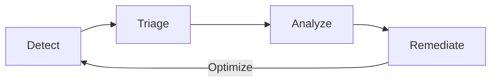



- Tier: 基础版，专业版，旗舰版
- Offering: JihuLab.com，私有化部署



极狐GitLab 应用安全测试可在开发过程中和变更部署后持续检测漏洞。

应用安全测试会扫描您项目的源代码、依赖项、库和容器镜像。运行时漏洞则通过模拟攻击和对测试环境中已部署应用的模糊测试来检测。

在开发过程中，当代码提交或合并请求创建时，扫描会作为 CI/CD 流水线的一部分自动运行。安全发现会直接显示在合并请求和 IDE 中，在代码合并前通知开发者。这种主动方法降低了在开发后期修复问题的成本和工作量。

在开发周期之外，您可以按需运行安全扫描，或安排它们定期运行。随着漏洞数据库更新新发现的威胁和零日漏洞，您项目的软件库和容器镜像的新风险会被识别出来。这些方法共同作用，能够识别出原始开发周期中先前未知的风险。

如需点击式演示，请参阅[将安全集成到流水线](https://gitlab.navattic.com/gitlab-scans)。
<!-- 演示发布于 2024-01-15 -->

## 漏洞管理周期

极狐GitLab 支持一个全面的漏洞管理工作流，帮助您持续改善应用安全态势。此工作流是一个持续的检测、分类、分析、修复和优化循环。

1. 检测 - 通过自动化安全测试识别漏洞。
1. 分类 - 评估漏洞并确定优先级，以决定哪些需要立即关注，哪些可以稍后处理。
1. 分析 - 对已确认的漏洞进行详细分析，以了解其影响并确定适当的修复策略。
1. 修复 - 修复漏洞的根本原因或实施适当的风险缓解措施。

利用每个阶段的结果来改进下一个循环。例如，调整检测规则以减少分析阶段发现的误报。

这个循环会随着每次代码变更重复，使您能够逐步改善应用安全性和漏洞管理流程。这种持续改进意味着您的漏洞管理会随着时间的推移变得更加有效和高效。