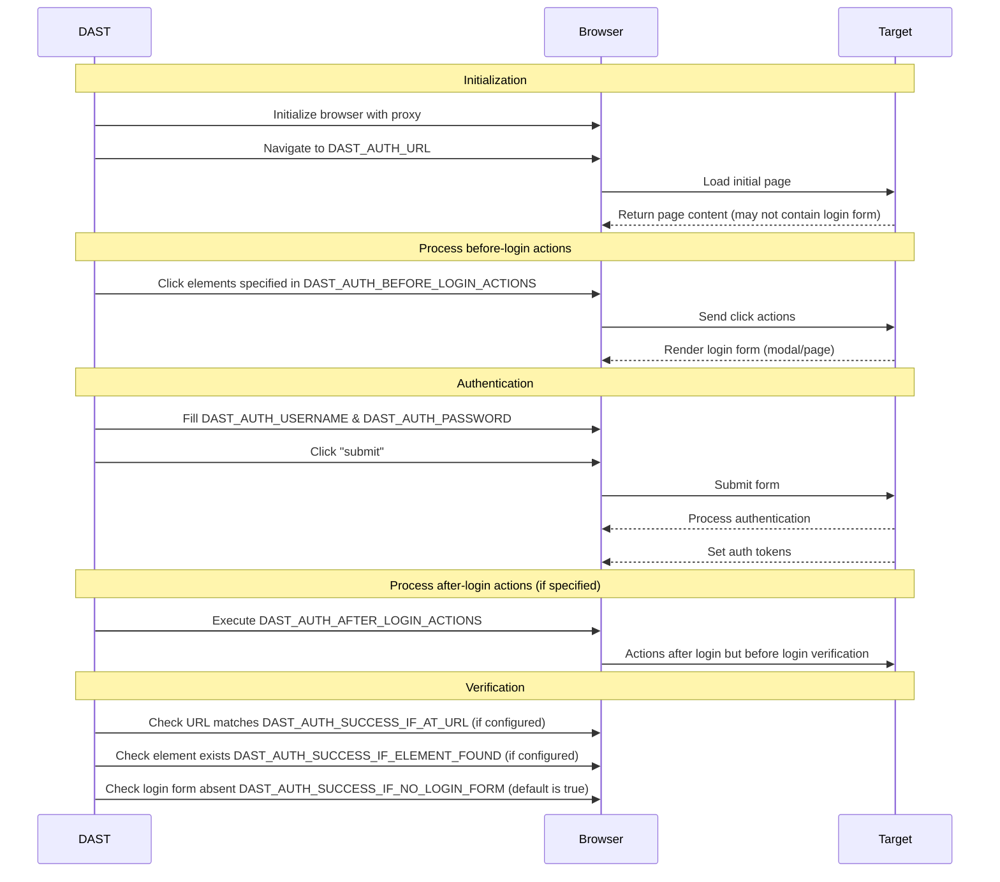

为了保证全面覆盖，DAST 分析器必须对被测应用进行认证。这要求在 DAST CI/CD 作业中配置认证凭据和认证方法。

DAST 需要认证以：

- 模拟真实攻击并识别攻击者可能利用的漏洞。
- 测试仅认证后可见的用户特定功能和自定义行为。

DAST 作业通常通过在浏览器中填写并提交登录表单来对应用进行认证。提交表单后，DAST 作业会确认认证是否成功。如果认证成功，DAST 作业将继续执行，并保存凭据以便在爬取目标应用时重用。如果不成功，DAST 作业将停止。

DAST 支持的认证方法包括：

- 单步登录表单
- 多步登录表单
- 对配置的目标 URL 之外的 URL 进行认证

选择认证凭据时：

- **切勿** 使用对生产系统、生产服务器或用于访问生产数据有效的凭据。
- **切勿** 对生产服务器运行认证扫描。认证扫描可能会执行认证用户所能执行的**任何**操作，包括修改或删除数据、提交表单以及点击链接。只对非生产系统或服务器进行认证扫描。
- 提供允许 DAST 测试整个应用的凭据。
- 注意凭据的到期日期，如有，供以后参考。例如，使用 1Password 等密码管理器。

下图展示了认证变量在认证不同阶段的使用情况：



<a id="getting-started"></a>

## 入门

> [!note]
> 您应该定期确认分析器的认证仍然有效，因为随着应用的更改，往往会随着时间的推移而失效。

要运行 DAST 认证扫描：

- 阅读 [前提条件](#prerequisites) 以了解认证条件。
- [更新目标网站](#update-the-target-website) 至认证用户的着陆页面。
- 如果您的登录表单的用户名、密码和提交按钮都在同一页面，请使用 [CI/CD 变量](#available-cicd-variables) 配置 [单步](#configuration-for-a-single-step-login-form) 登录表单认证。
- 如果您的登录表单的用户名和密码字段位于不同页面，请使用 [CI/CD 变量](#available-cicd-variables) 配置 [多步](#configuration-for-a-multi-step-login-form) 登录表单认证。
- 确保用户未在扫描过程中 [登出](#excluding-logout-urls)。

<a id="prerequisites"></a>

### 前提条件

- 您拥有在扫描期间进行认证的用户的用户名和密码。
- 您已查看 [已知问题](#known-issues) 以确保 DAST 能够对您的应用进行认证。
- 如果使用 [表单认证](#form-authentication)，您已满足其先决条件。
- 如果您的表单认证流程包括 [基于时间的一次性密码](#totp-authentication)，则您已满足额外前提条件。
- 您已考虑如何 [验证](#verifying-authentication-is-successful) 认证是否成功。

<a id="form-authentication"></a>

#### 表单认证

- 您知道应用登录表单的 URL。或者，您知道如何从认证 URL 前往登录表单（请参见 [点击前往登录表单](#clicking-to-go-to-the-login-form)）。
- 您知道 DAST 用来输入用户名和密码值的 HTML 字段的 [选择器](#finding-an-elements-selector)。
- 您知道用于提交登录表单的元素的 [选择器](#finding-an-elements-selector)。

<a id="totp-authentication"></a>

#### TOTP 认证



- 在扫描器版本 6.9 中引入。



- 您拥有测试用户 TOTP 注册的密钥，并以 Base32 编码。
- 您已确认认证提供程序支持以下 TOTP 配置（与 Google Authenticator 相同）：
  - HMAC 算法：SHA-1
  - 时间步长：30 秒
  - 令牌长度：6
- 您知道 DAST 用于输入生成的 TOTP 令牌的 TOTP 字段的 [选择器](#finding-an-elements-selector)。
- 您知道提交 TOTP 令牌的元素的 [选择器](#finding-an-elements-selector)（如果该令牌是独立于密码单独提交的）。

<a id="available-cicd-variables"></a>

### 可用 CI/CD 变量

有关 DAST 认证 CI/CD 变量的列表，请参见 [认证变量](variables.md#authentication)。

DAST CI/CD 变量表由 Rake 任务 `bundle exec rake gitlab:dast_variables:compile_docs` 生成。它使用在 [`lib/gitlab/security/dast_variables.rb`](https://jihulab.com/gitlab-cn/gitlab/-/blob/master/lib/gitlab/security/dast_variables.rb) 中定义的变量元数据。

<a id="update-the-target-website"></a>

### 更新目标网站

目标网站使用 CI/CD 变量 `DAST_TARGET_URL` 定义，是 DAST 开始爬取应用的 URL。

为了在认证扫描中获得最佳爬取结果，目标网站应该是一个仅在用户认证后才能访问的 URL。通常，这是用户登录后所着陆页面的 URL。

例如：

```yaml
include:
  - template: DAST.gitlab-ci.yml

dast:
  variables:
    DAST_TARGET_URL: "https://example.com/dashboard/welcome"
    DAST_AUTH_URL: "https://example.com/login"
```

<a id="configuration-for-http-authentication"></a>

### HTTP 认证配置

要使用 [HTTP 认证方案](https://www.chromium.org/developers/design-documents/http-authentication/)，例如基本认证，您可以将 `DAST_AUTH_TYPE` 值设置为 `basic-digest`。其他方案（如协商或 NTLM）可能有效，但由于当前缺乏自动化测试覆盖，官方不予支持。

配置要求为 DAST 作业定义 CI/CD 变量 `DAST_AUTH_TYPE`、`DAST_AUTH_URL`、`DAST_AUTH_USERNAME`、`DAST_AUTH_PASSWORD`。如果没有唯一的登录 URL，请将 `DAST_AUTH_URL` 设置为与 `DAST_TARGET_URL` 相同的 URL。

```yaml
include:
  - template: DAST.gitlab-ci.yml

dast:
  variables:
    DAST_TARGET_URL: "https://example.com"
    DAST_AUTH_TYPE: "basic-digest"
    DAST_AUTH_URL: "https://example.com"
```

**切勿** 在 YAML 作业定义文件中定义 `DAST_AUTH_USERNAME` 和 `DAST_AUTH_PASSWORD`，因为这可能存在安全风险。而应通过极狐GitLab UI 将它们创建为掩码的 CI/CD 变量。有关更多信息，请参见 [自定义 CI/CD 变量](../../../../../ci/variables/_index.md#for-a-project)。

<a id="configuration-for-a-single-step-login-form"></a>

### 单步登录表单配置

单步登录表单的所有登录表单元素都位于同一个页面上。
配置要求为 DAST 作业定义 CI/CD 变量 `DAST_AUTH_URL`、`DAST_AUTH_USERNAME`、`DAST_AUTH_USERNAME_FIELD`、`DAST_AUTH_PASSWORD`、`DAST_AUTH_PASSWORD_FIELD` 和 `DAST_AUTH_SUBMIT_FIELD`。

您应该在作业定义 YAML 中设置 URL 和字段的选择器，例如：

```yaml
include:
  - template: DAST.gitlab-ci.yml

dast:
  variables:
    DAST_TARGET_URL: "https://example.com"
    DAST_AUTH_URL: "https://example.com/login"
    DAST_AUTH_USERNAME_FIELD: "css:[name=username]"
    DAST_AUTH_PASSWORD_FIELD: "css:[name=password]"
    DAST_AUTH_SUBMIT_FIELD: "css:button[type=submit]"
```

**切勿** 在 YAML 作业定义文件中定义 `DAST_AUTH_USERNAME` 和 `DAST_AUTH_PASSWORD`，因为这可能存在安全风险。而应通过极狐GitLab UI 将它们创建为掩码的 CI/CD 变量。有关更多信息，请参见 [自定义 CI/CD 变量](../../../../../ci/variables/_index.md#for-a-project)。

<a id="configuration-for-a-multi-step-login-form"></a>

### 多步登录表单配置

多步登录表单有两个页面。第一个页面包含带有用户名和下一步提交按钮的表单。
如果用户名有效，第二个页面上的后续表单将包含密码和表单提交按钮。

配置要求为 DAST 作业定义以下 CI/CD 变量：

- `DAST_AUTH_URL`
- `DAST_AUTH_USERNAME`
- `DAST_AUTH_USERNAME_FIELD`
- `DAST_AUTH_FIRST_SUBMIT_FIELD`
- `DAST_AUTH_PASSWORD`
- `DAST_AUTH_PASSWORD_FIELD`
- `DAST_AUTH_SUBMIT_FIELD`

您应该在作业定义 YAML 中设置 URL 和字段的选择器，例如：

```yaml
include:
  - template: DAST.gitlab-ci.yml

dast:
  variables:
    DAST_TARGET_URL: "https://example.com"
    DAST_AUTH_URL: "https://example.com/login"
    DAST_AUTH_USERNAME_FIELD: "css:[name=username]"
    DAST_AUTH_FIRST_SUBMIT_FIELD: "css:button[name=next]"
    DAST_AUTH_PASSWORD_FIELD: "css:[name=password]"
    DAST_AUTH_SUBMIT_FIELD: "css:button[type=submit]"
```

**切勿** 在 YAML 作业定义文件中定义 `DAST_AUTH_USERNAME` 和 `DAST_AUTH_PASSWORD`，因为这可能存在安全风险。而应通过极狐GitLab UI 将它们创建为掩码的 CI/CD 变量。有关更多信息，请参见 [自定义 CI/CD 变量](../../../../../ci/variables/_index.md#for-a-project)。

<a id="configuration-for-time-based-one-time-password-totp"></a>

### 基于时间的一次性密码 (TOTP) 配置

配置 TOTP 要求为 DAST 作业定义以下 CI/CD 变量：

- `DAST_AUTH_OTP_FIELD`
- `DAST_AUTH_OTP_KEY`

如果 TOTP 令牌在密码提交后单独提交，您还必须定义以下变量：

- `DAST_AUTH_OTP_SUBMIT_FIELD`

`_FIELD` 选择器变量可以在作业定义 YAML 中定义，例如：

```yaml
include:
  - template: DAST.gitlab-ci.yml

dast:
  variables:
    DAST_TARGET_URL: "https://example.com"
    DAST_AUTH_URL: "https://example.com/login"
    DAST_AUTH_USERNAME_FIELD: "css:[name=username]"
    DAST_AUTH_PASSWORD_FIELD: "css:[name=password]"
    DAST_AUTH_SUBMIT_FIELD: "css:button[type=submit]"
    DAST_AUTH_OTP_FIELD: "name:otp"
    DAST_AUTH_OTP_SUBMIT_FIELD: "css:input[type=submit]"
```

**切勿** 在 YAML 作业定义文件中定义 `DAST_AUTH_OTP_KEY`，因为这可能存在安全风险。而应通过极狐GitLab UI 将其创建为掩码的 CI/CD 变量。有关更多信息，请参见 [自定义 CI/CD 变量](../../../../../ci/variables/_index.md#for-a-project)。

<a id="configuration-for-single-sign-on-sso"></a>

### 单点登录 (SSO) 配置

如果用户能够登录到应用，那么在大多数情况下，DAST 也能够登录，即使应用使用了单点登录。使用 SSO 解决方案的应用应使用 [单步](#configuration-for-a-single-step-login-form) 或 [多步](#configuration-for-a-multi-step-login-form) 登录表单配置指南来配置 DAST 认证。

DAST 支持用户被重定向到外部身份提供者站点进行登录的认证流程。请检查 DAST 认证的 [已知问题](#known-issues) 以确定您的 SSO 认证过程是否受支持。

<a id="configuration-for-windows-integrated-authentication-kerberos"></a>

### Windows 集成身份认证 (Kerberos) 配置

Windows 集成身份认证（Kerberos）是托管在 Windows 域内的业务线 (LOB) 应用程序的常见认证机制。它使用用户的计算机登录信息提供无提示认证。

要配置这种形式的认证，请执行以下步骤：

1. 在 IT/运维团队的协助下收集必要信息。
1. 在 `.gitlab-ci.yml` 文件中创建或更新 `dast` 作业定义。
1. 使用收集到的信息填充示例 `krb5.conf` 文件。
1. 设置必要的作业变量。
1. 使用项目 **设置** 页面设置必要的密钥变量。
1. 测试并验证认证功能是否正常。

在 IT/运维部门的协助下收集以下信息：

- Windows 域或 Kerberos 领域的名称（必须包含句点，如 `EXAMPLE.COM`）
- Windows/Kerberos 域控制器的主机名
- 对于 Kerberos，认证服务器名称。对于 Windows 域，此项为域控制器。

创建 `krb5.conf` 文件：

```ini
[libdefaults]
  # Realm 是域名的另一个名称
  default_realm = EXAMPLE.COM
  # 这些设置对于 Windows 域不是必需的
  # 它们支持其他 Kerberos 实现
  kdc_timesync = 1
  ccache_type = 4
  forwardable = true
  proxiable = true
  rdns = false
  fcc-mit-ticketflags = true
[realms]
  EXAMPLE.COM = {
    # 域控制器或 KDC
    kdc = kdc.example.com
    # 域控制器或管理服务器
    admin_server = kdc.example.com
  }
[domain_realm]
  # 将 DNS 域映射到 realms/Windows 域
  # 由 DAST_AUTH_NEGOTIATE_DELEGATION 提供的 DNS 域
  # 也应在此表示（但不含通配符）
  .example.com = EXAMPLE.COM
  example.com = EXAMPLE.COM
```

该配置使用了 `DAST_AUTH_NEGOTIATE_DELEGATION` 变量。
此变量设置了允许集成认证所需的以下 Chromium 策略：

- [AuthServerAllowlist](https://chromeenterprise.google/policies/#AuthServerAllowlist)
- [AuthNegotiateDelegateAllowlist](https://chromeenterprise.google/policies/#AuthNegotiateDelegateAllowlist)

该变量的设置是与您的 Windows 域或 Kerberos 领域关联的 DNS 域。您应提供：

- 小写和大写形式。
- 带有通配符模式和仅域名两种形式。

在我们的示例中，Windows 域为 `EXAMPLE.COM`，DNS 域为 `example.com`。这为 `DAST_AUTH_NEGOTIATE_DELEGATION` 提供了一个值 `*.example.com,example.com,*.EXAMPLE.COM,EXAMPLE.COM`。

整合到作业定义中：

```yaml
# 该作业将扩展 DAST 模板中定义的 dast 作业，该模板也必须被包含。
dast:
  image:
    name: "$SECURE_ANALYZERS_PREFIX/dast:$DAST_VERSION$DAST_IMAGE_SUFFIX"
    docker:
      user: root
  variables:
    DAST_TARGET_URL: https://target.example.com
    DAST_AUTH_URL: https://target.example.com
    DAST_AUTH_TYPE: basic-digest
    DAST_AUTH_NEGOTIATE_DELEGATION: '*.example.com,example.com,*.EXAMPLE.COM,EXAMPLE.COM'
    # 未显示 -- DAST_AUTH_USERNAME、DAST_AUTH_PASSWORD 通过设置 -> CI -> 变量进行设置
  before_script:
    - KRB5_CONF='
[libdefaults]
  default_realm = EXAMPLE.COM
  kdc_timesync = 1
  ccache_type = 4
  forwardable = true
  proxiable = true
  rdns = false
  fcc-mit-ticketflags = true
[realms]
  EXAMPLE.COM = {
    kdc = ad1.example.com
    admin_server = ad1.example.com
  }
[domain_realm]
  .example.com = EXAMPLE.COM
  example.com = EXAMPLE.COM
'
    - cat "$KRB5_CONF" > /etc/krb5.conf
    - echo '$DAST_AUTH_PASSWORD' | kinit $DAST_AUTH_USERNAME
    - klist
```

预期输出：

作业控制台输出包含 `before` 脚本的输出。如果认证成功，输出将类似于以下内容。如果不成功，作业将在运行扫描之前失败。

```plaintext
用户 mike@EXAMPLE.COM 的密码：
凭证缓存：FILE:/tmp/krb5cc_1000
默认主体：mike@EXAMPLE.COM

有效起始时间              过期时间              服务主体
11/11/2024 21:50:50  11/12/2024 07:50:50  krbtgt/EXAMPLE.COM@EXAMPLE.COM
        续订至 11/12/2024 21:50:50
```

DAST 扫描器还将输出以下内容，表明成功：

```plaintext
2024-11-08T17:03:09.226 INF AUTH  尝试进行认证 find_auth_fields="basic-digest"
2024-11-08T17:03:09.226 INF AUTH  加载登录页面 LoginURL="https://target.example.com"
2024-11-08T17:03:10.619 INF AUTH  验证登录尝试是否成功 true_when="HTTP 状态码 < 400 且具有认证令牌且未找到登录表单（自动检测）"
2024-11-08T17:03:10.619 INF AUTH  需求已满足，HTTP 登录请求返回状态码 200 want="HTTP 状态码 < 400" url="https://target.example.com/"
2024-11-08T17:03:10.623 INF AUTH  需求已满足，未检测到登录表单 want="未找到登录表单（自动检测）"
2024-11-08T17:03:10.623 INF AUTH  认证令牌 cookies names=""
2024-11-08T17:03:10.623 INF AUTH  认证令牌存储事件 keys=""
2024-11-08T17:03:10.623 INF AUTH  需求已满足，检测到基本认证 want="具有认证令牌"
2024-11-08T17:03:11.230 INF AUTH  登录尝试成功
```

<a id="clicking-to-go-to-the-login-form"></a>

### 点击前往登录表单

定义 `DAST_AUTH_BEFORE_LOGIN_ACTIONS` 以提供从 `DAST_AUTH_URL` 点击的元素路径，以便 DAST 能够访问登录表单。此方法适用于在弹出（模态）窗口中显示登录表单或登录表单没有唯一 URL 的应用。

例如：

```yaml
include:
  - template: DAST.gitlab-ci.yml

dast:
  variables:
    DAST_TARGET_URL: "https://example.com"
    DAST_AUTH_URL: "https://example.com/login"
    DAST_AUTH_BEFORE_LOGIN_ACTIONS: "css:.navigation-menu,css:.login-menu-item"
```

<a id="taking-additional-actions-after-submitting-the-login-form"></a>

### 在提交登录表单后执行额外操作

定义 `DAST_AUTH_AFTER_LOGIN_ACTIONS` 以提供在提交登录表单之后但在验证之前（当认证详细信息被记录时）要执行的一系列操作。这可用于通过“保持登录状态”对话框。

| 操作                     | 格式                          |
|--------------------------|-------------------------------|
| 点击元素                 | `click(on=<selector>)`        |
| 从下拉菜单中选择选项     | `select(option=<selector>)`   |

操作以逗号分隔。有关选择器的信息，请参见 [查找元素的选择器](#finding-an-elements-selector)。

例如：

```yaml
include:
  - template: DAST.gitlab-ci.yml

dast:
  variables:
    DAST_TARGET_URL: "https://example.com"
    DAST_AUTH_URL: "https://example.com/login"
    DAST_AUTH_AFTER_LOGIN_ACTIONS: "select(option=id:accept-yes),click(on=id:continue-button)"
```

<a id="excluding-logout-urls"></a>

### 排除注销 URL

如果在运行认证扫描时 DAST 爬取了注销 URL，用户将被注销，导致扫描的其余部分变为未认证状态。因此，建议使用 CI/CD 变量 `DAST_SCOPE_EXCLUDE_URLS` 排除注销 URL。DAST 不会访问任何被排除的 URL，从而确保用户保持登录状态。

提供的 URL 可以是绝对 URL，也可以是相对于 `DAST_TARGET_URL` 基本路径的 URL 路径的正则表达式。例如：

```yaml
include:
  - template: DAST.gitlab-ci.yml

dast:
  variables:
    DAST_TARGET_URL: "https://example.com/welcome/home"
    DAST_SCOPE_EXCLUDE_URLS: "https://example.com/logout,/user/.*/logout"
```

<a id="finding-an-elements-selector"></a>

### 查找元素的选择器

CI/CD 变量使用选择器来指定浏览器中页面上显示的元素的位置。选择器的格式为 `type`:`search string`。DAST 根据类型使用搜索字符串搜索选择器。

| 选择器类型   | 示例                                | 描述                                                                                                                                        |
|--------------|-------------------------------------|---------------------------------------------------------------------------------------------------------------------------------------------|
| `css`        | `css:.password-field`               | 搜索具有所提供 CSS 选择器的 HTML 元素。出于性能原因，选择器应尽可能具体。                                                                                      |
| `id`         | `id:element`                        | 搜索具有所提供元素 ID 的 HTML 元素。                                                                                                                      |
| `name`       | `name:element`                      | 搜索具有所提供元素名称的 HTML 元素。                                                                                                                         |
| `xpath`      | `xpath://input[@id="my-button"]/a`  | 搜索具有所提供 XPath 的 HTML 元素。预计 XPath 搜索的性能低于其他搜索。                                                                              |

<a id="find-selectors-with-google-chrome"></a>

#### 使用 Google Chrome 查找选择器

Chrome DevTools 元素选择器工具是查找选择器的有效方法。

1. 打开 Chrome 并转到要查找选择器的页面，例如站点的登录页面。
1. 使用键盘快捷键在 Chrome DevTools 中打开 `Elements` 选项卡：
   macOS 上为 <kbd>Command</kbd>+<kbd>Shift</kbd>+<kbd>C</kbd>，
   Windows 或 Linux 上为 <kbd>Control</kbd>+<kbd>Shift</kbd>+<kbd>C</kbd>。
1. 选择 `在页面中选择一个元素以进行检查` 工具。
   
1. 在页面上选择你想要知道其选择器的字段。
1. 工具激活后，高亮显示你希望查看详细信息的字段。
   
1. 高亮显示后，你可以查看元素的详细信息，包括可能成为良好选择器候选的属性。

在此示例中，`id="user_login"` 看起来是一个不错的选择。你可以将此选择器用作 DAST 用户名字段，方法是设置 `DAST_AUTH_USERNAME_FIELD: "id:user_login"`。

<a id="choose-the-right-selector"></a>

#### 选择合适的选择器

明智地选择选择器可使扫描能够适应应用程序的更改。

按照优先级顺序，你应该选择以下作为选择器：

- `id` 字段。这些字段通常在页面上是唯一的，并且很少发生变化。
- `name` 字段。这些字段通常在页面上是唯一的，并且很少发生变化。
- 特定于字段的 `class` 值，例如选择器 `"css:.username"` 用于用户名字段上的 `username` 类。
- 存在特定于字段的数据属性，例如选择器 `"css:[data-username]"` 当 `data-username` 字段在用户名字段上有任何值时。
- 多个 `class` 层次值，例如选择器 `"css:.login-form .username"` 当有多个具有类 `username` 的元素，但只有一个嵌套在具有类 `login-form` 的元素中时。

使用选择器定位特定字段时，应避免基于以下内容进行搜索：

- 任何动态生成的 `id`、`name`、`attribute`、`class` 或 `value`。
- 通用的类名，例如 `column-10` 和 `dark-grey`。
- XPath 搜索，因为它们的性能低于其他选择器搜索。
- 未限定范围的搜索，例如以 `css:*` 和 `xpath://*` 开头的搜索。

<a id="verifying-authentication-is-successful"></a>

## 验证认证是否成功

DAST 提交登录表单后，将进行验证过程以确定认证是否成功。如果认证失败，扫描将停止并报错。

提交登录表单后，以下情况判定认证失败：

- 登录提交的 HTTP 响应具有 `400` 或 `500` 系列状态码。
- 任何 [验证检查](#verification-checks) 失败。
- 在认证过程中未设置具有足够随机值的 [认证令牌](#authentication-tokens)。

<a id="verification-checks"></a>

### 验证检查
验证检查会在认证完成后对浏览器状态执行检查，以进一步确定认证是否成功。

如果未配置任何验证检查，DAST 会检查登录表单是否不存在。

#### 基于 URL 进行验证

将 `DAST_AUTH_SUCCESS_IF_AT_URL` 定义为成功提交登录表单后浏览器标签页中显示的 URL。

DAST 会将验证 URL 与认证后浏览器中的 URL 进行比较。
如果两者不同，则表示认证不成功。

例如：

```yaml
include:
  - template: DAST.gitlab-ci.yml

dast:
  variables:
    DAST_TARGET_URL: "https://example.com"
    DAST_AUTH_SUCCESS_IF_AT_URL: "https://example.com/user/welcome"
```

#### 基于元素的存在进行验证

将 `DAST_AUTH_SUCCESS_IF_ELEMENT_FOUND` 定义为一个[选择器](#查找元素选择器)，该选择器能在成功提交登录表单后显示的页面上找到一个或多个元素。如果未找到任何元素，则表示认证不成功。
在登录失败时显示的页面上搜索该选择器应不会返回任何元素。

例如：

```yaml
include:
  - template: DAST.gitlab-ci.yml

dast:
  variables:
    DAST_TARGET_URL: "https://example.com"
    DAST_AUTH_SUCCESS_IF_ELEMENT_FOUND: "css:.welcome-user"
```

#### 基于登录表单不存在进行验证

将 `DAST_AUTH_SUCCESS_IF_NO_LOGIN_FORM` 定义为 `"true"`，表示 DAST 应在成功提交登录表单后显示的页面上搜索登录表单。如果登录后登录表单仍然存在，则表示认证不成功。

例如：

```yaml
include:
  - template: DAST.gitlab-ci.yml

dast:
  variables:
    DAST_TARGET_URL: "https://example.com"
    DAST_AUTH_SUCCESS_IF_NO_LOGIN_FORM: "true"
```

### 认证令牌

DAST 会记录认证过程中设置的认证令牌。
当 DAST 打开新浏览器时，认证令牌会被加载到这些浏览器中，以便用户在整个扫描过程中保持登录状态。

为了记录令牌，DAST 会在认证过程开始前拍摄应用程序设置的 Cookie、本地存储和会话存储值的快照。认证后 DAST 会再次执行此操作，并利用差异来判断哪些是由认证过程创建的。

DAST 会将具有足够“随机”值的 Cookie、本地存储和会话存储值视为认证令牌。
例如，`sessionID=HVxzpS8GzMlPAc2e39uyIVzwACIuGe0H` 会被视为认证令牌，而 `ab_testing_group=A1` 则不会。

可以使用 CI/CD 变量 `DAST_AUTH_COOKIE_NAMES` 指定认证 Cookie 的名称，并绕过 DAST 使用的随机性检查。
这不仅可以使认证过程更加稳健，还能提高检查认证令牌的漏洞检查的准确性。

例如：

```yaml
include:
  - template: DAST.gitlab-ci.yml

dast:
  variables:
    DAST_TARGET_URL: "https://example.com"
    DAST_AUTH_COOKIE_NAMES: "sessionID,refreshToken"
```

## 已知问题

- 如果认证流程包含验证码（CAPTCHA），DAST 无法绕过。
  请在被扫描应用的测试环境中为已配置的用户关闭验证码。
- DAST 无法使用短信或生物特征识别的一次性密码（OTP）进行认证。
  请在被扫描应用的测试环境中为已配置的用户关闭此类认证；或将用户的 MFA 类型更改为 TOTP。
- DAST 无法对登录时不设置[认证令牌](#认证令牌)的应用进行认证。
- DAST 无法对需要超过用户名、密码和可选 TOTP 之外的更多文本输入的应用进行认证。

## 故障排除

[日志](#阅读日志)可帮助了解 DAST 在认证过程中的行为和预期。如需更详细的信息，请配置[认证报告](#配置认证报告)。

有关特定错误消息或情况的更多信息，请参见[已知问题](#已知问题)。

浏览器分析器用于对用户进行认证。如需高级故障排除，请参见[基于浏览器的故障排除](../troubleshooting.md)。

### 阅读日志

DAST CI/CD 作业的控制台输出会使用 `AUTH` 日志模块显示认证过程的相关信息。
例如，以下日志显示了一个多步骤登录表单的认证失败。
认证失败是因为登录后应显示主页，但登录表单仍然存在。

```plaintext
2022-11-16T13:43:02.000 INF AUTH  尝试进行认证
2022-11-16T13:43:02.000 INF AUTH  加载登录页面 LoginURL=https://example.com/login
2022-11-16T13:43:10.000 INF AUTH  检测到多步骤认证
2022-11-16T13:43:15.000 INF AUTH  正在验证用户提交是否成功 true_when="HTTP 状态码 < 400"
2022-11-16T13:43:15.000 INF AUTH  要求已满足，未检测到登录 HTTP 消息 want="HTTP 状态码 < 400"
2022-11-16T13:43:20.000 INF AUTH  正在验证登录尝试是否成功 true_when="HTTP 状态码 < 400 并且有认证令牌并且未找到登录表单（使用选择器 css:[id=email] 或 css:[id=password] 或 css:[id=submit] 搜索时未找到元素）"
2022-11-24T14:43:20.000 INF AUTH  要求已满足，HTTP 登录请求返回状态码 200 url=https://example.com/user/login?error=invalid%20credentials want="HTTP 状态码 < 400"
2022-11-16T13:43:21.000 INF AUTH  要求未满足，找到了登录表单 want="未找到登录表单（使用选择器 css:[id=email] 或 css:[id=password] 或 css:[id=submit] 搜索时未找到元素）"
2022-11-16T13:43:21.000 INF AUTH  登录尝试失败 error="认证失败：无法认证用户"
```

### 配置认证报告

> [!warning]
> 认证报告可能包含敏感信息，例如用于登录的凭据。

可以将认证报告保存为 CI/CD 作业产物，以帮助理解认证失败的原因。

报告中包含登录过程中执行的步骤、HTTP 请求和响应、文档对象模型（DOM）以及屏幕截图。


导出认证调试报告的示例配置可能如下所示：

```yaml
dast:
  variables:
    DAST_TARGET_URL: "https://example.com"
    DAST_AUTH_REPORT: "true"
```

### 已知问题

#### 找不到登录表单

DAST 在加载登录页面时未能找到登录表单，通常是因为无法加载认证 URL。
日志会报告类似以下的致命错误：

```plaintext
2022-12-07T12:44:02.838 INF AUTH  加载登录页面 LoginURL=[认证 URL]
2022-12-07T12:44:11.119 FTL MAIN  认证失败：找不到登录表单
```

建议采取的措施：

- 生成[认证报告](#配置认证报告)以检查 HTTP 响应。
- 检查目标应用的认证是否已部署且正在运行。
- 检查 `DAST_AUTH_URL` 是否正确。
- 检查极狐GitLab Runner 是否可以访问 `DAST_AUTH_URL`。
- 如果使用了 `DAST_AUTH_BEFORE_LOGIN_ACTIONS`，请检查其是否有效。

#### 扫描未爬取已认证页面

如果 DAST 在认证过程中捕获了错误的[认证令牌](#认证令牌)，则扫描无法爬取已认证页面。Cookie 和存储认证令牌的名称会写入日志。例如：

```plaintext
2022-11-24T14:42:31.492 INF AUTH  认证令牌 Cookie 名称=["sessionID"]
2022-11-24T14:42:31.492 INF AUTH  认证令牌存储事件键=["token"]
```

建议采取的措施：

- 生成[认证报告](#配置认证报告)并查看“登录提交”的屏幕截图，以验证登录是否按预期工作。
- 验证已记录的认证令牌是否与你的应用程序使用的令牌一致。
- 如果使用 Cookie 存储认证令牌，请使用 `DAST_AUTH_COOKIE_NAMES` 设置认证令牌 Cookie 的名称。

#### 无法使用选择器找到元素

DAST 未能找到用户名、密码、第一个提交按钮或提交按钮元素。日志会报告类似以下的致命错误：

```plaintext
2022-12-07T13:14:11.545 FTL MAIN  认证失败：无法使用选择器找到元素: css:#username
```

建议采取的措施：

- 生成[认证报告](#配置认证报告)，使用“登录页面”的屏幕截图来验证页面是否正确加载。
- 在浏览器中加载登录页面，并验证在 `DAST_AUTH_USERNAME_FIELD`、`DAST_AUTH_PASSWORD_FIELD`、`DAST_AUTH_FIRST_SUBMIT_FIELD` 和 `DAST_AUTH_SUBMIT_FIELD` 中配置的[选择器](#查找元素选择器)是否正确。

#### 无法认证用户

DAST 因登录验证检查失败而无法认证。日志会报告类似以下的致命错误：

```plaintext
2022-12-07T06:39:49.483 INF AUTH  正在验证登录尝试是否成功 true_when="HTTP 状态码 < 400 并且有认证令牌并且未找到登录表单（使用选择器 css:[name=username] 或 css:[name=password] 或 css:button[type=\"submit\"] 搜索时未找到元素）"
2022-12-07T06:39:49.484 INF AUTH  要求已满足，HTTP 登录请求返回状态码 303 url=http://auth-manual:8090/login want="HTTP 状态码 < 400"
2022-12-07T06:39:49.513 INF AUTH  要求未满足，找到了登录表单 want="未找到登录表单（使用选择器 css:[name=username] 或 css:[name=password] 或 css:button[type=\"submit\"] 搜索时未找到元素）"
2022-12-07T06:39:49.589 INF AUTH  登录尝试失败 error="认证失败：无法认证用户"
2022-12-07T06:39:53.626 FTL MAIN  认证失败：无法认证用户
```

建议采取的措施：

- 查看日志中“要求未满足”的部分。针对相应的错误进行响应。

#### 要求未满足，找到了登录表单

当用户登录时，应用程序通常会显示仪表盘，而当用户名或密码错误时，则显示带有错误消息的登录表单。

当 DAST 在认证用户后显示的页面上检测到登录表单时，就会发生此错误，这表明登录尝试失败。

```plaintext
2022-12-07T06:39:49.513 INF AUTH  要求未满足，找到了登录表单 want="未找到登录表单（使用选择器 css:[name=username] 或 css:[name=password] 或 css:button[type=\"submit\"] 搜索时未找到元素）"
```

建议采取的措施：

- 验证所使用的用户名和密码/认证凭据是否正确。
- 生成[认证报告](#配置认证报告)并验证“登录提交”的 `Request` 是否正确。
- 可能认证报告中的“登录提交”请求和响应为空。这种情况发生在没有会导致整个页面重新加载的请求时，例如提交 HTML 表单时发出的请求。当使用 websockets 或 AJAX 提交登录表单时就会发生这种情况。
- 如果用户认证后显示的页面确实存在与登录表单选择器匹配的元素，请配置 `DAST_AUTH_SUCCESS_IF_AT_URL` 或 `DAST_AUTH_SUCCESS_IF_ELEMENT_FOUND` 以使用替代方法来验证登录尝试。

#### 要求未满足，选择器未返回结果

DAST 在用户登录后显示的页面上找不到与 `DAST_AUTH_SUCCESS_IF_ELEMENT_FOUND` 中提供的选择器匹配的元素。

```plaintext
2022-12-07T06:39:33.239 INF AUTH  要求未满足，使用选择器搜索 DOM 未返回结果 want="存在元素 css:[name=welcome]"
```

建议采取的措施：

- 生成[认证报告](#配置认证报告)并查看“登录提交”的屏幕截图，以验证是否显示了预期的页面。
- 确保 `DAST_AUTH_SUCCESS_IF_ELEMENT_FOUND` [选择器](#查找元素选择器)正确。

#### 要求未满足，浏览器未处于预期 URL

DAST 检测到用户登录后显示的页面的 URL 与 `DAST_AUTH_SUCCESS_IF_AT_URL` 预期的 URL 不同。

```plaintext
2022-12-07T11:28:00.241 INF AUTH  要求未满足，浏览器未处于预期 URL browser_url="https://example.com/home" want="位于 url https://example.com/user/dashboard"
```

建议采取的措施：

- 生成[认证报告](#配置认证报告)并查看“登录提交”的屏幕截图，以验证是否显示了预期的页面。
- 确保 `DAST_AUTH_SUCCESS_IF_AT_URL` 正确。

#### 要求未满足，HTTP 登录请求状态码

加载登录表单或提交表单时的 HTTP 响应状态码为 400（客户端错误）或 500（服务器错误）。

```plaintext
2022-12-07T06:39:53.626 INF AUTH  要求未满足，HTTP 登录请求返回状态码 502 url="https://example.com/user/login" want="HTTP 状态码 < 400"
```

- 验证所使用的用户名和密码/认证凭据是否正确。
- 生成[认证报告](#配置认证报告)并验证“登录提交”的 `Request` 是否正确。
- 验证目标应用是否按预期工作。

#### 要求未满足，无认证令牌

DAST 无法检测到认证过程中创建的[认证令牌](#认证令牌)。

```plaintext
2022-12-07T11:25:29.010 INF AUTH  认证令牌 Cookie 名称=[]
2022-12-07T11:25:29.010 INF AUTH  认证令牌存储事件键=[]
2022-12-07T11:25:29.010 INF AUTH  要求未满足，未检测到基本认证、Cookie 或存储事件认证令牌 want="有认证令牌"
```

建议采取的措施：

- 生成[认证报告](#配置认证报告)并查看“登录提交”的屏幕截图，以验证登录是否按预期工作。
- 使用浏览器的开发者工具，调查登录时创建的 Cookie 和本地/会话存储对象。确保存在足够随机值的认证令牌。
- 如果使用 Cookie 存储认证令牌，请使用 `DAST_AUTH_COOKIE_NAMES` 设置认证令牌 Cookie 的名称。