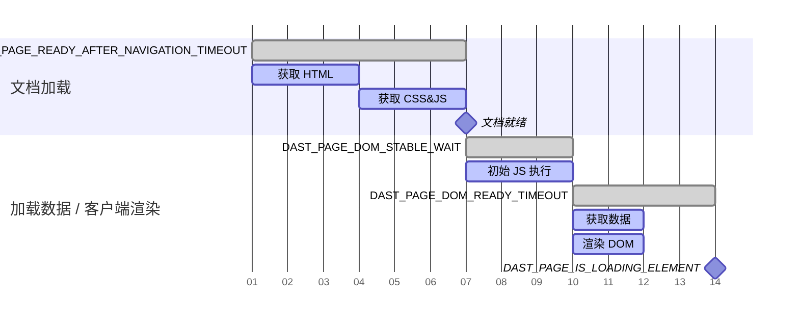

```markdown
---
type: reference, howto
stage: Application Security Testing
group: Dynamic Analysis
info: To determine the technical writer assigned to the Stage/Group associated with this page, see <https://handbook.gitlab.com/handbook/product/ux/technical-writing/#assignments>
title: 自定义分析器设置
---

## 管理范围

范围控制 DAST 在爬取目标应用程序时遵循哪些 URL。妥善管理的范围可以最大限度地缩短扫描运行时间，同时确保仅检查目标应用程序的漏洞。

### 范围类型

范围有三种类型：

- 在范围内
- 超出范围
- 排除在范围外

<a id="in-scope"></a>

#### 在范围内

DAST 遵循范围内的 URL，并在 DOM 中搜索要执行的后续操作以继续爬行。
记录在案的范围内 HTTP 消息会被动检查漏洞，并在运行完整扫描时用于构建攻击。

<a id="out-of-scope"></a>

#### 超出范围

DAST 遵循超出范围的 URL 以获取非文档内容类型，例如图像、样式表、字体、脚本或 AJAX 请求。
除了[身份验证](#scope-works-differently-during-authentication)外，DAST 不会遵循超出范围的 URL 进行整页加载，例如点击指向外部网站的链接。
除了搜索信息泄漏的被动检查外，记录的超出范围 URL 的 HTTP 消息不会检查漏洞。

<a id="excluded-from-scope"></a>

#### 排除在范围外

DAST 不遵循排除在范围外的 URL。除了搜索信息泄漏的被动检查外，记录的排除在范围外的 URL 的 HTTP 消息不会检查漏洞。

<a id="scope-works-differently-during-authentication"></a>

### 身份验证期间范围的工作方式不同

许多目标应用程序具有依赖外部网站的身份验证过程，例如使用身份访问管理提供商进行单点登录 (SSO) 时。
为了确保 DAST 可以向这些提供商进行身份验证，DAST 在身份验证期间遵循超出范围的 URL 进行整页加载。DAST 不遵循排除在范围外的 URL。

<a id="how-dast-blocks-http-requests"></a>

### DAST 如何阻止 HTTP 请求

当由于范围规则而阻止请求时，DAST 会指示浏览器照常发出 HTTP 请求。该请求随后被拦截并以 `BlockedByClient` 的原因被拒绝。
这种方法允许 DAST 记录 HTTP 请求，同时确保它永远不会到达目标服务器。诸如 [200.1](../checks/200.1.md) 之类的被动检查使用这些记录的请求来验证发送到外部主机的信息。

<a id="how-to-configure-scope"></a>

### 如何配置范围

默认情况下，与目标应用程序主机匹配的 URL 被视为在范围内。所有其他主机被视为超出范围。

使用以下变量配置范围：

- 使用 `DAST_SCOPE_ALLOW_HOSTS` 添加范围内主机。
- 使用 `DAST_SCOPE_IGNORE_HOSTS` 添加超出范围的主机。
- 使用 `DAST_SCOPE_EXCLUDE_HOSTS` 添加排除在范围外的主机。
- 使用 `DAST_SCOPE_EXCLUDE_URLS` 设置要排除在范围外的特定 URL。

规则：

- 排除主机的优先级高于忽略主机，忽略主机的优先级高于允许主机。
- 为主机配置范围不会为该主机的子域配置范围。
- 为主机配置范围不会为该主机上的所有端口配置范围。

以下是一个典型的配置：

```yaml
include:
  - template: DAST.gitlab-ci.yml

dast:
  variables:
    DAST_TARGET_URL: "https://my.site.com"                   # 默认情况下，my.site.com URL 被视为在范围内
    DAST_SCOPE_ALLOW_HOSTS: "api.site.com:8443"       # 将 API 包含在扫描中
    DAST_SCOPE_IGNORE_HOSTS: "analytics.site.com"      # 明确忽略来自扫描的分析数据
    DAST_SCOPE_EXCLUDE_HOSTS: "ads.site.com"           # 不要访问 ads 子域上的任何 URL
    DAST_SCOPE_EXCLUDE_URLS: "https://my.site.com/user/logout"  # 不要访问此 URL
```

## 漏洞检测

DAST 通过我们全面的[基于浏览器的漏洞检查](../checks/_index.md)来检测漏洞。这些检查在扫描期间识别 Web 应用程序中的安全问题。

爬虫在将 DAST 配置为代理服务器的浏览器中运行目标网站。这确保了浏览器发出的所有请求和响应都被 DAST 被动扫描。当运行完整扫描时，DAST 执行的活动漏洞检查不使用浏览器。这种漏洞检查方式的差异可能导致问题，需要禁用目标网站的某些功能以确保扫描按预期工作。

例如，对于包含带有防 CSRF 令牌表单的目标网站，被动扫描可以按预期工作，因为浏览器像用户查看页面一样显示页面和表单。但是，在完整扫描中运行的活动漏洞检查无法提交包含防 CSRF 令牌的表单。在这种情况下，在运行完整扫描时禁用防 CSRF 令牌。

## 管理扫描时间

与标准的极狐GitLab DAST 解决方案相比，预计运行基于浏览器的爬虫可以为许多 Web 应用程序带来更好的覆盖率。这可能会以增加扫描时间为代价。

你可以使用以下措施来平衡覆盖率和扫描时间：

- 如果目标应用程序具有基于模板的页面或重复内容，你可以使用 `DAST_CRAWL_GROUPED_URLS` 变量[对 URL 进行分组](#grouped-urls)。
- 垂直扩展 Runner 并使用具有更多浏览器的[变量](variables.md) `DAST_CRAWL_WORKER_COUNT`。默认值根据可用逻辑 CPU 数量动态设置。
- 使用[变量](variables.md) `DAST_CRAWL_MAX_ACTIONS` 限制浏览器执行的操作数。默认值为 `10,000`。
- 使用[变量](variables.md) `DAST_CRAWL_MAX_DEPTH` 限制基于浏览器的爬虫检查覆盖率的页面深度。爬虫使用广度优先搜索策略，因此深度较小的页面会先被爬取。默认值为 `10`。
- 使用[变量](variables.md) `DAST_CRAWL_TIMEOUT` 限制爬取目标应用程序所需的时间。默认值为 `24h`。当爬虫超时时，扫描会继续进行被动和主动检查。
- 使用[变量](variables.md) `DAST_CRAWL_GRAPH` 构建爬行图谱，以查看正在爬取的页面。
- 使用[变量](variables.md) `DAST_SCOPE_EXCLUDE_URLS` 阻止爬取页面。
- 使用[变量](variables.md) `DAST_SCOPE_EXCLUDE_ELEMENTS` 阻止选择元素。谨慎使用，因为定义此变量会导致对每个爬取的页面进行额外查找。
- 如果目标应用程序的渲染量很小或速度很快，考虑将[变量](variables.md) `DAST_PAGE_DOM_STABLE_WAIT` 减少到一个较小的值。默认值为 `500ms`。

## 超时

由于网络状况不佳或应用程序负载沉重，默认超时可能不适用于你的应用程序。

基于浏览器的扫描提供了调整各种超时的能力，以确保在从一个页面过渡到下一个页面时能够继续顺畅进行。这些值使用[持续时间字符串](https://pkg.go.dev/time#ParseDuration)配置，允许你使用前缀配置持续时间：`m` 代表分钟，`s` 代表秒，`ms` 代表毫秒。

导航，或加载新页面的操作，通常需要最多时间，因为它们正在加载多个新资源，例如 JavaScript 或 CSS 文件。根据这些资源的大小或返回速度，默认的 `DAST_PAGE_READY_AFTER_NAVIGATION_TIMEOUT` 可能不够用。

也可以配置稳定性超时，例如可使用 `DAST_PAGE_DOM_READY_TIMEOUT` 或 `DAST_PAGE_READY_AFTER_ACTION_TIMEOUT` 配置的。稳定性超时决定了基于浏览器的扫描何时认为页面已完全加载。基于浏览器的扫描在以下情况下认为页面已加载：

1. [DOMContentLoaded](https://developer.mozilla.org/en-US/docs/Web/API/Document/DOMContentLoaded_event) 事件已触发。
1. 没有重要的（例如 JavaScript 和 CSS）未完成或未处理的请求。媒体文件通常被认为不重要。
1. 根据浏览器是执行了导航、被强制转换还是执行了操作：
   - 在 `DAST_PAGE_DOM_READY_TIMEOUT`或 `DAST_PAGE_READY_AFTER_ACTION_TIMEOUT` 持续时间内没有新的文档对象模型 (DOM) 修改事件。

在这些事件发生后，基于浏览器的扫描认为页面已加载并就绪，并尝试下一步操作。

如果你的应用程序遇到延迟或返回许多导航失败，请考虑调整超时值，如下例所示：

```yaml
include:
  - template: DAST.gitlab-ci.yml

dast:
  variables:
    DAST_TARGET_URL: "https://my.site.com"
    DAST_PAGE_READY_AFTER_NAVIGATION_TIMEOUT: "45s"
    DAST_PAGE_READY_AFTER_ACTION_TIMEOUT: "15s"
    DAST_PAGE_DOM_READY_TIMEOUT: "15s"
```

> [!note]
> 调整这些值可能会影响扫描时间，因为它们会调整浏览器等待各种活动完成的时间长度。

<a id="page-readiness-timeouts"></a>

### 页面就绪超时

页面就绪是指页面已完全加载、其 DOM 已稳定且交互元素可用的状态。正确的页面就绪检测对于以下方面至关重要：

- **扫描准确性**：在页面完全加载之前进行分析可能会遗漏内容或产生漏报。
- **爬行效率**：等待时间过长会浪费扫描时间，而等待不足则会遗漏动态内容。
- **现代 Web 应用程序支持**：单页应用程序、重度 AJAX 网站和渐进式加载模式需要复杂的就绪检测。

通过使用一系列可选的可配置超时，DAST 扫描器可以检测页面不同部分何时完全加载。

<a id="timeout-variables"></a>

#### 超时变量

使用以下 CI/CD 变量自定义 DAST 页面就绪超时。
有关完整列表，请参阅[可用的 CI/CD 变量](variables.md)。

| 超时变量 | 默认值 | 描述 |
|:-----------------|:--------|:------------|
| `DAST_PAGE_READY_AFTER_NAVIGATION_TIMEOUT` | `15s` | 等待浏览器从一个页面导航到另一个页面的最长时间。在整页加载的文档加载阶段使用。 |
| `DAST_PAGE_READY_AFTER_ACTION_TIMEOUT` | `7s` | 等待浏览器认为页面已加载并就绪可供分析的最长时间。用作 `DAST_PAGE_READY_AFTER_NAVIGATION_TIMEOUT` 的替代方案，用于不触发整页加载的页内操作。 |
| `DAST_PAGE_DOM_STABLE_WAIT` | `500ms` | 定义在检查页面是否稳定之前等待 DOM 更新的时长。在客户端渲染阶段开始时使用。 |
| `DAST_PAGE_DOM_READY_TIMEOUT` | `6s` | 导航完成后等待浏览器认为页面已加载并就绪可供分析的最长时间。控制等待后台数据获取和 DOM 渲染。 |
| `DAST_PAGE_IS_LOADING_ELEMENT` | None | 当页面上不再可见时，向分析器指示页面已完成加载并且扫描可以继续的选择器。标志着客户端渲染过程结束。 |

<a id="page-loading-workflow"></a>

#### 页面加载工作流

现代 Web 应用程序分多个阶段加载。DAST 扫描器对流程中的每个步骤都有特定的超时设置：

1. **文档加载**：浏览器获取并处理基本页面结构。

   1. 从服务器获取 HTML 内容。
   1. 加载引用的 CSS 和 JavaScript 文件。
   1. 解析内容并渲染初始页面。
   1. 触发标准的"文档就绪"事件。

   此阶段使用 `DAST_PAGE_READY_AFTER_NAVIGATION_TIMEOUT`（用于整页加载）或 `DAST_PAGE_READY_AFTER_ACTION_TIMEOUT`（用于页内操作），它们设置了文档加载的最大等待时间。

1. **客户端渲染**：在初始加载之后，许多单页应用程序会：
   - 执行初始 JavaScript 执行 (`DAST_PAGE_DOM_STABLE_WAIT`)。
   - 通过 AJAX 或其他 API 调用获取后台数据。

   - 渲染 DOM 并根据获取的数据执行更新 (`DAST_PAGE_DOM_READY_TIMEOUT`)。
   - 显示页面加载指示器 (`DAST_PAGE_IS_LOADING_ELEMENT`)。

   扫描器会监控这些活动，以确定页面何时可以交互。

下图说明了爬取页面时使用的超时顺序：



## 分组的 URL

当你的网站运行 DAST 扫描器时，一次典型的扫描可能需要几个小时才能完成。
当你的网站包含数千个使用相同模板但信息不同的相似页面时，就会出现这种延迟。DAST 将每个页面视为单独的页面并单独分析它们，将大部分扫描时间花费在爬取这些相似的页面上。

例如：

- 拥有数千个产品页面的电子商务网站 (`/products/item-123`, `/products/item-456`)
- 拥有用户资料的社交平台 (`/users/john`, `/users/jane`)
- 拥有分类文章的内容管理系统 (`/blog/category/tech`, `/blog/category/news`)
- 拥有分页结果的搜索界面 (`/search?q=term&page=1`, `/search?q=term&page=2`)

分组 URL 允许你定义通配符模式，将相似的 URL 分组在一起，而不是将每个 URL 都视为唯一的。当 DAST 遇到与这些模式匹配的 URL 时，它会分析每个组中的一个代表性 URL，以减少扫描时间，同时保持安全覆盖率。
例如，如果所有产品详情页都遵循相同的结构和安全模型，DAST 只需要彻底测试其中一个。

<a id="how-grouped-urls-work"></a>

### 分组的 URL 如何工作

配置分组的 URL 模式后，DAST 的爬虫会优化爬行：

1. 模式匹配：当爬虫发现新 URL 时，它会根据你定义的模式检查每一个。
1. 智能分组：匹配某个模式的 URL 被分组在一起，只有第一个被发现的 URL 会被完全分析。
1. 跳过导航：匹配相同模式的后续 URL 会被跳过完整爬行，但仍会记录下来用于报告。
1. 安全覆盖：对代表性 URL 执行的安全分析适用于整个组。

> [!warning]
> 由于分组的 URL 配置而被跳过的 URL 可能会在爬行图谱中显示为 **已访问** 或 **失败**。这是一个已知问题。有关更多信息，请参阅[议题 577252](https://gitlab.com/gitlab-org/gitlab/-/issues/577252)。

<a id="example-configuration-guide"></a>

### 配置示例指南

以下示例使用一个假设的电子商务网站。该网站有产品列表页，这些页面将变量过滤器作为查询参数，以及产品详情页，产品标识符作为 URL 中的子路径。

**分析你的应用程序的 URL 模式**

在配置分组的 URL 之前，请了解你应用程序的 URL 结构：

1. 查看你的站点地图或应用程序路由。
1. 检查之前扫描的 DAST 日志以识别重复模式。
1. 根据 URL 的功能用途（产品页面、用户资料、搜索结果）对其进行分类。
1. 识别共享相同页面结构的基于模板的页面。

在此示例中，对电子商务网站的扫描会在[位于 CI 产物的日志文件](../troubleshooting.md#log-destination)中生成以下 URL：

```plaintext
INF REPT  已访问 8 个 URL
INF REPT  已访问 URL：(DOC www.your-site.com/products?category=vegetables&sort=price) GET www.your-site.com/products?category=vegetables&sort=price
INF REPT  已访问 URL：(DOC www.your-site.com/products?category=fruits&sort=price) GET www.your-site.com/products?category=fruits&sort=price
INF REPT  已访问 URL：(DOC www.your-site.com/products?category=frozen&sort=price) GET www.your-site.com/products?category=frozen&sort=price
INF REPT  已访问 URL：(DOC www.your-site.com/products?category=frozen&sort=price) GET www.your-site.com/products?category=frozen&sort=price
INF REPT  已访问 URL：(DOC www.your-site.com/products/029039-apple-93000/details) GET www.your-site.com/products/029039-apple-93000/details
INF REPT  已访问 URL：(DOC www.your-site.com/products/99345-orange-33322/details) GET www.your-site.com/products/99345-orange/details
INF REPT  已访问 URL：(DOC www.your-site.com/products/90845-orange-33992/details) GET www.your-site.com/products/90845-orange/details
INF REPT  已访问 URL：(DOC www.your-site.com/products/100232-bananas-2677/details) GET www.your-site.com/products/100232-bananas-2677/details
```

前四个 URL 表示具有不同 `category` 和 `sort` 过滤器的产品列表页。
后四个 URL 表示具有唯一产品标识符的单个产品详情页。
其中两个产品详情页的标识符中包含 `orange`。

这两组页面可能共享相同的基础模板和安全特征。
如果不使用分组 URL 进行优化，DAST 将分别爬取和测试所有八个页面。

**设计通配符模式**

创建模式时，请遵循以下规则：

1. 包含至少一个 `*` 通配符用于模式识别。`*` 匹配 URL 中的零个或多个字符。URL 是按字符匹配的，而不是按 URL 的特定部分。一个 `*` 可以匹配 URL 的多个子路径。
1. 查看爬行过程中 URL 中的哪些字符会发生变化。要具体，避免过度分组不相关的页面。
1. 考虑模式顺序。如果页面匹配多个模式，则使用指定的第一个模式。

为电子商务网站配置模式：

1. 产品类别列表组模式：前四个 URL 可以使用模式 `www.your-site.com/products?category=*&sort=price` 进行逻辑分组。此模式匹配所有同时使用类别过滤器并将 `price` 定义为 `sort` 过滤器的页面。
1. 产品详情组模式：后四个 URL 可以使用模式 `www.your-site.com/products/*/details` 进行逻辑分组。此模式匹配所有产品详情页，无论产品标识符如何。

你还可以将产品详情组模式进一步拆分为两个组：

1. 橙子产品详情组模式：模式 `www.your-site.com/products/*orange*/details` 匹配橙子的两个 URL。
1. 通用产品详情组模式：模式 `www.your-site.com/products/*/details` 匹配所有其他产品。

一个页面可以匹配多个 URL 模式。按你希望的匹配顺序指定模式。例如，`www.your-site.com/products/4782-orange-777/details` 匹配两种模式，但这是一个橙子产品详情页。为了确保它匹配橙子产品详情组模式，在配置中，将橙子产品详情组模式放在通用产品详情组模式之前。

**配置 `DAST_CRAWL_GROUPED_URLS` 变量**

将配置添加到你的 `.gitlab-ci.yml` 文件中：

```yaml
include:
  - template: DAST.gitlab-ci.yml

dast:
  variables:
    DAST_TARGET_URL: "https://your-site.com"
    DAST_CRAWL_GROUPED_URLS: "https://your-site.com/products?category=*&sort=price,https://your-site.com/products/*orange*/details,https://your-site.com/products/*/details"
```

**监控和验证**

实施分组 URL 后：

1. 检查爬行图谱（如果已启用）以验证分组行为。你应该在爬行图谱中看到更少的分支。
1. 查看扫描日志以确认预期的 URL 阻止。你应该看到更少的已访问 URL。
1. 验证安全覆盖率是否未受损。发现的漏洞数量可能会减少，因为每个组只有一个页面被扫描漏洞。
1. 测量扫描持续时间的性能改进。扫描完成所需时间应该更短。

<a id="advanced-configuration-examples"></a>

#### 高级配置示例

以下示例展示了常见 Web 应用程序场景的高级模式：

**带有通配符的多个查询参数**

对于具有多个可变参数的搜索或过滤页面：

```yaml
dast:
  variables:
    DAST_TARGET_URL: "https://your-site.com"
    # 匹配任何查询词和页码的搜索结果
    DAST_CRAWL_GROUPED_URLS: "https://your-site.com/search?q=*&page=*,https://your-site.com/search?q=*&page=*&sort=*"
```

这将所有搜索结果页面分组在一起，无论搜索词、分页或排序选项如何。

**组合路径和查询参数模式**

对于同时具有动态路径和查询字符串的应用程序：

```yaml
dast:
  variables:
    DAST_TARGET_URL: "https://your-site.com"
    DAST_CRAWL_GROUPED_URLS: |
      https://your-site.com/api/v1/users/*/profile?tab=*,
      https://your-site.com/dashboard/*/reports?year=*&month=*,
      https://your-site.com/catalog/*/items?filter=*
```

此配置分组了：

- 具有不同标签页的用户资料页面。
- 跨不同时间段的仪表盘报告。
- 具有各种过滤器的目录项目。

**分层 URL 模式**

对于具有多个层级的嵌套资源结构：

```yaml
dast:
  variables:
    DAST_TARGET_URL: "https://your-site.com"
    DAST_CRAWL_GROUPED_URLS: |
      https://your-site.com/organizations/*/teams/*/members/*,
      https://your-site.com/projects/*/issues/*/comments,
      https://your-site.com/categories/*/subcategories/*/products/*
```

此配置处理多个路径段变化的深层嵌套 URL。

**带有资源 ID 的 API 端点**

对于具有变化的资源标识符的 REST API 端点：

```yaml
dast:
  variables:
    DAST_TARGET_URL: "https://api.your-site.com"
    DAST_CRAWL_GROUPED_URLS: |
      https://api.your-site.com/v1/customers/*/orders,
      https://api.your-site.com/v1/customers/*/orders/*,
      https://api.your-site.com/v2/resources/*/relationships/*,
      https://api.your-site.com/*/items?id=*
```

此配置按资源类型而不是单个 ID 来分组 API 端点。

**区域设置和语言变体**

对于具有语言或地区代码的国际化网站：

```yaml
dast:
  variables:
    DAST_TARGET_URL: "https://your-site.com"
    DAST_CRAWL_GROUPED_URLS: |
      https://your-site.com/*/products/*,
      https://your-site.com/*/*/articles/*,
      https://*.your-site.com/content/*
```

此配置分组了：

- 跨不同语言的产品页面（`/en/products/123`，`/fr/products/123`）。
- 具有语言和地区代码的文章（`/en/us/articles/guide`）。
- 基于子域的本地化设置（`en.your-site.com/content/page`）。

**会话和令牌参数**

对于应分组的具有会话 ID 或临时令牌的 URL：

```yaml
dast:
  variables:
    DAST_TARGET_URL: "https://your-site.com"
    DAST_CRAWL_GROUPED_URLS: |
      https://your-site.com/checkout?session=*,
      https://your-site.com/verify?token=*&email=*,
      https://your-site.com/share/*?ref=*
```

此配置防止 DAST 将每个唯一的会话或令牌视为单独的页面。

##### 复杂的电子商务场景

对于全面的电子商务网站优化：

```yaml
dast:
  variables:
    DAST_TARGET_URL: "https://shop.your-site.com"
    DAST_CRAWL_GROUPED_URLS: |
      https://shop.your-site.com/products?category=*&brand=*&price=*,
      https://shop.your-site.com/products/*/reviews?page=*,
      https://shop.your-site.com/products/*/reviews?page=*&sort=*,
      https://shop.your-site.com/cart?item=*&quantity=*,
      https://shop.your-site.com/user/orders/*/tracking,
      https://shop.your-site.com/compare?products=*
```

此配置处理：

- 具有多种过滤组合的产品列表。
- 具有不同排序的分页产品评论。
- 购物车变体。
- 订单跟踪页面。
- 产品比较页面。

**针对具体性的模式顺序**

当模式重叠时，请按从最具体到最通用的顺序排列它们：

```yaml
dast:
  variables:
    DAST_TARGET_URL: "https://your-site.com"
    # 顺序很重要：具体模式在前，通用模式在后
    DAST_CRAWL_GROUPED_URLS: |
      https://your-site.com/products/*-premium-*/details,
      https://your-site.com/products/*-sale-*/details,
      https://your-site.com/products/*/details,
      https://your-site.com/products/*
```
```
该配置确保专业版和销售产品在回退到通用产品模式之前被分别分组。

**排除分组中的特定模式**

与 `DAST_SCOPE_EXCLUDE_URLS` 结合使用，可以从分组和扫描中同时排除特定 URL：

```yaml
dast:
  variables:
    DAST_TARGET_URL: "https://your-site.com"
    DAST_CRAWL_GROUPED_URLS: "https://your-site.com/articles/*/comments?page=*"
    # 完全排除注销和管理 URL 不进行扫描
    DAST_SCOPE_EXCLUDE_URLS: "https://your-site.com/logout,https://your-site.com/admin/*"
```

此配置对文章评论页面进行分组，同时从扫描中排除注销和管理 URL。