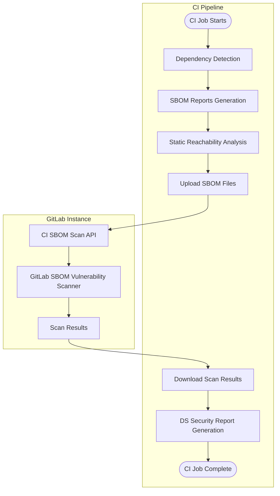



- Tier: 旗舰版
- Offering: JihuLab.com，私有化部署



使用 CycloneDX 软件物料清单（SBOM）的依赖扫描会分析应用程序的依赖项，以发现已知漏洞。所有依赖项都会被扫描，[包括传递依赖项](../_index.md)。

依赖扫描通常被视为软件成分分析（SCA）的一部分。SCA 可能包含检查您的代码所使用的条目。这些条目通常包括应用程序和系统依赖项，这些依赖项几乎总是从外部来源导入，而不是来自您自己编写的条目。

依赖扫描可以在应用程序生命周期的开发阶段运行。当您在 CI/CD 流水线中使用新的依赖扫描分析器时，项目依赖项会被检测并记录在 CycloneDX SBOM 报告中。安全发现会在源分支和目标分支之间进行识别和比较。发现及其严重性会列在合并请求中，使您能够在代码更改提交之前主动应对应用程序面临的风险。当新的安全公告发布时，[持续漏洞扫描](../../continuous_vulnerability_scanning/_index.md) 也会独立于 CI/CD 流水线识别已报告 SBOM 组件的安全发现。

极狐GitLab 同时提供依赖扫描和[容器扫描](../../container_scanning/_index.md)，以确保覆盖所有这些依赖类型。为了尽可能覆盖您的风险区域，建议您使用全部安全扫描器。有关这些功能的比较，请参阅[依赖扫描与容器扫描的比较](../../comparison_dependency_and_container_scanning.md)。

请在此[反馈议题](https://gitlab.com/gitlab-org/gitlab/-/issues/523458)中分享您对新的依赖扫描分析器的任何反馈。

<a id="turn-on-dependency-scanning"></a>

## 开启依赖扫描

为您的项目开启依赖扫描。

<a id="prerequisites"></a>

### 先决条件

所有极狐GitLab 实例的先决条件：

- 项目的开发者、维护者或所有者角色。
- 一个[受支持的锁文件或依赖关系图导出](#supported-languages-and-files)，要么提交到代码仓库，要么在 CI/CD 流水线中创建并作为产物传递给 `dependency-scanning` 作业。或者，[依赖解析](#dependency-resolution) 可以为受支持的生态系统生成所需文件，或者可以使用[清单文件](#manifest-fallback)作为后备选项。
- 对于私有化部署的 Runner，需要带有 [`docker`](https://gitlab.cn/docs/runner/executors/docker/) 或 [`kubernetes`](https://gitlab.cn/docs/runner/install/kubernetes/) 执行器的极狐GitLab Runner。
- 对于 JihuLab.com 上的托管 Runner，此配置默认启用。

仅对于极狐GitLab 私有化部署，必须在极狐GitLab 实例中同步所有要扫描的 PURL 类型的[软件包元数据](../../../../administration/settings/security_and_compliance.md#choose-package-registry-metadata-to-sync)。如果此数据在极狐GitLab 实例中不可用，则依赖扫描无法识别漏洞。

<a id="update-project-pipeline-configuration"></a>

### 更新项目流水线配置

要开启依赖扫描，您必须将依赖扫描模板添加到项目流水线配置中。

默认情况下，`Dependency-Scanning.v2.gitlab-ci.yml` 模板会在合并请求流水线中运行依赖扫描作业。如果您的项目不为其他作业使用合并请求流水线，这将导致只有依赖扫描作业出现在合并请求流水线中，而所有其他作业在单独的分支流水线中运行。要禁用此行为，请参阅[为依赖扫描禁用合并请求流水线](#disable-merge-request-pipelines-for-dependency-scanning)。

要通过极狐GitLab UI 开启依赖扫描：

1. 在顶部栏中，选择 **搜索或跳转到** 并找到您的项目。
1. 在左侧边栏中，选择 **代码** > **代码仓库**。
1. 选择 `.gitlab-ci.yml` 文件。
1. 选择 **编辑** > **编辑单个文件**。
1. 添加 `Dependency-Scanning.v2` CI/CD 模板：

   ```yaml
   include:
     - template: Jobs/Dependency-Scanning.v2.gitlab-ci.yml
   ```

1. 选择 **提交更改**。

<a id="available-container-images"></a>

## 可用的容器镜像

此功能依赖容器镜像来运行 CI 作业。默认的 CI 作业定义通过其主版本标签（例如，`dependency-scanning:2`）引用这些镜像，因此您无需更改 CI/CD 配置即可自动获得补丁和次要更新。

<a id="maintenance-policy"></a>

### 维护策略

极狐GitLab 遵循[发布和维护策略](../../../../policy/maintenance.md)，为当前稳定版本提供错误修复，并为前两个月度版本提供安全修复。

CI/CD 作业通过其主版本标签（例如，`dependency-scanning:2`）引用镜像，因此修复程序可自动提供给与该主镜像版本兼容的所有极狐GitLab 版本。

这适用于下面列出的镜像。以前的镜像不受此策略保护。

<a id="current-images"></a>

### 当前镜像

| CI/CD 作业                               | 生产镜像                                                                                        | 极狐GitLab 版本 |
| --------------------------------------- | ------------------------------------------------------------------------------------------------------- | -------------- |
| `dependency-scanning`                   | `registry.gitlab.com/security-products/dependency-scanning:2`                                           | `19.x`         |
| `dependency-scanning:maven-resolution`  | `registry.gitlab.com/security-products/dependency-resolution/ubi9/openjdk-21:1`                         | `18.x`, `19.x` |
| `dependency-scanning:gradle-resolution` | `registry.gitlab.com/security-products/dependency-resolution/ubi9/openjdk-17-with-gradle-8:1`           | `19.x`         |
| `dependency-scanning:python-resolution` | `registry.gitlab.com/security-products/dependency-resolution/ubi9/python-312-minimal-with-piptools-7:9` | `18.x`,`19.x`  |

当前镜像会定期重建，以整合来自基础镜像供应商的上游补丁。

<a id="previous-images"></a>

### 以前的镜像

这些镜像已弃用，不再接收错误修复或新功能。它们仍然在容器镜像仓库中可用，并继续与其对应的极狐GitLab 版本一起工作。不支持将已弃用的镜像与较新的极狐GitLab 版本一起使用，并且可能会产生意外结果。

| CI/CD 作业             | 生产镜像                                              | 极狐GitLab 版本 | 弃用版本 |
| --------------------- | ------------------------------------------------------------- | -------------- | ------------- |
| `dependency-scanning` | `registry.gitlab.com/security-products/dependency-scanning:1` | `18.x`         | `19.0`        |
| `dependency-scanning` | `registry.gitlab.com/security-products/dependency-scanning:0` | `18.x`         | `19.0`        |

<a id="fips-compliance"></a>

### FIPS 合规性

依赖扫描分析器镜像和所有[依赖解析镜像](#dependency-resolution)都基于 [Red Hat UBI](https://www.redhat.com/en/blog/introducing-red-hat-universal-base-image)，该镜像使用经过 FIPS 140 验证的加密模块。对于启用 FIPS 的环境，无需额外配置。

<a id="understanding-the-results"></a>

## 了解结果

依赖扫描分析器输出：

- 为每个检测到的受支持锁文件或依赖关系图导出生成一个 CycloneDX SBOM。
- 为所有扫描的 SBOM 文档生成一个单一的依赖扫描报告。

> [!note]
> 如果分析器未找到任何[受支持的文件](#supported-languages-and-files)，依赖扫描作业将成功完成，并在 CI/CD 作业日志中打印警告。在这种情况下，不会生成 CycloneDX SBOM 或依赖扫描报告。

<a id="cyclonedx-software-bill-of-materials"></a>

### CycloneDX 软件物料清单

依赖扫描分析器为检测到受支持的锁文件、依赖关系图或清单文件的每个目录输出一个 [CycloneDX](https://cyclonedx.org/) 软件物料清单（SBOM）。CycloneDX SBOM 会作为作业产物创建。

CycloneDX SBOM：

- 命名为 `gl-sbom-<package-type>-<package-manager>.cdx.json`。
- 可作为依赖扫描作业的作业产物使用。
- 作为 `cyclonedx` 报告上传。
- 保存在检测到的锁文件或依赖关系图文件所在的同一目录中。

例如，如果您的项目具有以下结构：

```plaintext
.
├── ruby-project/
│   └── Gemfile.lock
├── ruby-project-2/
│   └── Gemfile.lock
└── php-project/
    └── composer.lock
```

以下 CycloneDX SBOM 会作为作业产物创建：

```plaintext
.
├── ruby-project/
│   ├── Gemfile.lock
│   └── gl-sbom-gem-bundler.cdx.json
├── ruby-project-2/
│   ├── Gemfile.lock
│   └── gl-sbom-gem-bundler.cdx.json
└── php-project/
    ├── composer.lock
    └── gl-sbom-packagist-composer.cdx.json
```

<a id="dependency-scanning-report"></a>

### 依赖扫描报告



- Offering: JihuLab.com，私有化部署



依赖扫描分析器会生成一个依赖扫描报告，记录在 CycloneDX SBOM 文件中识别的所有依赖项漏洞。

依赖扫描报告：

- 命名为 `gl-dependency-scanning-report.json`。
- 可作为依赖扫描作业的作业产物使用。
- 作为 `dependency_scanning` 报告上传。
- 保存在项目的根目录中。

<a id="improve-scanning-performance"></a>

## 提高扫描性能

影响依赖扫描性能的主要因素是待扫描的依赖项数量。默认情况下，依赖扫描在以下范围内运行：

- 包含所有受支持的语言和文件。
- 包含根目录及其直接子目录。
- 排除隐藏目录。

为了提高性能，您可以排除特定路径、限制扫描目录深度，并排除开发与测试依赖项。

<a id="exclude-paths-from-scanning"></a>

### 从扫描中排除路径

为了提高扫描性能，请排除路径。例如，您可能希望排除包含文档的路径。排除路径时，请有选择性地进行，以避免隐藏漏洞。

在 `.gitlab-ci.yml` 文件中列出排除的路径：

- 对于依赖扫描模板，使用 `DS_EXCLUDED_PATHS` CI/CD 变量。
- 对于依赖扫描 CI/CD 组件，使用 `excluded_paths` spec 输入。

排除模式遵循以下规则：

- 不带斜杠的模式匹配项目中任意深度的文件或目录名称。例如，`test` 匹配 `./test` 和 `src/test`。
- 带斜杠的模式匹配以该模式开头的路径。例如，`a/b` 匹配 `a/b` 和 `a/b/c`，但不匹配 `c/a/b`。
- 支持标准 glob 通配符。例如，`a/**/b` 匹配 `a/b`、`a/x/b` 和 `a/x/y/b`。
- 忽略前导和尾随斜杠。例如，`/build` 和 `build/` 与 `build` 匹配的结果相同。

<a id="limit-scan-directory-depth"></a>

### 限制扫描目录深度

默认情况下，扫描仅搜索代码仓库的根目录及其直接子目录中的包管理器文件。为了提高扫描性能，将最大目录深度设置为 `1`，以将搜索限制在代码仓库的根目录。请确保代码仓库中包含所有相关的包管理器文件。

要在 `.gitlab-ci.yml` 文件中指定最大扫描目录深度：

- 对于依赖扫描模板，使用 `DS_MAX_DEPTH` CI/CD 变量。
- 对于依赖扫描 CI/CD 组件，使用 `max_scan_depth` spec 输入。

在以下示例中，将 `DS_MAX_DEPTH` 设置为 `1` 后，依赖扫描仅搜索 `timer` 目录中的包管理器文件。它不会扫描子目录。

```plaintext
timer
├── integration
└── source
```

<a id="exclude-development-and-test-dependencies"></a>

### 排除开发与测试依赖项

默认情况下，开发与测试依赖项包含在扫描中。为了提高扫描性能，请通过设置以下任一方式排除它们：

- 将 CI/CD 变量 `DS_INCLUDE_DEV_DEPENDENCIES` 设置为 `"false"`
- 将 CI/CD 组件输入 `include_dev_dependencies` 设置为 false

仅支持使用以下包管理器的项目：Composer、Conda、Gradle、Maven、npm、pnpm、Pipenv、Poetry 和 uv。

<a id="roll-out"></a>

## 推广部署

在您对单个项目的 SBOM 依赖扫描结果充满信心后，您可以将其实现扩展到多个项目和群组。有关详细信息，请参阅[在多个项目上强制扫描](#enforce-scanning-on-multiple-projects)。

如果您有特殊需求，SBOM 依赖扫描可以在[离线环境](#offline-environment)中运行。

<a id="supported-package-types"></a>

## 受支持的软件包类型

为了使安全分析有效，您的 SBOM 报告中列出的组件必须在 [极狐GitLab 公告数据库](../../gitlab_advisory_database/_index.md)中有对应的条目。

极狐GitLab SBOM 漏洞扫描器可以报告具有以下 [PURL 类型](https://github.com/package-url/purl-spec/blob/346589846130317464b677bc4eab30bf5040183a/PURL-TYPES.rst) 的组件的依赖扫描漏洞：

- `cargo`
- `composer`
- `conan`
- `gem`
- `golang`
- `maven`
- `npm`
- `nuget`
- `pypi`
- `swift`

<a id="supported-languages-and-files"></a>

## 受支持的语言和文件

| 语言                  | 包管理器              | 文件                                         | 描述                                                                                                                                                                           | 依赖关系图导出支持 | 静态可达性支持 |
| ------------------------- | --------------- | ----------------------------------------------- | ------------------------------------------------------------------------------------------------------------------------------------------------------------------------------------- | ------------------------------- | --------------------------- |
| C#                        | NuGet           | `packages.lock.json`                            | 由 `nuget` 生成的锁文件。                                                                                                                                                       |                      |                   |
| C/C++                     | Conan           | `conan.lock`                                    | 由 `conan` 生成的锁文件。                                                                                                                                                       |                      |                   |
| C/C++/Fortran/Go/Python/R | Conda           | `conda-lock.yml`                                | 由 `conda-lock` 生成的环境文件。                                                                                                                                          |                       |                   |
| Dart                      | pub             | `pubspec.lock`, `pub.graph.json`                | 由 `pub` 生成的锁文件。依赖关系图导出源自 `dart pub deps --json > pub.graph.json`。                                                                           |                      |                   |
| Go                        | go              | `go.mod`, `go.graph`                            | 由标准 `go` 工具链生成的模块文件。依赖关系图导出源自 `go mod graph > go.graph`。                                                                |                      |                   |
| Java                      | ivy             | `ivy-report.xml`                                | 由 `report` Apache Ant 任务生成的依赖关系图导出。                                                                                                                   |                       |                  |
| Java                      | Maven           | `maven.graph.json`                              | 由 `mvn dependency:tree -DoutputType=json` 生成的依赖关系图导出。                                                                                                        |                      |                  |
| Java                      | Maven           | `pom.xml`                                       | 由 [依赖解析](#dependency-resolution) 使用的 Maven 清单文件，或在没有依赖关系图导出时作为[清单后备](#manifest-fallback)使用。           |                       |                  |
| Java/Kotlin               | Gradle          | `gradle.graph.txt`                              | 由 `./gradlew dependencies` 生成的依赖关系图导出。                                                                                                                       |                      |                  |
| Java/Kotlin               | Gradle          | `dependencies.lock`, `dependencies.direct.lock` | 由 [gradle-dependency-lock-plugin](https://github.com/nebula-plugins/gradle-dependency-lock-plugin) 生成的锁文件。                                                              |                      |                  |
| Java/Kotlin               | Gradle          | `gradle.lockfile`                               | 由 `gradle dependencies --write-locks` 生成的锁文件。                                                                                                                           |                       |                  |
| Java/Kotlin               | Gradle          | `gradle-html-dependency-report.js`              | 由 [htmlDependencyReport](https://docs.gradle.org/current/dsl/org.gradle.api.tasks.diagnostics.DependencyReportTask.html) 任务生成的依赖关系图导出。                |                      |                  |
| Java/Kotlin               | Gradle          | `build.gradle`, `build.gradle.kts`              | 由 [依赖解析](#dependency-resolution) 使用的 Gradle 构建文件，或在没有锁文件或依赖关系图导出时作为[清单后备](#manifest-fallback)使用。 |                       |                  |
| JavaScript/TypeScript     | Bun             | `bun.lock`                                      | 由 `bun` 生成的锁文件。                                                                                                                                                          |                      |                  |
| JavaScript/TypeScript     | npm             | `package-lock.json`, `npm-shrinkwrap.json`      | 由 `npm` v5 或更高版本生成的锁文件（不支持生成 `lockfileVersion` 属性的早期版本）。                                                  |                      |                  |
| JavaScript/TypeScript     | pnpm            | `pnpm-lock.yaml`                                | 由 `pnpm` 生成的锁文件。                                                                                                                                                        |                      |                  |
| JavaScript/TypeScript     | yarn            | `yarn.lock`                                     | 由 `yarn` 生成的锁文件。                                                                                                                                                        |                      |                  |
| Objective-C               | CocoaPods       | `Podfile.lock`                                  | 由 `cocoapods` 生成的锁文件。                                                                                                                                                   |                       |                   |
| PHP                       | composer        | `composer.lock`                                 | 由 `composer` 生成的锁文件。                                                                                                                                                    |                      |                   |
| Python                    | pip             | `pipdeptree.json`                               | 由 `pipdeptree --json` 生成的依赖关系图导出。                                                                                                                            |                      |                  |
| Python                    | pip             | `requirements.txt` (锁文件)                   | 由 `pip-compile` 生成的锁文件。                                                                                                                                                 |                      |                  |
| Python                    | pip             | `requirements.txt`                              | 由 [依赖解析](#dependency-resolution) 使用的清单文件，或在没有锁文件或依赖关系图导出时作为[清单后备](#manifest-fallback)使用。     |                       |                   |
| Python                    | pipenv          | `Pipfile.lock`                                  | 由 `pipenv` 生成的锁文件。                                                                                                                                                      |                       |                   |
| Python                    | pipenv          | `pipenv.graph.json`                             | 由 `pipenv graph --json-tree >pipenv.graph.json` 生成的依赖关系图导出。                                                                                                  |                      |                  |
| Python                    | poetry          | `poetry.lock`                                   | 由 `poetry` v1 或 v2 生成的锁文件。                                                                                                                                             |                      |                  |
| Python                    | uv <sup>1</sup>  | `uv.lock`                                       | 由 `uv` 生成的锁文件。                                                                                                                                                          |                      |                  |
| Ruby                      | bundler         | `Gemfile.lock`, `gems.locked`                   | 由 `bundler` 生成的锁文件。                                                                                                                                                     |                      |                   |
| Rust                      | cargo           | `Cargo.lock`                                    | 由 `cargo` 生成的锁文件。                                                                                                                                                       |                      |                   |
| Scala                     | sbt             | `dependencies-compile.dot`                      | 由 `sbt dependencyDot` 生成的依赖关系图导出。                                                                                                                            |                      |                   |
| Swift                     | swift           | `Package.resolved`                              | 由 `swift` 生成的锁文件。                                                                                                                                                       |                       |                   |

**脚注**：

1. 如果锁文件包含同一软件包的多个条目，且具有不同的环境标记（例如，Python <3.11 的 numpy==2.2.6 和 Python ≥3.11 的 numpy==2.4.1），则仅解析和报告第一个条目。

<a id="package-hash-information"></a>

### 软件包哈希信息

依赖扫描 SBOM 在可用时包含软件包哈希信息。此信息仅针对 NuGet 软件包提供。软件包哈希出现在 SBOM 中的以下位置，使您能够验证软件包的完整性和真实性：

- 专用哈希字段
- PURL 限定符

例如：

```json
{
  "name": "Iesi.Collections",
  "version": "4.0.4",
  "purl": "pkg:nuget/Iesi.Collections@4.0.4?sha512=8e579b4a3bf66bb6a661f297114b0f0d27f6622f6bd3f164bef4fa0f2ede865ef3f1dbbe7531aa283bbe7d86e713e5ae233fefde9ad89b58e90658ccad8d69f9",
  "hashes": [
    {
      "alg": "SHA-512",
      "content": "8e579b4a3bf66bb6a661f297114b0f0d27f6622f6bd3f164bef4fa0f2ede865ef3f1dbbe7531aa283bbe7d86e713e5ae233fefde9ad89b58e90658ccad8d69f9"
    }
  ],
  "type": "library",
  "bom-ref": "pkg:nuget/Iesi.Collections@4.0.4?sha512=8e579b4a3bf66bb6a661f297114b0f0d27f6622f6bd3f164bef4fa0f2ede865ef3f1dbbe7531aa283bbe7d86e713e5ae233fefde9ad89b58e90658ccad8d69f9"
}
```

<a id="customizing-analyzer-behavior"></a>

## 自定义分析器行为

如何自定义分析器取决于启用解决方案。

> [!warning]
> 在将这些更改合并到默认分支之前，请在合并请求中测试对极狐GitLab 分析器的所有自定义。否则可能会产生意外结果，包括大量误报。

<a id="customizing-behavior-with-the-cicd-template"></a>

### 使用 CI/CD 模板自定义行为

<a id="available-spec-inputs"></a>

#### 可用的 spec 输入

以下 spec 输入可以与 `Dependency-Scanning.v2.gitlab-ci.yml` 模板结合使用。

| Spec 输入                                  | 类型    | 默认值                                                                                                   | 描述                                                                                                                                                                                                                                                           |
| ------------------------------------------- | ------- | --------------------------------------------------------------------------------------------------------- | --------------------------------------------------------------------------------------------------------------------------------------------------------------------------------------------------------------------------------------------------------------------- |
| `job_name`                                  | string  | `"dependency-scanning"`                                                                                   | 依赖扫描作业的名称。                                                                                                                                                                                                                              |
| `stage`                                     | string  | `test`                                                                                                    | 依赖扫描作业的阶段。                                                                                                                                                                                                                             |
| `allow_failure`                             | boolean | `true`                                                                                                    | 依赖扫描作业失败是否应导致流水线失败。                                                                                                                                                                                                 |
| `analyzer_image_prefix`                     | string  | `"$CI_TEMPLATE_REGISTRY_HOST/security-products"`                                                          | 指向分析器代码仓库的注册表 URL 前缀。                                                                                                                                                                                                   |
| `analyzer_image_name`                       | string  | `"dependency-scanning"`                                                                                   | 依赖扫描作业使用的分析器镜像的代码仓库。                                                                                                                                                                                             |
| `analyzer_image_version`                    | string  | `"2"`                                                                                                     | 依赖扫描作业使用的分析器镜像的版本。                                                                                                                                                                                                |
| `additional_ca_cert_bundle`                 | string  |                                                                                                           | 要信任的 CA 证书捆绑包。此处提供的 CA 捆绑包会添加到系统证书中，并在扫描过程中供其他工具使用。有关更多详细信息，请参阅[自定义 TLS 证书颁发机构](#custom-tls-certificate-authority)。              |
| `pip_manifest_file_name_pattern`            | string  |                                                                                                           | 用于依赖解析和清单扫描的自定义 pip 清单文件名模式。该模式应仅匹配文件名，不匹配目录路径。有关语法详细信息，请参阅 [doublestar 库](https://www.github.com/bmatcuk/doublestar/tree/v1#patterns)。 |
| `pipcompile_lockfile_file_name_pattern`     | string  |                                                                                                           | 分析时使用的自定义 pip-compile 锁文件名模式。该模式应仅匹配文件名，不匹配目录路径。有关语法详细信息，请参阅 [doublestar 库](https://www.github.com/bmatcuk/doublestar/tree/v1#patterns)。                          |
| `pipcompile_requirements_file_name_pattern` | string  |                                                                                                           | 在极狐GitLab 19.0 中[已弃用](https://gitlab.com/gitlab-org/gitlab/-/work_items/598796)：请改用 `pipcompile_lockfile_file_name_pattern`。                                                                                                                           |
| `max_scan_depth`                            | number  | `2`                                                                                                       | 定义分析器应搜索受支持文件的目录层级数。值为 -1 表示分析器将搜索所有目录，无论深度如何。                                                                                                       |
| `excluded_paths`                            | string  | `"**/spec,**/test,**/tests,**/tmp"`                                                                       | 要从扫描中排除的路径列表（支持 glob），以逗号分隔。                                                                                                                                                                                           |
| `include_dev_dependencies`                  | boolean | `true`                                                                                                    | 扫描受支持文件时包含开发/测试依赖项。                                                                                                                                                                                                 |
| `enable_static_reachability`                | boolean | `false`                                                                                                   | 启用[静态可达性](../static_reachability.md)。                                                                                                                                                                                                              |
| `enable_manifest_fallback`                  | boolean | `true`                                                                                                    | 启用[清单后备](#manifest-fallback)。                                                                                                                                                                                                                       |
| `analyzer_log_level`                        | string  | `"info"`                                                                                                  | 依赖扫描的日志级别。选项为 fatal、error、warn、info、debug。                                                                                                                                                                               |
| `enable_vulnerability_scan`                 | boolean | `true`                                                                                                    | 启用对生成的 SBOM 的漏洞分析                                                                                                                                                                                                                  |
| `api_timeout`                               | number  | `10`                                                                                                      | 依赖扫描 SBOM API 请求超时时间（秒）。                                                                                                                                                                                                              |
| `api_scan_download_delay`                   | number  | `3`                                                                                                       | 下载扫描结果前依赖扫描 SBOM API 的初始延迟（秒）。                                                                                                                                                                                |
| `resolution_jobs_stage`                     | string  | `.pre`                                                                                                    | 依赖解析作业的阶段。                                                                                                                                                                                                                         |
| `resolution_jobs_allow_failure`             | boolean | `true`                                                                                                    | 当为 `true` 时，失败的解析作业不会导致流水线失败。当为 `false` 时，解析失败会阻塞流水线。                                                                                                                                              |
| `disabled_resolution_jobs`                  | string  | `""`                                                                                                      | 要禁用的解析作业列表，以逗号分隔（例如，`"maven, python"`）。默认情况下，所有可用的解析作业均启用。可能的值有：`maven`、`gradle`、`python`。请参阅[依赖解析](#dependency-resolution)                       |
| `resolution_jobs_checkout_timeout`          | number  | `60`                                                                                                      | 解析服务等待代码仓库检出超时时间（秒）。必须是正整数。                                                                                                                                                         |
| `resolution_jobs_script_timeout`            | number  | `60`                                                                                                      | 等待依赖解析服务生成解析脚本的超时时间（秒）。必须是正整数。如果服务仍在等待代码仓库检出，请改为增加 `resolution_jobs_checkout_timeout`。                     |
| `maven_resolution_job_name`                 | string  | `"dependency-scanning:maven-resolution"`                                                                  | Maven 依赖解析作业的名称。                                                                                                                                                                                                                  |
| `maven_resolution_image`                    | string  | `"registry.gitlab.com/security-products/dependency-resolution/ubi9/openjdk-21:1"`                         | Maven 依赖解析作业使用的镜像。                                                                                                                                                                                                                |
| `maven_dependency_plugin_version`           | string  | `"3.7.0"`                                                                                                 | Maven 依赖解析期间使用的 `maven-dependency-plugin` 的版本。必须是 `3.7.0` 或更高版本。                                                                                                                                                           |
| `python_resolution_job_name`                | string  | `"dependency-scanning:python-resolution"`                                                                 | Python 依赖解析作业的名称。                                                                                                                                                                                                                 |
| `python_resolution_image`                   | string  | `"registry.gitlab.com/security-products/dependency-resolution/ubi9/python-312-minimal-with-piptools-7:9"` | Python 依赖解析作业使用的镜像。                                                                                                                                                                                                               |
| `gradle_resolution_job_name`                | string  | `"dependency-scanning:gradle-resolution"`                                                                 | Gradle 依赖解析作业的名称。                                                                                                                                                                                                                 |
| `gradle_resolution_image`                   | string  | `"registry.gitlab.com/security-products/dependency-resolution/ubi9/openjdk-17-with-gradle-8:1"`           | Gradle 依赖解析作业使用的镜像。                                                                                                                                                                                                                 |

<a id="available-cicd-variables"></a>

#### 可用的 CI/CD 变量

这些变量可以替换 spec 输入，并且也与测试版 `latest` 模板兼容。

| CI/CD 变量                                | 描述                                                                                                                                                                                                                                                                                                                                                                                                                                                                                                                                                                                      |
| ---------------------------------------------- | ------------------------------------------------------------------------------------------------------------------------------------------------------------------------------------------------------------------------------------------------------------------------------------------------------------------------------------------------------------------------------------------------------------------------------------------------------------------------------------------------------------------------------------------------------------------------------------------------ |
| `AST_ENABLE_MR_PIPELINES`                      | 控制依赖扫描作业是在合并请求还是分支流水线中运行。默认值：`"true"`。如果您的项目不使用合并请求流水线，请禁用此选项以避免重复的流水线。对于由流水线执行策略注入的作业，请参阅[为依赖扫描禁用合并请求流水线](#disable-merge-request-pipelines-for-dependency-scanning)。                                                                                                                                                                                       |
| `ADDITIONAL_CA_CERT_BUNDLE`                    | 要信任的 CA 证书捆绑包。此处提供的 CA 捆绑包会添加到系统证书中，并在扫描过程中供其他工具使用。有关更多详细信息，请参阅[自定义 TLS 证书颁发机构](#custom-tls-certificate-authority)。                                                                                                                                                                                                                                                                                                                                                                                                         |
| `ANALYZER_ARTIFACT_DIR`                        | 保存 CycloneDX 报告（SBOM）的目录。默认值 `${CI_PROJECT_DIR}/sca-artifacts`。                                                                                                                                                                                                                                                                                                                                                                                                                                                                                                  |
| `DEPENDENCY_SCANNING_DISABLED`                 | 当设置为 `"true"` 或 `"1"` 时，禁用所有依赖扫描作业。默认值：未设置。                                                                                                                                                                                                                                                                                                                                                                                                                                                                                                          |
| `DS_EXCLUDED_ANALYZERS`                        | 指定要从依赖扫描中排除的分析器（按名称）。                                                                                                                                                                                                                                                                                                                                                                                                                                                                                                                             |
| `DS_EXCLUDED_PATHS`                            | 根据路径从扫描中排除文件和目录。模式列表，以逗号分隔。模式可以是 glob（有关受支持的模式，请参阅 [`doublestar.Match`](https://pkg.go.dev/github.com/bmatcuk/doublestar/v4@v4.0.2#Match)），也可以是文件或文件夹路径（例如，`doc,spec`）。有关匹配规则，请参阅[从扫描中排除路径](#exclude-paths-from-scanning)。这是一个预过滤器，在扫描执行前应用。同时适用于依赖检测和静态可达性。默认值：`"**/spec,**/test,**/tests,**/tmp,**/node_modules,**/.bundle,**/vendor,**/.git"`。 |
| `DS_MAX_DEPTH`                                 | 定义分析器应搜索要扫描的受支持文件的目录层级深度。值为 `-1` 将扫描所有目录，无论深度如何。默认值：`2`。                                                                                                                                                                                                                                                                                                                                                                                                                     |
| `DS_INCLUDE_DEV_DEPENDENCIES`                  | 当设置为 `"false"` 时，不报告开发依赖项。仅支持使用 Composer、Conda、Gradle、Maven、npm、pnpm、Pipenv、Poetry 或 uv 的项目。默认值：`"true"`                                                                                                                                                                                                                                                                                                                                                                                                          |
| `DS_PIP_MANIFEST_FILE_NAME_PATTERN`            | 使用 glob 模式匹配定义要处理哪些 pip 清单文件以进行依赖解析和清单扫描（例如，`custom-requirements.txt` 或 `*-requirements.txt`）。该模式应仅匹配文件名，不匹配目录路径。有关语法详细信息，请参阅 [glob 模式文档](https://github.com/bmatcuk/doublestar/tree/v1?tab=readme-ov-file#patterns)。                                                                                                                                                                                                         |
| `PIP_REQUIREMENTS_FILE`                        | 在极狐GitLab 19.0 中[已弃用](https://gitlab.com/gitlab-org/gitlab/-/work_items/588580)：请改用 `DS_PIP_MANIFEST_FILE_NAME_PATTERN`。                                                                                                                                                                                                                                                                                                                                                                                                                                                          |
| `DS_PIPCOMPILE_LOCKFILE_FILE_NAME_PATTERN`     | 使用 glob 模式匹配定义要处理哪些 pip-compile 锁文件（例如，`requirements*.txt` 或 `*-requirements.txt`）。该模式应仅匹配文件名，不匹配目录路径。有关语法详细信息，请参阅 [glob 模式文档](https://github.com/bmatcuk/doublestar/tree/v1?tab=readme-ov-file#patterns)。                                                                                                                                                                                                                                                             |
| `DS_PIPCOMPILE_REQUIREMENTS_FILE_NAME_PATTERN` | 在极狐GitLab 19.0 中[已弃用](https://gitlab.com/gitlab-org/gitlab/-/work_items/598796)：请改用 `DS_PIPCOMPILE_LOCKFILE_FILE_NAME_PATTERN`。                                                                                                                                                                                                                                                                                                                                                                                                                                                   |
| `SECURE_ANALYZERS_PREFIX`                      | 覆盖提供官方默认镜像（代理）的 Docker 注册表名称。                                                                                                                                                                                                                                                                                                                                                                                                                                                                                                          |
| `DS_FF_LINK_COMPONENTS_TO_GIT_FILES`           | 将依赖列表中的组件链接到提交到代码仓库的文件，而不是在 CI/CD 流水线中动态生成的锁文件和关系图文件。这确保所有组件都链接到代码仓库中的源文件。默认值：`"false"`。                                                                                                                                                                                                                                                                                                                                      |
| `SEARCH_IGNORE_HIDDEN_DIRS`                    | 忽略隐藏目录。同时适用于依赖扫描和静态可达性。默认值：`"true"`。                                                                                                                                                                                                                                                                                                                                                                                                                                                                                        |
| `DS_STATIC_REACHABILITY_ENABLED`               | 启用[静态可达性](../static_reachability.md)。默认值：`"false"`。                                                                                                                                                                                                                                                                                                                                                                                                                                                                                                                    |
| `DS_ENABLE_VULNERABILITY_SCAN`                 | 启用对生成的 SBOM 文件的漏洞扫描。生成[依赖扫描报告](#dependency-scanning-report)。默认值：`"true"`。                                                                                                                                                                                                                                                                                                                                                                                                                                                 |
| `DS_API_TIMEOUT`                               | 依赖扫描 SBOM API 请求超时时间（秒）（最小值：`5`，最大值：`300`）默认值：`10`                                                                                                                                                                                                                                                                                                                                                                                                                                                                                             |
| `DS_API_SCAN_DOWNLOAD_DELAY`                   | 下载扫描结果前的初始延迟（秒）（最小值：1，最大值：120）默认值：`3`                                                                                                                                                                                                                                                                                                                                                                                                                                                                                                 |
| `DS_ENABLE_MANIFEST_FALLBACK`                  | 当没有可用的锁文件或依赖关系图导出时，启用清单后备。请参阅[清单后备](#manifest-fallback)。默认值：`"true"`。                                                                                                                                                                                                                                                                                                                                                                                                                                               |
| `DS_SKIP_IF_NO_SUPPORTED_FILES`                | 当设置为 `"true"` 时，如果项目中未检测到[受支持的文件](#supported-languages-and-files)，则跳过依赖扫描作业。有关详细信息，请参阅[当没有受支持的文件时跳过作业](#skip-the-job-when-no-supported-file-is-present)。默认值：`"false"`。                                                                                                                                                                                                                                                                                                                            |
| `SECURE_LOG_LEVEL`                             | 日志级别。默认值：`"info"`。                                                                                                                                                                                                                                                                                                                                                                                                                                                                                                                                                                    |
| `DS_DISABLED_RESOLUTION_JOBS`                  | 要禁用的解析作业列表，以逗号分隔（例如，`"maven, python"`）。默认情况下，所有可用的解析作业均启用。可能的值有：`maven`、`gradle`、`python`。                                                                                                                                                                                                                                                                                                                                                                                                      |
| `DS_MAVEN_RESOLUTION_IMAGE`                    | Maven 依赖解析作业使用的镜像。                                                                                                                                                                                                                                                                                                                                                                                                                                                                                                                                           |
| `DS_MAVEN_DEPENDENCY_PLUGIN_VERSION`           | Maven 依赖解析期间使用的 `maven-dependency-plugin` 的版本。必须是 `3.7.0` 或更高版本。默认值：`3.7.0`。                                                                                                                                                                                                                                                                                                                                                                                                                                                                    |
| `MAVEN_ARGS`                                   | 在 Maven 依赖解析期间传递给 `mvn` 命令的附加参数。替换旧的 `MAVEN_CLI_OPTS` 变量。                                                                                                                                                                                                                                                                                                                                                                                                                                                             |
| `DS_PYTHON_RESOLUTION_IMAGE`                   | Python 依赖解析作业使用的镜像。                                                                                                                                                                                                                                                                                                                                                                                                                                                                                                                                          |
| `PIP_INDEX_URL`                                | Python 依赖解析期间使用的 Python 软件包索引的基本 URL。默认值：`https://pypi.org/simple`。                                                                                                                                                                                                                                                                                                                                                                                                                                                                            |
| `PIP_EXTRA_INDEX_URL`                          | 在 Python 依赖解析期间与 `PIP_INDEX_URL` 一起使用的其他 Python 软件包索引 URL。                                                                                                                                                                                                                                                                                                                                                                                                                                                                                  |
| `DS_GRADLE_RESOLUTION_IMAGE`                   | Gradle 依赖解析作业使用的镜像。                                                                                                                                                                                                                                                                                                                                                                                                                                                                                                                                          |
| `GRADLE_CLI_OPTS`                              | 在 Gradle 依赖解析期间传递给 `gradle` 或 `gradlew` 命令的附加参数。                                                                                                                                                                                                                                                                                                                                                                                                                                                                                          |

<a id="disable-merge-request-pipelines-for-dependency-scanning"></a>

### 为依赖扫描禁用合并请求流水线

默认情况下，`Dependency-Scanning.v2.gitlab-ci.yml` 模板会在合并请求流水线中运行依赖扫描作业。如果您的项目不为其他作业使用合并请求流水线，这可能导致每个合并请求运行两个流水线，其他作业在单独的分支流水线中运行。要禁用此行为，请设置 spec 输入 `enable_mr_pipelines: false` 或 CI/CD 变量 `AST_ENABLE_MR_PIPELINES: "false"`。

如果模板由 [流水线执行策略](../../policies/pipeline_execution_policies.md) 注入，请在策略 CI/CD 配置中设置 `AST_ENABLE_MR_PIPELINES`，而不是在项目或群组设置中。流水线执行策略默认隔离运行，除非 `variables_override` 允许，否则不应用项目或群组设置中的变量。策略中未设置的变量默认为 `"true"`，因此除非您明确设置，否则作业会在合并请求流水线中运行。项目的 `workflow:rules` 配置也无法阻止此行为。

要在策略覆盖的每个项目中的分支流水线中运行作业，请在策略 CI/CD 配置中设置该变量：

```yaml
variables:
  AST_ENABLE_MR_PIPELINES: "false"

include:
  - template: Jobs/Dependency-Scanning.v2.gitlab-ci.yml
```

要改用项目或群组值，请参阅[流水线执行策略中的变量](../../policies/pipeline_execution_policies.md#cicd-variables)。

<a id="skip-the-job-when-no-supported-file-is-present"></a>

### 当没有受支持的文件时跳过作业

默认情况下，依赖扫描作业会在包含该模板的每个流水线中运行，即使项目不包含[受支持的文件](#supported-languages-and-files)。要在未检测到受支持的文件时跳过作业，请将 `DS_SKIP_IF_NO_SUPPORTED_FILES` 设置为 `"true"`：

```yaml
include:
  - template: Jobs/Dependency-Scanning.v2.gitlab-ci.yml

variables:
  DS_SKIP_IF_NO_SUPPORTED_FILES: "true"
```

设置该变量后，仅当项目包含[受支持文件列表](#supported-languages-and-files)中的至少一个文件，或使用 `DS_PIPCOMPILE_LOCKFILE_FILE_NAME_PATTERN`、`DS_PIP_MANIFEST_FILE_NAME_PATTERN` 或 `PIP_REQUIREMENTS_FILE`（已弃用）设置了自定义模式时，依赖扫描作业才会运行。

<a id="custom-tls-certificate-authority"></a>

### 自定义 TLS 证书颁发机构

依赖扫描允许使用自定义 TLS 证书进行 SSL/TLS 连接，而不是使用分析器容器镜像附带的默认证书。

<a id="using-a-custom-tls-certificate-authority"></a>

#### 使用自定义 TLS 证书颁发机构

要使用自定义 TLS 证书颁发机构，请将 [X.509 PEM 公钥证书的文本表示形式](https://www.rfc-editor.org/rfc/rfc7468#section-5.1) 分配给 CI/CD 变量 `ADDITIONAL_CA_CERT_BUNDLE`。

例如，要在 `.gitlab-ci.yml` 文件中配置证书：

```yaml
variables:
  ADDITIONAL_CA_CERT_BUNDLE: |
      -----BEGIN CERTIFICATE-----
      MIIGqTCCBJGgAwIBAgIQI7AVxxVwg2kch4d56XNdDjANBgkqhkiG9w0BAQsFADCB
      ...
      jWgmPqF3vUbZE0EyScetPJquRFRKIesyJuBFMAs=
      -----END CERTIFICATE-----
```

<a id="dependency-resolution"></a>

## 依赖解析

当项目没有提交受支持的锁文件或依赖关系图导出到其代码仓库时，依赖解析可以在扫描运行前自动生成所需文件。

当在您的项目中检测到受支持的清单文件时，依赖解析会自动触发。解析作业在 `.pre` 阶段运行，使用最小的生态系统镜像（例如 `ubi9/openjdk-21`）来原生生成锁文件或依赖关系图导出。这些作业会保留任何现有的锁文件或依赖关系图导出，仅在不存在时创建它们。生成的产物随后由 `dependency-scanning` 作业在 `test` 阶段使用。您可以将默认镜像替换为等效的替代品（例如 `eclipse-temurin:jdk-21`）或包含必要构建工具的自定义镜像。

以下生态系统支持依赖解析：

| 语言        | 包管理器 | 检测到的清单文件                                                                                                           | 解析命令    | 输出产物       |
| ----------- | --------------- | --------------------------------------------------------------------------------------------------------------------------------- | --------------------- | --------------------- |
| Java        | Maven           | `pom.xml`                                                                                                                         | `mvn dependency:tree` | `maven.graph.json`    |
| Java/Kotlin | Gradle          | `build.gradle`, `build.gradle.kts`                                                                                                | `gradle dependencies` | `gradle.graph.txt`    |
| Python      | pip, setuptools | `requirements.txt`, `requirements.in`, `requirements.pip`, `requires.txt`, `setup.py`, `setup.cfg`, `pyproject.toml` (非 Poetry) | `pip-compile`         | `pipcompile.lock.txt` |

<a id="customizing-dependency-resolution"></a>

### 自定义依赖解析

有关所有可用选项，请参阅[可用 spec 输入](#available-spec-inputs)和[可用 CI/CD 变量](#available-cicd-variables)。

<a id="use-a-custom-dependency-resolution-image"></a>

#### 使用自定义依赖解析镜像

要使用您自己的镜像，您可以设置以下输入：

- `maven_resolution_image`
- `gradle_resolution_image`
- `python_resolution_image`

例如，要为 Maven 解析使用自定义镜像：

```yaml
include:
  - template: Jobs/Dependency-Scanning.v2.gitlab-ci.yml
    inputs:
      maven_resolution_image: "registry.gitlab.mycorp.com/eclipse-temurin:jdk-21"
```

或者，您可以设置以下 CI/CD 变量：

- `DS_MAVEN_RESOLUTION_IMAGE`
- `DS_GRADLE_RESOLUTION_IMAGE`
- `DS_PYTHON_RESOLUTION_IMAGE`

<a id="disable-dependency-resolution"></a>

#### 禁用依赖解析

要为特定生态系统禁用依赖解析，请使用
`DS_DISABLED_RESOLUTION_JOBS` CI/CD 变量或 `disabled_resolution_jobs` 输入。
可能的值有：`maven`,`gradle`,`python`。

例如，要为 Maven 禁用依赖解析：

```yaml
variables:
  DS_DISABLED_RESOLUTION_JOBS: "maven"

include:
  - template: Jobs/Dependency-Scanning.v2.gitlab-ci.yml
```

<a id="security-considerations-for-dependency-resolution"></a>

### 依赖解析的安全注意事项

依赖解析作业在 CI/CD 作业容器中执行生态系统原生的构建工具（`mvn`、`gradle`、`pip-compile`）。这些工具原生地遵循
环境变量和配置文件，这些文件可以在启动时加载扩展或运行
任意代码，包括：

- Maven：`MAVEN_ARGS`、`MAVEN_CLI_OPTS`（旧版）、`MAVEN_OPTS`、`JAVA_TOOL_OPTIONS`、通过 `-s` 或 `--settings` 引用的任何 `settings.xml`，以及在 `pom.xml` 或 `settings.xml` 中声明的 `<extensions>`。
- Gradle：`GRADLE_OPTS`、`JAVA_TOOL_OPTIONS`、`--init-script`，以及 `build.gradle` 或 `build.gradle.kts` 中的顶层 Groovy 或 Kotlin 代码。
- Python：`PIP_INDEX_URL`、`PIP_EXTRA_INDEX_URL`、`setup.py` 和锁文件安装钩子。

任何能够设置这些 CI/CD 变量或修改项目构建
文件的人都可以导致在解析作业中执行任意代码。解析
作业使用 `CI_JOB_TOKEN` 运行，访问范围内的掩码 CI/CD 变量，并在作业期间
对项目代码仓库进行读写。

此属性是生态系统原生构建工具固有的，并非
依赖扫描所特有。请将解析作业视为敏感的
执行上下文。

建议的控制措施：

- 限制谁可以定义或覆盖前面列出的变量。使用[受保护的 CI/CD 变量](../../../../ci/variables/_index.md#for-a-project)，将其作用域限定在受保护的分支和标签上。不要将它们设置在 `.gitlab-ci.yml` 的 `variables:` 块中，因为任何开发者都可以编辑这些块。
- 作为标准代码评审流程的一部分，审计 `MAVEN_ARGS`、`MAVEN_CLI_OPTS`、`GRADLE_OPTS`、`--init-script`、自定义 `settings.xml` 以及 `pom.xml` 中 `<extensions>` 的任何使用情况。
- 当您使用[扫描执行策略](../../policies/scan_execution_policies.md)强制执行依赖扫描时，来自目标项目的开发者编写的 `variables:` 会流入注入的解析作业。请审查您的策略框架转发了哪些变量，并在策略中取消设置或覆盖构建工具变量。
- 如果您的项目构建在您控制且信任的 CI/CD 作业中运行（例如运行 `mvn package` 的 `build` 阶段），请在同一作业中生成锁文件或依赖关系图导出，并使用 `DS_DISABLED_RESOLUTION_JOBS` 禁用极狐GitLab 提供的解析作业。这种方法不会降低运行构建工具的风险，但可以将敏感作业上下文限制为一个。
- 如果您需要保证已知的工具链，请使用按摘要固定的[自定义解析镜像](#use-a-custom-dependency-resolution-image)。

<a id="dependency-resolution-limitations"></a>

### 依赖解析的限制

依赖解析在普通或自定义镜像中运行生态系统原生的构建工具，每个生态系统使用单一、固定的运行时版本和构建工具。

解析成功取决于项目与此环境的兼容性、其访问
软件包仓库的能力，以及不存在超出依赖收集范围的构建时需求。

使用默认环境失败的项目可以覆盖相关的解析作业镜像，以提供一个包含所有必需依赖的兼容环境。

即使兼容，解析环境也可能与项目构建时使用的确切运行时版本或其他要求不匹配。
因此，生成的依赖关系图可能无法反映在项目实际构建环境中会解析的确切依赖集。差异可能源于固定的运行时版本、未解决的环境标记、平台特定的依赖项，或依赖于解析作业中不可用的构建时上下文的条件依赖组。

对于构建高度定制且依赖解析工作流无法充分覆盖的项目，
您应该按照[手动创建锁文件或依赖关系图导出](#create-lockfile-or-dependency-graph-export-manually)中的描述，在您自己的构建环境中提供锁文件或依赖关系图导出。

<a id="maven-resolution-known-issues"></a>

#### Maven 解析已知问题

默认环境：Java 21, Maven 3.9

以下限制适用于 Maven 项目：

- Maven Enforcer 插件：在 Maven Enforcer 插件中使用严格 Java 版本规则的项目可能会失败。解析命令传递 `-Denforcer.skip=true` 以缓解此问题，但并非所有 enforcer 规则都会被跳过。
- 基于 Profile 的激活：使用由 JDK 版本激活的条件模块的项目（例如 ZXing、Dubbo）可能会生成与使用原始目标 Java 版本构建时不同的依赖关系图。
- 早期生命周期阶段的插件：绑定到 validate 或 initialize 阶段且与解析镜像的 Java 版本不兼容的插件可能会导致失败。

<a id="gradle-resolution-known-issues"></a>

#### Gradle 解析已知问题

默认环境：Java 17, Gradle 8

当存在 Gradle wrapper 时，解析作业运行 `./gradlew dependencies`，否则运行 `gradle dependencies`。对于多模块项目，每个子项目使用 `:<subproject>:dependencies` 单独解析。作业将输出写入相应项目目录中的 `gradle.graph.txt`。

以下限制适用于 Gradle 项目：

- Wrapper 要求：当存在 Gradle wrapper（`gradlew`）时，它必须引用有效的 `gradle-wrapper.jar`。如果不存在 wrapper，作业将使用系统 `gradle`。
- 插件和版本兼容性：需要特定 Gradle 插件、自定义工具链或 Java 17 以外 Java 版本的项目可能会失败。请使用包含所需构建环境的镜像覆盖解析镜像（`spec:inputs:gradle_resolution_image`）。

<a id="python-resolution-known-issues"></a>

#### Python 解析已知问题

默认环境：Python 3.12, pip-tools 7

以下限制适用于 Python 项目：

- 不支持 Pipfile：不支持 Pipfile 项目（没有 `Pipfile.lock` 文件）。Python 解析作业不会因代码仓库中存在 `Pipfile` 文件而触发。
- Git/VCS 依赖：无法解析指定为 Git 或 VCS URL（`git+https://...`）的依赖。对于此特定清单文件，解析命令将失败，但会继续处理其他文件（如果有）。
- 本地/可编辑安装：使用 `-e .`、`file:` 或本地路径引用的条目会在解析前被剥离，并发出警告。这些软件包不会出现在输出中。
- 具有动态 `install_requires` 的 `setup.py`：当 `install_requires` 在运行时从文件读取时，会发出警告，`pip-compile` 将尝试解析但可能会失败。
- 没有 `[project]` 表的 `pyproject.toml`：仅包含构建系统配置的 `pyproject.toml` 会被跳过，并发出警告。
- `DS_INCLUDE_DEV_DEPENDENCIES` 范围：开发依赖包含仅针对具有 `[dependency-groups]` 的 `pyproject.toml` 实现。

<a id="create-lockfile-or-dependency-graph-export-manually"></a>

## 手动创建锁文件或依赖关系图导出

如果您的项目没有提交受支持的[锁文件](../../terminology/_index.md#lockfile)或
[依赖关系图导出](../../terminology/_index.md#dependency-graph-export)到其
代码仓库，并且依赖解析不支持它，您需要提供一个。

对于具有复杂构建、自定义构建步骤、私有仓库或特定
环境要求的项目，请考虑手动创建锁文件或依赖关系图导出。在您现有的构建过程中生成
文件通常比配置
[依赖解析](#dependency-resolution)来复制该环境更快、更简单。手动文件
创建也会产生更准确的结果。该文件反映了您自己构建中的确切依赖版本，
包括传递依赖和平台特定的解析。

以下示例展示了如何为流行的
语言和包管理器创建极狐GitLab 分析器支持的文件。另请参阅完整的
[受支持语言和文件](#supported-languages-and-files)列表。

<a id="go"></a>

### Go

此方法使用 Go 工具链中的 [`go mod graph` 命令](https://go.dev/ref/mod#go-mod-graph) 来生成包含分析器所需所有信息的 `go.graph` 文件，包括直接和传递依赖。没有此文件，分析器仅从 `go.mod` 提取组件，但 [依赖路径](../../dependency_list/_index.md#dependency-paths) 信息不可用，并且如果存在同一模块的多个版本，可能会出现误报。

要在 Go 项目上启用分析器：

1. 添加 `Dependency-Scanning.v2` CI/CD 模板。
1. 将 `go mod graph` 命令添加到项目现有的构建作业中，或者如果不存在构建作业，则创建一个专用作业。此作业必须在 `dependency-scanning` 作业之前运行，以便在扫描开始时产物可用。
1. 将 `go.graph` 声明为作业产物。

将命令添加到现有构建作业比在单独作业中运行更快，因为它
复用了构建中的模块缓存。

例如：

```yaml
stages:
  - build
  - test

include:
  - template: Jobs/Dependency-Scanning.v2.gitlab-ci.yml

build:
  # Running in the build stage ensures that the dependency-scanning job
  # receives the go.graph artifact.
  stage: build
  image: "golang:latest"
  script:
    # Your regular build script
    - go mod tidy
    - go build ./...
    # New instruction to generate the dependency graph
    - go mod graph > go.graph
  # Make the artifact available to the dependency-scanning job.
  artifacts:
    paths:
      - "**/go.graph"
```

<a id="gradle"></a>

### Gradle

对于 Gradle 项目，请使用以下任一方法创建依赖关系图导出。

- Gradle `dependencies` 任务
- Nebula Gradle Dependency Lock Plugin
- Gradle `HtmlDependencyReportTask`

<a id="gradle-dependencies-task"></a>

#### Gradle dependencies 任务

此方法使用与自动
[依赖解析](#dependency-resolution)相同的 `gradle dependencies` 任务。这是推荐的方法，因为它
生成一个包含分析器所需所有信息的 `gradle.graph.txt` 文件，包括直接和传递依赖以及用于启用 [依赖路径](../../dependency_list/_index.md#dependency-paths) 的图信息。

要在 Gradle 项目上启用分析器：

1. 添加 `Dependency-Scanning.v2` CI/CD 模板。
1. 将 `gradle dependencies` 命令添加到项目现有的构建作业中，或者如果不存在构建作业，则创建一个专用作业。此作业必须在 `dependency-scanning` 作业之前运行，以便在扫描开始时产物可用。
1. 将 `gradle.graph.txt` 声明为作业产物。
1. 通过将 `gradle` 添加到 `DS_DISABLED_RESOLUTION_JOBS` CI/CD 变量或 `disabled_resolution_jobs` 输入值来禁用自动依赖解析。

将命令添加到现有构建作业比在单独作业中运行更快，因为它
复用了构建中的 Gradle 守护进程、缓存和已解析的配置。

例如：

```yaml
stages:
  - build
  - test

image: gradle:8.0-jdk11

include:
  - template: Jobs/Dependency-Scanning.v2.gitlab-ci.yml

build:
  # Running in the build stage ensures that the dependency-scanning job
  # receives the gradle.graph.txt artifact.
  stage: build
  script:
    # Your regular build script
    - ./gradlew build
    # New instruction to generate the dependency graph
    - ./gradlew dependencies > gradle.graph.txt
  # Make the artifact available to the dependency-scanning job.
  artifacts:
    paths:
      - "**/gradle.graph.txt"
```

<a id="dependency-lock-plugin"></a>

#### 依赖锁插件

> [!warning]
> `gradle-dependency-lock-plugin` 与 Gradle 9 或更高版本不兼容。当您尝试使用这些版本生成 `dependencies.lock` 文件时，构建会失败，因为该插件依赖于在 Gradle 9 中已移除的内部 Gradle API。对于 Gradle 9 或更高版本的项目，请改用 [Gradle dependencies 任务](#gradle-dependencies-task) 或 [HtmlDependencyReportTask](#htmldependencyreporttask)。

此方法使用 [gradle-dependency-lock-plugin](https://github.com/nebula-plugins/gradle-dependency-lock-plugin)
来生成两个锁文件：`dependencies.lock`（直接和传递依赖）
和 `dependencies.direct.lock`（仅直接依赖）。分析器使用这两个
文件来区分依赖关系图中的直接依赖和传递依赖。

要在 Gradle 项目上启用分析器：

1. 添加 `Dependency-Scanning.v2` CI/CD 模板。
1. 将
   [gradle-dependency-lock-plugin](https://github.com/nebula-plugins/gradle-dependency-lock-plugin/wiki/Usage#example)
   应用到您的项目，可以通过编辑 `build.gradle` 或 `build.gradle.kts`，或使用 `init` 脚本。
1. 将 `generateLock saveLock` 命令添加到项目现有的构建作业中，或者如果不存在构建作业，则创建一个专用作业。此作业必须在 `dependency-scanning` 作业之前运行，以便在扫描开始时产物可用。
1. 将 `dependencies.lock` 和 `dependencies.direct.lock` 声明为作业产物。
1. 通过将 `gradle` 添加到 `DS_DISABLED_RESOLUTION_JOBS` CI/CD 变量或 `disabled_resolution_jobs` 输入值来禁用自动依赖解析。

例如：

```yaml
stages:
  - build
  - test

image: gradle:8.0-jdk11

include:
  - template: Jobs/Dependency-Scanning.v2.gitlab-ci.yml

generate nebula lockfile:
  # Running in the build stage ensures that the dependency-scanning job
  # receives the scannable artifacts.
  stage: build
  script:
    - |
      cat << EOF > nebula.gradle
      initscript {
          repositories {
            mavenCentral()
          }
          dependencies {
              classpath 'com.netflix.nebula:gradle-dependency-lock-plugin:12.7.1'
          }
      }

      allprojects {
          apply plugin: nebula.plugin.dependencylock.DependencyLockPlugin
      }
      EOF
      ./gradlew --init-script nebula.gradle -PdependencyLock.includeTransitives=true -PdependencyLock.lockFile=dependencies.lock generateLock saveLock
      ./gradlew --init-script nebula.gradle -PdependencyLock.includeTransitives=false -PdependencyLock.lockFile=dependencies.direct.lock generateLock saveLock
      # generateLock saves the lockfile in the build/ directory of a project
      # and saveLock copies it into the root of a project. To avoid duplicates
      # and get an accurate location of the dependency, use find to remove the
      # lockfiles in the build/ directory only.
  after_script:
    - find . -path '*/build/dependencies*.lock' -print -delete
  # Make the artifacts available to the dependency-scanning job.
  artifacts:
    paths:
      - '**/dependencies*.lock'
```

<a id="htmldependencyreporttask"></a>

#### `HtmlDependencyReportTask`

此方法使用
[`HtmlDependencyReportTask`](https://docs.gradle.org/current/dsl/org.gradle.api.reporting.dependencies.HtmlDependencyReportTask.html)
来生成包含直接和传递依赖的 `gradle-html-dependency-report.js` 文件。此方法已在 Gradle 4 到 8 版本中测试，推荐用于 Gradle 9 或更高版本的项目。

要在 Gradle 项目上启用分析器：

1. 添加 `Dependency-Scanning.v2` CI/CD 模板。
1. 将 `gradle htmlDependencyReport` 命令添加到项目现有的构建作业中，或者如果不存在构建作业，则创建一个专用作业。此作业必须在 `dependency-scanning` 作业之前运行，以便在扫描开始时产物可用。
1. 将 `gradle-html-dependency-report.js` 声明为作业产物。
1. 通过将 `gradle` 添加到 `DS_DISABLED_RESOLUTION_JOBS` CI/CD 变量或 `disabled_resolution_jobs` 输入值来禁用自动依赖解析。

例如：

```yaml
stages:
  - build
  - test

# Define the image that contains Java and Gradle
image: gradle:8.0-jdk11

include:
  - template: Jobs/Dependency-Scanning.v2.gitlab-ci.yml

build:
  stage: build
  script:
    - gradle --init-script report.gradle htmlDependencyReport
  # The gradle task writes the dependency report as a javascript file under
  # build/reports/project/dependencies. Because the file has an un-standardized
  # name, the after_script finds and renames the file to
  # `gradle-html-dependency-report.js` copying it to the  same directory as
  # `build.gradle`
  after_script:
    - |
      reports_dir=build/reports/project/dependencies
      while IFS= read -r -d '' src; do
        dest="${src%%/$reports_dir/*}/gradle-html-dependency-report.js"
        cp $src $dest
      done < <(find . -type f -path "*/${reports_dir}/*.js" -not -path "*/${reports_dir}/js/*" -print0)
  # Make the artifact available to the dependency-scanning job.
  artifacts:
    paths:
      - "**/gradle-html-dependency-report.js"
```

上面的命令使用 `report.gradle` 文件，可以通过 `--init-script` 提供，或者将其内容直接添加到 `build.gradle`：

```kotlin
allprojects {
    apply plugin: 'project-report'
}
```

> [!note]
> 依赖报告可能表明某些配置的依赖项 `FAILED` 无法解析。在这种情况下，依赖扫描会记录警告，但不会使作业失败。如果您希望在报告解析失败时让流水线失败，请在上面的 `build` 示例中添加以下额外步骤。

```shell
while IFS= read -r -d '' file; do
  grep --quiet -E '"resolvable":\s*"FAILED' $file && echo "Dependency report has dependencies with FAILED resolution status" && exit 1
done < <(find . -type f -path "*/gradle-html-dependency-report.js -print0)
```

<a id="maven"></a>

### Maven

此方法使用与自动
[依赖解析](#dependency-resolution)相同的 `mvn dependency:tree` 命令。它生成一个包含分析器所需所有信息的 `maven.graph.json` 文件，包括直接和传递依赖，以及用于启用 [依赖路径](../../dependency_list/_index.md#dependency-paths) 的图信息。

要在 Maven 项目上启用分析器：

1. 添加 `Dependency-Scanning.v2` CI/CD 模板。
1. 将 `mvn dependency:tree` 命令（使用 `maven-dependency-plugin` 版本 `3.7.0` 或更高版本）添加到项目现有的构建作业中，或者如果不存在构建作业，则创建一个专用作业。此作业必须在 `dependency-scanning` 作业之前运行，以便在扫描开始时产物可用。
1. 将 `maven.graph.json` 声明为作业产物。
1. 通过将 `maven` 添加到 `DS_DISABLED_RESOLUTION_JOBS` CI/CD 变量或 `disabled_resolution_jobs` 输入值来禁用自动依赖解析。

将命令添加到现有构建作业比在单独作业中运行更快，因为它
复用了构建中的 Maven 会话和已解析的配置。

例如：

```yaml
stages:
  - build
  - test

image: maven:3.9.9-eclipse-temurin-21

variables:
  # Disable the automatic Maven resolution job. The dependency graph is
  # generated manually in the build job below. The built-in resolution
  # job which runs whenever a `pom.xml` is present is redundant.
  # Alternatively, set the `disabled_resolution_jobs: "maven"` input on the
  # template include.
  DS_DISABLED_RESOLUTION_JOBS: "maven"

include:
  - template: Jobs/Dependency-Scanning.v2.gitlab-ci.yml

build:
  # Running in the build stage ensures that the dependency-scanning job
  # receives the maven.graph.json artifacts.
  stage: build
  script:
    # Your regular build script
    - mvn install
    # New instruction to generate the dependency graph
    - mvn org.apache.maven.plugins:maven-dependency-plugin:3.8.1:tree -DoutputType=json -DoutputFile=maven.graph.json
  # Make the artifact available to the dependency-scanning job.
  artifacts:
    paths:
      - "**/*.jar"
      - "**/maven.graph.json"
```

<a id="pip"></a>

### pip

对于 pip 项目，请使用以下任一方法创建依赖关系图导出：

- `pip-compile`
- `pipdeptree`

<a id="pip-compile"></a>

#### `pip-compile`

此方法使用 [`pip-compile`](https://pip-tools.readthedocs.io/en/latest/cli/pip-compile/)
命令，该命令为自动 [依赖解析](#dependency-resolution)提供支持。它生成
一个包含分析器所需所有信息的 `requirements.txt` 锁文件，
包括直接和传递依赖以及用于启用
[依赖路径](../../dependency_list/_index.md#dependency-paths) 的图信息。

要在 pip 项目上启用分析器：

1. 添加 `Dependency-Scanning.v2` CI/CD 模板。
1. 将 `pip-compile` 命令添加到项目现有的构建作业中，或者如果不存在构建作业，则创建一个专用作业。此作业必须在 `dependency-scanning` 作业之前运行，以便在扫描开始时产物可用。
1. 将 `requirements.txt` 声明为作业产物。
1. 通过将 `python` 添加到 `DS_DISABLED_RESOLUTION_JOBS` CI/CD 变量或 `disabled_resolution_jobs` 输入值来禁用自动依赖解析。

将命令添加到现有构建作业比在单独作业中运行更快，因为它
复用了构建中已安装的依赖。

例如：

```yaml
stages:
  - build
  - test

include:
  - template: Jobs/Dependency-Scanning.v2.gitlab-ci.yml

build:
  # Running in the build stage ensures that the dependency-scanning job
  # receives the requirements.txt artifact.
  stage: build
  image: "python:latest"
  script:
    # Your regular build script
    - pip install pip-tools
    # New instruction to generate the dependency lockfile
    - pip-compile requirements.in
  # Make the artifact available to the dependency-scanning job.
  artifacts:
    paths:
      - "**/requirements.txt"
```

<a id="pipdeptree"></a>

#### `pipdeptree`

此方法使用 [`pipdeptree --json`](https://pypi.org/project/pipdeptree/) 来生成
包含分析器所需所有信息的 `pipdeptree.json` 文件，包括
直接和传递依赖以及用于启用
[依赖路径](../../dependency_list/_index.md#dependency-paths) 的图信息。

要在 pip 项目上启用分析器：

1. 添加 `Dependency-Scanning.v2` CI/CD 模板。
1. 将 `pipdeptree --json` 命令添加到项目现有的构建作业中，或者如果不存在构建作业，则创建一个专用作业。此作业必须在 `dependency-scanning` 作业之前运行，以便在扫描开始时产物可用。
1. 将 `pipdeptree.json` 声明为作业产物。
1. 通过将 `python` 添加到 `DS_DISABLED_RESOLUTION_JOBS` CI/CD 变量或 `disabled_resolution_jobs` 输入值来禁用自动依赖解析。

将命令添加到现有构建作业比在单独作业中运行更快，因为它
复用了构建中已安装的依赖。

例如：

```yaml
stages:
  - build
  - test

include:
  - template: Jobs/Dependency-Scanning.v2.gitlab-ci.yml

build:
  # Running in the build stage ensures that the dependency-scanning job
  # receives the pipdeptree.json artifact.
  stage: build
  image: "python:latest"
  script:
    # Your regular build script
    - pip install -r requirements.txt
    # New instructions to generate the dependency graph.
    # Exclude pipdeptree itself to avoid false positives.
    - pip install pipdeptree
    - pipdeptree -e pipdeptree --json > pipdeptree.json
  # Make the artifact available to the dependency-scanning job.
  artifacts:
    paths:
      - "**/pipdeptree.json"
```

由于一个[已知问题](https://github.com/tox-dev/pipdeptree/issues/107)，`pipdeptree` 不会将
[可选依赖](https://setuptools.pypa.io/en/latest/userguide/dependency_management.html#optional-dependencies)
标记为父软件包的依赖。因此，依赖扫描会将它们标记为项目的直接依赖，
而不是传递依赖。

<a id="pipenv"></a>

### Pipenv

此方法使用 [`pipenv graph`](https://pipenv.pypa.io/en/latest/cli.html#graph) 命令来
生成包含分析器所需信息的 `pipenv.graph.json` 文件，
包括直接和传递依赖。没有此文件，分析器仅从 `Pipfile.lock` 提取组件，但 [依赖路径](../../dependency_list/_index.md#dependency-paths) 信息不可用。

要在 Pipenv 项目上启用分析器：

1. 添加 `Dependency-Scanning.v2` CI/CD 模板。
1. 将 `pipenv graph --json-tree` 命令添加到项目现有的构建作业中，或者如果不存在构建作业，则创建一个专用作业。此作业必须在 `dependency-scanning` 作业之前运行，以便在扫描开始时产物可用。
1. 将 `pipenv.graph.json` 声明为作业产物。

将命令添加到现有构建作业比在单独作业中运行更快，因为它
复用了构建中已安装的依赖。

例如：

```yaml
stages:
  - build
  - test

include:
  - template: Jobs/Dependency-Scanning.v2.gitlab-ci.yml

build:
  # Running in the build stage ensures that the dependency-scanning job
  # receives the pipenv.graph.json artifact.
  stage: build
  image: "python:3.12"
  script:
    # Your regular build script
    - pip install pipenv
    - pipenv install
    # New instruction to generate the dependency graph
    - pipenv graph --json-tree > pipenv.graph.json
  # Make the artifact available to the dependency-scanning job.
  artifacts:
    paths:
      - "**/pipenv.graph.json"
```

<a id="sbt"></a>

### `sbt`

此方法使用 [`sbt-dependency-graph`](https://github.com/sbt/sbt-dependency-graph/blob/master/README.md#usage-instructions)
插件来生成包含分析器所需所有信息的 `dependencies-compile.dot` 文件，
包括直接和传递依赖。

要在 `sbt` 项目上启用分析器：

1. 添加 `Dependency-Scanning.v2` CI/CD 模板。
1. 编辑 `plugins.sbt` 以添加
   [`sbt-dependency-graph`](https://github.com/sbt/sbt-dependency-graph/blob/master/README.md#usage-instructions) 插件。
1. 将 `sbt dependencyDot` 命令添加到项目现有的构建作业中，或者如果不存在构建作业，则创建一个专用作业。此作业必须在 `dependency-scanning` 作业之前运行，以便在扫描开始时产物可用。
1. 将 `dependencies-compile.dot` 声明为作业产物。

将命令添加到现有构建作业比在单独作业中运行更快，因为它
复用了构建中的 sbt 会话和已解析的配置。

例如：

```yaml
stages:
  - build
  - test

include:
  - template: Jobs/Dependency-Scanning.v2.gitlab-ci.yml

build:
  # Running in the build stage ensures that the dependency-scanning job
  # receives the dependencies-compile.dot artifact.
  stage: build
  image: "sbtscala/scala-sbt:eclipse-temurin-17.0.13_11_1.10.7_3.6.3"
  script:
    # Your regular build script
    - sbt compile
    # New instruction to generate the dependency graph
    - sbt dependencyDot
  # Make the artifact available to the dependency-scanning job.
  artifacts:
    paths:
      - "**/dependencies-compile.dot"
```

<a id="manifest-fallback"></a>

## 清单后备

当受支持的锁文件或依赖关系图导出不可用时，依赖扫描分析器可以从受支持的清单文件中提取依赖作为后备。

支持以下清单文件：

| 语言 | 包管理器 | 清单文件                      |
| -------- | --------------- | ---------------------------------- |
| Java     | Maven           | `pom.xml`                          |
| Python   | pip             | `requirements.txt`                 |
| Java     | Gradle          | `build.gradle`, `build.gradle.kts` |

> [!warning]
>
> 与锁文件扫描相比，清单后备的准确性较低：
>
> - 无传递依赖：仅检测直接依赖。
> - 无法始终确定确切的已解析版本。

<a id="disable-manifest-fallback"></a>

### 禁用清单后备

要禁用清单后备，请使用 `DS_ENABLE_MANIFEST_FALLBACK` CI/CD 变量或 `enable_manifest_fallback` 输入。

```yaml
variables:
  DS_ENABLE_MANIFEST_FALLBACK: "false"

include:
  - template: Jobs/Dependency-Scanning.v2.gitlab-ci.yml
```

<a id="how-it-scans-an-application"></a>

## 它如何扫描应用程序

使用 SBOM 的依赖扫描功能依赖于一种分解的依赖分析方法，该方法将依赖检测与其他分析（如静态可达性或漏洞扫描）分开。

这种关注点分离和该架构的模块化能够更好地支持客户，包括扩展语言支持、在极狐GitLab 平台内实现更紧密的集成和体验，以及向行业标准报告类型转变。

当启用[依赖解析](#dependency-resolution)时，解析作业在 `dependency-scanning` 作业之前的 `.pre` 阶段运行。这些作业生成锁文件或依赖关系图导出作为产物，随后由 `dependency-scanning` 作业使用。

依赖扫描的整体流程如下所示。



在依赖检测阶段，分析器解析可用的锁文件，以构建项目依赖及其关系（依赖关系图）的全面清单。该清单被记录在 CycloneDX SBOM（软件物料清单）文档中。

在静态可达性阶段，分析器解析源文件以识别哪些 SBOM 组件被实际使用，并在 SBOM 文件中相应标记它们。这使用户能够根据易受攻击的组件是否可达来确定漏洞的优先级。有关更多信息，请参阅[静态可达性页面](../static_reachability.md)。

SBOM 文档通过依赖扫描 SBOM API 临时上传到极狐GitLab 实例。极狐GitLab SBOM 漏洞扫描引擎将 SBOM 组件与公告进行匹配，以生成发现列表，该列表返回给分析器以包含在依赖扫描报告中。

API 使用默认的 `CI_JOB_TOKEN` 进行身份验证。使用不同的令牌覆盖 `CI_JOB_TOKEN` 值可能会导致 API 返回 403 Forbidden 响应。

用户可以使用以下方式配置与依赖扫描 SBOM API 通信的分析器客户端：

- `vulnerability_scan_api_timeout` 或 `DS_API_TIMEOUT`
- `vulnerability_scan_api_download_delay` 或 `DS_API_SCAN_DOWNLOAD_DELAY`

有关更多信息，请参阅[可用 spec 输入](#available-spec-inputs)和[可用 CI/CD 变量](#available-cicd-variables)。

生成的报告在 CI 作业完成时上传到极狐GitLab 实例，通常在流水线完成后处理。

SBOM 报告用于支持其他基于 SBOM 的功能，如[依赖列表](../../dependency_list/_index.md)、[许可证扫描](../../../compliance/license_scanning_of_cyclonedx_files/_index.md)或[持续漏洞扫描](../../continuous_vulnerability_scanning/_index.md)。

依赖扫描报告遵循[安全扫描结果](../../detect/security_scanning_results.md)的通用流程：

- 如果依赖扫描报告由默认分支上的 CI/CD 作业声明：将创建漏洞，并可在[漏洞报告](../../vulnerability_report/_index.md)中查看。
- 如果依赖扫描报告由非默认分支上的 CI/CD 作业声明：将创建安全发现，并可在[流水线视图的安全选项卡](../../detect/security_scanning_results.md)和[合并请求报告](../../../project/merge_requests/reports.md)中查看。

<a id="offline-environment"></a>

## 离线环境



- Tier: 旗舰版
- Offering: 私有化部署



对于通过互联网对外部资源的访问受限、受限或间歇性
的环境中的实例，您需要进行一些调整才能成功运行依赖扫描作业。
有关更多信息，请参阅[离线环境](../../offline_deployments/_index.md)。

<a id="requirements"></a>

### 要求

要在离线环境中运行依赖扫描，您必须拥有：

- 具有 `docker` 或 `kubernetes` 执行器的极狐GitLab Runner。
- 依赖扫描分析器镜像的本地副本。
- 访问 [软件包元数据数据库](../../../../topics/offline/quick_start_guide.md#enabling-the-package-metadata-database)。需要为您的依赖提供许可证和公告数据。

<a id="local-copies-of-analyzer-images"></a>

### 分析器镜像的本地副本

要使用依赖扫描分析器：

1. 将[当前镜像](#current-images)从 `registry.gitlab.com` 导入到
   您的[本地 Docker 容器镜像仓库](../../../packages/container_registry/_index.md)。
   将 Docker 镜像导入本地离线 Docker 仓库的过程取决于
   **您的网络安全策略**。请咨询您的 IT 人员，以找到一种被接受和批准的
   流程，通过该流程可以导入或临时访问外部资源。
   这些镜像会定期更新新功能、错误修复和补丁，
   您可能需要定期下载它们。如果您的离线实例
   可以访问 GitLab 镜像仓库，您可以使用 [Security-Binaries 模板](../../offline_deployments/_index.md#using-the-official-gitlab-template) 下载最新的依赖扫描分析器镜像。

1. 配置极狐GitLab CI/CD 以使用本地分析器。

   将 CI/CD 变量 `SECURE_ANALYZERS_PREFIX` 或 `analyzer_image_prefix` spec 输入的值设置为您的本地 Docker 仓库 - 在此示例中为 `docker-registry.example.com`。

   ```yaml
   include:
     - template: Jobs/Dependency-Scanning.v2.gitlab-ci.yml

   variables:
     SECURE_ANALYZERS_PREFIX: "docker-registry.example.com/analyzers"
   ```

<a id="enforce-scanning-on-multiple-projects"></a>

## 在多个项目上强制执行扫描

使用安全策略在多个项目上强制执行依赖扫描。依赖扫描
需要可扫描的产物，即锁文件或依赖关系图导出。可扫描
产物是否提交到项目的代码仓库决定了策略的选择。

- 如果可扫描产物已提交到代码仓库，请使用
  [扫描执行策略](../../policies/scan_execution_policies.md)。

  对于已将可扫描产物提交到其代码仓库，或受
  [依赖解析](#dependency-resolution)支持的项目，扫描执行
  策略提供了强制执行依赖扫描的最直接方式。

- 如果可扫描产物未提交到代码仓库，且不受
  [依赖解析](#dependency-resolution)支持，请使用
  [流水线执行策略](../../policies/pipeline_execution_policies.md)。

  对于未将可扫描产物提交到其代码仓库的项目，您必须
  使用流水线执行策略。该策略必须定义一个自定义 CI/CD 作业，以便在调用依赖扫描之前生成可扫描产物。

  流水线执行策略必须：

  - 在 CI/CD 流水线中生成锁文件或依赖关系图导出。
  - 根据您的特定项目要求自定义依赖检测过程。
  - 为 Gradle 和 Maven 等构建工具实现特定于语言的说明。

以下示例使用 Gradle `nebula` 插件生成锁文件。对于其他语言，
请参阅[手动创建锁文件或依赖关系图导出](#create-lockfile-or-dependency-graph-export-manually)。

<a id="example-pipeline-execution-policy-for-a-gradle-project"></a>

### 示例：Gradle 项目的流水线执行策略

对于没有将可扫描产物提交到代码仓库的 Gradle 项目，您必须在流水线执行策略中定义产物生成步骤。以下示例使用 `nebula` 插件。

1. 在专用的安全策略项目中，创建或更新主策略文件（例如，
   `policy.yml`）：

   ```yaml
   pipeline_execution_policy:
   - name: Enforce Gradle dependency scanning with SBOM
     description: Generate dependency artifact and run dependency scanning.
     enabled: true
     pipeline_config_strategy: inject_policy
     content:
       include:
         - project: $SECURITY_POLICIES_PROJECT
           file: "dependency-scanning.yml"
   ```

1. 添加 `dependency-scanning.yml` 策略文件：

   ```yaml
   stages:
     - build
     - test

   include:
     - template: Jobs/Dependency-Scanning.v2.gitlab-ci.yml

   generate nebula lockfile:
     image: openjdk:11-jdk
     stage: build
     script:
       - |
         cat << EOF > nebula.gradle
         initscript {
             repositories {
               mavenCentral()
             }
             dependencies {
                 classpath 'com.netflix.nebula:gradle-dependency-lock-plugin:12.7.1'
             }
         }

         allprojects {
             apply plugin: nebula.plugin.dependencylock.DependencyLockPlugin
         }
         EOF
         ./gradlew --init-script nebula.gradle -PdependencyLock.includeTransitives=true -PdependencyLock.lockFile=dependencies.lock generateLock saveLock
         ./gradlew --init-script nebula.gradle -PdependencyLock.includeTransitives=false -PdependencyLock.lockFile=dependencies.direct.lock generateLock saveLock
     after_script:
       - find . -path '*/build/dependencies.lock' -print -delete
     artifacts:
       paths:
         - '**/dependencies.lock'
         - '**/dependencies.direct.lock'
   ```

此方法确保：

1. 在 Gradle 项目中运行的流水线生成可扫描产物。
1. 依赖扫描被强制执行，并且可以访问可扫描产物。
1. 策略范围内的所有项目都一致地遵循相同的依赖扫描方法。
1. 配置更改可以集中管理并应用于多个项目。

<a id="other-ways-of-enabling-the-new-dependency-scanning-feature"></a>

## 启用新依赖扫描功能的其他方式

强烈建议您使用 `v2` 模板启用依赖扫描功能。如果无法做到，您可以选择以下方式之一。

<a id="using-the-latest-template"></a>

### 使用 `latest` 模板

> [!warning]
> `latest` 模板不被视为稳定版本，可能包含破坏性更改。请参阅[模板版本](../../detect/security_configuration.md#template-editions)。

使用 `latest` 依赖扫描 CI/CD 模板 `Dependency-Scanning.latest.gitlab-ci.yml` 来启用极狐GitLab 提供的分析器。

- 默认使用（已弃用的）Gemnasium 分析器。
- 要启用新的依赖扫描分析器，请将 CI/CD 变量 `DS_ENFORCE_NEW_ANALYZER` 设置为 `true`。
- 代码仓库中必须存在[受支持的锁文件或依赖关系图导出](#create-lockfile-or-dependency-graph-export-manually)或[触发文件](#trigger-files-for-the-latest-template)，才能在流水线中创建 `dependency-scanning` 作业。

  ```yaml
  include:
    - template: Jobs/Dependency-Scanning.latest.gitlab-ci.yml

  variables:
    DS_ENFORCE_NEW_ANALYZER: 'true'
  ```

或者，您可以使用 [扫描执行策略](../../policies/scan_execution_policies.md) 和 `latest` 模板启用该功能，并通过将 CI/CD 变量 `DS_ENFORCE_NEW_ANALYZER` 设置为 `true` 来强制执行新的依赖扫描分析器。

如果您希望自定义分析器行为，请使用[可用 CI/CD 变量](#available-cicd-variables)。

<a id="trigger-files-for-the-latest-template"></a>

#### `latest` 模板的触发文件

使用[最新依赖扫描 CI/CD 模板](https://gitlab.com/gitlab-org/gitlab/-/blob/master/lib/gitlab/ci/templates/Jobs/Dependency-Scanning.latest.gitlab-ci.yml)时，触发文件会创建 `dependency-scanning` CI/CD 作业。分析器不会扫描这些文件。如果您使用触发文件来[手动创建锁文件或依赖关系图导出](#create-lockfile-or-dependency-graph-export-manually)，您的项目可以得到支持。

| 语言        | 文件                                                     |
| --------------- | --------------------------------------------------------- |
| C#/Visual Basic | `*.csproj`, `*.vbproj`                                    |
| Java            | `pom.xml`                                                 |
| Java/Kotlin     | `build.gradle`, `build.gradle.kts`                        |
| Python          | `requirements.pip`, `Pipfile`, `requires.txt`, `setup.py` |
| Scala           | `build.sbt`                                               |

<a id="using-the-dependency-scanning-cicd-component"></a>

### 使用依赖扫描 CI/CD 组件

使用
[依赖扫描 CI/CD 组件](https://gitlab.com/explore/catalog/components/dependency-scanning)
来启用新的依赖扫描分析器。在选择此方法之前，请查看极狐GitLab 私有化部署的当前[限制](../../../../ci/components/_index.md#use-a-gitlabcom-component-on-gitlab-self-managed)。

  ```yaml
  include:
    - component: $CI_SERVER_FQDN/components/dependency-scanning/main@1
  ```

您还必须[手动创建锁文件或依赖关系图导出](#create-lockfile-or-dependency-graph-export-manually)。

使用依赖扫描 CI/CD 组件时，可以通过配置[输入](https://gitlab.com/explore/catalog/components/dependency-scanning)来自定义分析器。

<a id="bringing-your-own-sbom"></a>

### 自带 SBOM

> [!warning]
> 第三方 SBOM 支持在技术上是可行的，但随着官方支持通过此[史诗](https://www.gitlab.com/groups/gitlab-org/-/epics/14760)逐步完成，该支持极有可能发生变化。

使用您自己的 CycloneDX SBOM 文档，该文档由第三方 CycloneDX SBOM 生成器或自定义工具生成，作为自定义 CI 作业中的 [CI/CD 产物报告](../../../../ci/yaml/artifacts_reports.md#artifactsreportscyclonedx)。

要激活使用 SBOM 的依赖扫描，提供的 CycloneDX SBOM 文档必须：

- 符合 [CycloneDX 规范](https://github.com/CycloneDX/specification) 版本 `1.4`、`1.5` 或 `1.6`。在线验证器可在 [CycloneDX Web Tool](https://cyclonedx.github.io/cyclonedx-web-tool/validate) 上使用。
- 符合 [极狐GitLab CycloneDX 属性分类法](../../../../development/sec/cyclonedx_property_taxonomy.md)。
- 作为 [CI/CD 产物报告](../../../../ci/yaml/artifacts_reports.md#artifactsreportscyclonedx) 从成功的 CI 作业上传。
