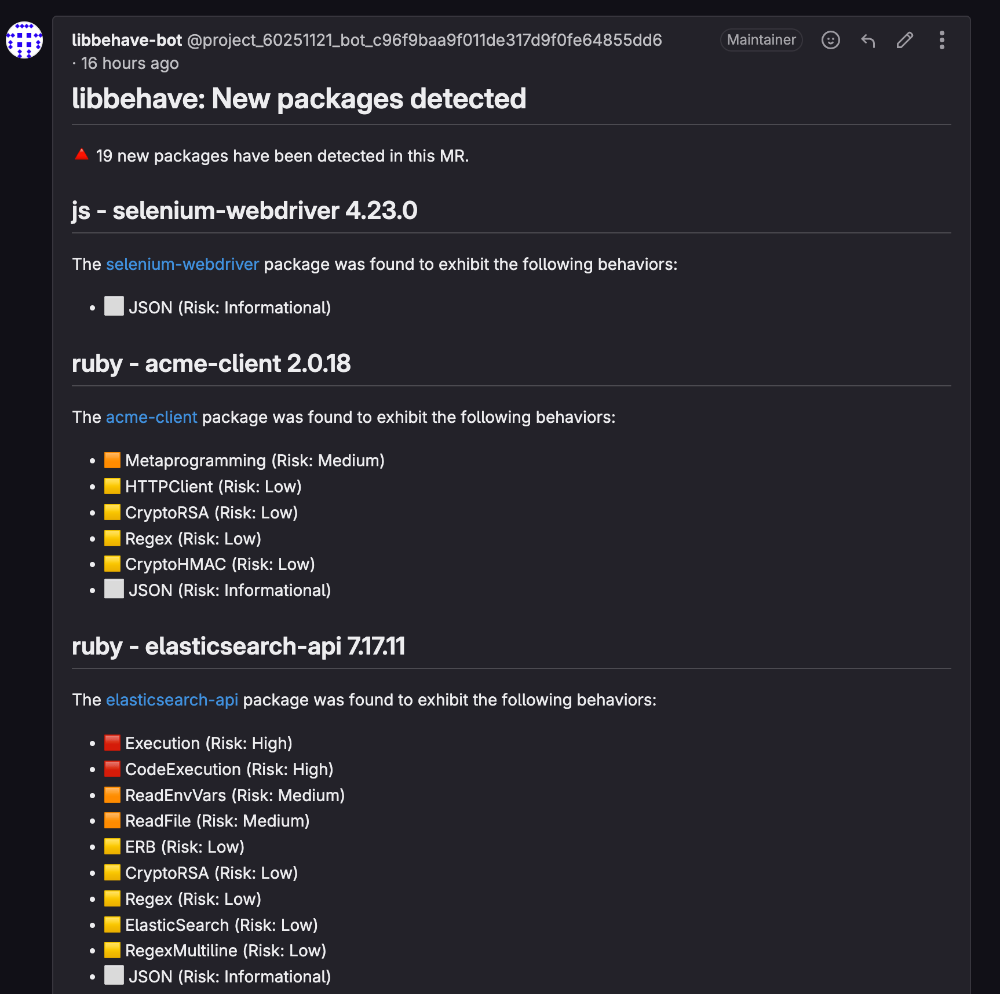
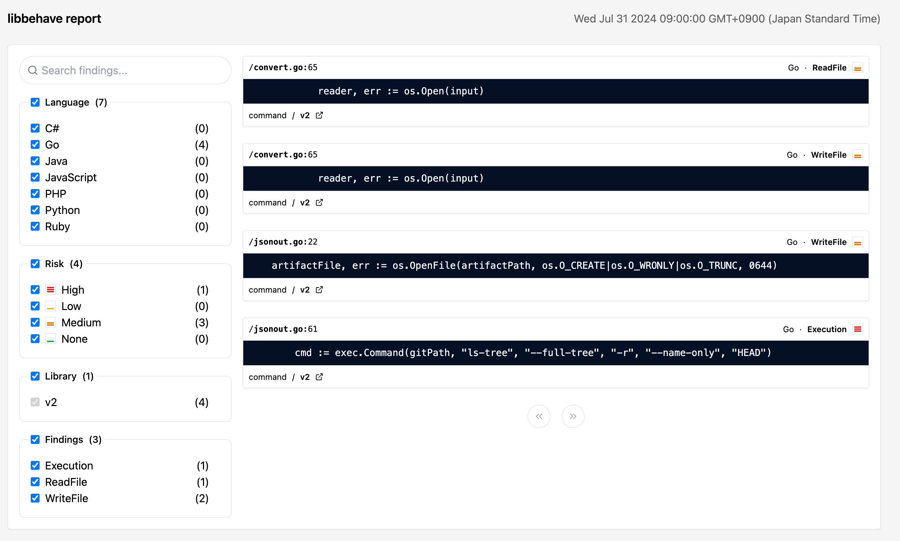



- Tier: 旗舰版
- Offering: JihuLab.com，私有化部署
- Status: 实验性



Libbehave 是一项实验性功能，可在合并请求流水线期间扫描您的依赖项，以识别新添加的库及其潜在的风险行为。传统的依赖项扫描侧重于查找已知漏洞，而 Libbehave 则让您深入了解依赖项所展现的功能和行为。

Libbehave 检测到的每个功能都会分配一个“风险”评分，评分等级如下：

- 信息性：无风险，但可能有助于编录依赖项的功能（例如，使用 JSON）。
- 低：风险较小，可突出显示依赖项正在执行安全敏感操作，例如使用加密。
- 中：中等风险，可用于与文件系统交互或读取可能存储或访问敏感数据的环境变量。
- 高：最高风险，这些行为通常在安全漏洞中被滥用，例如执行操作系统命令或动态评估代码。

Libbehave 可检测的功能包括：

- 执行操作系统命令
- 执行动态代码（eval）
- 读取/写入文件
- 打开网络套接字
- 读取/解压归档文件（ZIP/tar/Gzip）
- 通过 HTTP 客户端、Redis、Elastic Cache、关系型数据库管理系统（RMDB）服务器、SSH、Git 与外部服务交互
- 以各种格式序列化数据：XML、YAML、MessagePack、Protocol Buffers、JSON 以及特定语言的格式
- 模板化
- 流行框架
- 文件上传/下载

有关每种支持的包管理器类型的 Libbehave 演示，请参阅[我们的 Libbehave 演示项目](https://jihulab.com/gitlab-cn/security-products/demos/experiments/libbehave)。

<a id="supported-languages-and-package-managers"></a>

## 支持的语言和包管理器

Libbehave 支持以下语言和包管理器：

- C# ([NuGet](https://www.nuget.org/))
  - 读取 `Directory.Build.props` 文件（如果找到，则替换属性值）
  - 读取 `*.deps.json` 文件
  - 读取 `**/*.dll` 和 `**/*.exe` 文件
- Go
  - 读取 `go.mod` 文件
- Java ([Maven](https://maven.org))
  - 读取 `pom.xml` 文件（如果找到，则替换属性值）
  - 读取 `**/gradle.lockfile*` 文件
- JavaScript/TypeScript ([npmjs](https://npmjs.com))
  - 读取 `**/package-lock.json` 文件
  - 读取 `**/yarn.lock` 文件
  - 读取 `**/pnpm-lock.yaml` 文件
- Python ([pypi](https://pypi.org))
  - 读取 `**/*requirements*.txt` 文件
  - 读取 `**/poetry.lock` 文件
  - 读取 `**/Pipfile.lock` 文件
  - 读取 `**/setup.py` 文件
  - 读取 egg 或 wheel 安装目录中的包：
    - 读取 `**/*dist-info/METADATA`、`**/*egg-info/PKG-INFO`、`**/*DIST-INFO/METADATA` 和 `**/*EGG-INFO/PKG-INFO` 文件
- PHP ([Composer/Packagist](https://packagist.org/))
  - 读取 `**/installed.json` 文件
  - 读取 `**/composer.lock` 文件
  - 读取 `**/php/.registry/.channel.*/*.reg"` 文件
- Ruby ([RubyGems](https://rubygems.org))
  - 读取 `**/Gemfile.lock` 文件
  - 读取 `**/specifications/**/*.gemspec` 文件
  - 读取 `**/*.gemspec` 文件

仅当上述文件在源分支中被修改时，才会分析其中的新依赖项。

<a id="enable-libbehave"></a>

## 启用 Libbehave

先决条件：

- 项目需具有开发者、维护者或所有者角色。
- 流水线属于活跃的[合并请求流水线](../../../ci/pipelines/merge_request_pipelines.md)的一部分，且已定义源 Git 分支和目标 Git 分支。
- 项目包含一种[受支持的语言](#supported-languages-and-package-managers)。
- 项目正在向源分支或功能分支添加新依赖项。

要启用 Libbehave：

1. 在顶部栏中，选择**搜索或跳转到**并找到您的项目。
1. 在左侧边栏中，选择**代码** > **代码仓**。
1. 选择 `.gitlab-ci.yml` 文件。
1. 选择**编辑** > **编辑单个文件**。
1. 添加 Libbehave [CI/CD 组件](../../../ci/components/_index.md)：

   ```yaml
   include:
     - component: $CI_SERVER_FQDN/security-products/experiments/libbehave/libbehave@v0.1.0
       inputs:
         stage: test
   ```

1. 选择**提交更改**。

此配置会在测试阶段创建一个名为 `libbehave-experiment` 的新作业。

<a id="configure-merge-request-comments"></a>

### 配置合并请求评论

要配置 Libbehave 的合并请求评论，需配置一个项目访问令牌。

先决条件：

- 项目需具有维护者或所有者角色。
- 已为项目启用 Libbehave。

要配置合并请求评论：

1. 在顶部栏中，选择**搜索或跳转到**并找到您的项目。
1. 在左侧边栏中，选择**设置** > **访问令牌**。
1. 选择**添加新令牌**并填写以下字段：
   - **令牌名称**：输入名称，例如 `libbehave-bot`。
   - **角色**：选择**访客**。
   - **选择范围**：选中 **API** 复选框。
1. 选择[**创建项目访问令牌**](../../project/settings/project_access_tokens.md)。

   将项目访问令牌复制到剪贴板。下一步需要用到它。
1. 选择**设置** > **CI/CD**。
1. 展开**变量**。
1. 选择**添加变量**并填写以下字段：
   - **键**：输入 `BEHAVE_TOKEN`。
   - **值**：粘贴项目访问令牌。
   - **可见性**：选择**掩码**。
   - **标志**：清除**保护变量**复选框。
1. 选择**添加变量**。

CI/CD 组件会自动使用 `BEHAVE_TOKEN`，因此您无需在组件输入中指定它。

> [!注意]
> 仅当源分支是受保护分支，或者 `BEHAVE_TOKEN` 变量的**保护变量**选项未选中时，合并请求评论才会显示。

<a id="available-cicd-inputs-and-variables"></a>

### 可用的 CI/CD 输入和变量

您可以使用 CI/CD 变量来自定义 Libbehave 的 [CI 组件](https://gitlab.com/security-products/experiments/libbehave)。

以下变量配置了 Libbehave 的运行行为。

| CI/CD 变量                            | CLI 参数       | 默认值   | 描述                                                             |
|---------------------------------------|--------------|---------|------------------------------------------------------------------------|
| `CI_MERGE_REQUEST_SOURCE_BRANCH_NAME` | `-source`    | `""`    | 用于差异比较的源分支（例如，feature-branch）            |
| `CI_MERGE_REQUEST_TARGET_BRANCH_NAME` | `-target`    | `""`    | 用于差异比较的目标分支（例如，main）                      |
| `BEHAVE_TIMEOUT`                      | `-timeout`   | `"30m"` | 分析和下载包所允许的最大时间（例如：30m）   |
| `BEHAVE_TOKEN`                        | `-token`     | `""`    | 可选。访问令牌（创建合并请求评论时需要）    |
| `CI_PROJECT_ID`                       | `-project`   | `""`    | 可选。用于创建包含结果的合并请求注释的项目 ID       |
| `CI_MERGE_REQUEST_IID`                | `-mrid`      | `""`    | 可选。用于创建包含结果的合并请求注释的合并请求 ID |

以下标志可用，但未经测试，应保留其默认值：

| CI/CD 变量              | CLI 参数          | 默认值         | 描述                 |
|------------------------|------------------|---------------|-----------------------------|
| `BEHAVE_RULE_PATHS`    | `-rules`         | `"/dist"`     | 规则文件的路径。 |
| `BEHAVE_TARGET_DIR`    | `-dir`           | `""`          | 运行 behave 的目标目录。 |
| `BEHAVE_NO_GIT_IGNORE` | `-no-git-ignore` | `true`        | 是否扫描 `.gitignore` 中的文件。提供此参数将不扫描它们，默认情况下会扫描。 |
| `BEHAVE_OUTPUT_PATH`   | `-output`        | `"behaveout"` | 存储扫描结果、提取的产物和报告结果的路径。 |
| `BEHAVE_INCLUDE_LANG`  | `-include-lang`  | `""`          | 包含一种语言，可选值：`csharp`、`go`、`java`、`js`、`php`、`python` 或 `ruby`，用 ',' 分隔，排除所有其他未指定的语言。 |
| `BEHAVE_EXCLUDE_LANG`  | `-exclude-lang`  | `""`          | 排除一种语言，可选值：`csharp`、`go`、`java`、`js`、`php`、`python` 或 `ruby`，用 ',' 分隔，包含所有其他未指定的语言。 |
| `BEHAVE_EXCLUDE_FILES` | `-exclude-`      | `""`          | 按正则表达式排除文件或路径，单个正则表达式用 ',' 分隔。 |

由于所有变量均未经过测试，您可能会发现有些变量有效，而另一些无效。如果您需要某个无效的变量，可以[提交功能请求](https://jihulab.com/gitlab-cn/gitlab/-/issues/new?description_template=Feature%20proposal%20-%20detailed&issue[title]=Docs%20feedback%20-%20feature%20proposal:%20Write%20your%20title)或贡献代码以使其可用。

<a id="dependency-detection-and-analysis"></a>

## 依赖检测与分析

Libbehave 分析并报告任何新添加的依赖项的发现结果，并且旨在[合并请求流水线](../../../ci/pipelines/merge_request_pipelines.md)中运行。这意味着，如果您的合并请求不包含任何新依赖项，则 Libbehave 将返回零结果。

检测方式因所使用的语言和包管理器而异。默认情况下，这些受支持的包管理器会解析其相关的包管理器文件，以识别正在添加哪些依赖项。收集此信息后，用于调用相应的包管理器 API 以下载已识别包的产物。

下载后，将提取依赖项，并使用基于 Semgrep 的静态分析方法以及一组配置的检查进行分析。

对于 Java 和 C#，在运行静态分析之前，会额外执行一步反编译二进制产物。

<a id="known-issues"></a>

### 已知问题

每种语言都有其已知问题。

所有包文件（如 `Gemfile.lock` 和 `requirements.txt`）都必须提供明确的版本。不支持版本范围。

<a id="csharp"></a>

#### C\#

- `.props` 或 `.csproj` 文件中的属性或变量替换不考虑嵌套项目文件。它会替换与全局提取的变量集及其值匹配的任何变量。
- 反编译下载的依赖项，因此源代码到行的转换可能不是 1:1。
- Libbehave 会反编译 NuGet 包中存在的所有 .NET 版本。未来可能会对此进行优化。
  - 例如，某些依赖项会将多个 DLL 打包在一个存档中，针对不同的框架版本（例如：net20/Some.dll、net45/Some.dll）。

<a id="java"></a>

#### Java

- 不支持 `pom.xml` 文件的[继承](https://maven.apache.org/pom.html#inheritance)。
- 仅支持 Maven，不支持自定义 JFrog 或其他产物仓库。
- 反编译下载的依赖项，因此源代码到行的转换可能不是 1:1。

<a id="python"></a>

#### Python

- 尝试从 PyPI 下载源码包进行分析。如果没有源码包，Libbehave 会下载第一个可用的 `bdist_wheel` 包，该包可能与目标操作系统不匹配。

<a id="output"></a>

## 输出

Libbehave 生成以下输出：

- **作业摘要**：发现摘要直接输出到 CI/CD 输出作业控制台，以便快速查看依赖项检测到的功能。
- **合并请求评论摘要**：发现摘要以合并请求评论注释的形式输出，便于审查。这需要配置访问令牌，以授予作业写入合并请求注释部分的权限。
- **HTML 产物**：一个 HTML 产物，包含可搜索的库和已识别功能集，以及触发发现的准确代码行。

<a id="job-summary"></a>

### 作业摘要

作业摘要无需额外配置，成功分析后始终会显示。

作业摘要输出示例如下：

```plaintext
# 作业输出 #

[=== libbehave: 检测到新包 ===]
🔺 在此合并请求中检测到 4 个新包。
[= java - open-vulnerability-clients 6.1.7 =]
发现 https://mvnrepository.com/artifact/io.github.jeremylong/open-vulnerability-clients 包表现出以下行为：
    - 🟧 GzipReadArchive（风险：中）
-----------------
[= java - jdiagnostics 1.0.7 =]
发现 https://mvnrepository.com/artifact/org.anarres.jdiagnostics/jdiagnostics 包表现出以下行为：
    - 🟥 CryptoMD5（风险：高）
    - 🟧 WriteFile（风险：中）
    - 🟧 ReadFile（风险：中）
    - 🟧 ReadEnvVars（风险：中）
-----------------
[= java - commons-dbcp2 2.12.0 =]
发现 https://mvnrepository.com/artifact/org.apache.commons/commons-dbcp2 包表现出以下行为：
    - 🟥 JavaObjectSerialization（风险：高）
    - 🟧 Passwords（风险：中）
-----------------
[= java - jmockit 1.49 =]
发现 https://mvnrepository.com/artifact/org.jmockit/jmockit 包表现出以下行为：
    - 🟥 JavaObjectSerialization（风险：高）
    - 🟧 WriteFile（风险：中）
    - 🟧 ReadFile（风险：中）
    - 🟨 CryptoRAND（风险：低）
-----------------
```

<a id="mr-comment-summary"></a>

### 合并请求评论摘要

**合并请求评论摘要**输出需要为已配置 Libbehave 组件的项目创建一个具有访客级别访问权限的访问令牌。然后，应为项目[配置该访问令牌](../../../ci/variables/_index.md#for-a-project)。由于功能分支默认不受保护，请确保清除**保护变量**设置。否则，Libbehave 作业无法读取访问令牌的值。



<a id="html-artifact"></a>

### HTML 产物

HTML 产物将显示在作业产物输出中（`behaveout/gl-libbehave.html`），并可在作业产物下载中访问。



<a id="offline-environment-not-supported"></a>

## 离线环境（不支持）

Libbehave 无法在离线环境中工作，因为它直接从各种包管理器下载依赖项。

<a id="troubleshooting"></a>

## 故障排除

<a id="job-is-not-run"></a>

### 作业未运行

如果 Libbehave 作业未运行，请确保您的项目已配置为运行[合并请求流水线](../../../ci/pipelines/merge_request_pipelines.md)。

<a id="merge-request-comment-is-not-being-added"></a>

### 合并请求评论未添加

这通常是由于未设置 `BEHAVE_TOKEN` 所致。请确保访问令牌具有访客级别访问权限，并且在**设置** > **CI/CD** 变量设置中未选中**保护变量**选项。

<a id="error-401-permission-denied"></a>

#### 错误：`{401 权限被拒绝}`

这通常是由于 `BEHAVE_TOKEN` 未包含正确的值所致。请确保访问令牌具有访客级别访问权限。