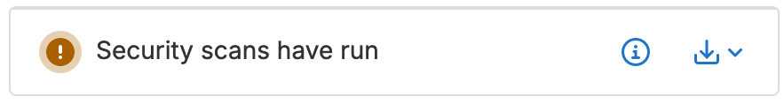
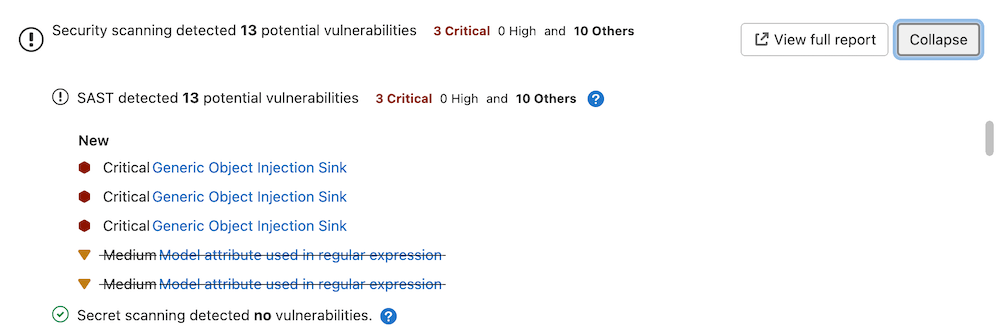

极狐GitLab 提供安全扫描结果给开发人员以及负责分类、分析和修复漏洞的人员。

在功能开发期间，安全扫描结果会显示在流水线和合并请求中。对于 VS Code 用户，[极狐GitLab Workflow extension for VS Code](../../../editor_extensions/visual_studio_code/_index.md) 也显示安全扫描结果。在开发期间识别风险意味着可以主动评估和修复这些风险。

默认分支中的漏洞可以在漏洞报告中查看，从而实现高效的分类、分析和修复。

## 合并请求



1. Tier: 基础版，专业版，旗舰版
1. Offering: JihuLab.com, 私有化部署



所有启用的应用安全工具的输出都会显示在合并请求小部件中。您可以使用这些信息来管理在源分支中识别出的任何议题的风险。

### 所有版本

运行安全扫描的合并请求会让您知道生成的报告可以下载。要下载报告，请选择 **下载结果**，然后选择所需的报告。

安全扫描至少会生成这些 [CI `artifacts:reports` 类型](../../../ci/yaml/artifacts_reports.md) 之一：

- `artifacts:reports:api_fuzzing`
- `artifacts:reports:container_scanning`
- `artifacts:reports:coverage_fuzzing`
- `artifacts:reports:dast`
- `artifacts:reports:dependency_scanning`
- `artifacts:reports:sast`
- `artifacts:reports:secret_detection`

### 旗舰版

合并请求包含一个安全小部件，显示 _新_ 结果的摘要。新结果是通过将合并请求的发现与最近完成的流水线（`success`、`failed`、`canceled` 或 `skipped`）的发现进行比较来确定的，该流水线是从目标分支创建功能分支时的提交。

极狐GitLab 检查从目标分支创建功能分支时的提交的最后 10 个流水线，以找到一个可以用于比较逻辑的安全报告。如果在创建功能分支时，目标分支的最后 10 个完成的流水线没有运行安全扫描，则没有比较基础。合并请求发现中的漏洞在合并请求安全小部件中列为 _新_。我们建议您在为开发人员启用功能分支扫描之前运行 `default`（目标）分支的扫描。

合并请求安全小部件在确定合并请求是否需要批准时，会考虑所有支持的流水线来源（基于 [`CI_PIPELINE_SOURCE` 变量](../../../ci/variables/predefined_variables.md)）。流水线来源 `webide` 和 `parent_pipeline` 不支持。

合并请求安全小部件仅显示生成的 JSON 产物中的漏洞子集，因为它包含了新的和现有的发现。

从合并请求安全小部件中，选择 **展开** 以展开小部件，显示按扫描类型分类的新发现和不再检测到（已移除）的发现。

对于每个安全报告类型，小部件显示前 25 个新增和 25 个修复的发现，按严重性排序。这是通过比较源分支和目标分支流水线的安全报告来确定的。

例如，考虑两个流水线的以下扫描结果：

- 源分支流水线检测到两个漏洞，标识为 `V1` 和 `V2`。
- 目标分支流水线检测到两个漏洞，标识为 `V1` 和 `V3`。
- `V2` 将在合并请求小部件中显示为“新增”。
- `V3` 将在合并请求小部件中显示为“修复”。
- `V1` 在两个分支中都存在，不会显示在合并请求小部件中。

要查看合并请求源分支上的所有发现，请选择 **查看完整报告** 以直接进入最新源分支流水线中的 **安全** 标签。

