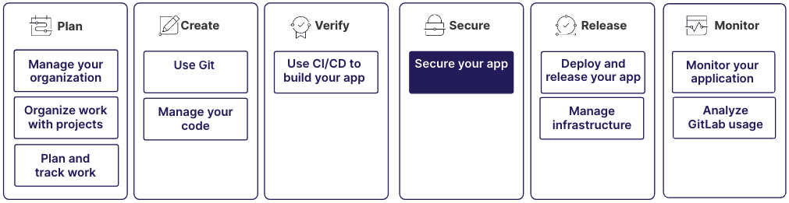

识别并修复应用程序源代码中的漏洞。
通过自动扫描代码中潜在的安全问题，
将安全测试集成到软件开发生命周期中。

您可以扫描多种编程语言和框架，
并检测诸如 SQL 注入、跨站脚本 (XSS) 以及不安全的依赖等漏洞。
安全扫描的结果显示在极狐GitLab UI 中，
您可以在其中审查和处理它们。

这些功能还可以与合并请求和流水线等其他极狐GitLab 功能集成，
确保安全成为整个开发过程中的优先事项。

该过程是一个更大工作流的一部分：

## 第1步：了解扫描

密钥检测扫描您的仓库，以帮助防止密钥被泄露。
它适用于所有编程语言。

依赖扫描分析应用程序的依赖项，查找已知漏洞。
它适用于某些语言和软件包管理器。

更多信息，请参见：

- [密钥检测](secret_detection/_index.md)
- [依赖扫描](dependency_scanning/_index.md)

## 第2步：选择要测试的项目

如果您是首次设置极狐GitLab 安全扫描，建议从单个项目开始。
该项目应该：

- 使用您组织典型的编程语言和技术，
  因为某些扫描功能在不同语言下表现不同。
- 允许您尝试新设置，例如必需审批，而不会中断团队的日常工作。
  您可以创建高流量项目的副本，或选择一个不太繁忙的项目。

## 第3步：启用扫描

为了识别项目中泄露的密钥和易受攻击的软件包，
创建一个启用密钥检测和依赖扫描的合并请求。

该合并请求会更新您的 `.gitlab-ci.yml` 文件，使扫描
作为项目 CI/CD 流水线的一部分运行。

在此 MR 中，您可以更改设置以适应项目的布局或配置。
例如，您可能排除第三方代码的目录。

将此 MR 合并到默认分支后，系统会创建基线扫描。
该扫描识别默认分支上已存在的漏洞。
之后，合并请求将突出显示任何新引入的问题。

如果没有基线扫描，合并请求会显示分支中的所有漏洞，
即使该漏洞在默认分支上已经存在。

更多信息，请参见：

- [启用密钥检测](secret_detection/pipeline/_index.md#getting-started)
- [密钥检测设置](secret_detection/pipeline/configure.md)
- [开启依赖扫描](dependency_scanning/dependency_scanning_sbom/_index.md#turn-on-dependency-scanning)
- [依赖扫描设置](dependency_scanning/dependency_scanning_sbom/_index.md#available-cicd-variables)

## 第4步：审查扫描结果

让您的团队熟悉在合并请求和漏洞报告中查看安全发现。

建立漏洞分类工作流。考虑创建标签和议题板，
以帮助管理由漏洞创建的议题。通过议题板，所有利益相关者
都能看到所有议题的统一视图，并跟踪修复进度。

监控安全仪表板的趋势，以衡量在修复现有漏洞
和防止引入新漏洞方面的成效。

更多信息，请参见：

- [查看漏洞报告](vulnerability_report/_index.md)
- [在合并请求中查看安全发现](detect/security_scanning_results.md)
- [查看安全仪表板](security_dashboard/_index.md)
- [标签](../project/labels.md)
- [议题板](../project/issue_board.md)

## 第5步：安排未来的扫描作业

通过使用扫描执行策略，强制执行定期的安全扫描作业。
这些定期作业独立于您在合规框架流水线或项目的 `.gitlab-ci.yml` 文件中定义的
其他安全扫描运行。

定期扫描对于开发活动较少且流水线扫描不频繁的项目
或重要分支最为有用。

更多信息，请参见：

- [扫描执行策略](policies/scan_execution_policies.md)
- [容器扫描](container_scanning/_index.md)
- [运营容器扫描](../clusters/agent/vulnerabilities.md)

## 第6步：限制新漏洞

要强制执行必需的扫描类型并确保安全与工程之间的职责分离，
请使用扫描执行策略。

要限制新漏洞合并到默认分支，
创建一个合并请求批准策略。

在您熟悉扫描如何工作之后，您可以选择：

- 按照相同步骤在更多项目中启用扫描。
- 一次在更多项目中强制执行扫描。

更多信息，请参见：

- [扫描执行策略](policies/scan_execution_policies.md)
- [合并请求批准策略](policies/_index.md)

## 第7步：持续扫描新漏洞

随着时间的推移，您需要确保不会引入新的漏洞。

- 要发现仓库中已存在的新发现的漏洞，
  请定期运行依赖扫描和容器扫描。
- 要扫描生产集群中容器镜像的安全漏洞，
  启用运营容器扫描。
- 启用其他扫描类型，如 SAST、DAST 或模糊测试。
- 要允许在临时测试环境中进行 DAST 和 Web API 模糊测试，
  考虑启用审查应用。

更多信息，请参见：

- [SAST](sast/_index.md)
- [DAST](dast/_index.md)
- [模糊测试](coverage_fuzzing/_index.md)
- [Web API 模糊测试](api_fuzzing/_index.md)
- [审查应用](../../ci/review_apps/_index.md)