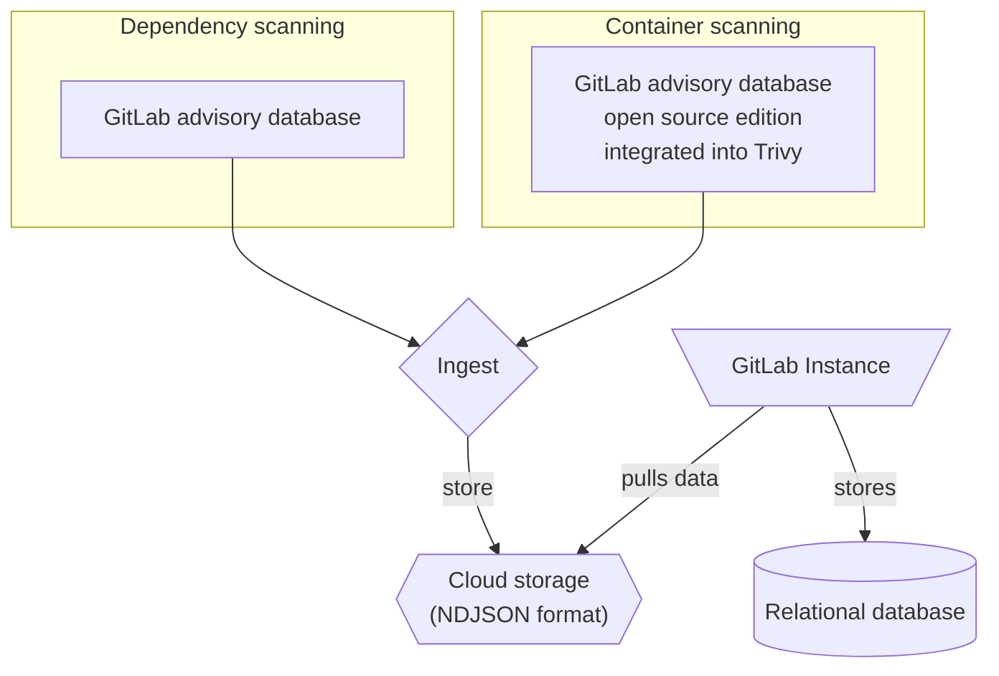

[极狐GitLab 安全公告数据库](https://gitlab.com/gitlab-org/security-products/gemnasium-db)（GLAD）用于存放与软件依赖项相关的安全公告。它每小时更新一次，以获取最新的安全公告。

该数据库是[依赖扫描](../dependency_scanning/_index.md)和[容器扫描](../container_scanning/_index.md)的重要组成部分。

极狐GitLab 安全公告数据库的免费开源版本也可作为[极狐GitLab 安全公告数据库（开源版）](https://gitlab.com/gitlab-org/advisories-community)使用。开源版接收相同的更新，但会有 30 天的延迟。

<a id="gitlab-malware-advisories"></a>

## 极狐GitLab 恶意软件公告



- Tier: 旗舰版
- Offering: JihuLab.com，私有化部署
- Status: 测试版



> [!flag]
> 此功能的可用性由功能标志控制。

极狐GitLab 维护一个私有数据库，其中包含在软件包仓库中发现的已知恶意软件包的公告。
极狐GitLab 恶意软件公告（GLAM）与本页其他部分描述的 GLAD 公告是分开的。
极狐GitLab 会在后台自动将这些公告同步到您的极狐GitLab 实例。

> [!note]
> 在[离线环境](../offline_deployments/_index.md)中，极狐GitLab 无法自动同步这些公告。
> 您需要在[一台可以访问互联网的机器上下载它们](../../../topics/offline/quick_start_guide.md#download-gitlab-malware-advisories)，然后将其复制到实例中。

这些公告被依赖防火墙规则用于在 CI/CD 运行期间阻止恶意软件包。

<a id="standardization"></a>

## 标准化

极狐GitLab 公告使用标准化实践来传达漏洞及其影响。

- [CVE](../terminology/_index.md#cve)
- [CVSS](../terminology/_index.md#cvss)
- [CWE](../terminology/_index.md#cwe)

<a id="explore-the-database"></a>

## 探索数据库

要查看数据库内容，请访问[极狐GitLab 安全公告数据库](https://advisories.gitlab.com)主页。在主页上，您可以：

- 按标识符、软件包名称和描述搜索数据库。
- 查看最近添加的公告。
- 查看统计信息，包括覆盖范围和更新频率。

<a id="search"></a>

### 搜索

每条公告都有一个包含以下详细信息的页面：

- **标识符**：公共标识符。例如，CVE ID、GHSA ID 或极狐GitLab 内部 ID（`GMS-<year>-<nr>`）。
- **软件包标识**：软件包类型和软件包名称，用斜杠分隔。
- **漏洞**：安全缺陷的简短描述。
- **描述**：安全缺陷和潜在风险的详细描述。
- **受影响版本**：受影响的版本。
- **解决方案**：如何修复漏洞。
- **上次修改时间**：公告上次修改的日期。

<a id="graphql-api"></a>

### GraphQL API



- Tier: 旗舰版
- Offering: JihuLab.com，私有化部署
- Status: 实验



> [!flag]
> 此功能的可用性由功能标志控制。
> 此功能可用于测试，但尚未准备好用于生产环境。

使用以下 GraphQL 端点按标识符查找单个或多个公告：

- [`Query.packageMetadataAdvisory` 用于查找单个公告](../../../api/graphql/reference/_index.md#querypackagemetadataadvisory)
- [`Query.packageMetadataAdvisories` 用于查找多个公告](../../../api/graphql/reference/_index.md#querypackagemetadataadvisories)

<a id="examples"></a>

#### 示例

<a id="single-advisory"></a>

##### 单个公告

要按标识符查找单个公告：

```graphql
{
  packageMetadataAdvisory(identifier: "CVE-2026-34598") {
    id,
    title,
    description,
    publishedDate
    identifiers {
      name
      url
    }
  }
}
```

将返回类似以下内容：

```json
{
  "data": {
    "packageMetadataAdvisory": {
      "id": "gid://gitlab/PackageMetadata::Advisory/8295281",
      "title": "YesWiki has Persistent Blind XSS at \"/?BazaR&vue=consulter\"",
      "description": "A stored and blind XSS vulnerability exists in the form title field. A malicious attacker can inject JavaScript without any authentication via a form title that is saved in the backend database. When any user visits that injected page, the JavaScript payload gets executed.\n\nType: Stored and Blind Cross-Site Scripting (XSS)\nAffected Component: form title input field\nAuthentication Required: No (Unauthenticated attack possible)\nImpact: Arbitrary JavaScript execution in victim's browser",
      "publishedDate": "2026-04-01",
      "identifiers": [
        {
          "name": "CVE-2026-34598",
          "url": "https://cve.mitre.org/cgi-bin/cvename.cgi?name=CVE-2026-34598"
        },
        {
          "name": "GHSA-37fq-47qj-6j5j",
          "url": "https://github.com/advisories/GHSA-37fq-47qj-6j5j"
        },
        {
          "name": "CWE-79",
          "url": "https://cwe.mitre.org/data/definitions/79.html"
        },
        {
          "name": "CWE-87",
          "url": "https://cwe.mitre.org/data/definitions/87.html"
        },
        {
          "name": "CWE-937",
          "url": "https://cwe.mitre.org/data/definitions/937.html"
        },
        {
          "name": "CWE-1035",
          "url": "https://cwe.mitre.org/data/definitions/1035.html"
        }
      ]
    }
  },
  "correlationId": "9f10f45bdb871a6e-MEL"
}
```

<a id="multiple-advisories"></a>

##### 多个公告

要按标识符查找多个公告：

```graphql
{
  packageMetadataAdvisories(identifiers: ["CVE-2026-34598", "CVE-2026-34601"]) {
    nodes {
      id
      title
      description
      publishedDate
      identifiers {
        name
        url
      }
    }
  }
}
```

将返回类似以下内容：

```json
{
  "data": {
    "packageMetadataAdvisories": {
      "nodes": [
        {
          "id": "gid://gitlab/PackageMetadata::Advisory/8295281",
          "title": "YesWiki has Persistent Blind XSS at \"/?BazaR&vue=consulter\"",
          "description": "A stored and blind XSS vulnerability exists in the form title field. A malicious attacker can inject JavaScript without any authentication via a form title that is saved in the backend database. When any user visits that injected page, the JavaScript payload gets executed.\n\nType: Stored and Blind Cross-Site Scripting (XSS)\nAffected Component: form title input field\nAuthentication Required: No (Unauthenticated attack possible)\nImpact: Arbitrary JavaScript execution in victim's browser",
          "publishedDate": "2026-04-01",
          "identifiers": [
            {
              "name": "CVE-2026-34598",
              "url": "https://cve.mitre.org/cgi-bin/cvename.cgi?name=CVE-2026-34598"
            },
            {
              "name": "GHSA-37fq-47qj-6j5j",
              "url": "https://github.com/advisories/GHSA-37fq-47qj-6j5j"
            },
            {
              "name": "CWE-79",
              "url": "https://cwe.mitre.org/data/definitions/79.html"
            },
            {
              "name": "CWE-87",
              "url": "https://cwe.mitre.org/data/definitions/87.html"
            },
            {
              "name": "CWE-937",
              "url": "https://cwe.mitre.org/data/definitions/937.html"
            },
            {
              "name": "CWE-1035",
              "url": "https://cwe.mitre.org/data/definitions/1035.html"
            }
          ]
        },
        {
          "id": "gid://gitlab/PackageMetadata::Advisory/8295301",
          "title": "xmldom: XML injection via unsafe CDATA serialization allows attacker-controlled markup insertion",
          "description": "`@xmldom/xmldom` allows attacker-controlled strings containing the CDATA terminator `]]>` to be inserted into a `CDATASection` node. During serialization, `XMLSerializer` emitted the CDATA content verbatim without rejecting or safely splitting the terminator. As a result, data intended to remain text-only became **active XML markup** in the serialized output, enabling XML structure\ninjection and downstream business-logic manipulation.\n\nThe sequence `]]>` is not allowed inside CDATA content and must be rejected or safely handled during serialization. ([MDN Web Docs](https://developer.mozilla.org/))",
          "publishedDate": "2026-04-01",
          "identifiers": [
            {
              "name": "CVE-2026-34601",
              "url": "https://cve.mitre.org/cgi-bin/cvename.cgi?name=CVE-2026-34601"
            },
            {
              "name": "GHSA-wh4c-j3r5-mjhp",
              "url": "https://github.com/advisories/GHSA-wh4c-j3r5-mjhp"
            },
            {
              "name": "CWE-91",
              "url": "https://cwe.mitre.org/data/definitions/91.html"
            },
            {
              "name": "CWE-937",
              "url": "https://cwe.mitre.org/data/definitions/937.html"
            },
            {
              "name": "CWE-1035",
              "url": "https://cwe.mitre.org/data/definitions/1035.html"
            }
          ]
        },
        {
          "id": "gid://gitlab/PackageMetadata::Advisory/8295310",
          "title": "xmldom: XML injection via unsafe CDATA serialization allows attacker-controlled markup insertion",
          "description": "`@xmldom/xmldom` allows attacker-controlled strings containing the CDATA terminator `]]>` to be inserted into a `CDATASection` node. During serialization, `XMLSerializer` emitted the CDATA content verbatim without rejecting or safely splitting the terminator. As a result, data intended to remain text-only became **active XML markup** in the serialized output, enabling XML structure\ninjection and downstream business-logic manipulation.\n\nThe sequence `]]>` is not allowed inside CDATA content and must be rejected or safely handled during serialization. ([MDN Web Docs](https://developer.mozilla.org/))",
          "publishedDate": "2026-04-01",
          "identifiers": [
            {
              "name": "CVE-2026-34601",
              "url": "https://cve.mitre.org/cgi-bin/cvename.cgi?name=CVE-2026-34601"
            },
            {
              "name": "GHSA-wh4c-j3r5-mjhp",
              "url": "https://github.com/advisories/GHSA-wh4c-j3r5-mjhp"
            },
            {
              "name": "CWE-91",
              "url": "https://cwe.mitre.org/data/definitions/91.html"
            },
            {
              "name": "CWE-937",
              "url": "https://cwe.mitre.org/data/definitions/937.html"
            },
            {
              "name": "CWE-1035",
              "url": "https://cwe.mitre.org/data/definitions/1035.html"
            }
          ]
        },
        {
          "id": "gid://gitlab/PackageMetadata::Advisory/9800476",
          "title": "xmldom: xmldom: XML structure injection via CDATA terminator",
          "description": "xmldom is a pure JavaScript W3C standard-based (XML DOM Level 2 Core) `DOMParser` and `XMLSerializer` module. In xmldom versions 0.6.0 and prior and @xmldom/xmldom prior to versions 0.8.12 and 0.9.9, xmldom/xmldom allows attacker-controlled strings containing the CDATA terminator ]]> to be inserted into a CDATASection node. During serialization, XMLSerializer emitted the CDATA content verbatim without rejecting or safely splitting the terminator. As a result, data intended to remain text-only became active XML markup in the serialized output, enabling XML structure injection and downstream business-logic manipulation. This issue has been patched in xmldom version 0.6.0 and @xmldom/xmldom versions 0.8.12 and 0.9.9.",
          "publishedDate": "2026-04-02",
          "identifiers": [
            {
              "name": "CVE-2026-34601",
              "url": "https://cve.mitre.org/cgi-bin/cvename.cgi?name=CVE-2026-34601"
            },
            {
              "name": "CWE-91",
              "url": "https://cwe.mitre.org/data/definitions/91.html"
            }
          ]
        }
      ]
    }
  },
  "correlationId": "9f10f5072e0f1a6e-MEL"
}
```

<a id="open-source-edition"></a>

## 开源版

极狐GitLab 提供该数据库的免费开源版本，即[极狐GitLab 安全公告数据库（开源版）](https://gitlab.com/gitlab-org/advisories-community)。

开源版是极狐GitLab 安全公告数据库的延迟克隆，采用 MIT 许可证，包含极狐GitLab 安全公告数据库中所有超过 30 天或带有 `community-sync` 标志的公告。

<a id="integrations"></a>

## 集成

- [依赖扫描](../dependency_scanning/_index.md)
- [容器扫描](../container_scanning/_index.md)
- 第三方工具

> [!note]
> 极狐GitLab 安全公告数据库条款禁止第三方工具使用极狐GitLab 安全公告数据库中包含的数据。第三方集成商可以使用采用 MIT 许可证、延迟的[代码仓库克隆](https://gitlab.com/gitlab-org/advisories-community)代替。

<a id="how-the-database-can-be-used"></a>

### 数据库的使用方式

以下示例将数据库用作持续漏洞扫描中公告摄取过程的来源。



<a id="maintenance"></a>

## 维护

漏洞研究团队负责极狐GitLab 安全公告数据库和极狐GitLab 安全公告数据库（开源版）的维护和定期更新。

社区贡献可通过 `community-sync` 标志在 [advisories-community](https://gitlab.com/gitlab-org/advisories-community) 中获取。

<a id="contributing-to-the-vulnerability-database"></a>

## 为漏洞数据库做贡献

如果您知道未列出的漏洞，您可以通过创建议题或提交漏洞来为极狐GitLab 安全公告数据库做出贡献。

有关更多信息，请参阅[贡献指南](https://gitlab.com/gitlab-org/security-products/gemnasium-db/-/blob/master/CONTRIBUTING.md)。

<a id="license"></a>

## 许可证

极狐GitLab 安全公告数据库可根据[极狐GitLab 安全公告数据库条款](https://gitlab.com/gitlab-org/security-products/gemnasium-db/-/blob/master/LICENSE.md#gitlab-advisory-database-term)免费访问。
