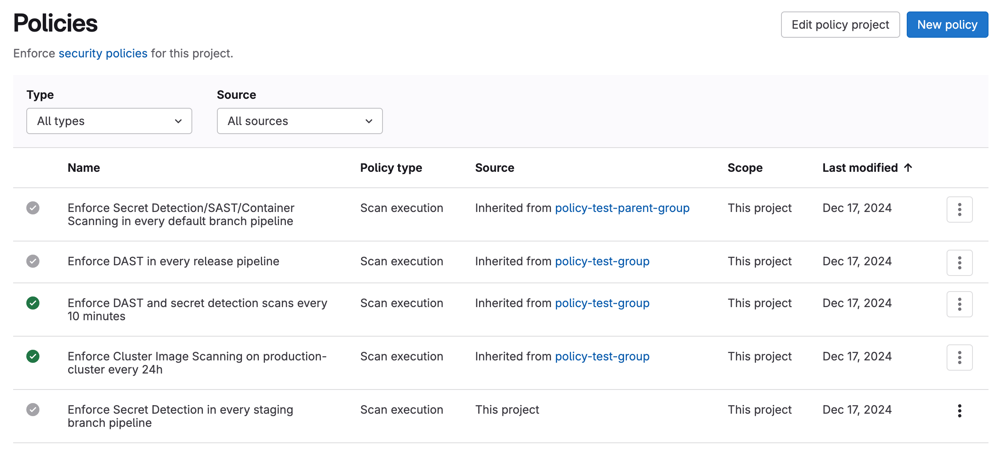



- Tier: 旗舰版
- Offering: JihuLab.com，私有化部署



策略为安全和合规团队提供了一种在组织内全局执行控制的方法。

安全团队可以确保：

- 安全扫描器在开发团队的流水线中以正确的配置强制执行。
- 所有扫描作业均无任何更改或改动地执行。
- 根据扫描结果，在合并请求上提供适当的审批。
- 不再检测到的漏洞会自动解决，从而减少漏洞排查的工作量。

合规团队可以强制执行：

- 所有合并请求上的多个审批人
- 基于组织要求的项目设置，例如启用或锁定合并请求设置或代码仓库设置。

以下策略类型可用：

- [扫描执行策略](scan_execution_policies.md)。强制执行安全扫描，作为流水线的一部分或按指定计划执行。
- [合并请求审批策略](merge_request_approval_policies.md)。根据扫描结果强制执行项目级设置和审批规则。
- [流水线执行策略](pipeline_execution_policies.md)。作为项目流水线的一部分强制执行 CI/CD 作业。
  - [计划流水线执行策略](scheduled_pipeline_execution_policies.md)。跨项目按计划节奏强制执行自定义 CI/CD 作业，与提交活动无关。
- [漏洞管理策略](vulnerability_management_policy.md)。自动解决默认分支中不再检测到的漏洞。

<a id="policy_scope-keyword"></a>

## `policy_scope` 关键字

使用 `policy_scope` 关键字，仅对您指定的群组、项目、合规框架、安全属性或其组合强制执行策略。

要按安全属性限定策略范围，请在安全策略项目的 `.gitlab/security-policies/policy.yml` 文件中启用 `security_attributes_policy_scope` 实验：

```yaml
experiments:
  security_attributes_policy_scope:
    enabled: true
```

您只能按四个内置的安全属性类别来限定策略范围：`business_impact`、`application`、`business_unit` 和 `exposure`。您可以在这些类别中创建自定义属性值，并按这些值限定范围，但不能按自定义类别限定范围。

> [!note]
> `business_impact`、`application`、`business_unit` 和 `exposure` 字段通过 [安全属性](../attributes/_index.md) 限定策略范围。安全属性范围限定适用于扫描执行、合并请求审批、流水线执行和漏洞管理策略。它不适用于依赖防火墙策略。

| 字段                   | 类型     | 可能的值          | 描述 |
|-------------------------|----------|--------------------------|-------------|
| `match_mode` | `string` | `all`, `any` | [引入于](https://gitlab.com/gitlab-org/gitlab/-/issues/569793) 极狐GitLab 18.10。确定策略如何处理多个范围条件。使用 `all`（默认）要求所有条件匹配，或使用 `any` 要求至少一个条件匹配。 |
| `compliance_frameworks` | `array`  | 不适用           | 强制执行范围内合规框架的 ID 列表，以包含键 `id` 的对象数组形式提供。 |
| `projects`              | `object` | `including`, `excluding` | 使用 `excluding:` 或 `including:`，然后以包含键 `id` 的对象数组形式列出您希望包含或排除的项目 ID。您还可以使用 `type: personal` 排除个人项目，或使用 `type: archived` 排除已归档项目。 |
| `groups`                | `object` | `including`, `excluding` | 使用 `excluding:` 或 `including:`，然后以包含键 `id` 的对象数组形式列出您希望包含或排除的群组 ID。策略中只能列出链接到同一安全策略项目的群组。 |
| `business_impact` | `object` | `including`, `excluding` | [引入于](https://gitlab.com/gitlab-org/gitlab/-/merge_requests/227155) 极狐GitLab 18.11，带有名为 `security_attributes_policy_scope` 的功能标志。默认启用。以包含键 `id` 的对象数组形式，列出要包含或排除的业务影响 [安全属性](../attributes/_index.md) 值的 ID。 |
| `application` | `object` | `including`, `excluding` | [引入于](https://gitlab.com/gitlab-org/gitlab/-/merge_requests/227155) 极狐GitLab 18.11，带有名为 `security_attributes_policy_scope` 的功能标志。默认启用。以包含键 `id` 的对象数组形式，列出要包含或排除的应用程序 [安全属性](../attributes/_index.md) 值的 ID。 |
| `business_unit` | `object` | `including`, `excluding` | [引入于](https://gitlab.com/gitlab-org/gitlab/-/merge_requests/227155) 极狐GitLab 18.11，带有名为 `security_attributes_policy_scope` 的功能标志。默认启用。以包含键 `id` 的对象数组形式，列出要包含或排除的业务单元 [安全属性](../attributes/_index.md) 值的 ID。 |
| `exposure` | `object` | `including`, `excluding` | [引入于](https://gitlab.com/gitlab-org/gitlab/-/merge_requests/227155) 极狐GitLab 18.11，带有名为 `security_attributes_policy_scope` 的功能标志。默认启用。以包含键 `id` 的对象数组形式，列出要包含或排除的暴露 [安全属性](../attributes/_index.md) 值的 ID。 |

<a id="empty-collections-in-policy_scope"></a>

### `policy_scope` 中的空集合

当 `policy_scope` 字段设置为空集合（`[]`）时，该字段将被视为完全省略。这意味着该策略适用于所有项目，不受任何限制。

具体来说：

- `projects: { including: [] }` 将该策略应用于所有项目，而不是零个项目。
- `groups: { including: [] }` 将该策略应用于所有群组，而不是零个群组。
- `compliance_frameworks: []` 将该策略应用于所有项目，而不是没有框架的项目。

此行为保持了与现有策略的向后兼容性，这些策略依赖于将空集合视为未提供过滤器。

要防止策略应用于任何项目，请设置 `enabled: false`，而不是使用空集合：

```yaml
policy_scope:
  projects:
    including:
      - id: 123
enabled: false  # Disables the policy entirely
```

<a id="understanding-match_mode"></a>

### 理解 `match_mode`

当您指定多个范围条件（例如，同时指定 `projects` 和 `groups`）时，`match_mode` 字段决定这些条件的组合方式：

- **`all`（默认）**：该策略仅适用于满足所有指定条件的项目。此模式更具限制性，并保持与现有策略的向后兼容性。
- **`any`**：该策略适用于满足任何指定条件的项目。此模式更宽松，当您希望使用单个策略针对不同的项目集时非常有用。

例如，如果您同时指定了包含项目列表和包含群组列表：

- 使用 `match_mode: all`，项目必须位于项目列表中**并且**属于指定的群组之一。
- 使用 `match_mode: any`，如果项目位于项目列表中**或**属于指定的群组之一，则该策略适用。

当您将 `excluding` 和 `including` 条件与 `match_mode: any` 组合使用时，请注意 `excluding` 条件会扩大策略的适用范围。因为 OR 逻辑意味着只要任何条件匹配，策略就适用，所以排除群组条件（匹配除排除群组之外的所有项目）意味着该策略适用于大多数项目，无论 `including` 条件中指定了什么。

例如，一个策略从群组列表中排除 `group-2`，并包含特定项目 `group-1/project-1-1` 和 `group-2/project-2-1`：

 ```yaml
policy_scope:
  match_mode: any
  groups:
    excluding:
      - id: 200  # group-2
  projects:
    including:
      - id: 101  # group-1/project-1-1
      - id: 201  # group-2/project-2-1
```

使用此配置，该策略不仅适用于两个明确包含的项目，还适用于 `group-2` 之外的所有其他项目（例如 `group-1/project-1-2`，它未列在包含项目中）。排除群组条件匹配任何不在 `group-2` 中的项目，并且使用 OR 逻辑，单个匹配就足以使策略适用。

<a id="scope-examples"></a>

### 范围示例

在此示例中，扫描执行策略在每次发布流水线中强制执行 SAST 扫描，适用于所有应用了 ID 为 `2` 或 `11` 的合规框架的项目。

```yaml
---
scan_execution_policy:
- name: Enforce specified scans in every release pipeline
  description: This policy enforces a SAST scan for release branches
  enabled: true
  rules:
  - type: pipeline
    branches:
    - release/*
  actions:
  - scan: sast
  policy_scope:
    compliance_frameworks:
      - id: 2
      - id: 11
```

在此示例中，扫描执行策略在 ID 为 `203` 的群组中的所有项目（包括所有后代子群组及其项目）的默认分支的流水线上强制执行密钥检测和 SAST 扫描，但排除 ID 为 `64` 的项目。

```yaml
- name: Enforce specified scans in every default branch pipeline
  description: This policy enforces secret detection and SAST scans for the default branch
  enabled: true
  rules:
  - type: pipeline
    branches:
    - main
  actions:
  - scan: secret_detection
  - scan: sast
  policy_scope:
    groups:
      including:
        - id: 203
    projects:
      excluding:
        - id: 64
```

在此示例中，扫描执行策略对所有项目强制执行 SAST 扫描，但已归档项目除外。当您有许多不应扫描的已归档项目时，这非常有用。

```yaml
- name: Enforce SAST scan excluding archived projects
  description: This policy enforces SAST scans but excludes archived projects
  enabled: true
  rules:
  - type: pipeline
    branches:
    - main
  actions:
  - scan: sast
  policy_scope:
    projects:
      excluding:
        - type: archived
```

在此示例中，扫描执行策略使用 `match_mode: any` 对特定的高优先级项目或特定群组内的所有项目强制执行密钥检测扫描。如果没有 `match_mode: any`，项目必须位于项目列表中并且位于指定的群组之一中，策略才会适用。

```yaml
- name: Enforce secret detection on priority projects or security groups
  description: This policy enforces secret detection on specific projects or all projects in security-focused groups
  enabled: true
  rules:
  - type: pipeline
    branches:
    - main
  actions:
  - scan: secret_detection
  policy_scope:
    match_mode: any
    projects:
      including:
        - id: 123  # High-priority project outside of security groups
        - id: 456  # Another critical project
    groups:
      including:
        - id: 78   # Security team's group
        - id: 90   # Compliance team's group
```

在此示例中，扫描执行策略在默认分支上强制执行 SAST 扫描，适用于所有具有 ID 为 `5` 的业务影响安全属性值（例如，`Mission Critical`）的项目。随着属性的添加或移除，项目会获得或失去此范围，而无需更改策略。

```yaml
- name: Enforce SAST on mission-critical projects
  description: This policy enforces a SAST scan on projects with a Business Impact security attribute
  enabled: true
  rules:
  - type: pipeline
    branches:
    - main
  actions:
  - scan: sast
  policy_scope:
    business_impact:
      including:
        - id: 5
```

<a id="separation-of-duties"></a>

## 职责分离

职责分离对于成功实施策略至关重要。实施能够满足必要合规和安全要求的策略，同时允许开发团队实现其目标。

安全和合规团队：

- 应负责定义策略，并与开发团队合作，确保策略满足他们的需求。

开发团队：

- 不应能够以任何方式禁用、修改或规避策略。

要在群组、子群组或项目上强制执行安全策略项目，您必须具有以下任一条件：

- 该群组、子群组或项目中的所有者角色。
- 该群组、子群组或项目中具有 `manage_security_policy_link` 权限的自定义角色。

所有者角色和具有 `manage_security_policy_link` 权限的自定义角色遵循跨群组、子群组和项目的标准层级规则：

| 组织单元 | 群组所有者或群组 `manage_security_policy_link` 权限 | 子群组所有者或子群组 `manage_security_policy_link` 权限 | 项目所有者或项目 `manage_security_policy_link` 权限 |
|-------------------|---------------------------------------------------------------|---------------------------------------------------------------------|-------------------------------------------------------------------|
| 群组             |  |   |   |
| 子群组          |  |  |   |
| 项目           |  |  |  |

<a id="required-permissions"></a>

### 所需权限

要创建和管理安全策略：

- 对于在群组上强制执行的策略：您必须具有该群组的维护者或所有者角色。
- 对于在项目上强制执行的策略：
  - 您必须是项目所有者。
  - 您必须是具有在该群组中创建项目权限的群组成员。

> [!note]
> 如果您不是群组成员，您在为项目添加或编辑策略时可能会遇到限制。创建和管理策略的能力需要在该群组中创建项目的权限。即使处理项目级策略，也请确保您拥有该群组中的所需权限。

<a id="policy-recommendations"></a>

## 策略建议

实施策略时，请考虑以下建议。

<a id="branch-names"></a>

### 分支名称

在策略中指定分支名称时，请使用受保护分支的通用类别，例如 **默认分支** 或 **所有受保护分支**，而不是单个分支名称。

仅当指定分支存在于项目中时，策略才会在该项目上强制执行。例如，如果您的策略在 `main` 分支上强制执行规则，但范围内的一些项目使用 `production` 作为其默认分支，则该策略不适用于后者。

<a id="push-rules"></a>

### 推送规则

在极狐GitLab 17.3 及更早版本中，如果您使用推送规则来 [验证分支名称](../../project/repository/push_rules.md#validate-branch-names)，请确保它们允许创建带有 `update-policy-` 前缀的分支。创建或修改安全策略时会使用此分支命名前缀。例如，`update-policy-1659094451`，其中 `1659094451` 是时间戳。如果推送规则阻止创建该分支，则会出现以下错误：

```plaintext
Branch name `update-policy-<timestamp>` does not follow the pattern `<branch_name_regex>`.
```

在极狐GitLab 17.4 及更高版本中，安全策略项目被排除在执行分支名称验证的推送规则之外。

<a id="security-policy-projects"></a>

### 安全策略项目

为防止暴露您希望保持私密的安全策略项目中的敏感信息，在将安全策略项目链接到其他项目时：

- 不要在安全策略项目中包含敏感内容。
- 在链接私有安全策略项目之前，请审查目标项目的成员列表，以确保所有成员都应有权访问您的策略内容。
- 评估目标项目的可见性设置。
- 使用 [安全策略管理](../../compliance/audit_event_types.md#security-policy-management) 审计日志来监控项目链接。

这些建议可防止敏感信息暴露，原因如下：

- 共享可见性：当私有安全项目链接到另一个项目时，有权访问链接项目 **安全策略** 页面的用户可以查看 `.gitlab/security-policies/policy.yml` 文件的内容。这包括将私有安全策略项目链接到公共项目，这可能会将策略内容暴露给任何可以访问公共项目的人。
- 访问控制：私有安全项目所链接项目的所有成员都可以在 **策略** 页面上查看策略文件，即使他们无权访问原始私有代码仓库。

<a id="security-and-compliance-controls"></a>

### 安全和合规控制

项目维护者可以为项目创建策略，这些策略可能会干扰群组策略的执行。为了限制谁可以修改群组策略并确保满足合规要求，在实施关键安全或合规控制时：

- 使用自定义角色来限制谁可以在项目级别创建或修改流水线执行策略。
- 在安全策略项目中为默认分支配置受保护分支，以防止直接推送。
- 在安全策略项目中设置合并请求审批规则，要求指定审批人进行审查。
- 监控并审查群组和项目策略中的所有策略更改。

<a id="policy-management"></a>

## 策略管理

策略页面显示所有可用环境中已部署的策略。您可以查看策略的信息（例如，描述或执行状态），并创建和编辑已部署的策略：

1. 在顶部栏中，选择 **搜索或跳转到** 并找到您的项目。
1. 在左侧边栏中，选择 **安全** > **策略**。



第一列中的绿色复选标记表示该策略已启用，并在其范围内的所有群组和项目上强制执行。灰色复选标记表示该策略当前未启用。

<a id="policy-editor"></a>

## 策略编辑器

策略编辑器有两种模式：

- 规则模式：使用规则块和相关控件构建和预览策略规则。
- YAML 模式：以 YAML 格式输入策略定义。适用于专家用户和规则模式不支持的场景。

您可以随时在规则模式和 YAML 模式之间切换。如果您的 YAML 有错误或不支持的数据，规则模式会自动关闭。请先修复 YAML，然后才能再次使用规则模式。

使用策略编辑器创建、编辑和删除策略：

1. 在顶部栏中，选择 **搜索或跳转到** 并找到您的项目。
1. 在左侧边栏中，选择 **安全** > **策略**。
   - 要创建新策略，请在 **策略** 页面标题中选择 **新建策略**，然后选择策略类型。
   - 要编辑现有策略，请在所选策略抽屉中选择 **编辑策略**。

1. 选择 **通过合并请求配置** 以保存并应用更改。

   策略的 YAML 会被验证，并显示任何由此产生的错误。

1. 审查并合并生成的合并请求。

   如果您是项目所有者，并且没有与此项目关联的安全策略项目，则在创建合并请求时会创建安全策略项目并链接到此项目。

> [!warning]
> 仅当您将合并请求合并到安全策略项目时，极狐GitLab 才会同步策略更改。
> 如果您直接编辑 `policy.yml` 文件（例如，通过 Git 提交、Commits API 或自动化脚本），并在没有合并请求的情况下将更改推送到默认分支，极狐GitLab 不会同步该策略。
> 为确保您的更改生效，请使用策略编辑器，或为对 `policy.yml` 的任何直接编辑打开并合并一个合并请求。

<a id="standard-and-advanced-editor-layouts"></a>

### 标准和高级编辑器布局

策略编辑器有两种布局，决定规则模式和 YAML 模式的呈现方式：

- 标准编辑器：将规则模式和 YAML 模式显示为单独的选项卡。选择一个选项卡以在视图之间切换。在规则模式下，侧边栏中会出现只读的 YAML 预览。
- 高级编辑器：在可调整大小的拆分视图中并排显示规则模式和 YAML 模式。一个面板中的更改会实时反映在另一个面板中。您可以：

  - 拖动分隔线来调整面板大小。
  - 折叠任一面板以专注于一个视图。
  - 要重置面板大小，请双击分隔线。

您偏好的面板大小会在会话之间保存。

要在标准和高级编辑器布局之间切换：

1. 在顶部栏中，选择 **搜索或跳转到** 并找到您的项目。
1. 在左侧边栏中，选择 **安全** > **策略**。
   - 要创建新策略，请在 **策略** 页面标题中选择 **新建策略**，然后选择策略类型。
   - 要编辑现有策略，请在所选策略抽屉中选择 **编辑策略**。

1. 在策略编辑器顶部，选择 **启用高级编辑器** 或 **启用标准编辑器**。

您的偏好会保存到您的用户帐户中，并在会话之间持续存在。

<a id="annotate-ids-in-policyyml"></a>

### 在 `policy.yml` 中注释 ID



Status: 实验



为简化您的 `policy.yml` 文件，极狐GitLab 可以在 ID（如项目 ID、群组 ID、用户 ID 或合规框架 ID）后自动添加注释。这些注释帮助用户识别每个 ID 的含义或来源，使 `policy.yml` 文件更易于理解和维护。

要启用此实验功能，请在安全策略项目的 `.gitlab/security-policies/policy.yml` 文件中的 `experiments` 部分添加一个 `annotate_ids` 部分：

```yaml
experiments:
  annotate_ids:
    enabled: true
```

启用该选项后，使用极狐GitLab [策略编辑器](#policy-editor) 对安全策略进行的任何更改都会在 `policy.yml` 文件中的 ID 旁边创建注释。

> [!note]
> 要应用注释，您必须使用策略编辑器。如果您手动编辑 `policy.yml` 文件（例如，通过 Git 提交），则不会应用注释。

例如：

```yaml
# Example policy.yml with annotated IDs
approval_policy:
- name: Your policy name
  # ... other policy fields ...
  policy_scope:
    projects:
      including:
      - id: 361 # my-group/my-project
  actions:
  - type: require_approval
    approvals_required: 1
    user_approvers_ids:
    - 75 # jane.doe
    group_approvers_ids:
    - 203 # security-approvers
```

> [!note]
> 当您首次应用注释时，极狐GitLab 会为 `policy.yml` 文件中的所有 ID 创建注释，包括您未编辑的策略中的 ID。

<a id="gitlab-security-policy-bot-user"></a>

## 极狐GitLab 安全策略机器人用户

极狐GitLab 安全策略机器人是一个内部用户，负责在您的极狐GitLab 实例中执行安全策略。此机器人对于安全策略和计划流水线的正常运行至关重要。

安全策略机器人负责：

- 计划流水线执行：触发扫描执行策略中定义的、带有 `type: schedule` 规则的流水线。
- 容器扫描自动化：当推送带有 `latest` 标签的镜像时，触发容器扫描作业。
- 策略执行：执行安全策略中定义的安全扫描和合规检查。
- 流水线创建：在强制执行安全策略的项目中创建和管理策略驱动的流水线。

<a id="account-characteristics"></a>

### 帐户特征

安全策略机器人具有以下特征：

- 在每个强制执行安全策略的项目中自动创建。
- 在项目中以访客角色权限运行，并具有特定的附加权限。
- 不计入许可证限制，因为它被标记为内部用户。
- 应用策略时，每个项目都会获得自己的安全策略机器人实例。

<a id="permissions-and-access"></a>

### 权限和访问

安全策略机器人以最小但必要的权限运行：

- 代码仓库访问：对策略执行所需的代码仓库内容具有只读访问权限。
- 流水线创建：能够为策略执行创建和触发流水线。
- CI/CD 变量：根据变量优先级规则访问项目和群组变量。
- 镜像仓库访问：配置了适当凭据后，可以认证到容器镜像仓库。

<a id="limitations-and-restrictions"></a>

### 限制和约束

请注意极狐GitLab 安全策略机器人的以下限制：

- 无法手动删除：您无法在 UI 中删除该机器人。
- 无法修改：您无法手动更改用户设置或权限。
- 项目绑定：每个机器人实例都绑定到特定项目，您不能跨项目共享实例。
- 策略依赖：机器人的功能完全依赖于为项目配置的安全策略。

<a id="security-troubleshooting"></a>

### 安全故障排除

> [!warning]
> 滥用报告漏洞：极狐GitLab 安全策略机器人实例可能会通过滥用报告系统被禁止或删除，这可能会阻止计划流水线运行。管理员应注意：
>
> - 举报安全策略机器人滥用可能导致机器人被禁止或删除。
> - 禁止或删除机器人会导致计划流水线失败。
> - 一旦被禁止，您无法通过标准管理操作恢复机器人。
> - 在机器人恢复之前，安全策略执行将完全中断。
>
> 为防止意外中断安全策略，管理员在处理内部用户帐户的滥用报告时应谨慎行事。

如果您遇到安全策略机器人功能问题：

<a id="scheduled-pipelines-not-running"></a>

#### 计划流水线未运行

如果计划流水线未按配置运行：

- 验证机器人帐户是否存在且未被禁止或删除。
- 检查安全策略配置是否有效。
- 确保机器人在项目中拥有必要的权限。

<a id="policy-jobs-failing"></a>

#### 策略作业失败

如果策略作业失败：

- 验证机器人是否有权访问所需的 CI/CD 变量。
- 检查引用的 CI/CD 配置文件是否存在且可访问。
- 查看流水线日志以获取特定错误消息。

<a id="container-scanning-not-triggering"></a>

#### 容器扫描未触发

如果容器扫描未按配置触发：

- 确认容器扫描策略配置正确。
- 如有必要，验证机器人是否具有镜像仓库认证凭据。
- 检查 `latest` 标签推送是否触发了预期的策略规则。

<a id="bot-account-missing"></a>

#### 机器人帐户缺失

如果机器人帐户不再存在：

- 重新应用或更新安全策略以重新创建机器人帐户。
- 如果机器人因滥用报告被意外禁止或删除，请联系您的极狐GitLab 管理员。

<a id="troubleshooting"></a>

## 故障排除

使用安全策略时，请考虑以下故障排除提示：

- 您不应将安全策略项目同时链接到开发项目以及开发项目所属的群组或子群组。以这种方式链接会导致来自合并请求审批策略的审批规则不应用于开发项目中的合并请求。
- 创建合并请求审批策略时，[`scan_finding` 规则](merge_request_approval_policies.md#scan_finding-rule-type) 中的数组 `severity_levels` 和数组 `vulnerability_states` 都不能为空。要使规则生效，每个数组必须至少有一个条目。
- 项目所有者可以对该项目强制执行策略，前提是他们同时拥有在该群组中创建项目的权限。非群组成员的项目所有者可能在添加或编辑策略时遇到限制。如果您无法管理项目的策略，请联系您的群组管理员，以确保您拥有该群组中的必要权限。
- 对于策略冲突，最近应用的策略优先。

如果您仍然遇到问题，可以 [查看最近报告的缺陷](https://gitlab.com/gitlab-org/gitlab/-/issues/?sort=popularity&state=opened&label_name%5B%5D=group%3A%3Asecurity%20policies&label_name%5B%5D=type%3A%3Abug&first_page_size=20) 并提交新的未报告问题。

<a id="resynchronize-policies-with-the-graphql-api"></a>

### 使用 GraphQL API 重新同步策略

如果您注意到任何策略不一致，例如策略未被执行或审批不正确，您可以使用 GraphQL `resyncSecurityPolicies` 变更手动强制重新同步策略：

```graphql
mutation {
  resyncSecurityPolicies(input: { fullPath: "group-or-project-path" }) {
    errors
  }
}
```

将 `fullPath` 设置为安全策略项目所分配到的项目或群组的路径。

<a id="resynchronize-projects-with-the-graphql-api"></a>

#### 使用 GraphQL API 重新同步项目

如果受影响的项目从群组或子群组继承了策略，您可以仅重新同步该项目：

```graphql
mutation {
  resyncSecurityPolicies(
    input: {
      fullPath: "project-path"
      relationship: INHERITED
    }
  ) {
    errors
  }
}
```

将 `fullPath` 设置为继承策略的项目的路径。使用 `relationship: INHERITED` 重新同步该项目继承的策略，而无需重新同步整个群组或子群组。
