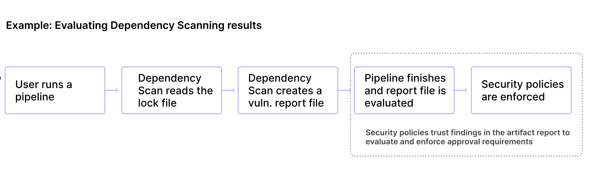



- Tier: 旗舰版
- Offering: JihuLab.com，私有化部署



您可以将合并请求审批策略用于多种目的，包括：

- 检测安全和许可证扫描器的结果以强制执行审批规则。例如，一种合并请求
  策略是安全审批策略，它允许根据一个或多个安全扫描作业的发现来要求审批。合并请求审批策略在 CI 扫描作业完全执行后进行评估，漏洞和许可证类型策略均根据已完成的流水线中发布的作业产物报告进行评估。
- 对所有满足特定条件的合并请求强制执行审批规则。例如，强制要求所有以默认分支为目标的合并请求由多位具有开发者（Developer）和维护者（Maintainer）角色的用户进行评审。
- 在项目上强制执行安全和合规设置。例如，阻止编写或提交了合并请求更改的用户批准该合并请求。或者阻止用户推送到默认分支或强制推送到默认分支，以确保所有更改都通过合并请求进行。

> [!note]
> 当受保护分支被创建或删除时，策略审批规则会同步，延迟 1 分钟。

<a id="restrictions"></a>

## 限制

- 您只能对[受保护的](../../project/repository/branches/protected.md)
  目标分支强制执行合并请求审批策略。
- 每个策略最多可以分配五条规则。
- 每个安全策略项目最多可以分配五个合并请求审批策略。
- 为群组或子群组创建的策略可能需要一些时间才能应用到该群组中的所有合并请求。
  所需时间取决于项目数量以及这些项目中的合并请求数量。通常，所需时间以秒计。根据以往的观察，
  对于拥有数千个项目和合并请求的群组，该过程可能需要几分钟。
- 合并请求审批策略不会检查产物报告中生成的扫描结果的完整性或真实性。
- 合并请求审批策略根据其规则进行评估。默认情况下，如果规则
  无效或无法评估，则要求审批。您可以使用
  [`fallback_behavior` 字段](#fallback_behavior)更改此行为。

<a id="pipeline-requirements"></a>

## 流水线要求

合并请求审批策略根据流水线的结果强制执行。实施合并请求审批策略时，请考虑以下事项：

- 合并请求审批策略评估已完成的流水线作业，忽略手动作业。当
  手动作业运行时，策略会重新评估合并请求的作业。
- 对于评估安全扫描器结果的合并请求审批策略，所有指定的
  扫描器都必须输出安全报告。否则，将强制执行审批，以最大程度降低
  引入漏洞的风险。此行为可能会影响：
  - 尚未建立安全扫描的新项目。
  - 在配置安全扫描之前创建的分支。
  - 分支之间扫描器配置不一致的项目。
- 流水线必须为源分支和目标分支的所有已启用扫描器生成产物。
  否则，就没有比较依据，因此无法可靠地评估策略。
  有关更多信息，请参阅[缺少安全扫描](#missing-security-scans)。
  您应该使用扫描执行策略来强制执行此要求。
- 策略评估取决于成功且已完成的合并基础流水线。如果合并基础
  流水线被跳过，则具有该合并基础流水线的合并请求将被阻止。
- 策略中指定的安全扫描器必须在强制执行该策略的项目中配置并启用。
  否则，无法评估合并请求审批策略，并且需要相应的审批。

<a id="best-practices-for-using-security-scanners-with-merge-request-approval-policies"></a>

## 将安全扫描器与合并请求审批策略结合使用的最佳实践

创建新项目时，您可以在该项目上同时强制执行合并请求审批策略和安全扫描。但是，配置不正确的安全扫描器可能会影响合并请求审批策略。

在新项目中配置安全扫描有多种方式：

- 在项目的 CI/CD 配置中，将扫描器添加到初始`.gitlab-ci.yml`配置文件。
- 在扫描执行策略中，强制执行流水线运行特定的安全扫描器。
- 在流水线执行策略中，控制哪些作业必须在流水线中运行。

对于简单的用例，您可以使用项目的 CI/CD 配置。对于全面的安全策略，请考虑将合并请求审批策略与其他策略类型结合使用。

为了最大程度减少不必要的审批要求并确保准确的安全评估：

- **首先在默认分支上运行安全扫描**：在创建功能分支之前，确保安全扫描已在默认分支上成功运行。
- **使用一致的扫描器配置**：在源分支和目标分支中运行相同的扫描器，最好在单个流水线中运行。
- **验证扫描是否生成产物**：确保扫描成功完成并生成用于比较的产物。
- **保持分支同步**：定期将默认分支的更改合并到功能分支中。
- **考虑流水线配置**：对于新项目，在初始`.gitlab-ci.yml`配置中包含安全扫描器。

<a id="verify-security-scanners-before-you-apply-merge-request-approval-policies"></a>

### 在应用合并请求审批策略之前验证安全扫描器

在应用合并请求审批策略之前，先在新项目中实施安全扫描，这样可以确保安全扫描器在依赖合并请求审批策略之前能够一致地运行，从而有助于避免因缺少安全扫描而导致合并请求被阻止的情况。

要同时创建并验证您的安全扫描器和合并请求审批策略，请使用以下推荐工作流程：

1. 创建项目。
1. 使用`.gitlab-ci.yml`配置、扫描执行策略或流水线执行策略配置安全扫描器。
1. 等待初始流水线在默认分支上完成。解决所有问题并重新运行流水线，确保其成功完成后再继续。
1. 使用配置了相同安全扫描器的功能分支创建合并请求。再次确保安全扫描器成功完成。
1. 应用您的合并请求审批策略。

<a id="merge-request-with-multiple-pipelines"></a>

## 具有多个流水线的合并请求

一个项目可以配置多种流水线类型。一次提交可以启动多个
流水线，每个流水线都可能包含安全扫描。

合并请求的源分支和目标分支中最新提交的所有已完成流水线的结果都会被评估，并用于强制执行合并请求审批策略。
按需 DAST 流水线不在考虑范围内。

如果项目使用[合并请求流水线](../../../ci/pipelines/merge_request_pipelines.md)，您必须将 CI/CD 变量`AST_ENABLE_MR_PIPELINES`设置为`"true"`，安全扫描作业才会出现在流水线中。
有关更多信息，请参阅[将安全扫描工具与合并请求流水线结合使用](../detect/security_configuration.md#use-security-scanning-tools-with-merge-request-pipelines)。

对于最新提交上运行了许多流水线的项目（例如，休眠项目），策略评估最多考虑合并请求的源分支和目标分支中的 1,000 个流水线。

对于父子流水线，策略评估最多考虑 1,000 个子流水线。

<a id="merge-request-approval-policy-editor"></a>

## 合并请求审批策略编辑器

> [!note]
> 只有项目所有者（Owner）拥有[权限](../../permissions.md#project-permissions)
> 来选择安全策略项目。

策略完成后，通过选择编辑器底部的**使用合并请求配置**来保存它。这会将您重定向到项目已配置的安全策略项目上的合并请求。
如果安全策略项目未链接到您的项目，极狐GitLab 会为您创建这样一个项目。
也可以在编辑器界面中通过选择编辑器底部的**删除策略**来删除现有策略。

大多数策略更改在合并请求合并后立即生效。任何未通过合并请求而直接提交到默认分支的更改，可能需要最多 10 分钟才能生效。

[策略编辑器](_index.md#policy-editor)支持 YAML 模式和规则模式。

> [!note]
> 为拥有大量项目的群组创建的合并请求审批策略，其传播需要一段时间才能完成。

<a id="merge-request-approval-policies-schema"></a>

## 合并请求审批策略架构

包含合并请求审批策略的 YAML 文件由一个对象数组组成，这些对象匹配嵌套在`approval_policy`键下的合并请求审批策略架构。您可以在`approval_policy`键下配置最多五个策略。

> [!note]
> 合并请求审批策略过去是在`scan_result_policy`键下定义的。在极狐GitLab 17.0 之前，策略可以
> 在这两个键下定义。从极狐GitLab 17.0 开始，仅支持`approval_policy`键。

当您保存新策略时，极狐GitLab 会根据[此 JSON 架构](https://gitlab.com/gitlab-org/gitlab/-/blob/master/ee/app/validators/json_schemas/security_orchestration_policy.json)验证其内容。
如果您不熟悉如何阅读 [JSON 架构](https://json-schema.org/)，
以下章节和表格提供了替代说明。

| 字段             | 类型                                     | 必填 | 描述                                          |
|-------------------|------------------------------------------|----------|------------------------------------------------------|
| `approval_policy` | `array`，包含合并请求审批策略对象 | true     | 合并请求审批策略列表（最多 5 个）。 |

<a id="merge-request-approval-policy-schema"></a>

## 合并请求审批策略架构

| 字段               | 类型               | 必填 | 可能的值 | 描述                                              |
|---------------------|--------------------|----------|-----------------|----------------------------------------------------------|
| `name`              | `string`           | true     |                 | 策略名称。最多 255 个字符。           |
| `description`       | `string`           | false    |                 | 策略描述。                               |
| `enabled`           | `boolean`          | true     | `true`, `false` | 启用（`true`）或禁用（`false`）策略的标志。 |
| `rules`             | `array`，包含规则   | true     |                 | 策略应用的规则列表。                   |
| `actions`           | `array`，包含操作 | false    |                 | 策略强制执行的操作列表。                |
| `approval_settings` | `object`           | false    |                 | 策略覆盖的项目设置。              |
| `fallback_behavior` | `object`           | false    |                 | 影响无效或无法强制执行规则的设置。     |
| `policy_scope`      | `object`，属于 [`policy_scope`](_index.md#configure-the-policy-scope) | false |  | 根据您指定的项目、群组或合规框架标记定义策略的范围。 |
| `policy_tuning`     | `object`           | false    |                 | （实验性）影响策略比较逻辑的设置。     |
| `bypass_settings`   | `object`           | false    |                 | 影响某些分支、令牌或账号何时可以绕过策略的设置。     |
| `enforcement_type`  | `string`           | false    | `enforce`, `warn` | 定义策略的强制执行方式。默认值（如果未指定）为`enforce`，它会在检测到违规时阻止合并请求。值`warn`允许合并请求继续，但会显示警告和机器人评论。 |

<a id="scan_finding-rule-type"></a>

## `scan_finding` 规则类型

此规则根据安全扫描发现强制执行定义的操作。

| 字段                      | 类型                | 必填                                   | 可能的值                                                                                                    | 描述 |
|----------------------------|---------------------|--------------------------------------------|--------------------------------------------------------------------------------------------------------------------|-------------|
| `type`                     | `string`            | true                                       | `scan_finding`                                                                                                     | 规则的类型。 |
| `branches`                 | `array`，包含`string` | 如果`branch_type`字段不存在则为 true | `[]` 或分支名称                                                                                          | 仅适用于受保护的目标分支。空数组`[]`会将规则应用于所有受保护的目标分支。不能与`branch_type`字段一起使用。 |
| `branch_type`              | `string`            | 如果`branches`字段不存在则为 true    | `default` 或 `protected`                                                                                           | 给定策略适用的受保护分支类型。不能与`branches`字段一起使用。默认分支也必须是`protected`。 |
| `branch_exceptions`        | `array`，包含`string` | false                                      | 分支名称                                                                                                  | 要从此规则中排除的目标分支。 |
| `scanners`                 | `array`，包含`string` 或 [`scanner_with_attributes`](#scanner_with_attributes-object) 对象 | true | `[]` 或 `sast`, `secret_detection`, `dependency_scanning`, `container_scanning`, `dast`, `coverage_fuzzing`, `api_fuzzing` | 此规则要考虑的安全扫描器。`sast` 包括来自 SAST 和 SAST IaC 扫描器的结果。空数组`[]`会将规则应用于所有安全扫描器。可以将扫描器指定为字符串（以应用规则级设置）或对象（为`severity_levels`、`vulnerabilities_allowed`和`vulnerability_attributes`提供按扫描器的覆盖）。 |
| `vulnerabilities_allowed`  | `integer`           | true                                       | 大于或等于零                                                                                      | 在考虑此规则之前允许的漏洞数量。 |
| `severity_levels`          | `array`，包含`string` | true                                       | `info`, `unknown`, `low`, `medium`, `high`, `critical`                                                             | 此规则要考虑的严重级别。 |
| `vulnerability_states`     | `array`，包含`string` | true                                       | `[]` 或 `detected`, `confirmed`, `resolved`, `dismissed`, `new_needs_triage`, `new_dismissed`                      | 所有漏洞分为两类：<br><br>**新检测到的漏洞** - 在合并请求分支本身中识别出，但当前在合并请求的目标分支上不存在的漏洞。此策略选项要求流水线完成后再评估规则，以便知道漏洞是否是新检测到的。在流水线和必要的安全扫描完成之前，合并请求会被阻止。`new_needs_triage`选项考虑状态<br><br> • 已检测（Detected）<br><br> `new_dismissed`选项考虑状态<br><br> • 已忽略（Dismissed）<br><br>**既有漏洞** - 这些策略选项会立即评估，不需要流水线完成，因为它们只考虑之前在默认分支中检测到的漏洞。<br><br> • `Detected` - 策略查找处于已检测状态的漏洞。<br> • `Confirmed` - 策略查找处于已确认状态的漏洞。<br> • `Dismissed` - 策略查找处于已忽略状态的漏洞。<br> • `Resolved` - 策略查找处于已解决状态的漏洞。 <br><br>空数组`[]`涵盖与`['new_needs_triage', 'new_dismissed']`相同的状态。 |
| `vulnerability_attributes` | `object`            | false                                      | [`vulnerability_attributes`](#vulnerability_attributes-object) 对象 | 默认情况下会考虑所有漏洞发现。应用这些过滤器可以只考虑符合特定条件的漏洞发现。有关详细信息，请参阅[`vulnerability_attributes` 对象](#vulnerability_attributes-object)。 |
| `vulnerability_age`        | `object`            | false                                      | 不适用                                                                                                                | 按存在时间筛选既有漏洞发现。漏洞的存在时间按其在项目中被检测到以来的时间计算。条件包括`operator`、`value`和`interval`。<br>- `operator`条件指定使用的时间比较是早于（`greater_than`）还是晚于（`less_than`）。<br>- `value`条件指定表示漏洞存在时间的数值。<br>- `interval`条件指定漏洞存在时间的度量单位：`day`、`week`、`month`或`year`。<br><br>示例：`operator: greater_than`、`value: 30`、`interval: day`。 |

<a id="vulnerability_attributes-object"></a>

### `vulnerability_attributes` 对象

| 字段                        | 类型                 | 必填 | 可能的值                                              | 描述 |
|------------------------------|----------------------|----------|--------------------------------------------------------------|-------------|
| `false_positive`             | `boolean`            | false    | `true`, `false`                                              | 按误报状态筛选。`true`仅包含误报；`false`排除误报。 |
| `fix_available`              | `boolean`            | false    | `true`, `false`                                              | 按修复可用性筛选。`true`仅包含有可用修复的漏洞；`false`仅包含没有可用修复的漏洞。 |
| `known_exploited`            | `boolean` | false    | `true`, `false`                               | 根据 [CISA 已知被利用漏洞（KEV）](https://www.cisa.gov/known-exploited-vulnerabilities-catalog)目录进行筛选。为 true 时，仅包含在野被积极利用的漏洞。为 false 时，不根据已知利用状态筛选漏洞。 |
| `epss_score`                 | `object` | false    | `{operator, value}` 对象                    | 根据[漏洞利用预测评分系统（EPSS）](https://www.first.org/epss/)分数进行筛选。EPSS 估计漏洞被利用的概率（0 到 1）。作为对象：`operator`可以是`greater_than`或`less_than`；`value`是介于`0.0`和`1.0`之间的数字。示例：`{operator: greater_than, value: 0.8}`。  |
| `enrichment_data_unavailable` | `object`             | false    | `{action: "block"}` 或 `{action: "ignore"}`                  | 定义如何处理补充数据不可用的 CVE 漏洞（缺少 EPSS 分数或已知利用状态）。为 'block' 时，没有补充数据的漏洞会根据规则级条件进行评估。为 'ignore' 时，没有补充数据的漏洞会被排除在策略评估之外。 |

<a id="scanner_with_attributes-object"></a>

### `scanner_with_attributes` 对象

> [!flag]
> 此功能的可用性由功能标志控制。

当扫描器被指定为对象而不是字符串时，每种扫描器类型都会根据其自身的条件独立评估。任何未在扫描器级别指定的字段都会回退到规则级值定义的设置。

| 字段                      | 类型                | 必填 | 可能的值                                                                   | 描述 |
|----------------------------|---------------------|----------|-----------------------------------------------------------------------------------|-------------|
| `type`                     | `string`            | true     | `sast`, `secret_detection`, `dependency_scanning`, `container_scanning`, `dast`, `coverage_fuzzing`, `api_fuzzing` | 扫描器类型。 |
| `severity_levels`          | `array`，包含`string` | false    | `info`, `unknown`, `low`, `medium`, `high`, `critical`                            | 为此扫描器覆盖规则级的`severity_levels`。 |
| `vulnerabilities_allowed`  | `integer`           | false    | 大于或等于零                                                     | 为此扫描器覆盖规则级的`vulnerabilities_allowed`。 |
| `vulnerability_attributes` | `object`            | false    | [`vulnerability_attributes`](#vulnerability_attributes-object) 对象              | 为此扫描器覆盖规则级的`vulnerability_attributes`。 |

使用按扫描器条件的示例：

```yaml
rules:
  - type: scan_finding
    branches: []
    scanners:
      - type: dependency_scanning
        vulnerability_attributes:
          fix_available: true
        vulnerabilities_allowed: 0
        severity_levels:
          - critical
          - high
      - type: container_scanning
        vulnerability_attributes:
          known_exploited: true
          epss_score:
             value: 0.5
             operator: greater_than
          enrichment_data_unavailable:
             action: block
        vulnerabilities_allowed: 0
        severity_levels:
          - critical
    vulnerabilities_allowed: 5
    severity_levels:
      - critical
      - high
      - medium
    vulnerability_states:
      - new_needs_triage
```

在此示例中：

- **依赖扫描**：如果检测到任何具有可用修复的严重或高危漏洞，则要求审批。
- **容器扫描**：如果检测到任何严重且已知被利用的漏洞，则要求审批。
- 每个扫描器都会根据其自身的阈值独立评估。规则级的`vulnerabilities_allowed: 5`和`severity_levels`作为任何没有显式覆盖的扫描器的默认值。

<a id="license_finding-rule-type"></a>

## `license_finding` 规则类型

此规则根据许可证发现强制执行定义的操作。

| 字段          | 类型     | 必填                                      | 可能的值              | 描述                                                                                                                                                                                                         |
|----------------|----------|-----------------------------------------------|------------------------------|---------------------------------------------------------------------------------------------------------------------------------------------------------------------------------------------------------------------|
| `type`         | `string` | true                                          | `license_finding`            | 规则的类型。                                                                                                                                                                                                    |
| `branches`     | `array`，包含`string` | 如果`branch_type`字段不存在则为 true    | `[]` 或分支名称    | 仅适用于受保护的目标分支。空数组`[]`会将规则应用于所有受保护的目标分支。不能与`branch_type`字段一起使用。                                                 |
| `branch_type`  | `string` | 如果`branches`字段不存在则为 true       | `default` 或 `protected`     | 给定策略适用的受保护分支类型。不能与`branches`字段一起使用。默认分支也必须是`protected`。                                                                   |
| `branch_exceptions` | `array`，包含`string` | false                                         | 分支名称            | 要从此规则中排除的目标分支。                                                                                                                                                                                 |
| `match_on_inclusion_license` | `boolean` | 如果`licenses`字段不存在则为 true       | `true`, `false`              | 规则是匹配`license_types`中列出的许可证的包含还是排除。                                                                                                                              |
| `license_types` | `array`，包含`string` | 如果`licenses`字段不存在则为 true       | 许可证类型                | 要匹配的 [SPDX 许可证名称](https://spdx.org/licenses/)，例如`Affero General Public License v1.0`或`MIT License`。                                                                                     |
| `license_states` | `array`，包含`string` | true                                          | `newly_detected`, `detected` | 是匹配新检测到的和/或之前检测到的许可证。`newly_detected`状态会在引入新软件包或检测到现有软件包的新许可证时触发审批。 |
| `licenses`     | `object` | 如果`license_types`字段不存在则为 true  | `licenses` 对象            | 要匹配的 [SPDX 许可证名称](https://spdx.org/licenses/)，包括软件包例外。                                                                                                                        |

<a id="licenses-object"></a>

### `licenses` 对象

| 字段     | 类型     | 必填                                | 可能的值                                      | 描述                                                |
|-----------|----------|-----------------------------------------|------------------------------------------------------|------------------------------------------------------------|
| `denied`  | `object` | 如果`allowed`字段不存在则为 true | `array`，包含`licenses_with_package_exclusion` 对象  | 被拒绝的许可证列表，包括软件包例外。  |
| `allowed` | `object` | 如果`denied`字段不存在则为 true  | `array`，包含`licenses_with_package_exclusion` 对象  | 被允许的许可证列表，包括软件包例外。 |

<a id="licenses_with_package_exclusion-object"></a>

### `licenses_with_package_exclusion` 对象

使用`licenses_with_package_exclusion`对象来定义许可证名称和可选的
软件包排除项。

| 字段  | 类型     | 必填 | 可能的值   | 描述                                        |
|--------|----------|----------|-------------------|----------------------------------------------------|
| `name` | `string` | true     | SPDX 许可证名称 | [SPDX 许可证名称](https://spdx.org/licenses/)。    |
| `packages` | `object` | false    | `packages` 对象 | 给定许可证的软件包例外列表。 |

> [!note]
> `name`字段必须是有效的 [SPDX 许可证名称](https://spdx.org/licenses/)。
> 值`unknown`不是受认可的 SPDX 许可证名称，在
> `licenses`字段中不受支持。为`unknown`许可证配置的软件包级排除项在
> 合并请求审批评估期间会被忽略。要管理具有`unknown`
> 许可证的软件包，请使用[`license_types`](#license_finding-rule-type)字段，或者在您的策略中允许
> `unknown`作为许可证。有关更多信息，请参阅
> [许可证审批策略因`unknown`许可证而阻止合并请求](../../compliance/license_approval_policies.md#license-approval-policies-block-merge-requests-due-to-unknown-licenses)。

<a id="packages-object"></a>

### `packages` 对象

使用`packages`对象为许可证条目定义软件包 URL 排除项。

| 字段  | 类型     | 必填 | 可能的值                                       | 描述                                                                                                                                                                                                                                                                                                                                                                                                                                                                                                                                                                                                                                                                                                                                                                                                                                                                                |
|--------|----------|----------|-------------------------------------------------------|--------------------------------------------------------------------------------------------------------------------------------------------------------------------------------------------------------------------------------------------------------------------------------------------------------------------------------------------------------------------------------------------------------------------------------------------------------------------------------------------------------------------------------------------------------------------------------------------------------------------------------------------------------------------------------------------------------------------------------------------------------------------------------------------------------------------------------------------------------------------------------------------|
| `excluding` | `object` | true     | {purls: `array`，包含使用`uri`格式的`strings`} | 给定许可证的软件包例外列表。使用 [`purl`](https://github.com/package-url/purl-spec?tab=readme-ov-file#purl) 组件`scheme:type/name@version`定义软件包例外列表。`scheme:type/name`组件是必需的。`@`和`version`是可选的。如果指定了版本，则只有该版本被视为例外。如果未指定版本，并且在`purl`末尾添加了`@`字符，则只有名称完全匹配的软件包才被视为匹配。如果未在软件包名称后添加`@`字符，则给定许可证下具有相同前缀的所有软件包都是匹配项。例如，purl `pkg:gem/bundler`匹配`bundler`和`bundler-stats`软件包，因为这两个软件包使用相同的许可证。定义`purl` `pkg:gem/bundler@`则只匹配`bundler`软件包。 |

<a id="any_merge_request-rule-type"></a>

## `any_merge_request` 规则类型

此规则根据提交签名对任何合并请求强制执行定义的操作。

| 字段               | 类型                | 必填                                   | 可能的值           | 描述 |
|---------------------|---------------------|--------------------------------------------|---------------------------|-------------|
| `type`              | `string`            | true                                       | `any_merge_request`       | 规则的类型。 |
| `branches`          | `array`，包含`string` | 如果`branch_type`字段不存在则为 true | `[]` 或分支名称 | 仅适用于受保护的目标分支。空数组`[]`会将规则应用于所有受保护的目标分支。不能与`branch_type`字段一起使用。 |
| `branch_type`       | `string`            | 如果`branches`字段不存在则为 true    | `default` 或 `protected`  | 给定策略适用的受保护分支类型。不能与`branches`字段一起使用。默认分支也必须是`protected`。 |
| `branch_exceptions` | `array`，包含`string` | false                                      | 分支名称         | 要从此规则中排除的目标分支。 |
| `commits`           | `string`            | true                                       | `any`, `unsigned`         | 规则是匹配任何提交，还是仅在合并请求中检测到未签名提交时匹配。 |

<a id="require_approval-action-type"></a>

## `require_approval` 操作类型

当定义策略中至少一条规则的条件满足时，此操作会使审批规则成为必需。

如果您在同一个`require_approval`块中指定多个审批人，则任何符合条件的审批人都可以满足审批要求。例如，如果您指定两个`group_approvers`并将`approvals_required`设置为`2`，则两个审批都可以来自同一个群组。要要求来自不同审批人类型的多个审批，请使用多个`require_approval`操作。

| 字段 | 类型 | 必填 | 可能的值 | 描述 |
|-------|------|----------|-----------------|-------------|
| `type` | `string` | true | `require_approval` | 操作的类型。 |
| `approvals_required` | `integer` | true | 大于或等于零 | 所需的合并请求审批数量。 |
| `user_approvers` | `array`，包含`string` | 有条件 | 一个或多个用户的用户名 | 要考虑作为审批人的用户。用户必须有权访问项目才有资格审批。 |
| `user_approvers_ids` | `array`，包含`integer` | 有条件 <sup>1</sup> | 一个或多个用户的 ID | 要考虑作为审批人的用户 ID。用户必须有权访问项目才有资格审批。 |
| `group_approvers` | `array`，包含`string` | 有条件 <sup>1</sup> | 一个或多个群组的路径 | 要考虑作为审批人的群组。在群组中具有[直接成员资格](../../project/merge_requests/approvals/rules.md#group-approvers)的用户有资格审批。 |
| `group_approvers_ids` | `array`，包含`integer` | 有条件 <sup>1</sup> | 一个或多个群组的 ID | 要考虑作为审批人的群组 ID。在群组中具有[直接成员资格](../../project/merge_requests/approvals/rules.md#group-approvers)的用户有资格审批。 |
| `role_approvers` | `array`，包含`string` | 有条件 <sup>1</sup> | 一个或多个[角色](../../permissions.md#roles)（例如：`owner`、`maintainer`）。如果自定义角色具有批准合并请求的权限，您也可以将自定义角色（或 YAML 模式下的自定义角色标识符）指定为`role_approvers`。自定义角色可以与用户和群组审批人一起选择。 | 有资格审批的角色。只有具有您指定的确切角色的用户，或具有基于该角色的自定义角色的用户，才能审批。具有更高权限的角色不能审批。例如，如果您选择`developer`，则具有开发者（Developer）角色的用户可以审批。如果存在基于`developer`的自定义角色，则具有该自定义角色的用户也可以审批。维护者（Maintainer）和所有者（Owner）不能审批，除非您也添加他们。 |

**脚注：**

1. 您必须使用审批人字段（`user_approvers`、`user_approvers_ids`、`group_approvers`、`group_approvers_ids`或`role_approvers`）指定至少一个审批人。

<a id="valid-configuration-examples"></a>

### 有效配置示例

**有效的`user_approvers`：**

```yaml
actions:
  - type: require_approval
    approvals_required: 2
    user_approvers:
      - alice
      - bob
```

**有效的`group_approvers`：**

```yaml
actions:
  - type: require_approval
    approvals_required: 1
    group_approvers:
      - security-team
```

**有效的`role_approvers`：**

```yaml
actions:
  - type: require_approval
    approvals_required: 1
    role_approvers:
      - maintainer
```

**具有多种审批人类型的有效配置：**

```yaml
actions:
  - type: require_approval
    approvals_required: 2
    user_approvers:
      - alice
    group_approvers:
      - security-team
    role_approvers:
      - maintainer
```

<a id="invalid-configuration-example"></a>

### 无效配置示例

**由于未指定审批人而无效：**

```yaml
actions:
  - type: require_approval
    approvals_required: 2
    # ERROR: At least one approver field must be specified
    # This configuration will fail validation
```

<a id="send_bot_message-action-type"></a>

## `send_bot_message` 操作类型

此操作支持在检测到策略违规时配置合并请求中的机器人消息。
如果未指定此操作，则默认启用机器人消息。如果定义了多个策略，
只要其中至少一个策略启用了`send_bot_message`操作，就会发送机器人消息。

| 字段 | 类型 | 必填 | 可能的值 | 描述 |
|-------|------|----------|-----------------|-------------|
| `type` | `string` | true | `send_bot_message` | 操作的类型。 |
| `enabled` | `boolean` | true | `true`, `false` | 检测到策略违规时是否应创建机器人消息。默认值：`true` |

<a id="example-bot-messages"></a>

### 机器人消息示例


<a id="warn-mode"></a>

## 警告模式

> [!flag]
> 此功能的可用性由功能标志控制。

警告模式允许安全团队在应用完全强制执行之前测试和验证安全策略的影响，从而在应用新安全策略时减少开发人员的摩擦。当策略配置为`enforcement_type: warn`时，合并请求会提供绕过任何合并请求审批策略违规的选项。

当启用警告模式（`enforcement_type: warn`）并且合并请求触发安全策略违规时，策略强制执行在几个方面有所不同：

- 非阻塞验证：策略会生成信息性机器人评论，列出策略违规。
- 可选审批：如果用户绕过策略并提供忽略原因，则审批是可选的。
- 增强审计：在合并请求在绕过安全策略的情况下合并后，会创建审计事件。
  审计事件会记录发生了绕过，但不包含绕过评论或忽略原因。
- 漏洞报告集成：如果漏洞是由绕过策略的合并请求引入的，则绕过详情会显示在漏洞报告中。
- 依赖项列表集成：如果绕过策略的合并请求引入了许可证，则依赖项列表会在该许可证旁边显示策略违规徽章。策略违规徽章仅适用于项目的依赖项列表。
- 禁用审批设置：审批设置覆盖不会被强制执行。

<a id="configuring-warn-mode"></a>

### 配置警告模式

要为合并请求审批策略启用警告模式，请将`enforcement_type`字段设置为`warn`：

```yaml
approval_policy:
  - name: Warn mode policy
    description: ''
    enabled: true
    enforcement_type: warn
    policy_scope:
      projects:
        excluding: []
    rules:
      - type: scan_finding
        scanners:
          - secret_detection
        vulnerabilities_allowed: 0
        severity_levels: []
        vulnerability_states: []
        branch_type: protected
    actions:
      - type: require_approval
        approvals_required: 1
        role_approvers:
          - developer
          - maintainer
      - type: send_bot_message
        enabled: true
```

<a id="approval_settings"></a>

## `approval_settings`

策略中设置的设置会覆盖项目中的设置。

| 字段                               | 类型                  | 必填 | 可能的值                                               | 适用的规则类型 | 描述 |
|-------------------------------------|-----------------------|----------|---------------------------------------------------------------|----------------------|-------------|
| `block_branch_modification`         | `boolean`             | false    | `true`, `false`                                               | 全部                  | 启用后，如果分支包含在安全策略中，则阻止用户从受保护分支列表中移除分支、删除受保护分支或更改默认分支。这确保用户无法移除分支的保护状态来合并有漏洞的代码。根据`branches`、`branch_type`和`policy_scope`强制执行，与是否检测到漏洞无关。 |
| `block_group_branch_modification`   | `boolean` 或 `object` | false    | `true`, `false`, `{ enabled: boolean, exceptions: [{ id: Integer}] }` | 全部                  | 启用后，阻止用户在策略适用的每个群组上移除群组级受保护分支。如果`block_branch_modification`为`true`，则隐式默认为`true`。将支持[群组级受保护分支](../../project/repository/branches/protected.md#in-a-group)的顶级群组添加为`exceptions` |
| `prevent_approval_by_author`        | `boolean`             | false    | `true`, `false`                                               | `Any merge request`  | 启用后，合并请求作者不能批准自己的合并请求。这确保代码作者不能引入漏洞并批准代码合并。 |
| `prevent_approval_by_commit_author` | `boolean`             | false    | `true`, `false`                                               | `Any merge request`  | 启用后，为合并请求贡献了代码的用户没有资格审批。这确保代码提交者不能引入漏洞并批准代码合并。 |
| `remove_approvals_with_new_commit`  | `boolean`             | false    | `true`, `false`                                               | `Any merge request`  | 启用后，如果合并请求获得了合并所需的所有审批，但随后添加了新提交，则需要新的审批。这确保无法引入可能包含漏洞的新提交。 |
| `require_password_to_approve`       | `boolean`             | false    | `true`, `false`                                               | `Any merge request`  | 启用后，审批人在审批前必须再次进行身份验证。审批人可以根据其配置的身份验证方法使用密码或 SAML 重新进行身份验证。这增加了一层额外的安全性，以确保审批人的身份。有关更多信息，请参阅[要求用户重新进行身份验证才能审批](../../project/merge_requests/approvals/settings.md#require-user-re-authentication-to-approve)。 |
| `prevent_pushing_and_force_pushing` | `boolean`             | false    | `true`, `false`                                               | 全部                  | 启用后，如果受保护分支包含在安全策略中，则阻止用户推送到该分支以及强制推送到该分支。这确保用户不会绕过合并请求流程将有漏洞的代码添加到分支。尚不存在的分支的创建受标准[受保护分支](../../project/repository/branches/protected.md)规则约束；此设置适用于分支存在后的后续推送和强制推送。 |

<a id="enforcement-scope-of-approval-settings"></a>

### 审批设置的强制执行范围

这些设置仅对存在策略违规的合并请求强制执行：

- `prevent_approval_by_author`
- `prevent_approval_by_commit_author`
- `remove_approvals_with_new_commit`
- `require_password_to_approve`

如果合并请求没有策略违规，则这些设置对该
合并请求没有影响。

如果策略处于活动状态，则无论合并请求是否存在
策略违规，以下设置始终强制执行：

- `block_branch_modification`
- `block_group_branch_modification`
- `prevent_pushing_and_force_pushing` 设置

<a id="fallback_behavior"></a>

## `fallback_behavior`

| 字段  | 类型     | 必填 | 可能的值    | 描述                                                                                                          |
|--------|----------|----------|--------------------|----------------------------------------------------------------------------------------------------------------------|
| `fail` | `string` | false    | `open` 或 `closed` | `closed`（默认）：策略的无效或无法强制执行的规则要求审批。`open`：策略的无效或无法强制执行的规则不要求审批。 |

<a id="policy_tuning"></a>

## `policy_tuning`

<a id="unblock_rules_using_execution_policies"></a>

### `unblock_rules_using_execution_policies`

| 字段  | 类型     | 必填 | 可能的值    | 描述                                                                                                          |
|--------|----------|----------|--------------------|----------------------------------------------------------------------------------------------------------------------|
| `unblock_rules_using_execution_policies` | `boolean` | false    | `true`, `false` | 启用后，当扫描执行策略或流水线执行策略要求进行扫描，但源分支缺少所需的扫描产物时，审批规则不会阻止合并请求。此选项仅在项目或群组具有匹配扫描器的现有扫描执行策略或流水线执行策略时有效。 |

您只能排除[许可证发现规则](#license_finding-rule-type)，前提是它们仅针对新检测到的状态（`license_states`设置为`newly_detected`）。

<a id="examples"></a>

#### 示例

<a id="example-of-policy_tuning-with-a-scan-execution-policy"></a>

##### 带有扫描执行策略的`policy_tuning`示例

您可以在存储在
[安全策略项目](enforcement/security_policy_projects.md)中的`.gitlab/security-policies/policy.yml`文件中使用此示例：

```yaml
scan_execution_policy:
- name: Enforce dependency scanning
  description: ''
  enabled: true
  policy_scope:
    projects:
      excluding: []
  rules:
  - type: pipeline
    branch_type: all
  actions:
  - scan: dependency_scanning
approval_policy:
- name: Dependency scanning approvals
  description: ''
  enabled: true
  policy_scope:
    projects:
      excluding: []
  rules:
  - type: scan_finding
    scanners:
    - dependency_scanning
    vulnerabilities_allowed: 0
    severity_levels: []
    vulnerability_states: []
    branch_type: protected
  actions:
  - type: require_approval
    approvals_required: 1
    role_approvers:
    - developer
  - type: send_bot_message
    enabled: true
  fallback_behavior:
    fail: closed
  policy_tuning:
    unblock_rules_using_execution_policies: true
```

<a id="example-of-policy_tuning-with-a-pipeline-execution-policy"></a>

##### 带有流水线执行策略的`policy_tuning`示例

> [!warning]
> 此功能不适用于极狐GitLab 17.10 之前创建的流水线执行策略。
> 要将此功能用于较旧的流水线执行策略，请复制、删除并重新创建这些策略。
> 有关更多信息，请参阅[重新创建极狐GitLab 17.10 之前创建的流水线执行策略](#recreate-pipeline-execution-policies-created-before-gitlab-1710)。

您可以在存储在
[安全策略项目](enforcement/security_policy_projects.md)中的`.gitlab/security-policies/policy.yml`文件中使用此示例：

```yaml
---
pipeline_execution_policy:
- name: Enforce dependency scanning
  description: ''
  enabled: true
  pipeline_config_strategy: inject_policy
  content:
    include:
    - project: my-group/pipeline-execution-ci-project
      file: policy-ci.yml
      ref: main # optional
```

`policy-ci.yml`中链接的流水线执行策略 CI/CD 配置：

```yaml
include:
  - template: Jobs/Dependency-Scanning.gitlab-ci.yml
```

<a id="recreate-pipeline-execution-policies-created-before-gitlab-1710"></a>

###### 重新创建极狐GitLab 17.10 之前创建的流水线执行策略

极狐GitLab 17.10 之前创建的流水线执行策略不包含使用
`policy_tuning`功能所需的数据。要将此功能用于较旧的流水线执行策略，
请复制并删除旧策略，然后重新创建它们。

<!-- Video published on 2025-03-07 -->

要重新创建流水线执行策略：

<!-- markdownlint-disable MD044 -->

1. 在顶部栏中，选择**搜索或跳转到**并找到您的群组。
1. 在左侧边栏中，选择**安全** > **策略**。
1. 选择要重新创建的流水线执行策略。
1. 在右侧边栏中，选择 **YAML** 选项卡并复制整个策略文件的内容。
1. 在策略表旁边，选择垂直省略号（），然后选择**删除**。
1. 合并生成的合并请求。
1. 返回**安全** > **策略**并选择**新建策略**。
1. 在**流水线执行策略**部分，选择**选择策略**。
1. 在 **.yaml 模式**下，粘贴旧策略的内容。
1. 选择**通过合并请求更新**并合并生成的合并请求。

<!-- markdownlint-enable MD044 -->

<a id="security_report_time_window"></a>

### `security_report_time_window`

在繁忙的项目中，最新的流水线可能无法立即提供已完成的安全扫描，这会阻止安全报告比较。使用`security_report_time_window`设置来改用最近完成的流水线中的安全报告。安全报告不能早于时间窗口，该时间窗口以分钟为单位指定，从目标分支流水线创建之前算起。如果所选流水线已有已完成的安全报告，则此设置不适用。

| 字段  | 类型     | 必填 | 可能的值    | 描述                                                                                                          |
|--------|----------|----------|--------------------|----------------------------------------------------------------------------------------------------------------------|
| `security_report_time_window` | `integer` | false    | 1 到 10080（7 天） | 指定为安全报告比较选择目标流水线的时间窗口（以分钟为单位）。 |

<a id="policy-scope-schema"></a>

## 策略范围架构

要自定义策略强制执行，您可以定义策略的范围，以包含或排除
指定的项目、群组或合规框架标记。有关更多详细信息，请参阅
[范围](_index.md#configure-the-policy-scope)。

> [!note]
> 将`policy_scope`字段设置为空集合（例如，`including: []`）与
> 省略该字段的处理方式相同，因此策略适用于该范围维度的所有项目。
> 要完全禁用策略，请使用`enabled: false`。有关更多详细信息，请参阅
> [`policy_scope`中的空集合](_index.md#empty-collections-in-policy_scope)。

<a id="bypass_settings"></a>

## `bypass_settings`

`bypass_settings`字段允许您为某些分支、访问令牌或服务账号指定策略例外。当满足绕过条件时，不会对匹配的合并请求或分支强制执行策略。

| 字段             | 类型    | 必填 | 描述                                                                     |
|-------------------|---------|----------|---------------------------------------------------------------------------------|
| `branches`        | array   | false    | 绕过策略的源分支和目标分支列表（按名称或模式）。 |
| `access_tokens`   | array   | false    | 绕过策略的访问令牌 ID 列表。                                |
| `service_accounts` | array   | false    | 绕过策略的服务账号 ID 列表。                             |
| `users`           | array   | false    | 可以绕过策略的用户 ID 列表。                                        |
| `groups`          | array   | false    | 可以绕过策略的群组 ID 列表。                                       |
| `roles`           | array   | false    | 可以绕过策略的默认角色列表。                                   |
| `custom_roles`    | array   | false    | 可以绕过策略的自定义角色 ID 列表。                                 |

<a id="source-branch-exceptions"></a>

### 源分支例外

通过基于分支的例外，您可以配置合并请求审批策略，以自动免除特定源分支和目标分支组合的审批要求。这使您能够为某些类型的合并（例如功能分支到主分支）保留安全治理并维持严格的审批规则，同时为其他类型的合并（例如发布分支到主分支）提供更大的灵活性。绕过事件会作为审计事件记录在安全策略项目中。

| 字段   | 类型   | 必填 | 可能的值 | 描述 |
|---------|--------|----------|-----------------|-------------|
| `source` | object | false    | `name`（字符串）或`pattern`（字符串） | 源分支例外。指定确切的名称或模式。         |
| `target` | object | false    | `name`（字符串）或`pattern`（字符串） | 目标分支例外。指定确切的名称或模式。         |

<a id="access-token-and-service-account-exceptions"></a>

### 访问令牌和服务账号例外

通过访问令牌和服务账号例外，您可以指定特定的服务账号和访问令牌，使其在必要时能够绕过合并请求审批策略强制执行的分支保护。这种方法使您信任的自动化能够在无需手动审批的情况下运行，同时保持对人工用户的限制。例如，受信任的自动化可能包括 CI/CD 流水线、代码仓库镜像和自动更新。绕过事件会作为审计事件记录在安全策略项目中。

| 字段 | 类型    | 必填 | 描述                                    |
|-------|---------|----------|------------------------------------------------|
| `id`  | integer | true     | 访问令牌或服务账号的 ID。 |

<a id="allowing-users-to-bypass-security-policies"></a>

### 允许用户绕过安全策略

您可以通过指定可以绕过合并请求审批策略的特定用户、群组、角色或自定义角色，为紧急情况做好准备。此功能为紧急响应提供了灵活性，同时保持治理控制。要允许用户、群组、角色或自定义角色绕过安全策略，您可以授予他们例外。绕过事件会作为审计事件记录在安全策略项目中。

拥有这些例外的用户可以在两个级别绕过：

- 合并请求审批要求：用户可以通过合并请求 UI 提供原因来绕过审批要求。
- 分支保护：用户可以通过在 [`security_policy.bypass_reason` Git 推送选项](../../../topics/git/commit.md#push-options-for-security-policy)中提供原因，直接推送到具有来自合并请求审批策略的推送保护的分支。

> [!note]
> `security_policy.bypass_reason`推送选项仅适用于具有来自配置了[`approval_settings`](#approval_settings)的合并请求审批策略的推送保护的分支。推送到未被合并请求审批策略覆盖的受保护分支时，无法使用此选项绕过。

<a id="example-yaml"></a>

#### YAML 示例

```yaml
bypass_settings:
  access_tokens:
    - id: 123
    - id: 456
  service_accounts:
    - id: 789
    - id: 1011
  users:
    - id: 123
    - id: 456
  groups:
    - id: 789
    - id: 1011
  roles:
    - maintainer
    - developer
  custom_roles:
    - id: 789
    - id: 1011
```

<a id="example-policyyml-in-a-security-policy-project"></a>

## 安全策略项目中的`policy.yml`示例

您可以在存储在
[安全策略项目](enforcement/security_policy_projects.md)中的`.gitlab/security-policies/policy.yml`文件中使用此示例：

```yaml
---
approval_policy:
- name: critical vulnerability CS approvals
  description: critical severity level only for container scanning
  enabled: true
  rules:
  - type: scan_finding
    branches:
    - main
    scanners:
    - container_scanning
    vulnerabilities_allowed: 0
    severity_levels:
    - critical
    vulnerability_states: []
    vulnerability_attributes:
      false_positive: true
      fix_available: true
  actions:
  - type: require_approval
    approvals_required: 1
    user_approvers:
    - adalberto.dare
- name: secondary CS approvals
  description: secondary only for container scanning
  enabled: true
  rules:
  - type: scan_finding
    branches:
    - main
    scanners:
    - container_scanning
    vulnerabilities_allowed: 1
    severity_levels:
    - low
    - unknown
    vulnerability_states:
    - detected
    vulnerability_age:
      operator: greater_than
      value: 30
      interval: day
  actions:
  - type: require_approval
    approvals_required: 1
    role_approvers:
    - owner
    - 1002816 # Example custom role identifier called "AppSec Engineer"
- name: critical vulnerability CS approvals
  description: high/critical severity level only for SAST scanning
  enabled: true
  enforcement_type: warn
  rules:
  - type: scan_finding
    branch_type: default
    scanners:
    - sast
    vulnerabilities_allowed: 0
    severity_levels:
    - critical
    - high
    vulnerability_states: []
  actions:
  - type: require_approval
    approvals_required: 1
    role_approvers:
    - maintainer
```

在此示例中：

- 每个包含容器扫描识别出的新`critical`漏洞的合并请求都需要
  来自`alberto.dare`的一次审批。
- 每个包含容器扫描识别出的超过 30 天的多个既有`low`或`unknown`漏洞的合并请求都需要来自具有所有者（Owner）角色的项目成员或具有自定义角色`AppSec Engineer`的用户的一次审批。
- 每个包含 SAST 扫描识别出的新`critical`或`high`严重级别漏洞的合并请求都会触发警告模式策略。警告模式会生成机器人评论并阻止合并请求。然后开发者可以绕过策略违规。或者，维护者也可以批准合并请求。

<a id="example-for-merge-request-approval-policy-editor"></a>

## 合并请求审批策略编辑器示例

您可以在[合并请求审批策略编辑器](#merge-request-approval-policy-editor)的 YAML 模式中使用此示例。
它对应于上一个示例中的单个对象：

```yaml
type: approval_policy
name: critical vulnerability CS approvals
description: critical severity level only for container scanning
enabled: true
rules:
- type: scan_finding
  branches:
  - main
  scanners:
  - container_scanning
  vulnerabilities_allowed: 1
  severity_levels:
  - critical
  vulnerability_states: []
actions:
- type: require_approval
  approvals_required: 1
  user_approvers:
  - adalberto.dare
```

<a id="understanding-merge-request-approval-policy-approvals"></a>

## 了解合并请求审批策略的审批

<a id="scope-of-merge-request-approval-policy-comparison"></a>

### 合并请求审批策略比较的范围

- 为确定何时需要对合并请求进行审批，极狐GitLab 会比较源分支和目标分支（例如，`feature`/`main`）的每个受支持流水线来源的已完成流水线。这可确保对扫描结果进行最全面的评估。
- 对于源分支，比较的流水线是源分支最新提交的每个受支持流水线来源的所有已完成流水线。
- 如果合并请求审批策略仅查找新检测到的状态（`new_needs_triage` 和 `new_dismissed`），则比较将针对源分支与目标分支共同祖先中的所有受支持流水线来源进行。使用合并结果流水线时除外，在这种情况下，比较将针对合并请求目标分支的顶端进行。
- 如果合并请求审批策略查找预先存在的状态（`detected`、`confirmed`、`resolved`、`dismissed`），则比较始终针对默认分支（例如，`main`）的顶端进行。
- 如果合并请求审批策略查找新发现和预先存在的漏洞状态的组合，则比较将针对源分支和目标分支的共同祖先进行。
- 在确定合并请求是否需要审批时，合并请求审批策略会考虑所有受支持的流水线来源（基于 [`CI_PIPELINE_SOURCE` 变量](../../../ci/variables/predefined_variables.md)），并比较源分支和目标分支的结果。不支持来源为 `webide` 的流水线。
- 所选每个流水线的子流水线也会纳入比较范围。

<a id="accepting-risk-and-ignoring-vulnerabilities-in-future-merge-requests"></a>

### 接受风险并在未来的合并请求中忽略漏洞

对于限定于新检测发现（`new_needs_triage` 或 `new_dismissed` 状态）的合并请求审批策略，理解此漏洞状态的含义非常重要。如果某个发现存在于合并请求的分支上但不存在于目标分支上，则该发现被视为新检测到。当包含新检测到发现的分支的合并请求被批准并合并时，审批人即“接受了这些漏洞的风险”。如果此后检测到相同的一个或多个漏洞，其状态将为 `detected`，因此配置为考虑 `new_needs_triage` 或 `new_dismissed` 发现的策略将忽略它。例如：

- 创建了一个合并请求审批策略来阻止严重的 SAST 发现。如果 CVE-1234 的 SAST 发现被批准，则项目中未来具有相同违规的合并请求将不需要审批。

当使用 `new_needs_triage` 和 `new_dismissed` 漏洞状态时，如果发现与策略规则匹配且是新的且尚未分类，即使已被忽略，策略也会阻止合并请求。如果您想忽略在合并请求中新检测到然后被忽略的漏洞，您可以仅使用 `new_needs_triage` 状态。

使用许可证审批策略时，评估会考虑项目、组件（依赖项）和许可证的组合。如果许可证作为例外被批准，则未来针对相同项目、组件（依赖项）和许可证组合的合并请求将不需要审批。在这种情况下，不考虑组件的版本。如果先前批准的软件包更新到新版本，审批人将无需重新批准。例如：

- 创建了一个许可证审批策略，以阻止包含新检测到的匹配 `AGPL-1.0` 许可证的合并请求。项目 `demo` 中的组件 `osframework` 发生了违反该策略的更改。如果被批准并合并，则未来对项目 `demo` 中 `osframework` 且包含许可证 `AGPL-1.0` 的合并请求将不需要审批。

<a id="additional-approvals"></a>

### 额外审批

在某些情况下，合并请求审批策略需要额外的审批步骤。例如：

- 工作分支中的安全作业数量减少，不再与目标分支中的安全作业数量匹配。用户无法通过从 CI/CD 配置中移除扫描作业来跳过扫描结果策略。只有合并请求审批策略规则中配置的安全扫描才会被检查是否被移除。

  例如，考虑默认分支流水线有四个安全扫描的情况：
  `sast`、`secret_detection`、`container_scanning` 和 `dependency_scanning`。一个合并请求审批
  策略强制执行两个扫描器：`container_scanning` 和 `dependency_scanning`。如果合并请求移除了
  合并请求审批策略中配置的扫描，例如 `container_scanning`，则需要
  额外审批。
- 有人停止了流水线安全作业，用户无法跳过安全扫描。
- 合并请求中的作业失败，并配置了 `allow_failure: false`。因此，流水线处于阻塞状态。
- 流水线有一个手动作业，必须成功运行整个流水线才能通过。

<a id="managing-scan-findings-used-to-evaluate-approval-requirements"></a>

### 管理用于评估审批要求的扫描发现

合并请求审批策略在流水线完成后评估流水线中扫描器生成的产物报告。合并请求审批策略专注于评估结果，并根据扫描结果发现来确定审批，以识别潜在风险、阻止合并请求并要求审批。

合并请求审批策略不会超出此范围去访问产物文件或扫描器。相反，极狐GitLab 信任产物报告的结果。这使团队可以灵活地管理其扫描执行和供应链，并在需要时自定义产物报告中生成的扫描结果（例如，过滤误报）。

例如，锁定文件篡改不在安全策略管理的范围内，但可以通过使用 [Code owners](../../project/codeowners/_index.md#codeowners-file) 或 [外部状态检查](../../project/merge_requests/status_checks.md) 来缓解。有关更多信息，请参阅 [议题 433029](https://gitlab.com/gitlab-org/gitlab/-/issues/433029)。



<a id="filter-out-policy-violations-with-the-attributes-fix-available-or-false-positive"></a>

### 使用 **修复可用** 或 **误报** 属性过滤策略违规

为避免不必要的审批要求，这些附加过滤器有助于确保您仅针对最具可操作性的发现阻止合并请求。

通过在 YAML 中将 `fix_available` 设置为 `false`，或在策略编辑器中设置为 **不是** 和 **修复可用**，当发现具有可用的解决方案或修复措施时，该发现不被视为策略违规。解决方案会出现在漏洞页面的 **修复** 部分。修复措施会作为漏洞页面 **其他操作** 下拉列表中的 **使用扫描器建议解决** 操作出现。

**使用扫描器建议解决** 操作仅在满足以下条件之一时出现：

1. 在旗舰版且具有极狐GitLab Duo Enterprise 的项目中发现 SAST 漏洞。
1. 在旗舰版的项目中，在已设置 `GIT_STRATEGY: fetch` 的作业中发现容器扫描漏洞。此外，该漏洞必须具有包含可用于容器镜像已启用代码仓库的修复的软件包。
1. 在由 yarn 管理的 Node.js 项目中发现了依赖扫描漏洞，并且有可用的修复。此外，该项目必须为旗舰版，并且实例必须禁用 FIPS 模式。

**修复可用** 仅适用于依赖扫描和容器扫描。

类似地，通过使用 **误报** 属性，您可以通过将 `false_positive` 设置为 `false`（或在策略编辑器中将属性设置为 **不是** 和 **误报**）来忽略策略检测到的发现。

**误报** 属性仅适用于漏洞提取工具针对 SAST 结果检测到的发现。

<a id="policy-evaluation-and-vulnerability-state-changes"></a>

### 策略评估和漏洞状态更改

当用户更改漏洞的状态时（例如，在漏洞详细信息页面忽略该漏洞），出于性能原因，极狐GitLab 不会自动重新评估合并请求审批策略。要从漏洞报告中检索更新的数据，请更新您的合并请求或重新运行相关的流水线。

此行为可确保最佳的系统性能并维护安全策略的执行。策略评估会在下一次流水线运行或合并请求更新时进行，但不会在漏洞状态更改时立即进行。

要立即在策略中反映漏洞状态更改，请手动运行流水线或向合并请求推送新提交。

<a id="understanding-security-report-and-policy-bot-discrepancies"></a>

## 了解安全报告与策略机器人之间的差异

您可能会注意到合并请求安全扫描报告显示的内容与安全机器人评论中关于漏洞的指示之间存在不一致。这些功能对安全发现使用不同的数据源和比较方法，这可能导致它们显示的内容存在差异。

数据源：

- **合并请求安全扫描报告**：将最新源分支流水线的结果与先前存储在数据库中针对默认分支的漏洞进行比较。
- **安全机器人（以及审批策略逻辑）**：比较实际流水线产物之间的结果，特别是最新成功的目标分支流水线与最新成功的源分支流水线之间的结果。

<a id="common-scenarios-where-inconsistencies-occur"></a>

### 不一致发生的常见场景

数据源的差异可能导致在几种场景下出现不一致的行为。

<a id="missing-or-failed-security-scans-in-target-branch"></a>

#### 目标分支中缺少或失败的安全扫描

当目标分支上最新的流水线未能正确运行安全扫描时（例如，由于配置错误或作业失败），安全机器人可能会报告新发现并要求审批作为预防措施，因为它无法有效比较结果。同时，安全扫描报告可能显示没有新漏洞，因为它使用先前存储的漏洞数据。

<a id="changes-in-target-branch-between-comparisons"></a>

#### 比较之间目标分支的更改

如果在安全扫描报告进行比较和机器人进行比较之间，目标分支上有多个提交更改了安全配置，则结果可能会有所不同。

<a id="best-practices-for-consistent-results"></a>

### 获得一致结果的最佳实践

为在使用这些安全功能时最大程度地减少混淆：

- 确保完整的流水线执行：确保安全扫描在源分支和目标分支上都成功完成。
- 保持一致的 CI/CD 配置：避免在流水线中移除或破坏安全扫描配置。
- 对于新项目：在创建合并请求之前，在默认分支上运行安全扫描以建立基线漏洞数据。
- 考虑使用扫描执行策略：与合并请求审批策略结合使用时，它们有助于确保安全扫描始终在需要的地方运行。

<a id="troubleshooting"></a>

## 故障排除

<a id="merge-request-rules-widget-shows-a-merge-request-approval-policy-is-invalid-or-duplicated"></a>

### 合并请求规则小部件显示合并请求审批策略无效或重复



- Tier: 旗舰版
- Offering: 私有化部署



在 15.0 到 16.4 版本的极狐GitLab 私有化部署上，最可能的原因是项目从群组导出并导入到另一个群组，并且具有合并请求审批策略规则。这些规则存储在与导出的项目不同的项目中。因此，该项目包含的策略规则引用了导入项目群组中不存在的实体。结果是策略规则无效、重复或两者兼有。

要从极狐GitLab 实例中移除所有无效的合并请求审批策略规则，管理员可以在 [Rails 控制台](../../../administration/operations/rails_console.md) 中运行以下脚本。

```ruby
Project.joins(:approval_rules).where(approval_rules: { report_type: %i[scan_finding license_scanning] }).where.not(approval_rules: { security_orchestration_policy_configuration_id: nil }).find_in_batches.flat_map do |batch|
  batch.map do |project|
    # Get projects and their configuration_ids for applicable project rules
    [project, project.approval_rules.where(report_type: %i[scan_finding license_scanning]).pluck(:security_orchestration_policy_configuration_id).uniq]
  end.uniq.map do |project, configuration_ids| # Take only unique combinations of project + configuration_ids
    # If you find more configurations than what is available for the project, take records with the extra configurations
    [project, configuration_ids - project.all_security_orchestration_policy_configurations.pluck(:id)]
  end.select { |_project, configuration_ids| configuration_ids.any? }
end.each do |project, configuration_ids|
  # For each found pair project + ghost configuration, remove these rules for a given project
  Security::OrchestrationPolicyConfiguration.where(id: configuration_ids).each do |configuration|
    configuration.delete_scan_finding_rules_for_project(project.id)
  end
  # Ensure you sync any potential rules from new group's policy
  Security::ScanResultPolicies::SyncProjectWorker.perform_async(project.id)
end
```

<a id="newly-detected-cves"></a>

### 新检测到的 CVE

当使用 `new_needs_triage` 和 `new_dismissed` 时，某些发现可能不是由合并请求引入的（例如相关依赖项上的新 CVE），但仍可能需要审批。这些发现不会出现在合并请求安全扫描报告中，但会在策略机器人评论和流水线报告中突出显示。

<a id="policies-still-have-effect-after-policyyml-was-manually-invalidated"></a>

### 在 `policy.yml` 被手动作废后策略仍然生效

在极狐GitLab 17.2 及更早版本中，您可能会发现定义在 `policy.yml` 文件中的策略仍然被执行，即使该文件已被手动编辑且不再根据 [策略架构](#merge-request-approval-policies-schema) 验证。此问题是由于策略同步逻辑中的错误引起的。

潜在症状包括：

- `approval_settings` 仍然阻止移除分支保护、阻止强制推送，或以其他方式影响开放的合并请求。
- `any_merge_request` 策略仍然适用于开放的合并请求。

要解决此问题，您可以：

- 手动编辑定义策略的 `policy.yml` 文件，使其重新有效。
- 取消分配并重新分配存储 `policy.yml` 文件的安全策略项目。

<a id="missing-security-scans"></a>

### 缺少安全扫描

使用合并请求审批策略时，您可能会遇到合并请求被阻止的情况，包括在新项目中或某些安全扫描未执行时。此行为是设计使然，以降低将漏洞引入系统的风险。

示例场景：

- 源分支缺少扫描

  如果源分支缺少安全扫描，极狐GitLab 无法有效评估合并请求是否引入了新漏洞。在这种情况下，需要审批作为预防措施。

- 目标分支缺少扫描

  如果目标分支缺少安全扫描，极狐GitLab 无法有效比较源分支上检测到的漏洞。在这种情况下，任何检测到的漏洞都会被报告为新漏洞。

- 没有可扫描文件的项目

  即使项目中不包含与所选安全扫描相关的文件，审批要求仍然强制执行。这可以在所有项目中保持一致的安全实践。

- 第一个合并请求

  如果默认分支没有安全扫描，新项目中的第一个合并请求可能会被阻止，即使源分支没有漏洞。

要解决这些问题：

- 确保所有必需的安全扫描都在源分支和目标分支上成功配置和运行。
- 对于新项目，在创建合并请求之前，在默认分支上设置并运行必要的安全扫描。
- 考虑使用扫描执行策略或流水线执行策略，以确保在所有分支上一致地执行安全扫描。
- 考虑使用 [`fallback_behavior`](#fallback_behavior) 并设置为 `open`，以防止策略中无效或无法执行的规则要求审批。
- 考虑使用 [`policy tuning`](#policy_tuning) 设置 `unblock_rules_using_execution_policies` 来解决安全扫描产物缺失且强制执行扫描执行策略的场景。启用后，当源分支缺少扫描产物且扫描执行策略要求扫描时，此设置会使审批规则变为可选。此功能仅适用于具有匹配扫描器的现有扫描执行策略。当由于缺少产物而无法执行某些安全扫描时，它为合并请求流程提供了灵活性。

<a id="target-none-in-security-bot-comments"></a>

### 安全机器人评论中的 `Target: none`

如果您在安全机器人评论中看到 `Target: none`，则表示极狐GitLab 无法找到目标分支的安全报告。要解决此问题：

1. 在包含所需安全扫描器的目标分支上运行流水线。
1. 确保流水线成功完成并生成安全报告。
1. 在源分支上重新运行流水线。创建新提交也会触发流水线重新运行。

<a id="security-bot-messages"></a>

#### 安全机器人消息

当目标分支没有安全扫描时：

- 安全机器人可能会列出源分支中发现的所有漏洞。
- 某些漏洞可能已存在于目标分支中，但如果没有目标分支扫描，极狐GitLab 无法确定哪些是新漏洞。

可能的解决方案：

1. **手动审批**：在安全扫描建立之前，暂时手动批准新项目的合并请求。
1. **针对性策略**：为新项目创建具有不同审批要求的单独策略。
1. **回退行为**：考虑对新项目的策略使用 `fail: open`，但请注意，即使扫描失败，这也可能允许用户合并漏洞。

<a id="support-request-for-debugging-of-merge-request-approval-policy"></a>

### 合并请求审批策略调试的支持请求

JihuLab.com 用户可提交标题为“Merge request approval policy debugging”的[支持工单](https://support.gitlab.com/)。请提供以下详细信息：

- 群组路径、项目路径，以及可选的合并请求 ID
- 严重性
- 当前行为
- 预期行为

<a id="gitlabcom"></a>

#### JihuLab.com

支持团队将调查 [日志](https://log.gprd.gitlab.net/)（`pubsub-sidekiq-inf-gprd*`）以识别失败原因 `reason`。以下是日志中的示例响应片段。您可以使用此查询查找与审批相关的日志：`json.event.keyword: "update_approvals"` 和 `json.project_path: "group-path/project-path"`。您还可以使用 `json.merge_request_iid` 按合并请求标识符进一步筛选：

```json
"json": {
  "project_path": "group-path/project-path",
  "merge_request_iid": 2,
  "missing_scans": [
    "api_fuzzing"
  ],
  "reason": "Scanner removed by MR",
  "event": "update_approvals",
}
```

<a id="gitlab-self-managed"></a>

#### 极狐GitLab 私有化部署

搜索诸如 `project-path`、`api_fuzzing` 和 `merge_request` 之类的关键字。示例：`grep group-path/project-path` 和 `grep merge_request`。如果您知道关联 ID，则可以按关联 ID 搜索。例如，如果 `correlation_id` 的值为 01HWN2NFABCEDFG，则搜索 `01HWN2NFABCEDFG`。
在以下文件中搜索：

- `/gitlab/gitlab-rails/production_json.log`
- `/gitlab/sidekiq/current`

常见失败原因：

- 扫描器被合并请求移除：合并请求审批策略期望策略中定义的扫描器存在并成功生成用于比较的产物。

<a id="inconsistent-approvals-from-merge-request-approval-policies"></a>

### 合并请求审批策略的审批不一致

如果您注意到合并请求审批规则有任何不一致，您可以采取以下任一措施来重新同步您的策略：

- 使用 [`resyncSecurityPolicies` GraphQL 变更](_index.md#resynchronize-policies-with-the-graphql-api) 重新同步策略。
- 取消分配然后重新分配受影响群组或项目的安全策略项目。
- 或者，您可以更新策略以触发该策略为受影响的群组或项目重新同步。
- 确认安全策略项目中 YAML 文件的语法有效。

这些操作有助于确保您的合并请求审批策略被正确应用并在所有合并请求中保持一致。

如果在采取这些步骤后您仍然遇到合并请求审批策略问题，请联系 GitLab 支持寻求帮助。

<a id="merge-requests-that-fix-a-detected-vulnerability-require-approval"></a>

### 修复已检测漏洞的合并请求需要审批

如果您的策略配置包含 `detected` 状态，则修复先前检测到的漏洞的合并请求仍然需要审批。合并请求审批策略基于合并请求中更改之前存在的漏洞进行评估，这为影响已知漏洞的任何更改增加了额外的审查层。

如果您希望允许修复漏洞的合并请求在无需因已检测漏洞而进行任何额外审批的情况下继续进行，请考虑从策略配置中移除 `detected` 状态。

<a id="inconsistent-policy-evaluation-between-merged-results-pipelines-and-branch-pipelines"></a>

### 合并结果流水线和分支流水线之间的策略评估不一致

当项目启用了[合并结果流水线](../../../ci/pipelines/merged_results_pipelines.md)并且还运行带有安全扫描的分支流水线时，您可能会遇到不同流水线中合并请求审批策略评估方式不一致的情况。请考虑以下示例：

1. 合并结果流水线和分支流水线都为同一个合并请求运行安全扫描。
1. 分支流水线在合并结果流水线之后完成。
1. 策略评估选择分支流水线进行比较，而不是合并结果流水线。

合并请求审批策略评估最新提交的已完成流水线，并且最后完成的流水线被选作比较。当分支流水线在合并结果流水线之后完成时，策略使用分支流水线进行评估。

为避免此问题：

- 仅在合并结果流水线中运行安全扫描：当启用合并结果流水线时，将您的安全扫描作业配置为仅在合并请求流水线中运行。使用 [`rules`](../../../ci/jobs/job_rules.md) 控制安全作业的运行时间：

  ```yaml
  sast:
    rules:
      - if: $CI_PIPELINE_SOURCE == "merge_request_event"
  ```

- 避免重复流水线：遵循[避免重复流水线](../../../ci/jobs/job_rules.md#avoid-duplicate-pipelines)中的指导，确保每次提交仅在一个流水线类型中运行安全扫描。
- 使用一致的扫描器配置：对源分支和目标分支使用相同扫描器并采用相同的流水线类型。

有关重复流水线的更多信息，请参阅[推送到分支时出现两个流水线](../../../ci/pipelines/mr_pipeline_troubleshooting.md#two-pipelines-when-pushing-to-a-branch)。
