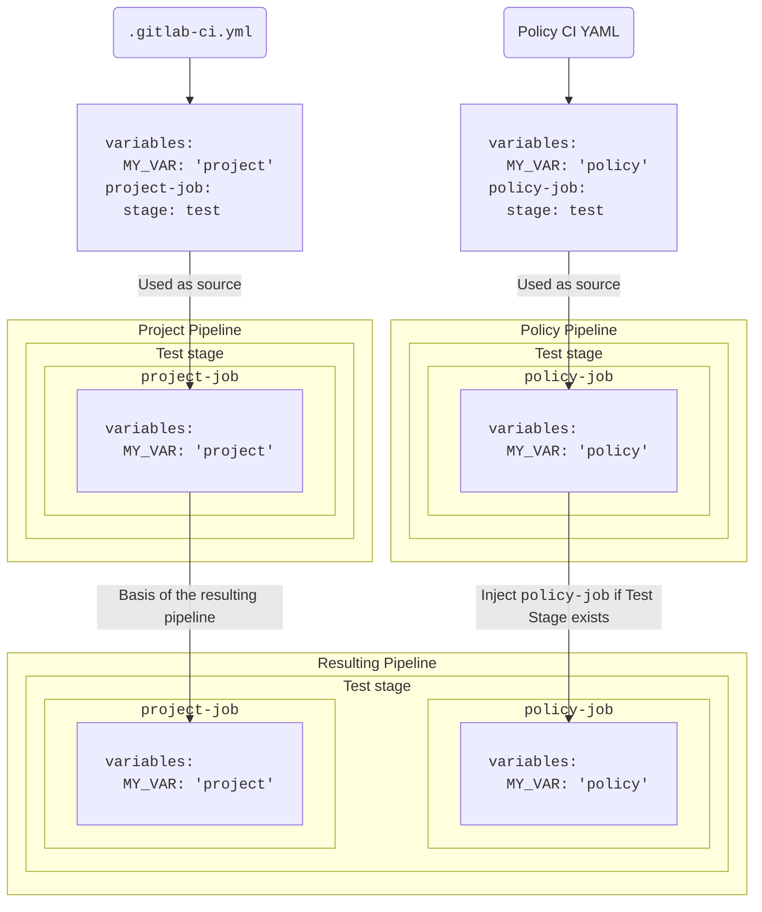



- Tier: 旗舰版
- Offering: JihuLab.com，私有化部署





- 在极狐GitLab 17.2 中引入，带有功能标志 `pipeline_execution_policy_type`。默认启用。
- 在极狐GitLab 17.3 中 GA。功能标志 `pipeline_execution_policy_type` 已移除。



使用流水线执行策略，可以通过单一配置管理和强制多个项目的 CI/CD 作业。

> [!warning]
> 在启用流水线执行策略之前，请确保已迁移同一项目中现有的合规流水线。当两者同时配置时，合规流水线会替换标准项目流水线，但流水线执行策略会基于原始项目流水线应用。这会导致不可预测的行为，具体取决于流水线执行策略的策略和 CI/CD 配置，并可能导致作业重复、流水线失败或缺失关键的安全和合规检查。合规流水线已被弃用。您应尽快迁移现有的合规流水线，并对所有新实现使用流水线执行策略。

- <i class="fa-youtube-play" aria-hidden="true"></i> 有关视频演示，请参见[安全策略：流水线执行策略类型](https://www.youtube.com/watch?v=QQAOpkZ__pA)。

<a id="schema"></a>

## Schema



- 在极狐GitLab 17.4 中启用了 `suffix` 字段。
- 在极狐GitLab 17.7 中更改了流水线执行，使后续阶段等待 `.pipeline-policy-pre` 阶段完成。
- 在极狐GitLab 18.10 中更改了流水线执行，当 `.pipeline-policy-pre` 阶段失败时，跳过所有后续作业。默认启用。
- 新的流水线执行在极狐GitLab 19.0 中 GA。功能标志 `ensure_pipeline_policy_pre_succeeds` 已移除。



包含流水线执行策略的 YAML 文件由一个对象数组组成，这些对象符合嵌套在 `pipeline_execution_policy` 键下的流水线执行策略 schema。每个安全策略项目在 `pipeline_execution_policy` 键下最多可以配置五个策略。超过前五个配置的任何其他策略都不会被应用。

保存新策略时，极狐GitLab 会根据此 JSON schema 验证其内容。如果您不熟悉如何阅读 JSON schema，以下部分和表格提供了替代方案。

| 字段 | 类型 | 必需 | 描述 |
|-------|------|----------|-------------|
| `pipeline_execution_policy` | 流水线执行策略的 `array` | 是 | 流水线执行策略列表（最多五个） |

<a id="pipeline_execution_policy-schema"></a>

## `pipeline_execution_policy` schema

| 字段 | 类型 | 必需 | 描述 |
|-------|------|----------|---------------------------------------------------------------------------------------------------------------------------------------------------------------------------------------------------------------------------------------------------------------------------------------------------------------------------------|
| `name` | `string` | 是 | 策略的名称。最多 255 个字符。 |
| `description` (可选) | `string` | 是 | 策略的描述。 |
| `enabled` | `boolean` | 是 | 启用 (`true`) 或禁用 (`false`) 策略的标志。 |
| `content` | `content` 类型的 `object` | 是 | 对要注入到项目流水线中的 CI/CD 配置的引用。 |
| `pipeline_config_strategy` | `string` | 否 | 可以是 `inject_policy`、`inject_ci`（已弃用）或 `override_project_ci`。有关更多信息，请参见流水线策略。 |
| `policy_scope` | `policy_scope` 类型的 `object` | 否 | 根据您指定的项目、群组或合规框架标签来限定策略范围。 |
| `suffix` | `string` | 否 | 可以是 `on_conflict`（默认）或 `never`。定义处理作业命名冲突的行为。`on_conflict` 会为破坏唯一性的作业名称添加唯一后缀。`never` 会在项目和所有适用策略中的作业名称不唯一时导致流水线失败。 |
| `skip_ci` | `skip_ci` 类型的 `object` | 否 | 定义用户是否可以应用 `skip-ci` 指令。默认情况下，`skip-ci` 的使用将被忽略，因此无法跳过具有流水线执行策略的流水线。 |
| `no_pipeline` | `no_pipeline` 类型的 `object` | 否 | 定义用户是否可以应用 `no_pipeline` 指令。默认情况下，`no_pipeline` 的使用将被忽略，因此不会创建具有流水线执行策略的流水线。 |
| `variables_override` | `variables_override` 类型的 `object` | 否 | 控制用户是否可以覆盖策略创建的作业中的策略变量行为。默认情况下，策略变量以最高优先级强制执行，用户无法覆盖它们。 |

请注意以下事项：

- 触发流水线的用户必须至少具有对流水线执行策略中指定的流水线执行文件的读取权限，否则流水线不会启动。
- 如果流水线执行文件被删除或重命名，则强制执行该策略的项目中的流水线可能会停止工作。
- 流水线执行策略作业可以分配到两个保留阶段之一：
  - `.pipeline-policy-pre` 位于流水线的开头，在 `.pre` 阶段之前。
  - `.pipeline-policy-post` 位于流水线的末尾，在 `.post` 阶段之后。
- 将作业注入任何保留阶段保证始终有效。执行策略作业也可以分配到任何标准（build、test、deploy）或用户声明的阶段。但是，在这种情况下，作业可能会根据项目流水线配置而被忽略。
- 不能在流水线执行策略之外将作业分配到保留阶段。
- 为流水线执行策略选择唯一的作业名称。某些 CI/CD 配置基于作业名称，如果同一流水线中存在多个相同的作业名称，可能会导致不希望的结果。例如，`needs` 关键字使一个作业依赖于另一个作业。如果有多个名为 `example` 的作业，那么一个 `needs` 了 `example` 作业名称的作业将随机依赖于其中一个 `example` 作业实例。
- 即使项目缺少 CI/CD 配置文件，流水线执行策略仍然有效。
- 策略的顺序会影响应用的后缀。
- 如果应用于给定项目的任何策略具有 `suffix: never`，那么如果流水线中已存在另一个同名的作业，则流水线将失败。
- 流水线执行策略在所有分支和流水线源上强制执行。但是，对于合并请求流水线，某些 `rules:` 或 `workflow:rules` 配置可能会阻止作业运行。使用工作流规则来控制何时强制执行流水线执行策略。

<a id="security-policy-pipeline-check"></a>

### 安全策略流水线检查



- Tier: 旗舰版
- Offering: JihuLab.com，私有化部署
- Status: 实验





- 在极狐GitLab 18.11 中引入，带有功能标志 `security_policy_pipeline_check`。默认禁用。
- 在极狐GitLab 18.11 中默认启用。



当为项目配置了流水线执行策略或扫描执行策略时，安全策略流水线检查要求最新提交的所有流水线都成功，然后才能合并合并请求。此检查适用于由于该提交而运行的所有流水线，而不仅仅是安全策略创建的流水线。

当合并请求流水线通过但另一个流水线（例如由安全策略创建的分支流水线）失败时，安全策略流水线检查会阻止合并，否则可能允许未经验证的代码被合并。

安全策略流水线检查的行为如下：

- 如果项目设置 **流水线必须成功** 已启用，则失败的流水线会导致硬阻塞，阻止合并。
- 如果 **流水线必须成功** 未启用，则失败的流水线会导致警告。合并请求仍然可以设置为自动合并。
- 如果项目设置 **跳过的流水线被视为成功** 已启用，则跳过的流水线将被视为已通过。

<a id="pipeline-policy-pre-stage"></a>

### `.pipeline-policy-pre` 阶段



- 在极狐GitLab 18.10 中更改了流水线执行，当 `.pipeline-policy-pre` 阶段失败时，跳过所有后续作业。默认启用。
- 新的流水线执行在极狐GitLab 19.0 中 GA。功能标志 `ensure_pipeline_policy_pre_succeeds` 已移除。



`.pipeline-policy-pre` 阶段中的作业始终执行。此阶段专为安全和合规用例设计。流水线中的作业直到 `.pipeline-policy-pre` 阶段完成后才开始。

如果 `.pipeline-policy-pre` 阶段失败或该阶段中的所有作业都被跳过，则后续阶段中的所有作业都将被跳过，包括：

- 具有 `needs: []` 的作业。
- 具有 `when: always` 的作业。

如果您的工作流不需要此行为，请改用 `.pre` 阶段或自定义阶段。

> [!note]
> 在极狐GitLab 18.9 及更早版本中，具有 `needs: []` 或 `when: always` 的作业可以绕过失败的 `.pipeline-policy-pre` 阶段。此行为在极狐GitLab 18.10 中成为默认行为，并从极狐GitLab 19.0 起永久生效。

<a id="job-naming-best-practice"></a>

### 作业命名最佳实践



- 命名冲突处理在极狐GitLab 17.4 中引入。



没有可见的指示器表明作业是由安全策略生成的。为了更容易识别由策略创建的作业并避免作业名称冲突，请为作业名称添加唯一的前缀或后缀。

示例：

- 使用：`policy1:deployments:sast`。此名称在所有其他策略和项目中很可能唯一。
- 不要使用：`sast`。此名称很可能在其他策略和项目中重复。

流水线执行策略根据 `suffix` 属性处理命名冲突。如果存在多个同名的作业：

- 使用 `on_conflict`（默认），如果作业名称与流水线中的另一个作业冲突，则会为其添加后缀。
- 使用 `never`，在发生冲突时不添加后缀，并且流水线失败。

后缀是根据作业合并到主流水线的顺序添加的。

顺序如下：

1. 项目流水线作业
1. 项目策略作业（如果适用）
1. 群组策略作业（如果适用，按层次结构排序，最顶层的群组最后应用）

应用的后缀格式如下：

`:policy-<security-policy-project-id>-<policy-index>`。

结果作业示例：`sast:policy-123456-0`。

如果安全策略项目中的多个策略定义了相同的作业名称，则数字后缀对应于冲突策略的索引。

结果作业示例：

- `sast:policy-123456-0`
- `sast:policy-123456-1`

<a id="job-stage-best-practice"></a>

### 作业阶段最佳实践

在流水线执行策略中定义的作业可以使用项目 CI/CD 配置中定义的任何阶段，也可以使用保留阶段 `.pipeline-policy-pre` 和 `.pipeline-policy-post`。

> [!note]
> 如果您的策略仅包含 `.pre` 和 `.post` 阶段中的作业，则该策略的流水线将被评估为 `empty`。它不会与项目的流水线合并。
>
> 要在流水线执行策略中使用 `.pre` 和 `.post` 阶段，您必须包含至少一个在不同阶段运行的其他作业。例如：`.pipeline-policy-pre`。

当您使用 `inject_policy` 流水线策略时，如果目标项目不包含自己的 `.gitlab-ci.yml` 文件，则所有策略阶段都将注入到流水线中。

当您使用（已弃用的）`inject_ci` 流水线策略时，如果目标项目不包含自己的 `.gitlab-ci.yml` 文件，则唯一可用的阶段是默认流水线阶段和保留阶段。

当您对具有您无权修改的 CI/CD 配置的项目强制执行流水线执行策略时，您应该在 `.pipeline-policy-pre` 和 `.pipeline-policy-post` 阶段中定义作业。无论任何项目的 CI/CD 配置如何，这些阶段始终可用。

当您使用 `override_project_ci` 流水线策略与多个流水线执行策略以及自定义阶段时，阶段必须以相同的相对顺序定义才能相互兼容：

有效配置示例：

```yaml
  - override-policy-1 stages: [build, test, policy-test, deploy]
  - override-policy-2 stages: [test, deploy]
```

无效配置示例：

```yaml
  - override-policy-1 stages: [build, test, policy-test, deploy]
  - override-policy-2 stages: [deploy, test]
```

如果一个或多个 `override_project_ci` 策略具有无效的 `stages` 配置，则流水线将失败。

<a id="content-type"></a>

### `content` 类型

| 字段 | 类型 | 必需 | 描述 |
|-------|------|----------|-------------|
| `project` | `string` | 是 | 同一极狐GitLab 实例上项目的完整项目路径。 |
| `file` | `string` | 是 | 相对于根目录 (/) 的完整文件路径。YAML 文件必须具有 `.yml` 或 `.yaml` 扩展名。 |
| `ref` | `string` | 否 | 从中检索文件的 ref。未指定时默认为项目的 HEAD。 |

在策略中使用 `content` 类型来引用存储在另一个仓库中的 CI/CD 配置。这允许您在多个策略中重用相同的 CI/CD 配置，从而减少维护这些配置的开销。例如，如果您有一个自定义密钥检测 CI/CD 配置要在策略 A 和策略 B 中强制执行，您可以创建一个单一的 YAML 配置文件，并在两个策略中引用该配置。

先决条件：

- 触发流水线的用户在强制执行包含 `content` 类型的策略的项目中运行，必须至少具有对包含 CI/CD 的项目的只读访问权限。
- 在强制执行流水线执行策略的项目中，用户必须至少具有对包含 CI/CD 配置的项目的只读访问权限才能触发流水线。

  在极狐GitLab 17.4 及更高版本中，您可以授予对安全策略项目中使用 `content` 类型指定的 CI/CD 配置文件所需的只读访问权限。为此，请在安全策略项目的通用设置中启用设置 **流水线执行策略**。启用此设置会授予触发流水线的用户读取由流水线执行策略强制执行的 CI/CD 配置文件的访问权限。此设置不会授予用户访问存储配置文件的项目中任何其他部分的权限。有关更多详细信息，请参见自动授予访问权限。

<a id="skip_ci-type"></a>

### `skip_ci` 类型



- 在极狐GitLab 17.7 中引入。



流水线执行策略提供了对谁可以使用 `[skip ci]` 指令的控制。您可以指定允许使用 `[skip ci]` 的某些用户或服务帐户，同时仍确保执行关键的安全和合规检查。

使用 `skip_ci` 关键字指定是否允许用户应用 `skip_ci` 指令来跳过流水线。未指定该关键字时，`skip_ci` 指令将被忽略，从而阻止所有用户绕过流水线执行策略。

| 字段 | 类型 | 可能的值 | 描述 |
|-------------------------|----------|--------------------------|-------------|
| `allowed` | `boolean` | `true`、`false` | 允许 (`true`) 或阻止 (`false`) 对强制执行流水线执行策略的流水线使用 `skip-ci` 指令的标志。 |
| `allowlist` | `object` | `users` | 指定始终允许使用 `skip-ci` 指令的用户，无论 `allowed` 标志如何。使用 `users:` 后跟一个包含 `id` 键的对象数组，表示用户 ID。 |

<a id="no_pipeline-type"></a>

### `no_pipeline` 类型

流水线执行策略提供了对谁可以使用 `[no_pipeline]` 指令的控制。您可以指定允许使用 `[no_pipeline]` 的某些用户或服务帐户，同时仍确保执行关键的安全和合规检查。

使用 `no_pipeline` 关键字指定是否允许用户应用 `no_pipeline` 指令来不创建流水线。未指定该关键字时，`no_pipeline` 指令将被忽略，从而阻止所有用户绕过流水线执行策略。

| 字段 | 类型 | 可能的值 | 描述 |
|-------------------------|----------|--------------------------|-------------|
| `allowed` | `boolean` | `true`、`false` | 允许 (`true`) 或阻止 (`false`) 对强制执行流水线执行策略的流水线使用 `no_pipeline` 指令的标志。 |
| `allowlist` | `object` | `users` | 指定始终允许使用 `no_pipeline` 指令的用户，无论 `allowed` 标志如何。使用 `users:` 后跟一个包含 `id` 键的对象数组，表示用户 ID。 |

<a id="variables_override-type"></a>

### `variables_override` 类型



- 在极狐GitLab 18.1 中引入。



| 字段 | 类型 | 可能的值 | 描述 |
|-------------------------|----------|--------------------------|-------------|
| `allowed` | `boolean` | `true`、`false` | 当为 `true` 时，其他配置可以覆盖策略变量。当为 `false` 时，其他配置不能覆盖策略变量。 |
| `exceptions` | `array` | `string` 的 `array` | 全局规则的例外变量。当 `allowed: false` 时，`exceptions` 是允许列表。当 `allowed: true` 时，`exceptions` 是拒绝列表。 |
| `dotenv` | `string` | `respect_policy`、`allow_override` | 控制 dotenv 工件变量是否遵守 `variables_override` 策略规则。默认情况下（未指定或设置为 `respect_policy`），dotenv 变量与其他变量一样遵守相同的覆盖规则。设置为 `allow_override` 可让 dotenv 变量绕过策略规则。提供此选项是为了向后兼容依赖 dotenv 工件覆盖策略变量的工作流。不建议使用 `allow_override`，因为它会削弱 `variables_override` 提供的安全保障。 |

此选项控制用户定义的变量在强制执行策略的流水线中如何处理。此功能允许您：

- 默认拒绝用户定义的变量（推荐），这提供了更强的安全性，但要求您将所有应可自定义的变量添加到 `exceptions` 允许列表中。
- 默认允许用户定义的变量，这提供了更大的灵活性但安全性较低，因为您必须将可能影响策略执行的变量添加到 `exceptions` 拒绝列表中。
- 为 `allowed` 全局规则定义例外。

用户定义的变量可能会影响流水线中任何策略作业的行为，并且可以来自各种来源：

- 流水线变量。
- 项目变量。
- 群组变量。
- 实例变量。

当未指定 `variables_override` 选项时，将保持“最高优先级”行为。有关此行为的更多信息，请参见流水线执行策略中的变量优先级。

当流水线执行策略控制变量优先级时，作业日志包括配置的 `variables_override` 选项和策略名称。要查看这些日志，必须将 `gitlab-runner` 更新到 18.1 或更高版本。

<a id="example-variables_override-configuration"></a>

#### `variables_override` 配置示例

将 `variables_override` 选项添加到您的流水线执行策略配置中：

```yaml
pipeline_execution_policy:
  - name: Security Scans
    description: 'Enforce security scanning'
    enabled: true
    pipeline_config_strategy: inject_policy
    content:
      include:
        - project: gitlab-org/security-policies
          file: security-scans.yml
    variables_override:
      allowed: false
      exceptions:
        - CS_IMAGE
        - SAST_EXCLUDED_ANALYZERS
```

<a id="enforcing-security-scans-while-allowing-container-customization-allowlist-approach"></a>

##### 强制执行安全扫描同时允许容器自定义（允许列表方法）

要强制执行安全扫描但允许项目团队指定自己的容器镜像：

```yaml
variables_override:
  allowed: false
  exceptions:
    - CS_IMAGE
```

此配置会阻止除 `CS_IMAGE` 之外的所有用户定义变量，确保安全扫描无法被禁用，同时允许团队自定义容器镜像。
#### Prevent specific security variable overrides (denylist approach)

<a id="prevent-specific-security-variable-overrides-denylist-approach"></a>

##### 防止特定安全变量覆盖（拒绝列表方法）

To allow most variables, but prevent disabling security scans:

```yaml
variables_override:
  allowed: true
  exceptions:
    - SECRET_DETECTION_DISABLED
    - SAST_DISABLED
    - DEPENDENCY_SCANNING_DISABLED
    - DAST_DISABLED
    - CONTAINER_SCANNING_DISABLED
```

This configuration allows all user-defined variables except those that could disable security scans.

> [!warning]
> While this configuration can provide flexibility, it is discouraged due to the security implications.
> Any variable that is not explicitly listed in the `exceptions` can be injected by the users. As a result,
> the policy configuration is not as well protected as when using the `allowlist` approach.

### `policy scope` schema

<a id="policy-scope-schema"></a>

### `policy scope` 模式

To customize policy enforcement, you can define a policy's scope to either include, or exclude,
specified projects, groups, or compliance framework labels. For more details, see
[Scope](_index.md#configure-the-policy-scope).

> [!note]
> Setting a `policy_scope` field to an empty collection (for example, `including: []`) is treated
> the same as omitting the field, so the policy applies to all projects for that scope dimension.
> To disable a policy entirely, use `enabled: false`. For more details, see
> [Empty collections in `policy_scope`](_index.md#empty-collections-in-policy_scope).

## Manage access to the CI/CD configuration

<a id="manage-access-to-the-cicd-configuration"></a>

## 管理对 CI/CD 配置的访问

When you enforce pipeline execution policies on a project, users that trigger pipelines must have at least read-only access to the project that contains the policy CI/CD configuration. You can grant access to the project manually or automatically.

### Grant access manually

<a id="grant-access-manually"></a>

### 手动授予访问权限

To allow users or groups to run pipelines with enforced pipeline execution policies, you can invite them to the project that contains the policy CI/CD configuration.

### Grant access automatically

<a id="grant-access-automatically"></a>

### 自动授予访问权限

You can automatically grant access to the policy CI/CD configuration for all users who run pipelines in projects with enforced pipeline execution policies.

Prerequisites:

- Make sure the pipeline execution policy CI/CD configuration is stored in a security policy project.
- In the general settings of the security policy project, enable the **Pipeline execution policies** setting.

If you don't yet have a security policy project and you want to create the first pipeline execution policy, create an empty project and link it as a security policy project.
To link the project:

1. In the group or project where you want to enforce the policy, select **Secure** > **Policies** > **Edit policy project**.
1. Select the security policy project.

The project becomes a security policy project, and the setting becomes available.

> [!note]
> To create downstream pipelines using `$CI_JOB_TOKEN`, you need to make sure that projects and groups are authorized to request the security policy project.
> In the security policy project, go to **Settings** > **CI/CD** > **Job token permissions** and add the authorized groups and projects to the allowlist.
> If you don't see the **CI/CD** settings, go to **Settings** > **General** > **Visibility, project features, permissions** and enable **CI/CD**.

#### Configuration

<a id="configuration"></a>

#### 配置

1. In the policy project, select **Settings** > **General** > **Visibility, project features, permissions**.
1. Enable the **Pipeline execution policies** setting.
1. In the policy project, create a file for the policy CI/CD configuration.

   ```yaml
   # policy-ci.yml

   policy-job:
     script: ...
   ```

1. In the group or project where you want to enforce the policy, create a pipeline execution policy and specify the CI/CD configuration file for the security policy project.

   ```yaml
   pipeline_execution_policy:
   - name: My pipeline execution policy
     description: Enforces CI/CD jobs
     enabled: true
     pipeline_config_strategy: inject_policy
     content:
       include:
       - project: my-group/my-security-policy-project
         file: policy-ci.yml
   ```

## Pipeline configuration strategies

<a id="pipeline-configuration-strategies"></a>

## 流水线配置策略

Pipeline configuration strategy defines the method for merging the policy configuration with the project pipeline. Pipeline execution policies execute the jobs defined in the `.gitlab-ci.yml` file in isolated pipelines, which are merged into the pipelines of the target projects.

### `inject_policy` type

<a id="inject_policy-type"></a>

### `inject_policy` 类型



- 在极狐GitLab 17.9 引入。



This strategy adds custom CI/CD configurations into the existing project pipeline without completely replacing the project's original CI/CD configuration. It is suitable when you want to enhance or extend the current pipeline with additional steps, such as adding new security scans, compliance checks, or custom scripts.

Unlike the deprecated `inject_ci` strategy, `inject_policy` allows you to inject custom policy stages into your pipeline, giving you more granular control over where policy rules are applied in your CI/CD workflow.

If you have multiple policies enabled, this strategy injects all of the jobs from each policy.

When you use this strategy, a project CI/CD configuration cannot override any behavior defined in the policy pipelines because each pipeline has an isolated YAML configuration.

For projects without a `.gitlab-ci.yml` file, this strategy creates `.gitlab-ci.yml` file
implicitly. The executed pipeline contains only the jobs defined in the pipeline execution policy.

> [!note]
> When a pipeline execution policy uses workflow rules that prevent policy jobs from running, the only jobs that
> run are the project's CI/CD jobs. If the project uses workflow rules that prevent project CI/CD jobs from running,
> the only jobs that run are the pipeline execution policy jobs.

#### Stages injection

<a id="stages-injection"></a>

#### 阶段注入

The stages for the policy pipeline follow the usual CI/CD configuration.
You define the order in which a custom policy stage is injected into the project pipeline by providing the stages before and after the custom stages.

The project and policy pipeline stages are represented as a Directed Acyclic Graph (DAG), where nodes are stages and edges represent dependencies. When you combine pipelines, the individual DAGs are merged into a single, larger DAG. Afterward, a topological sorting is performed, which determines the order in which stages from all pipelines should execute. This sorting ensures that all dependencies are respected in the final order.
If there are conflicting dependencies, the pipeline fails to run. To fix the dependencies, ensure that stages used across the project and policies are aligned.

If a stage isn't explicitly defined in the policy pipeline configuration, the pipeline uses the default stages `stages: [build, test, deploy]`. If these stages are included, but listed in a different order, the pipeline fails with a `Cyclic dependencies detected when enforcing policies` error.

The following examples demonstrate this behavior. All examples assume the following project CI/CD configuration:

```yaml
# .gitlab-ci.yml
stages: [build, test, deploy]

project-build-job:
  stage: build
  script: ...

project-test-job:
  stage: test
  script: ...

project-deploy-job:
  stage: deploy
  script: ...
```

##### Example 1

<a id="example-1"></a>

##### 示例 1

```yaml
# policy-ci.yml
stages: [test, policy-stage, deploy]

policy-job:
  stage: policy-stage
  script: ...
```

In this example, the `policy-stage` stage:

- Must be injected after `test` stage, if present.
- Must be injected before `deploy` stage, if present.

Result: The pipeline contains the following stages: `[build, test, policy-stage, deploy]`.

Special cases:

- If the `.gitlab-ci.yml` specified the stages as `[build, deploy, test]`, the pipeline would fail with the error `Cyclic dependencies detected when enforcing policies` because the constraints cannot be satisfied. To fix the failure, adjust the project configuration to align the stages with the policies.
- If the `.gitlab-ci.yml` specified stages as `[build]`, the resulting pipeline has the following stages: `[build, policy-stage]`.

##### Example 2

<a id="example-2"></a>

##### 示例 2

```yaml
# policy-ci.yml
stages: [policy-stage, deploy]

policy-job:
  stage: policy-stage
  script: ...
```

In this example, the `policy-stage` stage:

- Must be injected before `deploy` stage, if present.

Result: The pipeline contains the following stages: `[build, test, policy-stage, deploy]`.

Special cases:

- If the `.gitlab-ci.yml` specified the stages as `[build, deploy, test]`, the resulting pipeline stages would be: `[build, policy-stage, deploy, test]`.
- If there is no `deploy` stage in the project pipeline, the `policy-stage` stage is injected at the end of the pipeline, just before `.pipeline-policy-post`.

##### Example 3

<a id="example-3"></a>

##### 示例 3

```yaml
# policy-ci.yml
stages: [test, policy-stage]

policy-job:
  stage: policy-stage
  script: ...
```

In this example, the `policy-stage` stage:

- Must be injected after `test` stage, if present.

Result: The pipeline contains the following stages: `[build, test, deploy, policy-stage]`.

Special cases:

- If there is no `test` stage in the project pipeline, the `policy-stage` stage is injected at the end of the pipeline, just before `.pipeline-policy-post`.

##### Example 4

<a id="example-4"></a>

##### 示例 4

```yaml
# policy-ci.yml
stages: [policy-stage]

policy-job:
  stage: policy-stage
  script: ...
```

In this example, the `policy-stage` stage has no constraints.

Result: The pipeline contains the following stages: `[build, test, deploy, policy-stage]`.

##### Example 5

<a id="example-5"></a>

##### 示例 5

```yaml
# policy-ci.yml
stages: [check, lint, test, policy-stage, deploy, verify, publish]

policy-job:
  stage: policy-stage
  script: ...
```

In this example, the `policy-stage` stage:

- Must be injected after the stages `check`, `lint`, `test`, if present.
- Must be injected before the stages `deploy`, `verify`, `publish`, if present.

Result: The pipeline contains the following stages: `[build, test, policy-stage, deploy]`.

Special cases:

- If the `.gitlab-ci.yml` specified stages as `[check, publish]`, the resulting pipeline has the following stages: `[check, policy-stage, publish]`

#### Default stage order

<a id="default-stage-order"></a>

#### 默认阶段顺序

When stages are not defined in a policy, GitLab enforces the default stages order:

1. `.pre`
1. `build`
1. `test`
1. `deploy`
1. `.post`.

The default order may conflict with projects that use any of these default stages in a different order. For example, using `test` before `build` in `stages: [test, build, deploy]`.

#### Avoiding cyclic dependencies

<a id="avoiding-cyclic-dependencies"></a>

#### 避免循环依赖

Cyclic dependency errors occur when the stage order in a policy conflicts with the stage order in a project. To avoid these errors:

- Always explicitly define the stages in your policy to ensure the stage order is clear and compatible with your projects. If your policy uses the default stages `build`, `test`, or `deploy`, be aware that the order will be enforced on all projects.
- When you use only reserved stages (`.pipeline-policy-pre` and `.pipeline-policy-post`), you don't need to define the default stages in your policy as these reserved stages are always placed at the beginning and end of the pipeline.

By following these guidelines, you can create policies that work reliably across projects with different stage configurations.

### `inject_ci` (deprecated)

<a id="inject_ci-deprecated"></a>

### `inject_ci`（已弃用）

> [!warning]
> This feature was [deprecated](https://gitlab.com/gitlab-org/gitlab/-/issues/475152) in GitLab 17.9. Use [`inject_policy`](#inject_policy-type) instead as it supports the enforcement of custom policy stages.

This strategy adds custom CI/CD configurations into the existing project pipeline without completely replacing the project's original CI/CD configuration. It is suitable when you want to enhance or extend the current pipeline with additional steps, such as adding new security scans, compliance checks, or custom scripts.

Having multiple policies enabled injects all jobs additively.

When you use this strategy, a project CI/CD configuration cannot override any behavior defined in the policy pipelines because each pipeline has an isolated YAML configuration.

For projects without a `.gitlab-ci.yml` file, this strategy creates a `.gitlab-ci.yml` file
implicitly. This allows a pipeline containing only the jobs defined in the pipeline execution policy to
execute.

> [!note]
> When a pipeline execution policy uses workflow rules that prevent policy jobs from running, the only jobs that
> run are the project's CI/CD jobs. If the project uses workflow rules that prevent project CI/CD jobs from running,
> the only jobs that run are the pipeline execution policy jobs.

### `override_project_ci`

<a id="override_project_ci"></a>

### `override_project_ci`



- Updated handling of workflow rules:
  - 在极狐GitLab 17.8 [引入](https://gitlab.com/gitlab-org/gitlab/-/merge_requests/175088)，带有[功能标志](../../../administration/feature_flags/_index.md) `policies_always_override_project_ci`，默认启用。
  - 在极狐GitLab 17.10 [达到 GA](https://gitlab.com/gitlab-org/gitlab/-/issues/512877)。功能标志 `policies_always_override_project_ci` 已移除。
- `override_project_ci` 的处理在极狐GitLab 17.9 [变更](https://gitlab.com/gitlab-org/gitlab/-/issues/504434)，允许扫描执行策略与流水线执行策略一同运行。



This strategy replaces the project's existing CI/CD configuration with a new one defined by the pipeline execution policy. This strategy is ideal when the entire pipeline needs to be standardized or replaced, like when you want to enforce organization-wide CI/CD standards or compliance requirements in a highly regulated industry. To override the pipeline configuration, define the CI/CD jobs and do not use `include:project`.

The strategy takes precedence over other policies that use the `inject_ci` or `inject_policy` strategy. If a policy with `override_project_ci` applies, the project CI/CD configuration is ignored. However, other security policy configurations are not overridden.

When you use `override_project_ci` in a pipeline execution policy together with a scan execution policy,
the CI/CD configurations are merged and both policies are applied to the resulting pipeline.

Alternatively, you can merge the project's CI/CD configuration with the project's `.gitlab-ci.yml` instead of overriding it. To merge the configuration, use `include:project`. This strategy allows users to include the project CI/CD configuration in the pipeline execution policy configuration, enabling the users to customize the policy jobs. For example, they can combine the policy and project CI/CD configuration into one YAML file to override the `before_script` configuration or define required variables, such as `CS_IMAGE`, to define the required path to the container to scan.
The following diagram illustrates how variables defined at the project and policy levels are selected in the resulting pipeline:



> [!note]
> The workflow rules in the pipeline execution policy override the project's original CI/CD configuration.
> By defining workflow rules in the policy, you can set rules that are enforced across all linked projects,
> like preventing the use of branch pipelines.

#### Pipeline name

<a id="pipeline-name"></a>

#### 流水线名称

Pipeline execution policies that use the `override_project_ci` strategy override the [pipeline name](../../../ci/yaml/_index.md#workflowname) that is defined in the project's original CI/CD configuration.

You can define the pipeline name in the pipeline execution policy configuration.

If there are multiple pipeline execution policies with the `override_project_ci` strategy, the lowest one in the group hierarchy is applied.
For example, a policy for the project overrides a policy for the group the project belongs to. A policy for a subgroup takes precedence over a policy for the group the subgroup belongs to.

### Include a project's CI/CD configuration in the pipeline execution policy configuration

<a id="include-a-projects-cicd-configuration-in-the-pipeline-execution-policy-configuration"></a>

### 在流水线执行策略配置中包含项目的 CI/CD 配置

When you use the `override_project_ci` strategy, the project configuration can be included into the pipeline execution policy configuration:

```yaml
include:
  - project: $CI_PROJECT_PATH
    ref: $CI_COMMIT_SHA
    file: $CI_CONFIG_PATH
    rules:
      - exists:
          paths:
            - '$CI_CONFIG_PATH'
          project: '$CI_PROJECT_PATH'
          ref: '$CI_COMMIT_SHA'

compliance_job:
 ...
```

> [!note]
> When a project's `.gitlab-ci.yml` configuration is included in an `override_project_ci` policy
> using `include:project`, the project configuration becomes part of the policy pipeline.
> In this scenario, the included project configuration can assign jobs to the reserved stages
> (`.pipeline-policy-pre` and `.pipeline-policy-post`), because the use of reserved stages is
> permitted within a policy pipeline. Aside from this exception,
> [you cannot assign jobs to reserved stages](#job-stage-best-practice).

## CI/CD variables

<a id="cicd-variables"></a>

## CI/CD 变量

> [!warning]
> Don't store sensitive information or credentials in variables because they are stored as part of the plaintext policy configuration
> in a Git repository.

By default, pipeline execution policies run in isolation, which means they do not apply any variables defined outside of the policy.

When you enable the [`variables_override` setting](#variables_override-type) setting, pipeline execution policies can access the following user-defined variables:

- Variables from group CI/CD settings.
- Variables from project CI/CD settings.
- Variables specified by users when running a new pipeline.

However, even when the `variables_override` setting is enabled, pipeline execution policies cannot access the following types of variables:

- Variables defined in other policies.
- Variables defined in the project's `.gitlab-ci.yml` file.

When enabled, the `variables_override` setting allows the policy to access and apply the variables according to standard [CI/CD variable precedence](../../../ci/variables/_index.md#cicd-variable-precedence) rules.

However, the precedence rules are more complex when using a pipeline execution policy as they can vary depending on the pipeline execution policy strategy:

- `inject_policy` strategy: If the variable is defined in the pipeline execution policy, the job always uses this value. If a variable is not defined in a pipeline execution policy, the job applies the value from the group or project settings.
- `inject_ci` strategy: If the variable is defined in the pipeline execution policy, the job always uses this value. If a variable is not defined in a pipeline execution policy, the job applies the value from the group or project settings.
- `override_project_ci` strategy: All jobs in the resulting pipeline are treated as policy jobs. Variables defined in the policy (including those in included files) take precedence over project and group variables. This means that variables from jobs in the CI/CD configuration of the included project take precedence over the variables defined in the project and group settings.

For more details on variable in pipeline execution policies, see [precedence of variable in pipeline execution policies](#precedence-of-variables-in-pipeline-execution-policies).

You can [define project or group variables in the UI](../../../ci/variables/_index.md#define-a-cicd-variable-in-the-ui).

### Precedence of variables in pipeline execution policies

<a id="precedence-of-variables-in-pipeline-execution-policies"></a>

### 流水线执行策略中变量的优先级

When you use pipeline execution policies, especially with the `override_project_ci` strategy, the precedence of variable values defined in multiple places can differ from standard GitLab CI/CD pipelines. These are some important points to understand:

- When using `override_project_ci`, all jobs in the resulting pipeline are considered policy jobs, including those from the CI/CD configurations of included projects.
- Variables defined in a policy pipeline (for the entire instance or for a job) take precedence over variables defined in the project or group settings.
- This behavior applies to all jobs, including those included from the project's CI/CD configuration file (`.gitlab-ci.yml`).

#### Example

<a id="example"></a>

#### 示例

If a variable in a project's CI/CD configuration and a job variable defined in an included `.gitlab-ci.yml` file have the same name, the job variable takes precedence when using `override_project_ci`.

In the project's CI/CD settings, a `MY_VAR` variable is defined:

- Key: `MY_VAR`
- Value: `Project configuration variable value`

In `.gitlab-ci.yml` of the included project, the same variable is defined:

```yaml
project-job:
  variables:
    MY_VAR: "Project job variable value"
  script:
    - echo $MY_VAR  # This will output "Project job variable value"
```

In this case, the job variable value `Project job variable value` takes precedence.

### Prefill variables in manually-run pipelines

<a id="prefill-variables-in-manually-run-pipelines"></a>

### 在手动运行的流水线中预填变量



- 在极狐GitLab 18.5 引入。



> [!warning]
> This feature does not work with pipeline execution policies created before GitLab 18.5.
> To use this feature with older pipeline execution policies, you can either:
>
> - Make any change to the existing YAML configuration files for the pipeline execution policies.
> - Copy, delete, and recreate the policies.
>
> For more information, see [recreate pipeline execution policies](#recreate-pipeline-execution-policies).

You can use the `description`, `value` and `options` keywords to define CI/CD variables
that are [prefilled when a user runs a pipeline manually](../../../ci/pipelines/_index.md#prefill-variables-in-manual-pipelines).
Use the description to provide relevant information, such as what the variable is used for and what the acceptable values are.

You cannot prefill job-specific variables.

In manually-triggered pipelines, the **New pipeline** page displays all pipeline variables that have a `description` defined in the CI/CD configuration, from all applicable policies.

You must configure the prefilled variables as allowed using [`variables_override`](pipeline_execution_policies.md#variables_override-type),
otherwise the values used when manually triggering the pipelines are ignored.

#### Recreate pipeline execution policies

<a id="recreate-pipeline-execution-policies"></a>

#### 重新创建流水线执行策略

To recreate a pipeline execution policy:

<!-- markdownlint-disable MD044 -->

1. In the top bar, select **搜索或跳转到** and find your group.
1. In the left sidebar, select **Secure** > **Policies**.
1. Select the pipeline execution policy you want to recreate.
1. In the right sidebar, select the **YAML** tab and copy the contents of the entire policy file.
1. Next to the policies table, select the vertical ellipsis (), and select **Delete**.
1. Merge the generated merge request.
1. Go back to **Secure** > **Policies** and select **New policy**.
1. In the **Pipeline execution policy** section, select **Select policy**.
1. In the **.yaml mode**, paste the contents of the old policy.
1. Select **Update via merge request** and merge the generated merge request.

<!-- markdownlint-enable MD044 -->

## Ensuring that security-critical policies execute

<a id="ensuring-that-security-critical-policies-execute"></a>

## 确保安全关键策略执行
当您出于安全和合规目的实施流水线执行策略时，请考虑以下最佳实践，确保策略无法被绕过或破坏。

<a id="avoid-changes-rules-for-security-critical-jobs"></a>

### 避免在安全关键任务中使用 `changes:` 规则

在安全关键的流水线策略中，应避免使用 `changes:` 规则，因为它们可能在分支流水线上产生意外结果。`changes:` 关键字依赖于基于 SHA 的差异，并且在某些场景下可以被绕过，例如当使用 `git commit --amend` 后跟强制推送。

当使用 `git commit --amend` 并强制推送时，极狐GitLab 计算已更改文件的方式会有所不同：

1. 第一次推送（标准提交）：
   1. 极狐GitLab 将新提交与其父提交进行比较。
   1. 极狐GitLab 检测到目标文件已更改。
   1. `changes: [filename]` 规则正确触发。

1. 第二次推送（使用 `--force` 修改提交）：
   1. 修改后的提交以新的 SHA 完全替换之前的提交。
   1. 极狐GitLab 使用 `git diff HEAD~` 计算更改，该命令与分支上的上一个提交进行比较。
   1. 由于该分支上的上一个提交也包含相同的文件更改，因此差异显示 **没有新更改**。
   1. `changes:` 规则不会触发。

相反，请使用无法被绕过的条件：

```yaml
check-critical-files:
  stage: .pipeline-policy-pre
  script:
    - |
      # 检查关键文件是否与目标分支不同
      if git diff origin/$CI_MERGE_REQUEST_TARGET_BRANCH_NAME --name-only | grep -q "Makefile\|\.gitlab-ci\.yml"; then
        echo "关键文件已被修改"
        exit 1
      fi
  rules:
    - if: $CI_PIPELINE_SOURCE == "merge_request_event"
      when: always
```

或者，在每次流水线中运行策略检查，而不使用 `changes:` 条件：

```yaml
security-check:
  stage: .pipeline-policy-pre
  script:
    - echo "正在运行安全检查"
    - ./run-security-checks.sh
  rules:
    - when: always
```

有关 `changes:` 行为的更多信息，请参见[使用 `changes` 时作业或流水线意外运行](../../../ci/jobs/job_troubleshooting.md#jobs-or-pipelines-run-unexpectedly-when-using-changes)。

<a id="use-the-pipeline-policy-pre-stage-for-critical-security-checks"></a>

### 使用 `.pipeline-policy-pre` 阶段进行关键安全检查

`.pipeline-policy-pre` 阶段中的作业是为安全与合规场景设计的。
所有其他流水线作业会等待此阶段完成后才开始。
如果 `.pipeline-policy-pre` 阶段失败，所有后续作业将被跳过。

<a id="detect-duplicate-security-configurations"></a>

#### 检测重复的安全配置

您可以使用 `.pipeline-policy-pre` 创建自定义验证作业，这些作业检查现有的安全配置并提供指导。例如，当您通过流水线执行策略在整个组织内强制安全扫描，但某些项目已经拥有自己的安全扫描实现时，您可以使用 `.pipeline-policy-pre` 来识别重复的扫描。

示例策略 CI/CD 配置：

```yaml
# policy-ci.yml
check-duplicate-scans:
  stage: .pipeline-policy-pre
  script:
    - |
      echo "正在检查重复的安全扫描配置..."
      if [ -f ".gitlab-ci.yml" ]; then
        if grep -q "secret_detection:" .gitlab-ci.yml || \
           grep -q "sast:" .gitlab-ci.yml || \
           grep -q "dependency_scanning:" .gitlab-ci.yml || \
           grep -q "container_scanning:" .gitlab-ci.yml; then
          echo "WARNING: 检测到重复的安全扫描。"
          echo ""
          echo "此项目的 .gitlab-ci.yml 中定义了安全扫描，"
          echo "它们可能与流水线执行策略强制执行的扫描重复。"
          echo ""
          echo "为避免冗余扫描并减少流水线时间："
          echo "1. 查看您的 .gitlab-ci.yml 中的安全扫描作业。"
          echo "2. 移除重复的作业（secret_detection、sast、dependency_scanning 等）。"
          echo "3. 流水线执行策略确保这些扫描仍然运行。"
          echo ""
          echo "如有疑问，请联系您的安全团队。"
        else
          echo "未检测到重复的安全扫描。"
        fi
      fi
  allow_failure: true
  rules:
    - when: always
```

此配置：

- 检测潜在的重复配置，而不会阻塞流水线。
- 为开发团队提供可操作的指导。
- 保持对哪些项目需要清理的可见性。
- 避免自动删除作业的复杂性，因为那样可能产生意想不到的后果。

您可以扩展此示例以检查其他配置问题，或为安全团队生成报告以跟踪各项目的合规性。

<a id="control-variable-overrides"></a>

### 控制变量覆盖

使用 [`variables_override`](#variables_override-type) 配置以防止用户通过禁用安全扫描或修改关键安全配置来覆盖关键安全变量。

```yaml
variables_override:
  allowed: false
  exceptions:
    - CS_IMAGE  # 仅允许自定义容器镜像
```

<a id="secure-job-naming"></a>

### 安全的作业命名

使用带有前缀的唯一、描述性作业名称，以避免冲突，并让用户清楚地知道这些作业已由安全策略强制执行：

```yaml
# 正确做法：清晰的安全策略作业名称
security-policy:sast-scan:
  stage: .pipeline-policy-pre
  script: ...

# 避免做法：可能冲突的通用名称
sast:
  stage: .pipeline-policy-pre
  script: ...
```

<a id="behavior-with-no_pipeline"></a>

### 与 `[no_pipeline]` 的行为

默认情况下，为防止创建常规流水线，用户可以使用 `[no_pipeline]` 推送选项将提交推送到受保护分支。但是，通过流水线执行策略定义的作业始终会触发，因为该策略会忽略 `[no_pipeline]` 指令。这可以防止开发者跳过策略中定义的作业的执行，从而确保始终执行关键的安全与合规检查。

有关对 `[no_pipeline]` 行为的更灵活控制，请参见 [`no_pipeline` 类型](#no_pipeline-type)部分。

<a id="behavior-with-skip-ci"></a>

### 与 `[skip ci]` 的行为

默认情况下，为防止触发常规流水线，用户可以在提交消息中使用 `[skip ci]` 将提交推送到受保护分支。但是，通过流水线执行策略定义的作业始终会触发，因为该策略会忽略 `[skip ci]` 指令。这可以防止开发者跳过策略中定义的作业的执行，从而确保始终执行关键的安全与合规检查。

有关对 `[skip ci]` 行为的更灵活控制，请参见 [`skip_ci` 类型](#skip_ci-type)部分。

<a id="examples"></a>

### 示例

这些示例演示了您可以通过流水线执行策略实现的功能。

<a id="pipeline-execution-policy"></a>

#### 流水线执行策略

您可以在存储在[安全策略项目](enforcement/security_policy_projects.md)中的 `.gitlab/security-policies/policy.yml` 文件中使用以下示例：

```yaml
---
pipeline_execution_policy:
- name: 我的流水线执行策略
  description: 强制执行 CI/CD 作业
  enabled: true
  pipeline_config_strategy: override_project_ci
  content:
    include:
    - project: my-group/pipeline-execution-ci-project
      file: policy-ci.yml
      ref: main # 可选
  policy_scope:
    projects:
      including:
      - id: 361
```

<a id="customize-enforced-jobs-based-on-project-variables"></a>

#### 基于项目变量自定义强制作业

流水线执行策略会根据项目特定的变量调整其行为。
您可以创建灵活的策略，在提供合理默认值的同时，允许各个项目自定义强制作业的某些方面。

<a id="variable-evaluation"></a>

##### 变量求值

流水线执行策略中的规则（例如 `if: $PROJECT_CS_IMAGE`）在策略执行期间求值，而不是基于项目的上下文。这意味着：

- 项目变量使用其标准名称在策略中可用（例如 `$PROJECT_CS_IMAGE`）。
- 项目变量的优先级可以高于策略定义的变量。
- 关于使用哪个变量的求值发生在极狐GitLab 构建策略流水线时。

<a id="variable-naming-patterns"></a>

##### 变量命名模式

创建可自定义的策略时，请遵循以下命名约定：

- 策略变量：为默认值使用标准名称（例如 `CS_IMAGE`）。
- 项目覆盖变量：使用描述性前缀（例如 `PROJECT_CS_IMAGE`），以清楚地表明其用途。

此模式可防止命名冲突，并使意图清晰。

<a id="example-container-scanning-with-customizable-image"></a>

##### 示例：带可自定义镜像的容器扫描

此示例展示如何创建一个使用默认容器镜像但允许项目指定自己镜像的策略：

```yaml
variables:
  CS_ANALYZER_IMAGE: "$CI_TEMPLATE_REGISTRY_HOST/security-products/container-scanning:8"
  CS_IMAGE: alpine:latest  # 默认回退值

policy::container-security:
  stage: .pipeline-policy-pre
  rules:
    - if: $PROJECT_CS_IMAGE  # 检查项目是否定义了自定义镜像
      variables:
        CS_IMAGE: $PROJECT_CS_IMAGE  # 使用项目的自定义镜像
    - when: always  # 始终运行作业（使用默认或自定义镜像）
  script:
    - echo "CS_ANALYZER_IMAGE:$CS_ANALYZER_IMAGE"
    - echo "CS_IMAGE:$CS_IMAGE"
```

其工作原理如下：

1. 默认行为：如果项目中没有定义 `PROJECT_CS_IMAGE`，`CS_IMAGE` 保持为 `alpine:latest`。
1. 自定义行为：如果项目定义了 `PROJECT_CS_IMAGE`，该值会覆盖 `CS_IMAGE`。
1. 规则求值：`if: $PROJECT_CS_IMAGE` 条件在策略上下文中求值，并且可以访问项目变量。
1. 变量优先级：策略的变量赋值优先于默认值。

要自定义容器镜像，项目必须将 `PROJECT_CS_IMAGE` 定义为[项目变量](../../../ci/variables/_index.md#for-a-project)，而不是在 `.gitlab-ci.yml` 文件中指定。

<a id="summary-of-variable-considerations"></a>

##### 变量注意事项总结

变量来源：

- 项目变量必须在项目的 CI/CD 设置中定义，而不是在 `.gitlab-ci.yml` 中。
- 策略也可以使用其标准名称访问群组变量和实例变量。
- 当同时定义了同名变量时，策略变量的优先级高于项目变量。

规则求值：

- 流水线执行策略中的所有 `rules:` 条件在策略执行时求值。这意味着策略可以访问并响应项目特定的变量。
- 求值发生在流水线构建期间，在任何作业执行之前。

最佳实践：

- 为项目覆盖变量使用带有前缀的描述性变量名（例如 `PROJECT_*`）。
- 始终在策略中提供合理的默认值。
- 为您的用户记录可用的自定义变量。

<a id="customize-enforced-jobs-using-gitlab-ci-yml-and-artifacts"></a>

#### 使用 `.gitlab-ci.yml` 和产物自定义强制作业

由于策略流水线在隔离环境中运行，因此流水线执行策略无法直接读取 `.gitlab-ci.yml` 中的变量。
如果您希望使用 `.gitlab-ci.yml` 中的变量，而不是在项目的 CI/CD 配置中定义它们，则可以使用产物将变量从 `.gitlab-ci.yml` 配置传递到流水线执行策略的流水线。

```yaml
# .gitlab-ci.yml

build-job:
  stage: build
  script:
    - echo "BUILD_VARIABLE=value_from_build_job" >> build.env
  artifacts:
    reports:
      dotenv: build.env
```

```yaml
stages:
- build
- test

test-job:
  stage: test
  script:
    - echo "$BUILD_VARIABLE" # 打印 "value_from_build_job"
```

<a id="customize-security-scanners-behavior-with-before_script-in-project-configurations"></a>

#### 使用项目配置中的 `before_script` 自定义安全扫描器的行为

要通过项目 `.gitlab-ci.yml` 自定义策略强制执行的安全作业的行为，您可以覆盖 `before_script`。
为此，请在策略中使用 `override_project_ci` 策略，并包含项目的 CI/CD 配置。流水线执行策略配置示例：

```yaml
# policy.yml
type: pipeline_execution_policy
name: 密钥检测
description: >
  此策略强制执行密钥检测，并允许项目覆盖扫描器的行为。
enabled: true
pipeline_config_strategy: override_project_ci
content:
  include:
    - project: gitlab-org/pipeline-execution-policies/compliance-project
      file: secret-detection.yml
```

```yaml
# secret-detection.yml
include:
  - project: $CI_PROJECT_PATH
    ref: $CI_COMMIT_SHA
    file: $CI_CONFIG_PATH
  - template: Jobs/Secret-Detection.gitlab-ci.yml
```

在项目的 `.gitlab-ci.yml` 中，您可以为扫描器定义 `before_script`：

```yaml
include:
  - template: Jobs/Secret-Detection.gitlab-ci.yml

secret_detection:
  before_script:
    - echo "在密钥检测之前"
```

通过使用 `override_project_ci` 并包含项目配置，可以合并 YAML 配置。

<a id="configure-resource-specific-variable-control"></a>

#### 配置资源特定的变量控制

您可以允许团队设置可以覆盖流水线执行策略变量的全局变量，同时仍允许特定于作业的覆盖。这使团队可以为安全扫描设置适当的默认值，但为其他作业使用适当的资源。

包含在您的 `resource-optimized-scans.yml` 中：

```yaml
variables:
  # 所有作业的默认资源设置
  KUBERNETES_MEMORY_REQUEST: 4Gi
  KUBERNETES_MEMORY_LIMIT: 4Gi
  # 团队可以通过项目变量覆盖的默认值
  SAST_KUBERNETES_MEMORY_REQUEST: 4Gi

sast:
  variables:
    SAST_EXCLUDED_ANALYZERS: 'spotbugs'
    KUBERNETES_MEMORY_REQUEST: $SAST_KUBERNETES_MEMORY_REQUEST
    KUBERNETES_MEMORY_LIMIT: $SAST_KUBERNETES_MEMORY_REQUEST
```

包含在您的 `policy.yml` 中：

```yaml
pipeline_execution_policy:
- name: 资源优化安全策略
  description: 通过高效的资源管理强制执行安全扫描
  enabled: true
  pipeline_config_strategy: inject_ci
  content:
    include:
    - project: security/policy-templates
      file: resource-optimized-scans.yml
      ref: main

  variables_override:
    allowed: false
    exceptions:
      # 允许特定于扫描的资源覆盖
      - SAST_KUBERNETES_MEMORY_REQUEST
      - SECRET_DETECTION_KUBERNETES_MEMORY_REQUEST
      - CS_KUBERNETES_MEMORY_REQUEST
      # 允许必要的扫描自定义
      - CS_IMAGE
      - SAST_EXCLUDED_PATHS
```

此方法允许团队使用变量覆盖来设置特定于扫描的资源变量（如 `SAST_KUBERNETES_MEMORY_REQUEST`），而不会影响其流水线中的所有作业，从而为大型项目提供更好的资源管理。此示例还展示了可以扩展到开发者的其他常见扫描自定义选项。请务必记录可用的变量，以便您的开发团队可以加以利用。

<a id="use-group-or-project-variables-in-a-pipeline-execution-policy"></a>

#### 在流水线执行策略中使用群组或项目变量

您可以在流水线执行策略中使用群组或项目变量。

当存在项目变量 `PROJECT_VAR="I'm a project"` 时，以下流水线执行策略作业的结果为：`I'm a project`。

```yaml
pipeline execution policy job:
    stage: .pipeline-policy-pre
    script:
    - echo "$PROJECT_VAR"
```

<a id="include-variables-from-the-project-configuration-in-a-pipeline-execution-policy"></a>

#### 在流水线执行策略中包含项目配置中的变量

流水线执行策略在其自己的隔离上下文中运行，这意味着项目 `.gitlab-ci.yml` 文件中定义的变量不会自动提供给策略作业。但是，您可以通过从项目中引用单独的变量文件来包含项目定义的变量。

在以下情况下使用此方法：

- 您需要为 Docker 容器使用自定义命名约定。
- 您希望维护策略应遵守的项目特定配置。
- 您有多个带有不同名称但从同一项目构建的容器。

<a id="example-include-project-variables-file"></a>

##### 示例：包含项目变量文件

在您的项目仓库中创建一个变量文件（例如 `gitlab-variables.yml`）：

```yaml
# gitlab-variables.yml
variables:
  DOCKER_TLS_CERTDIR: "/certs"
  CS_IMAGE: ${CI_REGISTRY_IMAGE}:build
  CUSTOM_VARIABLE: "custom-value"
```

在您的流水线执行策略配置中，包含此变量文件：

```yaml
# 流水线执行策略配置
include:
  - project: $CI_PROJECT_PATH
    ref: $CI_COMMIT_SHA
    file: 'gitlab-variables.yml'
  - template: Jobs/Container-Scanning.gitlab-ci.yml

container_scanning:
  stage: test
  before_script:
    - echo "CS_IMAGE = $CS_IMAGE"
    - echo "CUSTOM_VARIABLE = $CUSTOM_VARIABLE"
```

此配置：

1. 包含来自被扫描项目的 `gitlab-variables.yml` 文件。
1. 使该文件中定义的变量可用于策略作业。
1. 允许每个项目定义自己的变量值，同时保持一致的策略结构。

<a id="important-considerations"></a>

##### 重要注意事项

- 变量优先级：从项目文件中包含的变量遵循流水线执行策略的标准[变量优先级规则](#precedence-of-variables-in-pipeline-execution-policies)。
- 文件位置：变量文件可以位于项目仓库中的任何位置。使用描述性名称和位置，使其易于查找和维护。
- 避免包含完整的 CI/CD 配置：使用此方法时，只包含变量文件，不要包含整个 `.gitlab-ci.yml`。包含完整的 CI/CD 配置可能导致作业重复。
- 安全性：不要在变量文件中存储敏感信息。对于敏感数据，请使用在项目或群组设置中定义的 [CI/CD 变量](../../../ci/variables/_index.md#define-a-cicd-variable-in-the-ui)。

<a id="alternative-use-project-cicd-settings"></a>

#### 替代方案：使用项目 CI/CD 设置

如果您不需要动态设置的变量，可以在项目的 CI/CD 设置（**设置** > **CI/CD** > **变量**）中设置常量，而不是使用单独的文件。这些变量会自动提供给流水线执行策略作业，无需额外配置。

<a id="enforce-a-variables-value-by-using-a-pipeline-execution-policy"></a>

#### 使用流水线执行策略强制变量的值

流水线执行策略中定义的变量的值会覆盖同名的群组或策略变量的值。
在此示例中，变量 `PROJECT_VAR` 的项目值被覆盖，作业结果为：`I'm a pipeline execution policy`。

```yaml
variables:
  PROJECT_VAR: "I'm a pipeline execution policy"

pipeline execution policy job:
    stage: .pipeline-policy-pre
    script:
    - echo "$PROJECT_VAR"
```

<a id="example-policyyml-with-security-policy-scopes"></a>

#### 包含安全策略范围的 `policy.yml` 示例

在此示例中，安全策略的 `policy_scope`：

- 包含已应用于 ID 为 `9` 的合规框架的所有项目。
- 排除 ID 为 `456` 的项目。

```yaml
pipeline_execution_policy:
- name: 流水线执行策略
  description: ''
  enabled: true
  pipeline_config_strategy: inject_policy
  content:
    include:
    - project: my-group/pipeline-execution-ci-project
      file: policy-ci.yml
  policy_scope:
    compliance_frameworks:
    - id: 9
    projects:
      excluding:
      - id: 456
```

<a id="configure-ci_skip-in-a-pipeline-execution-policy"></a>

#### 在流水线执行策略中配置 `ci_skip`

在以下示例中，流水线执行策略被强制执行，并且除了 ID 为 `75` 的用户外，不允许[跳过 CI](#skip_ci-type)。

```yaml
pipeline_execution_policy:
  - name: 具有 ci.skip 例外的我的流水线执行策略
    description: '强制执行 CI/CD 作业'
    enabled: true
    pipeline_config_strategy: inject_policy
    content:
      include:
        - project: group-a/project1
          file: README.md
    skip_ci:
      allowed: false
      allowlist:
        users:
          - id: 75
```

<a id="configure-ci_no_pipeline-in-a-pipeline-execution-policy"></a>

#### 在流水线执行策略中配置 `ci_no_pipeline`

在以下示例中，流水线执行策略被强制执行，并且除了 ID 为 `75` 的用户外，不允许[不创建 CI](#no_pipeline-type)。

```yaml
pipeline_execution_policy:
  - name: 具有 ci.no_pipeline 例外的我的流水线执行策略
    description: '强制执行 CI/CD 作业'
    enabled: true
    pipeline_config_strategy: inject_policy
    content:
      include:
        - project: group-a/project1
          file: README.md
    no_pipeline:
      allowed: false
      allowlist:
        users:
          - id: 75
```

<a id="configure-the-exists-condition"></a>

#### 配置 `exists` 条件

使用 `exists` 规则配置流水线执行策略，以便在某个文件存在时包含来自项目的 CI/CD 配置文件。

在以下示例中，如果存在 `Dockerfile`，流水线执行策略将包含来自项目的 CI/CD 配置。您必须将 `exists` 规则设置为使用 `'$CI_PROJECT_PATH'` 作为 `project`，否则极狐GitLab 会在存放安全策略 CI/CD 配置的项目中评估文件存在的位置。

```yaml
include:
  - project: $CI_PROJECT_PATH
    ref: $CI_COMMIT_SHA
    file: $CI_CONFIG_PATH
    rules:
      - exists:
          paths:
            - 'Dockerfile'
          project: '$CI_PROJECT_PATH'
```

要使用此方法，群组或项目必须使用 `override_project_ci` 策略。

<a id="validate-pipeline-stages-and-jobs-with-ci_job_token"></a>

#### 使用 `CI_JOB_TOKEN` 验证流水线阶段和作业

您可以在 `.pipeline-policy-pre` 作业中使用 `CI_JOB_TOKEN` 调用极狐GitLab API，以验证流水线阶段和作业是否在已批准阶段或作业的列表中。当您想阻止项目使用未经批准的 CI/CD 阶段和作业时，此模式非常有用。

以下示例脚本从 API 获取流水线的作业，提取唯一的阶段和作业名称，并根据 `APPROVED_STAGES` 和 `APPROVED_JOBS` 变量检查每一个。如果发现未经批准的阶段或作业，流水线将在任何其他作业运行之前失败。

将 `APPROVED_STAGES` 和 `APPROVED_JOBS` 定义为项目、群组或策略配置中的 [CI/CD 变量](../../../ci/variables/_index.md)。

```yaml
validate-pipeline:
  stage: .pipeline-policy-pre
  image: alpine:latest
  before_script:
    - apk add --no-cache curl jq bash
  script:
    - |
      #!/bin/bash

      echo "正在检查流水线阶段和作业..."

      # 使用 CI_JOB_TOKEN 获取流水线作业
      api_url="$CI_API_V4_URL/projects/$CI_PROJECT_ID/pipelines/$CI_PIPELINE_ID/jobs"
      echo "API URL: $api_url"

      jobs=$(curl --silent --header "JOB-TOKEN: $CI_JOB_TOKEN" "$api_url")
      echo "获取到的作业：$jobs"

      if [[ "$jobs" == *"404 Project Not Found"* ]]; then
        echo "无法通过极狐GitLab API 进行身份验证：未找到项目"
        exit 1
      fi

      # 提取阶段和作业
      pipeline_stages=$(echo "$jobs" | jq -r '.[].stage' | sort | uniq | tr '\n' ',')
      pipeline_jobs=$(echo "$jobs" | jq -r '.[].name' | sort | uniq | tr '\n' ',')

      echo "流水线阶段：$pipeline_stages"
      echo "流水线作业：$pipeline_jobs"

      # 检查流水线阶段是否已获批准
      for stage in $(echo $pipeline_stages | tr ',' ' '); do
        echo "正在检查阶段：$stage"
        if ! [[ ",$APPROVED_STAGES," =~ ",$stage," ]]; then
          echo "阶段 $stage 未获批准。"
          exit 1
        fi
      done

      # 检查流水线作业是否已获批准
      for job in $(echo $pipeline_jobs | tr ',' ' '); do
        echo "正在检查作业：$job"
        if ! [[ ",$APPROVED_JOBS," =~ ",$job," ]]; then
          echo "作业 $job 未获批准。"
          exit 1
        fi
      done
```

<a id="enforce-a-container-scanning-component-using-a-pipeline-execution-policy"></a>

#### 使用流水线执行策略强制容器扫描 `component`

您可以使用安全扫描组件来改进对版本的处理和执行。

```yaml
include:
  - component: gitlab.com/components/container-scanning/container-scanning@main
    inputs:
      cs_image: $CI_REGISTRY_IMAGE:$CI_COMMIT_SHA

container_scanning: # 用附加配置覆盖组件
  variables:
    CS_REGISTRY_USER: $CI_REGISTRY_USER
    CS_REGISTRY_PASSWORD: $CI_REGISTRY_PASSWORD
    SECURE_LOG_LEVEL: debug # 用于容器扫描器的详细调试
  before_script:
  - echo $CS_IMAGE # 可选添加 before_script 以进行额外调试
```