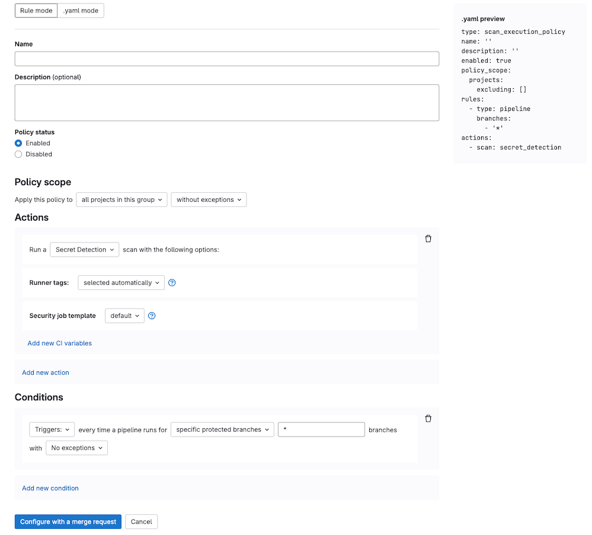



- Tier: 旗舰版
- Offering: JihuLab.com，私有化部署



扫描执行策略根据默认或最新的[安全 CI/CD 模板](https://gitlab.com/gitlab-org/gitlab/-/tree/master/lib/gitlab/ci/templates/Jobs)强制执行极狐GitLab 安全扫描。您可以将扫描执行策略作为流水线的一部分部署，或按指定计划部署。

扫描执行策略在链接到安全策略项目的所有项目中强制执行安全扫描。对于没有
`.gitlab-ci.yml` 文件的项目，或禁用了 AutoDevOps 的项目，安全策略会隐式创建
`.gitlab-ci.yml` 文件。`.gitlab-ci.yml` 文件确保运行密钥检测、
静态分析或其他不需要在项目中构建的扫描器的策略始终能够运行并得到执行。

扫描执行策略和流水线执行策略都可以跨多个项目配置极狐GitLab 安全扫描，以管理安全性和合规性。扫描执行策略配置更快，但不可自定义。
如果以下任一情况成立，请改用[流水线执行策略](pipeline_execution_policies.md)：

- 您需要高级配置设置。
- 您想强制执行自定义 CI/CD 作业或脚本。
- 您想通过强制执行的 CI/CD 作业启用第三方安全扫描。

<a id="create-a-scan-execution-policy"></a>

## 创建扫描执行策略

要创建扫描执行策略，您可以使用以下任一资源：

- 有关如何创建扫描执行策略的说明，请参阅[教程：设置扫描执行策略](../../../tutorials/scan_execution_policy/_index.md)

<a id="restrictions"></a>

## 限制

- 每个策略最多可以分配五个规则。
- 每个安全策略项目最多可以分配五个扫描执行策略。
- 本地项目 YAML 文件不能覆盖扫描执行策略。扫描执行策略优先于为流水线定义的任何配置，即使您在项目的 CI/CD 配置中使用相同的作业名称也是如此。
- 计划策略（`type: schedule`）仅按其计划的 `cadence` 执行。更新策略不会触发立即扫描。
- 您直接对 YAML 配置文件（通过提交或推送，而不是在策略编辑器中）进行的策略更新，可能需要最多 10 分钟才能在整个系统中生效。（有关此限制的拟议更改，请参阅[议题 512615](https://gitlab.com/gitlab-org/gitlab/-/issues/512615)。）

<a id="job-stages"></a>

## 作业阶段

DAST 扫描始终在 `dast` 阶段运行。如果 `dast` 阶段不存在，
则极狐GitLab 会在流水线末尾注入一个 `dast` 阶段。

所有其他扫描的策略作业在流水线的 `test` 阶段运行。
如果您从默认流水线中移除 `test` 阶段，则作业将根据以下规则在 `scan-policies` 阶段运行：

- 如果 `scan-policies` 阶段尚不存在，极狐GitLab 会在评估时将阶段注入 CI/CD 流水线。
- 如果 `build` 阶段存在，极狐GitLab 会在 `build` 阶段之后立即注入 `scan-policies`。
- 如果 `build` 阶段不存在，极狐GitLab 会在流水线开头注入 `scan-policies`。

为避免作业名称冲突，作业名称后会附加一个连字符和一个数字。每个数字都是
每个策略操作的唯一值。例如，`secret-detection` 变为 `secret-detection-1`。

<a id="scan-execution-policy-editor"></a>

## 扫描执行策略编辑器

使用扫描执行策略编辑器创建或编辑扫描执行策略。

先决条件：

- 默认情况下，只有群组、子群组或项目所有者拥有创建或分配安全策略项目所需的[权限](../../permissions.md#project-application-security)。或者，您可以创建具有[管理安全策略链接](../../custom_roles/abilities.md#security-policy-management)权限的自定义角色。

当您创建第一个扫描执行策略时，可以从这些常见用例的模板中进行选择：

- 合并请求安全
  - 用例：您希望仅在创建合并请求时运行安全扫描，而不是在每次提交时运行。
  - 使用时机：适用于使用合并请求流水线的项目，这些项目需要在针对默认或受保护分支的源分支上运行安全扫描。
  - 最适合：与合并请求批准策略保持一致，并通过避免在每个分支上进行扫描来降低基础设施成本。
  - 流水线来源：主要是合并请求流水线。
- 计划扫描
  - 用例：您希望安全扫描按计划（例如每天或每周）自动运行，无论代码是否更改。
  - 使用时机：用于按固定节奏进行安全扫描，与开发活动无关。
  - 最适合：合规性要求、基线安全监控或提交不频繁的项目。
  - 流水线来源：计划流水线。
- 发布安全
  - 用例：您希望安全扫描在您对 `main` 或发布分支的所有更改上运行。
  - 使用时机：适用于需要在发布前进行全面扫描的项目，或受保护分支上的项目。
  - 最适合：发布门控工作流、生产部署或高安全性环境。
  - 流水线来源：推送到受保护分支的流水线、发布流水线。

如果可用模板不满足您的需求，或者您需要更定制的扫描执行策略，您可以：

- 选择 **自定义** 选项并使用自定义要求创建您自己的扫描执行策略。
- 使用[流水线执行策略](pipeline_execution_policies.md)访问更多可自定义的安全扫描和 CI 强制执行选项。

策略完成后，通过选择编辑器底部的 **使用合并请求配置** 来保存策略。您将被重定向到项目配置的安全策略项目上的合并请求。如果您的项目未链接安全策略项目，极狐GitLab 会自动创建一个。您可以通过选择编辑器底部的 **删除策略** 从编辑器界面中移除现有策略。此操作会创建一个合并请求，以从您的 `policy.yml` 文件中移除该策略。

大多数策略更改在合并请求合并后立即生效。直接提交到默认分支而不是通过合并请求的任何更改需要最多 10 分钟才能生效。



> [!note]
> 对于 DAST 执行策略，在规则模式编辑器中应用站点和扫描器配置文件的方式取决于策略定义的位置：
>
> - 对于项目中的策略，在规则模式编辑器中，从项目中已定义的配置文件列表中选择。
> - 对于群组中的策略，您必须输入要使用的配置文件名称。为防止流水线错误，群组的所有项目中必须存在名称匹配的配置文件。

<a id="scan-execution-policies-schema"></a>

## 扫描执行策略 schema

包含扫描执行策略的 YAML 配置由匹配扫描执行策略 schema 的对象数组组成。对象嵌套在 `scan_execution_policy` 键下。您可以在 `scan_execution_policy` 键下配置最多五个策略。前五个之后配置的任何其他策略均不生效。

当您保存新策略时，极狐GitLab 会根据[此 JSON schema](https://gitlab.com/gitlab-org/gitlab/-/blob/master/ee/app/validators/json_schemas/security_orchestration_policy.json)验证策略内容。如果您不熟悉 [JSON schemas](https://json-schema.org/)，以下章节和表格提供了替代说明。

| 字段 | 类型 | 必填 | 可能的值 | 描述 |
|-------|------|----------|-----------------|-------------|
| `scan_execution_policy` | 扫描执行策略的 `array` | 是 |  | 扫描执行策略列表（最多 5 个） |

<a id="scan-execution-policy-schema"></a>

## 扫描执行策略 schema

| 字段          | 类型                                         | 必填 | 描述 |
|----------------|----------------------------------------------|----------|-------------|
| `name`         | `string`                                     | 是     | 策略名称。最多 255 个字符。 |
| `description`  | `string`                                     | 否    | 策略描述。 |
| `enabled`      | `boolean`                                    | 是     | 启用（`true`）或禁用（`false`）策略的标志。 |
| `rules`        | 规则的 `array`                             | 是     | 策略适用的规则列表。 |
| `actions`      | 操作的 `array`                           | 是     | 策略强制执行的操作列表。在极狐GitLab 18.0 及更高版本中限制为最多 10 个。 |
| `policy_scope` | [`policy_scope`](_index.md#configure-the-policy-scope) 的 `object` | 否    | 根据您指定的项目、群组或合规框架标记定义策略的范围。 |
| `skip_ci`      | [`skip_ci`](#skip_ci-type) 的 `object` | 否 | 定义用户是否可以应用 `skip-ci` 指令。 |
| `no_pipeline`  | [`no_pipeline`](#no_pipeline-type) 的 `object` | 否 | 定义用户是否可以应用 `no_pipeline` 指令。 |

<a id="skip_ci-type"></a>

### `skip_ci` 类型

扫描执行策略提供对谁可以使用 `[skip ci]` 指令的控制。您可以指定允许使用 `[skip ci]` 的特定用户或服务账号，同时仍确保执行关键的安全和合规检查。

使用 `skip_ci` 关键字指定是否允许用户应用 `skip_ci` 指令来跳过流水线。
当未指定该关键字时，`skip_ci` 指令将被忽略，从而阻止所有用户绕过流水线执行策略。

| 字段                   | 类型     | 可能的值          | 描述 |
|-------------------------|----------|--------------------------|-------------|
| `allowed` | `boolean`   | `true`, `false` | 允许（`true`）或阻止（`false`）在具有强制流水线执行策略的流水线中使用 `skip-ci` 指令的标志。 |
| `allowlist`             | `object` | `users` | 指定无论 `allowed` 标志如何，始终允许使用 `skip-ci` 指令的用户。使用 `users:` 后跟一个对象数组，其中 `id` 键表示用户 ID。 |

> [!note]
> 具有 `schedule` 规则类型的扫描执行策略始终忽略 `skip_ci` 选项。无论最后一次提交消息中是否出现 `[skip ci]`（或其任何变体），计划扫描都会在其配置的时间运行。这确保了即使 CI/CD 流水线被跳过，安全扫描也会按可预测的计划进行。

<a id="no_pipeline-type"></a>

### `no_pipeline` 类型

扫描执行策略提供对谁可以使用 `[no_pipeline]` 指令的控制。您可以指定允许使用 `[no_pipeline]` 的特定用户或服务账号，同时仍确保执行关键的安全和合规检查。

使用 `no_pipeline` 关键字指定是否允许用户应用 `no_pipeline` 指令以在推送时不创建流水线。
当未指定该关键字时，`no_pipeline` 指令将被忽略，从而阻止所有用户绕过流水线执行策略。

| 字段                   | 类型     | 可能的值          | 描述 |
|-------------------------|----------|--------------------------|-------------|
| `allowed` | `boolean`   | `true`, `false` | 允许（`true`）或阻止（`false`）在具有强制流水线执行策略的流水线中使用 `no_pipeline` 指令的标志。 |
| `allowlist`             | `object` | `users` | 指定无论 `allowed` 标志如何，始终允许使用 `no_pipeline` 指令的用户。使用 `users:` 后跟一个对象数组，其中 `id` 键表示用户 ID。 |

> [!note]
> 具有 `schedule` 规则类型的扫描执行策略始终忽略 `no_pipeline` 选项。无论最后一次提交消息中是否出现 `[no_pipeline]`（或其任何变体），计划扫描都会在其配置的时间运行。这确保了即使不创建 CI/CD 流水线，安全扫描也会按可预测的计划进行。

<a id="pipeline-rule-type"></a>

## `pipeline` 规则类型

只要所选分支的流水线运行，此规则就会强制执行定义的操作。

| 字段 | 类型 | 必填 | 可能的值 | 描述 |
|-------|------|----------|-----------------|-------------|
| `type` | `string` | 是 | `pipeline` | 规则的类型。 |
| `branches` <sup>1</sup> | `string` 的 `array` | 如果 `branch_type` 字段不存在则为是 | `*` 或分支名称 | 给定策略适用的分支（支持通配符）。为与合并请求批准策略兼容，您应针对所有分支以在功能分支和默认分支中包含扫描 |
| `branch_type` <sup>1</sup> | `string` | 如果 `branches` 字段不存在则为是 | `default`, `protected`, `all`, `target_default` <sup>2</sup>, 或 `target_protected` <sup>2</sup> | 给定策略适用的分支类型。 |
| `branch_exceptions` | `string` 的 `array` | 否 |  分支名称 | 要从该规则中排除的分支。 |
| `pipeline_sources` <sup>2</sup> | `object` | 否 | `api`, `chat`, `external`, `external_pull_request_event`, `merge_request_event` <sup>3</sup>, `pipeline`, `push` <sup>3</sup>, `schedule`, `trigger`, `unknown`, `web` | 一个对象，其 `including` 键设置为流水线来源数组，这些来源决定扫描执行作业何时触发。有关更多信息，请参阅[`CI_PIPELINE_SOURCE` 预定义变量](../../../ci/jobs/job_rules.md#ci_pipeline_source-predefined-variable)。 |

1. 您必须指定 `branches` 或 `branch_type` 之一，但不能同时指定两者。
1. 某些选项仅在启用 `flexible_scan_execution` 功能标志时可用。有关详细信息，请参阅历史记录。
1. 当指定 `branch_type` 选项 `target_default` 或 `target_protected` 时，`pipeline_sources:including` 字段仅支持 `merge_request_event` 和 `push` 字段。

<a id="schedule-rule-type"></a>

## `schedule` 规则类型

使用 `schedule` 规则类型按计划运行安全扫描器。

计划流水线：

- 仅运行策略中定义的扫描器，而不运行项目 `.gitlab-ci.yml` 文件中定义的作业。
- 根据 `cadence` 字段中定义的计划运行。
- 在项目中的 `security_policy_bot` 用户账号下运行，该账号具有访客角色以及创建流水线和从 CI/CD 作业读取代码仓库内容的权限。此账号在策略链接到群组或项目时创建。
- 在 JihuLab.com 上，扫描执行策略中仅强制执行前 10 个 `schedule` 规则。超过限制的规则无效。

| 字段      | 类型 | 必填 | 可能的值 | 描述 |
|------------|------|----------|-----------------|-------------|
| `type`     | `string` | 是 | `schedule` | 规则的类型。 |
| `branches` <sup>1</sup> | `string` 的 `array` | 如果 `branch_type` 或 `agents` 字段均不存在则为是 | `*` 或分支名称 | 给定策略适用的分支（支持通配符）。 |
| `branch_type` <sup>1</sup> | `string` | 如果 `branches` 或 `agents` 字段均不存在则为是 | `default`, `protected`, 或 `all` | 给定策略适用的分支类型。 |
| `branch_exceptions` | `string` 的 `array` | 否 |  分支名称 | 要从该规则中排除的分支。 |
| `cadence`  | `string` | 是 | 具有有限选项的 Cron 表达式。例如，`0 0 * * *` 创建每天午夜（12:00 AM）运行的计划。 | 包含五个字段的空白分隔字符串，表示计划时间。 |
| `timezone` | `string` | 否 | 时区标识符（例如，`America/New_York`） | 应用于 cadence 的时区。值必须是 IANA 时区数据库标识符。 |
| `time_window` | `object` | 否 |  | 计划安全扫描的分布和持续时间设置。 |
| `agents` <sup>1</sup>   | `object` | 如果 `branch_type` 或 `branches` 字段均不存在则为是   |  | 运行[操作容器扫描](../../clusters/agent/vulnerabilities.md)的 [Kubernetes 的极狐GitLab Agent](../../clusters/agent/_index.md) 的名称。对象键是为您的项目在极狐GitLab 中配置的 Kubernetes Agent 的名称。 |

1. 您必须仅指定 `branches`、`branch_type` 或 `agents` 之一。

<a id="cadence"></a>

### Cadence

使用 `cadence` 字段来安排您希望策略操作运行的时间。`cadence` 字段
使用 [cron 语法](../../../topics/cron/_index.md)，但有一些限制：

- 仅支持以下类型的 cron 语法：
  - 在指定时间附近每小时一次的每日 cadence，例如：`0 18 * * *`
  - 在指定日期和指定时间附近每周一次的每周 cadence，例如：`0 13 * * 0`
- 分钟和小时不支持使用逗号 (,)、连字符 (-) 或步进运算符 (/)。任何使用这些字符的计划流水线都将被跳过。

为 `cadence` 字段选择值时，请考虑以下事项：

- 对于 JihuLab.com，时间基于 UTC；对于极狐GitLab 私有化部署，时间基于极狐GitLab 主机的系统时间。测试新策略时，流水线可能看起来在错误的时间运行，因为它们是按服务器的时区（而非您的本地时区）调度的。
- 计划流水线在创建它所需的资源可用之前不会启动。换句话说，流水线可能不会在策略中指定的时间精确开始。

将 `schedule` 规则类型与 `agents` 字段一起使用时：

- Kubernetes 的极狐GitLab Agent 每 30 秒检查一次是否有适用的策略。当 Agent 找到策略时，扫描将根据定义的 `cadence` 执行。
- cron 表达式使用 Kubernetes Agent pod 的系统时间进行评估。

将 `schedule` 规则类型与 `branches` 字段一起使用时：

- cron worker 以 15 分钟为间隔运行，并启动任何计划在前 15 分钟内运行的流水线。因此，计划流水线的运行时间可能偏移最多 15 分钟。
- 如果策略在大量项目或分支上强制执行，则该策略将分批处理，并且可能需要一些时间才能创建所有流水线。


<a id="agent-schema"></a>

### `agent` schema

使用此 schema 在 [`schedule` 规则类型](#schedule-rule-type)中定义 `agents` 对象。

| 字段        | 类型                | 必填 | 描述 |
|--------------|---------------------|----------|-------------|
| `namespaces` | `string` 的 `array` | 是 | 被扫描的命名空间。如果为空，则扫描所有命名空间。 |

<a id="agent-example"></a>

#### `agent` 示例

```yaml
- name: Enforce container scanning in cluster connected through my-gitlab-agent for default and kube-system namespaces
  enabled: true
  rules:
  - type: schedule
    cadence: '0 10 * * *'
    agents:
      <agent-name>:
        namespaces:
        - 'default'
        - 'kube-system'
  actions:
  - scan: container_scanning
```

计划规则的键是：

- `cadence`（必填）：扫描运行时间的 [Cron 表达式](../../../topics/cron/_index.md)。
- `agents:<agent-name>`（必填）：用于扫描的 Agent 名称。
- `agents:<agent-name>:namespaces`（可选）：要扫描的 Kubernetes 命名空间。如果省略，则扫描所有命名空间。

<a id="time_window-schema"></a>

### `time_window` schema

使用 [`schedule` 规则类型](#schedule-rule-type)中的 `time_window` 对象定义计划扫描如何随时间分布。您只能在策略编辑器的 YAML 模式下配置 `time_window`。

| 字段          | 类型      | 必填 | 描述                                                                                                                                                                          |
|----------------|-----------|----------|--------------------------------------------------------------------------------------------------------------------------------------------------------------------------------------|
| `distribution` | `string`  | 是     | 计划扫描的分布模式。仅支持 `random`，即扫描在 `time_window` 的 `value` 键定义的间隔内随机分布。 |
| `value`        | `integer` | 是     | 计划扫描应运行的时间窗口（以秒为单位）。输入介于 3600（1 小时）和 2629746（约 30 天）之间的值。                                               |

<a id="time_window-example"></a>

#### `time_window` 示例

```yaml
- name: Enforce container scanning with a time window of 1 hour
  enabled: true
  rules:
  - type: schedule
    cadence: '0 10 * * *'
    time_window:
      value: 3600
      distribution: random
  actions:
  - scan: container_scanning
```

<a id="optimize-scheduled-pipelines-for-projects-at-scale"></a>

### 优化大规模项目的计划流水线

当策略在多个项目和分支上强制执行计划流水线时，流水线会同时运行。每个项目中计划流水线的首次执行会创建一个安全机器人用户，负责执行该项目的计划。

为优化大规模项目的性能：

- 逐步推出计划扫描执行策略，从项目子集开始。您可以利用安全策略范围来定位特定群组、项目或包含给定合规框架标记的项目。
- 您可以配置策略，使计划在具有指定 `tag` 的 Runner 上运行。考虑在每个项目中设置专用 Runner 来处理策略强制的计划，以减少对其他 Runner 的影响。
- 在部署到生产环境之前，在预发布或较低环境中测试您的实现。监控性能并根据结果调整您的推出计划。

<a id="configuring-the-maximum-scheduling-timespan-for-scheduled-scan-execution-policies"></a>

### 配置计划扫描执行策略的最大调度时间跨度

计划扫描执行策略支持使用带有 cron 表达式的 `cadence` 字段进行月度调度。您可以将 `time_window` 配置为最多 2629746 秒（约 30 天），以在该时间段内随机分布扫描。

例如，要安排每月扫描并设置 30 天的分布窗口：

```yaml
rules:
  - type: schedule
    cadence: '0 0 1 * *'  # Run on the first day of each month
    time_window:
      value: 2592000  # 30 days in seconds
      distribution: random
```

<a id="understanding-scheduled-scans-during-instance-downtimes"></a>

#### 了解实例停机期间的计划扫描

计划扫描会跟踪其下次执行时间。成功扫描后，系统会更新下次扫描的运行时间。如果极狐GitLab 实例在计划扫描时间不可用（由于维护、中断或重启），系统会识别本应已执行但尚未执行的扫描，并在实例可用时创建流水线。

<a id="deleting-projects-with-scheduled-scans"></a>

#### 删除具有计划扫描的项目

当您删除项目时，所有关联的计划扫描也会被删除。已删除的项目不会运行任何流水线。

<a id="canceling-a-running-scheduled-scan"></a>

#### 取消正在运行的计划扫描

要取消计划扫描，您有两个选择：

- 取消单个流水线：如果您拥有取消项目中作业的必要权限，您可以直接从流水线视图取消正在运行的流水线。
- **禁用策略**：在策略编辑器中设置 `enabled: false` 以禁用扫描执行策略。已经正在运行或计划在接下来约 15 分钟内运行的扫描可能仍会执行。

<a id="recommendations-for-large-scale-deployments"></a>

#### 大规模部署的建议

当您在多个项目中部署计划扫描执行策略时，请考虑以下建议：

- 使用渐进式推出：从一小部分项目开始，然后逐渐添加更多项目。使用[合规框架标记](../../project/working_with_projects.md#add-a-compliance-framework-to-a-project)将策略范围限定到特定的项目组。
- 配置 `time_window`：始终在您的计划策略中设置 `time_window` 参数。没有它，所有流水线都计划在同一时间，这可能导致性能问题和资源争用。
- 在预发布环境测试：在部署到生产环境之前，在预发布环境或较低环境中验证您的策略配置。监控性能并根据结果进行调整。
- 考虑 Runner 容量：对 Runner 的影响取决于您的策略配置、Runner 可用性和极狐GitLab 实例部署。配置策略以使用具有特定标签的 Runner 来分散负载。

有关优化计划扫描的更多信息，请参阅[优化大规模项目的计划流水线](#optimize-scheduled-pipelines-for-projects-at-scale)。

<a id="concurrency-control"></a>

### 并发控制

当您设置 `time_window` 属性时，极狐GitLab 会应用并发控制。

并发控制根据策略中定义的 [`time_window` 设置](#time_window-schema) 分布计划流水线。

<a id="scan-action-type"></a>

## `scan` 操作类型

当定义策略中至少一个规则的条件满足时，此操作使用附加参数执行选定的 `scan`。

| 字段 | 类型 | 可能的值 | 描述 |
|-------|------|-----------------|-------------|
| `scan` | `string` | `sast`, `sast_iac`, `dast`, `secret_detection`, `container_scanning`, `dependency_scanning` | 操作的类型。 |
| `site_profile` | `string` | 所选 [DAST 站点配置文件](../dast/profiles.md#site-profile)的名称。 | 执行 DAST 扫描的 DAST 站点配置文件。仅当 `scan` 类型为 `dast` 时才应设置此字段。 |
| `scanner_profile` | `string` 或 `null` | 所选 [DAST 扫描器配置文件](../dast/profiles.md#scanner-profile)的名称。 | 执行 DAST 扫描的 DAST 扫描器配置文件。仅当 `scan` 类型为 `dast` 时才应设置此字段。 |
| `variables` | `object` | | 一组 CI/CD 变量，以 `key: value` 对数组形式提供，用于应用和强制执行所选扫描。`key` 是变量名，其 `value` 以字符串形式提供。此参数支持极狐GitLab CI/CD 作业为指定扫描支持的任何变量。 |
| `tags` | `string` 的 `array` | | 策略的 Runner 标签列表。策略作业由具有指定标签的 Runner 运行。 |
| `template` | `string` | `default`, `latest`, 或扫描器特定版本 | 要强制执行的 CI/CD 模板版本。`default` 使用稳定模板。`latest` 使用实验性模板，可能包含破坏性更改 - 它不是当前推荐的版本。某些扫描器还支持代表推荐配置的版本化模板。`latest` 模板仅支持与合并请求相关的 `pipeline_sources`。有关每个扫描器的可用版本，请参阅[扫描器模板版本](#scanner-template-versions)。 |
| `scan_settings` | `object` | | 一组扫描设置，以 `key: value` 对数组形式提供，用于应用和强制执行所选扫描。`key` 是设置名称，其 `value` 以布尔值或字符串形式提供。此参数支持[扫描设置](#scan-settings)中定义的设置。 |

> [!note]
> 如果为您的项目启用了合并请求流水线，则必须在策略中为每个强制执行的扫描将 `AST_ENABLE_MR_PIPELINES` CI/CD 变量设置为 `"true"`。有关将安全扫描工具与合并请求流水线一起使用的更多信息，请参阅[安全扫描文档](../detect/security_configuration.md#use-security-scanning-tools-with-merge-request-pipelines)。

<a id="scanner-template-versions"></a>

### 扫描器模板版本

`template` 字段接受所有扫描器类型的 `default` 和 `latest`。某些扫描器支持额外的版本化模板。推荐的默认值因扫描器而异 - 在设置此字段之前，请查阅扫描器文档。

| 扫描器 | 支持的模板 | 文档 |
|---------|---------------------|---------------|
| `sast` | `default`, `latest` | [稳定版与最新版 SAST 模板](../sast/_index.md#stable-vs-latest-sast-templates) |
| `sast_iac` | `default`, `latest` | [模板版本](../detect/security_configuration.md#template-editions) |
| `secret_detection` | `default`, `latest` | [模板版本](../detect/security_configuration.md#template-editions) |
| `container_scanning` | `default`, `latest` | [模板版本](../detect/security_configuration.md#template-editions) |
| `dependency_scanning` | `default`, `latest`, `v2` | [使用 SBOM 进行依赖扫描](../dependency_scanning/dependency_scanning_sbom/_index.md) |

<a id="scanner-behavior"></a>

### 扫描器行为

某些扫描器在 `scan` 操作中的行为与在常规 CI/CD 流水线扫描中的行为不同：

- 静态应用安全测试（SAST）：仅当代码仓库包含 [SAST 支持的文件](../sast/_index.md#supported-languages-and-frameworks)时才运行。
- 密钥检测：
  - 默认仅支持默认规则集中的规则。
  - 要自定义规则集配置，请执行以下任一操作：
    - 修改默认规则集。使用扫描执行策略指定 `SECRET_DETECTION_RULESET_GIT_REFERENCE` CI/CD 变量。默认情况下，此变量指向一个[远程配置文件](../secret_detection/pipeline/configure.md#with-a-remote-ruleset)，该文件仅覆盖或禁用默认规则集中的规则。仅使用此变量不支持扩展或替换默认规则集。
    - [扩展](../secret_detection/pipeline/configure.md#extend-the-default-ruleset)或[替换](../secret_detection/pipeline/configure.md#replace-the-default-ruleset)默认规则集。使用扫描执行策略指定 `SECRET_DETECTION_RULESET_GIT_REFERENCE` CI/CD 变量，以及使用 [Git passthrough](../secret_detection/pipeline/custom_rulesets_schema.md#passthrough-types) 扩展或替换默认规则集的远程配置文件。有关详细指南，请参阅[如何设置集中管理的流水线密钥检测配置](https://support.gitlab.com/hc/en-us/articles/18863735262364-How-to-set-up-a-centrally-managed-pipeline-secret-detection-configuration-applied-via-Scan-Execution-Policy)。
  - 对于 `scheduled` 扫描执行策略，密钥检测默认以 `historic` 模式（`SECRET_DETECTION_HISTORIC_SCAN` = `true`）首先运行。所有后续计划扫描以默认模式运行，并将 `SECRET_DETECTION_LOG_OPTIONS` 设置为上次运行与当前 SHA 之间的提交范围。您可以通过在扫描执行策略中指定 CI/CD 变量来覆盖此行为。有关更多信息，请参阅[完整历史流水线密钥检测](../secret_detection/pipeline/_index.md#run-a-historic-scan)。
  - 对于 `triggered` 扫描执行策略，密钥检测的工作方式与[在 `.gitlab-ci.yml` 中手动配置](../secret_detection/pipeline/_index.md#edit-the-gitlab-ciyml-file-manually)的常规扫描相同。
- 容器扫描：为 `pipeline` 规则类型配置的扫描会忽略 `agents` 对象中定义的 Agent。`agents` 对象仅针对 `schedule` 规则类型考虑。必须为项目创建并配置在 `agents` 对象中提供名称的 Agent。

<a id="dast-profiles"></a>

### DAST 配置文件

强制执行动态应用安全测试（DAST）时，适用以下要求：

- 策略范围内的每个项目都必须存在指定的 [站点配置文件](../dast/profiles.md#site-profile) 和 [扫描器配置文件](../dast/profiles.md#scanner-profile)。如果这些不可用，则策略不生效，而是创建一个包含错误消息的作业。
- 当启用的扫描执行策略中指定了 DAST 站点配置文件或扫描器配置文件时，该配置文件无法修改或删除。要编辑或删除该配置文件，您必须先在策略编辑器中将该策略设置为 **已禁用**，或在 YAML 模式下设置 `enabled: false`。
- 配置具有计划 DAST 扫描的策略时，安全策略项目代码仓库中提交的作者必须有权访问扫描器和站点配置文件。否则，扫描无法成功计划。

<a id="scan-settings"></a>

### 扫描设置

`scan_settings` 参数支持以下设置：

| 设置 | 类型 | 必填 | 可能的值 | 默认值 | 描述 |
|-------|------|----------|-----------------|-------------|-----------|
| `ignore_default_before_after_script` | `boolean` | 否 | `true`, `false` | `false` | 指定是否从扫描作业中排除流水线配置中的任何默认 `before_script` 和 `after_script` 定义。 |

<a id="cicd-variables"></a>

## CI/CD 变量

> [!warning]
> 不要将敏感信息或凭据存储在变量中，因为它们作为明文策略配置的一部分存储在 Git 代码仓库中。

扫描执行策略中定义的变量遵循标准的 [CI/CD 变量优先级](../../../ci/variables/_index.md#cicd-variable-precedence)。

对于强制执行扫描执行策略的任何项目，以下 CI/CD 变量使用预配置值。只有策略可以覆盖这些值。群组或项目 CI/CD 变量不能覆盖这些变量：

```plaintext
DS_EXCLUDED_PATHS: '**/spec,**/test,**/tests,**/tmp,**/node_modules,**/.bundle,**/vendor,**/.git'
SAST_EXCLUDED_PATHS: spec, test, tests, tmp
SECRET_DETECTION_EXCLUDED_PATHS: ''
SECRET_DETECTION_HISTORIC_SCAN: false
SAST_EXCLUDED_ANALYZERS: ''
DEFAULT_SAST_EXCLUDED_PATHS: spec, test, tests, tmp
DS_EXCLUDED_ANALYZERS: ''
SECURE_ENABLE_LOCAL_CONFIGURATION: true
```

<a id="policy-scope-schema"></a>

## 策略范围 schema

要自定义策略执行，您可以定义策略的范围以包含或排除指定的项目、群组或合规框架标记。有关更多详细信息，请参阅[范围](_index.md#configure-the-policy-scope)。

> [!note]
> 将 `policy_scope` 字段设置为空集合（例如，`including: []`）与省略该字段的处理方式相同，因此该策略适用于该范围维度的所有项目。要完全禁用策略，请使用 `enabled: false`。有关更多详细信息，请参阅[`policy_scope` 中的空集合](_index.md#empty-collections-in-policy_scope)。

<a id="policy-update-propagation"></a>

## 策略更新传播

当您更新策略时，更改的传播方式取决于您如何更新策略：

- 通过[安全策略项目](../_index.md)上的合并请求：更改在合并请求合并后立即生效。
- 直接提交到 `.gitlab/security-policies/policy.yml`：更改可能需要最多 10 分钟才能生效。

<a id="triggering-behavior"></a>

### 触发行为

对基于流水线的策略（`type: pipeline`）的更新不会触发立即的流水线，也不会影响已在进行中的流水线。策略更改适用于未来的流水线运行。

您无法在其计划 cadence 之外手动触发计划策略中的规则。

<a id="example-security-policy-project"></a>

## 示例安全策略项目

您可以在存储在[安全策略项目](enforcement/security_policy_projects.md)中的 `.gitlab/security-policies/policy.yml` 文件中使用此示例：

```yaml
---
scan_execution_policy:
- name: Enforce DAST in every release pipeline
  description: This policy enforces pipeline configuration to have a job with DAST scan for release branches
  enabled: true
  rules:
  - type: pipeline
    branches:
    - release/*
  actions:
  - scan: dast
    scanner_profile: Scanner Profile A
    site_profile: Site Profile B
- name: Enforce DAST and secret detection scans every 10 minutes
  description: This policy enforces DAST and secret detection scans to run every 10 minutes
  enabled: true
  rules:
  - type: schedule
    branches:
    - main
    cadence: "*/10 * * * *"
  actions:
  - scan: dast
    scanner_profile: Scanner Profile C
    site_profile: Site Profile D
  - scan: secret_detection
    scan_settings:
      ignore_default_before_after_script: true
- name: Enforce secret detection and container scanning in every default branch pipeline
  description: This policy enforces pipeline configuration to have a job with secret detection and container scanning scans for the default branch
  enabled: true
  rules:
  - type: pipeline
    branches:
    - main
  actions:
  - scan: secret_detection
  - scan: sast
    variables:
      SAST_EXCLUDED_ANALYZERS: brakeman
  - scan: container_scanning
```

在此示例中：

- 对于在与 `release/*` 通配符匹配的分支（例如，分支 `release/v1.2.1`）上执行的每个流水线
  - DAST 扫描使用 `Scanner Profile A` 和 `Site Profile B` 运行。
- DAST 和密钥检测扫描每 10 分钟运行一次。DAST 扫描使用 `Scanner Profile C` 和 `Site Profile D` 运行。
- 密钥检测、容器扫描和 SAST 扫描在 `main` 分支上执行的每个流水线中运行。SAST 扫描使用设置为 `"brakeman"` 的 `SAST_EXCLUDED_ANALYZER` 变量运行。

<a id="example-for-scan-execution-policy-editor"></a>

## 扫描执行策略编辑器示例

您可以在[扫描执行策略编辑器](#scan-execution-policy-editor)的 YAML 模式下使用此示例。它对应于上一个示例中的单个对象。

```yaml
name: Enforce secret detection and container scanning in every default branch pipeline
description: This policy enforces pipeline configuration to have a job with secret detection and container scanning scans for the default branch
enabled: true
rules:
  - type: pipeline
    branches:
      - main
actions:
  - scan: secret_detection
  - scan: container_scanning
```

<a id="avoiding-duplicate-scans"></a>

## 避免重复扫描

如果您在项目的 `.gitlab-ci.yml` 文件中包含扫描作业，扫描执行策略可能导致相同类型的扫描器运行多次。

重复扫描是有意运行的，因为扫描器可以使用不同的变量和设置运行多次。例如，您可能使用与策略强制执行的变量不同的变量运行 SAST 扫描。在这种情况下，流水线中会运行两个 SAST 作业：

- 一个使用自定义变量。
- 一个使用策略强制执行的变量。

为防止重复扫描，您可以从项目的 `.gitlab-ci.yml` 文件中移除其中一个扫描，或使用变量跳过本地作业。跳过作业不会阻止扫描执行策略定义的任何安全作业运行。

要使用变量跳过扫描作业，您可以使用：

- `SAST_DISABLED: "true"` 跳过 SAST 作业。
- `DAST_DISABLED: "true"` 跳过 DAST 作业。
- `CONTAINER_SCANNING_DISABLED: "true"` 跳过容器扫描作业。
- `SECRET_DETECTION_DISABLED: "true"` 跳过密钥检测作业。
- `DEPENDENCY_SCANNING_DISABLED: "true"` 跳过依赖扫描作业。

有关所有可以跳过作业的变量的概述，请参阅 [CI/CD 变量文档](../../../topics/autodevops/cicd_variables.md#job-skipping-variables)

<a id="troubleshooting"></a>

## 故障排查

在使用扫描执行策略时，您可能会遇到以下问题。

<a id="scan-execution-policy-pipelines-are-not-created"></a>

### 未创建扫描执行策略流水线

如果扫描执行策略未按预期创建 `type: pipeline` 中定义的流水线，则项目的 `.gitlab-ci.yml` 文件中可能存在阻止策略创建流水线的 [`workflow:rules`](../../../ci/yaml/workflow.md)。

具有 `type: pipeline` 规则的扫描执行策略依赖合并后的 CI/CD 配置来创建流水线。如果项目的 `workflow:rules` 完全过滤掉流水线，则扫描执行策略无法创建流水线。

例如，以下 `workflow:rules` 配置阻止创建所有流水线：

```yaml
# .gitlab-ci.yml
workflow:
  rules:
  - if: $CI_PIPELINE_SOURCE == "push"
    when: never
```

解决方法：

要解决此问题，您可以使用以下任一选项：

- 修改项目 `.gitlab-ci.yml` 文件中的 `workflow:rules`，以允许扫描执行策略创建流水线。您可以使用 `$CI_PIPELINE_SOURCE` 变量来识别由策略触发的流水线：

  ```yaml
  workflow:
    rules:
    - if: $CI_PIPELINE_SOURCE == "security_orchestration_policy"
    - if: $CI_PIPELINE_SOURCE == "push"
      when: never
  ```

- 使用 `type: schedule` 规则而不是 `type: pipeline` 规则。计划扫描执行策略不受 `workflow:rules` 的影响，并根据其定义的计划创建流水线。
- 使用[流水线执行策略](pipeline_execution_policies.md)以更精细地控制安全扫描在您的 CI/CD 流水线中的执行时间和方式。
