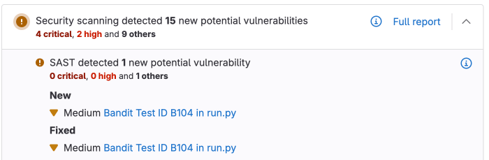
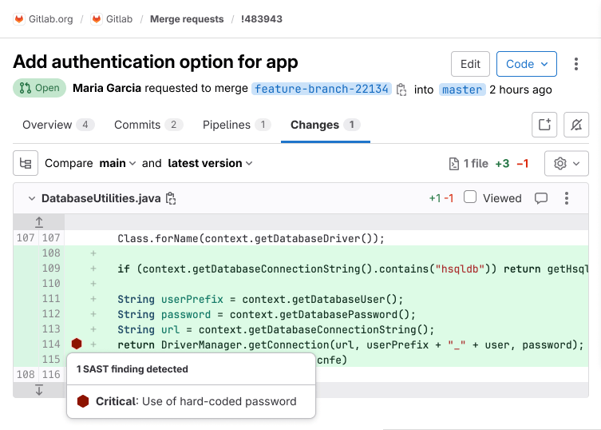

<style>
table.sast-table tr:nth-child(even) {
    background-color: transparent;
}

table.sast-table td {
    border-left: 1px solid #dbdbdb;
    border-right: 1px solid #dbdbdb;
    border-bottom: 1px solid #dbdbdb;
}

table.sast-table tr td:first-child {
    border-left: 0;
}

table.sast-table tr td:last-child {
    border-right: 0;
}

table.sast-table ul {
    font-size: 1em;
    list-style-type: none;
    padding-left: 0px;
    margin-bottom: 0px;
}

table.no-vertical-table-lines td {
    border-left: none;
    border-right: none;
    border-bottom: 1px solid #f0f0f0;
}

table.no-vertical-table-lines tr {
    border-top: none;
}
</style>



- Tier: 基础版，专业版，旗舰版
- Offering: JihuLab.com，私有化部署



静态应用安全测试 (SAST) 在源代码投入生产环境之前发现其中的漏洞。SAST 直接集成到你的 CI/CD 流水线中，在开发阶段识别安全问题，此时修复最方便且最具成本效益。

开发后期发现的安全漏洞会导致代价高昂的延误和潜在的入侵。SAST 扫描会在每次提交时自动进行，在不打乱你工作流程的前提下提供即时反馈。

## 使用极狐GitLab Duo 减少误报并解决漏洞



- Tier: 旗舰版



SAST 扫描器可能产生误报，从而在你的漏洞报告中产生干扰。极狐GitLab Duo 能辅助进行漏洞管理。

### 误报检测

[极狐GitLab Duo 误报检测](../vulnerabilities/false_positive_detection.md) 会自动分析严重和高危 SAST 漏洞，以识别可能的误报。这有助于你的安全团队专注于真正的漏洞，并减少手动分类所花费的时间。

对于拥有极狐GitLab Duo 附加组件的旗舰版客户，误报检测会在每次安全扫描后自动运行，并为每项评估提供置信度评分和解释。

### Agentic SAST 漏洞解决

[Agentic SAST 漏洞解决](../vulnerabilities/agentic_vulnerability_resolution.md) 功能会自动为高危和严重级别的 SAST 漏洞生成包含上下文感知代码修复的合并请求。这种 Agentic 方式利用多步推理，用最少的人工干预解决漏洞。

对于旗舰版客户，当漏洞满足特定条件时，Agentic 漏洞解决方案会在每次安全扫描后自动运行。

## 功能

下表列出了各项功能在极狐GitLab 各版本中的可用情况。

| 功能                                                                                                                          | 基础版 & 专业版 | 旗舰版 |
|:---------------------------------------------------------------------------------------------------------------------------------|:------------------|:------------|
| 使用[开源分析器](#supported-languages-and-frameworks)进行基础扫描                                                 |        |  |
| 可下载的 [SAST JSON 报告](#download-a-sast-report)                                                                         |        |  |
| 使用[极狐GitLab 高级 SAST](gitlab_advanced_sast.md) 进行跨文件、跨功能扫描                                         |         |  |
| [合并请求组件](#merge-request-widget)中的新发现                                                                    |         |  |
| [合并请求变更视图](#merge-request-changes-view)中的新发现                                                        |         |  |
| [漏洞管理](../vulnerabilities/_index.md)                                                                         |         |  |
| [极狐GitLab Duo 误报检测](../vulnerabilities/false_positive_detection.md) （需要极狐GitLab Duo 附加组件）               |         |  |
| [Agentic SAST 漏洞解决](../vulnerabilities/agentic_vulnerability_resolution.md) |         |  |
| [基于 UI 的扫描器配置](#enable-sast-by-using-the-ui)                                                                   |         |  |
| [规则集定制](customize_rulesets.md)                                                                                   |         |  |
| [高级漏洞跟踪](#advanced-vulnerability-tracking)                                                              |         |  |

## 入门

通过使用 UI 或编辑项目的极狐GitLab CI/CD 配置文件，在你的项目中启用 SAST。

> [!note]
> 默认情况下，SAST 仅在分支流水线中运行。要在合并请求流水线中运行 SAST，请参阅
> [在合并请求流水线中使用安全扫描工具](../detect/security_configuration.md#use-security-scanning-tools-with-merge-request-pipelines)。

### 通过 UI 启用 SAST



- Tier: 旗舰版
- Offering: JihuLab.com，私有化部署





- 在极狐GitLab 16.2 中，从 UI [移除](https://gitlab.com/gitlab-org/gitlab/-/issues/410013)了独立的 SAST 分析器配置选项。



你可以通过 UI 启用和配置 SAST，可以使用默认设置或进行定制。你可以使用的方法取决于你的极狐GitLab 许可证版本。

> [!note]
> UI 配置方法最适合于没有或仅有少量 `.gitlab-ci.yml` 文件的情况。如果你有一个复杂的配置，该工具可能无法解析它。这种情况下，请改为
> [编辑 CI/CD 文件](#enable-sast-by-editing-the-cicd-file)。

#### 通过定制启用 SAST

先决条件：

- 在项目中具有维护者或所有者角色。
- 使用 Docker 或 Kubernetes 执行器的基于 Linux 的极狐GitLab Runner。如果你使用的是 JihuLab.com 的托管 Runner，则默认启用 Docker 或 Kubernetes 执行器。
  - 不支持 Windows Runner 上的极狐GitLab Runner。
  - 不支持 AMD64 以外的 CPU 架构。
- 极狐GitLab CI/CD 配置（`.gitlab-ci.yml`）必须包含 `test` 阶段，该阶段默认包含。如果你在 `.gitlab-ci.yml` 文件中重新定义了阶段，则 `test` 阶段是必需的。

要启用并定制 SAST：

1. 在顶部栏中，选择 **搜索或跳转到** 并找到你的项目。
1. 在左侧边栏中，选择 **安全** > **安全配置**。
1. 如果项目默认分支的最新流水线已完成并生成了有效的 SAST 产物，则选择 **配置 SAST**，否则在静态应用安全测试 (SAST) 行中选择 **启用 SAST**。
1. 输入定制的 SAST 值。

   定制值存储在 `.gitlab-ci.yml` 文件中。对于不在 SAST 配置页面的 CI/CD 变量，其值从极狐GitLab SAST 模板继承。
1. 选择 **创建合并请求**。
1. 审查并合并该合并请求。

流水线现在包含一个 SAST 作业。如果存在支持的源代码，则适当的分析器和默认规则会在流水线运行时自动扫描漏洞。相应的作业会出现在项目流水线的 `test` 阶段下。

#### 仅使用默认设置启用 SAST

先决条件：

- 在项目中具有维护者或所有者角色。
- 使用 Docker 或 Kubernetes 执行器的基于 Linux 的极狐GitLab Runner。如果你使用的是 JihuLab.com 的托管 Runner，则默认启用 Docker 或 Kubernetes 执行器。
  - 不支持 Windows Runner 上的极狐GitLab Runner。
  - 不支持 AMD64 以外的 CPU 架构。
- 极狐GitLab CI/CD 配置（`.gitlab-ci.yml`）必须包含 `test` 阶段，该阶段默认包含。如果你在 `.gitlab-ci.yml` 文件中重新定义了阶段，则 `test` 阶段是必需的。

要使用默认设置启用和配置 SAST：

1. 在顶部栏中，选择 **搜索或跳转到** 并找到你的项目。
1. 在左侧边栏中，选择 **安全** > **安全配置**。
1. 在 SAST 部分，选择 **使用合并请求配置**。

   合并请求页面将打开。
1. 填写字段。
1. 选择 **创建合并请求**。
1. 审查并合并此合并请求以启用 SAST。

流水线现在包含一个 SAST 作业。如果存在支持的源代码，则适当的分析器和默认规则会在流水线运行时自动扫描漏洞。相应的作业会出现在项目流水线的 `test` 阶段下。

### 通过编辑 CI/CD 文件启用 SAST

先决条件：

- 在项目中具有开发者、维护者或所有者角色。
- 使用 Docker 或 Kubernetes 执行器的基于 Linux 的极狐GitLab Runner。如果你使用的是 JihuLab.com 的托管 Runner，则默认启用 Docker 或 Kubernetes 执行器。
  - 不支持 Windows Runner 上的极狐GitLab Runner。
  - 不支持 AMD64 以外的 CPU 架构。
- 极狐GitLab CI/CD 配置（`.gitlab-ci.yml`）必须包含 `test` 阶段，该阶段默认包含。如果你在 `.gitlab-ci.yml` 文件中重新定义了阶段，则 `test` 阶段是必需的。

要在你的项目中启用 SAST：

1. 在顶部栏中，选择 **搜索或跳转到** 并找到你的项目。
1. 进入 **构建** > **流水线** 编辑器。
1. 添加 SAST CI/CD 模板或组件。

   要使用模板，请添加以下行：

   ```yaml
   include:
     - template: Jobs/SAST.gitlab-ci.yml
   ```

   要使用 CI/CD 组件，请添加以下行：

   ```yaml
   include:
     - component: gitlab.com/components/sast/sast@main
   ```

1. 选择 **验证** 选项卡，然后选择 **验证流水线**。

   消息 **模拟完成，符合要求** 确认该文件有效。
1. 选择 **编辑** 选项卡。
1. 填写字段：
   - 提交消息。
   - 分支。例如，`add-sast`。
1. 勾选 **通过这些更改启动新合并请求** 复选框，然后选择
   **提交变更**。

   合并请求页面将打开。
1. 根据你的标准工作流程填写字段，然后选择 **创建合并请求**。
1. 根据你的标准工作流程审查和编辑合并请求，然后选择 **合并**。

Pipelines now include a SAST job. If supported source code is present, the appropriate analyzers and
default rules automatically scan for vulnerabilities when a pipeline runs. The corresponding jobs
appear under the `test` stage in the project's pipeline.

你可以在
[SAST 示例项目](https://gitlab.com/gitlab-org/security-products/demos/analyzer-configurations/semgrep/sast-getting-started) 中查看一个可运行的示例。

### 后续步骤

启用 SAST 后，你可以：

- 详细了解如何[理解结果](#understanding-the-results)。
- 查阅[优化技巧](#optimization)。
- 规划[向更多项目推广](#roll-out)。

## 理解结果

先决条件：

- 在项目中具有安全管理员、开发者、维护者或所有者角色。

你可以在流水线中审查漏洞：

1. 在顶部栏中，选择 **搜索或跳转到** 并找到你的项目。
1. 在左侧边栏中，选择 **构建** > **流水线**。
1. 选择该流水线。
1. 选择 **安全** 选项卡。
1. 可以下载结果，或者选择一个漏洞查看其详细信息（仅限旗舰版），包括：
   - 描述：解释漏洞的成因、潜在影响以及推荐的修复步骤。
   - 状态：指示该漏洞是否已被分类或解决。
   - 严重性：根据影响分为六个级别。
     [了解关于严重性级别的更多信息](../vulnerabilities/severities.md)。
   - 位置：显示发现问题所在的文件名和行号。
     选择文件路径会在代码视图中打开相应的行。
   - 扫描器：识别是哪个分析器检测到了该漏洞。
   - 标识符：用于对漏洞进行分类的引用列表，例如 CWE 标识符和检测到它的规则 ID。

SAST 漏洞根据所发现漏洞的主要通用弱点枚举 (CWE) 标识符进行命名。
阅读每个漏洞发现的描述，以了解扫描器检测到的具体问题。
有关 SAST 覆盖范围的更多信息，请参阅 [SAST 规则](rules.md)。

在旗舰版中，你还可以下载安全扫描结果：

先决条件：

- 在项目中具有安全管理员、开发者、维护者或所有者角色。

1. 在顶部栏中，选择 **搜索或跳转到** 并找到你的项目。
1. 在左侧边栏中，选择 **构建** > **流水线**。
1. 选择该流水线。
1. 选择 **安全** 选项卡。
1. 在流水线的 **安全** 选项卡中，选择 **下载结果**。

有关更多详细信息，请参阅[流水线安全报告](../detect/security_scanning_results.md)。

> [!note]
> 发现结果在功能分支上生成。当它们被合并到默认分支后，就会成为漏洞。在评估你的安全态势时，这一区别至关重要。

查看 SAST 结果的其他方式：

- 合并请求组件：显示新引入或已解决的发现结果。
- 合并请求变更视图：为已更改的行显示内联注释。
- 漏洞报告：显示默认分支上已确认的漏洞。

一条流水线包含多个作业，包括 SAST 和 DAST 扫描。如果任何作业因任何原因未能完成，安全仪表盘不会显示 SAST 扫描器的输出。例如，如果 SAST 作业完成但 DAST 作业失败，安全仪表盘不会显示 SAST 结果。失败时，分析器会输出一个退出代码。

### 合并请求组件



- Tier: 旗舰版



如果目标分支的报告可用于比较，SAST 结果会显示在合并请求组件区域。
合并请求组件显示以下内容：

- 由该 MR 引入的新的 SAST 发现。
- 由该 MR 解决的现有发现。

只要有高级漏洞跟踪功能可用，就会使用它来比较结果。



### 合并请求变更视图



- Tier: 旗舰版





- 在极狐GitLab 16.6 中[引入](https://gitlab.com/groups/gitlab-org/-/epics/10959)，受功能标志 `sast_reports_in_inline_diff` 控制。默认禁用。
- 在极狐GitLab 16.8 中默认启用。
- [功能标志移除](https://gitlab.com/gitlab-org/gitlab/-/issues/410191) 于极狐GitLab 16.9。



SAST 结果会显示在合并请求 **变更** 视图中。包含 SAST 问题的行会在行号旁用一个符号标记。选择该符号可查看问题列表，然后选择一个问题查看其详细信息。



## 优化

要根据你的需求优化 SAST，你可以：

- 禁用规则。
- 排除文件或路径免于扫描。

### 禁用规则

先决条件：

- 在项目中具有开发者、维护者或所有者角色。

要禁用一条规则，例如因为它产生太多误报：

1. 在顶部栏中，选择 **搜索或跳转到** 并找到你的项目。
1. 如果项目根目录下还没有，创建一个 `.gitlab/sast-ruleset.toml` 文件。
1. 在漏洞的详细信息中，找到触发该发现的规则 ID。
1. 使用规则 ID 来禁用该规则。例如，要禁用 `gosec.G107-1`，请在 `.gitlab/sast-ruleset.toml` 中添加以下内容：

   ```toml
   [semgrep]
     [[semgrep.ruleset]]
       disable = true
       [semgrep.ruleset.identifier]
         type = "semgrep_id"
         value = "gosec.G107-1"
   ```

有关定制规则集的更多详细信息，请参阅[定制规则集](customize_rulesets.md)。

### 排除文件或路径免于扫描

先决条件：

- 在项目中具有开发者、维护者或所有者角色。

要排除文件或路径免于扫描，例如测试或临时代码，请设置 `SAST_EXCLUDED_PATHS` 变量。
例如，要跳过 `rule-template-injection.go`，请将以下内容添加到你的 `.gitlab-ci.yml`：

```yaml
variables:
  SAST_EXCLUDED_PATHS: "rule-template-injection.go"
```

有关配置选项的更多信息，请参阅[可用的 CI/CD 变量](#available-cicd-variables)。

## 推广

在确信单个项目的 SAST 结果后，你可以将其实现扩展到其他项目：

- 使用[强制执行扫描](../detect/security_configuration.md#create-a-shared-configuration)跨群组应用 SAST 设置。
- 通过[指定远程配置文件](customize_rulesets.md#use-a-remote-ruleset-file)来共享和复用一个中心规则集。
- 如果你有独特的需求，SAST 可以在离线环境或 SELinux 限制下运行。

## 支持的语言和框架

极狐GitLab SAST 支持扫描以下语言和框架。

可用的扫描选项取决于极狐GitLab 版本：

- 在旗舰版中，极狐GitLab 高级 SAST 能提供更准确的结果。对于它支持的语言，你应该使用它。
- 在所有版本中，你都可以使用基于开源扫描器的极狐GitLab 提供的分析器来扫描你的代码。

有关 SAST 语言支持计划的更多信息，请参见[类别方向页面](https://about.gitlab.com/direction/application_security_testing/static-analysis/sast/#language-support)。

### 完全支持的语言



- 对 C/C++ 的支持于极狐GitLab 18.6 [引入](https://gitlab.com/groups/gitlab-org/-/epics/14271)。



以下语言同时受极狐GitLab 高级 SAST（旗舰版）和标准分析器（所有版本）支持：

| 语言               | 极狐GitLab 高级 SAST<sup>1</sup> | 标准分析器<sup>2</sup> |
|------------------------|----------------------------------|-------------------------------|
| C                      |                       |                    |
| C++                    |                       |                    |
| C#                     |                       |                    |
| Go                     |                       |                    |
| Java<sup>3</sup>       |                       |                    |
| Java Properties        |                       |                    |
| JavaScript<sup>4</sup> |                       |                    |
| PHP                    |                       |                    |
| Python                 |                       |                    |
| Ruby<sup>5</sup>       |                       |                    |
| TypeScript             |                       |                    |
| YAML<sup>6</sup>       |                       |                    |

**脚注**：

<!-- 禁用有序列表规则 <https://github.com/DavidAnson/markdownlint/blob/main/doc/Rules.md#md029---ordered-list-item-prefix> -->
<!-- markdownlint-disable MD029 -->

1. [极狐GitLab 高级 SAST](gitlab_advanced_sast.md) - 仅限旗舰版。
2. 所有版本。除非另有说明，否则使用 [GitLab-managed 规则](rules.md#semgrep-based-analyzer)的 [Semgrep](https://gitlab.com/gitlab-org/security-products/analyzers/semgrep) 分析器。
3. 包括 Java Server Pages (JSP) 和 Android。
4. 包括 Node.js 和 React。
5. 包括 Ruby on Rails。
6. YAML 支持仅限于以下文件模式：
   - `application*.yml`
   - `application*.yaml`
   - `bootstrap*.yml`
   - `bootstrap*.yaml`

<!-- markdownlint-enable MD029 -->

### 仅支持标准分析器的语言

以下语言由标准分析器（所有版本）支持，但不受极狐GitLab 高级 SAST 支持：

| 语言           | 标准分析器<sup>1</sup>                                                                           | 建议支持计划<sup>2</sup> |
|--------------------|---------------------------------------------------------------------------------------------------------|------------------------------|
| Apex (Salesforce)  |  [PMD-Apex](https://gitlab.com/gitlab-org/security-products/analyzers/pmd-apex)              | 无                         |
| Elixir (Phoenix)   |  [Sobelow](https://gitlab.com/gitlab-org/security-products/analyzers/sobelow)                | 无                         |
| Groovy             |  [SpotBugs](https://gitlab.com/gitlab-org/security-products/analyzers/spotbugs)<sup>3</sup>  | 无                         |
| Kotlin<sup>4</sup> |                                                                                              | [史诗 15173](https://gitlab.com/groups/gitlab-org/-/epics/15173) |
| Objective-C (iOS)  |                                                                                              | [史诗 16318](https://gitlab.com/groups/gitlab-org/-/epics/16318) |
| Scala              |                                                                                              | [史诗 15174](https://gitlab.com/groups/gitlab-org/-/epics/15174) |
| Swift (iOS)        |                                                                                              | [史诗 16318](https://gitlab.com/groups/gitlab-org/-/epics/16318) |

**脚注**：

1. 所有版本。除非另有说明，否则使用 [GitLab-managed 规则](rules.md#semgrep-based-analyzer)的 [Semgrep](https://gitlab.com/gitlab-org/security-products/analyzers/semgrep)
   分析器。
1. 引用的史诗提议为这些语言提供极狐GitLab 高级 SAST 支持。
1. 使用 find-sec-bugs 插件的 SpotBugs。支持 Gradle、Maven 和 SBT。它也可以与变体一起使用，
   如 Gradle wrapper、Grails 和 Maven wrapper。但是，SpotBugs 在针对基于 Ant 的项目时存在
   [局限性](https://gitlab.com/gitlab-org/gitlab/-/issues/350801)。你应该将极狐GitLab 高级 SAST 或基于 Semgrep 的分析器用于基于 Ant 的 Java 或
   Scala 项目。
1. 包括 Android。

SAST CI/CD 模板还包含一个分析器作业，可以扫描 Kubernetes 清单和 Helm chart；此作业默认关闭。
参见[启用 Kubesec 分析器](#enabling-kubesec-analyzer) 或考虑改用 [IaC 扫描](../iac_scanning/_index.md)，它支持更多平台。

要了解不再受支持的 SAST 分析器，请参阅[已达到支持终止期的分析器](analyzers.md#analyzers-that-have-reached-end-of-support)。

## 高级漏洞跟踪



- Tier: 旗舰版
- Offering: JihuLab.com，私有化部署



源代码是易变的；随着开发者进行更改，源代码可能在同一文件内或文件之间移动。安全分析器可能已经报告了正在漏洞报告中跟踪的漏洞。这些漏洞与特定的有问题的代码片段相关联，以便被找到并修复。如果代码片段在移动时不能被可靠地跟踪，漏洞管理会变得更加困难，因为同一个漏洞可能被再次报告。

极狐GitLab SAST 使用一种高级漏洞跟踪算法，以便更准确地识别当同一个漏洞由于重构或不相关更改而在同一文件内移动时的情况。

对高级漏洞跟踪的支持取决于所使用的语言和分析器。

受极狐GitLab 高级 SAST 分析器和基于 Semgrep 的分析器共同支持的语言：

- C
- C++
- C#
- Go
- Java
- JavaScript
- Python

仅受基于 Semgrep 的分析器支持的语言：

- PHP
- Ruby

对更多语言和分析器的支持在 [史诗 5144](https://gitlab.com/groups/gitlab-org/-/epics/5144) 中进行跟踪。

如需更多信息，请参见机密项目 `https://gitlab.com/gitlab-org/security-products/post-analyzers/tracking-calculator`。此项目的内容仅对极狐GitLab 团队成员可用。

## 自动漏洞解决



- 引入了极狐GitLab Duo 的 SAST 漏洞解决方案。



- 在极狐GitLab 15.9 中引入，带有一个名为 `sec_mark_dropped_findings_as_resolved` 的项目功能标志。
- 在极狐GitLab 15.10 中默认启用。
- 在极狐GitLab 16.2 中移除功能标志。



为了帮助你专注于仍然相关的漏洞，极狐GitLab SAST 会在以下情况下自动解决漏洞：

- 你[禁用预定义规则](customize_rulesets.md#disable-default-rules)。
- 规则从默认规则集中移除。

自动解决仅适用于来自[基于 Semgrep 的分析器](https://jihulab.com/gitlab-cn/security-products/analyzers/semgrep)的发现。
漏洞管理系统会在自动解决的漏洞上留下评论，以便你仍然保留该漏洞的历史记录。

如果你之后重新启用该规则，这些发现将重新开放以供分类。

<a id="supported-distributions"></a>

## 支持的发行版

默认扫描器镜像基于 Alpine 基础镜像构建，以减小体积并提高可维护性。

<a id="fips-enabled-images"></a>

### 启用 FIPS 的镜像

极狐GitLab 提供了一个基于 [Red Hat UBI](https://www.redhat.com/en/blog/introducing-red-hat-universal-base-image) 基础镜像的镜像版本，该版本使用经过 FIPS 140 验证的加密模块。要使用启用 FIPS 的镜像，你可以：

- 将 `SAST_IMAGE_SUFFIX` 设置为 `-fips`。
- 在默认镜像名称后添加 `-fips` 扩展名。

例如：

```yaml
variables:
  SAST_IMAGE_SUFFIX: '-fips'

include:
  - template: Jobs/SAST.gitlab-ci.yml
```

符合 FIPS 标准的镜像仅适用于极狐GitLab Advanced SAST 和基于 Semgrep 的分析器。

> [!warning]
> 要以符合 FIPS 的方式使用 SAST，你必须[排除其他分析器运行](analyzers.md#customize-analyzers)。如果你使用启用 FIPS 的镜像在[使用非 root 用户的 runner](https://gitlab.cn/docs/runner/install/kubernetes_helm_chart_configuration/#run-with-non-root-user) 中运行 Advanced SAST 或 Semgrep，你必须更新 `runners.kubernetes.pod_security_context` 下的 `run_as_user` 属性，以使用[镜像创建的](https://jihulab.com/gitlab-cn/security-products/analyzers/semgrep/-/blob/a5d822401014f400b24450c92df93467d5bbc6fd/Dockerfile.fips#L58) `gitlab` 用户的 ID，即 `1000`。

<a id="download-a-sast-report"></a>

## 下载 SAST 报告

先决条件：

- 项目的开发者、维护者或所有者角色。

每个 SAST 分析器都会将 JSON 报告作为作业产物输出。该文件包含所有检测到的漏洞的详细信息。你可以下载该文件，以便在极狐GitLab 之外进行处理。

更多信息，请参见：

- [SAST 报告文件模式](https://jihulab.com/gitlab-cn/security-products/security-report-schemas/-/blob/master/dist/sast-report-format.json)
- [示例 SAST 报告文件](https://jihulab.com/gitlab-cn/security-products/analyzers/semgrep/-/blob/main/qa/expect/js/default/gl-sast-report.json)

<a id="configuration"></a>

## 配置

极狐GitLab SAST 设计为使用其默认配置。但是，你可以[更改配置变量](#available-cicd-variables)或[自定义检测规则](customize_rulesets.md)以满足你的需求。

<a id="stable-vs-latest-sast-templates"></a>

### 稳定版与最新版 SAST 模板

SAST 提供了一个[`stable`](https://jihulab.com/gitlab-cn/gitlab/-/blob/master/lib/gitlab/ci/templates/Jobs/SAST.gitlab-ci.yml) 模板，默认用于生产环境，以及一个[`latest`](https://jihulab.com/gitlab-cn/gitlab/-/blob/master/lib/gitlab/ci/templates/Jobs/SAST.latest.gitlab-ci.yml) 模板，用于测试前沿功能。有关差异以及何时使用每个模板的详细信息，请参见[模板版本](../detect/security_configuration.md#template-editions)。

<a id="override-sast-jobs"></a>

### 覆盖 SAST 作业

当你想要自定义诸如 `variables`、`dependencies` 和 [`rules`](../../../ci/yaml/_index.md#rules) 等属性时，可以覆盖 SAST 作业。

先决条件：

- 项目的开发者、维护者或所有者角色。

要覆盖作业定义：

- 声明一个与要覆盖的 SAST 作业同名的作业。

  将此新作业放在模板包含之后，并在其下指定任何额外的键。

在以下示例中，为 `spotbugs` 分析器启用了 CI/CD 变量 `FAIL_NEVER`：

```yaml
include:
  - template: Jobs/SAST.gitlab-ci.yml

spotbugs-sast:
  variables:
    FAIL_NEVER: 1
```

<a id="pin-analyzer-image-version"></a>

### 固定分析器镜像版本

当你想要在流水线中使用特定的分析器镜像版本时，可以固定镜像版本。极狐GitLab 管理的 CI/CD 模板指定了一个主要版本，并自动拉取该主要版本中的最新分析器版本。在某些情况下，你可能需要使用特定版本。例如，你可能需要避免后续版本中的回归。

你可以将标签设置为以下选项之一：

- 主要版本，例如 `3`。你的流水线将使用此主要版本内发布的任何次要或补丁更新。
- 次要版本，例如 `3.7`。你的流水线将使用此次要版本内发布的任何补丁更新。
- 补丁版本，例如 `3.7.0`。你的流水线不会接收任何更新。

仅在特定作业中设置此变量。如果你在[顶层](../../../ci/variables/_index.md#define-a-cicd-variable-in-the-gitlab-ciyml-file)设置它，你设置的版本将用于所有 SAST 分析器。

先决条件：

- 项目的开发者、维护者或所有者角色。

要将分析器镜像固定到特定版本：

- 在项目的 `.gitlab-ci.yml` 文件中设置 `SAST_ANALYZER_IMAGE_TAG` CI/CD 变量。此 CI/CD 变量必须在你包含 `SAST.gitlab-ci.yml` 模板之后列出。

在以下示例中，设置了 `semgrep` 分析器的特定次要版本和 `brakeman` 分析器的特定补丁版本：

```yaml
include:
  - template: Jobs/SAST.gitlab-ci.yml

semgrep-sast:
  variables:
    SAST_ANALYZER_IMAGE_TAG: "3.7"

brakeman-sast:
  variables:
    SAST_ANALYZER_IMAGE_TAG: "3.1.1"
```

<a id="using-cicd-variables-to-pass-credentials-for-private-repositories"></a>

### 使用 CI/CD 变量为私有仓库传递凭据

一些分析器需要下载项目的依赖项才能执行分析。反过来，这些依赖项可能位于私有 Git 仓库中，因此需要用户名和密码等凭据才能下载。根据分析器的不同，可以通过使用[自定义 CI/CD 变量](#available-cicd-variables)向其提供此类凭据。

<a id="using-a-cicd-variable-to-pass-username-and-password-to-a-private-maven-repository"></a>

#### 使用 CI/CD 变量向私有 Maven 仓库传递用户名和密码

如果你的私有 Maven 仓库需要登录凭据，你可以使用 `MAVEN_CLI_OPTS` CI/CD 变量。

更多信息，请参见[如何使用私有 Maven 仓库](../dependency_scanning/legacy_dependency_scanning/_index.md#authenticate-with-a-private-maven-repository)。

<a id="enabling-kubesec-analyzer"></a>

### 启用 Kubesec 分析器

先决条件：

- 项目的开发者、维护者或所有者角色。

你需要将 `SCAN_KUBERNETES_MANIFESTS` 设置为 `"true"` 以启用 Kubesec 分析器。在 `.gitlab-ci.yml` 中，定义：

```yaml
include:
  - template: Jobs/SAST.gitlab-ci.yml

variables:
  SCAN_KUBERNETES_MANIFESTS: "true"
```

<a id="scan-other-languages-with-the-semgrep-based-analyzer"></a>

### 使用基于 Semgrep 的分析器扫描其他语言

你可以自定义基于 Semgrep 的 SAST 分析器，以扫描极狐GitLab 管理规则集不支持的语言。但是，由于极狐GitLab 不提供这些其他语言的规则集，你必须[替换或添加到默认规则](customize_rulesets.md#replace-or-add-to-the-default-rules)以覆盖它们。你还必须修改 `semgrep-sast` CI/CD 作业的 `rules`，以便在修改相关文件时运行该作业。

<a id="scan-a-rust-application"></a>

#### 扫描 Rust 应用程序

先决条件：

- 项目的开发者、维护者或所有者角色。

要扫描 Rust 应用程序，请完成以下步骤：

1. 为 Rust 提供自定义规则集。在仓库根目录的 `.gitlab/` 目录中创建一个名为 `sast-ruleset.toml` 的文件。

   以下示例使用 Semgrep 注册表中 Rust 的默认规则集：

   ```toml
   [semgrep]
     description = "Semgrep 的 Rust 规则集"
     targetdir = "/sgrules"
     timeout = 60

     [[semgrep.passthrough]]
       type  = "url"
       value = "https://semgrep.dev/c/p/rust"
       target = "rust.yml"
   ```

   更多详细信息，请参见[替换或添加到预定义规则](customize_rulesets.md#replace-or-add-to-the-default-rules)。
1. 覆盖 `semgrep-sast` 作业以添加检测 Rust (`.rs`) 文件的规则。

   在 `.gitlab-ci.yml` 文件中定义以下内容：

   ```yaml
   include:
     - template: Jobs/SAST.gitlab-ci.yml

   semgrep-sast:
     rules:
       - if: $CI_COMMIT_BRANCH
         exists:
           - '**/*.rs'
           # 包含你需要从 semgrep-sast 模板扫描的任何其他文件扩展名：Jobs/SAST.gitlab-ci.yml
   ```

<a id="jdk21-support-for-spotbugs-analyzer"></a>

### SpotBugs 分析器的 JDK21 支持

SpotBugs 分析器的版本 `6` 添加了对 JDK21 的支持，并移除了 JDK11。默认版本仍为 `5`，如议题 517169 中所述。

要使用版本 `6`，请固定分析器版本。有关详细信息，请参见[固定分析器镜像版本](#pin-analyzer-image-version)。

```yaml
spotbugs-sast:
  variables:
    SAST_ANALYZER_IMAGE_TAG: "6"
```

<a id="using-pre-compilation-with-spotbugs-analyzer"></a>

### 在 SpotBugs 分析器中使用预编译

基于 SpotBugs 的分析器扫描 Groovy 项目的编译字节码。默认情况下，它会自动尝试获取依赖项并编译你的代码，以便进行扫描。

如果出现以下任一情况，自动编译可能会失败：

- 你的项目需要自定义构建配置。
- 你使用的语言版本未内置到分析器中。

要解决这些问题，请跳过分析器的编译步骤，而是直接提供流水线中较早阶段的产物。此策略称为预编译。

<a id="share-pre-compiled-artifacts"></a>

#### 共享预编译产物

先决条件：

- 项目的开发者、维护者或所有者角色。

要共享预编译产物，请对项目的 `.gitlab-ci.yml` 文件进行以下更改：

1. 使用编译作业（通常命名为 `build`）编译你的项目，并通过使用 CI/CD 的 `artifacts: paths` 变量将编译输出存储为 `作业产物`。

   - 对于 Maven 项目，输出文件夹通常是 `target` 目录。
   - 对于 Gradle 项目，通常是 `build` 目录。
   - 如果你的项目使用自定义输出位置，请相应地设置产物路径。

1. 通过在 `spotbugs-sast` 作业中设置 `COMPILE: "false"` CI/CD 变量来禁用自动编译。
1. 通过设置 `dependencies` 关键字确保 `spotbugs-sast` 作业依赖于编译作业。这允许 `spotbugs-sast` 作业下载并使用编译作业中创建的产物。

以下示例预编译了一个 Gradle 项目，并将编译后的字节码提供给分析器：

```yaml
stages:
  - build
  - test

include:
  - template: Jobs/SAST.gitlab-ci.yml

build:
  image: gradle:7.6-jdk8
  stage: build
  script:
    - gradle build
  artifacts:
    paths:
      - build/

spotbugs-sast:
  dependencies:
    - build
  variables:
    COMPILE: "false"
    SECURE_LOG_LEVEL: debug
```

<a id="specify-dependencies-maven-only"></a>

### 指定依赖项（仅限 Maven）

先决条件：

- 项目的开发者、维护者或所有者角色。

如果你的项目需要分析器识别外部依赖项，并且你正在使用 Maven，则可以使用 `MAVEN_REPO_PATH` 变量指定本地仓库的位置。

指定依赖项仅支持基于 Maven 的项目。其他构建工具（例如 Gradle）没有用于指定依赖项的等效机制。在这种情况下，请确保你的编译产物包含所有必要的依赖项。

要指定 Maven 依赖项，请对项目的 `.gitlab-ci.yml` 文件进行以下更改：

1. 将 `MAVEN_REPO_PATH` 变量设置为指向你的本地 Maven 仓库。
1. 确保你的构建作业在该路径创建仓库（例如，通过运行 `mvn package -Dmaven.repo.local=./.m2/repository`）。
1. 配置 `spotbugs-sast` 作业以依赖于你的构建作业并禁用编译。

以下示例预编译了一个 Maven 项目，并将编译后的字节码以及依赖项提供给分析器：

```yaml
stages:
  - build
  - test

include:
  - template: Jobs/SAST.gitlab-ci.yml

build:
  image: maven:3.6-jdk-8-slim
  stage: build
  script:
    - mvn package -Dmaven.repo.local=./.m2/repository
  artifacts:
    paths:
      - .m2/
      - target/

spotbugs-sast:
  dependencies:
    - build
  variables:
    MAVEN_REPO_PATH: $CI_PROJECT_DIR/.m2/repository
    COMPILE: "false"
    SECURE_LOG_LEVEL: debug
```

分析器现在在扫描过程中会识别你项目的依赖项。

<a id="available-cicd-variables"></a>

### 可用的 CI/CD 变量

SAST 可以使用 `.gitlab-ci.yml` 中的 `variables` 参数进行配置。

当使用极狐GitLab SAST 模板时，所有标准 SAST 配置 CI/CD 变量和[自定义变量](../../../ci/variables/_index.md#define-a-cicd-variable-in-the-ui)都会传播到底层 SAST 分析器镜像。

> [!warning]
> 对极狐GitLab 安全扫描工具的所有自定义都应在合并请求中进行测试，然后再将这些更改合并到默认分支。否则可能会产生意外结果，包括大量误报。

以下示例包含 SAST 模板，以在所有作业中将 `SEARCH_MAX_DEPTH` 变量覆盖为 `10`。模板在流水线配置之前进行评估，因此最后提及的变量优先。

```yaml
include:
  - template: Jobs/SAST.gitlab-ci.yml

variables:
  SEARCH_MAX_DEPTH: 10
```

<a id="custom-certificate-authority"></a>

#### 自定义证书颁发机构

以下分析器版本中引入了对自定义证书颁发机构 (CA) 的支持。

| 分析器   | 版本                                                                                        |
|------------|------------------------------------------------------------------------------------------------|
| `kubesec`  | [v2.1.0](https://jihulab.com/gitlab-cn/security-products/analyzers/kubesec/-/releases/v2.1.0)  |
| `pmd-apex` | [v2.1.0](https://jihulab.com/gitlab-cn/security-products/analyzers/pmd-apex/-/releases/v2.1.0) |
| `semgrep`  | [v0.0.1](https://jihulab.com/gitlab-cn/security-products/analyzers/semgrep/-/releases/v0.0.1)  |
| `sobelow`  | [v2.2.0](https://jihulab.com/gitlab-cn/security-products/analyzers/sobelow/-/releases/v2.2.0)  |
| `spotbugs` | [v2.7.1](https://jihulab.com/gitlab-cn/security-products/analyzers/spotbugs/-/releases/v2.7.1) |

<a id="use-a-custom-certificate-authority"></a>

##### 使用自定义证书颁发机构

先决条件：

- 项目的维护者或开发者角色。
- [X.509 PEM 公钥证书的文本表示](https://www.rfc-editor.org/rfc/rfc7468#section-5.1)。

  你可以通过以下任一方法提供证书：

  - 直接在项目的 `.gitlab-ci.yml` 文件中添加证书。
  - 创建一个提供证书路径的 `file` CI/CD 变量。
  - 在 UI 中设置一个[自定义变量](../../../ci/variables/_index.md#for-a-project)，其中包含证书的文本表示。

要信任自定义 CA 证书：

- 将 `ADDITIONAL_CA_CERT_BUNDLE` 变量设置为你要在 SAST 环境中信任的 CA 证书包。

例如，要在项目的 `.gitlab-ci.yml` 文件中配置此值，请使用以下内容：

```yaml
variables:
  ADDITIONAL_CA_CERT_BUNDLE: |
      -----BEGIN CERTIFICATE-----
      MIIGqTCCBJGgAwIBAgIQI7AVxxVwg2kch4d56XNdDjANBgkqhkiG9w0BAQsFADCB
      ...
      jWgmPqF3vUbZE0EyScetPJquRFRKIesyJuBFMAs=
      -----END CERTIFICATE-----
```

<a id="docker-images"></a>

#### Docker 镜像

以下是与 Docker 镜像相关的 CI/CD 变量。

| CI/CD 变量            | 描述                                                                                                                                                   |
|---------------------------|---------------------------------------------------------------------------------------------------------------------------------------------------------------|
| `SECURE_ANALYZERS_PREFIX` | 覆盖提供默认镜像（代理）的 Docker 注册表名称。更多详细信息，请参见[自定义分析器](analyzers.md)。                   |
| `SAST_EXCLUDED_ANALYZERS` | 不应运行的默认镜像名称。更多详细信息，请参见[自定义分析器](analyzers.md)。                                                     |
| `SAST_ANALYZER_IMAGE_TAG` | 覆盖分析器镜像的默认版本。更多详细信息，请参见[固定分析器镜像版本](#pin-analyzer-image-version)。                          |
| `SAST_IMAGE_SUFFIX`       | 添加到镜像名称的后缀。如果设置为 `-fips`，则使用 `启用 FIPS 的` 镜像进行扫描。有关更多详细信息，请参见[启用 FIPS 的镜像](#fips-enabled-images)。 |

<a id="vulnerability-filters"></a>

#### 漏洞过滤器

SAST 可以配置为根据文件路径和搜索深度排除代码。以下 CI/CD 变量控制扫描哪些文件以及分析器搜索代码库的彻底程度。

<table class="sast-table">
  <thead>
    <tr>
      <th>CI/CD 变量</th>
      <th>描述</th>
      <th>默认值</th>
      <th>分析器</th>
    </tr>
  </thead>
  <tbody>
    <tr>
      <td rowspan="3">
        <code>SAST_EXCLUDED_PATHS</code>
      </td>
      <td rowspan="3">
        用于排除漏洞的路径的逗号分隔列表。此变量的确切处理方式取决于所使用的分析器。<sup><b><a href="#sast-excluded-paths-description">1</a></b></sup>
      </td>
      <td rowspan="3">
        <code>
          <a href="https://jihulab.com/gitlab-cn/gitlab/blob/v17.3.0-ee/lib/gitlab/ci/templates/Jobs/SAST.gitlab-ci.yml#L13">spec, test, tests, tmp</a>
        </code>
      </td>
      <td>
        <a href="https://jihulab.com/gitlab-cn/security-products/analyzers/semgrep">Semgrep</a><sup><b><a href="#sast-excluded-paths-semgrep">2</a></b>,</sup><sup><b><a href="#sast-excluded-paths-all-other-sast-analyzers">3</a></b></sup>
      </td>
    </tr>
    <tr>
      <td>
        <a href="https://gitlab.cn/docs/user/application_security/sast/gitlab_advanced_sast/">极狐GitLab Advanced SAST</a><sup><b><a href="#sast-excluded-paths-semgrep">2</a></b>,</sup><sup><b><a href="#sast-excluded-paths-all-other-sast-analyzers">3</a></b></sup>
      </td>
    </tr>
    <tr>
      <td>
        所有其他 SAST 分析器<sup><b><a href="#sast-excluded-paths-all-other-sast-analyzers">3</a></b></sup>
      </td>
    </tr>
    <tr>
      <td>
        <code>SAST_SEMGREP_EXCLUDED_PATHS</code>
      </td>
      <td>
        当极狐GitLab Advanced SAST 分析器同时运行时，专门为 Semgrep 分析器排除的路径的逗号分隔列表。这通过排除已被极狐GitLab Advanced SAST 扫描的文件来防止重复漏洞。此列表与 <code>SAST_EXCLUDED_PATHS</code> 合并。
      </td>
      <td>无</td>
      <td>
        <a href="https://jihulab.com/gitlab-cn/security-products/analyzers/semgrep">Semgrep</a>
      </td>
    </tr>
    <tr>
      <td>
        <!-- markdownlint-disable MD044 -->
        <code>SAST_SPOTBUGS_EXCLUDED_BUILD_PATHS</code>
        <!-- markdownlint-enable MD044 -->
      </td>
      <td>
        用于排除构建和扫描目录的路径的逗号分隔列表。
      </td>
      <td>无</td>
      <td>
        <a href="https://jihulab.com/gitlab-cn/security-products/analyzers/spotbugs">SpotBugs</a><sup><b><a href="#sast-spotbugs-excluded-build-paths-description">4</a></b></sup>
      </td>
    </tr>
    <tr>
      <td rowspan="3">
        <code>SEARCH_MAX_DEPTH</code>
      </td>
      <td rowspan="3">
        分析器在搜索要扫描的匹配文件时下降的目录级别数。<sup><b><a href="#search-max-depth-description">5</a></b></sup>
      </td>
      <td rowspan="2">
        <code>
          <a href="https://jihulab.com/gitlab-cn/gitlab/-/blob/v17.3.0-ee/lib/gitlab/ci/templates/Jobs/SAST.gitlab-ci.yml#L54">20</a>
        </code>
      </td>
      <td>
        <a href="https://jihulab.com/gitlab-cn/security-products/analyzers/semgrep">Semgrep</a>
      </td>
    </tr>
    <tr>
      <td>
        <a href
| CI/CD 变量                      | 分析器                | 默认值                                   | 描述 |
|-------------------------------------|----------------------|------------------------------------------|-------------|
| `GITLAB_ADVANCED_SAST_ENABLED`      | 极狐GitLab Advanced SAST | `false`                                  | 设置为 `true` 以启用极狐GitLab Advanced SAST 扫描（仅在极狐GitLab 旗舰版中可用）。 |
| `SCAN_KUBERNETES_MANIFESTS`         | Kubesec              | `"false"`                                | 设置为 `"true"` 以扫描 Kubernetes 清单。 |
| `KUBESEC_HELM_CHARTS_PATH`          | Kubesec              |                                          | 可选路径，指向 `helm` 用来生成 Kubernetes 清单的 Helm charts，该清单会被 `kubesec` 扫描。如果定义了依赖项，应在 `before_script` 中运行 `helm dependency build` 以获取必要的依赖。 |
| `KUBESEC_HELM_OPTIONS`              | Kubesec              |                                          | `helm` 可执行文件的额外参数。 |
| `COMPILE`                           | SpotBugs             | `true`                                   | 设置为 `false` 可禁用项目编译和依赖项获取。 |
| `ANT_HOME`                          | SpotBugs             |                                          | `ANT_HOME` 变量。 |
| `ANT_PATH`                          | SpotBugs             | `ant`                                    | `ant` 可执行文件的路径。 |
| `GRADLE_PATH`                       | SpotBugs             | `gradle`                                 | `gradle` 可执行文件的路径。 |
| `JAVA_OPTS`                         | SpotBugs             | `-XX:MaxRAMPercentage=80`                | `java` 可执行文件的额外参数。 |
| `JAVA_PATH`                         | SpotBugs             | `java`                                   | `java` 可执行文件的路径。 |
| `SAST_JAVA_VERSION`                 | SpotBugs             | `17`                                     | 使用的 Java 版本。支持的版本为 `17` 和 `11`。 |
| `MAVEN_CLI_OPTS`                    | SpotBugs             | `--batch-mode -DskipTests=true`          | `mvn` 或 `mvnw` 可执行文件的额外参数。 |
| `MAVEN_PATH`                        | SpotBugs             | `mvn`                                    | `mvn` 可执行文件的路径。 |
| `MAVEN_REPO_PATH`                   | SpotBugs             | `$HOME/.m2/repository`                   | Maven 本地仓库的路径（`maven.repo.local` 属性的快捷方式）。 |
| `SBT_PATH`                          | SpotBugs             | `sbt`                                    | `sbt` 可执行文件的路径。 |
| `FAIL_NEVER`                        | SpotBugs             | `false`                                  | 设置为 `true` 或 `1` 以忽略编译失败。 |
| `SAST_SEMGREP_METRICS`              | Semgrep              | `true`                                   | 设置为 `false` 以禁向 `r2c` 发送匿名扫描指标。 |
| `SAST_SCANNER_ALLOWED_CLI_OPTS`     | Semgrep              | `--max-target-bytes=1000000 --timeout=5` | CLI 选项（带值的参数或标志），在运行扫描操作时传递给底层安全扫描器。只接受有限的 [选项](#security-scanner-configuration) 集合。使用空格或等号 (`=`) 分隔 CLI 选项与其值。例如：`name1 value1` 或 `name1=value1`。多个选项必须用空格分隔。例如：`name1 value1 name2 value2`。 |
| `SAST_RULESET_GIT_REFERENCE`        | All                  |                                          | 定义自定义规则集配置的路径。如果项目提交了 `.gitlab/sast-ruleset.toml` 文件，本地配置将优先使用，而不会使用来自 `SAST_RULESET_GIT_REFERENCE` 的文件。此变量仅在旗舰版中可用。 |
| `SECURE_ENABLE_LOCAL_CONFIGURATION` | All                  | `false`                                  | 启用使用自定义规则集配置的选项。如果 `SECURE_ENABLE_LOCAL_CONFIGURATION` 设置为 `false`，项目位于 `.gitlab/sast-ruleset.toml` 的自定义规则集配置文件将被忽略，而来自 `SAST_RULESET_GIT_REFERENCE` 的文件或默认配置将优先使用。 |

#### 安全扫描器配置

SAST 分析器内部使用 OSS 安全扫描器来执行分析。极狐GitLab 为安全扫描器设置了推荐配置，因此你无需担心调整它们。但是，可能有一些罕见情况下，我们的默认扫描器配置不满足你的需求。

为了允许扫描器行为的一些自定义，你可以向底层扫描器添加一组有限的标志。在 `SAST_SCANNER_ALLOWED_CLI_OPTS` CI/CD 变量中指定这些标志。这些标志会被添加到扫描器的 CLI 选项中。

<table class="sast-table">
  <thead>
    <tr>
      <th>分析器</th>
      <th>CLI 选项</th>
      <th>描述</th>
    </tr>
  </thead>
  <tbody>
    <tr>
      <td rowspan="2">
        极狐GitLab Advanced SAST
      </td>
      <td>
        <code>--include-propagator-files</code>
      </td>
      <td>
        WARNING: 此标志可能导致显著的性能下降。<br> 此选项启用对连接源文件和汇文件的中间文件进行扫描，这些文件本身不包含源或汇。虽然对于较小仓库中的全面分析很有用，但为大型仓库启用此功能将大幅影响性能。
      </td>
    </tr>
    <tr>
      <td>
        <code>--multi-core</code>
      </td>
      <td>
        多核扫描默认启用，自动检测可用的 CPU 核心（在自托管 Runner 上最多 4 个）。
        可使用 <code>--multi-core &lt;核心数量&gt;</code> 进行覆盖（例如，<code>--multi-core 12</code>）。
        多核执行需要成比例更多的内存。你应该为每个核心分配 4 GB 内存。
        要禁用，请设置 <code>DISABLE_MULTI_CORE</code>。
        超出可用资源可能导致性能问题。
      </td>
    </tr>
    <tr>
      <td rowspan="3">
        <a href="https://jihulab.com/gitlab-cn/security-products/analyzers/semgrep">Semgrep</a>
      </td>
      <td>
        <code>--max-memory</code>
      </td>
      <td>
        设置在单个文件上运行规则时使用的最大系统内存（以 MB 为单位）。
      </td>
    </tr>
    <tr>
      <td>
        <code>--max-target-bytes</code>
      </td>
      <td>
        <p>
          要扫描的文件的最大大小。超过此大小的任何输入程序都将被忽略。
          设置为 <code>0</code> 或负值可禁用此过滤器。字节可以带或不带测量单位指定，例如：<code>12.5kb</code>、<code>1.5MB</code> 或 <code>123</code>。默认为 <code>1000000</code> 字节。
        </p>
        <p>
          <b>注意：</b>
          你应该将此标志保持为默认值。此外，避免修改此标志以扫描压缩的 JavaScript（通常效果不佳）、<code>DLLs</code>、<code>JARs</code> 或其他二进制文件，因为二进制文件不被扫描。
        </p>
      </td>
    </tr>
    <tr>
      <td>
        <code>--timeout</code>
      </td>
      <td>
        在单个文件上运行规则的最大时间（秒）。设置为 <code>0</code> 表示无时间限制。超时值必须为整数，例如：<code>10</code> 或 <code>15</code>。默认为 <code>5</code>。
      </td>
    </tr>
    <tr>
      <td>
        <a href="https://jihulab.com/gitlab-cn/security-products/analyzers/spotbugs">SpotBugs</a>
      </td>
      <td>
        <code>-effort</code>
      </td>
      <td>
        设置分析努力程度。有效值按精度和检测更多漏洞的能力递增为 <code>min</code>、<code>less</code>、<code>more</code> 和 <code>max</code>。默认值设置为 <code>max</code>，这可能需要更多内存和时间来完成扫描，具体取决于项目的大小。如果你遇到内存或性能问题，可以将分析努力程度降低到较低的值。例如：<code>-effort less</code>。
      </td>
    </tr>
  </tbody>
</table>

### 从分析中排除代码

你可以标记单个代码行或代码块，以将其排除在漏洞分析之外。在使用逐发现注释标注这种排除方法之前，应该通过漏洞管理来管理所有漏洞，或者使用 `SAST_EXCLUDED_PATHS` 调整扫描的文件路径。

使用基于 Semgrep 的分析器时，还提供以下选项：

- 忽略一行代码 - 在该行末尾添加 `// nosemgrep:` 注释（前缀取决于开发语言）。

  Java 示例：

  ```java
  vuln_func(); // nosemgrep
  ```

  Python 示例：

  ```python
  vuln_func(); # nosemgrep
  ```

- 忽略特定规则的一行代码 - 在该行末尾添加 `// nosemgrep: RULE_ID` 注释（前缀取决于开发语言）。
- `//nosemgrep` 注释也可以添加到检测行紧邻的前一行。忽略注释和检测到的代码之间不应有其他行（包括其他注释）。
- 忽略文件或目录 - 在仓库的根目录或项目的工作目录中创建一个 `.semgrepignore` 文件，并在其中添加文件和文件夹的模式。极狐GitLab Semgrep 分析器会自动将你的自定义 `.semgrepignore` 文件与 [极狐GitLab 内置忽略模式](https://jihulab.com/gitlab-cn/security-products/analyzers/semgrep/-/blob/abcea7419961320f9718a2f24fe438cc1a7f8e08/semgrepignore) 合并。

> [!note]
> Semgrep 分析器不遵循 `.gitignore` 文件。`.gitignore` 中列出的文件会被分析，除非通过使用 `.semgrepignore` 或 `SAST_EXCLUDED_PATHS` 明确排除。

更多详细信息请参见 [Semgrep 文档](https://semgrep.dev/docs/ignoring-files-folders-code)。

## 在离线环境中运行 SAST



- Tier: 基础版，专业版，旗舰版
- Offering: 私有化部署



对于在环境中通过互联网访问外部资源受限、受限制或间歇性的实例，需要对 SAST 作业进行一些调整才能成功运行。更多信息，请参见 [离线环境](../offline_deployments/_index.md)。

### 离线 SAST 的要求

要在离线环境中使用 SAST，你需要：

- 具有 [`docker`](https://gitlab.cn/docs/runner/executors/docker/) 或 [`kubernetes`](https://gitlab.cn/docs/runner/install/kubernetes/) 执行器的极狐GitLab Runner。有关详细信息，请参见 [前提条件](#getting-started)。
- 具有本地可用 SAST [分析器](https://jihulab.com/gitlab-cn/security-products/analyzers) 镜像副本的 Docker 容器镜像仓库。
- 配置软件包的证书检查（可选）。

极狐GitLab Runner 有一个[默认 `pull_policy` 为 `always`](https://gitlab.cn/docs/runner/executors/docker/#using-the-always-pull-policy)，意味着 Runner 会尝试从极狐GitLab 容器镜像仓库拉取 Docker 镜像，即使本地已有副本。如果你希望只使用本地可用的 Docker 镜像，在离线环境中可以将极狐GitLab Runner 的 [`pull_policy` 设置为 `if-not-present`](https://gitlab.cn/docs/runner/executors/docker/#using-the-if-not-present-pull-policy)。但是，如果不是在离线环境中，请将拉取策略设置保持为 `always`。此设置使你能够在 CI/CD 流水线中使用更新后的扫描器。

### 使极狐GitLab SAST 分析器镜像在你的 Docker 镜像仓库中可用

对于支持所有语言和框架的 SAST，将以下默认 SAST 分析器镜像从 `registry.jihulab.com` 导入到你的 [本地 Docker 容器镜像仓库](../../packages/container_registry/_index.md)：

```plaintext
registry.jihulab.com/security-products/gitlab-advanced-sast:2
registry.jihulab.com/security-products/kubesec:6
registry.jihulab.com/security-products/pmd-apex:6
registry.jihulab.com/security-products/semgrep:6
registry.jihulab.com/security-products/sobelow:6
registry.jihulab.com/security-products/spotbugs:5
```

将 Docker 镜像导入本地离线 Docker 镜像仓库的过程取决于 **你的网络安全策略**。请咨询你的 IT 人员，找到一种被接受和批准的过程，通过该过程可以导入或临时访问外部资源。这些扫描器会 [定期更新](../detect/vulnerability_scanner_maintenance.md) 新的定义，你可能能够自行进行偶尔的更新。

有关将 Docker 镜像保存和传输为文件的详细信息，请参见 Docker 文档中的以下内容：

- `docker save`
- `docker load`
- `docker export`
- `docker import`

### 使用本地 SAST 分析器

前提条件：

- 项目的开发者、维护者或所有者角色。

要使用本地 SAST 分析器：

- 在项目的 `.gitlab-ci.yml` 文件中，定义 CI/CD 变量 `SECURE_ANALYZERS_PREFIX` 以指向你的本地 Docker 容器镜像仓库。

示例：

```yaml
variables:
  SECURE_ANALYZERS_PREFIX: "localhost:5000/analyzers"
```

SAST 作业现在应使用本地副本的 SAST 分析器来扫描你的代码并生成安全报告，而无需互联网访问。

### 配置软件包的证书检查

如果 SAST 作业调用软件包管理器，你必须配置其证书验证。在离线环境中，无法使用外部源进行证书验证。请使用自签名证书或禁用证书验证。请参阅软件包管理器的文档以获取说明。

## 在 SELinux 中运行 SAST

默认情况下，托管在 SELinux 上的极狐GitLab 实例支持 SAST 分析器。在 [覆盖的 SAST 作业](#override-sast-jobs) 中添加 `before_script` 可能无法工作，因为托管在 SELinux 上的 Runner 具有受限的权限。