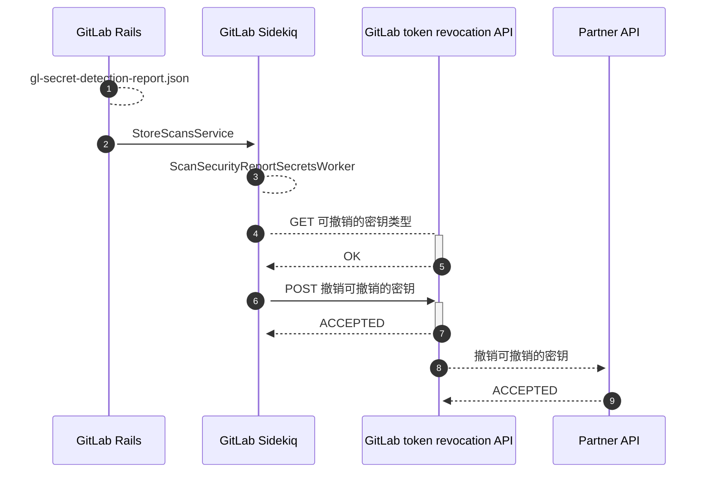
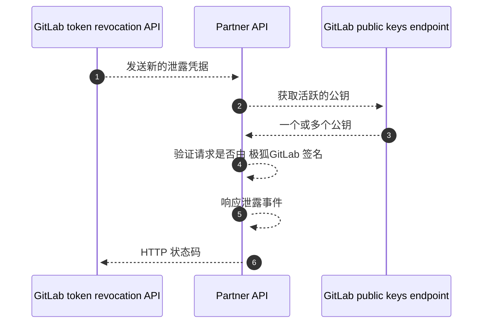



- Tier: 旗舰版
- Offering: JihuLab.com，私有化部署



极狐GitLab 密钥检测在发现特定类型的泄露密钥时会自动响应。
自动响应可以：

- 自动撤销密钥。
- 通知颁发密钥的合作伙伴。然后，合作伙伴可以撤销密钥、通知其所有者或采取其他措施防止滥用。

## 支持的密钥类型和操作

<a id="supported-secret-types-and-actions"></a>

极狐GitLab 支持对以下类型的密钥进行自动响应：

| 密钥类型 | 采取的操作 | 在 JihuLab.com 上支持 | 在私有化部署的极狐GitLab 中支持 |
| ----- | --- | --- | --- |
| 极狐GitLab [个人访问令牌](../../profile/personal_access_tokens.md) | 立即撤销令牌，发送邮件给所有者。<sup>1</sup> | ✅ | ✅ |
| Amazon Web Services (AWS) [IAM 访问密钥](https://docs.aws.amazon.com/IAM/latest/UserGuide/id_credentials_access-keys.html) | 通知 AWS。 | ✅ | ⚙ |
| Google Cloud [服务账号密钥](https://cloud.google.com/iam/docs/best-practices-for-managing-service-account-keys)、[API 密钥](https://cloud.google.com/docs/authentication/api-keys) 和 [OAuth 客户端密钥](https://support.google.com/cloud/answer/6158849#rotate-client-secret) | 通知 Google Cloud。 | ✅ | ⚙ |
| Postman [API 密钥](https://learning.postman.com/docs/developer/postman-api/authentication/) | 通知 Postman。Postman [通知密钥所有者](https://learning.postman.com/docs/administration/managing-your-team/secret-scanner/#protect-postman-api-keys-in-gitlab)。 | ✅ | ⚙ |

**脚注**：

1. 仅支持 [`gitlab_personal_access_token`](https://gitlab.com/gitlab-org/security-products/secret-detection/secret-detection-rules/-/blob/a9ea19d0d9e06f266a80975467b4b3a8360c04eb/rules/mit/gitlab/gitlab.toml#L2)。

**图例说明**：

- ✅ - 默认可用
- ⚙ - 需要使用令牌撤销 API 进行手动集成

## 功能可用性

<a id="feature-availability"></a>



- 在 极狐GitLab 15.11 中[对非默认分支启用](https://gitlab.com/gitlab-org/gitlab/-/issues/299212)。



仅当密钥检测在以下位置发现凭据时，才会对其进行后处理：

- 在公开项目中，因为公开暴露的凭据会带来更高的威胁。扩展到私有项目的考虑在[议题 391379](https://gitlab.com/gitlab-org/gitlab/-/issues/391379) 中。
- 在拥有 极狐GitLab 旗舰版的项目中，出于技术原因。扩展到所有层级的计划在[议题 391763](https://gitlab.com/gitlab-org/gitlab/-/issues/391763) 中跟踪。

## 高层架构

<a id="high-level-architecture"></a>

此图描述了后处理钩子如何在 极狐GitLab 应用中撤销密钥：



1. 包含密钥检测作业的流水线完成，生成一份扫描报告（**1**）。
1. 该报告由服务类处理（**2**），如果可以进行令牌撤销，则会安排一个异步 Worker。
1. 异步 Worker（**3**）与外部部署的 HTTP 服务通信（**4** 和 **5**），以确定可以自动撤销哪些类型的密钥。
1. Worker 发送（**6** 和 **7**）检测到的密钥列表，这些密钥是 极狐GitLab 令牌撤销 API 能够撤销的。
1. 极狐GitLab 令牌撤销 API 将每个可撤销的令牌发送（**8** 和 **9**）给它们各自供应商的[合作伙伴 API](#implement-a-partner-api)。

## 泄露凭据通知的合作伙伴计划

<a id="partner-program-for-leaked-credential-notifications"></a>

当合作伙伴颁发的凭据在 JihuLab.com 上的公共仓库中被泄露时，极狐GitLab 会通知合作伙伴。
如果你运营的是云或 SaaS 产品，并且有兴趣接收这些通知，请参阅[史诗 4944](https://gitlab.com/groups/gitlab-org/-/epics/4944) 了解更多信息。
合作伙伴必须[实现一个合作伙伴 API](#implement-a-partner-api)，该 API 由 极狐GitLab 令牌撤销 API 调用。

### 实现合作伙伴 API

<a id="implement-a-partner-api"></a>

合作伙伴 API 与 极狐GitLab 令牌撤销 API 集成，以接收和响应泄露的令牌撤销请求。该服务应该是一个可公开访问的 HTTP API，具有幂等性和速率限制。

发送到你服务的请求可能包含一个或多个泄露的令牌，以及一个带有请求正文签名的 Header。我们强烈建议你使用此签名来验证传入的请求，以证明这是来自 极狐GitLab 的真实请求。下图详细说明了接收、验证和撤销泄露令牌的必要步骤：



1. 极狐GitLab 令牌撤销 API 向合作伙伴 API 发送（**1**）一个[撤销请求](#revocation-request)。该请求包含的 Header 中带有公钥标识符和请求正文的签名。
1. 合作伙伴 API 从 极狐GitLab 请求（**2**）一个[公钥](#public-keys-endpoint)列表。响应（**3**）中可能包含多个公钥（以防密钥轮换），并且应使用请求 Header 中的标识符进行筛选。
1. 合作伙伴 API 使用公钥[验证签名](#verifying-the-request)是否与实际请求正文匹配（**4**）。
1. 合作伙伴 API 处理泄露的令牌，其中可能涉及自动撤销（**5**）。
1. 合作伙伴 API 使用相应的 HTTP 状态码向 极狐GitLab 令牌撤销 API 做出响应（**6**）：
   - 成功响应码（HTTP 200 至 299）确认合作伙伴已接收并处理了该请求。
   - 错误代码（HTTP 400 或更高）会导致 极狐GitLab 令牌撤销 API 重试该请求。

#### 撤销请求

<a id="revocation-request"></a>

此 JSON schema 文档描述了撤销请求的正文：

```json
{
    "type": "array",
    "items": {
        "description": "一个泄露的令牌",
        "type": "object",
        "properties": {
            "type": {
                "description": "令牌的类型。这是特定于供应商的，可以自定义以满足你的撤销服务",
                "type": "string",
                "examples": [
                    "my_api_token"
                ]
            },
            "token": {
                "description": "被密钥检测分析器匹配到的子字符串。在大多数情况下，这就是整个令牌本身",
                "type": "string",
                "examples": [
                    "XXXXXXXXXXXXXXXX"
                ]
            },
            "url": {
                "description": "极狐GitLab 上托管的、检测到泄露令牌的原始源文件的 URL",
                "type": "string",
                "examples": [
                    "https://gitlab.example.com/some-repo/-/raw/abcdefghijklmnop/compromisedfile1.java"
                ]
            }
        }
    }
}
```

示例：

```json
[{"type": "my_api_token", "token": "XXXXXXXXXXXXXXXX", "url": "https://example.com/some-repo/-/raw/abcdefghijklmnop/compromisedfile1.java"}]
```

在此示例中，密钥检测已确定一个 `my_api_token` 实例已被泄露。除了一个可公开访问的、指向包含泄露令牌文件原始内容的 URL 之外，令牌的值也提供给了你。

该请求包含两个特殊的 Header：

| Header | 类型 | 描述 |
|--------|------|-------------|
| `Gitlab-Public-Key-Identifier` | string | 用于签署此请求的密钥对的唯一标识符。主要用于协助密钥轮换。 |
| `Gitlab-Public-Key-Signature` | string | 请求正文的 base64 编码签名。 |

你可以使用这些 Header 以及 极狐GitLab 公钥端点来验证撤销请求是否真实。

#### 公钥端点

<a id="public-keys-endpoint"></a>

极狐GitLab 维护着一个可公开访问的端点，用于获取用于验证撤销请求的公钥。该端点可根据请求提供。

此 JSON schema 文档描述了公钥端点的响应正文：

```json
{
    "type": "object",
    "properties": {
        "public_keys": {
            "description": "由 极狐GitLab 管理的、用于签署令牌撤销请求的公钥数组。",
            "type": "array",
            "items": {
                "type": "object",
                "properties": {
                    "key_identifier": {
                        "description": "密钥对的唯一标识符。将此值与 Gitlab-Public-Key-Identifier Header 的值进行匹配",
                        "type": "string"
                    },
                    "key": {
                        "description": "公钥的值",
                        "type": "string"
                    },
                    "is_current": {
                        "description": "该密钥当前是否处于活跃状态并签署新请求",
                        "type": "boolean"
                    }
                }
            }
        }
    }
}
```

示例：

```json
{
    "public_keys": [
        {
            "key_identifier": "6917d7584f0fa65c8c33df5ab20f54dfb9a6e6ae",
            "key": "-----BEGIN PUBLIC KEY-----\nMFkwEwYHKoZIzj0CAQYIKoZIzj0DAQcDQgAEN05/VjsBwWTUGYMpijqC5pDtoLEf\nuWz2CVZAZd5zfa/NAlSFgWRDdNRpazTARndB2+dHDtcHIVfzyVPNr2aznw==\n-----END PUBLIC KEY-----\n",
            "is_current": true
        }
    ]
}
```

#### 验证请求

<a id="verifying-the-request"></a>

你可以通过使用从上述 API 响应中获取的对应公钥，根据请求正文来验证 `Gitlab-Public-Key-Signature` Header，从而检查撤销请求是否为真。我们使用 [ECDSA](https://en.wikipedia.org/wiki/Elliptic_Curve_Digital_Signature_Algorithm) 和 SHA256 哈希来生成签名，然后将其 base64 编码到 Header 值中。

下面的 Python 脚本演示了如何验证签名。它使用流行的 [pyca/cryptography](https://cryptography.io/en/latest/) 模块进行加密操作：

```python
import hashlib
import base64
from cryptography.hazmat.primitives import hashes
from cryptography.hazmat.primitives.serialization import load_pem_public_key
from cryptography.hazmat.primitives.asymmetric import ec

public_key = str.encode("")      # 从公钥端点获取
signature_header = ""            # 从 `Gitlab-Public-Key-Signature` Header 获取
request_body = str.encode(r'')   # 从撤销请求正文获取

pk = load_pem_public_key(public_key)
decoded_signature = base64.b64decode(signature_header)

pk.verify(decoded_signature, request_body, ec.ECDSA(hashes.SHA256()))  # 如果失败会抛出异常

print("签名验证通过！")
```

主要步骤如下：

1. 将公钥加载为你正在使用的加密库所适用的格式。
1. 对 `Gitlab-Public-Key-Signature` Header 值进行 Base64 解码。
1. 根据解码后的签名验证正文，并指定使用 ECDSA 和 SHA256 哈希算法。