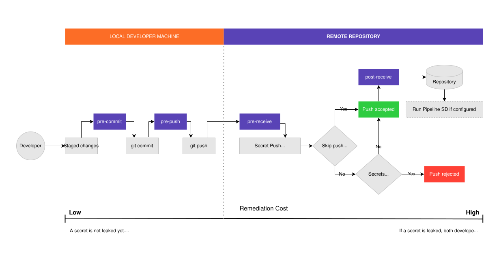



- Tier: 旗舰版
- Offering: JihuLab.com，私有化部署





- 在 GitLab 17.1 中更改为 Beta 并在 JihuLab.com 上可用。
- 在 GitLab 17.2 中为私有化部署启用，带有名为 `pre_receive_secret_detection_beta_release` 和 `pre_receive_secret_detection_push_check` 的功能标志。
- 功能标志 `pre_receive_secret_detection_beta_release` 在 GitLab 17.4 中移除。
- 在 GitLab 17.5 中 GA。
- 功能标志 `pre_receive_secret_detection_push_check` 在 GitLab 17.7 中移除。



密钥推送保护阻止密钥（如密钥和 API 令牌）被推送到极狐GitLab。

结合流水线密钥检测与密钥推送保护，进一步加强你的安全性。

<a id="secret-push-protection-workflow"></a>

## 密钥推送保护工作流

密钥推送保护在 pre-receive 钩子中进行。当你推送更改到极狐GitLab 时，
推送保护会检查每个文件或提交中是否有密钥。默认情况下，如果检测到密钥，
推送会被阻止。

<!-- 要编辑图表，请使用 Draw.io 或 VS Code 扩展 "Draw.io Integration" -->


当推送被阻止时，极狐GitLab 会提示一条消息，包括：

- 包含密钥的提交 ID。
- 包含密钥的文件名和行号。
- 密钥类型。

例如，以下是使用 Git CLI 推送被阻止时返回消息的摘录。
使用其他客户端（包括极狐GitLab Web IDE）时，消息格式不同，但内容相同。

```plain
remote: 推送被阻止：在代码更改中检测到密钥
remote: 密钥推送保护在提交 37e54de5e78c31d9e3c3821fd15f7069e3d375b6 中发现了以下密钥：
remote:
remote: -- test.txt:2 极狐GitLab 个人访问令牌
remote:
remote: 要推送你的更改，你必须移除已识别的密钥。
```

如果密钥推送保护在你的提交中未检测到任何密钥，则不会显示消息。

<a id="detected-secrets"></a>

### 检测到的密钥

密钥推送保护扫描文件或提交以查找特定模式。每种模式
匹配一种特定类型的密钥。要确认密钥推送保护检测哪些密钥，
请参阅 [detected secrets](../detected_secrets.md)。仅为密钥推送保护选择了高置信度模式，
以最大程度减少推送提交时的延迟并最大程度减少误报。例如，使用自定义前缀的个人访问令牌不会被密钥推送保护检测到。
你可以 [排除](../exclusions.md) 选定密钥不被密钥推送保护检测。

<a id="getting-started"></a>

## 开始使用

在私有化部署实例上，你必须：

1. 允许整个实例上的密钥推送保护。
1. 启用密钥推送保护。你可以：
   - 在特定项目中启用密钥推送保护。
   - 使用 API 为群组中的所有项目启用密钥推送保护。

<a id="allow-the-use-of-secret-push-protection-in-your-gitlab-instance"></a>

### 在你的极狐GitLab 实例中允许使用密钥推送保护

在私有化部署实例上，你必须先允许密钥推送保护，然后才能在项目中启用它。

先决条件：

- 你必须是你极狐GitLab 实例的管理员。

要在你的极狐GitLab 实例中允许使用密钥推送保护：

1. 以管理员身份登录你的极狐GitLab 实例。
1. 在右上角，选择 **管理员**。
1. 在左侧边栏中，选择 **设置** > **安全与合规**。
1. 在 **密钥检测** 下，勾选或取消勾选 **允许密钥推送保护**。

实例上已允许密钥推送保护。要使用此功能，你必须按项目启用它。

<a id="enable-secret-push-protection-in-a-project"></a>

### 在项目中启用密钥推送保护

先决条件：

- 你必须拥有项目的安全经理、维护者或所有者角色。
- 在私有化部署上，你必须先在实例上允许密钥推送保护。

要在项目中启用密钥推送保护：

1. 在顶部栏中，选择 **搜索或跳转到** 并找到你的项目。
1. 在左侧边栏中，选择 **安全** > **安全配置**。
1. 打开 **密钥推送保护** 开关。

你也可以 [通过 API](../../../../api/group_security_settings.md#update-group-security-settings) 为群组中的所有项目启用密钥推送保护。

<a id="coverage"></a>

## 覆盖范围



- 在 GitLab 17.11 中更改为仅扫描 diff。



在以下情况下，密钥推送保护不会阻止密钥：

- 推送提交时你使用了跳过密钥推送保护选项。
- 该密钥被密钥推送保护排除。
- 该密钥位于定义为 [排除](../exclusions.md) 的路径中。

在以下情况下，密钥推送保护不会检查提交中的文件：

- 该文件是二进制文件。
- 该文件或 diff 补丁大于 1 MiB。
- 该文件被重命名、删除或移动但没有内容更改。
- 该文件的内容与源代码中另一个文件的内容完全相同。
- 该文件包含在创建仓库的初始推送中。
- 该推送总共包含超过 350,000 行更改。

<a id="diff-scanning"></a>

### 差异扫描



- 在 GitLab 17.5 中引入，带有名为 `spp_scan_diffs` 的功能标志。默认禁用。
- 在 GitLab 17.6 中于 JihuLab.com 上启用。
- 在 GitLab 17.10 中为 Web IDE 推送添加了支持，带有名为 `secret_checks_for_web_requests` 的功能标志。默认禁用。
- 在 GitLab 17.11 中 GA。功能标志 `spp_scan_diffs` 移除。
- 在 GitLab 17.11 中移除了 `secret_checks_for_web_requests` 功能标志。



密钥推送保护仅扫描通过 HTTP(S) 和 SSH 推送的提交的差异。
如果密钥已存在于文件中且不属于更改部分，则不会被检测到。

<a id="push-size-threshold"></a>

## 推送大小阈值

当推送更改超过 3,150 个路径或 350,000 行时，将跳过密钥推送保护。
这些阈值仅适用于密钥推送保护扫描的文件（在排除 [排除](../exclusions.md) 中定义的路径后）。这些阈值可防止你在推送较大变更集时出现推送超时。

<a id="understanding-the-results"></a>

## 理解结果

密钥推送保护可识别各种类别的密钥：

- API 密钥和令牌：特定于服务的身份验证凭据
- 数据库连接字符串：包含嵌入式凭据的 URL
- 私钥：用于身份验证或加密的加密密钥
- 通用高熵字符串：看似随机生成的密钥模式

当推送被阻止时，密钥推送保护会提供详细信息以帮助你查找和处理检测到的密钥：

- 提交 ID：包含密钥的特定提交。可用于跟踪 Git 历史中的更改。
- 文件路径和行号：检测到的模式的确切位置，便于快速导航。
- 密钥类型：检测到的模式类别。例如，`极狐GitLab 个人访问令牌` 或 `AWS Access Key`。

<a id="common-detection-categories"></a>

### 常见检测类别

并非所有检测都需要立即采取措施。评估结果时请考虑以下事项：

- 真阳性：应轮换和移除的合法密钥。例如：
  - 有效的 API 密钥或令牌
  - 生产数据库凭据
  - 私有加密密钥
  - 任何可能导致未授权访问的凭据
- 误报：检测到的模式并非实际密钥。例如：
  - 类似密钥但无实际价值的测试数据
  - 配置模板中的占位符值
  - 文档中的示例凭据
  - 与密钥模式匹配的哈希值或校验和

记录组织中常见的误报模式，以简化未来的评估。

<a id="optimization"></a>

## 优化

在广泛部署密钥推送保护之前，优化配置以减少误报并提高特定环境的准确性。

<a id="reduce-false-positives"></a>

### 减少误报

误报会严重影响开发者的生产力并导致安全疲劳。

要减少误报：

- 有策略地 [配置排除项](../exclusions.md)：
  - 为测试目录、文档和第三方依赖项创建基于路径的排除。
  - 为代码库中特定的已知误报模式使用基于模式的排除。
  - 记录你的排除规则并定期审查。
- 为占位符值和测试凭据创建标准，
  这些标准应与你的排除规则匹配，但不应与 [默认规则集](../detected_secrets.md) 匹配。
- 监控误报率并相应地调整排除项。

<a id="optimize-performance"></a>

### 优化性能

大型仓库或频繁推送可能会影响性能。

要优化密钥推送保护的性能：

- 监控推送时间并在部署前建立基线指标。
- 考虑对具有大型二进制资产的仓库设置文件大小限制。
- 对不太可能包含密钥的目录 [实施排除](../exclusions.md#add-an-exclusion)。

<a id="integration-with-existing-workflows"></a>

### 与现有工作流集成

确保密钥推送保护补充你现有的开发实践：

- 配置流水线密钥检测和密钥推送保护，以确保拥有纵深防御。
- 更新开发者文档以包含密钥推送保护程序。
- 配合安全培训，教育开发者了解安全编码实践，以最大程度减少泄露的密钥。

<a id="roll-out"></a>

## 推出

大规模成功部署密钥推送保护需要仔细规划和分阶段实施：

1. 选择两三个活跃开发且非关键的项目来测试该功能，并了解其对开发者工作流的影响。
1. 为你选择的测试项目启用密钥推送保护，并监控开发者反馈。
1. 记录处理被阻止推送的流程，并培训你的开发团队掌握新的工作流。
1. 在试点阶段，跟踪检测到的密钥数量、误报率和开发者体验反馈。

你应该运行试点阶段两到四周，以收集足够的数据并找出在更广泛部署之前需要调整的工作流。

完成试点后，请考虑以下阶段的规模化推出：

1. 早期采用者（第 3‑6 周）
   - 在 10‑20% 的活跃项目上启用，优先考虑安全性敏感的仓库。
   - 重点选择具有强安全意识和认同感的团队。
   - 监控性能影响和开发者体验。
   - 根据实际使用情况优化流程。
1. 广泛部署（第 7‑12 周）
   - 分批逐步在其余项目中启用。
   - 为开发团队提供持续支持和培训。
   - 监控系统性能并在需要时扩展基础设施。
   - 根据使用模式不断优化排除规则。
1. 全面覆盖（第 13‑16 周）
   - 在所有剩余项目上启用密钥推送保护。
   - 建立持续的维护和审查流程。
   - 实施对排除规则和检测模式的定期审计。

<a id="resolve-a-blocked-push"></a>

## 解决被阻止的推送

当密钥推送保护阻止推送时，你可以：

- [移除密钥](../remove_secrets_tutorial.md)。
- 跳过密钥推送保护。

<a id="skip-secret-push-protection"></a>

### 跳过密钥推送保护

在某些情况下，可能需要跳过密钥推送保护。例如，开发者可能需要
提交一个用于测试的占位符密钥，或者用户可能由于 Git 操作超时而想要跳过密钥推送保护。

当跳过密钥推送保护时，会记录审计事件。审计事件详细信息包括：

- 使用的跳过方法。
- 极狐GitLab 账户名称。
- 跳过密钥推送保护的日期和时间。
- 密钥推送到的项目名称。
- 目标分支。 （在 GitLab 17.4 中引入）
- 跳过了密钥推送保护的提交。 （在 GitLab 17.9 中引入）

如果启用了流水线密钥检测，所有提交的内容在推送到仓库后都会被扫描。

要跳过推送中所有提交的密钥推送保护，可以：

- 如果你使用 Git CLI 客户端，指示 Git 跳过密钥推送保护。
- 如果你使用任何其他客户端，在其中一个提交消息中添加 `[skip secret push protection]`。

<a id="for-the-git-cli-client"></a>

#### 对于 Git CLI 客户端

要从命令行跳过密钥推送保护：

- 使用 `secret_push_protection.skip_all` 推送选项。

  例如，你有几个提交因为其中一个包含密钥而被阻止推送。要跳过密钥推送保护，你可以将推送选项附加到 Git 命令中。

  ```shell
  git push -o secret_push_protection.skip_all
  ```

<a id="for-any-git-client"></a>

#### 对于任何 Git 客户端

要跳过密钥推送保护：

- 在其中一个提交消息中添加 `[skip secret push protection]`，可以添加到现有行或新行，然后推送提交。

  例如，你使用极狐GitLab Web IDE，并且有几个提交因为其中一个包含密钥而被阻止推送。要跳过密钥推送保护，编辑最新的提交消息并添加 `[skip secret push protection]`，然后推送提交。

<a id="troubleshooting"></a>

## 故障排除

在使用密钥推送保护时，你可能会遇到以下情况。

<a id="push-blocked-unexpectedly"></a>

### 推送意外被阻止

在 GitLab 17.11 之前，密钥推送保护会扫描所有修改文件的内容。
如果修改的文件中包含密钥，即使该密钥不是 diff 的一部分，也可能导致推送意外被阻止。

在 GitLab 17.10 及更早版本中，启用 `spp_scan_diffs` 功能标志
以确保仅扫描新提交的更改。要将 Web IDE 更改推送到
包含密钥的文件，你还需要启用 `secret_checks_for_web_requests` 功能标志。

<a id="file-was-not-scanned"></a>

### 文件未被扫描

某些文件会被排除在扫描之外。有关详细信息，请参阅 [覆盖范围](#coverage)。