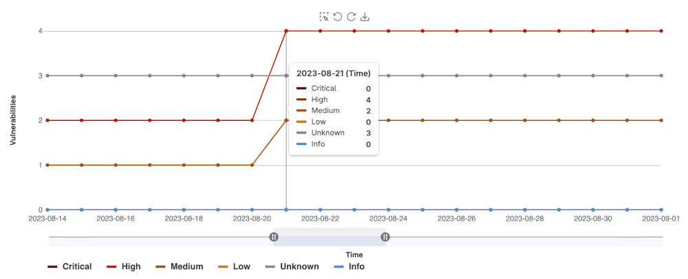
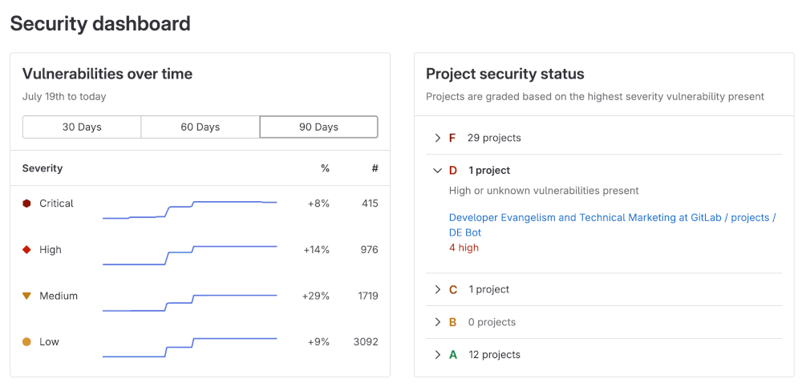



- Tier: 旗舰版
- Offering: JihuLab.com，私有化部署



极狐GitLab 18.6 引入了改进版的安全仪表板，该仪表板使用[高级漏洞管理](../vulnerability_report/_index.md#advanced-vulnerability-management)。

新仪表板在 JihuLab.com 上默认启用。极狐GitLab 私有化部署用户必须启用高级漏洞管理才能访问新仪表板。

如果您的组织尚未启用高级漏洞管理，请参阅[旧版安全仪表板](#legacy-security-dashboards)。

## 安全仪表板

使用安全仪表板评估您应用程序的安全态势。极狐GitLab 为您提供针对项目上运行的[安全扫描器](../detect/_index.md)检测到的漏洞的指标、评级和图表集合。安全仪表板提供以下数据：

- 群组中所有项目在 30、60 或 90 天时间范围内的漏洞趋势。
- 按严重性划分的未解决漏洞总数。
- 用于跨项目比较漏洞风险的总风险评分。

### 先决条件

要查看项目、群组或组织的安全仪表板，您必须满足以下条件：

- 拥有群组或项目的开发者角色或更高角色。
- 拥有组织的所有者角色。
- 在您的项目中至少配置一个[安全扫描器](../detect/_index.md)。
- 在项目的[默认分支](../../project/repository/branches/default.md)上成功执行安全扫描。
- 项目中至少检测到一个漏洞。
- 已启用[高级漏洞管理](../vulnerability_report/_index.md#advanced-vulnerability-management)并启用[高级搜索](../../search/advanced_search.md)。

> [!note]
> 安全仪表板显示[默认分支](../../project/repository/branches/default.md)上最近完成的流水线的扫描结果。仪表板会使用在默认分支上运行的已完成流水线的结果进行更新。它们不包括在其他未合并分支的流水线中发现的漏洞。

### 查看安全仪表板

安全仪表板显示基于默认分支中检测到的漏洞数据构建的可筛选图表和面板。图表和面板仅包含未解决（需要分类或已确认状态）的漏洞，并排除不再检测到的漏洞。

您可以查看项目、群组或组织的安全仪表板。每个仪表板都为您提供了解安全态势的独特视角。

所有三个仪表板都包括：

- [图表](#charts)
  - [随时间变化的漏洞](#vulnerabilities-over-time)
  - [漏洞严重性面板](#vulnerability-severity-panel)
  - [风险评分](#risk-score-panel)
  - [按存在时间划分的漏洞](#vulnerabilities-by-age)
  - [Top 10 CWEs](#top-10-cwes)
- [筛选整个仪表板](#filter-the-entire-dashboard)

[SAST 排查与修复漏斗](#sast-triage-and-remediation-funnel)图表和[导出为 PDF](#export-as-pdf)选项仅在项目和群组仪表板上可用。

要查看项目或群组安全仪表板：

1. 在顶部栏中，选择 **搜索或跳转到** 并找到您的项目或群组。
1. 在左侧边栏中，选择 **安全** > **安全仪表板**。

要查看组织安全仪表板：

1. 在顶部栏中，选择 **搜索或跳转到** 并找到您的组织。
1. 在左侧边栏中，选择 **安全** > **安全仪表板**。

### 项目安全仪表板

项目安全仪表板显示在项目默认分支中检测到的漏洞。它包括：

- [**随时间变化的漏洞**](#vulnerabilities-over-time)图表，包含最多 90 天的历史记录。
- [**严重性面板**](#vulnerability-severity-panel)，按严重性显示未解决的漏洞。
- [**风险评分**](#risk-score-panel)面板，显示项目的整体安全风险。
- [**按存在时间划分的漏洞**](#vulnerabilities-by-age)图表，按存在时间分组未解决的漏洞。
- [**Top 10 CWEs**](#top-10-cwes)图表，显示最常见的 10 个 CWE。
- [**SAST 排查与修复漏斗**](#sast-triage-and-remediation-funnel)图表，显示严重和高危 SAST 漏洞从检测到修复的进展，包括由极狐GitLab Duo 处理的阶段。

未解决的漏洞是指状态为“需要分类”或“已确认”的漏洞。状态为“已忽略”或“已解决”的已关闭漏洞不包含在这些图表中。

### 群组安全仪表板

群组安全仪表板提供群组及其子群组中所有项目默认分支中发现的漏洞概览。群组安全仪表板提供以下内容：

- [**随时间变化的漏洞**](#vulnerabilities-over-time)图表，包含最多 90 天的历史记录。
- [**严重性面板**](#vulnerability-severity-panel)，按严重性显示未解决的漏洞。
- [**风险评分**](#risk-score-panel)面板，显示总风险以及每个项目的风险。
- [**按存在时间划分的漏洞**](#vulnerabilities-by-age)图表，按存在时间分组未解决的漏洞。
- [**Top 10 CWEs**](#top-10-cwes)图表，显示最常见的 10 个 CWE。
- [**SAST 排查与修复漏斗**](#sast-triage-and-remediation-funnel)图表，显示严重和高危 SAST 漏洞从检测到修复的进展，包括由极狐GitLab Duo 处理的阶段。

### 组织安全仪表板

> [!flag]
> 此功能的可用性由功能标志控制。
> 此功能可用于测试，但尚未准备好用于生产环境。

组织安全仪表板提供组织中所有项目默认分支中发现的漏洞概览。该仪表板包括：

- [随时间变化的漏洞](#vulnerabilities-over-time)：包含最多 90 天历史的图表。
- [严重性面板](#vulnerability-severity-panel)：按严重性显示未解决漏洞的面板。
- [风险评分](#risk-score-panel)：显示总风险和每个项目风险的面板。
- [按存在时间划分的漏洞](#vulnerabilities-by-age)：按存在时间分组未解决漏洞的图表。
- [Top 10 CWEs](#top-10-cwes)：显示最常见的 10 个 CWE 的图表。

> [!note]
> [SAST 排查与修复漏斗](#sast-triage-and-remediation-funnel)图表和
> [导出为 PDF](#export-as-pdf)选项在组织安全
> 仪表板上不可用。

### 图表

安全仪表板包含多个图表，可帮助您了解并处理项目和群组中的漏洞。

#### 随时间变化的漏洞

**随时间变化的漏洞**图表可在项目、群组和组织仪表板上使用。它显示 30 天、60 天或 90 天期间内未解决漏洞的趋势。默认范围为 30 天。极狐GitLab 保留漏洞数据 365 天。

使用此图表识别漏洞何时引入以及它们如何随时间变化。

要查看详细信息：

1. 将鼠标悬停在数据点上以查看当天的漏洞数量。
1. 使用**时间范围选择器**在 30、60 或 90 天之间切换。
1. 拖动范围手柄 () 以放大特定时间段。
1. 使用下拉列表按**严重性**筛选（例如，**严重**、**高**、**中**）
1. 使用按钮按以下任一选项对数据进行分组：
   - **严重性**：严重、高、中、低、信息和未知。
   - **报告类型**：SAST、DAST、依赖扫描等。
1. 要探索超过 90 天但在最近 365 天内的数据，请使用 [`SecurityMetrics.vulnerabilitiesOverTime` GraphQL API](../../../api/graphql/reference/_index.md#securitymetricsvulnerabilitiesovertime)

#### 漏洞严重性面板

漏洞严重性面板按[严重性](../vulnerabilities/severities.md)显示未解决漏洞的总数。

要查看详细信息：

1. 在严重性面板中，找到您要调查的严重性。
1. 选择**查看**。
   - 漏洞报告将打开，并且仅包含该严重性的漏洞。
   - 您设置的任何页面级筛选器也会被应用。

#### 风险评分面板

风险评分面板显示群组或项目的整体安全风险。该面板有两种视图：

1. **不分组**（默认）视图显示群组的总风险评分：
   - 圆形仪表在中心显示计算出的风险评分。
   - 颜色条指示风险级别：
     - 绿色：低风险
     - 黄色：中风险
     - 橙色：高风险
     - 红色：严重风险
1. 选择**项目**以比较每个项目的风险评分：
   - 每个项目磁贴根据项目的风险级别进行颜色编码。
   - 将鼠标悬停在磁贴上以查看详细信息，包括项目名称和风险评分。
   - 选择一个磁贴并选择项目名称以打开该项目的漏洞报告。

风险评分由多个因素计算得出，包括：

- 漏洞的严重性
- 漏洞的存在时间
- KEV（已知被利用漏洞）状态
- EPSS（漏洞利用预测评分系统）评分

#### 按存在时间划分的漏洞

**按存在时间划分的漏洞**图表可在项目、群组和组织仪表板上使用。它根据漏洞首次检测后的时间量显示未解决漏洞的分布。您可以按严重性或报告类型对漏洞进行分组，帮助您确定可能需要进行修复活动的位置。

要查看详细信息：

1. 将鼠标悬停在数据点上以查看该存在时间分组的漏洞数量。
1. 使用下拉列表按**严重性**筛选（例如，**严重**、**高**、**中**）
1. 使用按钮按以下任一选项对数据进行分组：
   - **严重性**：严重、高、中、低、信息和未知。
   - **报告类型**：SAST、DAST、依赖扫描等。

#### Top 10 CWEs

**Top 10 CWEs** 图表可在项目、群组和组织仪表板上使用。它显示与项目、群组或组织中未解决漏洞关联的最常见的 10 个 CWE 标识符。

要查看详细信息：

1. 将鼠标悬停在数据点上以查看每种 CWE 类型的漏洞总数。
1. 使用下拉列表按**严重性**筛选（例如，**严重**、**中**或**高**）。

#### SAST 排查与修复漏斗

**SAST 排查与修复漏斗**图表可在群组和项目仪表板上使用。它显示严重和高危 SAST 漏洞在 30、60 或 90 天期间内如何通过分类和修复流程。默认范围为 30 天。

漏斗最多有四个阶段。每个阶段显示达到该阶段的漏洞数量：

- **严重和高危 SAST 漏洞**：由 SAST 检测到的漏洞。
- **真阳性**：由 [SAST 误报检测](../vulnerabilities/false_positive_detection.md)确认为真阳性的漏洞。
- **具有 AI 创建的合并请求的漏洞**：具有由 [Agentic SAST 漏洞修复](../vulnerabilities/agentic_vulnerability_resolution.md)创建的合并请求的漏洞。
- **已修复的漏洞**：由已合并的 AI 创建的合并请求修复的漏洞。

使用时间范围选择器在 30、60 或 90 天之间切换漏斗。

最后三个阶段使用极狐GitLab Duo。要填充这些阶段：

- 为群组及其项目开启极狐GitLab Duo。
- 配置 [SAST 误报检测](../vulnerabilities/false_positive_detection.md)。
- 配置 [Agentic SAST 漏洞修复](../vulnerabilities/agentic_vulnerability_resolution.md)。

当这些功能之一被关闭时，漏斗会用一条消息替换受影响的阶段，该消息说明需要开启哪个功能。消息因项目仪表板和群组仪表板而异，也因哪个功能不可用而异。

### 筛选整个仪表板

您可以在两个级别筛选结果：

- **仪表板筛选器**：应用于整个仪表板。使用这些筛选器时，所有图表都会更新。
- **图表和面板筛选器**：仅应用于您正在查看的图表或面板。

可用的仪表板筛选器包括：

- **报告类型**：按扫描器筛选，包括 SAST、DAST、依赖扫描等。
- **项目**：将结果限制为特定项目。在群组和组织安全仪表板上可用。

在群组安全仪表板上，您还可以按以下条件筛选：

- **安全属性**：按应用于项目的安全属性筛选，包括业务影响、应用程序、业务部门、互联网暴露和位置等类别。这些筛选器可以是包含性的（使用**是以下之一**运算符）或排他性的（使用**不是以下之一**运算符）。要配置您的安全属性并将其应用于项目，请参阅[安全属性](../attributes/_index.md)。

仪表板筛选器行为：

- 筛选器会立即应用于所有仪表板图表和面板。
- 您应用的筛选器会在您的会话期间持续应用，除非您将其移除。
- 当您从仪表板打开漏洞报告时，活动筛选器会自动应用于该漏洞报告。

要将筛选器应用于整个仪表板：

1. 在仪表板顶部的筛选栏中，选择**筛选结果...**。
1. 从下拉列表中，选择筛选器类型。
1. 选择一个或多个筛选值。

### 导出为 PDF

您可以将安全仪表板导出为 PDF，用于报告和演示文稿。导出会捕获仪表板中所有图表和面板的当前状态，包括任何活动筛选器。

要将仪表板导出为 PDF：

1. 在顶部栏中，选择 **搜索或跳转到** 并找到您的项目或群组。
1. 在左侧边栏中，选择 **安全** > **安全仪表板**。
1. 可选。应用筛选器以自定义导出中包含的数据。
1. 选择**导出为 PDF**。

## 旧版安全仪表板



- Offering: 私有化部署



未启用高级漏洞管理的极狐GitLab 私有化部署客户无法访问最新的安全仪表板。在这种情况下，您仍然可以访问旧版安全仪表板。

安全仪表板用于评估您应用程序的安全态势。极狐GitLab 为您提供针对项目上运行的[安全扫描器](../detect/_index.md)检测到的漏洞的指标、评级和图表集合。安全仪表板提供如下数据：

- 群组中所有项目在 30、60 或 90 天时间范围内的漏洞趋势
- 根据漏洞严重性为每个项目提供的字母等级评级
- 最近 365 天内检测到的漏洞总数，包括其严重性

使用安全仪表板数据来改善您的安全态势。例如，365 天趋势视图显示哪些天漏洞激增。检查这些天的代码更改以执行根本原因分析，并制定更好的策略以防止未来的漏洞。

## 旧版仪表板的先决条件

要查看安全仪表板，需要满足以下条件：

- 您必须拥有群组或项目的开发者角色。
- 在您的项目中至少配置一个[安全扫描器](../detect/_index.md)。
- 在项目的[默认分支](../../project/repository/branches/default.md)上成功执行安全扫描。
- 项目中至少检测到 1 个漏洞。

> [!note]
> 安全仪表板显示[默认分支](../../project/repository/branches/default.md)上最近完成的流水线的扫描结果。仪表板会使用在默认分支上运行的已完成流水线的结果进行更新；它们不包括在其他未合并分支的流水线中发现的漏洞。

## 查看旧版安全仪表板

安全仪表板可以在项目、群组和安全中心级别查看。每个仪表板都为您提供了解安全态势的独特视角。

### 项目安全仪表板

项目安全仪表板显示随时间检测到的漏洞总数，包含给定项目最多 365 天的历史数据。该仪表板是默认分支中未解决漏洞的历史视图。未解决的漏洞仅指状态为 `Needs triage` 或 `Confirmed` 的漏洞（状态为 `Dismissed` 或 `Resolved` 的漏洞被排除）。

要查看项目的安全仪表板：

1. 在顶部栏中，选择 **搜索或跳转到** 并找到您的项目。
1. 在左侧边栏中，选择 **安全** > **安全仪表板**。
1. 筛选和搜索您需要的内容。
   - 要按严重性筛选图表，请选择图例名称。
   - 要查看特定时间范围，请使用时间范围手柄 ()。
   - 要查看图表的特定区域，请选择最左侧的图标 () 并在图表上拖动。
   - 要重置为原始范围，请选择**移除选择** ()。

#### 下载漏洞图表

您可以从项目安全仪表板下载漏洞图表图像，用于文档、演示文稿等。要下载漏洞图表的图像：

1. 在顶部栏中，选择 **搜索或跳转到** 并找到您的项目。
1. 在左侧边栏中，选择 **安全** > **安全仪表板**。
1. 选择**将图表另存为图像** ()。

系统会提示您以 SVG 格式下载图像。

### 群组安全仪表板

群组安全仪表板提供群组及其子群组中所有项目默认分支中发现的漏洞概览。群组安全仪表板提供以下内容：

- 30、60 或 90 天时间范围内的漏洞趋势
- 群组中每个项目根据其最高严重性未解决漏洞获得的字母等级。字母等级使用以下标准分配：

| 等级 | 描述                                     |
| ----- | ----------------------------------------------- |
| **F** | 一个或多个 `critical` 漏洞          |
| **D** | 一个或多个 `high` 或 `unknown` 漏洞 |
| **C** | 一个或多个 `medium` 漏洞            |
| **B** | 一个或多个 `low` 漏洞               |
| **A** | 零漏洞                            |

要查看群组安全仪表板：

1. 在顶部栏中，选择 **搜索或跳转到** 并找到您的群组。
1. 在左侧边栏中，选择 **安全** > **安全仪表板**。
1. 将鼠标悬停在**随时间变化的漏洞**图表上以获取有关漏洞的更多详细信息。
   - 您可以显示 30、60 或 90 天时间范围内的漏洞趋势（默认为 90 天）。
   - 要查看超过 90 天时间范围的聚合数据，请使用 [`VulnerabilitiesCountByDay` GraphQL API](../../../api/graphql/reference/_index.md#vulnerabilitiescountbyday)。极狐GitLab 保留数据 365 天。

1. 选择**项目安全状态**部分下的箭头，查看哪些项目属于特定字母等级评级：
   - 您可以查看项目中特定严重性的漏洞数量
   - 您可以选择项目名称以直接访问其项目安全仪表板

## 价值流仪表板中的漏洞指标

[价值流仪表板](../../analytics/value_streams_dashboard.md)比较面板中还有其他漏洞指标，可帮助您了解组织软件交付工作流中的安全暴露情况。
