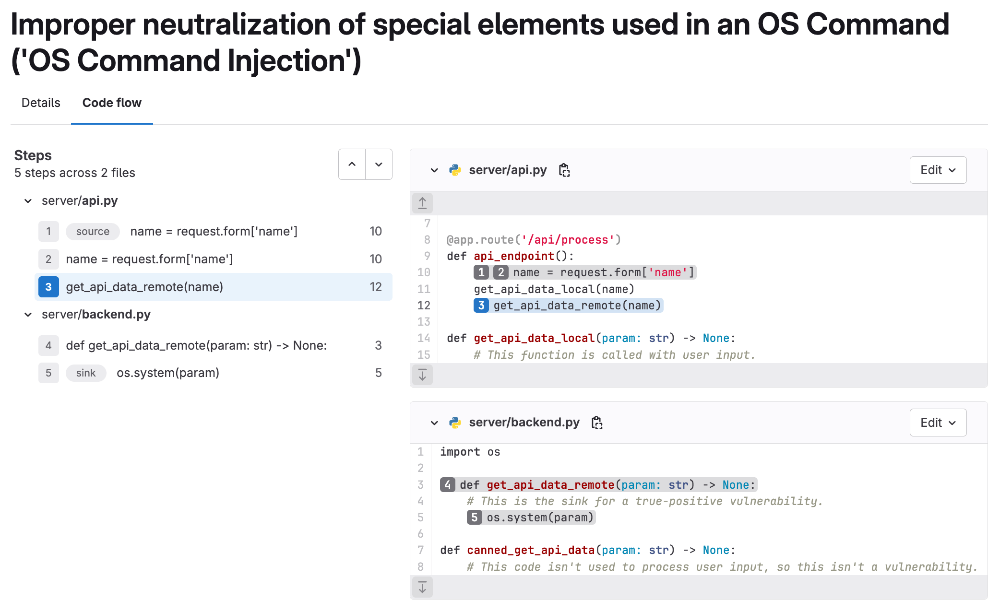
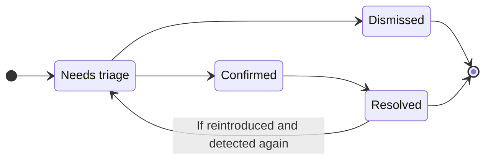



- Tier: 旗舰版
- Offering: JihuLab.com，私有化部署



项目中的每个漏洞都有一个漏洞页面，其中包含漏洞的详细信息，包括：

- 描述
- 检测时间
- 当前状态
- 可用操作
- 关联议题
- 操作日志
- 位置
- 严重程度

对于 [通用漏洞披露 (CVE)](https://www.cve.org/) 目录中的漏洞，这些详细信息还包括：

- CVSS 评分
- [EPSS 评分](risk_assessment_data.md#epss)
- [KEV 状态](risk_assessment_data.md#kev)
- [可达性状态](../dependency_scanning/static_reachability.md)（有限可用性）

有关此附加数据的更多详细信息，请参见[漏洞风险评估数据](risk_assessment_data.md)。

如果扫描程序确定该漏洞为误报，则漏洞页面顶部会包含一条警报消息。

对于 SAST 检测到的漏洞，极狐GitLab Duo 可以自动分析它们并生成包含上下文感知代码修复的合并请求。有关更多信息，请参见
[Agentic SAST 漏洞解决](agentic_vulnerability_resolution.md)。

<a id="secret-false-positive-detection"></a>

## 密钥误报检测



- Tier: 旗舰版
- Add-on: GitLab Duo Core, Pro, or Enterprise
- Offering: JihuLab.com，私有化部署
- Status: Beta





- 在极狐GitLab 18.10 的 epic 17885 中作为 [测试版](../../../policy/development_stages_support.md#beta) 功能引入，带有名为 `duo_secret_detection_false_positive` 的 [功能标志](../../../administration/feature_flags/_index.md)。[在 JihuLab.com、私有化部署上启用](https://gitlab.com/gitlab-org/gitlab/-/merge_requests/227074)。



极狐GitLab Duo 自动分析密钥检测结果以识别潜在的误报。通过标记可能不是实际安全风险的发现，消除误报可减少漏洞报告中的噪音。

对于每个分析的漏洞，极狐GitLab Duo 提供以下信息：

- 置信度评分，指示评估正确的可能性。
- 关于发现可能正确或可能不正确的解释。
- 在漏洞报告中，视觉指示器显示漏洞已被识别为潜在误报。

有关更多信息，请参见[密钥误报检测](secret_false_positive_detection.md)。

<a id="vulnerability-resolution"></a>

## 漏洞解决



- Tier: 旗舰版
- Add-on: GitLab Duo Enterprise
- Offering: JihuLab.com，私有化部署





- [默认 LLM](../../gitlab_duo/model_selection.md#default-models)
- 可访问 [自部署模型的极狐GitLab Duo](../../../administration/gitlab_duo_self_hosted/_index.md)





- 在极狐GitLab 16.7 中作为 [实验](../../../policy/development_stages_support.md#experiment) 在 JihuLab.com 上引入。
- 在极狐GitLab 17.3 中更改为测试版。
- 在极狐GitLab 17.6 及更高版本中更改为需要 GitLab Duo 附加组件。



使用极狐GitLab Duo 漏洞解决功能自动创建解决漏洞的合并请求。默认情况下，它由国内 SOTA 大模型提供支持。

极狐GitLab 不能保证大语言模型产生正确的结果。
在合并之前，您应始终审查建议的更改。审查时，请检查：

- 应用程序的现有功能得以保留。
- 漏洞根据您组织的标准得到解决。

前提条件：

- 您必须拥有极狐GitLab 旗舰版订阅和 GitLab Duo Enterprise。
- 您必须是项目的成员。
- 漏洞必须是来自受支持分析器的 SAST 发现：
  - 任何 [极狐GitLab 支持的分析器](../sast/analyzers.md)。
  - 正确集成的第三方 SAST 扫描程序，报告漏洞位置和每个漏洞的 CWE 标识符。
- 漏洞必须是 [受支持的类型](#supported-vulnerabilities-for-vulnerability-resolution)。

了解有关 [如何启用所有极狐GitLab Duo 功能](../../gitlab_duo/turn_on_off.md) 的更多信息。

要解决漏洞：

1. 在顶部栏中，选择 **搜索或跳转到** 并找到您的项目。
1. 在左侧边栏中，选择 **安全** > **漏洞报告**。
1. 可选。要移除默认过滤器，请选择 **清除** ()。
1. 在漏洞列表上方，选择过滤器栏。
1. 在出现的下拉列表中，选择 **活动**，然后在 **极狐GitLab Duo (AI)** 类别中选择 **漏洞解决可用**。
1. 选择过滤器字段外部。漏洞严重程度总数和匹配漏洞列表将更新。
1. 选择您要解决的 SAST 漏洞。
   - 支持漏洞解决的漏洞旁边会显示一个蓝色图标。
1. 在右上角，选择 **使用 AI 解决**。如果此项目是公开项目，请注意创建 MR 将公开暴露漏洞和提供的解决方案。要私下创建 MR，请 [创建私有派生](../../project/merge_requests/confidential.md)，然后重复此过程。
1. 向 MR 添加额外的提交。这将强制运行新的流水线。
1. 流水线完成后，在 [流水线安全选项卡](../detect/security_scanning_results.md) 上，确认漏洞不再出现。
1. 在漏洞报告上，[手动更新漏洞](../vulnerability_report/_index.md#change-status-of-vulnerabilities)。

将打开一个包含 AI 修复建议的合并请求。审查建议的更改，然后根据您的标准工作流程处理合并请求。

<a id="supported-vulnerabilities-for-vulnerability-resolution"></a>

### 漏洞解决支持的漏洞

为确保建议的解决方案高质量，漏洞解决仅适用于一组特定的漏洞。
系统根据漏洞的通用弱点枚举 (CWE) 标识符决定是否提供漏洞解决。

当前漏洞集是基于自动化系统和安全专家的测试选择的。
极狐GitLab 正在积极努力将覆盖范围扩展到更多类型的漏洞。

<details><summary style="color:#5943b6; margin-top: 1em;"><a>查看漏洞解决支持的 CWE 完整列表</a></summary>

<ul>
  <li>CWE-23：相对路径遍历</li>
  <li>CWE-73：文件名或路径的外部控制</li>
  <li>CWE-78：操作系统命令中特殊元素的不当中和（'操作系统命令注入'）</li>
  <li>CWE-80：网页中与脚本相关的 HTML 标签的不当中和（基本 XSS）</li>
  <li>CWE-89：SQL 命令中特殊元素的不当中和（'SQL 注入'）</li>
  <li>CWE-116：输出的不正确编码或转义</li>
  <li>CWE-118：可索引资源的不正确访问（'范围错误'）</li>
  <li>CWE-119：内存缓冲区边界内操作的不正确限制</li>
  <li>CWE-120：未检查输入大小的缓冲区复制（'经典缓冲区溢出'）</li>
  <li>CWE-126：缓冲区过度读取</li>
  <li>CWE-190：整数溢出或回绕</li>
  <li>CWE-200：向未授权行为者暴露敏感信息</li>
  <li>CWE-208：可观察的时间差异</li>
  <li>CWE-209：生成包含敏感信息的错误消息</li>
  <li>CWE-272：最小特权违反</li>
  <li>CWE-287：不正确的身份验证</li>
  <li>CWE-295：不正确的证书验证</li>
  <li>CWE-297：主机不匹配的证书的不正确验证</li>
  <li>CWE-305：通过主要弱点的身份验证绕过</li>
  <li>CWE-310：加密问题</li>
  <li>CWE-311：敏感数据缺少加密</li>
  <li>CWE-323：加密中重用 Nonce、密钥对</li>
  <li>CWE-327：使用损坏或有风险的加密算法</li>
  <li>CWE-328：使用弱哈希</li>
  <li>CWE-330：使用不足够随机的值</li>
  <li>CWE-338：使用加密强度弱的伪随机数生成器 (PRNG)</li>
  <li>CWE-345：数据真实性验证不足</li>
  <li>CWE-346：源验证错误</li>
  <li>CWE-352：跨站请求伪造</li>
  <li>CWE-362：使用共享资源且同步不当的并发执行（'竞争条件'）</li>
  <li>CWE-369：除以零</li>
  <li>CWE-377：不安全的临时文件</li>
  <li>CWE-378：创建具有不安全权限的临时文件</li>
  <li>CWE-400：不受控制的资源消耗</li>
  <li>CWE-489：活动调试代码</li>
  <li>CWE-521：弱密码要求</li>
  <li>CWE-539：使用包含敏感信息的持久性 Cookie</li>
  <li>CWE-599：缺少 OpenSSL 证书验证</li>
  <li>CWE-611：XML 外部实体引用的不正确限制</li>
  <li>CWE-676：使用潜在危险函数</li>
  <li>CWE-704：不正确的类型转换或强制转换</li>
  <li>CWE-754：对异常或例外情况的不正确检查</li>
  <li>CWE-770：无限制或节流的资源分配</li>
  <li>CWE-1004：不带 'HttpOnly' 标志的敏感 Cookie</li>
  <li>CWE-1275：具有不正确 SameSite 属性的敏感 Cookie</li>
</ul>
</details>

<a id="troubleshooting"></a>

### 故障排除

漏洞解决有时无法生成建议的修复。常见原因包括：

- 检测到误报：
  - 在提出修复之前，AI 模型会评估漏洞是否有效。它可能判断该漏洞不是真正的漏洞，或不值得修复。
  - 如果漏洞发生在测试代码中，可能会发生这种情况。即使漏洞发生在测试代码中，您的组织可能仍选择修复它们，但模型有时会将这些评估为误报。
  - 如果您同意该漏洞是误报或不值得修复，您应该 [消除该漏洞](#vulnerability-status-values) 并 [选择匹配的原因](#vulnerability-dismissal-reasons)。
    - 要自定义您的 SAST 配置或报告极狐GitLab SAST 规则的问题，请参见 [SAST 规则](../sast/rules.md)。
- 临时或意外错误：
  - 错误消息可能指出 `发生了意外错误`、`上游 AI 提供程序请求超时`、`出了点问题` 或类似原因。
  - 这些错误可能是由 AI 提供程序或极狐GitLab Duo 的临时问题引起的。
  - 新的请求可能会成功，因此您可以再次尝试解决漏洞。
  - 如果您继续看到这些错误，请联系极狐GitLab 寻求帮助。

<a id="data-shared-with-third-party-ai-apis-for-vulnerability-resolution"></a>

### 漏洞解决与第三方 AI API 共享的数据

以下数据与第三方 AI API 共享：

- 漏洞名称
- 漏洞描述
- 标识符 (CWE, OWASP)
- 包含易受攻击代码行的整个文件
- 易受攻击的代码行（行号）

<a id="vulnerability-resolution-in-a-merge-request"></a>

## 合并请求中的漏洞解决



- Tier: 旗舰版
- Add-on: GitLab Duo Enterprise
- Offering: JihuLab.com，私有化部署





- 在极狐GitLab 17.6 中引入。
- 在极狐GitLab 17.7 中默认启用。
- 在极狐GitLab 17.11 中 GA。功能标志 `resolve_vulnerability_in_mr` 已移除。



使用极狐GitLab Duo 漏洞解决功能自动创建解决漏洞发现的合并请求建议评论。默认情况下，它由国内 SOTA 大模型提供支持。

要解决漏洞发现：

1. 在顶部栏中，选择 **搜索或跳转到** 并找到您的项目。
1. 在左侧边栏中，选择 **代码** > **合并请求**。
1. 选择一个合并请求。
   - 漏洞解决支持的漏洞发现由 tanuki AI 图标 () 指示。
1. 选择支持的发现以打开安全发现对话框。
1. 在右下角，选择 **使用 AI 解决**。

将在合并请求中打开一个包含 AI 修复建议的评论。审查建议的更改，然后根据您的标准工作流程应用合并请求建议。

<a id="troubleshooting-1"></a>

### 故障排除

合并请求中的漏洞解决有时无法生成建议的修复。常见原因包括：

- 检测到误报：
  - 在提出修复之前，AI 模型会评估漏洞是否有效。它可能判断该漏洞不是真正的漏洞，或不值得修复。
  - 如果漏洞发生在测试代码中，可能会发生这种情况。即使漏洞发生在测试代码中，您的组织可能仍选择修复它们，但模型有时会将这些评估为误报。
  - 如果您同意该漏洞是误报或不值得修复，您应该 [消除该漏洞](#vulnerability-status-values) 并 [选择匹配的原因](#vulnerability-dismissal-reasons)。
    - 要自定义您的 SAST 配置或报告极狐GitLab SAST 规则的问题，请参见 [SAST 规则](../sast/rules.md)。
- 临时或意外错误：
  - 错误消息可能指出 `发生了意外错误`、`上游 AI 提供程序请求超时`、`出了点问题` 或类似原因。
  - 这些错误可能是由 AI 提供程序或极狐GitLab Duo 的临时问题引起的。
  - 新的请求可能会成功，因此您可以再次尝试解决漏洞。
  - 如果您继续看到这些错误，请联系极狐GitLab 寻求帮助。
- `在合并请求中找不到解决目标，无法创建建议` 错误：
  - 当目标分支未运行完整的安全扫描流水线时，可能会发生此错误。请参见 [合并请求文档](../detect/security_scanning_results.md)。

<a id="vulnerability-code-flow"></a>

## 漏洞代码流



- Tier: 旗舰版
- Offering: JihuLab.com，私有化部署



对于特定类型的漏洞，极狐GitLab 高级 SAST 提供 [代码流](../sast/gitlab_advanced_sast.md#code-flow) 信息。
漏洞的代码流是数据从用户输入（源）到易受攻击的代码行（汇）的路径，经过所有赋值、操作和净化。

有关如何查看漏洞代码流的详细信息，请参见
[漏洞代码流](../sast/gitlab_advanced_sast.md#code-flow)。



<a id="vulnerability-status-values"></a>

## 漏洞状态值

漏洞的状态可以是：

- **需要分类**：新发现漏洞的默认状态。
- **已确认**：用户已查看此漏洞并确认其准确。
- **已消除**：用户已评估此漏洞并 [消除它](#vulnerability-dismissal-reasons)。
  如果在后续扫描中检测到已消除的漏洞，则忽略它们。
- **已解决**：漏洞已修复或不再存在。如果已解决的漏洞被重新引入并再次检测到，其记录将恢复，状态设置为 **需要分类**。

漏洞通常经历以下生命周期：



<a id="vulnerability-is-no-longer-detected"></a>

## 漏洞不再被检测到



- 指向解决漏洞的提交的链接在极狐GitLab 17.9 中引入，并在私有化部署上 GA。功能标志 `vulnerability_representation_information` 已移除。



漏洞可能不再被检测到，因为进行了故意修复它的更改或作为其他更改的副作用。当安全扫描运行且在默认分支中不再检测到漏洞时，扫描程序会将 **不再检测到** 添加到记录的活动日志中，但记录的状态不会改变。相反，您应该检查并确认漏洞已解决，如果是，[手动将其状态更改为 **已解决**](#change-the-status-of-a-vulnerability)。您也可以使用 [漏洞管理策略](../policies/vulnerability_management_policy.md) 自动将匹配特定条件的漏洞状态更改为 **已解决**。

您可以在漏洞页面的顶部或底部找到指向解决漏洞的提交的链接。

<a id="vulnerability-dismissal-reasons"></a>

## 漏洞消除原因



- 在极狐GitLab 15.11 中引入，带有名为 `dismissal_reason` 的功能标志。
- 在极狐GitLab 16.0 中在私有化部署上启用。
- 在极狐GitLab 16.2 中 GA。功能标志 `dismissal_reason` 已移除。



当您消除漏洞时，必须选择以下原因之一：

- **可接受的风险**：漏洞已知，尚未修复或缓解，但被认为是可接受的业务风险。
- **误报**：测试结果错误地指示系统中存在漏洞而漏洞不存在的报告错误。
- **缓解控制**：漏洞的风险由组织采用的管理、操作或技术控制（即安全措施或对策）缓解，为信息系统提供等效或可比的保护。
- **在测试中使用**：该发现不是漏洞，因为它是测试的一部分或是测试数据。
- **不适用**：漏洞已知，尚未修复或缓解，但被认为位于不会更新的应用程序部分。

<a id="change-the-status-of-a-vulnerability"></a>

## 更改漏洞状态



- 允许具有 `开发者` 角色的用户更改漏洞状态的权限 (`admin_vulnerability`) 在极狐GitLab 16.4 中弃用，并在极狐GitLab 17.0 中移除。
- **评论** 文本框在极狐GitLab 17.9 中添加。



前提条件：

- 您必须具有项目的安全经理、维护者或所有者角色，或具有 `admin_vulnerability` 权限的自定义角色。

要从漏洞页面更改漏洞状态：

1. 在顶部栏中，选择 **搜索或跳转到** 并找到您的项目。
1. 在左侧边栏中，选择 **安全** > **漏洞报告**。
1. 选择漏洞的描述。
1. 选择 **更改状态**。
1. 从 **状态** 下拉列表中，选择一个状态或当您要将漏洞状态更改为 **已消除** 时的 [消除原因](#vulnerability-dismissal-reasons)。
1. 在 **评论** 文本框中，提供有关消除原因的更多详细信息的评论。当您应用 **已消除** 状态时，需要评论。

状态更改的详细信息，包括谁进行了更改以及何时更改，都记录在漏洞的操作日志中。

<a id="create-a-gitlab-issue-for-a-vulnerability"></a>

## 为漏洞创建极狐GitLab 议题

您可以创建一个极狐GitLab 议题来跟踪为解决或缓解漏洞而采取的任何操作。
要为漏洞创建极狐GitLab 议题：

1. 在顶部栏中，选择 **搜索或跳转到** 并找到您的项目。
1. 在左侧边栏中，选择 **安全** > **漏洞报告**。
1. 选择漏洞的描述。
1. 选择 **创建议题**。

议题在极狐GitLab 项目中创建，包含来自漏洞报告的信息。

要创建 Jira 议题，请参见 [为漏洞创建 Jira 议题](../../../integration/jira/configure.md#create-a-jira-issue-for-a-vulnerability)。

<a id="linking-a-vulnerability-to-gitlab-and-jira-issues"></a>

## 将漏洞链接到极狐GitLab 和 Jira 议题

您可以将漏洞链接到一个或多个现有的 [极狐GitLab](#create-a-gitlab-issue-for-a-vulnerability) 或 [Jira](../../../integration/jira/configure.md#create-a-jira-issue-for-a-vulnerability) 议题。同一时间只有一个链接功能可用。
添加链接有助于跟踪解决或缓解漏洞的议题。

<a id="link-a-vulnerability-to-existing-gitlab-issues"></a>

### 将漏洞链接到现有的极狐GitLab 议题

前提条件：

- 不得启用 [Jira 议题集成](../../../integration/jira/configure.md)。

要将漏洞链接到现有的极狐GitLab 议题：

1. 在顶部栏中，选择 **搜索或跳转到** 并找到您的项目。
1. 在左侧边栏中，选择 **安全** > **漏洞报告**。
1. 选择漏洞的描述。
1. 在 **关联议题** 部分，选择加号图标 ()。
1. 对于要链接的每个议题，可以：
   - 粘贴议题的链接。
   - 输入议题的 ID（以井号 `#` 为前缀）。
1. 选择 **添加**。

选定的极狐GitLab 议题将添加到 **关联项** 部分，并且关联议题计数器会更新。

链接到漏洞的极狐GitLab 议题显示在漏洞报告和漏洞页面中。

请注意漏洞与关联的极狐GitLab 议题之间的以下条件：

- 漏洞页面显示相关议题，但议题页面不显示其相关的漏洞。
- 一个议题一次只能与一个漏洞相关。
- 议题可以跨群组和项目链接。

<a id="link-a-vulnerability-to-existing-jira-issues"></a>

### 将漏洞链接到现有的 Jira 议题

前提条件：

- 确保 Jira 议题集成已 [配置](../../../integration/jira/configure.md#configure-the-integration) 并选中 **为漏洞创建 Jira 议题** 复选框。

要将漏洞链接到现有的 Jira 议题，请将以下行添加到 Jira 议题的描述中：

```plaintext
/-/security/vulnerabilities/<id>
```

`<id>` 是任何 [漏洞 ID](../../../api/vulnerabilities.md#retrieve-a-vulnerability)。
您可以在一个描述中添加多行具有不同 ID 的行。

具有适当描述的 Jira 议题将添加到 **相关 Jira 议题** 部分，并且关联议题计数器会更新。

链接到漏洞的 Jira 议题仅显示在漏洞页面上。

请注意漏洞与关联的 Jira 议题之间的以下条件：

- 漏洞页面和议题页面显示它们相关的漏洞。
- 一个议题可以同时与一个或多个漏洞相关。

<a id="resolve-a-vulnerability"></a>

## 解决漏洞

对于某些漏洞，解决方案已知但需要手动实施。漏洞页面中的 **解决方案** 字段由报告安全发现的安全扫描工具提供，或在 [手动创建漏洞](../vulnerability_report/_index.md#manually-add-a-vulnerability) 时输入。
极狐GitLab 工具利用来自 [极狐GitLab 咨询数据库](../gitlab_advisory_database/_index.md) 的信息。

此外，某些工具可能包含应用建议解决方案的软件补丁。在这些情况下，漏洞页面包含 **使用合并请求解决** 选项。

此功能支持以下扫描程序：
- [依赖扫描](../dependency_scanning/_index.md)。
  自动补丁创建仅适用于通过 `yarn` 管理的 Node.js 项目。仅当 [FIPS 模式](../../../development/fips_gitlab.md#enable-fips-mode) 禁用时才支持自动补丁创建。

- [容器扫描](../container_scanning/_index.md)。

要解决漏洞，您可以：

- [通过合并请求解决漏洞](#通过合并请求解决漏洞)。
- [手动解决漏洞](#手动解决漏洞)。

<a id="resolve-a-vulnerability-with-a-merge-request"></a>

### 通过合并请求解决漏洞

要通过合并请求解决漏洞：

1. 在顶部栏，选择 **搜索或跳转到** 并找到您的项目。
1. 在左侧边栏，选择 **安全** > **漏洞报告**。
1. 选择漏洞描述。
1. 从 **通过合并请求解决** 下拉列表中，选择 **通过合并请求解决**。

系统会创建一个应用了解决漏洞所需补丁的合并请求。按照您的标准工作流程处理该合并请求。

<a id="resolve-a-vulnerability-manually"></a>

### 手动解决漏洞

要手动应用极狐GitLab 为漏洞生成的补丁：

1. 在顶部栏，选择 **搜索或跳转到** 并找到您的项目。
1. 在左侧边栏，选择 **安全** > **漏洞报告**。
1. 选择漏洞描述。
1. 从 **通过合并请求解决** 下拉列表中，选择 **下载补丁进行解决**。
1. 确保您的本地项目检出了生成补丁时所用的相同提交。
1. 运行 `git apply remediation.patch`。
1. 验证并将更改提交到您的分支。
1. 创建一个合并请求，将更改应用到您的主分支。
1. 按照您的标准工作流程处理该合并请求。

<a id="enable-security-training-for-vulnerabilities"></a>

## 启用漏洞安全培训

> [!note]
> 安全培训在离线环境中无法访问，即作为安全措施与公共互联网隔离的计算机。具体来说，极狐GitLab 服务器需要能够查询您选择启用的任何培训提供商的 API 端点。一些第三方培训供应商可能要求您注册一个免费帐户。您可以通过访问 [Secure Code Warrior](https://www.securecodewarrior.com/)、[Kontra](https://application.security/) 或 [SecureFlag](https://www.secureflag.com/index.html) 中的任何一个来注册帐户。
> 极狐GitLab 不会向这些第三方供应商发送任何用户信息；极狐GitLab 会发送 CWE 或 OWASP 标识符以及文件扩展名的语言名称。

安全培训可以帮助您的开发者学习如何修复漏洞。开发者可以查看来自选定教育提供商的、与检测到的漏洞相关的安全培训。

要为项目中的漏洞启用安全培训：

1. 在顶部栏，选择 **搜索或跳转到** 并找到您的项目。
1. 在左侧边栏，选择 **安全** > **安全配置**。
1. 在标签栏中，选择 **漏洞管理**。
1. 要启用安全培训供应商，请打开开关。

每个集成都将漏洞标识符（例如 CWE 或 OWASP）和语言提交给安全培训供应商。生成的供应商培训链接将显示在极狐GitLab 的漏洞中。

<a id="view-security-training-for-a-vulnerability"></a>

## 查看漏洞的安全培训

如果启用了安全培训，漏洞页面可能会包含一个与检测到的漏洞相关的培训链接。
培训的可用性取决于所启用的培训供应商是否有与该特定漏洞匹配的内容。培训内容是根据漏洞标识符请求的。
不同漏洞获得的标识符各不相同，供应商提供的培训内容也有所不同。某些漏洞可能不会显示培训内容。
具有 CWE 的漏洞最有可能返回培训结果。

要查看漏洞的安全培训：

1. 在顶部栏，选择 **搜索或跳转到** 并找到您的项目。
1. 在左侧边栏，选择 **安全** > **漏洞报告**。
1. 选择您要查看其安全培训的漏洞。
1. 选择 **查看培训**。

<a id="view-the-location-of-a-vulnerability-in-transitive-dependencies"></a>

## 查看传递依赖中漏洞的位置



- 查看依赖路径选项在极狐GitLab 17.11 [引入]，[带有功能标志](../../../administration/feature_flags/_index.md) 名为 `dependency_paths`。默认禁用。
- 查看依赖路径选项在极狐GitLab 18.2 [GA]，功能标志 `dependency_paths` 默认启用。



> [!flag]
> 此功能的可用性由功能标志控制。
> 更多信息，请参见历史。

在管理依赖项中发现的漏洞时，在漏洞详情的 **位置** 下，您可以查看：

- 发现漏洞的直接依赖的位置。
- 如果可用，漏洞发生的具体行号。

如果漏洞发生在一个或多个传递依赖中，仅知道直接依赖可能还不够。传递依赖是间接依赖，其祖先是某个直接依赖。

如果存在传递依赖，您可以查看所有依赖的路径，包括包含该漏洞的传递依赖。

- 在漏洞详情页面，在 **位置** 下，选择 **查看依赖路径**。如果 **查看依赖路径** 未出现，则表示没有传递依赖。