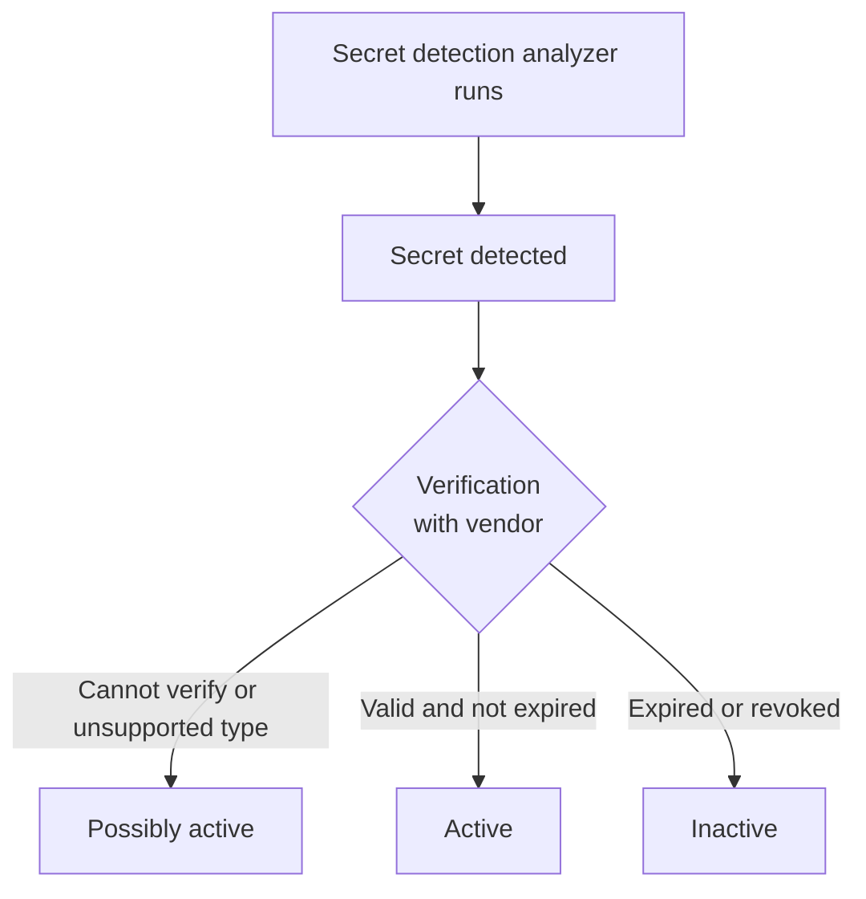



- Tier: 旗舰版
- Offering: JihuLab.com，私有化部署





- 在极狐GitLab 18.0 中引入，通过功能标志 `validity_checks`，默认禁用。
- 在极狐GitLab 18.2 中引入了额外访问权限，通过功能标志 `validity_checks_security_finding_status`，默认禁用。
- 在极狐GitLab 18.5 中于 JihuLab.com 上启用。
- 在极狐GitLab 18.5 中从实验性功能变更为测试版。
- 在极狐GitLab 18.7 中 GA。功能标志 `validity_checks_security_finding_status` 已移除。
- 在极狐GitLab 18.7 中 GA。功能标志 `validity_checks` 默认启用。
- 在极狐GitLab 18.8 中移除了功能标志 `validity_checks`。



> [!flag]
> 此功能的可用性由功能标志控制。
> 更多信息，请参阅历史记录。

极狐GitLab 有效性检查确定密钥（如访问令牌）是否活跃。
密钥在以下情况下活跃：

- 未过期。
- 可用于身份验证。

由于活跃密钥可用于冒充合法用户，它们比不活跃密钥构成更大的安全风险。如果多个密钥同时泄露，
了解哪些密钥是活跃的是分类和修复的重要部分。

<a id="enable-validity-checks"></a>

## 启用有效性检查

先决条件：

- 您必须有一个已启用流水线安全扫描的项目。

要为项目启用有效性检查：

1. 在顶部栏，选择 **搜索或跳转到** 并找到您的项目。
2. 在左侧边栏，选择 **安全** > **安全配置**。
3. 在 **流水线密钥检测** 下，打开 **有效性检查** 切换开关。

当 `secret_detection` CI/CD 作业完成时，极狐GitLab 会检查检测到的密钥的状态。
要查看密钥的状态，请查看漏洞详情页。要更新密钥的状态，
例如在撤销后，重新运行 `secret_detection` CI/CD 作业。

要在群组级别开启有效性检查，作为维护者或更高角色，使用 [GraphQL API 变更](../../../api/graphql/reference/_index.md#mutationsetgroupvaliditychecks)：

```graphql
mutation {
  setGroupValidityChecks(input: {
    validityChecksEnabled: true,
    namespacePath: "my-group/my-subgroup",
    projectsToExclude: [100, 105, 108]
  }) {
    clientMutationId
    validityChecksEnabled
  }
}
```

<a id="coverage"></a>

### 覆盖范围



- 在极狐GitLab 18.7 中引入了对外部服务令牌的支持，通过功能标志 `secret_detection_partner_token_verification`，默认启用。



> [!flag]
> 此功能的可用性由功能标志控制。
> 更多信息，请参阅历史记录。

有效性检查支持以下密钥类型：

**极狐GitLab 令牌：**

- 极狐GitLab 个人访问令牌
- 可路由的极狐GitLab 个人访问令牌
- 极狐GitLab 部署令牌
- 极狐GitLab Runner 认证令牌
- 可路由的极狐GitLab Runner 认证令牌
- 极狐GitLab Kubernetes 代理令牌
- 极狐GitLab SCIM OAuth 令牌
- 极狐GitLab CI/CD 作业令牌
- 极狐GitLab 接收邮件令牌
- 极狐GitLab 订阅令牌 (v2)
- 极狐GitLab 流水线触发令牌

**外部服务令牌：**

- AWS IAM 秘密访问密钥
- GCP API 密钥
- GCP OAuth 客户端密钥
- Postman API 令牌

<a id="validity-check-workflow"></a>

## 有效性检查工作流

当密钥检测分析器检测到潜在密钥时，极狐GitLab 会向供应商验证该密钥的状态，并为检测分配以下状态之一：

- 可能活跃：极狐GitLab 无法验证密钥状态，或该密钥类型不受有效性检查支持。
- 活跃：密钥未过期，可用于身份验证。
- 不活跃：密钥已过期或已撤销，无法用于身份验证。

您应尽快轮换活跃和可能活跃的密钥。



<a id="refresh-secret-status"></a>

## 刷新密钥状态



- 在极狐GitLab 18.2 中引入，通过功能标志 `secret_detection_validity_checks_refresh_token`，默认禁用。
- 在极狐GitLab 18.7 中 GA。功能标志 `secret_detection_validity_checks_refresh_token` 已移除。



有效性检查运行后，令牌的状态不会自动更新，即使令牌被撤销或过期。
要更新令牌，您可以手动刷新状态：

1. 在漏洞报告中，选择您要刷新的漏洞。
2. 在令牌状态旁边，选择 **重试** ()。

有效性检查将重新运行，令牌状态将更新。

<a id="troubleshooting"></a>

## 故障排除

在使用有效性检查时，您可能会遇到以下问题。

<a id="unexpected-token-status"></a>

### 意外的令牌状态

当极狐GitLab 无法验证令牌的有效性时，令牌将具有可能活跃状态。
可能的原因包括：

- 密钥验证作业尚未运行。
- 该密钥类型不受有效性检查支持。
- 连接到令牌提供者时出现问题。

要解决此问题，请重新运行 `secret_detection` 作业。如果几次尝试后状态仍然存在，
您可能需要手动验证密钥。

除非您确定令牌不活跃，否则应尽快撤销并替换可能活跃的密钥。

<a id="external-service-token-verification-delays"></a>

### 外部服务令牌验证延迟

由于外部服务施加的速率限制，外部服务令牌验证可能比极狐GitLab 令牌验证花费更长时间。如果外部服务令牌暂时显示 **可能活跃** 状态，
这是正常的。验证已排队并将很快完成。检查 **最后验证于**
时间戳以查看状态上次更新的时间，或稍后刷新页面。