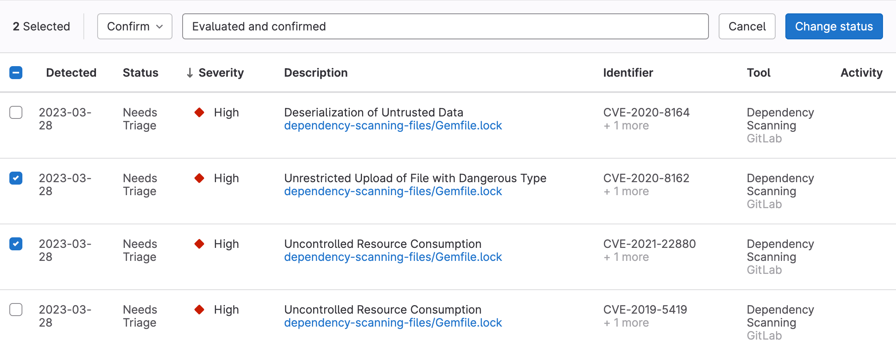
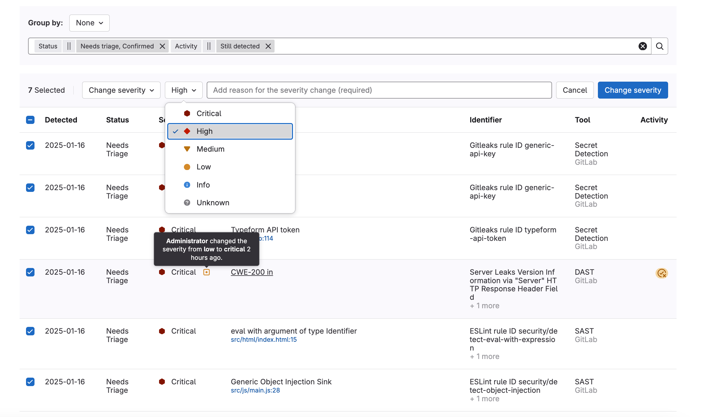



- Tier: 旗舰版
- Offering: JihuLab.com，私有化部署





- 在极狐GitLab 17.5 中，漏洞解决活动图标随名为 [`vulnerability_report_vr_badge`](https://gitlab.com/gitlab-org/gitlab/-/issues/486549) 的功能标志引入。默认禁用。
- 在极狐GitLab 17.6 中默认启用。
- 在极狐GitLab 18.0 中 GA。功能标志 `vulnerability_report_vr_badge` 已移除。



漏洞报告提供了在代码库中发现的安全漏洞的综合视图。按严重程度、报告类型、扫描器（仅限项目）和其他属性对漏洞进行排序，以确定哪些问题需要优先关注。通过状态指示器和显示修复进度的活动图标来跟踪漏洞的全生命周期。

访问每个漏洞的详细信息，包括通用漏洞评分系统（CVSS）评分和文件位置（如果可用）。筛选并对相似漏洞进行分组，以便系统化地处理它们。

出于性能原因，如果漏洞总数超过 1000，漏洞报告会将计数显示为 **1000+** 而不是确切数字。此限制仅影响页面顶部显示的计数。你仍然可以在表格中查找到所有漏洞。

计划在议题 [547510](https://gitlab.com/gitlab-org/gitlab/-/issues/547510) 中改进以显示确切数量。要查找确切数量，请使用专题 [480378](https://gitlab.com/gitlab-org/gitlab/-/issues/480378#workarounds) 中的一种变通方法。

> [!note]
> 在 JihuLab.com 上，漏洞会在最后一次更新一年后被归档。

## 漏洞报告的内容

报告包含默认分支的数据，显示所有成功的安全扫描作业的累积结果。扫描结果在作业完成后或流水线被手动作业阻塞时显示。

对于项目和群组，漏洞报告包含：

- 每个严重性级别的漏洞总数。
- 常见漏洞属性的筛选器。
- 每个漏洞的详细信息，以表格形式呈现。

对于某些漏洞，详细信息包括指向默认分支中相关文件和行号的链接。对于 CVE 漏洞，你还可以在漏洞报告中查看 KEV 状态、CVSS 和 EPSS 评分以及可达性信息。

对于项目，漏洞报告还包含：

- 一个时间戳，显示默认分支上次更新的时间，包括指向最新流水线的链接。针对非默认分支运行的流水线不会更新时间戳。
- 最近一次流水线中发生的失败次数。选择失败通知以查看流水线页面的 **失败作业** 选项卡。

**活动** 列包含图标，用于指示对该行中的漏洞已采取的活动（如果有）：

- 议题 ：链接到为该漏洞创建的议题。
- 合并请求 ：链接到为该漏洞创建的合并请求。
- 已检查圆圈 ：该漏洞已被修复。
- 误报 ：扫描器确定此漏洞为误报。
- 解决方案 ：表示该漏洞有可用的解决方案。
- 漏洞解决方案 ：表示该漏洞有可用的 AI 解决方案。
- 误报检测 ：表示极狐GitLab Duo 已分析此漏洞是否为误报。将鼠标悬停在图标上可查看置信度分数和解释。

要打开为漏洞创建的议题，将鼠标悬停在 **活动** 条目上，然后选择链接。议题图标 () 指示议题的状态。如果启用了 Jira 议题支持，**活动** 条目中的议题链接会跳转到 Jira 中的议题。与极狐GitLab 议题不同，Jira 议题的状态不会在极狐GitLab UI 中显示。

当漏洞源自多项目流水线设置时，此页面显示源自所选项目的漏洞。

## 查看漏洞报告

查看漏洞报告以列出项目或群组中的所有漏洞。

先决条件：

- 你必须具有项目或群组的 安全经理、开发者、维护者或 所有者 角色。

要查看漏洞报告：

1. 在顶部栏中，选择 **搜索或跳转到** 并找到你的项目或群组。
1. 在左侧边栏中，选择 **安全** > **漏洞报告**。

## 筛选漏洞



- **标识符** 筛选器在极狐GitLab 17.7 中随名为 `vulnerability_filtering_by_identifier` 的功能标志引入。默认启用。
- **标识符** 筛选器在极狐GitLab 17.9 中 GA。功能标志 `vulnerability_filtering_by_identifier` 已移除。
- **策略违规** 筛选器：
  - 在极狐GitLab 18.6 中随名为 `policy_violations_es_filter` 和 `security_policy_approval_warn_mode` 的功能标志引入。在 JihuLab.com 上启用。
  - 在极狐GitLab 18.9 中 GA。功能标志 `security_policy_approval_warn_mode` 已移除。



你可以在漏洞报告中筛选漏洞，以更高效地进行分类。

你可以按以下条件筛选：

<!-- vale gitlab_base.SubstitutionWarning = NO -->

- **状态**：漏洞的当前状态：需要分类、已确认、已忽略 或 已解决。已忽略的漏洞可以按其被忽略的原因一起或单独筛选。
- **严重程度**：漏洞的严重性值：严重、高、中、低、信息、未知。
- **报告类型**：检测到漏洞的报告类型，例如 SAST 或 容器模糊测试。
- **扫描器**：识别漏洞的特定扫描器。
- **活动**：漏洞的其他属性，例如漏洞是否有议题、合并请求或可用的解决方案。
- **标识符**：漏洞的标识符（需要高级漏洞管理。如果未启用高级漏洞管理，则最多可在包含 20,000 个漏洞的项目和群组中使用）。
- **项目**：筛选特定项目中的漏洞（仅对群组可用）。
- **可达性**：按漏洞的可达性状态筛选：是、未找到 或 不可用。要使用此筛选器，你必须启用高级漏洞管理。
- **有效性检查**：按漏洞的有效性状态筛选：活跃、不活跃 或 可能活跃。要使用此筛选器，你必须启用高级漏洞管理。
- **策略违规**：按绕过原因筛选漏洞。显示在用户从处于警告模式的安全策略中绕过安全策略违规时引入的漏洞。当用户绕过处于警告模式的策略的任何违规时，必须提供原因。要使用此筛选器，你必须启用高级漏洞管理。

<!-- vale gitlab_base.SubstitutionWarning = YES -->

### 筛选漏洞



- 改进的筛选功能在极狐GitLab 16.9 中随名为 `vulnerability_report_advanced_filtering` 的功能标志引入。默认禁用。
- 在极狐GitLab 17.1 中于 JihuLab.com、私有化部署实例上启用。
- 在 17.2 中 GA。功能标志 `vulnerability_report_advanced_filtering` 已移除。



筛选漏洞报告以关注一个漏洞子集。

要筛选漏洞列表：

1. 在顶部栏中，选择 **搜索或跳转到** 并找到你的项目。
1. 在左侧边栏中，选择 **安全** > **漏洞报告**。
1. 可选。要移除默认筛选器，请选择 **清除** ()。
1. 在漏洞列表上方，选择筛选栏。
1. 在出现的下拉列表中，选择你要筛选的属性，然后从下拉列表中选择值。
1. 在筛选字段外点击。漏洞严重性总数和匹配的漏洞列表会更新。
1. 要按多个属性筛选，请重复前三个步骤。多个属性由逻辑 AND 连接。

### 报告类型筛选器

你可以根据检测到漏洞的报告类型来筛选漏洞。默认情况下，漏洞报告列出所有报告类型的漏洞。

使用 **手动添加** 属性来筛选手动添加的漏洞。

### 扫描器筛选器

对于项目，你可以根据检测到漏洞的扫描器来筛选漏洞。默认情况下，漏洞报告列出所有扫描器的漏洞。

### 项目筛选器

项目筛选器的内容有所不同：

- **安全中心**：仅列出你已添加到个人安全中心的项目。
- **群组**：群组中的所有项目。
- **项目**：不适用。

### 活动筛选器



- 在极狐GitLab 16.7 中随名为 `activity_filter_has_remediations` 的功能标志引入。默认禁用。
- 在极狐GitLab 16.9 中 GA。功能标志 `activity_filter_has_remediations` 已移除。
- 活动筛选器选项 **极狐GitLab Duo (AI)**：
  - 在极狐GitLab 17.5 中随名为 [`vulnerability_report_vr_filter`](https://gitlab.com/gitlab-org/gitlab/-/issues/486534) 的功能标志引入。默认禁用。
  - 在极狐GitLab 17.6 中默认启用。
  - 在极狐GitLab 18.0 中 GA。`vulnerability_report_vr_filter` 标志已移除。
  - 在极狐GitLab 18.10 中，将 **GitLab Duo (AI)** 筛选器名称更改为 **GitLab Duo 解决方案**。
- 活动筛选器选项 **GitLab Duo FP 检测**：
  - 在极狐GitLab 18.10 中随名为 `vulnerability_report_ai_fp_filter` 的功能标志引入。默认禁用。
  - 在极狐GitLab 18.11 中 GA。功能标志 `vulnerability_report_ai_fp_filter` 已移除。



活动筛选器的行为与其他筛选器不同。在每个类别中，你只能选择一个值。要移除筛选器，请从活动筛选器下拉列表中选择你要移除的筛选器。

使用活动筛选器时的选择行为：

- **活动**
  - **所有活动**：具有任何活动状态的漏洞（与忽略此筛选器相同）。选择此选项会取消选择所有其他活动筛选器选项。
- **检测**
  - **仍被检测到**（默认）：在 `default` 分支的最新流水线扫描中仍被检测到的漏洞。
  - **不再被检测到**：在 `default` 分支的最新流水线扫描中不再被检测到的漏洞。
- **议题**
  - **有关联议题**：具有一个或多个关联议题的漏洞。
  - **无议题**：没有关联议题的漏洞。
- **合并请求**
  - **有关联合并请求**：具有一个或多个关联合并请求的漏洞。
  - **无合并请求**：没有关联合并请求的漏洞。
- **解决方案可用**
  - **有解决方案**：可以通过自动合并请求解决的漏洞。
  - **没有解决方案**：没有可用的自动合并请求解决方案的漏洞。
- **极狐GitLab Duo 解决方案**：
  - **有可用的漏洞解决方案**：具有可用 AI 解决方案的漏洞。
  - **无可用的漏洞解决方案**：没有可用 AI 解决方案的漏洞。
- **极狐GitLab Duo FP 检测**：
  - **误报**：被极狐GitLab Duo 标记为可能误报的漏洞。
  - **未识别为误报**：未被识别为误报或未被极狐GitLab Duo 标记的漏洞。

**极狐GitLab Duo (AI)** 筛选器在以下情况下可用：

- 安全中心漏洞报告：安全中心中的任何项目都开启了其 **极狐GitLab Duo** 开关。
- 群组漏洞报告：对于群组，**极狐GitLab Duo 功能** 设置为 **默认开启**。
- 项目漏洞报告：对于项目，**极狐GitLab Duo** 开关已开启。

### 可达性筛选器



- 在极狐GitLab 18.3 中于 JihuLab.com 上引入。
- 在极狐GitLab 18.7 中于私有化部署实例上启用。



对于群组和项目，你可以根据可达性值筛选漏洞。默认情况下，漏洞报告列出具有任何可达性值的漏洞。

此筛选器需要高级漏洞管理。

### 有效性检查筛选器



- 在极狐GitLab 18.5 中随名为 [`validity_check_es_filter`](https://gitlab.com/gitlab-org/gitlab/-/issues/560433) 的功能标志引入。默认禁用。
- 在极狐GitLab 18.7 中于 JihuLab.com 和私有化部署实例上启用。
- 在极狐GitLab 18.7 中 GA。功能标志 `validity_check_es_filter` 已移除。



对于群组和项目，你可以根据有效性检查值筛选漏洞。默认情况下，漏洞报告列出状态为可能活跃的漏洞。

此筛选器需要高级漏洞管理。

## 漏洞分组



- 按项目分组漏洞：
  - 在极狐GitLab 16.4 中随名为 `vulnerability_report_grouping` 的功能标志引入。默认禁用。
  - 在极狐GitLab 16.5 中于私有化部署实例上启用。
  - 在极狐GitLab 16.6 中 GA。功能标志 `vulnerability_report_grouping` 已移除。
- 按群组分组漏洞：
  - 在极狐GitLab 16.7 中随名为 [`group_level_vulnerability_report_grouping`](https://gitlab.com/gitlab-org/gitlab/-/issues/432778) 的功能标志引入。默认禁用。
  - 在极狐GitLab 17.2 中于私有化部署实例上启用。
  - 在极狐GitLab 17.3 中 GA。功能标志 `group_level_vulnerability_report_grouping` 已移除。
- 按 OWASP 十大安全风险对群组漏洞进行分组：
  - 在极狐GitLab 16.8 中随名为 `vulnerability_owasp_top_10_group` 的功能标志引入。默认禁用。
  - 在极狐GitLab 17.4 中于私有化部署实例上启用。
  - 在极狐GitLab 17.4 中 GA。功能标志 `vulnerability_owasp_top_10_group` 已移除。
- OWASP 十大安全风险分组中的非 OWASP 类别：
  - 在极狐GitLab 17.1 中随名为 `owasp_top_10_null_filtering` 的功能标志引入。默认禁用。
  - 在极狐GitLab 17.5 中于私有化部署实例上启用。
  - 在极狐GitLab 17.6 中 GA。功能标志 `owasp_top_10_null_filtering` 已移除。
- OWASP 2021 十大安全风险分组：
  - 在极狐GitLab 18.1 中于 JihuLab.com 上引入。
  - 在极狐GitLab 18.7 中于私有化部署实例上启用。



你可以在漏洞报告页面上对漏洞进行分组，以更高效地进行分类。

你可以按以下条件分组：

- 状态
- 严重程度
- 报告类型
- 扫描器
- OWASP 十大安全风险 2017
- OWASP 十大安全风险 2021（需要高级漏洞管理）

### 漏洞分组

要对漏洞进行分组：

1. 在顶部栏中，选择 **搜索或跳转到** 并找到你的项目或群组。
1. 在左侧边栏中，选择 **安全** > **漏洞报告**。
1. 从 **分组依据** 下拉列表中选择一个分组。

漏洞将根据你选择的分组进行分组。每个组都是折叠的，组名旁边会显示每个组中漏洞的总数。要查看每个组中的漏洞，请选择该组的名称。

## 查看漏洞详情

要查看漏洞的更多详细信息，请选择该漏洞的 **描述**。将打开漏洞详情页面。

## 更改漏洞状态



- 在极狐GitLab 16.0 中引入提供评论和忽略原因的功能。



在对漏洞进行分类时，你可以更改其状态，包括忽略漏洞。

当漏洞被忽略时，审计日志会包含谁忽略了它、何时忽略以及被忽略原因的记录。你不能删除漏洞记录，因此始终会保留一条永久记录。

先决条件：

- 你必须具有项目的 安全经理、维护者或 所有者 角色。在极狐GitLab 17.0 中，`admin_vulnerability` 权限已从开发者角色中移除。

要更改漏洞状态：

1. 在顶部栏中，选择 **搜索或跳转到** 并找到你的项目。
1. 在左侧边栏中，选择 **安全** > **漏洞报告**。
1. 要选择：
   - 一个或多个漏洞，请选中每个漏洞旁边的复选框。
   - 页面上的所有漏洞，请选中表头中的复选框。
1. 在 **设置状态** 下拉列表中，选择所需状态。
1. 如果选择了 **忽略** 状态，请在 **设置忽略原因** 下拉列表中选择所需原因。
1. 在 **添加评论** 输入框中，你可以提供评论。对于 **忽略** 状态，评论是必填的。
1. 选择 **更改状态**。

所选漏洞的状态将更新，漏洞报告的内容也会刷新。

## 更改或覆盖漏洞严重性



- 在极狐GitLab 17.9 中随名为 `vulnerability_severity_override` 的功能标志引入。默认禁用。
- 在极狐GitLab 17.10 中于 JihuLab.com 和私有化部署实例上启用。
- 在极狐GitLab 18.1 中 GA。功能标志 `vulnerability_severity_override` 已移除。
- 在极狐GitLab 18.1 中新增了一个功能标志，管理员可以启用以阻止用户更改或覆盖严重性级别，该功能名为 `hide_vulnerability_severity_override`。默认禁用。



> [!flag]
> 此功能的可用性由功能标志控制。
> 更多信息，请参阅历史记录。

在某些情况下，你可能需要调整检测到的漏洞的严重性，以更好地反映你组织的优先级。例如，扫描器可能报告较低的严重性，但根据你的环境或设置，你可能认为它更严重。此功能允许你覆盖扫描器分配的默认严重性。

先决条件：

- 你必须具有项目的 安全经理、维护者或 所有者 角色，或者拥有 `admin_vulnerability` 权限。

要手动覆盖漏洞的严重性：

1. 在顶部栏中，选择 **搜索或跳转到** 并找到你的项目。
1. 转到 **安全** > **漏洞报告**。
1. 选择漏洞：
   - 要选择单个漏洞，请选中每个漏洞旁边的复选框。
   - 要选择页面上的所有漏洞，请选中表头中的复选框。
1. 在 **选择操作** 下拉列表中，选择 **更改严重性**。
1. 在 **选择严重性** 下拉列表中，选择所需的严重性级别。
1. 在 **添加严重性更改原因（必填）** 文本框中，简要说明你为何更改严重性。
1. 选择 **更改严重性**。

对于每个选定的漏洞：

- 其严重性会在 **漏洞详情页面** 和 **漏洞报告** 中更新。
- 其严重性旁边会添加一个徽章，表明严重性已被覆盖。
- 手动严重性调整会记录在漏洞的历史记录中。

## 阻止用户覆盖漏洞严重性



- 在极狐GitLab 18.1 中随名为 `hide_vulnerability_severity_override` 的功能标志引入。默认禁用。



> [!flag]
> 此功能的可用性由功能标志控制。
> 更多信息，请参阅历史记录。

在某些环境中，你可能需要阻止用户覆盖漏洞的严重性。`hide_vulnerability_severity_override` 功能标志允许管理员在漏洞报告中隐藏严重性覆盖功能。此功能帮助组织在各项目间维持标准化的漏洞严重性评级。
启用此功能后：

- 从漏洞报告的操作下拉列表中隐藏 **更改严重性** 选项。
- 阻止用户通过 UI 手动更改严重性级别，确保基于扫描器结果进行一致的漏洞评分。
- 禁用与修改漏洞严重性相关的所有 API 端点，保持所有访问方法的一致性。
要启用 `hide_vulnerability_severity_override` 功能标志，请参见[启用和禁用部署在功能标志后的极狐GitLab 功能](../../../administration/feature_flags/_index.md)。

## 将漏洞添加到现有议题



- 在 极狐GitLab 17.9 [通过功能标志](../../../administration/feature_flags/_index.md) 引入，名为 `enhanced_vulnerability_bulk_actions`。默认禁用。
- 在 极狐GitLab 18.0 中在 JihuLab.com 和 私有化部署 上启用。
- 在 极狐GitLab 18.1 中 GA。功能标志 `enhanced_vulnerability_bulk_actions` 已移除。



你可以在漏洞报告中将一个或多个漏洞关联到现有议题。

前提条件：

- 你必须具有项目的安全经理、维护者或所有者角色，或在自定义角色中拥有 `admin_vulnerability` 权限。在 极狐GitLab 17.0 中，`admin_vulnerability` 权限已从开发者角色中移除。

要将漏洞附加到现有议题：

1. 在顶部栏中，选择 **搜索或跳转到** 并找到你的项目或群组。
1. 进入 **安全** > **漏洞报告**。
1. 选择漏洞：
   - 要选择单个漏洞，请选中每个漏洞旁边的复选框。
   - 要选择页面上的所有漏洞，请选中表头中的复选框。
1. 在 **选择操作** 下拉列表中，选择 **附加到现有议题**。
1. 在 **输入议题 URL 或 <#议题 ID>** 文本框中，输入议题 ID 以自动补全，或添加议题的 URL。你可以输入多个议题来添加漏洞。
1. 选择 **添加**。

每个选中的漏洞都将链接到所有指定的议题。

## 将漏洞添加到新议题



- 在 极狐GitLab 17.9 [通过功能标志](../../../administration/feature_flags/_index.md) 引入，名为 `new_issue_attachment_from_vulnerability_bulk_action`。默认禁用。
- 在 极狐GitLab 18.0 中在 JihuLab.com 和 私有化部署 上启用。
- 在 极狐GitLab 18.1 中 GA。功能标志 `new_issue_attachment_from_vulnerability_bulk_action` 已移除。



你可以将一个或多个漏洞关联到一个新议题。

前提条件：

- 你必须具有项目的安全经理、维护者或所有者角色，或在自定义角色中拥有 `admin_vulnerability` 权限。在 极狐GitLab 17.0 中，`admin_vulnerability` 权限已从开发者角色中移除。

要将漏洞附加到新议题：

1. 在顶部栏中，选择 **搜索或跳转到** 并找到你的项目或群组。
1. 进入 **安全** > **漏洞报告**。
1. 选择漏洞：
   - 要选择单个漏洞，请选中每个漏洞旁边的复选框。
   - 要选择页面上的所有漏洞，请选中表头中的复选框。
1. 在 **选择操作** 下拉列表中，选择 **附加到新议题**。
1. 选择 **创建议题**。

你将被重定向到一个新议题。每个选中的漏洞已经链接到该议题。

## 按检测日期排序漏洞

默认情况下，漏洞按严重性级别排序，最高严重性的漏洞列在顶部。

要按每个漏洞的检测日期排序，请选择“检测时间”列标题。

## 导出



- 在 CSV 导出中添加“忽略原因”列，在 极狐GitLab 16.8 中引入。



你可以导出漏洞报告中列出的漏洞的详细信息。导出格式为 CSV（逗号分隔值）。所有漏洞都会包含在内，因为筛选器不适用于导出。

包含的字段有：

- 状态（有关状态值如何导出的详细信息，请参见下表。）
- 群组名称
- 项目名称
- 报告类型
- 扫描器名称
- 漏洞
- 基本信息
- 附加信息
- 严重性
- [CVE](https://cve.mitre.org/)（通用漏洞披露）
- [CWE](https://cwe.mitre.org/)（通用弱点枚举）
- 其他标识符
- 检测时间
- 位置
- 活动：如果漏洞在默认分支上已解决，则返回 `true`，否则返回 `false`。
- 评论
- 完整路径
- CVSS 向量
- [忽略原因](../vulnerabilities/_index.md#vulnerability-dismissal-reasons)
- 漏洞 ID

> [!note]
> 完整详情可通过我们的
> [作业产物 API](../../../api/job_artifacts.md#download-a-single-artifact-file-by-reference-name) 获取。
> 使用 `gl-*-report.json` 报告文件名之一代替 `*artifact_path`
> 来获取，例如，检测到漏洞的文件路径。

漏洞报告中显示的状态字段值与漏洞导出中包含的值不同。使用以下参考表进行匹配。

| 漏洞报告 | 漏洞导出 |
|:---------------------|:---------------------|
| 需要分类             | detected             |
| 已忽略               | dismissed            |
| 已解决               | resolved             |
| 已确认               | confirmed            |

### 导出详情

要导出漏洞报告中列出的所有漏洞的详细信息，请选择 **导出**。

当导出的详细信息可用时，你将收到一封电子邮件。要下载导出的详细信息，请选择电子邮件中的链接。

> [!note]
> 某些 CSV 阅读器对行数或列大小有限制，这可能导致它们与较大的导出文件不兼容。漏洞导出不会
> 考虑各个程序的限制。

## 手动添加漏洞

当漏洞不在极狐GitLab 漏洞数据库中时，可以手动添加漏洞。你只能在项目的漏洞报告中添加漏洞。

要手动添加漏洞：

1. 在顶部栏中，选择 **搜索或跳转到** 并找到你的项目。
1. 在左侧边栏中，选择 **安全** > **漏洞报告**。
1. 选择 **提交漏洞**。
1. 填写字段并提交表单。

新创建的漏洞的详情页面将打开。

## 高级漏洞管理



- 高级搜索中的 OWASP 2021 分组和标识符筛选器：
  - 在 极狐GitLab 18.2 中通过功能标志 `advanced_vulnerability_management` 引入。在 JihuLab.com 上可用。默认启用。
  - 在 极狐GitLab 18.7 中在私有化部署上启用。
  - 在 极狐GitLab 18.11 中 GA。功能标志 `advanced_vulnerability_management` 已移除。
- 高级搜索中的策略违规筛选器：
  - 在 极狐GitLab 18.6 中通过功能标志 `policy_violations_es_filter` 和 `security_policy_approval_warn_mode` 引入。在 JihuLab.com 上可用。默认启用。
  - 在 极狐GitLab 18.7 中在私有化部署上启用。
  - 在 极狐GitLab 18.9 中 GA。功能标志 `security_policy_approval_warn_mode` 已移除。功能标志 `policy_violations_es_filter` 和 `security_policy_approval_warn_mode` 已移除。



极狐GitLab 主要在漏洞报告中使用 PostgreSQL 进行筛选。由于数据库索引限制和应用多个筛选器时的性能挑战，极狐GitLab 使用[高级搜索](../../search/advanced_search.md)来实现特定的漏洞管理功能。

高级搜索支持以下功能：

1. 在项目或群组的漏洞报告中按 OWASP 2021 类别对数据进行分组。
1. 在项目或群组的漏洞报告中根据漏洞的标识符进行筛选。
1. 在项目或群组的漏洞报告中根据可达性值进行筛选。
1. 在项目或群组的漏洞报告中根据有效性检查状态进行筛选。
1. 在项目或群组的漏洞报告中根据策略违规绕过原因进行筛选。
1. 在[新的安全仪表板](../security_dashboard/_index.md)中筛选面板和整个仪表板数据。

高级搜索仅用于这些特定功能，包括当它们与其他[筛选器](#filter-vulnerabilities)结合使用时。其他筛选器在独立使用时，继续使用标准的 PostgreSQL 筛选。

> [!note]
> 在私有化部署的 极狐GitLab 上，从早于 18.7 的版本升级后，在数据迁移完成期间，高级漏洞管理功能可能暂时不可用，通常持续几个小时。
> 迁移完成后，全部功能将可用。

### 要求

要使用高级漏洞管理中的功能：

- 你必须[启用高级搜索](../../search/advanced_search.md#use-advanced-search)。
- 在私有化部署的 极狐GitLab 上，[设置高级搜索](../../../integration/advanced_search/elasticsearch.md#enable-advanced-search)后，确保选中 **使用高级搜索进行搜索** 复选框。

## 运维漏洞

**运维漏洞** 选项卡列出了由[运维容器扫描](../../clusters/agent/vulnerabilities.md)发现的漏洞。
此选项卡显示在项目、群组和安全中心的漏洞报告中。