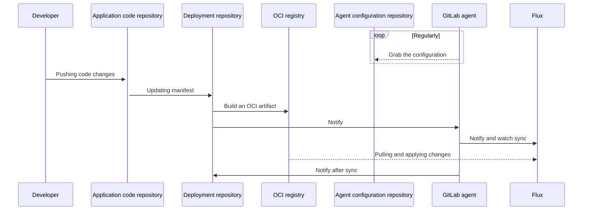



- Tier: 基础版，专业版，旗舰版
- Offering: JihuLab.com，私有化部署





- 在 15.3 中从 极狐GitLab 专业版 移至 极狐GitLab 基础版。
- 在 极狐GitLab 15.7 中将 `id` 属性设为可选。
- 在 极狐GitLab 15.7 中引入了指定分支、标签或提交引用来获取 Kubernetes 清单文件。
- 在 极狐GitLab 16.1 中更改，优先使用 Flux 进行 GitOps。



极狐GitLab 集成了 Flux 用于 GitOps。
要开始使用 Flux，请参阅 [Flux for GitOps 教程](getting_started.md)。

通过 GitOps，您可以从一个 Git 仓库管理容器化集群和应用程序，该仓库：

- 是您系统的单一真实来源。
- 是您操作系统的唯一位置。

通过结合极狐GitLab、Kubernetes 和 GitOps，您可以拥有：

- 极狐GitLab 作为 GitOps 操作者。
- Kubernetes 作为自动化与收敛系统。
- 极狐GitLab CI/CD 用于持续集成。
- 代理用于持续部署和集群可观测性。
- 内置的自动漂移修复。
- 通过服务端应用进行资源管理，实现透明的多角色字段管理。

<a id="deployment-sequence"></a>

## 部署序列

此图显示了 GitOps 部署中的仓库和主要参与者：



您应该同时使用 Flux 和 `agentk` 进行 GitOps 部署。Flux 保持集群状态与源同步，而 `agentk` 简化了 Flux 的设置，提供集群到极狐GitLab 的访问管理，并在极狐GitLab UI 中可视化集群状态。

<a id="oci-for-source-control"></a>

### OCI 用于源控制

您应该使用 OCI 镜像作为 Flux 的源控制器，而不是 Git 仓库。[极狐GitLab 容器镜像仓库](../../packages/container_registry/_index.md)支持 OCI 镜像。

| OCI 镜像仓库 | Git 仓库 |
| ---          | ---              |
| 专为大规模提供容器镜像而设计。 | 专为版本控制和存储源代码而设计。 |
| 不可变，支持安全扫描。 | 可变。 |
| 默认 Git 分支可以存储集群状态而不触发同步。 | 默认 Git 分支用于存储集群状态时会触发同步。 |

<a id="repository-structure"></a>

## 仓库结构

为简化配置，每个团队使用一个交付仓库。
您可以将交付仓库打包为每个应用程序的多个 OCI 镜像。

有关其他仓库结构建议，请参阅 [Flux 文档](https://fluxcd.io/flux/guides/repository-structure/)。

<a id="immediate-git-repository-reconciliation"></a>

## 即时 Git 仓库协调



- 在 极狐GitLab 16.1 中引入，带有一个名为 `notify_kas_on_git_push` 的功能标志。默认禁用。
- 在 极狐GitLab 16.2 中于 JihuLab.com 和私有化部署上启用。
- 在 极狐GitLab 16.3 中移除了功能标志。



通常，Flux 源控制器按配置的时间间隔协调 Git 仓库。
这可能导致从 `git push` 到集群状态协调之间的延迟，并导致从极狐GitLab 进行不必要的拉取。

Kubernetes 代理会自动检测引用其已连接极狐GitLab 实例中项目的 Flux `GitRepository` 对象，
并为该实例配置一个 [`Receiver`](https://fluxcd.io/flux/components/notification/receivers/)。
当 Kubernetes 代理检测到对其有权访问的仓库执行 `git push` 时，`Receiver` 被触发，
Flux 根据仓库的任何更改协调集群。

要使用即时 Git 仓库协调，您必须拥有一个运行以下组件的 Kubernetes 集群：

- Kubernetes 代理。
- Flux `source-controller` 和 `notification-controller`。

即时 Git 仓库协调可以减少推送和协调之间的时间，
但不能保证每个 `git push` 事件都被接收。您仍应将
[`GitRepository.spec.interval`](https://fluxcd.io/flux/components/source/gitrepositories/#interval)
设置为可接受的持续时间。

> [!note]
> 代理仅能访问代理配置项目和所有公共项目。
> 代理无法立即协调任何私有项目，除了代理配置项目。

<a id="custom-webhook-endpoints"></a>

### 自定义 Webhook 端点

当 Kubernetes 代理调用 `Receiver` webhook 时，
代理默认使用 `http://webhook-receiver.flux-system.svc.cluster.local`，
这也是 Flux 引导安装设置的默认 URL。要配置自定义
端点，请将 `flux.webhook_receiver_url` 设置为代理可以解析的 URL。例如：

```yaml
flux:
  webhook_receiver_url: http://webhook-receiver.another-flux-namespace.svc.cluster.local
```

对于以此格式配置的
[服务代理 URL](https://kubernetes.io/docs/tasks/access-application-cluster/access-cluster-services/)，有特殊处理：`/api/v1/namespaces/[^/]+/services/[^/]+/proxy`。例如：

```yaml
flux:
  webhook_receiver_url: /api/v1/namespaces/flux-system/services/http:webhook-receiver:80/proxy
```

在这些情况下，Kubernetes 代理使用可用的 Kubernetes 配置
和上下文连接到 API 端点。
如果您在集群外运行代理且尚未为 Flux 通知控制器[配置 `Ingress`](https://fluxcd.io/flux/guides/webhook-receivers/#expose-the-webhook-receiver)，
则可以使用此方法。

> [!warning]
> 您应仅配置可信的服务代理 URL。
> 当您提供服务代理 URL 时，
> Kubernetes 代理会发送典型的 Kubernetes API 请求，其中包含
> 与 API 服务进行身份验证所需的凭据。

<a id="token-management"></a>

## 令牌管理

要使用某些 Flux 功能，您可能需要多个访问令牌。此外，您可以使用多种令牌类型来实现相同的结果。

本节为您可能需要的令牌提供指南，并在可能的情况下提供令牌类型建议。

<a id="gitlab-access-by-flux"></a>

### Flux 访问极狐GitLab

要访问极狐GitLab 容器镜像仓库或 Git 仓库，Flux 可以使用：

- 项目或群组部署令牌。
- 项目或群组部署密钥。
- 项目或群组访问令牌。
- 个人访问令牌。

令牌不需要写入权限。

如果可能使用 `http` 访问，您应使用项目部署令牌。
如果您需要 `git+ssh` 访问，应使用部署密钥。
要比较部署密钥和部署令牌，请参阅[部署密钥](../../project/deploy_keys/_index.md)。

<a id="flux-to-gitlab-notification"></a>

### Flux 到极狐GitLab 通知

如果您将 Flux 配置为从 Git 源同步，[Flux 可以在极狐GitLab 流水线中注册外部作业状态](https://fluxcd.io/flux/components/notification/providers/#git-commit-status-updates)。

要从 Flux 获取外部作业状态，您可以使用：

- 项目或群组部署令牌。
- 项目或群组访问令牌。
- 个人访问令牌。

令牌需要 `api` 作用域。为了最小化泄露令牌的攻击面，您应使用
项目访问令牌。