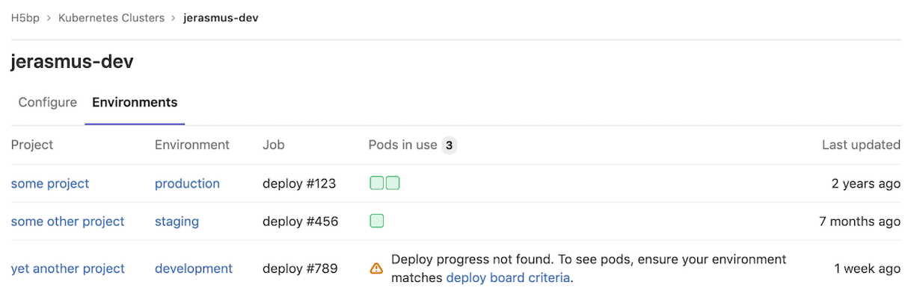



- Tier: 专业版，旗舰版
- Offering: JihuLab.com，私有化部署





- 在极狐GitLab 14.5 中被弃用。
- 在极狐GitLab 15.0 中在私有化部署版上被禁用。



> [!功能标志]
> 默认情况下，此功能在私有化部署版上不可用。要启用它，管理员可以[启用功能标志](../../administration/feature_flags/_index.md) 名为 `certificate_based_clusters`。

# 集群环境（已弃用）

集群环境提供了一个综合视图，展示哪些 CI [环境](../../ci/environments/_index.md)被部署到了 Kubernetes 集群中，并且它：

- 显示与部署相关的项目和相关环境。
- 显示该环境中 pod 的状态。

通过集群环境，你可以深入了解：

- 哪些项目被部署到了集群中。
- 每个项目环境使用了多少个 pod。
- 用于部署到该环境的 CI 作业。

对集群环境的访问仅限于[群组维护者和所有者](../permissions.md#group-permissions)。

## 使用方法

为了：

- 跟踪集群的环境，你必须成功[部署到 Kubernetes 集群](../project/clusters/deploy_to_cluster.md)。
- 正确显示 pod 使用情况，你必须[启用部署面板](../project/deploy_boards.md#enabling-deploy-boards)。

在你成功部署到群组级或实例级集群后：

1. 前往群的 **Kubernetes** 页面。
1. 选择 **环境** 选项卡。

只有成功部署到集群的部署才会包含在此页面中。
非集群环境不会被包含。

