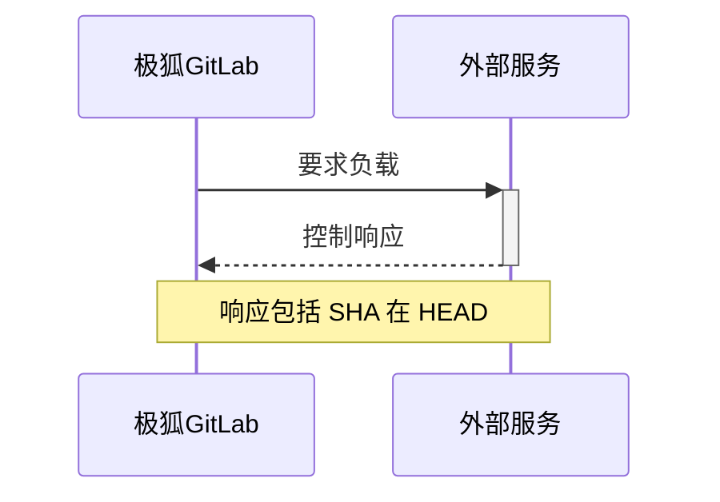



- Tier: 专业版, 旗舰版
- Offering: JihuLab.com, 私有化部署



您可以创建一个合规框架，这是一个标签，用于识别您的项目具有某些合规要求或需要额外的监督。

在旗舰版中，合规框架可以选择性地强制执行[合规流水线配置](../compliance_pipelines.md)和[安全策略](../../application_security/policies/_index.md#scope)应用于其上的项目。

合规框架是在顶级群组上创建的。如果项目被移出其现有顶级群组，则其框架将被移除。

您可以为每个项目应用最多 20 个合规框架。

## 先决条件

- 要创建、编辑和删除合规框架，用户必须具有以下之一：
  - 顶级群组的所有者角色。
  - 被分配为具有 `admin_compliance_framework` [自定义权限](../../custom_roles/abilities.md#compliance-management)的[自定义角色](../../custom_roles/_index.md)。
- 要将合规框架添加或删除到项目或从项目中删除，项目所属的群组必须具有合规框架。

## 创建、编辑或删除合规框架

您可以从合规框架报告中创建、编辑或删除合规框架。有关更多信息，请参见：

- [创建一个新的合规框架](compliance_frameworks_report.md#create-a-new-compliance-framework)。
- [编辑合规框架](compliance_frameworks_report.md#edit-a-compliance-framework)。
- [删除合规框架](compliance_frameworks_report.md#delete-a-compliance-framework)。

您可以从合规项目报告中创建、编辑或删除合规框架。有关更多信息，请参见：

- [创建一个新的合规框架](compliance_projects_report.md#create-a-new-compliance-framework)。
- [编辑合规框架](compliance_projects_report.md#edit-a-compliance-framework)。
- [删除合规框架](compliance_projects_report.md#delete-a-compliance-framework)。

子群组和项目可以访问其顶级群组创建的所有合规框架。然而，合规框架不能在子群组或项目级别创建、编辑或删除。项目所有者可以选择一个框架来应用于他们的项目。

## 将合规框架应用于项目



- 在极狐GitLab 17.3 中引入了分配多个合规框架。



您可以将多个合规框架应用于项目，但不能将合规框架应用于个人命名空间中的项目。

要将合规框架应用于项目，请通过[合规项目报告](compliance_projects_report.md#apply-a-compliance-framework-to-projects-in-a-group)应用合规框架。

您可以使用 [GraphQL API](../../../api/graphql/reference/_index.md#mutationprojectupdatecomplianceframeworks) 来将一个或多个合规框架应用于项目。

如果您使用 GraphQL 在子群组上创建合规框架，则如果用户具有正确的权限，该框架将在根祖先上创建。极狐GitLab UI 提供了只读视图以阻止这种行为。

通过合规框架将合规框架应用于项目：

1. 在左侧边栏中，选择 **搜索或前往** 并找到您的群组。
1. 选择 **安全 > 合规中心**。
1. 在页面上，选择 **项目** 标签。
1. 将鼠标悬停在合规框架上，选择 **编辑框架** 标签。
1. 选择 **项目** 部分。
1. 从列表中选择项目。
1. 选择 **更新框架**。

## 默认合规框架



- 在极狐GitLab 15.6 中引入。



群组所有者可以设置一个默认合规框架。默认框架适用于在该群组中创建的所有新项目和导入的项目。它不影响应用于现有项目的框架。默认框架不能被删除。

设置为默认的合规框架具有 **默认** 标签。

### 使用合规中心设置和移除默认

要从[合规项目报告](compliance_projects_report.md)中设置为默认（或移除默认）：

1. 在左侧边栏中，选择 **搜索或前往** 并找到您的群组。
1. 选择 **安全 > 合规中心**。
1. 在页面上，选择 **项目** 标签。
1. 将鼠标悬停在合规框架上，选择 **编辑框架** 标签。
1. 选择 **设置为默认**。
1. 选择 **保存更改**。

要从[合规框架报告](compliance_frameworks_report.md)中设置为默认（或移除默认）：

1. 在左侧边栏中，选择 **搜索或前往** 并找到您的群组。
1. 选择 **安全 > 合规中心**。
1. 在页面上，选择 **框架** 标签。
1. 将鼠标悬停在合规框架上，选择 **编辑框架** 标签。
1. 选择 **设置为默认**。
1. 选择 **保存更改**。

## 从项目中移除合规框架

要从群组中的一个或多个项目中移除合规框架，请通过[合规项目报告](compliance_projects_report.md#remove-a-compliance-framework-from-projects-in-a-group)移除合规框架。

## 导入和导出合规框架



- 在极狐GitLab 17.11 中引入。



下载现有合规框架作为 JSON 文件，并从 JSON 模板中上传新框架。

### 作为 JSON 文件导出合规框架

使用此功能，您可以共享和备份合规框架。

要从合规中心导出合规框架：

1. 在左侧边栏中，选择 **搜索或前往** 并找到您的群组。
1. 选择 **安全 > 合规中心**。
1. 在页面上，选择 **框架** 标签。
1. 找到您希望导出的合规框架。
1. 选择垂直省略号 ()。
1. 选择 **导出为 JSON 文件**。

JSON 文件下载到您的本地系统。

### 从 JSON 文件导入合规框架

使用此功能，您可以使用共享或备份的合规框架。

要使用 JSON 模板导入合规框架：

1. 在左侧边栏中，选择 **搜索或前往** 并找到您的群组。
1. 选择 **安全 > 合规中心**。
1. 在页面上，选择 **框架** 标签。
1. 选择 **新框架**。
1. 选择 **导入框架**。
1. 在出现的对话框中，从您的本地系统中选择 JSON 文件。

如果导入成功，新的合规框架将出现在列表中。任何错误都会显示以便进行修正。

## 要求



- Tier: 旗舰版
- Offering: JihuLab.com, 私有化部署





- 在极狐GitLab 17.11 中引入，使用名为 `enable_standards_adherence_dashboard_v2` 的[功能标志](../../../administration/feature_flags.md)。默认禁用。



在极狐GitLab 旗舰版中，您可以为合规框架定义特定的**要求**。要求由一个或多个**控制**组成，这些控制是针对分配了框架的项目的配置或行为的检查。每个要求最多有 5 个控制。

### 控制

每个控制都包含极狐GitLab 在计划或触发的扫描期间用于评估项目遵从性的逻辑。有关如何跟踪遵从性的更多详细信息，请参阅[合规状态报告](compliance_status_report.md)。

#### 极狐GitLab 控制

以下控制可以在框架要求中使用：

### 极狐GitLab 合规控制

此表格记录了可以在极狐GitLab 合规框架中使用的所有可用控制。控制是对分配给合规框架的项目的配置或行为的检查。

| 名称 | ID | 描述 | 文档链接 |
|------|----|-----------|--------------------|
| SAST 运行中 | `scanner_sast_running` | 确保静态应用安全测试 (SAST) 已配置并在项目流水线中运行。 | [SAST 配置](../../application_security/sast/_index.md) |
| 至少两个批准 | `minimum_approvals_required_2` | 确保合并请求在合并前至少需要两个批准。 | [合并请求批准](../../project/merge_requests/approvals/_index.md) |
| 作者批准合并请求 | `merge_request_prevent_author_approval` | 确保合并请求的作者不能批准自己的更改。 | [合并请求批准](../../project/merge_requests/approvals/_index.md) |
| 提交者批准合并请求 | `merge_request_prevent_committers_approval` | 确保对合并请求有提交的用户不能批准它。 | [合并请求批准](../../project/merge_requests/approvals/_index.md) |
| 禁止内部可见性 | `project_visibility_not_internal` | 确保项目未设置为内部可见性。 | [项目可见性](../../public_access.md) |
| 默认分支受保护 | `default_branch_protected` | 确保默认分支启用了保护规则。 | [受保护分支](../../project/repository/branches/protected.md) |
| 启用 SSO 身份验证 | `auth_sso_enabled` | 确保项目启用了单点登录 (SSO) 身份验证。 | [极狐GitLab.com 群组的 SSO](../../group/saml_sso/_index.md) |
| 密钥检测运行中 | `scanner_secret_detection_running` | 确保在项目流水线中已配置并运行密钥检测扫描。 | [密钥检测](../../application_security/secret_detection/_index.md) |
| 依赖扫描运行中 | `scanner_dep_scanning_running` | 确保在项目流水线中已配置并运行依赖扫描。 | [依赖扫描](../../application_security/dependency_scanning/_index.md) |
| 容器扫描运行中 | `scanner_container_scanning_running` | 确保在项目流水线中已配置并运行容器扫描。 | [容器扫描](../../application_security/container_scanning/_index.md) |
| 许可证合规运行中 | `scanner_license_compliance_running` | 确保在项目流水线中已配置并运行许可证合规扫描。 | [许可证合规](../license_approval_policies.md) |
| DAST 运行中 | `scanner_dast_running` | 确保动态应用安全测试 (DAST) 已配置并在项目流水线中运行。 | [DAST 配置](../../application_security/dast/_index.md) |
| API 安全运行中 | `scanner_api_security_running` | 确保在项目流水线中已配置并运行 API 安全扫描。 | [API 安全](../../application_security/api_security/_index.md) |
| 模糊测试运行中 | `scanner_fuzz_testing_running` | 确保在项目流水线中已配置并运行模糊测试。 | [模糊测试](../../application_security/coverage_fuzzing/_index.md) |
| 代码质量运行中 | `scanner_code_quality_running` | 确保在项目流水线中已配置并运行代码质量扫描。 | [代码质量](../../../ci/testing/code_quality.md) |
| IaC 扫描运行中 | `scanner_iac_running` | 确保在项目流水线中已配置并运行基础设施即代码 (IaC) 扫描。 | [IaC 安全](../../application_security/iac_scanning/_index.md) |
| 代码变更需要代码所有者 | `code_changes_requires_code_owners` | 确保代码变更需要代码所有者的批准。 | [代码所有者](../../project/codeowners/_index.md) |
| 推送时重置批准 | `reset_approvals_on_push` | 确保在新的提交推送到合并请求时重置批准。 | [推送时重置批准](../../project/merge_requests/approvals/settings.md) |
| 需要状态检查 | `status_checks_required` | 确保在允许合并之前必须通过状态检查。 | [状态检查](../../project/merge_requests/status_checks.md) |
| 需要分支最新 | `require_branch_up_to_date` | 确保源分支在合并之前与目标分支保持最新。 | [合并请求](../../project/merge_requests/methods/_index.md) |
| 需要解决讨论 | `resolve_discussions_required` | 确保在允许合并之前必须解决所有讨论。 | [解决讨论](../../discussions/_index.md) |
| 需要线性历史 | `require_linear_history` | 通过禁止合并提交确保线性提交历史。 | [合并请求快速前进合并](../../project/merge_requests/methods/_index.md#fast-forward-merge) |
| 限制推送/合并访问 | `restrict_push_merge_access` | 限制谁可以推送或合并到受保护分支。 | [受保护分支](../../project/repository/branches/protected.md) |
| 禁用强制推送 | `force_push_disabled` | 防止强制推送到存储库。 | [受保护分支](../../project/repository/branches/protected.md) |
| 启用 Terraform | `terraform_enabled` | 确保项目启用了 Terraform 集成。 | [极狐GitLab 中的 Terraform](../../../administration/terraform_state.md) |
| 启用版本控制 | `version_control_enabled` | 确保项目启用了版本控制功能。 | [极狐GitLab 中的 Git](../../../topics/git/_index.md) |
| 启用议题跟踪 | `issue_tracking_enabled` | 确保项目启用了议题跟踪功能。 | [极狐GitLab 议题](../../project/issues/_index.md) |
| 启用陈旧分支清理 | `stale_branch_cleanup_enabled` | 确保启用自动清理陈旧分支。 | [删除分支](../../project/repository/branches/_index.md) |
| 禁用分支删除 | `branch_deletion_disabled` | 防止删除分支。 | [受保护分支](../../project/repository/branches/protected.md) |
| 审查并存档陈旧存储库 | `review_and_archive_stale_repos` | 确保审查并存档陈旧存储库。 | [存档项目](../../project/settings/_index.md) |
| 审查并移除不活跃用户 | `review_and_remove_inactive_users` | 确保审查并移除不活跃用户。 | [管理用户](../../../administration/admin_area.md) |
| 管理员的最低数量 | `minimum_number_of_admins` | 确保项目分配了最低数量的管理员。 | [项目成员](../../project/members/_index.md) |
| 要求贡献者启用 MFA | `require_mfa_for_contributors` | 确保贡献者启用了多因素认证 (MFA)。 | [贡献者的 MFA](../../profile/account/two_factor_authentication.md) |
| 在组织级别要求 MFA | `require_mfa_at_org_level` | 确保在组织级别要求多因素认证。 | [群组级别的 MFA 强制](../../profile/account/two_factor_authentication.md) |
| 确保每个存储库有 2 个管理员 | `ensure_2_admins_per_repo` | 确保每个存储库至少分配了两个管理员。 | [项目成员](../../project/members/_index.md) |
| 存储库的严格权限 | `strict_permissions_for_repo` | 确保为存储库访问设置了严格权限。 | [项目成员权限](../../permissions.md) |
| 安全 Webhooks | `secure_webhooks` | 确保安全配置了 Webhooks。 | [Webhooks](../../project/integrations/webhooks.md) |
| 限制构建访问 | `restricted_build_access` | 限制对构建产物和流水线输出的访问。 | [流水线安全](../../../ci/pipelines/settings.md) |
| 极狐GitLab 许可证级别旗舰版 | `gitlab_license_level_ultimate` | 确保极狐GitLab 实例使用旗舰版许可证级别。 | [极狐GitLab 许可](https://gitlab.cn/pricing/feature-comparison/) |
| 配置状态页面 | `status_page_configured` | 确保项目配置了状态页面。 | [状态页面](../../../operations/incident_management/status_page.md) |
| 具有有效的 CI 配置 | `has_valid_ci_config` | 确保项目具有有效的 CI/CD 配置。 | [CI/CD 流水线配置](../../../ci/yaml/_index.md) |
| 启用错误跟踪 | `error_tracking_enabled` | 确保项目启用了错误跟踪。 | [错误跟踪](../../../operations/error_tracking.md) |
| 默认分支用户可以推送 | `default_branch_users_can_push` | 控制用户是否可以直接推送到默认分支。 | [受保护分支](../../project/repository/branches/protected.md) |
| 默认分支禁止直接推送 | `default_branch_protected_from_direct_push` | 防止直接推送到默认分支。 | [受保护分支](../../project/repository/branches/protected.md) |
| 启用推送保护 | `push_protection_enabled` | 确保对敏感文件启用推送保护。 | [推送规则](../../project/repository/push_rules.md) |
| 项目标记为删除 | `project_marked_for_deletion` | 检查项目是否标记为删除（false 为合规）。 | [项目设置](../../project/settings/_index.md) |
| 项目已存档 | `project_archived` | 检查项目是否已存档（通常 false 为合规）。 | [存档项目](../../project/settings/_index.md) |
| 默认分支用户可以合并 | `default_branch_users_can_merge` | 控制用户是否可以合并更改到默认分支。 | [受保护分支](../../project/repository/branches/protected.md) |
| 合并请求提交重置批准 | `merge_request_commit_reset_approvals` | 确保新提交到合并请求重置批准。 | [推送时重置批准](../../project/merge_requests/approvals/settings.md) |
| 项目可见性不是公开 | `project_visibility_not_public` | 确保项目未设置为公开可见性。 | [项目可见性](../../public_access.md) |
| 软件包猎人没有未分类的发现 | `package_hunter_no_findings_untriaged` | 确保所有软件包猎人发现已分类。 | [软件包猎人](../../application_security/triage/_index.md) |
| 项目流水线不是公开 | `project_pipelines_not_public` | 确保项目流水线不是公开可见的。 | [流水线设置](../../../ci/pipelines/settings.md) |
| 漏洞 SLO 天数超过阈值 | `vulnerabilities_slo_days_over_threshold` | 确保在 SLO 阈值内解决漏洞。 | [漏洞管理](../../application_security/vulnerabilities/_index.md) |
| 合并请求批准规则禁止编辑 | `merge_requests_approval_rules_prevent_editing` | 禁止编辑合并请求批准规则。 | [合并请求批准设置](../../project/merge_requests/approvals/settings.md) |
| 项目用户定义变量限制为维护者 | `project_user_defined_variables_restricted_to_maintainers` | 仅限制项目变量的创建给维护者。 | [项目 CI/CD 变量](../../../ci/variables/_index.md) |
| 合并请求需要代码所有者批准 | `merge_requests_require_code_owner_approval` | 确保合并请求需要代码所有者的批准。 | [代码所有者](../../project/codeowners/_index.md) |
| 启用 CI/CD 作业令牌范围 | `cicd_job_token_scope_enabled` | 确保启用 CI/CD 作业令牌范围限制。 | [CI/CD 作业令牌](../../../ci/jobs/ci_job_token.md) |

#### 外部控制

外部控制是对外部系统的 API 调用，请求外部控制或要求的状态。

您可以创建一个外部控制，将数据发送到第三方工具。

当[合规扫描](compliance_status_report.md#scan-timing-and-triggers)运行时，极狐GitLab 发送通知。用户或自动化工作流程可以从极狐GitLab 外部更新控制状态。

通过此集成，您可以与第三方工作流程工具（如 ServiceNow 或您选择的自定义工具）集成。第三方工具响应关联的状态。然后，该状态显示在[合规状态报告](compliance_status_report.md)中。

您可以为每个单独的项目配置外部控制。外部控制不在项目之间共享。如果外部控制在超过六小时内处于等待状态，则状态检查失败。

#### 添加外部控制

要在创建或编辑框架时添加外部控制：

1. 在左侧边栏中，选择 **搜索或前往** 并找到您的群组。
1. 选择 **安全 > 合规中心**。
1. 在页面上，选择 **框架** 标签。
1. 选择 **新框架** 或编辑现有框架。
1. 在 **要求** 部分，选择 **新要求**。
1. 选择 **添加外部控制**。
1. 在字段中编辑 **外部 URL** 和 **`HMAC` 共享密钥**。
1. 选择 **保存框架更改** 以保存要求。

#### 外部控制生命周期

外部控制具有**异步**工作流程。每当[合规扫描](compliance_status_report.md#scan-timing-and-triggers)发出负载时。

当接收到负载时，外部服务可以运行任何必需的过程，然后在合并请求上使用 REST API 发布其响应。

外部控制可以有三种状态之一。

| 状态    | 描述 |
|:----------|:------------|
| `pending` | 默认状态。未收到外部服务的响应。 |
| `passed`  | 收到外部服务的响应，并且外部控制已获得外部服务的批准。 |
| `failed`  | 收到外部服务的响应，并且外部控制已被外部服务拒绝。 |

如果在极狐GitLab 外发生了变化，您可以使用 API 设置外部控制的状态。您无需先等待负载发送。

### 添加要求

要在创建或编辑框架时添加要求：

1. 在左侧边栏中，选择 **搜索或前往** 并找到您的群组。
1. 选择 **安全 > 合规中心**。
1. 在页面上，选择 **框架** 标签。
1. 选择 **新框架** 或编辑现有框架。
1. 在 **要求** 部分，选择 **新要求**。
1. 在对话框中添加 **名称** 和 **描述**。
1. 选择 **添加极狐GitLab 控制** 以添加更多控制。
1. 在控制下拉列表中搜索并选择一个控制。
1. 选择 **保存框架更改** 以保存要求。

### 编辑要求

要在创建或编辑框架时编辑要求：

1. 在左侧边栏中，选择 **搜索或前往** 并找到您的群组。
1. 选择 **安全 > 合规中心**。
1. 在页面上，选择 **框架** 标签。
1. 选择 **新框架** 或编辑现有框架。
1. 在 **要求** 部分，选择 **操作** > **编辑**。
1. 在对话框中编辑 **名称** 和 **描述**。
1. 选择 **添加极狐GitLab 控制** 以添加更多控制。
1. 在控制下拉列表中搜索并选择一个控制。
1. 选择  以移除一个控制。
1. 选择 **保存框架更改** 以保存要求。
