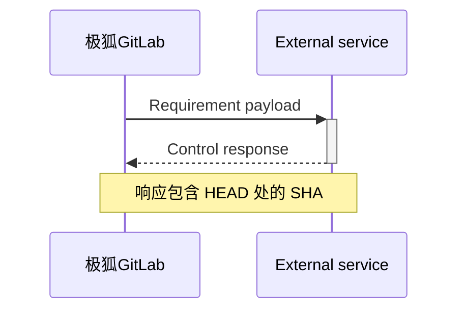



- Tier: 专业版，旗舰版
- Offering: JihuLab.com，私有化部署



您可以创建一个合规框架，该框架是一个标签，用于标识您的项目具有特定的合规要求或需要额外的监督。

在旗舰版中，合规框架可选择性地对其应用的项目强制执行[合规流水线配置](../compliance_pipelines.md)和[安全策略](../../application_security/policies/enforcement/_index.md#scope)。

合规框架在顶级群组上创建。如果项目移出其现有的顶级群组，其框架将被移除。

每个项目最多可应用 20 个合规框架。

有关点击演示，请参阅[自定义合规框架](https://gitlab.navattic.com/custom-compliance)。
<!-- Demo published on 2025-10-09 -->

<a id="prerequisites"></a>

## 先决条件

- 要创建、编辑和删除合规框架，用户必须满足以下条件之一：
  - 拥有顶级群组的 所有者 角色。
  - 被分配一个具有 `admin_compliance_framework` [自定义权限](../../custom_roles/abilities.md#compliance-management) 的[自定义角色](../../custom_roles/_index.md)。
- 要向项目添加或从中移除合规框架，该项目所属的群组必须至少有一个合规框架。

<a id="import-a-compliance-framework"></a>

## 导入合规框架



- 在 极狐GitLab 17.11 中引入。



借助此功能，您可以使用共享或备份的合规框架。JSON 文件不能与现有合规框架同名。

可从[合规遵循模板](https://jihulab.com/gitlab-cn/software-supply-chain-security/compliance/engineering/compliance-adherence-templates)项目获取 JSON 模板库。这些预定义模板提供完整的框架，无需手动设置，可帮助您快速开始。

<a id="import-a-predefined-compliance-framework"></a>

### 导入预定义合规框架

要导入预构建的合规框架：

1. 转到[合规遵循模板](https://jihulab.com/gitlab-cn/software-supply-chain-security/compliance/engineering/compliance-adherence-templates)项目。
1. 浏览可用的框架模板，并下载您所需框架的 JSON 文件。
1. 在顶部栏中，选择 **搜索或跳转到** 并找到您的群组。
1. 在左侧边栏中，选择 **安全** > **合规中心**。
1. 在页面上，选择 **框架** 选项卡。
1. 选择 **新建框架**。
1. 选择 **导入框架**。
1. 在出现的对话框中，从本地系统中选择 JSON 文件。
1. 如果导入成功，新的合规框架将出现在列表中。

您的框架现在已准备好应用于项目。请参阅[将合规框架应用于项目](#apply-a-compliance-framework-to-a-project)。

<a id="import-a-compliance-framework-from-a-json-file"></a>

### 从 JSON 文件导入合规框架

要使用 JSON 模板导入合规框架：

1. 在顶部栏中，选择 **搜索或跳转到** 并找到您的群组。
1. 在左侧边栏中，选择 **安全** > **合规中心**。
1. 在页面上，选择 **框架** 选项卡。
1. 选择 **新建框架**。
1. 选择 **导入框架**。
1. 在出现的对话框中，从本地系统中选择 JSON 文件。

如果导入成功，新的合规框架将出现在列表中。任何错误都会显示以供更正。

<a id="create-edit-or-delete-a-compliance-framework"></a>

## 创建、编辑或删除合规框架

您可以通过使用合规框架报告或合规项目报告来创建、编辑或删除合规框架。

有关使用合规框架报告的更多信息，请参阅：

- [创建新合规框架](../compliance_center/compliance_frameworks_report.md#create-a-new-compliance-framework)。
- [编辑合规框架](../compliance_center/compliance_frameworks_report.md#edit-a-compliance-framework)。
- [删除合规框架](../compliance_center/compliance_frameworks_report.md#delete-a-compliance-framework)。

有关使用合规项目报告的更多信息，请参阅：

- [创建新合规框架](../compliance_center/compliance_projects_report.md#create-a-new-compliance-framework)。
- [编辑合规框架](../compliance_center/compliance_projects_report.md#edit-a-compliance-framework)。
- [删除合规框架](../compliance_center/compliance_projects_report.md#delete-a-compliance-framework)。

子群组和项目可以访问在其顶级群组上创建的所有合规框架。但是，不能使用子群组或项目来创建、编辑或删除合规框架。项目所有者可以选择将其框架应用于其项目。

<a id="apply-a-compliance-framework-to-a-project"></a>

## 将合规框架应用于项目



- 在 极狐GitLab 17.3 中引入了应用多个合规框架。
- 在 极狐GitLab 17.11 中引入了通过合规框架将合规框架应用于项目。



您可以将多个合规框架应用于项目，但不能将合规框架应用于个人命名空间中的项目。

要将合规框架应用于项目，请通过[合规项目报告](../compliance_center/compliance_projects_report.md#apply-a-compliance-framework-to-projects-in-a-group)进行应用。

您可以使用 [GraphQL API](../../../api/graphql/reference/_index.md#mutationprojectupdatecomplianceframeworks) 将一个或多个合规框架应用于项目。

如果您通过 GraphQL 在子群组上创建合规框架，如果用户具有正确权限，则框架将在根祖先上创建。极狐GitLab UI 显示只读视图以阻止此行为。

要通过合规框架将合规框架应用于项目：

1. 在顶部栏中，选择 **搜索或跳转到** 并找到您的群组。
1. 在左侧边栏中，选择 **安全** > **合规中心**。
1. 在页面上，选择 **项目** 选项卡。
1. 将鼠标悬停在某个合规框架上，选择 **编辑框架** 选项卡。
1. 选择 **项目** 部分。
1. 从列表中选择项目。
1. 选择 **更新框架**。

<a id="default-compliance-frameworks"></a>

## 默认合规框架



- 在 极狐GitLab 15.6 中引入。



群组所有者可以设置默认合规框架。默认框架会应用于在该群组中创建的所有新项目和导入项目。它不会影响已应用于现有项目的框架。默认框架不可删除。

被设置为默认的合规框架会有一个 `default` 标签。

<a id="set-and-remove-a-default-by-using-the-compliance-center"></a>

### 使用合规中心设置和取消默认

要通过[合规项目报告](../compliance_center/compliance_projects_report.md)设置默认（或取消默认）：

1. 在顶部栏中，选择 **搜索或跳转到** 并找到您的群组。
1. 在左侧边栏中，选择 **安全** > **合规中心**。
1. 在页面上，选择 **项目** 选项卡。
1. 将鼠标悬停在某个合规框架上，选择 **编辑框架** 选项卡。
1. 选择 **设为默认**。
1. 选择 **保存更改**。

要通过[合规框架报告](../compliance_center/compliance_frameworks_report.md)设置默认（或取消默认）：

1. 在顶部栏中，选择 **搜索或跳转到** 并找到您的群组。
1. 在左侧边栏中，选择 **安全** > **合规中心**。
1. 在页面上，选择 **框架** 选项卡。
1. 将鼠标悬停在某个合规框架上，选择 **编辑框架** 选项卡。
1. 选择 **设为默认**。
1. 选择 **保存更改**。

<a id="remove-a-compliance-framework-from-a-project"></a>

## 从项目中移除合规框架

要从群组中的一个或多个项目中移除合规框架，请通过[合规项目报告](../compliance_center/compliance_projects_report.md#remove-a-compliance-framework-from-projects-in-a-group)移除合规框架。

<a id="export-a-compliance-framework-as-a-json-file"></a>

## 将合规框架导出为 JSON 文件



- 在 极狐GitLab 17.11 中引入。



借助此功能，您可以共享和备份合规框架。

要从合规中心导出合规框架：

1. 在顶部栏中，选择 **搜索或跳转到** 并找到您的群组。
1. 在左侧边栏中，选择 **安全** > **合规中心**。
1. 在页面上，选择 **框架** 选项卡。
1. 找到您想要导出的合规框架。
1. 选择垂直省略号 ()。
1. 选择 **导出为 JSON 文件**。

JSON 文件将下载到您的本地系统中。

<a id="json-template-structure-and-schema"></a>

### JSON 模板结构和模式

合规框架 JSON 模板遵循特定的模式结构，该结构定义了框架元数据、要求以及相关控制。了解此结构有助于您创建自定义模板或修改现有模板，以满足您组织的特定合规需求。

<a id="framework-properties"></a>

#### 框架属性

每个 JSON 模板包含以下顶级属性：

| 属性 | 类型 | 是否必需 | 描述 |
|----------|------|----------|-------------|
| `name` | 字符串 | 是 | 合规框架的显示名称。 |
| `description` | 字符串 | 是 | 框架目的的详细描述。 |
| `color` | 字符串 | 是 | 框架的十六进制颜色代码（例如 `#1f75cb`）。 |
| `requirements` | 数组 | 否 | 定义合规控制的要求对象数组。 |

<a id="requirements-structure"></a>

#### 要求结构

`requirements` 数组中的每个要求包含：

| 属性 | 类型 | 是否必需 | 描述 |
|----------|------|----------|-------------|
| `name` | 字符串 | 是 | 合规要求的名称。 |
| `description` | 字符串 | 是 | 要求强制执行内容的详细描述。 |
| `controls` | 数组 | 是 | 实现该要求的控制对象数组。 |

<a id="control-structure"></a>

#### 控制结构

`controls` 数组中的每个控制定义了一个具体检查：

| 属性 | 类型 | 是否必需 | 描述 |
|----------|------|----------|-------------|
| `name` | 字符串 | 是 | 极狐GitLab 控制 ID（例如 `scanner_sast_running`）。 |
| `control_type` | 字符串 | 是 | 对于极狐GitLab 控制，始终为 `"internal"`。 |
| `expression` | 对象 | 是 | 定义控制的评估逻辑。 |

<a id="expression-object"></a>

#### Expression 对象

`expression` 对象定义如何评估控制：

| 属性 | 类型 | 是否必需 | 描述 |
|----------|------|----------|-------------|
| `field` | 字符串 | 是 | 要评估的字段名称（匹配控制名称）。 |
| `operator` | 字符串 | 是 | 比较运算符 (`=`, `>=`, `<=`, `>`, `<`)。 |
| `value` | 混合 | 是 | 预期值（布尔值、数字或字符串）。 |

<a id="example-json-template-structure"></a>

#### 示例 JSON 模板结构

以下是一个展示完整结构的简化示例：

```json
{
  "name": "示例合规框架",
  "description": "演示 JSON 结构的示例框架",
  "color": "#1f75cb",
  "requirements": [
    {
      "name": "安全扫描要求",
      "description": "确保为所有项目启用安全扫描",
      "controls": [
        {
          "name": "scanner_sast_running",
          "control_type": "internal",
          "expression": {
            "field": "scanner_sast_running",
            "operator": "=",
            "value": true
          }
        },
        {
          "name": "minimum_approvals_required_2",
          "control_type": "internal",
          "expression": {
            "field": "minimum_approvals_required",
            "operator": ">=",
            "value": 2
          }
        }
      ]
    }
  ]
}
```

<a id="requirements"></a>

## 要求



- Tier: 旗舰版
- Offering: JihuLab.com，私有化部署





- 在 极狐GitLab 17.11 中引入，附带一个名为 `enable_standards_adherence_dashboard_v2` 的[功能标志](../../../administration/feature_flags/_index.md)。默认启用。
- 在 极狐GitLab 18.3 中正式发布。功能标志 `enable_standards_adherence_dashboard_v2` 已移除。



在极狐GitLab 旗舰版中，您可以为合规框架定义特定的**要求**。要求由一个或多个控制组成，这些控制是对分配了该框架的项目的配置或行为进行的检查。每个要求最多可包含五个控制。

每个控制都包含逻辑，极狐GitLab 在计划或触发的扫描中使用这些逻辑来评估项目的合规性。有关如何跟踪合规性的更多详细信息，请参阅[合规状态报告](../compliance_center/compliance_status_report.md)。

您可以使用极狐GitLab 合规控制或外部控制来满足框架要求。

<a id="gitlab-compliance-controls"></a>

### 极狐GitLab 合规控制



- 在 极狐GitLab 18.7 及更高版本中，安全扫描控制不再需要成功的流水线。



极狐GitLab 合规控制可用于极狐GitLab 合规框架中。控制是对分配了合规框架的项目的配置或行为进行的检查。

组合使用极狐GitLab 合规控制，以帮助您满足[合规标准](compliance_standards.md)。

> [!note]
> 检查运行中扫描器的安全扫描控制无法检测在[子流水线](../../../ci/pipelines/downstream_pipelines.md#parent-child-pipelines)中配置的扫描器。
> 要使这些控制通过，您必须在父流水线中配置安全扫描器。
> 更多信息，请参阅议题 595632。

<!-- Updates to control names must be reflected also in compliance_standards.md -->
| 控制项名称 | 控制项 ID | 描述 |
|:---------------------------------------------------------|:-----------------------------------------------------------|:------------|
| API 安全扫描正在运行 | `scanner_api_security_running` | 确保在项目的默认分支流水线中已配置并运行 [API 安全扫描](../../application_security/api_security/_index.md)。 |
| 至少一人审批 | `minimum_approvals_required_1` | 确保合并请求在合并前[需要至少一人审批](../../project/merge_requests/approvals/_index.md)。 |
| 至少两人审批 | `minimum_approvals_required_2` | 确保合并请求在合并前[需要至少两人审批](../../project/merge_requests/approvals/_index.md)。 |
| Auth SSO 已启用 | `auth_sso_enabled` | 确保为项目启用了[单点登录 (SSO) 认证](../../group/saml_sso/_index.md)。 |
| 禁止作者审批合并请求 | `merge_request_prevent_author_approval` | 确保合并请求的作者[不能审批自己的更改](../../project/merge_requests/approvals/_index.md)。 |
| 已禁用分支删除 | `branch_deletion_disabled` | 确保[分支不能被删除](../../project/repository/branches/protected.md)。 |
| CI/CD job token 作用域已启用 | `cicd_job_token_scope_enabled` | 确保 [CI/CD job token](../../../ci/jobs/ci_job_token.md) 作用域限制已启用。 |
| 代码变更需要代码所有者审批 | `code_changes_requires_code_owners` | 确保代码变更需要[代码所有者](../../project/codeowners/_index.md)的审批。 |
| 需要代码所有者审批 | `code_owner_approval_required` | 确保已配置[代码所有者文件](../../project/codeowners/_index.md)。 |
| 代码质量扫描正在运行 | `scanner_code_quality_running` | 确保在项目的默认分支流水线中已配置并运行[代码质量扫描](../../../ci/testing/code_quality.md)。 |
| 禁止提交者审批合并请求 | `merge_request_prevent_committers_approval` | 确保[向合并请求提交了代码的用户不能审批该合并请求](../../project/merge_requests/approvals/_index.md)。 |
| 容器扫描正在运行 | `scanner_container_scanning_running` | 确保在项目的默认分支流水线中已配置并运行[容器扫描](../../application_security/container_scanning/_index.md)。 |
| DAST 正在运行 | `scanner_dast_running` | 确保在项目的默认分支流水线中已配置并运行动态应用程序安全测试 (DAST)。 |
| 默认分支已保护 | `default_branch_protected` | 确保默认分支已启用[保护规则](../../project/repository/branches/protected.md)。 |
| 默认分支受保护免于直接推送 | `default_branch_protected_from_direct_push` | [防止直接推送到默认分支](../../project/repository/branches/protected.md)。 |
| 用户可以合并默认分支 | `default_branch_users_can_merge` | 控制[用户是否可以将更改合并到默认分支](../../project/repository/branches/protected.md)。 |
| 用户可以推送默认分支 | `default_branch_users_can_push` | 控制[用户是否可以直接推送到默认分支](../../project/repository/branches/protected.md)。 |
| 依赖项扫描正在运行 | `scanner_dep_scanning_running` | 确保在项目的默认分支流水线中已配置并运行[依赖项扫描](../../application_security/dependency_scanning/_index.md)。**注意**：在私有化部署实例上（从 18.4 版本开始），由于产物差异，使用[基于 SBOM 的依赖项扫描](../../application_security/dependency_scanning/dependency_scanning_sbom/_index.md)时，此控制项可能会失败。请参见[兼容性注意事项](../../application_security/dependency_scanning/dependency_scanning_sbom/troubleshooting_ds_sbom_analyzer.md#compliance-framework-compatibility)。 |
| 确保每个仓库有两名管理员 | `ensure_2_admins_per_repo` | 确保每个项目都分配有[至少两名所有者](../../project/members/_index.md)。 |
| 错误追踪已启用 | `error_tracking_enabled` | 确保为项目启用了[错误追踪](../../../operations/error_tracking.md)。 |
| 强制推送已禁用 | `force_push_disabled` | 防止对仓库进行[强制推送](../../project/repository/branches/protected.md)。 |
| 项目存在派生 | `has_forks` | 确保项目已被[派生](../../project/repository/forking_workflow.md) |
| 极狐GitLab 许可证级别为旗舰版 | `gitlab_license_level_ultimate` | 确保极狐GitLab 实例使用的是[旗舰版许可证](https://about.gitlab.com/pricing/feature-comparison/)。 |
| 拥有有效的 CI/CD 配置 | `has_valid_ci_config` | 确保项目拥有一个[有效的 CI/CD 配置](../../../ci/yaml/_index.md)。 |
| IaC 扫描正在运行 | `scanner_iac_running` | 确保在项目的默认分支流水线中已配置并运行[基础设施即代码 (IaC) 扫描](../../application_security/iac_scanning/_index.md)。 |
| 禁止内部可见性 | `project_visibility_not_internal` | 确保项目未设置为[内部可见性](../../public_access.md)。 |
| 议题跟踪已启用 | `issue_tracking_enabled` | 确保为项目启用了[议题跟踪](../../project/issues/_index.md)。 |
| 许可证合规正在运行 | `scanner_license_compliance_running` | 确保在项目的默认分支流水线中已配置并运行[许可证合规扫描](../license_approval_policies.md)。 |
| 合并请求提交重置审批 | `merge_request_commit_reset_approvals` | 确保[合并请求的新提交会重置审批](../../project/merge_requests/approvals/settings.md)。 |
| 阻止编辑合并请求审批规则 | `merge_requests_approval_rules_prevent_editing` | 确保[不能编辑合并请求审批规则](../../project/merge_requests/approvals/settings.md)。 |
| 合并请求需要代码所有者审批 | `merge_requests_require_code_owner_approval` | 确保合并请求需要[代码所有者](../../project/codeowners/_index.md)的审批。 |
| 成员多于管理员 | `more_members_than_admins` | 确保分配给项目的管理员 [(所有者或维护者)](../../project/members/_index.md) 数量少于总成员数。 |
| Package Hunter 无未处理的发现 | `package_hunter_no_findings_untriaged` | 确保所有 [Package Hunter](../../application_security/triage/_index.md) 发现都已分类处理。 |
| 项目未归档 | `project_archived` | 检查[项目是否已归档](../../project/settings/_index.md)。通常，`false` 表示合规。 |
| 项目未标记为待删除 | `project_marked_for_deletion` | 检查[项目是否已标记为待删除](../../project/settings/_index.md)。`false` 表示合规。 |
| 项目流水线非公开 | `project_pipelines_not_public` | 确保[项目流水线未公开可见](../../../ci/pipelines/settings.md)。不考虑[项目可见性](../../public_access.md)。 |
| 项目仓库已存在 | `project_repo_exists` | 确保项目存在一个 [Git 仓库](../../../topics/git/_index.md)。 |
| 项目可见性非公开 | `project_visibility_not_public` | 确保项目未设置为[公开可见性](../../public_access.md)。 |
| 受保护分支已存在 | `protected_branches_set` | 确保项目包含[受保护分支](../../project/repository/branches/protected.md)。 |
| 推送保护已启用 | `push_protection_enabled` | 确保为项目启用了[密钥推送保护](../../application_security/secret_detection/secret_push_protection/_index.md)。 |
| 要求分支为最新 | `require_branch_up_to_date` | 确保在合并前[源分支与目标分支处于最新状态](../../project/merge_requests/methods/_index.md)。 |
| 要求线性历史 | `require_linear_history` | 通过禁止合并提交来确保[线性的提交历史](../../project/merge_requests/methods/_index.md#fast-forward-merge)。 |
| 在组织级别要求多因素认证 | `require_mfa_at_org_level` | 确保在组织级别要求[多因素认证](../../profile/account/two_factor_authentication.md)。 |
| 要求贡献者启用多因素认证 | `require_mfa_for_contributors` | 确保[贡献者已启用多因素认证](../../profile/account/two_factor_authentication.md)。 |
| 要求签名提交 | `require_signed_commits` | 确保要求[签名提交](../../project/repository/signed_commits)。 |
| 推送时重置审批 | `reset_approvals_on_push` | 确保当有新提交推送到合并请求时，[审批被重置](../../project/merge_requests/approvals/settings.md)。 |
| 需要解决讨论 | `resolve_discussions_required` | 确保在允许合并前，所有[讨论都必须解决](../../discussions/_index.md)。 |
| 限制推送/合并权限 | `restrict_push_merge_access` | 限制谁可以推送到或合并到[受保护分支](../../project/repository/branches/protected.md)。 |
| 受限构建访问 | `restricted_build_access` | 确保对[构建产物和流水线输出进行受限访问](../../../ci/pipelines/settings.md)。 |
| 审查并归档过期仓库 | `review_and_archive_stale_repos` | 确保审查并[归档](../../project/settings/_index.md)过期仓库。 |
| 审查并移除不活跃用户 | `review_and_remove_inactive_users` | 确保审查并移除[不活跃用户](../../../administration/admin_area.md)。 |
| SAST 正在运行 | `scanner_sast_running` | 确保在项目的默认分支流水线中已配置并运行[静态应用程序安全测试](../../application_security/sast/_index.md) (SAST)。 |
| 密钥检测正在运行 | `scanner_secret_detection_running` | 确保在项目的默认分支流水线中已配置并运行[密钥检测扫描](../../application_security/secret_detection/_index.md)。 |
| 安全 Webhook | `secure_webhooks` | 确保 [Webhook](../../project/integrations/webhooks.md) 已安全配置。 |
| 过期分支自动清理已启用 | `stale_branch_cleanup_enabled` | 确保启用了[过期分支的自动清理](../../project/repository/branches/_index.md)。 |
| 状态检查已要求 | `status_checks_required` | 确保在允许合并前，[状态检查](../../project/merge_requests/status_checks.md)必须通过。 |
| 状态页已配置 | `status_page_configured` | 确保为项目配置了[状态页](../../../operations/incident_management/status_page.md)。 |
| 仓库的严格权限 | `strict_permissions_for_repo` | 确保为仓库访问设置了[严格权限](../../permissions.md)。 |
| Terraform 已启用 | `terraform_enabled` | 确保为项目启用了 [Terraform 集成](../../../administration/terraform_state.md)。 |
| 用户自定义 CI/CD 变量仅限维护者使用 | `project_user_defined_variables_restricted_to_maintainers` | 确保只有角色为维护者或更高权限的用户才能在[触发流水线时传递用户自定义变量](../../../ci/variables/_index.md)。 |
| 漏洞 SLA 天数超出阈值 | `vulnerabilities_slo_days_over_threshold` | 确保在 SLA 阈值（180 天）内[处理漏洞](../../application_security/vulnerabilities/_index.md)。 |

### 外部控制



- 在 极狐GitLab 18.1 中引入了外部控制名称。



外部控制是对外部系统的 API 调用，用于请求外部控制或要求的状态。

你可以创建一个外部控制，用于向第三方工具发送数据。

当[合规扫描](../compliance_center/compliance_status_report.md#scan-timing-and-triggers)运行时，极狐GitLab 会发送一个通知。然后，用户或自动化工作流可以从极狐GitLab 外部更新控制项的状态。

通过此集成，你可以与第三方工作流工具（如 ServiceNow）或你选择的自定义工具集成。第三方工具会响应一个关联状态。此状态随后会显示在[合规定期报告](../compliance_center/compliance_status_report.md)中。

你可以为每个项目单独配置外部控制。外部控制不在项目间共享。
如果外部控制保持待处理状态超过六小时，状态检查将失败。

#### 添加外部控制

要在创建或编辑合规框架时添加外部控制：

1. 在顶部栏中，选择 **搜索或跳转到** 并找到你的群组。
1. 在左侧边栏中，选择 **安全** > **合规中心**。
1. 在页面上，选择 **合规框架** 标签页。
1. 选择 **新建框架** 或编辑现有框架。
1. 在 **要求** 部分，选择 **新建要求**。
1. 选择 **添加一个外部控制**。
1. 在字段中编辑 **外部控制名称**、**外部 URL** 和 **`HMAC` 共享密钥**。
1. 可选。关闭 **Ping 已启用** 切换开关，以控制极狐GitLab 在合规扫描期间是否向外部服务发送通知。
1. 选择 **保存对框架的更改** 以保存该要求。

#### Ping 已启用设置



- 在 极狐GitLab 18.5 中引入。



**Ping 已启用** 设置控制极狐GitLab 是否每 12 小时从外部系统请求外部控制状态更新。

- 启用（默认）：极狐GitLab 每 12 小时自动向外部服务 URL 发送 HTTP 请求，并根据响应更新外部控制状态。
- 禁用：极狐GitLab 不向外部服务发送通知，外部控制在合规框架 UI 中显示 **已禁用** 标记。要请求外部控制的状态，你必须手动使用 [外部控制 API](../../../api/external_controls.md)。

#### 外部控制生命周期

外部控制具有**异步**工作流。[合规扫描](../compliance_center/compliance_status_report.md#scan-timing-and-triggers)会随时向外发送一个负载到外部服务。



在收到负载后，外部服务可以运行任何所需的流程。然后，外部服务可以使用 REST API 将其响应发回合并请求。

外部控制可以具有以下三种状态之一。

| 状态 | 描述 |
|:----------|:------------|
| `pending` | 默认状态。未收到来自外部服务的响应。 |
| `pass` | 已收到来自外部服务的响应，且外部控制被外部服务批准。 |
| `fail` | 已收到来自外部服务的响应，且外部控制被外部服务拒绝。 |

如果极狐GitLab 外部的某些情况发生变化，你可以通过 [使用 API](../../../api/external_controls.md) 来设置外部控制的状态。你不需要等待先发送负载。

#### 外部控制负载示例

当极狐GitLab 在合规扫描期间向外部服务发送通知时，负载中包含详细的项目信息。以下是 JSON 负载结构的示例：
```json
{
  "id": 123456,
  "description": "Project for compliance testing and validation",
  "name": "Compliance Test Project",
  "name_with_namespace": "acme-corp / engineering / security / compliance-test-project",
  "path": "compliance-test-project",
  "path_with_namespace": "acme-corp/engineering/security/compliance-test-project",
  "created_at": "2024-01-15T10:30:00.000Z",
  "tag_list": ["compliance", "security"],
  "topics": ["governance", "audit"],
  "ssh_url_to_repo": "git@jihulab.com:acme-corp/engineering/security/compliance-test-project.git",
  "http_url_to_repo": "https://jihulab.com/acme-corp/engineering/security/compliance-test-project.git",
  "web_url": "https://jihulab.com/acme-corp/engineering/security/compliance-test-project",
  "avatar_url": "https://jihulab.com/uploads/-/system/project/avatar/123456/avatar.png",
  "star_count": 5,
  "last_activity_at": "2024-11-20T14:25:30.000Z",
  "visibility": "private",
  "namespace": {
    "id": 654321,
    "name": "Security Group",
    "path": "security",
    "kind": "group",
    "full_path": "acme-corp/engineering/security",
    "parent_id": 654320,
    "avatar_url": "https://jihulab.com/uploads/-/system/group/avatar/654321/avatar.png",
    "web_url": "https://jihulab.com/groups/acme-corp/engineering/security"
  },
  "container_registry_image_prefix": "registry.jihulab.com/acme-corp/engineering/security/compliance-test-project",
  "_links": {
    "self": "https://jihulab.com/api/v4/projects/123456",
    "issues": "https://jihulab.com/api/v4/projects/123456/issues",
    "merge_requests": "https://jihulab.com/api/v4/projects/123456/merge_requests",
    "repo_branches": "https://jihulab.com/api/v4/projects/123456/repository/branches",
    "labels": "https://jihulab.com/api/v4/projects/123456/labels",
    "events": "https://jihulab.com/api/v4/projects/123456/events",
    "members": "https://jihulab.com/api/v4/projects/123456/members",
    "cluster_agents": "https://jihulab.com/api/v4/projects/123456/cluster_agents"
  },
  "marked_for_deletion_at": null,
  "marked_for_deletion_on": null,
  "packages_enabled": true,
  "empty_repo": false,
  "archived": false,
  "resolve_outdated_diff_discussions": false,
  "container_expiration_policy": {
    "cadence": "1d",
    "enabled": false,
    "keep_n": 10,
    "older_than": "90d",
    "name_regex": ".*",
    "name_regex_keep": null,
    "next_run_at": "2024-01-16T10:30:00.000Z"
  },
  "repository_object_format": "sha1",
  "issues_enabled": true,
  "merge_requests_enabled": true,
  "wiki_enabled": true,
  "jobs_enabled": true,
  "snippets_enabled": true,
  "container_registry_enabled": true,
  "service_desk_enabled": true,
  "can_create_merge_request_in": false,
  "issues_access_level": "enabled",
  "repository_access_level": "enabled",
  "merge_requests_access_level": "enabled",
  "forking_access_level": "enabled",
  "wiki_access_level": "enabled",
  "builds_access_level": "enabled",
  "snippets_access_level": "enabled",
  "pages_access_level": "private",
  "analytics_access_level": "enabled",
  "container_registry_access_level": "enabled",
  "security_and_compliance_access_level": "private",
  "releases_access_level": "enabled",
  "environments_access_level": "enabled",
  "feature_flags_access_level": "enabled",
  "infrastructure_access_level": "enabled",
  "monitor_access_level": "enabled",
  "model_experiments_access_level": "enabled",
  "model_registry_access_level": "enabled",
  "package_registry_access_level": "enabled",
  "emails_disabled": false,
  "emails_enabled": true,
  "show_diff_preview_in_email": true,
  "shared_runners_enabled": true,
  "lfs_enabled": true,
  "creator_id": 111222,
  "import_status": "none",
  "open_issues_count": 3,
  "description_html": "<p>Project for compliance testing and validation</p>",
  "updated_at": "2024-11-20T14:25:30.000Z",
  "public_jobs": true,
  "shared_with_groups": [],
  "only_allow_merge_if_pipeline_succeeds": false,
  "allow_merge_on_skipped_pipeline": null,
  "request_access_enabled": true,
  "only_allow_merge_if_all_discussions_are_resolved": false,
  "remove_source_branch_after_merge": true,
  "printing_merge_request_link_enabled": true,
  "merge_method": "merge",
  "merge_request_title_regex": null,
  "merge_request_title_regex_description": null,
  "squash_option": "default_off",
  "enforce_auth_checks_on_uploads": true,
  "suggestion_commit_message": null,
  "merge_commit_template": null,
  "squash_commit_template": null,
  "issue_branch_template": null,
  "warn_about_potentially_unwanted_characters": true,
  "autoclose_referenced_issues": true,
  "max_artifacts_size": null,
  "approvals_before_merge": 0,
  "mirror": false,
  "external_authorization_classification_label": "",
  "requirements_enabled": true,
  "requirements_access_level": "enabled",
  "security_and_compliance_enabled": false,
  "compliance_frameworks": ["SOC 2 Compliance Framework"],
  "merge_pipelines_enabled": false,
  "merge_trains_enabled": false,
  "merge_trains_skip_train_allowed": false,
  "only_allow_merge_if_all_status_checks_passed": false,
  "allow_pipeline_trigger_approve_deployment": false,
  "prevent_merge_without_jira_issue": false,
  "auto_duo_code_review_enabled": false,
  "duo_remote_flows_enabled": true,
  "duo_foundational_flows_enabled": true,
  "spp_repository_pipeline_access": false,
  "project_control_compliance_status": {
    "status": "pending",
    "compliance_requirements_control_id": 100001,
    "project_id": 123456,
    "compliance_requirement_id": 200001,
    "namespace_id": 654321,
    "id": 300001,
    "created_at": "2024-11-26T10:00:00.000Z",
    "updated_at": "2024-11-26T10:00:00.000Z",
    "requirement_status_id": null
  }
}
```

外部服务可以使用此信息执行合规检查，然后使用[外部控制 API](../../../api/external_controls.md) 以适当的控制状态进行响应。

### 添加合规要求

在创建或编辑框架时添加合规要求：

1. 在顶部栏中，选择 **搜索或跳转到** 并找到您的群组。
2. 在左侧边栏中，选择 **安全** > **合规中心**。
3. 在页面上，选择 **框架** 选项卡。
4. 选择 **新建框架** 或编辑现有框架。
5. 在 **合规要求** 部分，选择 **新建要求**。
6. 在对话框中添加 **名称** 和 **描述**。
7. 选择 **添加极狐GitLab 控制** 以添加更多控制。
8. 在控制下拉列表中搜索并选择一项控制。
9. 选择 **保存对框架的修改** 以保存该要求。

### 编辑合规要求

在创建或编辑框架时编辑合规要求：

1. 在顶部栏中，选择 **搜索或跳转到** 并找到您的群组。
2. 在左侧边栏中，选择 **安全** > **合规中心**。
3. 在页面上，选择 **框架** 选项卡。
4. 选择 **新建框架** 或编辑现有框架。
5. 在 **合规要求** 部分，选择 **操作** > **编辑**。
6. 在对话框中编辑 **名称** 和 **描述**。
7. 选择 **添加极狐GitLab 控制** 以添加更多控制。
8. 在控制下拉列表中搜索并选择一项控制。
9. 选择  来删除一项控制。
10. 选择 **保存对框架的修改** 以保存该要求。

<a id="troubleshooting"></a>

## 故障排除

在使用合规框架时，您可能会遇到以下问题。

<a id="error-unable-to-determine-the-correct-upload-url"></a>

### 错误：`无法确定正确的上传 URL`

在[合规框架导入](#import-a-compliance-framework-from-a-json-file)过程中，如果已存在与 JSON 模板同名的合规框架，就会遇到此错误。