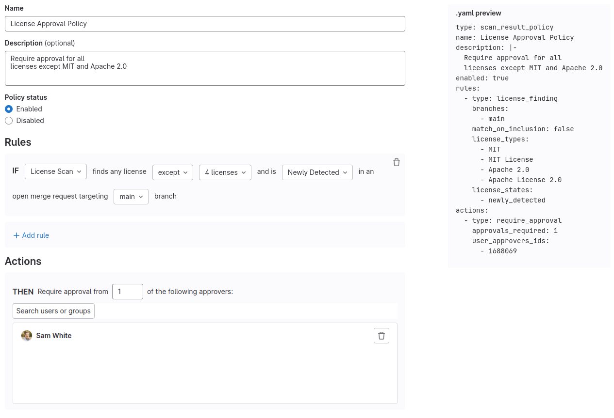
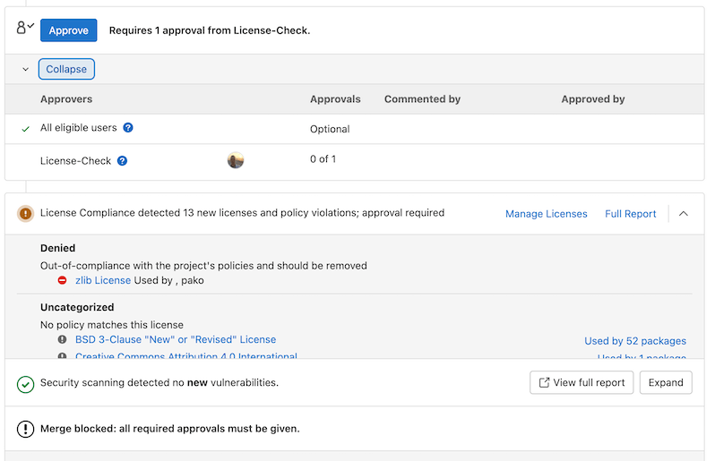



- Tier: 旗舰版
- Offering: JihuLab.com，私有化部署





- 于极狐GitLab 15.9 引入，[带有功能标志](../../administration/feature_flags/_index.md) 名为 `license_scanning_policies`。默认禁用。
- 于极狐GitLab 15.11 GA。功能标志 `license_scanning_policies` 已移除。



使用许可证批准策略可以指定标准，这些标准决定何时需要在合并请求合并之前获得批准。

许可证批准策略仅适用于[受保护的目标分支](../project/repository/branches/protected.md)。

## 创建新的许可证批准策略的前提条件

许可证批准策略依靠依赖扫描作业的输出，来验证要求是否已满足。如果依赖扫描未正确配置，因此没有与开放合并请求相关的依赖扫描作业运行，则该策略没有数据来验证要求。当安全策略缺少评估数据时，默认会采取封闭失败，并假设合并请求可能包含漏洞。你可以使用 `fallback_behavior` 属性来选择退出默认行为，并将策略设置为开放失败。开放失败的策略会放行所有无效和不可执行的规则。

为了确保策略的执行，你应该在目标开发项目中启用依赖扫描。你可以通过以下几种方式实现：

- 创建一个[扫描执行策略](../application_security/policies/scan_execution_policies.md)，强制在所有目标开发项目中运行依赖扫描。
- 与开发团队合作，在每个项目的 `.gitlab-ci.yml` 文件中配置[依赖扫描](../application_security/dependency_scanning/_index.md)，或使用[安全配置](../application_security/detect/security_configuration.md)启用它。

许可证批准策略需要来自[极狐GitLab 支持的软件包](license_scanning_of_cyclonedx_files/_index.md#supported-languages-and-package-managers)的许可证信息。

## 创建新的许可证批准策略

创建许可证批准策略以强制执行许可证合规性。

要创建许可证批准策略：

1. [将安全策略项目链接](../application_security/policies/enforcement/security_policy_projects.md#link-to-a-security-policy-project)到你的开发群组、子群组或项目（需要所有者角色）。
1. 在顶部栏中，选择 **搜索或跳转到** 并找到你的项目。
1. 在左侧边栏中，选择 **安全** > **策略**。
1. 创建一个新的[合并请求批准策略](../application_security/policies/merge_request_approval_policies.md)。
1. 在你的策略规则中，选择 **许可证扫描**。

## 定义哪些许可证需要批准的判断标准

可以使用以下类型的标准来确定哪些许可证是“已批准”或“已拒绝”并需要批准。

- 当检测到位于明确禁止许可证列表中的任何许可证时。
- 当检测到任何许可证，但已明确列为可接受的许可证除外时。

## 比较合并请求分支中检测到的许可证与默认分支中的许可证的判断标准

可以使用以下类型的标准来根据默认分支中存在的许可证确定是否需要批准：

- 可以将被拒绝的许可证配置为，仅当该被拒绝的许可证是某个依赖的一部分，且该依赖在默认分支中尚不存在时，才需要批准。
- 可以将被拒绝的许可证配置为，如果该被拒绝的许可证存在于默认分支中已存在的任何组件中，则需要批准。

如果发现违反许可证批准策略的许可证，它会阻止合并请求，并指示开发者将其删除。合并请求无法合并，直到 `被拒绝` 的许可证被移除，除非许可证批准策略的合格审批人批准了该合并请求。

## 故障排除

### 许可证合规小部件停留在加载状态

以下场景中会显示加载旋转图标：

- 流水线正在进行时。
- 如果流水线已完成，但仍在后台解析结果。
- 如果许可证扫描作业已完成，但流水线仍在运行。

许可证合规小部件每隔几秒轮询一次以获取更新的结果。流水线完成后，完成后的第一次轮询会触发结果解析。这可能需要几秒钟，具体取决于生成报告的大小。

最终状态是当成功的流水线运行已完成、解析，并且许可证显示在小部件中时。

### 许可证批准策略因 `unknown` 许可证而阻止合并请求

在某些场景下，许可证批准策略可能会因 `unknown` 许可证而阻止合并请求。

> [!note]
> 在 [`licenses` 字段](../application_security/policies/merge_request_approval_policies.md#licenses_with_package_exclusion-object)中使用 PURL 进行软件包级别的排除，不适用于 `unknown` 许可证。 `licenses` 字段仅支持 [SPDX 许可证名称](https://spdx.org/licenses) 匹配，而 `unknown` 不是有效的 SPDX 许可证名称。如果你配置了一个带有 PURL 排除的被拒绝 `unknown` 许可证，则在合并请求批准评估期间该排除会被忽略，并且合并请求仍会被阻止。流水线 **许可证** 选项卡看似遵循了排除，但合并请求批准小部件并未遵循。这些视图使用不同的评估路径。

这可能发生在以下任何情况：

- 依赖扫描作业未能识别特定组件的许可证。
- 使用了一种新的或不常见的许可证，扫描工具未能识别。
- 组件的元数据中缺少许可证信息或不完整。

要解决此问题：

1. 查看流水线页面中的 **许可证** 选项卡，以确定哪些组件具有 `unknown` 许可证，或者查看极狐GitLab 安全机器人产生的 `不符合策略` 的许可证。
1. 手动调查这些组件以确定其实际许可证。
1. 如果无法确定许可证或这些许可证不可接受，请移除或替换受影响的组件。

如果你需要暂时允许带有 `unknown` 许可证的合并：

1. 编辑你的许可证批准策略。
1. 将 `unknown` 添加到允许的许可证列表中。
1. 在解决问题后，从允许的许可证列表中移除 `unknown`，以保持适当的许可证合规性。

在处理许可证合规性问题时，特别是在处理 `unknown` 许可证时，请务必咨询你的法务团队。