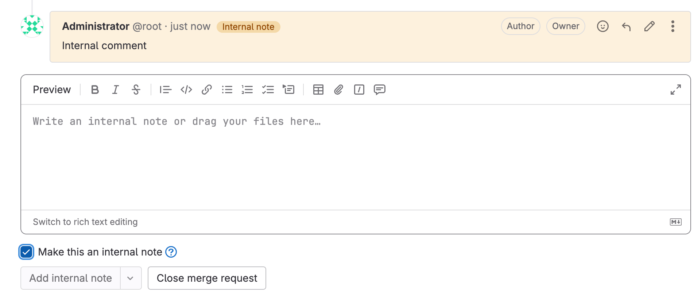
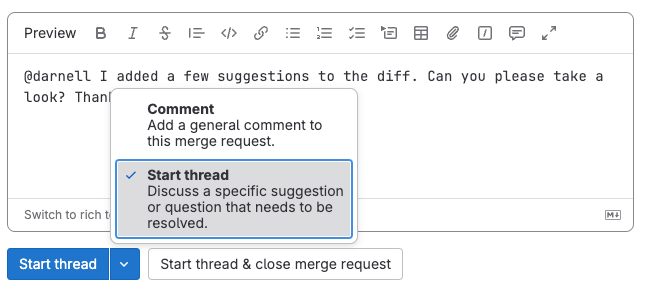



- Tier: 基础版，专业版，旗舰版
- Offering: JihuLab.com，私有化部署





- Wiki 页面的评论和话题在 极狐GitLab 17.7 中引入，使用功能标志 `wiki_comments`，默认禁用。
- Wiki 页面的评论和话题在 极狐GitLab 17.9 中 GA，功能标志 `wiki_comments` 已移除。



极狐GitLab 鼓励通过评论、话题和 [为代码建议更改](../project/merge_requests/reviews/suggestions.md) 进行交流。
评论支持 [Markdown](../markdown.md) 和 [快速操作](../project/quick_actions.md)。

提供两种类型的评论：

- 标准评论。
- 话题中的评论，你可以 [解决](../project/merge_requests/_index.md#manage-comment-threads) 它。

你可以在提交差异评论中 [建议代码更改](../project/merge_requests/reviews/suggestions.md)，用户可以通过界面接受。

## 你可以添加评论的位置

你可以在以下位置创建评论：

- 提交差异。
- 提交。
- 设计。
- 史诗。
- 议题。
- 合并请求。
- 片段。
- 任务。
- OKR。
- Wiki 页面。

每个对象最多可以有 5,000 条评论。

## 提及

你可以在你的极狐GitLab 实例中通过 `@username` 或 `@groupname` 提及某个用户或群组（包括 [子群组](../group/subgroups/_index.md#mention-subgroups)）。极狐GitLab 通过待办事项和电子邮件通知所有被提及的用户。用户可以在 [通知设置](../profile/notifications.md) 中为自己更改此设置。

你可以快速查看哪些评论与你相关，因为极狐GitLab 会以不同颜色高亮显示对你（当前已认证用户）的提及。

当你提及某人时，在工作项或合并请求中，他们将成为 [参与者](../participants.md)。

### 提及所有成员



- 功能标志 `disable_all_mention` 在 极狐GitLab 16.1 中引入，在 JihuLab.com 上启用，在私有化部署上禁用。
- 在 极狐GitLab 18.8.5 中于私有化部署上启用。
- 在 极狐GitLab 19.0 中移除了功能标志 `disable_all_mention`。



避免在评论和描述中提及 `@all`。`@all` 不仅会提及项目、议题或合并请求的参与者，还会提及该项目父群组的所有成员。所有这些用户都会收到电子邮件通知和待办事项，并可能将其视为垃圾信息。

在评论和描述中输入 `@all` 会导致普通文本，而不会提及所有用户。在此更改之前的 Markdown 文本中已有的 `@all` 提及保持不变，仍为链接。

你可以在 [群组设置](../group/manage.md#disable-email-notifications) 中禁用通知和提及。

### 在议题或合并请求中提及群组

当你在评论中提及某个群组时，该群组的每个成员都会在其待办事项列表中添加一项待办事项。

1. 在顶部栏中，选择 **搜索或跳转到** 并找到你的项目。
1. 转到你的合并请求或议题：
   - 对于合并请求，选择 **代码** > **合并请求**，并找到你的合并请求。
   - 对于议题，选择 **计划** > **工作项**，并找到你的议题。
1. 在评论中，输入 `@` 后跟用户、群组或子群组命名空间。
   例如，`@alex`、`@alex-team` 或 `@alex-team/marketing`。
1. 选择 **评论**。

极狐GitLab 为所有群组和子群组成员创建待办事项。

更多信息，请参见 [提及子群组](../group/subgroups/_index.md#mention-subgroups)。

## 向合并请求差异添加评论

当你向合并请求差异添加评论时，这些评论会持久保留，即使你：

- 在变基后强制推送。
- 修改提交。

要添加提交差异评论：

1. 在顶部栏中，选择 **搜索或跳转到** 并找到你的项目。
1. 在左侧边栏中，选择 **代码** > **合并请求**，并找到你的合并请求。
1. 选择 **提交** 选项卡，然后选择提交消息。
1. 发起评论：
   - 要对整个文件进行评论，找到要评论的文件，然后在文件头中选择 **对此文件发表评论** ()。
   - 要对特定行进行评论，找到要评论的行号。将鼠标悬停在该行号上，然后选择 **评论** ()。要选择更多行，拖动 **评论** () 图标。
1. 输入你的评论。
1. 提交你的评论：
   - 要立即添加评论，选择 **立即添加评论**，或使用键盘快捷键：
     - macOS: <kbd>Shift</kbd>+<kbd>Command</kbd>+<kbd>Enter</kbd>
     - 所有其他操作系统: <kbd>Shift</kbd>+<kbd>Control</kbd>+<kbd>Enter</kbd>
   - 要将评论保留为未发布状态，直到你完成审阅，选择 **开始审阅**，或使用键盘快捷键：
     - macOS: <kbd>Command</kbd>+<kbd>Enter</kbd>
     - 所有其他操作系统: <kbd>Control</kbd>+<kbd>Enter</kbd>

该评论显示在合并请求的 **概览** 选项卡上。

该评论不会显示在你项目的 **代码** > **提交** 页面上。

> [!note]
> 当你的评论包含对合并请求中包含的提交的引用时，它会在合并请求的上下文中转换为链接。
> 例如，`28719b171a056960dfdc0012b625d0b47b123196` 变为 `28719b17`，链接到
> `https://gitlab.example.com/example-group/example-project/-/merge_requests/12345/diffs?commit_id=28719b171a056960dfdc0012b625d0b47b123196`。

## 通过发送电子邮件回复评论

如果你已配置 [“通过电子邮件回复”](../../administration/reply_by_email.md)，你可以通过发送电子邮件来回复评论。

- 当你回复标准评论时，会创建另一条标准评论。
- 当你回复话题评论时，会在话题中创建一条回复。
- 当你 [向议题电子邮件地址发送电子邮件](../project/issues/managing_issues.md#copy-issue-email-address) 时，会创建一条标准评论。

你可以在电子邮件回复中使用 [Markdown](../markdown.md) 和 [快速操作](../project/quick_actions.md)。

### 评论回复过期

创建标准评论或话题评论的电子邮件回复受两年 [保留策略](../../administration/reply_by_email.md#retention-policy-for-notifications) 约束。

## 编辑评论

你可以随时编辑自己的评论。具有维护者或所有者角色的用户也可以编辑其他人发表的评论。

要编辑评论：

1. 在评论上，选择 **编辑评论** ()。
1. 进行编辑。
1. 选择 **保存更改**。

### 编辑评论以添加提及



- 发送通知邮件在 极狐GitLab 18.10 中引入，使用功能标志 `email_on_added_mentions`，默认禁用。
- 在 极狐GitLab 18.11 中 GA，功能标志 `email_on_added_mentions` 已移除。



默认情况下，当你提及某个用户时，极狐GitLab 会为其 [创建待办事项](../todos.md#actions-that-create-to-do-items) 并发送 [通知邮件](../profile/notifications.md)。

如果你编辑现有评论以添加之前没有的用户提及，极狐GitLab 会：

- 为被提及的用户创建待办事项。
- 向被提及的用户发送通知邮件。

## 通过锁定讨论防止评论

你可以阻止在议题或合并请求中发表公开评论。执行此操作后，只有项目成员可以添加和编辑评论。

先决条件：

- 在合并请求中，你必须具有开发者、维护者或所有者角色。
- 在议题中，你必须具有计划者、报告者、开发者、维护者或所有者角色。

要锁定议题或合并请求：

1. 在顶部栏中，选择 **搜索或跳转到** 并找到你的项目。
1. 转到你的合并请求或议题：
   - 对于合并请求，选择 **代码** > **合并请求**，并找到你的合并请求。
   - 对于议题，选择 **计划** > **工作项**，并找到你的议题。
1. 在右上角，选择 **合并请求操作** 或 **议题操作** ()，然后选择 **锁定讨论**。

极狐GitLab 会向页面详细信息添加一条系统备注。

你必须先解锁已关闭的议题或合并请求中所有锁定的讨论，然后才能重新打开该议题或合并请求。

## 关于机密项的评论

只有有权访问机密项的用户才会收到关于该项评论的通知。如果该项之前不是机密的，无访问权限的用户可能会显示为参与者。这些用户在项目处于机密状态时不会收到通知。

谁可以被通知：

- 分配给该项的用户，无论其角色如何。
- 创作该项的用户，如果他们具有访客、计划者、报告者、开发者、维护者或所有者角色。
- 在所属于该项的群组或项目中具有计划者、报告者、开发者、维护者或所有者角色的用户。

## 添加内部备注



- 针对合并请求，在 极狐GitLab 16.9 中引入。
- 针对 极狐GitLab Wiki，在 极狐GitLab 18.2 中引入。



使用内部备注来保护添加到公开议题、史诗、Wiki 页面或合并请求中的信息。
内部备注不同于公开评论：

- 只有至少具有报告者角色的项目成员可以查看内部备注。
- 你不能将内部备注转换为常规评论。
- 对内部备注的所有回复也是内部的。
- 内部备注显示 **内部备注** 徽章，并以不同颜色显示，区别于公开评论：

先决条件：

- 你必须具有项目的报告者、开发者、维护者或所有者角色。

要添加内部备注：

1. 在议题、史诗、Wiki 页面或合并请求的 **评论** 文本框中，输入一条评论。
1. 在评论下方，选择 **将此设为内部备注**。
1. 选择 **添加内部备注**。

你还可以将整个 [议题标记为机密](../project/issues/confidential_issues.md)，或创建 [机密合并请求](../project/merge_requests/confidential.md)。

## 仅显示评论

在包含许多评论的讨论中，可以过滤讨论以仅显示评论或更改历史记录（[系统备注](../project/system_notes.md)）。系统备注包括对描述、其他极狐GitLab 对象中的提及，或对标签、指派人和里程碑的更改。
极狐GitLab 会保存你的偏好，并将其应用于你查看的每个议题、合并请求或史诗。

1. 在合并请求、议题或史诗上，选择 **概览** 选项卡。
1. 在页面右侧，从 **排序或过滤** 下拉列表中，选择一个过滤器：
   - **显示所有活动**：显示所有用户评论和系统备注。
   - **仅显示评论**：仅显示用户评论。
   - **仅显示历史记录**：仅显示活动备注。

## 更改活动排序顺序

反转默认顺序，使活动源按最新项在顶部排列。极狐GitLab 会在本地存储中保存你的偏好，并将其应用于你查看的每个议题、合并请求或史诗。议题和史诗共享相同的排序偏好，而合并请求则保持自己独立的偏好。

要更改活动排序顺序：

1. 打开议题，或在合并请求或史诗中打开 **概览** 选项卡。
1. 向下滚动到 **活动** 标题。
1. 在页面右侧，更改排序顺序：
   - **议题和史诗**：从 **排序或过滤** 下拉列表中，选择 **最新在前** 或 **最早在前**（默认）。
   - **合并请求**：使用排序方向箭头按钮切换 **排序方向：升序**（最早在前，默认）或 **排序方向：降序**（最新在前）。

## 查看描述更改历史



- Tier: 专业版，旗舰版
- Offering: JihuLab.com，私有化部署



你可以查看历史记录中列出的描述更改。

要比较更改，选择 **与上一版本比较**。

## 将议题指派给评论用户

你可以将议题指派给发表评论的用户。

1. 在评论中，选择 **更多操作** () 菜单。
1. 选择 **指派给评论作者**。
1. 要取消指派该评论者，再次选择该按钮。

## 通过回复标准评论创建话题

当你回复标准评论时，就会创建一个话题。

先决条件：

- 你必须具有访客、计划者、报告者、开发者、维护者或所有者角色。
- 你必须位于议题、合并请求或史诗中。提交和片段中不支持话题。

要通过回复评论创建话题：

1. 在评论的右上角，选择 **回复评论** () 以显示回复区域。
1. 输入你的回复。
1. 选择 **回复** 或 **立即添加评论**（取决于你在界面中的回复位置）。

极狐GitLab 会将顶部评论转换成一个话题。

## 不回复评论而创建话题

你可以在不回复标准评论的情况下创建话题。

先决条件：

- 你必须具有访客、计划者、报告者、开发者、维护者或所有者角色。
- 你必须位于议题、合并请求、提交或片段中。

要创建话题：

1. 输入一条评论。
1. 在评论下方，**评论** 右侧，选择向下箭头 ()。
1. 从列表中，选择 **开始话题**。
1. 再次选择 **开始话题**。

## 解决话题



- 议题的可解决话题：
  - 在 极狐GitLab 16.3 中引入，带功能标志 `resolvable_issue_threads`，默认禁用。
  - 在 极狐GitLab 16.4 中在 JihuLab.com 和私有化部署上启用。
  - 在 极狐GitLab 16.7 中 GA，功能标志 `resolvable_issue_threads` 已移除。
- 任务、目标和关键结果的可解决话题在 极狐GitLab 17.3 中 GA。
- 史诗的可解决话题：
  - 在 极狐GitLab 17.5 中引入，必须启用 [史诗的新外观](../group/epics/_index.md#epics-as-work-items)。
  - 在 极狐GitLab 18.1 中 GA。



当对话完成时，你可以解决该话题。已解决的话题会被折叠，但用户仍然可以添加评论。

已解决的话题之后可以由任何有权解决话题的用户重新打开。要重新打开已解决的话题，请展开该话题并选择 **重新打开话题**。

先决条件：

- 你必须位于史诗、议题、任务、目标、关键结果或合并请求中。
- 你必须具有开发者、维护者或所有者角色，或者是该议题或合并请求的作者。

要解决话题：

1. 转到该话题。
1. 执行以下操作之一：
   - 在原始评论的右上角，选择 **解决话题** ()。
   - 在最后一条回复下方的 **回复** 字段中，选择 **解决话题**。
   - 在最后一条回复下方的 **回复** 字段中，输入文本，选中 **解决话题** 复选框，然后选择 **立即添加评论**。

可以执行相同的操作来重新打开话题。

合并请求提供了更灵活的 [话题管理选项](../project/merge_requests/_index.md#manage-comment-threads)，例如：

- 将打开的话题移动到新议题。
- 阻止合并，直到所有话题都被解决。

## 使用极狐GitLab Duo Chat 总结议题讨论



- Tier: 专业版，旗舰版
- Add-on: GitLab Duo Enterprise
- Offering: JihuLab.com，私有化部署



<!-- 删除 Amazon Q 相关内容 -->


- [默认 LLM](../gitlab_duo/model_selection.md#default-models)

- 可访问 [自部署模型的 极狐GitLab Duo](../../administration/gitlab_duo_self_hosted/_index.md) 了解详情。





- 在 极狐GitLab 16.0 中作为 [实验](../../policy/development_stages_support.md#experiment) 引入。
- 在 极狐GitLab 17.3 中移至 GitLab Duo 并更改为 [测试版](../../policy/development_stages_support.md#beta)，带功能标志 `summarize_notes_with_duo`，默认禁用。
- 在 极狐GitLab 17.4 中默认启用。
- 在 极狐GitLab 17.6 及更高版本中更改为需要 GitLab Duo 附加组件。
- 在 极狐GitLab 18.0 中更改为包含专业版。



生成议题讨论的摘要。

<!-- 视频已删除 -->

先决条件：

- 你必须有权查看该议题。

要生成议题讨论摘要：

1. 在议题中，滚动到 **活动** 区域。
1. 选择 **查看摘要**。

议题中的评论会被总结为最多 10 个列表项。你可以根据回复提出后续问题。

数据使用：当你使用此功能时，议题上所有评论的文本都会被发送到大语言模型。