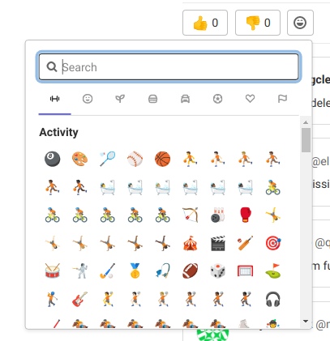
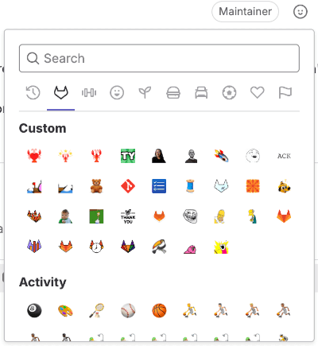



- Tier: 基础版，专业版，旗舰版
- Offering: JihuLab.com，私有化部署





- 从“表情奖励”重命名为“表情反应”于极狐GitLab 16.0。
- 在极狐GitLab 16.0 中引入了对工作项（如任务、目标与关键结果）使用表情反应。
- 在极狐GitLab 16.2 中引入了对设计讨论评论使用表情反应。



在线协作时，你获得击掌和点赞的机会减少了。你可以对以下内容使用表情反应：

- [议题](project/issues/_index.md)。
- [任务](tasks.md)。
- [合并请求](project/merge_requests/_index.md) 和 [代码片段](snippets.md)。
- [史诗](group/epics/_index.md)。
- [目标与关键结果](okrs.md)。
- 及任何有评论线程的地方。

表情反应让给予和接受反馈变得更容易，无需长篇评论线程。

“赞”和“踩”表情用于计算议题或合并请求在[按受欢迎程度排序](project/issues/sorting_issue_lists.md#sorting-by-popularity)时的位置。

有关更多信息，请参阅[表情反应 API](../api/emoji_reactions.md)。

## 评论的表情反应

可以在特定评论上使用表情反应，以庆祝成就或认同某个观点。

要添加表情反应：

1. 在评论的右上角，选择笑脸图标 ()。
1. 从表情选择器中选择一个表情。

要移除表情反应，再次选择该表情即可。

## 自定义表情



- 在极狐GitLab 13.6 中通过功能标志 `custom_emoji` 为 GraphQL API 引入，默认禁用。
- 于极狐GitLab 14.0 在 JihuLab.com 上启用。
- 极狐GitLab 16.2 引入了添加表情的 UI。
- 极狐GitLab 16.7 在私有化部署实例上启用。
- 极狐GitLab 16.9 中 GA。功能标志 `custom_emoji` 已移除。



自定义表情会显示在所有可以使用表情反应的地方的表情选择器中。

要向评论或描述添加表情反应：

1. 选择 **添加反应**（）。
1. 选择极狐GitLab 徽标（）或向下滚动到 **自定义** 区域。
1. 从表情选择器中选择一个表情。

要在文本框中使用它们，请输入两个冒号之间的文件名。例如，`:thank-you:`。

### 上传自定义表情至群组



- 极狐GitLab 16.5 引入。



将自定义表情上传到群组后，可在其所有子群组和项目中使用。

前提条件：

- 您必须至少具有该群组的开发者角色。

要上传自定义表情：

1. 在描述或评论中，选择 **添加反应**（）。
1. 在表情选择器底部，选择 **创建新表情**。
1. 输入自定义表情的名称和 URL。
1. 选择 **保存**。

您还可以使用 GraphQL API 将自定义表情上传到极狐GitLab 实例。有关更多信息，请参阅[通过 GraphQL 使用自定义表情](../api/graphql/custom_emoji.md)。