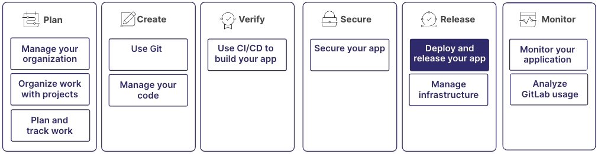

从预览应用程序开始，最后在生产环境中将其部署给您的用户。管理容器和软件包，使用持续集成交付您的应用程序，并使用功能标志和增量部署以受控方式发布应用程序。

这些过程是更大工作流的一部分：

## 步骤 1：存储和访问项目产物

使用软件包和仓库在极狐GitLab 中安全地存储和分发项目的依赖、库和其他产物。

软件包仓库支持多种软件包格式，包括 Maven、NPM、NuGet、PyPI 和 Conan。它提供了一个集中位置来跨项目存储和分发软件包。将软件包仓库与极狐GitLab CI/CD 流水线集成，以自动化软件包发布并确保顺畅的开发和部署工作流程。

容器镜像仓库用作 Docker 镜像的私有注册表。使用它在组织内或公开存储、管理和分发 Docker 和 OCI 镜像。将容器镜像仓库与极狐GitLab CI/CD 集成，以构建、测试和部署容器化应用程序。

更多信息，请参见：

- [软件包和仓库](../packages/_index.md)

## 步骤 2：跨环境部署应用程序

使用环境来管理和跟踪应用程序在不同阶段（例如，开发、预发布和生产）的部署。每个环境可以有自己的独特配置、变量和部署设置。

设置环境后，您可以监控它们。虽然您主要在部署位置（例如，在 AWS 中）监控部署，但极狐GitLab 也提供仪表板。如果部署到 Kubernetes，您可以在极狐GitLab UI 中监控实时集群状态。

您还可以在合并请求中创建临时环境。团队成员可以在将更改提交到主分支之前审查和测试更改。这些临时环境称为 Review Apps。

更多信息，请参见：

- [环境](../../ci/environments/_index.md)
- [部署到 AWS](../../ci/cloud_deployment/_index.md)
- [部署到 Kubernetes](../clusters/agent/_index.md)
- [Kubernetes 仪表板](../../ci/environments/kubernetes_dashboard.md)
- [环境仪表板](../../ci/environments/environments_dashboard.md)
- [运维仪表板](../operations_dashboard/_index.md)
- [Review Apps](../../ci/review_apps/_index.md)

## 步骤 3：通过持续交付功能保持合规

为了维护生产系统的稳定性和完整性，防止意外或未经授权的部署，请使用受保护的环境。它们提供了一种方法来保护和控制在关键环境（如生产环境）中的部署。通过定义受保护的环境，您可以限制对特定用户或角色的访问，确保只有授权人员才能部署更改。

部署安全是持续交付流水线的一部分，有助于确保部署的可靠性和安全性。极狐GitLab 提供了内置的安全机制，例如在部署失败时自动回滚，以及定义自定义健康检查以验证部署成功的能力。

部署审批为您的部署过程增加了额外的控制和协作层。您可以定义审批规则，要求指定的审批者在部署可以继续之前审查和批准部署。可以根据不同的条件设置审批，例如环境、分支或正在部署的特定更改。

更多信息，请参见：

- [受保护的环境](../../ci/environments/protected_environments.md)
- [部署安全](../../ci/environments/deployment_safety.md)
- [部署审批](../../ci/environments/deployment_approvals.md)

## 步骤 4：将发布产物交付给公共或内部用户

使用发布来打包并向最终用户分发您的应用程序，包括发布说明、二进制资产和其他相关信息。您可以从任何分支创建发布。

将发布与环境集成，以便在每次部署到特定环境（例如，生产）时自动创建发布。您可以在每次发布发生时有通知，并且可以指定权限，如果您想控制谁可以创建、更新和删除发布。

更多信息，请参见：

- [发布](../project/releases/_index.md)

## 步骤 5：安全地推出更改

要逐步将您的应用程序部署到部分用户或服务器，请使用增量部署。您可以在小范围内监控和评估影响，然后再向整个用户群推出。

极狐GitLab 中的功能标志提供了一种在不需要完整部署的情况下在应用程序中启用或禁用特定功能的方法。您可以使用功能标志安全地测试新功能、进行 A/B 测试，或逐步向用户引入更改。

通过使用功能标志，您可以将代码部署与功能发布分离，从而更好地控制用户体验，并降低引入错误或意外行为的风险。

更多信息，请参见：

- [增量部署](../../ci/environments/incremental_rollouts.md)
- [功能标志](../../operations/feature_flags.md)

## 步骤 6：部署静态网站

使用极狐GitLab Pages，您可以展示项目的文档、演示或营销页面。直接从极狐GitLab 中的仓库创建静态网站。极狐GitLab Pages 支持静态站点生成器，如 Jekyll、Hugo 和 Middleman，以及普通的 HTML、CSS 和 JavaScript。要开始使用，请创建一个新项目或使用现有项目，配置极狐GitLab Pages 设置，并将您的内容推送到仓库。每次您向指定分支推送更改时，极狐GitLab 都会自动构建和部署您的网站。

更多信息，请参见：

- [极狐GitLab Pages](../project/pages/_index.md)

## 步骤 7：使用 Auto Deploy 进入主观模式

Auto Deploy 是一个带有主观选择的 CI 模板，负责构建和部署您的应用程序。您可以使用环境变量微调 Auto DevOps 流水线。

更多信息，请参见：

- [Auto Deploy](../../topics/autodevops/stages.md#auto-deploy)