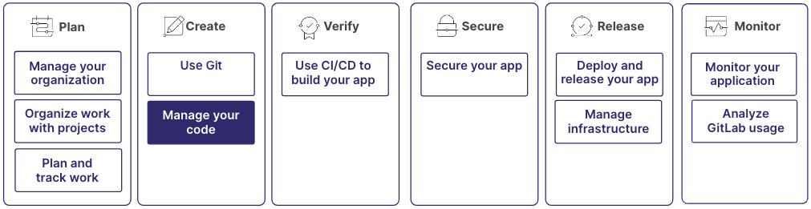

极狐GitLab 为整个软件开发生命周期提供工具，从代码创建到交付。

了解有关在极狐GitLab 中创建和管理代码的更多信息。
该过程包括编写代码、进行审查、使用版本控制提交代码，以及随时间推移更新代码。

此过程是更大工作流的一部分：

## 步骤 1：创建代码仓

项目是一个集中位置，你可以在此与其他人协作、跟踪议题、管理合并请求、自动化 CI/CD 流水线等等。

每个项目都包含一个代码仓，你可以在其中存储代码、文档以及与软件开发工作相关的其他文件。
对代码仓中文件所做的更改会被跟踪，因此你可以查看历史记录。

代码仓侧重于源代码的版本控制，而项目则为整个开发生命周期提供了一个全面的环境。

有关更多信息，请参阅[创建代码仓](../project/repository/_index.md#create-a-repository)。

## 步骤 2：编写代码

对于如何以及在何处编写代码，你有多种选择。

你可以使用极狐GitLab UI，直接在浏览器中进行开发。你有两个选择：

- 纯文本编辑器，称为 Web 编辑器，可用于编辑单个文件。
- 功能更全面的编辑器，称为 Web IDE，可用于编辑多个文件。

更喜欢在本地工作？使用 Git 将代码仓克隆到你的计算机，并在你选择的 IDE 中进行开发。

不想使用前两种选项？启动远程开发环境，在云端工作。

你可以通过创建独立的工作空间来进一步拆分开发环境。工作空间是独立的开发环境，用于确保不同项目不会相互干扰。

有关更多信息，请参阅：

- [从 UI 在代码仓中创建文件](../project/repository/_index.md#add-a-file-from-the-ui)
- [在 Web IDE 中打开文件](../project/web_ide/_index.md#from-a-file)
- [使用工作空间创建远程开发环境](../workspace/_index.md)

如需其他编写代码的帮助，请使用代码建议。

## 步骤 3：保存更改并推送到极狐GitLab

当你的更改准备就绪时，应将其提交到极狐GitLab，你可以在那里与团队中的其他人共享。

要提交你的更改，请先将其复制：

- 从你的本地计算机，在你自己的分支中
- 到极狐GitLab，在远程计算机上，到 `default branch`。

要在分支之间复制文件，你需要创建一个合并请求。
如何执行此操作取决于你编写代码的位置以及用于创建代码的工具。
但核心思路是创建一个合并请求，该请求获取源分支的内容，并建议将其合并到目标分支中。

有关更多信息，请参阅：

- [使用 Git 创建合并请求](../../tutorials/make_first_git_commit/_index.md)
- [在添加、编辑或上传文件时使用 UI 创建合并请求](../project/merge_requests/creating_merge_requests.md)

## 步骤 4：进行代码审查

在你创建了提议更改代码库的合并请求后，你可以让你的提议接受审查。
代码审查有助于维护代码质量和一致性。这也是团队成员之间知识共享的机会。

合并请求会显示提议的更改与你想要合并到的分支之间的差异。

审查者可以查看更改，并对特定代码行留下评论。
审查者还可以直接在差异中建议更改。

审查者可以批准更改，或在合并前要求进行额外更改。
极狐GitLab 会跟踪审查状态，并在获得必要的批准之前阻止合并。

你的组织可能有保护规则，要求特定的批准或阻止某些操作。例如，你可能需要代码所有者对你正在更改的文件进行批准，或者你的合并请求可能需要一定数量的批准才能合并。

有关更多信息，请参阅：

- [请求审查你的合并请求](../project/merge_requests/reviews/_index.md#request-a-review)
- [向合并请求添加建议](../project/merge_requests/reviews/suggestions.md#create-suggestions)
- [合并请求批准](../project/merge_requests/approvals/_index.md)
- [代码所有者](../project/codeowners/_index.md)

## 步骤 5：合并合并请求

在你的更改可以合并之前，合并请求通常需要得到其他人的批准，并且要有一个通过的 CI/CD 流水线。这些要求由你的组织自定义，但通常包括确保：

- 代码更改符合你组织的指南。
- 提交消息清晰，并链接到关联的议题。

受保护分支和其他代码仓保护措施可能会阻止你直接合并或要求执行额外的步骤。如果你无法合并你的更改，请与你的团队确认现有的保护规则。

如果在创建分支之后、合并到目标分支之前，其他人编辑了某个文件，则可能会发生合并冲突。你必须解决所有冲突才能进行合并。

有关更多信息，请参阅：

- [合并冲突](../project/merge_requests/conflicts.md)
- [合并方法](../project/merge_requests/methods/_index.md)
- [保护你的代码仓](../project/repository/protect.md)