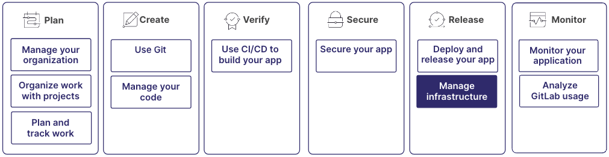

随着 DevOps 和 SRE 方法的兴起，基础设施管理已经变得代码化和可自动化。您现在可以在基础设施管理中采用软件开发的最佳实践。

传统运维团队的日常工作已经发生变化，更类似于传统的软件开发。同时，软件工程师更有可能控制整个 DevOps 生命周期，包括部署和交付。

极狐GitLab 提供各种功能来加速和简化您的基础设施管理实践。

基础设施管理是更大工作流的一部分：

## 步骤 1：使用代码管理您的基础设施

极狐GitLab 与 Terraform 深度集成，以运行基础设施即代码流水线并支持各种流程。Terraform 被视为云基础设施配置的标准。极狐GitLab 的各种集成可帮助您：

- 无需任何设置即可快速入门。
- 在合并请求中围绕基础设施更改进行协作，就像您可能对代码更改所做的那样。
- 使用模块注册表进行扩展。

有关更多信息，请参阅：

- [基础设施即代码](../infrastructure/iac/_index.md)

## 步骤 2：与 Kubernetes 集群交互

极狐GitLab 与 Kubernetes 的集成可帮助您安装、配置、管理、部署和排查集群应用程序。借助极狐GitLab 的 Kubernetes 代理，您可以连接防火墙后的集群，实时访问 API 端点，为生产环境和非生产环境执行基于拉取或推送的部署等。

有关更多信息，请参阅：

- [在云中创建 Kubernetes 集群](../clusters/create/_index.md)
- [将 Kubernetes 集群与极狐GitLab 连接](../clusters/agent/_index.md)

## 步骤 3：使用 Runbook 记录流程

Runbook 是一系列记录在案的程序，用于说明如何执行任务，例如启动、停止、调试或排查系统问题。在极狐GitLab 中，Runbook 使用 Markdown 创建。它们可以包含各种元素，包括文本、代码片段、图片和链接。

极狐GitLab 中的 Runbook 与其它极狐GitLab 功能集成，如 CI/CD 流水线和议题。您可以基于特定事件或条件自动触发 Runbook，例如流水线成功或创建议题时。此外，用户可以将 Runbook 链接到议题、合并请求和其它极狐GitLab 对象。

有关更多信息，请参阅：

- [极狐GitLab 中可执行 Runbook 的工作原理](../project/clusters/runbooks/_index.md)