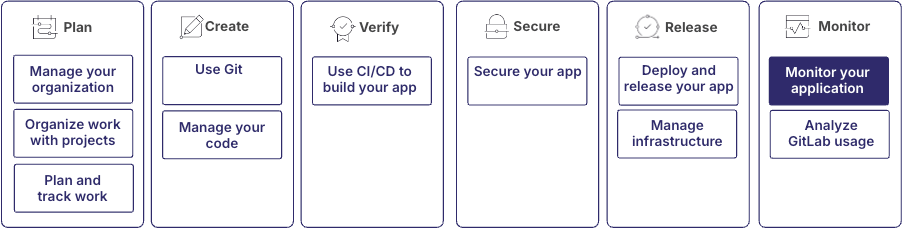

监控是维护和优化应用程序的关键环节。
极狐GitLab 的可观测性功能可帮助你追踪错误、分析应用程序性能并响应事件。

这些功能是更广泛的 DevOps 工作流的一部分：

所有这些功能都可以独立使用。例如，你可以单独使用链路追踪或事件管理，而不使用错误追踪。但是，为了获得最佳体验，建议将这些功能结合使用。

## 

第一步：确定要使用的项目

你可以使用存储应用程序源代码的项目来进行监控。

对于具有多个服务和代码仓的大型应用程序，你应该创建一个专用项目来集中管理从系统不同组件收集到的所有遥测数据。
这种方法有几个好处：

- 数据可供所有开发和运维团队访问，从而促进协作。
- 来自不同数据源的数据可以在一个地方进行查询和关联，从而加快问题排查。
- 它为所有可观测性数据提供了单一事实来源，使其更易于维护和更新。
- 通过将用户权限集中在一个项目中，简化了管理员进行访问管理的工作。

要启用可观测性功能，你需要拥有项目的管理员或所有者角色。

更多信息，请参见：

- [创建项目](../project/_index.md)

## 

第二步：使用错误追踪来追踪应用程序错误

错误追踪可帮助你识别、确定优先级并调试应用程序中的错误。
你的应用程序产生的错误由 Sentry SDK 收集，
随后存储在极狐GitLab 或 Sentry 后端上。

更多信息，请参见：

- [错误追踪的工作原理](../../operations/error_tracking.md#how-error-tracking-works)

## 

第三步：管理告警和事件

设置事件管理功能，以便协作排查问题和解决事件。

更多信息，请参见：

- [事件管理](../../operations/incident_management/_index.md)

## 

第四步：分析与改进

利用收集到的数据和洞察持续改进你的应用程序和监控流程：

1. 创建洞察仪表板，用于分析已创建和已关闭的议题或事件，并评估事件响应的绩效。
1. 创建可执行的 Runbook，帮助值班工程师自主修复事件。
1. 定期检查你的监控设置，并随着应用程序的发展调整采样阈值或添加新的指标。
1. 进行事件复盘，以识别应用程序和事件响应流程中需要改进的地方。
1. 利用从监控中获得的洞察来明确你的开发优先级和技术债务削减工作。

更多信息，请参见：

- [洞察仪表板](../project/insights/_index.md)
- [可执行的 Runbook](../project/clusters/runbooks/_index.md)