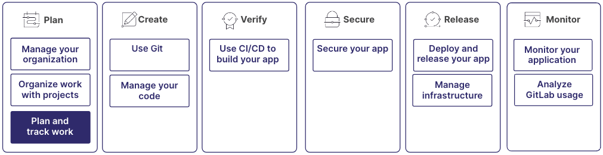

极狐GitLab 提供了帮助您规划、执行和跟踪工作的工具。
借助规划、协作、文档、时间跟踪和报告功能，
您可以创建促进透明度、责任感和高效项目管理的工作流程。

规划工作的过程是更大工作流程的一部分：

## 第 1 步：定义时间线

首先思考您的团队希望如何推进项目目标和任务。

使用里程碑定义您的发布，例如 `1.0`、`2.0` 和 `3.0`。决定是否同时发布主版本和次版本。

然后，如果您希望团队使用标准的规划节奏，请使用迭代。
迭代是限时的时间段，类似于冲刺。例如，您可能希望每两周发布一次。

更多信息，请参阅：

- [里程碑](../project/milestones/_index.md)
- [迭代](../group/iterations/_index.md)

## 第 2 步：规划并组织工作

在您决定发布节奏后，就可以开始组织工作了。

史诗处于最高层级。它们提供项目主要目标的广泛概述，并帮助协调团队工作与整体愿景保持一致。

然后，您可以定义议题并将其分配给史诗。
议题代表您需要解决的具体错误或用户故事。
议题可以分配给团队成员，添加标记以进行分类和优先级排序，并在各个完成阶段进行跟踪。

然后，在议题中，您可以使用任务将工作分解为更小、可操作的条目。

最后，为确保项目目标与组织目标保持一致，您可以创建 OKR（目标和关键结果）并将其与史诗关联。
通过定义可衡量的关键结果，您的团队可以跟踪进度，并评估您的工作对更广泛组织目标的影响。

更多信息，请参阅：

- [史诗](../group/epics/_index.md)
- [议题](../project/issues/_index.md)
- [任务](../tasks.md)
- [OKR](../okrs.md)

## 第 3 步：可视化您的工作流程

议题看板提供项目工作流程的可视化表示。它们按状态（例如“待办”、“进行中”或“已完成”）显示议题。
使用议题看板快速评估项目的当前状态，并识别任何瓶颈或阻碍因素。

更多信息，请参阅：

- [议题看板](../project/issue_board.md)

## 第 4 步：协作与沟通

要分类和确定议题的优先级，以便更轻松地识别和专注于特定工作领域，请使用标记。通过为议题分配描述性标记（如“错误”、“增强”或“高优先级”），您可以筛选并找到相关任务。

在议题中，评论和讨论串为讨论、反馈和协作提供了集中空间。团队成员可以在议题上下文中提问、提供更新、分享想法并审阅彼此的工作。

同样在评论中，您可以使用提及（`@username`）来通知其他人您希望他们参与讨论。
当您提及某人时，他们会收到通知。

更多信息，请参阅：

- [标记](../project/labels.md)
- [评论和讨论串](../discussions/_index.md)

## 第 5 步：跟踪进度

跟踪进度涉及监控任务、里程碑和整体项目目标的状态和完成情况。

您可以使用路线图来可视化史诗和里程碑的时间线并跟踪进度。
路线图显示项目的战略性、长期视图，因此您可以判断主要交付物的计划时间，并确定它们如何促进整体项目目标。

要记录在每个议题上花费的时间，以帮助监控进度并估算未来的工作量，请使用时间跟踪。

您可以使用里程碑燃尽图来查看特定里程碑进度的图形概览。燃尽图显示随时间推移打开、关闭和剩余的议题数量。
使用它来跟踪您的进度并相应地调整投入。

更多信息，请参阅：

- [路线图](../group/roadmap/_index.md)
- [时间跟踪](../project/time_tracking.md)
- [里程碑燃起图和燃尽图](../project/milestones/burndown_and_burnup_charts.md)

## 第 6 步：报告与分析

随着时间的推移，您可以使用分析功能来深入了解团队的绩效和生产力。

通过按标记、里程碑和迭代进行筛选来分析议题。
按优先级、类别或其他自定义条件对议题进行分组。

更多信息，请参阅：

- [分析极狐GitLab 使用情况](../analytics/_index.md)

## 第 7 步：创建文档并分享知识

在整个过程中，您可以记录您的进度和流程。

除了在议题和合并请求中添加评论和备注之外，
需求也是极狐GitLab 工作流程中文档工作的另一个重要方面。
它们定义了特定功能或任务的预期结果、验收标准和约束。需求可以记录在议题或
Wiki 中，从而清楚地了解需要交付的内容以及如何衡量成功。

Wiki 是项目文档和知识管理的主要中心。
它们提供了一个协作空间，团队成员可以在其中创建、编辑和组织与项目相关的内容。Wiki 可以包含广泛的信息，
例如项目指南、技术规范和最佳实践。

更多信息，请参阅：

- [需求](../project/requirements/_index.md)
- [Wiki](../project/wiki/_index.md)
