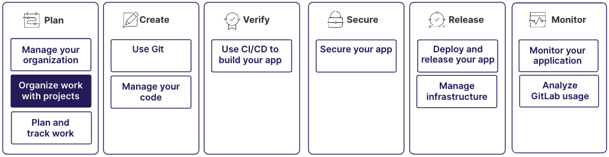

极狐GitLab 中的项目将特定开发项目的所有数据组织起来。项目是你与团队协作、存储文件并管理任务的地方。

使用项目可以：

- 编写并保存代码
- 跟踪议题和任务
- 协作进行代码变更
- 测试和部署你的应用程序

项目的创建和维护是更大工作流的一部分：

## 第 1 步：创建项目

首先在极狐GitLab 中创建一个新项目，以包含你的代码库、文档和相关资源。

项目包含一个代码仓库。代码仓库包含与你工作相关的所有文件、目录和数据。

创建项目时，请审查并配置以下设置，以符合你的开发工作流和协作需求：

- 可见性级别
- 合并请求审批
- 议题跟踪
- CI/CD 流水线
- 议题或合并请求等实体的描述模板

更多信息，请参见：

- [创建项目](../project/_index.md)
- [管理项目](../project/working_with_projects.md)
- [项目可见性](../public_access.md)
- [项目设置](../project/settings/_index.md)
- [描述模板](../project/description_templates.md)

## 第 2 步：保护和控制项目的访问

使用以下工具来管理对项目的安全访问：

- 项目访问令牌：为自动化工具或外部系统授予特定的访问权限，以实现安全集成。
- 部署密钥：授予对代码仓库的只读访问权限，以便将项目安全地部署到外部系统。
- 部署令牌：为项目的仓库和镜像仓库授予临时的、有限的访问权限，以用于安全部署和自动化。

更多信息，请参见：

- [项目访问令牌](../project/settings/project_access_tokens.md)
- [部署密钥](../project/deploy_keys/_index.md)
- [部署令牌](../project/deploy_tokens/_index.md)

## 第 3 步：协作和共享项目

你可以将多个项目邀请到一个群组中，这有时被称为“与群组共享项目”。每个项目都有其自己的代码仓库、议题、合并请求和其他功能。

通过在群组中包含多个项目，团队成员可以在各个项目上进行协作，同时能够概览群组中完成的所有工作。

为了进一步细化对你的项目的访问，你可以向群组中添加子群组。

更多信息，请参见：

- [共享项目](../project/members/sharing_projects_groups.md)
- [子群组](../group/subgroups/_index.md)

## 第 4 步：提升项目的可发现性和认可度

使用搜索框可以在你的极狐GitLab 实例中快速找到特定的项目、议题、合并请求或代码片段。

为了使项目更容易被发现：

- 使用保留的项目和群组名称为项目创建一致且可辨识的命名方案。
- 在项目的 `README` 文件中添加徽章。徽章可以显示重要信息，例如构建状态、项目健康状况、测试覆盖率或版本号。
- 分配项目主题。主题是帮助你组织和查找项目的标签。

更多信息，请参见：

- [保留的项目和群组名称](../reserved_names.md)
- [搜索](../search/_index.md)
- [徽章](../project/badges.md)
- [项目主题](../project/project_topics.md)

## 第 5 步：提高开发效率并保持代码质量

使用代码智能功能可以提高你的生产力并保持高质量的代码库，例如：

- 代码导航
- 悬停信息
- 自动补全

代码智能是一系列帮助你高效探索、分析和维护代码库的工具。

要快速定位并跳转到项目中的特定文件，请使用文件查找器。

更多信息，请参见：

- [代码智能](../project/code_intelligence.md)
- [文件](../project/repository/files/_index.md)

## 第 6 步：将项目迁移到极狐GitLab

使用文件导出功能可以将项目从其他系统或极狐GitLab 实例迁移到极狐GitLab。

当你将一个频繁访问的仓库迁移到极狐GitLab 时，可以使用项目别名继续通过其原始名称访问它。

在 JihuLab.com 上，你可以将项目从一个命名空间转移到另一个命名空间。转移实际上是将项目移动到另一个群组，以便其成员拥有访问权限或所有权。

更多信息，请参见：

- [导入并迁移到极狐GitLab](../import/_index.md)
- [项目别名](../project/working_with_projects.md#project-aliases)
- [将项目转移到另一个命名空间](../project/working_with_projects.md#transfer-a-project)