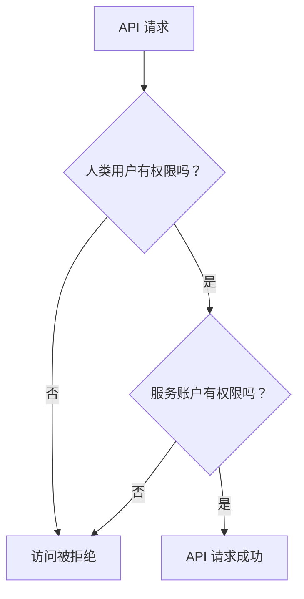



- 在极狐GitLab 17.9 中引入。



极狐GitLab Duo 与 CodeRider 使用复合身份来认证请求。

> [!note]
> 产品其他区域中复合身份的支持已在议题中提出。

用于认证请求的令牌是由两个身份组成的复合体：

- 主作者，即 CodeRider [服务账户](../profile/service_accounts.md)。
  此服务账户是实例级别的，并且在使用 CodeRider 快捷操作的项目中拥有开发者角色。该服务账户是令牌的所有者。
- 次要作者，即提交该快捷操作的人类用户。
  此用户的 `id` 包含在令牌的作用域内。

此复合身份确保了由 CodeRider 编写的任何活动都能被正确地追溯到 CodeRider 服务账户。
同时，此复合身份确保不会发生人类用户的[权限提升](https://en.wikipedia.org/wiki/Privilege_escalation)。

此[动态作用域](https://github.com/doorkeeper-gem/doorkeeper/pull/1739)
在 API 请求授权期间进行检查。
当请求授权时，极狐GitLab 会验证发起该快捷操作的服务账户和用户是否都拥有足够的权限。

