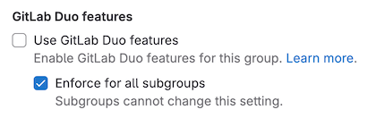



- Tier: 专业版，旗舰版
- Add-on: GitLab Duo Pro 或 Enterprise
- Offering: JihuLab.com，私有化部署





- 在极狐GitLab 16.10 中引入控制 AI 功能开启和关闭的设置。
- 在极狐GitLab 16.11 中将控制 AI 功能开启和关闭的设置添加到 UI。



对于 GitLab Duo Pro 或 Enterprise，你可以针对群组、项目或实例开启或关闭极狐GitLab Duo。

> [!note]
> 此信息适用于极狐GitLab 18.1 及更早版本。对于极狐GitLab 18.2 及更高版本，请查看[最新文档](turn_on_off.md)。

当极狐GitLab Duo 针对群组、项目或实例关闭后：

- 访问资源（如代码、议题和漏洞）的极狐GitLab Duo 功能不可用。
- 代码建议不可用。
- 极狐GitLab Duo Chat 不可用。

## 针对群组或子群组





在极狐GitLab 17.8 至 18.1 中，按照以下说明为群组（包括其子群组和项目）开启或关闭极狐GitLab Duo。

先决条件：

- 你必须具有该群组的所有者角色。

要为群组或子群组开启或关闭极狐GitLab Duo：

1. 在顶部导航栏中，选择 **搜索或跳转到** 并找到你的群组或子群组。
1. 根据你的部署类型和群组级别进入设置：
   - 对于 JihuLab.com 顶级群组：选择 **设置** > **极狐GitLab Duo**，然后选择 **更改配置**。
   - 对于 JihuLab.com 子群组：选择 **设置** > **通用**，然后展开 **极狐GitLab Duo 功能**。
   - 对于私有化部署实例（所有群组和子群组）：选择 **设置** > **通用**，然后展开 **极狐GitLab Duo 功能**。
1. 选择一个选项。
1. 选择 **保存更改**。





在极狐GitLab 17.7 中，按照以下说明为群组（包括其子群组和项目）开启或关闭极狐GitLab Duo。

> [!note]
> 在极狐GitLab 17.7 中：
>
> - 对于 JihuLab.com，极狐GitLab Duo 设置页仅适用于顶级群组，不适用于子群组。
> - 对于私有化部署实例，极狐GitLab Duo 设置页不适用于群组或子群组。

先决条件：

- 你必须具有该群组的所有者角色。

要为顶级群组开启或关闭极狐GitLab Duo：

1. 在顶部导航栏中，选择 **搜索或跳转到** 并找到你的顶级群组。
1. 选择 **设置** > **极狐GitLab Duo**。
1. 选择 **更改配置**。
1. 选择一个选项。
1. 选择 **保存更改**。





在极狐GitLab 17.4 至 17.6 中，按照以下说明为群组及其子群组和项目开启或关闭极狐GitLab Duo。

> [!note]
> 在极狐GitLab 17.4 至 17.6 中：
>
> - 对于 JihuLab.com，极狐GitLab Duo 设置页仅适用于顶级群组，不适用于子群组。
> - 对于私有化部署实例，极狐GitLab Duo 设置页不适用于群组或子群组。

先决条件：

- 你必须具有该群组的所有者角色。

要为顶级群组开启或关闭极狐GitLab Duo：

1. 在顶部导航栏中，选择 **搜索或跳转到** 并找到你的顶级群组。
1. 选择 **设置** > **极狐GitLab Duo**。
1. 选择 **更改配置**。
1. 选择一个选项。
1. 选择 **保存更改**。





在极狐GitLab 17.3 及更早版本中，遵循以下说明为群组及其子群组和项目开启或关闭极狐GitLab Duo。

先决条件：

- 你必须具有该群组的所有者角色。

要为群组或子群组开启或关闭极狐GitLab Duo：

1. 在顶部导航栏中，选择 **搜索或跳转到** 并找到你的群组或子群组。
1. 选择 **设置** > **通用**。
1. 展开 **权限和群组功能**。
1. 选中或清除 **使用极狐GitLab Duo 功能** 复选框。
1. 可选。选中 **对所有子群组强制执行** 复选框以将设置级联到所有子群组。

   





## 针对项目





在极狐GitLab 17.4 至 18.1 中，按照以下说明为项目开启或关闭极狐GitLab Duo。

先决条件：

- 你必须具有该项目的所有者或维护者角色。

要为项目开启或关闭极狐GitLab Duo：

1. 在顶部导航栏中，选择 **搜索或跳转到** 并找到你的项目。
1. 在左侧边栏中，选择 **设置** > **通用**。
1. 展开 **可见性、项目功能、权限**。
1. 在 **极狐GitLab Duo** 下，将开关切换为开启或关闭。
1. 选择 **保存更改**。





在极狐GitLab 17.3 及更早版本中，按照以下说明为项目开启或关闭极狐GitLab Duo。

1. 使用极狐GitLab GraphQL API 的 [`projectSettingsUpdate`](../../api/graphql/reference/_index.md#mutationprojectsettingsupdate) 变更。
1. 将 [`duo_features_enabled`](../../api/graphql/getting_started.md#update-project-settings) 设置设为 `true` 或 `false`。





## 针对实例



- Offering: 私有化部署







在极狐GitLab 17.7 至 18.1 中，按照以下说明为实例开启或关闭极狐GitLab Duo。

先决条件：

- 你必须是管理员。

要为实例开启或关闭极狐GitLab Duo：

1. 在右上角，选择 **管理员**。
1. 在左侧边栏中，选择 **极狐GitLab Duo**。
1. 选择 **更改配置**。
1. 选择一个选项。
1. 选择 **保存更改**。





在极狐GitLab 17.4 至 17.6 中，按照以下说明为实例开启或关闭极狐GitLab Duo。

先决条件：

- 你必须是管理员。

要为实例开启或关闭极狐GitLab Duo：

1. 在右上角，选择 **管理员**。
1. 在左侧边栏中，选择 **设置** > **通用**。
1. 展开 **极狐GitLab Duo 功能**。
1. 选择一个选项。
1. 选择 **保存更改**。





在极狐GitLab 17.3 及更早版本中，按照以下说明为实例开启或关闭极狐GitLab Duo。

先决条件：

- 你必须是管理员。

要为实例开启或关闭极狐GitLab Duo：

1. 在左侧边栏底部，选择 **管理中心**。
1. 选择 **设置** > **通用**。
1. 展开 **AI 赋能的功能**。
1. 选中或清除 **使用 Duo 功能** 复选框。
1. 可选。选中 **对所有子群组强制执行** 复选框，以将设置级联到实例中的所有群组。



