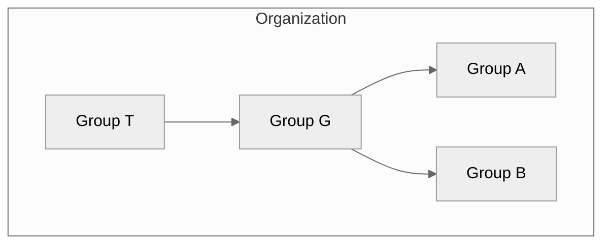



- Tier: 基础版，专业版，旗舰版
- Offering: JihuLab.com，私有化部署



在极狐GitLab 中，您可以使用群组同时管理一个或多个相关项目。

您可以使用群组与所有群组成员沟通，并管理项目的权限。
如果某人拥有该群组的访问权限，他们就可以访问该群组中的所有项目。

您还可以查看群组中所有项目的议题和合并请求，
以及有关群组活动的分析。

对于大型组织，您还可以创建[子群组](subgroups/_index.md)。

有关创建和管理群组的更多信息，请参阅[管理群组](manage.md)。

## 群组层级

群组按树状结构组织：

- **顶级群组**是在组织“根”级别创建的群组。一个组织可以有一个或多个顶级群组。顶级群组可以包含一个或多个子群组。
- **父群组**是包含一个或多个子群组的群组。
- **子群组**是隶属于另一个群组的群组。

例如，在下图中：

- 该组织有四个群组：一个顶级群组 (T)，其中包含一个子群组 (G)，以及 G 内的两个子群组 (A 和 B)。
- T 是顶级群组，也是 G 的父群组。
- G 是 T 的子群组（子级），也是 A 和 B 的父群组。
- A 和 B 是 G 的子群组（子级）。

## 群组结构

群组的设置方式取决于您的用例、团队规模以及访问要求。
下表描述了构建群组的最常见模型。

<!-- vale gitlab_base.Simplicity = NO -->

| 模型 | 结构 | 用例 |
| ----- | --------- | --------- |
| 简单 | 一个群组包含所有项目。 | 在小型团队中工作，或处理需要无缝协作和资源访问的特定解决方案（例如营销网站）。 |
| 团队 | 针对不同类型的团队（例如产品和工程）使用不同的群组或子群组。 | 在大型组织中工作，其中某些团队自主运作，或需要集中资源并限制外部团队成员的访问。 |
| 客户 | 每个客户一个群组。 | 为需要不同资源和访问级别的多个客户提供定制解决方案。 |
| 功能 | 一种功能（例如 AI/ML）对应一个群组或子群组。 | 开发复杂产品，其中一项功能需要特定资源以及领域专家的协作。 |

<!-- vale gitlab_base.Simplicity = YES -->

> [!note]
> 在极狐GitLab 私有化部署上，如果您想查看整个组织的概览，则应创建一个顶级群组。
> 有关创建所有群组的组织视图的更多信息，
> [请参阅史诗 9266](https://gitlab.com/groups/gitlab-org/-/work_items/9266)。
> 顶级群组通过完整的
> [安全仪表板和中心](../application_security/security_dashboard/_index.md)、
> [漏洞报告](../application_security/vulnerability_report/_index.md)、
> [合规中心](../compliance/compliance_center/_index.md) 以及
> [价值流分析](value_stream_analytics/_index.md) 提供整个组织的洞察。

### 群组结构的建议限制

群组对成员资格、层级深度或群组共享数量没有强制限制。
但是，大型或深度嵌套的结构可能会降低性能。
仪表板可能加载缓慢，权限计算可能超时，某些操作可能返回 `500` 错误。
为保持群组响应迅速，请保持在以下建议限制范围内：

| 结构 | 建议限制 | 最大限制 | 超出建议限制后可能出现的症状 |
| --------- | ----------------- | ------------- | ------------------------------------------- |
| 每个群组的成员数 | 少于 1,000 | 无 | 性能下降。当成员数达到 1,500 或更多时，操作可能超时或返回 `500` 错误。 |
| 每个父群组的子群组数 | 少于 100 | 无 | 导航和权限计算速度变慢。 |
| 层级深度 | 五级或更少 | 20 级 | 数据库查询可能超时。 |

建议限制不同于最大限制。最大限制是极狐GitLab 强制执行的技术上限。
如果群组超出建议限制，仍会得到支持。

当这些限制组合在一起时，性能问题最为严重。
例如，一个同时具有深层嵌套和许多子群组的群组，可能比仅存在单一情况的群组更早导致数据库查询超时。

建议限制反映了当前的性能行为。有关帮助您从大型、深度嵌套的结构迁移到更高性能结构的计划工作的详细信息，请参阅
[史诗 21582](https://gitlab.com/groups/gitlab-org/-/epics/21582)。

#### 保持在建议限制范围内

如果群组接近或超过建议限制，您可以使用以下变通方法来减少性能影响。

对于大型群组成员资格：

- 将成员数超过 1,000 的群组拆分为较小的功能群组，每个群组成员数不超过 500。
  例如，将包含所有工程师的单个群组替换为前端、后端和基础设施工程师的独立群组。
- 将每个较小的群组单独共享给项目和群组，而不是共享一个大型群组。
- 对于批量成员更改，请使用[群组成员 API](../../api/group_members.md)，并在请求之间添加延迟，以保持在[成员管理速率限制](../../administration/instance_limits.md#rate-limits)之内。

对于深层或宽泛的层级：

- 将层级保持在五级或更少。
- 对于组织中不需要共享继承成员资格的部分，使用独立的顶级群组，而不是将所有内容嵌套在一个层级下。
- 减少单个父群组下的直接子群组数量。

对于群组共享：

- 当您需要管理单个成员权限时，直接将群组添加到项目，而不是通过嵌套的群组共享进行共享。
- 如果新的子群组未从共享群组继承权限，请将共享的角色更改为其他值，然后再改回来，以触发权限重新计算。

对于从身份提供商同步的大型层级：

- 配置 [LDAP 同步](../../administration/auth/ldap/ldap_synchronization.md)
  间隔，以避免在身份提供商上触发速率限制。
  同步期间的速率限制错误可能会阻止用户或移除群组成员资格。

## 群组可见性

与项目一样，群组可以配置为对以下用户可见：

- 匿名用户。
- 所有已认证用户。
- 仅限明确的群组成员。

应用程序设置级别对[可见性级别](../../administration/settings/visibility_and_access_controls.md#restrict-visibility-levels)的限制也适用于群组。如果设置为内部，则匿名用户的探索页面为空。群组页面有一个可见性级别图标。

用户不能创建可见性级别高于其直接父群组的子群组或项目。

## 探索群组

要探索所有公共或内部群组：

1. 在顶部栏中，选择 **搜索或跳转到**。
1. 从下拉列表中，选择 **探索**。
1. 在左侧边栏中，选择 **群组**。

## 查看您所属的群组

要查看您直接或间接所属的群组：

1. 在顶部栏中，选择 **搜索或跳转到**。
1. 从下拉列表中，选择 **查看我所有的群组**。

此页面显示您通过以下方式所属的群组：

- 子群组父群组的成员资格。
- 群组或子群组中项目的直接或继承成员资格。

### 查看非活跃群组

当群组处于待删除状态或已被归档时，该群组为非活跃状态。

要查看所有非活跃群组：

1. 在顶部栏中，选择 **搜索或跳转到**。
1. 从下拉列表中，选择以下任一选项：
   - **查看我所有的群组**以筛选您所属的群组。
   - **探索**以筛选公共或内部群组。
1. 选择 **非活跃** 选项卡。

列表中的每个非活跃群组都会显示一个徽章，以指示该群组是已归档还是待删除。

如果群组处于待删除状态，列表还会显示：

- 计划最终删除群组的时间。
- **恢复**操作。当您恢复群组时：
  - **待删除**标记将被移除。该群组不再计划删除。
  - 该群组将从 **非活跃** 选项卡中移除。

## 查看群组

群组概览页面显示有关该群组及其成员、子群组和项目的信息，例如：

- 群组描述
- 近期活动
- 创建的合并请求和议题数量
- 添加的成员数量
- 子群组和项目
- 共享项目
- 已归档项目

要查看群组：

- 在顶部栏中，选择 **搜索或跳转到** 并找到您的群组。

您可以搜索群组的子群组和项目，并按升序或降序排序。

您可以使用群组的 ID 而不是名称来访问它，地址为 `https://gitlab.example.com/-/g/<id>`。
例如，如果您的群组 `example-group` 的 ID 为 `123456`，您可以通过
`https://gitlab.example.com/example-group` 或 `https://gitlab.example.com/-/g/123456` 访问该群组。

## 查找群组 ID

如果您想使用 [极狐GitLab API](../../api/_index.md) 与群组交互，您可能需要群组 ID。

要查找群组 ID：

1. 在顶部栏中，选择 **搜索或跳转到** 并找到您的群组。
1. 在群组概览页面的右上角，选择 **操作** ()。
1. 选择 **复制群组 ID**。

## 查看群组活动

要查看群组的活动：

1. 在顶部栏中，选择 **搜索或跳转到** 并找到您的群组。
1. 在左侧边栏中，选择 **管理** > **活动**。
1. 可选。要按贡献类型筛选活动，请选择一个选项卡：

   - **全部**：群组成员在群组及群组项目中的所有贡献。
   - **推送事件**：群组项目中的推送事件。
   - **合并事件**：群组项目中已接受的合并请求。
   - **议题事件**：群组项目中打开和关闭的议题。
   - **评论**：群组成员在群组项目中发布的评论。
   - **Wiki**：群组中 Wiki 页面的更新。
   - **设计**：群组项目中添加、更新和移除的设计。
   - **团队**：加入和离开群组项目的群组成员。

## 创建群组

要创建群组：

<!-- vale gitlab_base.FutureTense = NO -->

1. 在右上角，选择 **新建** () 和 **新建群组**。
1. 选择 **创建群组**。
1. 在 **群组名称** 文本框中，输入群组名称。有关不能用作群组名称的单词列表，请参阅
   [保留名称](../reserved_names.md)。
1. 在 **群组 URL** 文本框中，输入用于 [命名空间](../namespace/_index.md) 的群组路径。
1. 选择群组的 [**可见性级别**](../public_access.md)。
1. 可选。要个性化您的极狐GitLab 体验：
   - 对于 **谁将使用此群组？**，选择一个选项。
   - 从 **您将使用此群组做什么？** 下拉列表中，选择一个选项。
1. 可选。要邀请成员加入群组，请在 **电子邮件 1** 文本框中，输入您要邀请的用户的电子邮件地址。要邀请更多用户，请选择 **邀请其他成员** 并输入用户的电子邮件地址。
1. 选择 **创建群组**。

<!-- vale gitlab_base.FutureTense = YES -->

## 编辑群组名称、描述和头像

您可以从群组的常规设置中编辑群组详细信息。

先决条件：

- 您必须具有该群组的所有者角色。

要编辑群组详细信息：

1. 在顶部栏中，选择 **搜索或跳转到** 并找到您的群组。
1. 在左侧边栏中，选择 **设置** > **常规**。
1. 在 **群组名称** 文本框中，输入您的群组名称。请参阅[群组名称的限制](../reserved_names.md)。
1. 可选。在 **群组描述（可选）** 文本框中，输入您的群组描述。
   描述限制为 500 个字符。
1. 可选。在 **群组头像** 下，选择 **选择文件**，然后选择一张图片。理想图片尺寸为 192 x 192 像素，允许的最大文件大小为 200 KB。
1. 选择 **保存更改**。

## 离开群组

当您离开群组时：

- 您不再是该群组、其子群组和项目的成员，并且无法再贡献。
- 分配给您的所有议题和合并请求都将被取消分配。

要离开群组：

1. 在顶部栏中，选择 **搜索或跳转到** 并找到您的群组。
1. 在群组概览页面的右上角，选择 **操作** ()。
1. 选择 **离开群组**，然后再次选择 **离开群组**。

## 计划删除群组

默认情况下，当您首次删除群组时，它会进入待删除状态。
再次删除群组可立即将其移除。

先决条件：

- 您必须具有群组的所有者角色。
- 如果群组包含任何项目，则必须[允许所有者删除项目](../../administration/settings/visibility_and_access_controls.md#restrict-project-deletion-to-administrators)。

要删除群组及其内容：

1. 在顶部栏中，选择 **搜索或跳转到** 并找到您的群组。
1. 在群组概览页面的右上角，选择 **操作** ()。
1. 选择 **删除**。
1. 在确认对话框中，输入群组路径并选择 **是，删除群组**。

您也可以从群组仪表板删除群组：

1. 在顶部栏中，选择 **搜索或跳转到** > **查看我所有的群组**。
1. 为您要删除的群组选择 ()。
1. 选择 **删除**。
1. 在确认对话框中，输入群组路径并选择 **是，删除群组**。

此操作会添加一个后台作业来计划删除群组。在 JihuLab.com 上，群组将在 30 天后删除。在极狐GitLab 私有化部署上，
您可以通过[实例设置](../../administration/settings/visibility_and_access_controls.md#deletion-protection)修改保留期。

当群组计划删除时，计划的 CI/CD 流水线将停止运行。

如果计划删除群组的用户在删除发生前失去对该群组的访问权限（例如，离开群组、角色被降级或被禁止加入群组），
则删除作业将改为恢复该群组，并且该群组不再计划删除。

> [!warning]
> 如果计划删除群组的用户在作业运行前重新获得所有者角色或管理员访问权限，则该作业将永久删除该群组。

## 立即删除群组

如果您不想等待，可以立即删除群组。

先决条件：

- 您必须具有群组的所有者角色。
- 您已[计划删除该群组](#schedule-a-group-for-deletion)。

要永久删除计划删除的群组：

1. 在顶部栏中，选择 **搜索或跳转到** 并找到您的群组。
1. 在群组概览页面的右上角，选择 **操作** ()。
1. 选择 **永久删除**。
1. 在确认对话框中，输入群组路径并选择 **是，删除群组**。

此操作将删除该群组、其子群组、项目以及所有相关资源，包括议题和合并请求。

## 恢复群组

要恢复计划删除的群组：

1. 在顶部栏中，选择 **搜索或跳转到** 并找到您的群组。
1. 在群组概览页面的右上角，选择 **操作** ()。
1. 选择 **恢复**。

## 使用“操作”菜单管理群组

您可以查看所有群组的列表，并使用 **操作** 菜单进行管理。

先决条件：

- 除离开群组外，所有可用操作都需要所有者角色。

要访问群组的 **操作** 菜单：

1. 在顶部栏中，选择 **搜索或跳转到** > **查看我所有的群组**。
1. 在 **群组** 页面上，找到您的群组并选择 **操作** 菜单 ()。
1. 选择一个操作。

根据群组的状态，以下操作可用：

| 群组状态      | 可用操作       |
| ---------------- | ----------------------- |
| 活跃           | **编辑**、**归档**、**转移**、**离开群组**、**删除** |
| 已归档         | **取消归档**、**离开群组**、**删除** |
| 待删除 | **恢复**、**离开群组** |

## 请求访问群组

作为用户，如果管理员允许，您可以请求成为群组成员。

1. 在顶部栏中，选择 **搜索或跳转到** > **查看我所有的群组**。
1. 在右上角，选择 **探索群组**。
1. 在 **搜索** 文本框中，输入您要加入的群组名称。
1. 在搜索结果中，选择群组名称。
1. 在群组页面上，在群组名称下，选择 **请求访问**。

最多十位最近活跃的群组所有者会收到包含您请求的电子邮件。
任何群组所有者都可以批准或拒绝该请求。

如果您在请求获得批准前改变主意，请选择
**撤回访问请求**。

## 查看群组成员

要查看群组成员：

1. 在顶部栏中，选择 **搜索或跳转到** 并找到您的群组。
1. 在左侧边栏中，选择 **管理** > **成员**。

表格显示成员的：

- **账户**名称和用户名。
- 其 [成员资格](../project/members/_index.md#membership-types) 的 **来源**。
  具有多个来源的群组成员在 **成员** 表格中会显示两次，并计为单独的成员。
  具有提升角色（如所有者或维护者）的群组成员会覆盖子群组和项目中限制较少的角色。
  例如，具有所有者角色的群组成员可以在后代子群组或项目中被直接指派开发者角色。
  但是，由于该成员也被分配了所有者角色，因此他们拥有所有者范围的权限。[议题 502458](https://gitlab.com/gitlab-org/gitlab/-/work_items/502458)
  提议更改此行为，使成员的来源显示最高有效角色。
- 群组中的 [**角色**](../project/members/_index.md#which-roles-you-can-assign)。
- 其群组成员资格的 **到期日**。
- 与其账户相关的 **活动**。

要查看所有命名空间成员（及其各自占用的席位），请在顶级命名空间中，[查看 **使用配额** 页面](../../subscriptions/manage_seats.md#view-seat-usage)。

## 筛选和排序群组成员

要查找群组成员，您可以排序、筛选或搜索。

### 筛选群组

筛选群组以查找成员。默认情况下，显示群组和子群组中的所有成员。

在群组成员列表中，条目可以显示以下徽章：

- **SAML**，表示该成员关联了 [SAML 账户](saml_sso/_index.md)。
- **企业**，表示顶级群组的成员是[企业用户](../enterprise_user/_index.md)。

1. 在顶部栏中，选择 **搜索或跳转到** 并找到您的群组。
1. 在左侧边栏中，选择 **管理** > **成员**。
1. 在成员列表上方，在 **筛选成员** 文本框中，输入您的搜索条件。要查看：
   - 群组的直接成员，请选择 **成员资格 = 直接**。
   - 群组的继承、共享和继承共享成员，请选择 **成员资格 = 间接**。
   - 已启用或禁用双因素认证的成员，请选择 **2FA = 已启用** 或 **2FA = 已禁用**。
   - 属于[企业用户](../enterprise_user/_index.md)的顶级群组成员，请选择 **企业 = 是**。

### 搜索群组

您可以按姓名、用户名或[公共电子邮件](../profile/_index.md#set-your-public-email)搜索成员。

1. 在顶部栏中，选择 **搜索或跳转到** 并找到您的群组。
1. 在左侧边栏中，选择 **管理** > **成员**。
1. 在成员列表上方，在 **筛选成员** 框中，输入搜索条件。
1. 在 **筛选成员** 框的右侧，选择放大镜图标 ()。

### 排序群组成员

您可以按 **账户**、**授予访问权限**、**角色** 或 **上次登录** 对成员进行排序。

1. 在顶部栏中，选择 **搜索或跳转到** 并找到您的群组。
1. 在左侧边栏中，选择 **管理** > **成员**。
1. 在成员列表上方，在右上角，从 **账户** 列表中，选择要筛选的条件。
1. 要在升序和降序之间切换排序，请在 **账户** 列表的右侧，选择箭头 ( 或 )。

## 向群组添加用户

您可以授予用户访问群组中所有项目的权限。

先决条件：

- 您必须具有该群组的所有者角色。
- 对于极狐GitLab 私有化部署实例：
  - 如果[禁用了新用户账户创建](../../administration/settings/sign_up_restrictions.md#disable-new-user-account-creation)，则必须由管理员添加用户。
  - 如果[不允许用户邀请](../../administration/settings/visibility_and_access_controls.md#prevent-invitations-to-groups-and-projects)，则必须由管理员添加用户。
  - 如果[启用了管理员审批](../../administration/settings/sign_up_restrictions.md#turn-on-administrator-approval-for-role-promotions)，则必须由管理员批准邀请。

1. 在顶部栏中，选择 **搜索或跳转到** 并找到您的群组。
1. 在左侧边栏中，选择 **管理** > **成员**。
1. 选择 **邀请成员**。
1. 如果用户：

   - 拥有极狐GitLab 账户，请输入用户的用户名。
   - 没有极狐GitLab 账户，请输入用户的电子邮件地址。

1. 选择[默认角色](../permissions.md)或[自定义角色](../custom_roles/_index.md)。
1. 可选。对于 **访问到期日**，输入或选择一个日期。
   从该日期起，用户将无法再访问项目。

   如果您输入了访问到期日，群组成员将在其访问权限到期前七天收到电子邮件通知。

   > [!warning]
   > 维护者在其角色到期前拥有完全权限，包括延长自己访问到期日的能力。

1. 选择 **邀请**。
   如果您通过以下方式邀请用户：

   - 极狐GitLab 用户名，该用户将被添加到成员列表。
   - 电子邮件地址，该用户将收到电子邮件邀请，并被提示创建账户。
     如果邀请未被接受，极狐GitLab 会在两天、五天和十天后发送提醒电子邮件。
     未接受的邀请将在 90 天后自动删除。

未自动添加的成员显示在 **已邀请** 选项卡中。
此选项卡包括以下用户：

- 尚未接受邀请。
- 正在等待[管理员批准](../../administration/moderate_users.md)。
- 超过群组用户上限。

### 查看待提升用户

如果[已开启角色提升的管理员审批](../../administration/settings/sign_up_restrictions.md#turn-on-administrator-approval-for-role-promotions)，则将现有用户提升为付费角色的成员请求需要管理员批准。

要查看待提升用户：

1. 在顶部栏中，选择 **搜索或跳转到** 并找到您的群组。
1. 在左侧边栏中，选择 **管理** > **成员**。
1. 选择 **角色提升** 选项卡。

如果未显示 **角色提升** 选项卡，则说明该群组没有待处理的提升请求。

## 从群组中移除成员

先决条件：

- 您必须具有所有者角色。
- 该成员必须直接属于该群组。如果成员资格是从父群组继承的，则只能从父群组中移除该成员。

要从群组中移除成员：

1. 在顶部栏中，选择 **搜索或跳转到** 并找到您的群组。
1. 在左侧边栏中，选择 **管理** > **成员**。
1. 在您要移除的成员旁边，选择垂直省略号 ()。
1. 选择 **移除成员**。
1. 可选。在 **移除成员** 确认对话框中，选择一个或两个复选框：
   - **同时移除子群组和项目中的直接用户成员资格**
   - **同时取消此用户与关联议题和合并请求的关联**
1. 选择 **移除成员**。

极狐GitLab 管理员还可以[确保被移除的用户无法自行重新邀请](../project/members/_index.md#ensure-removed-users-cannot-invite-themselves-back)。

## 向群组添加项目

您可以通过两种方式向群组添加新项目：

- 选择一个群组，然后选择 **新建项目**。然后您可以继续[创建您的项目](../project/_index.md)。
- 在创建项目时，从下拉列表中选择一个群组。

  

### 指定谁可以向群组添加项目

默认情况下，至少具有以下角色的用户：

- 开发者角色可以在群组下创建项目。此默认值可以更改。
- 维护者角色可以将项目派生到群组中。此默认值可防止具有开发者角色的用户派生包含受保护分支的项目，并且无法更改。

要指定哪些角色可以在群组中创建项目：

1. 在顶部栏中，选择 **搜索或跳转到** 并找到您的群组。
1. 在左侧边栏中，选择 **设置** > **常规**。
1. 展开 **权限和群组功能** 部分。
1. 从 **创建项目所需的最低角色** 中，选择一个选项。
1. 选择 **保存更改**。

有关全局更改此设置的更多信息，请参阅[创建项目所需的默认最低角色](../../administration/settings/visibility_and_access_controls.md#define-which-roles-can-create-projects)。
